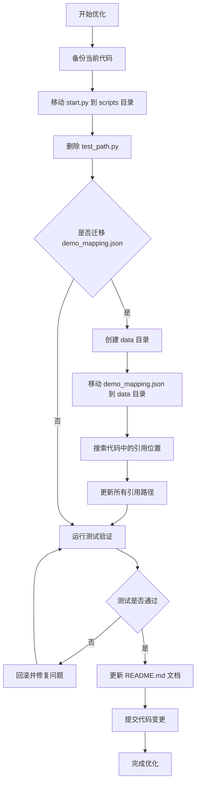

# 代码结构优化设计

## 背景

根据项目规范要求，核心源码应按模块组织在专用目录中，保持根目录结构清晰整洁。当前项目根目录存在测试类和工具类代码文件，需要进行结构优化整理。

## 问题识别

### 当前根目录文件分析

| 文件名 | 文件类型 | 当前位置 | 问题描述 |
|--------|---------|---------|---------|
| start.py | 启动脚本 | 根目录 | 交互式启动脚本，属于工具类代码 |
| test_path.py | 测试脚本 | 根目录 | 路径生成逻辑测试代码，属于临时测试文件 |
| demo_mapping.json | 数据文件 | 根目录 | Demo映射配置数据 |
| pyproject.toml | 配置文件 | 根目录 | 项目构建配置（合理） |
| .gitignore | 配置文件 | 根目录 | Git配置（合理） |
| README.md | 文档文件 | 根目录 | 项目文档（合理） |
| ABOUT.md | 文档文件 | 根目录 | 项目介绍（合理） |
| LICENSE | 许可文件 | 根目录 | 开源许可（合理） |

### 问题汇总

1. **start.py** - 交互式启动脚本（116行），包含完整的菜单交互逻辑，不应放在根目录
2. **test_path.py** - 临时测试文件（40行），用于测试路径生成逻辑，应移入测试目录或删除
3. **demo_mapping.json** - 数据配置文件（39.4KB），较大的JSON数据文件，建议移入专门的数据目录

## 优化方案

### 整体调整策略

根据项目现有目录结构和规范要求，进行如下调整：

#### 调整项一：start.py 处理

**问题分析**
- 功能定位：交互式启动脚本，提供菜单式操作界面
- 代码规模：116行，包含完整业务逻辑
- 当前问题：与项目核心模块不在同一层级，破坏根目录整洁性

**迁移方案**

| 调整方式 | 目标位置 | 理由 |
|---------|---------|------|
| 移入 scripts 目录 | scripts/start.py | scripts 目录已存在其他工具脚本（generate_demos.py、quick_generate.py等），功能定位一致 |

**使用方式调整**
- 原使用方式：`python start.py`
- 新使用方式：`python scripts/start.py`
- 文档更新：需要更新 README.md 中的启动说明

#### 调整项二：test_path.py 处理

**问题分析**
- 功能定位：路径生成逻辑测试代码
- 代码规模：40行，临时测试脚本
- 当前问题：测试代码不应放在根目录

**处理方案（二选一）**

| 方案 | 具体操作 | 适用场景 |
|------|---------|---------|
| 方案A：移入测试目录 | 移动到 tests/test_path.py | 该测试仍有保留价值，需要长期维护 |
| 方案B：直接删除 | 删除文件 | 该测试为一次性调试代码，已完成验证目的 |

**推荐方案**：方案B（直接删除）

理由：
- 文件内容为简单的路径计算验证逻辑
- 相关功能已在 tests/test_demo_manager.py 中有正式测试覆盖
- 属于临时调试代码，无长期保留价值

#### 调整项三：demo_mapping.json 处理

**问题分析**
- 功能定位：Demo与第三方库的映射配置数据
- 文件规模：39.4KB，较大的JSON数据文件
- 当前问题：数据文件与配置文件、文档文件混放

**迁移方案（可选优化）**

| 调整方式 | 目标位置 | 理由 |
|---------|---------|------|
| 创建数据目录 | data/demo_mapping.json | 将数据文件与配置文件分离，结构更清晰 |
| 保持现状 | 根目录 | 该文件为项目核心数据配置，根目录放置可接受 |

**推荐方案**：创建 data 目录并迁移

理由：
- 明确数据文件与配置文件的边界
- 便于未来扩展其他数据文件
- 提升根目录整洁度

**代码调整影响分析**

需要修改引用该文件的代码位置：
- 检索 `demo_mapping.json` 的引用位置
- 更新为新的相对路径 `data/demo_mapping.json`
- 可能涉及的模块：library_detector.py、library_manager.py

### 调整后根目录结构

```
根目录/
├── .git/
├── .gitignore
├── LICENSE
├── README.md
├── ABOUT.md
├── pyproject.toml
├── data/                    # 新增数据目录
│   └── demo_mapping.json   # 迁移的映射配置
├── opendemo/               # 核心源码目录
├── scripts/                # 工具脚本目录
│   ├── start.py           # 迁移的启动脚本
│   └── ...                # 其他脚本
└── tests/                  # 测试目录
```

## 实施步骤

### 步骤流程



### 详细步骤说明

| 步骤 | 操作内容 | 验证标准 |
|------|---------|---------|
| 1 | 移动 start.py 至 scripts 目录 | 文件成功移动，scripts 目录包含 start.py |
| 2 | 删除 test_path.py | 根目录不再包含 test_path.py |
| 3 | 创建 data 目录（可选） | data 目录创建成功 |
| 4 | 移动 demo_mapping.json（可选） | demo_mapping.json 位于 data 目录 |
| 5 | 搜索并更新引用路径（如执行步骤4） | 所有引用路径已更新为新路径 |
| 6 | 执行现有测试套件 | 所有测试用例通过 |
| 7 | 手动验证启动脚本 | `python scripts/start.py` 正常运行 |
| 8 | 更新 README.md 启动说明 | 文档中启动命令已更新 |

## 风险评估

### 潜在风险与缓解措施

| 风险项 | 影响程度 | 缓解措施 |
|--------|---------|---------|
| start.py 路径变更影响用户使用习惯 | 中 | 在 README.md 中明确说明新的启动方式，保留迁移说明 |
| demo_mapping.json 路径变更导致代码引用错误 | 高 | 通过全局搜索确保所有引用已更新，执行完整测试验证 |
| 测试文件删除后发现仍需使用 | 低 | 通过 Git 历史可随时恢复，且相关逻辑已在正式测试中覆盖 |

## 预期成果

### 优化效果

1. **根目录整洁度提升**：移除临时测试文件和工具脚本，仅保留必要的配置和文档文件
2. **目录结构更清晰**：各类文件按功能归类存放（源码、脚本、测试、数据、配置、文档）
3. **符合项目规范**：遵循"核心源码按模块组织，保持根目录清整"的开发规范
4. **便于后续维护**：明确的目录职责，降低新成员理解成本

### 成功标准

- 根目录仅包含：配置文件（pyproject.toml、.gitignore）、文档文件（README.md、ABOUT.md、LICENSE）、核心目录（opendemo、scripts、tests、data）
- 所有测试用例通过
- 启动脚本在新位置正常运行
- 文档已同步更新- 启动脚本在新位置正常运行
