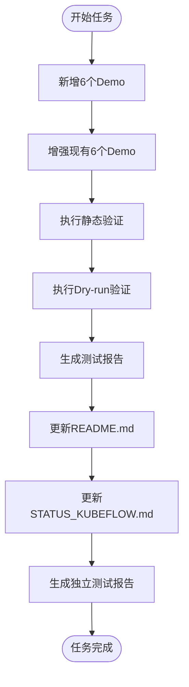
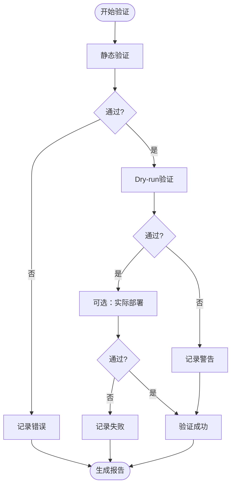

# KServe Demo 完善与测试验证设计

## 1. 项目背景

### 1.1 当前状态
项目已完成 Kubeflow 全部 36 个 Demo 的元数据创建，其中 KServe 组件包含 6 个基础 Demo：
- kserve-model-deployment (模型部署)
- kserve-custom-predictor (自定义预测器)
- kserve-canary-rollout (金丝雀发布)
- kserve-transformer-integration (Transformer集成)
- kserve-batch-inference (批量推理)
- kserve-gpu-inference (GPU推理)

### 1.2 待完成目标
1. 补充更多 KServe 典型场景 Demo（多模型部署、自动扩缩容、A/B测试等）
2. 增强现有 6 个 Demo 的完整性（补充 README 文档、配置清单、验证指南）
3. 完成 KServe Demo 的多层次测试验证
4. 更新项目相关文档（README.md、STATUS_KUBEFLOW.md、独立测试报告）

## 2. 功能需求

### 2.1 Demo 补充需求

#### 2.1.1 新增场景 Demo
需要新增以下典型 KServe 使用场景：

| Demo 名称 | 功能说明 | 难度 | 优先级 |
|----------|---------|------|--------|
| kserve-multi-model-serving | 多模型部署与管理 | intermediate | 高 |
| kserve-autoscaling-config | 自动扩缩容配置 | intermediate | 高 |
| kserve-ab-testing | A/B 测试部署策略 | advanced | 中 |
| kserve-model-monitoring | 模型监控与指标采集 | intermediate | 中 |
| kserve-request-logging | 请求日志记录 | beginner | 中 |
| kserve-explainer-integration | Explainer 可解释性集成 | advanced | 低 |

#### 2.1.2 现有 Demo 增强
为现有 6 个 Demo 补充完整内容：

**标准化内容结构**：
- `metadata.json` - 元数据（已存在，需审查）
- `README.md` - 8 章节完整文档
- `manifests/` - Kubernetes YAML 清单
- `scripts/` - 验证与测试脚本（可选）

**README.md 标准章节**：
1. 功能概述
2. 前置条件
3. 部署步骤
4. 验证方法
5. 常见问题
6. 清理资源
7. 参考资料
8. 版本兼容性

### 2.2 测试验证需求

#### 2.2.1 三层验证策略

**层次一：静态验证（必须）**
- YAML 语法正确性检查
- metadata.json 格式规范验证
- README.md 完整性检查（章节结构、关键字）
- 工具可用性检查（kubectl、helm 环境探测）

**层次二：Dry-run 验证（推荐）**
- 使用 `kubectl apply --dry-run=client` 验证资源定义
- 使用 `kubectl apply --dry-run=server` 验证服务端逻辑（需集群）
- 检查资源依赖关系完整性

**层次三：实际部署验证（可选）**
- 提供独立验证脚本供用户在真实 Kubernetes 集群执行
- 验证脚本包含：资源创建、健康检查、功能测试、资源清理
- 生成详细的验证报告

#### 2.2.2 验证流程设计


### 2.3 文档更新需求

#### 2.3.1 README.md 更新
需要更新主项目 README.md 的以下部分：

**Demo 统计表格**
- 自动统计 Kubernetes/kubeflow 下的 Demo 数量
- 更新 KServe 部分的 Demo 数量（从 6 增加到 12）
- 更新徽章中的总 Demo 数量

**Demo 清单部分**
- 在 "Kubeflow KServe（模型服务）" 章节补充新增 Demo
- 更新完整性状态标识（README 完整度、YAML 可用性）

#### 2.3.2 STATUS_KUBEFLOW.md 更新
需要更新以下内容：

**进度统计**
- 更新 KServe 组件 Demo 数量：6 → 12
- 更新总体进度统计
- 更新完成率

**各组件进度详情**
- KServe 部分列出所有 12 个 Demo
- 标注各 Demo 的完成状态（metadata/README/manifests）

**验证状态追踪**
- 新增验证状态列：静态验证、Dry-run、实际部署
- 记录验证时间和结果

#### 2.3.3 独立测试报告
创建独立的 KServe 测试报告文件 `check/kserve_test_report.md`：

**报告内容结构**：
- 测试概览（总数、通过率、测试时间）
- 各 Demo 测试详情表格
- 失败案例详细分析
- 环境信息（Kubernetes 版本、KServe 版本）
- 测试建议与改进方向

## 3. 技术方案

### 3.1 Demo 生成方案

#### 3.1.1 使用 CLI new 命令生成
对于新增的 6 个 Demo，通过现有 CLI 命令生成：

```bash
opendemo new kubernetes kubeflow kserve multi-model-serving --difficulty intermediate
opendemo new kubernetes kubeflow kserve autoscaling-config --difficulty intermediate
opendemo new kubernetes kubeflow kserve ab-testing --difficulty advanced
opendemo new kubernetes kubeflow kserve model-monitoring --difficulty intermediate
opendemo new kubernetes kubeflow kserve request-logging --difficulty beginner
opendemo new kubernetes kubeflow kserve explainer-integration --difficulty advanced
```

**生成路径**：`opendemo_output/kubernetes/kubeflow/<demo-name>/`

**生成内容**：
- metadata.json（AI 生成）
- README.md（AI 生成，包含标准 8 章节）
- manifests/ 目录（AI 生成示例 YAML）

#### 3.1.2 现有 Demo 内容增强
对于已有的 6 个 Demo，采用以下策略：

**策略一：保留元数据，补充文档**
- 保留现有 metadata.json
- 使用 AI 生成完整的 README.md（8 章节结构）
- 生成标准化的 YAML 清单文件

**策略二：审查与优化**
- 审查 metadata.json 的准确性（描述、标签、学习目标）
- 确保 README.md 内容与 metadata.json 一致
- 验证 YAML 清单的语法正确性

### 3.2 验证机制实现

#### 3.2.1 扩展 demo_verifier.py
在现有 `DemoVerifier` 类中扩展 `_verify_kubernetes` 方法，实现三层验证：

**现有能力**：
- YAML 语法检查（使用 pyyaml）
- kubectl/helm 工具可用性检查
- README.md 完整性检查

**需要新增**：
- Dry-run 验证逻辑
- 资源依赖关系检查
- 更详细的验证报告生成

**关键验证逻辑**：

```
层次一验证流程：
1. 扫描 manifests/ 目录下所有 YAML 文件
2. 使用 yaml.safe_load_all() 解析多文档 YAML
3. 检查必需字段（apiVersion, kind, metadata.name）
4. 检查 README.md 章节结构（使用正则匹配标题）
5. 检查 metadata.json 必需字段

层次二验证流程（可选）：
1. 检测 kubectl 命令可用性
2. 遍历 YAML 文件执行 kubectl apply --dry-run=client
3. 记录验证输出与错误
4. 如果检测到集群连接，执行 --dry-run=server

层次三验证流程（可选，需用户环境）：
1. 提供独立验证脚本模板
2. 脚本包含：前置检查、资源创建、功能测试、清理
3. 用户在真实环境执行脚本
4. 收集验证日志反馈
```

#### 3.2.2 批量验证脚本
创建专用的 KServe 验证脚本 `scripts/verify_kserve_demos.py`：

**功能**：
- 批量验证所有 KServe Demo
- 生成详细的验证报告
- 支持指定验证层次（static/dry-run/full）

**输出**：
- JSON 格式的验证结果
- Markdown 格式的测试报告
- 验证日志文件

### 3.3 文档更新方案

#### 3.3.1 README.md 自动更新
利用现有 `ReadmeUpdater` 类：

**更新逻辑**：
1. 扫描 `opendemo_output/kubernetes/kubeflow/` 目录
2. 统计 KServe 相关 Demo 数量（demo 名称包含 kserve）
3. 更新 Demo 统计表格
4. 更新徽章数字
5. 更新 KServe 章节的 Demo 列表

**扩展需求**：
- 在 `collect_stats()` 方法中增加 kubeflow 工具的统计
- 按组件（Dashboard/Notebooks/Pipelines/KServe等）分类统计
- 生成更详细的 Demo 清单表格

#### 3.3.2 STATUS_KUBEFLOW.md 更新
手动更新或脚本辅助：

**更新内容**：
- 总体进度数字：36 → 42（新增 6 个）
- KServe 部分：列出全部 12 个 Demo
- 新增验证状态表格
- 更新更新历史记录

#### 3.3.3 测试报告生成
创建报告生成模块 `generate_kserve_report.py`：

**报告数据来源**：
- 验证结果 JSON 文件
- Demo 元数据统计
- 测试执行日志

**报告格式**：
- Markdown 表格展示测试结果
- 饼图/柱状图（可选，使用 Mermaid）
- 详细的失败分析

### 3.4 工作流整合

#### 3.4.1 完整任务执行流程


#### 3.4.2 质量保证检查点

**检查点 1：Demo 生成后**
- 验证目录结构正确性
- 检查 metadata.json 格式
- 确认 README.md 存在且有内容

**检查点 2：验证执行后**
- 所有 Demo 通过静态验证
- 至少 80% Demo 通过 Dry-run 验证
- 记录所有验证警告和错误

**检查点 3：文档更新后**
- README.md 统计数字正确
- STATUS_KUBEFLOW.md 进度一致
- 测试报告内容完整

## 4. 数据模型

### 4.1 验证结果数据结构

```
KServeVerificationResult:
  demo_name: string
  demo_path: string
  verification_layers:
    static:
      status: pass/fail/skip
      checks:
        - yaml_syntax: pass/fail
        - metadata_format: pass/fail
        - readme_completeness: pass/fail
      errors: [string]
      warnings: [string]
    dry_run:
      status: pass/fail/skip
      checks:
        - client_validation: pass/fail
        - server_validation: pass/fail
      errors: [string]
      warnings: [string]
    deployment:
      status: pass/fail/skip
      timestamp: datetime
      environment: string
      errors: [string]
      logs: string
  overall_status: pass/fail/partial
  verified_at: datetime
```

### 4.2 测试报告数据结构

```
KServeTestReport:
  report_metadata:
    generated_at: datetime
    total_demos: integer
    verified_count: integer
    pass_rate: float
  environment:
    kubernetes_version: string
    kserve_version: string
    test_platform: string
  demo_results:
    - demo_name: string
      static_verification: pass/fail
      dry_run_verification: pass/fail/skip
      deployment_verification: pass/fail/skip
      issues: [string]
  summary:
    fully_verified: integer
    partially_verified: integer
    failed: integer
  recommendations: [string]
```

## 5. 文件清单

### 5.1 新增文件

| 文件路径 | 用途 | 优先级 |
|---------|------|--------|
| `scripts/verify_kserve_demos.py` | KServe 批量验证脚本 | 高 |
| `scripts/generate_kserve_report.py` | 测试报告生成脚本 | 高 |
| `check/kserve_test_report.md` | KServe 独立测试报告 | 高 |
| `opendemo_output/kubernetes/kubeflow/kserve-multi-model-serving/` | 新增 Demo 目录 | 高 |
| `opendemo_output/kubernetes/kubeflow/kserve-autoscaling-config/` | 新增 Demo 目录 | 高 |
| `opendemo_output/kubernetes/kubeflow/kserve-ab-testing/` | 新增 Demo 目录 | 中 |
| `opendemo_output/kubernetes/kubeflow/kserve-model-monitoring/` | 新增 Demo 目录 | 中 |
| `opendemo_output/kubernetes/kubeflow/kserve-request-logging/` | 新增 Demo 目录 | 中 |
| `opendemo_output/kubernetes/kubeflow/kserve-explainer-integration/` | 新增 Demo 目录 | 低 |

### 5.2 修改文件

| 文件路径 | 修改内容 | 优先级 |
|---------|---------|--------|
| `opendemo/core/demo_verifier.py` | 扩展 `_verify_kubernetes` 方法，增加 Dry-run 验证 | 高 |
| `opendemo/core/readme_updater.py` | 扩展 kubeflow 组件统计逻辑 | 高 |
| `README.md` | 更新 KServe Demo 清单与统计 | 高 |
| `STATUS_KUBEFLOW.md` | 更新进度与验证状态 | 高 |
| `opendemo_output/kubernetes/kubeflow/kserve-model-deployment/README.md` | 补充完整文档 | 中 |
| `opendemo_output/kubernetes/kubeflow/kserve-custom-predictor/README.md` | 补充完整文档 | 中 |
| `opendemo_output/kubernetes/kubeflow/kserve-canary-rollout/README.md` | 补充完整文档 | 中 |
| `opendemo_output/kubernetes/kubeflow/kserve-transformer-integration/README.md` | 补充完整文档 | 中 |
| `opendemo_output/kubernetes/kubeflow/kserve-batch-inference/README.md` | 补充完整文档 | 中 |
| `opendemo_output/kubernetes/kubeflow/kserve-gpu-inference/README.md` | 补充完整文档 | 中 |

## 6. 实施步骤

### 6.1 阶段一：Demo 内容完善（优先级：高）

**步骤 1.1：新增 Demo 生成**
- 执行 CLI new 命令生成 6 个新 Demo
- 验证生成的文件结构完整性
- 审查 AI 生成的 README.md 质量

**步骤 1.2：现有 Demo 增强**
- 逐个审查现有 6 个 Demo 的 metadata.json
- 为缺失 README.md 的 Demo 生成完整文档
- 创建标准化的 YAML 清单文件

**预期产出**：
- 12 个完整的 KServe Demo
- 每个 Demo 包含：metadata.json、README.md、manifests/

### 6.2 阶段二：验证机制实现（优先级：高）

**步骤 2.1：扩展验证器**
- 修改 `demo_verifier.py` 的 `_verify_kubernetes` 方法
- 实现静态验证增强逻辑
- 实现 Dry-run 验证逻辑
- 增强验证报告生成

**步骤 2.2：创建批量验证脚本**
- 编写 `scripts/verify_kserve_demos.py`
- 实现批量扫描与验证
- 生成验证结果 JSON 文件

**步骤 2.3：执行验证**
- 对全部 12 个 KServe Demo 执行静态验证
- 对支持的 Demo 执行 Dry-run 验证
- 记录验证结果与问题

**预期产出**：
- 扩展的验证器代码
- 批量验证脚本
- 验证结果 JSON 文件

### 6.3 阶段三：测试报告生成（优先级：高）

**步骤 3.1：创建报告生成器**
- 编写 `scripts/generate_kserve_report.py`
- 实现数据统计与分析逻辑
- 实现 Markdown 报告生成

**步骤 3.2：生成测试报告**
- 执行报告生成脚本
- 生成 `check/kserve_test_report.md`
- 审查报告内容完整性

**预期产出**：
- 报告生成脚本
- 完整的 KServe 测试报告文档

### 6.4 阶段四：文档更新（优先级：高）

**步骤 4.1：更新 README.md**
- 运行 `ReadmeUpdater` 更新统计数据
- 手动补充 KServe 章节的 Demo 详情
- 更新徽章数字

**步骤 4.2：更新 STATUS_KUBEFLOW.md**
- 更新总体进度统计
- 更新 KServe 部分的 Demo 列表
- 新增验证状态表格
- 记录更新历史

**步骤 4.3：最终审查**
- 检查文档一致性
- 验证所有链接有效性
- 确认数字统计准确

**预期产出**：
- 更新的 README.md
- 更新的 STATUS_KUBEFLOW.md
- 文档一致性检查报告

## 7. 验收标准

### 7.1 功能完整性

| 验收项 | 标准 | 验证方式 |
|-------|------|---------|
| Demo 数量 | KServe Demo 总数达到 12 个 | 目录扫描统计 |
| 文件结构 | 每个 Demo 包含 metadata.json、README.md | 文件存在性检查 |
| README 完整性 | README 包含标准 8 章节 | 章节结构验证 |
| YAML 有效性 | 所有 YAML 文件语法正确 | yaml.safe_load 验证 |

### 7.2 验证覆盖率

| 验收项 | 标准 | 验证方式 |
|-------|------|---------|
| 静态验证 | 100% Demo 通过静态验证 | 验证脚本执行结果 |
| Dry-run 验证 | ≥80% Demo 通过 Dry-run 验证 | 验证脚本执行结果 |
| 验证报告 | 生成完整的测试报告文档 | 报告文件存在且内容完整 |

### 7.3 文档一致性

| 验收项 | 标准 | 验证方式 |
|-------|------|---------|
| README.md 统计 | Demo 统计数字正确（285+6=291） | 手动核对 |
| STATUS 一致性 | STATUS_KUBEFLOW.md 进度与实际一致 | 交叉验证 |
| 测试报告 | 独立测试报告存在且完整 | 报告内容审查 |

### 7.4 质量标准

| 验收项 | 标准 | 验证方式 |
|-------|------|---------|
| 代码规范 | Python 代码符合 PEP8 规范 | pylint/flake8 检查 |
| 文档规范 | Markdown 文档格式规范 | markdownlint 检查 |
| 错误处理 | 验证脚本具备异常处理机制 | 异常场景测试 |

## 8. 风险与应对

### 8.1 技术风险

| 风险 | 影响 | 概率 | 应对措施 |
|-----|------|------|---------|
| AI 生成内容质量不稳定 | Demo 文档质量参差不齐 | 中 | 人工审查关键 Demo，建立内容质量检查清单 |
| Dry-run 验证依赖集群环境 | 无集群环境无法完成验证 | 中 | 提供静态验证作为基础保障，Dry-run 作为可选增强 |
| YAML 清单复杂度高 | 生成的 YAML 可能不可用 | 中 | 提供简化示例，标注高级配置为可选 |
| 验证脚本兼容性问题 | 不同环境执行结果不一致 | 低 | 明确环境依赖，提供环境检查功能 |

### 8.2 进度风险

| 风险 | 影响 | 概率 | 应对措施 |
|-----|------|------|---------|
| Demo 生成耗时超预期 | 整体进度延迟 | 中 | 分批生成，优先完成高优先级 Demo |
| 验证发现大量问题 | 需要返工修复 | 中 | 设置缓冲时间，预留问题修复周期 |
| 文档更新遗漏 | 文档不一致 | 低 | 使用检查清单，交叉验证 |

### 8.3 质量风险

| 风险 | 影响 | 概率 | 应对措施 |
|-----|------|------|---------|
| Demo 实际可用性差 | 用户无法成功运行 | 中 | 提供详细的前置条件说明和故障排查指南 |
| 测试覆盖不足 | 未发现潜在问题 | 低 | 采用三层验证策略，逐层深入 |
| 版本兼容性问题 | Demo 在新版本不可用 | 低 | 明确版本依赖，定期更新 |

## 9. 后续优化方向

### 9.1 短期优化（1-2周）
- 为高优先级 Demo 添加实际部署验证脚本
- 补充更多 KServe 高级场景（如 Model Mesh 集成）
- 收集用户反馈优化 Demo 内容

### 9.2 中期优化（1-2个月）
- 建立持续集成验证流程（CI/CD）
- 开发自动化测试套件
- 添加视频教程或可视化说明

### 9.3 长期优化（持续）
- 跟踪 KServe 版本更新，维护 Demo 兼容性
- 扩展到其他 Kubeflow 组件的深度验证
- 建立社区贡献机制，接受外部 Demo 贡献
| kserve-model-monitoring | 模型监控与指标采集 | intermediate | 中 |
| kserve-request-logging | 请求日志记录 | beginner | 中 |
| kserve-explainer-integration | Explainer 可解释性集成 | advanced | 低 |

#### 2.1.2 现有 Demo 增强
为现有 6 个 Demo 补充完整内容：

**标准化内容结构**：
- `metadata.json` - 元数据（已存在，需审查）
- `README.md` - 8 章节完整文档
- `manifests/` - Kubernetes YAML 清单
- `scripts/` - 验证与测试脚本（可选）

**README.md 标准章节**：
1. 功能概述
2. 前置条件
3. 部署步骤
4. 验证方法
5. 常见问题
6. 清理资源
7. 参考资料
8. 版本兼容性

### 2.2 测试验证需求

#### 2.2.1 三层验证策略

**层次一：静态验证（必须）**
- YAML 语法正确性检查
- metadata.json 格式规范验证
- README.md 完整性检查（章节结构、关键字）
- 工具可用性检查（kubectl、helm 环境探测）

**层次二：Dry-run 验证（推荐）**
- 使用 `kubectl apply --dry-run=client` 验证资源定义
- 使用 `kubectl apply --dry-run=server` 验证服务端逻辑（需集群）
- 检查资源依赖关系完整性

**层次三：实际部署验证（可选）**
- 提供独立验证脚本供用户在真实 Kubernetes 集群执行
- 验证脚本包含：资源创建、健康检查、功能测试、资源清理
- 生成详细的验证报告

#### 2.2.2 验证流程设计


### 2.3 文档更新需求

#### 2.3.1 README.md 更新
需要更新主项目 README.md 的以下部分：

**Demo 统计表格**
- 自动统计 Kubernetes/kubeflow 下的 Demo 数量
- 更新 KServe 部分的 Demo 数量（从 6 增加到 12）
- 更新徽章中的总 Demo 数量

**Demo 清单部分**
- 在 "Kubeflow KServe（模型服务）" 章节补充新增 Demo
- 更新完整性状态标识（README 完整度、YAML 可用性）

#### 2.3.2 STATUS_KUBEFLOW.md 更新
需要更新以下内容：

**进度统计**
- 更新 KServe 组件 Demo 数量：6 → 12
- 更新总体进度统计
- 更新完成率

**各组件进度详情**
- KServe 部分列出所有 12 个 Demo
- 标注各 Demo 的完成状态（metadata/README/manifests）

**验证状态追踪**
- 新增验证状态列：静态验证、Dry-run、实际部署
- 记录验证时间和结果

#### 2.3.3 独立测试报告
创建独立的 KServe 测试报告文件 `check/kserve_test_report.md`：

**报告内容结构**：
- 测试概览（总数、通过率、测试时间）
- 各 Demo 测试详情表格
- 失败案例详细分析
- 环境信息（Kubernetes 版本、KServe 版本）
- 测试建议与改进方向

## 3. 技术方案

### 3.1 Demo 生成方案

#### 3.1.1 使用 CLI new 命令生成
对于新增的 6 个 Demo，通过现有 CLI 命令生成：

```bash
opendemo new kubernetes kubeflow kserve multi-model-serving --difficulty intermediate
opendemo new kubernetes kubeflow kserve autoscaling-config --difficulty intermediate
opendemo new kubernetes kubeflow kserve ab-testing --difficulty advanced
opendemo new kubernetes kubeflow kserve model-monitoring --difficulty intermediate
opendemo new kubernetes kubeflow kserve request-logging --difficulty beginner
opendemo new kubernetes kubeflow kserve explainer-integration --difficulty advanced
```

**生成路径**：`opendemo_output/kubernetes/kubeflow/<demo-name>/`

**生成内容**：
- metadata.json（AI 生成）
- README.md（AI 生成，包含标准 8 章节）
- manifests/ 目录（AI 生成示例 YAML）

#### 3.1.2 现有 Demo 内容增强
对于已有的 6 个 Demo，采用以下策略：

**策略一：保留元数据，补充文档**
- 保留现有 metadata.json
- 使用 AI 生成完整的 README.md（8 章节结构）
- 生成标准化的 YAML 清单文件

**策略二：审查与优化**
- 审查 metadata.json 的准确性（描述、标签、学习目标）
- 确保 README.md 内容与 metadata.json 一致
- 验证 YAML 清单的语法正确性

### 3.2 验证机制实现

#### 3.2.1 扩展 demo_verifier.py
在现有 `DemoVerifier` 类中扩展 `_verify_kubernetes` 方法，实现三层验证：

**现有能力**：
- YAML 语法检查（使用 pyyaml）
- kubectl/helm 工具可用性检查
- README.md 完整性检查

**需要新增**：
- Dry-run 验证逻辑
- 资源依赖关系检查
- 更详细的验证报告生成

**关键验证逻辑**：

```
层次一验证流程：
1. 扫描 manifests/ 目录下所有 YAML 文件
2. 使用 yaml.safe_load_all() 解析多文档 YAML
3. 检查必需字段（apiVersion, kind, metadata.name）
4. 检查 README.md 章节结构（使用正则匹配标题）
5. 检查 metadata.json 必需字段

层次二验证流程（可选）：
1. 检测 kubectl 命令可用性
2. 遍历 YAML 文件执行 kubectl apply --dry-run=client
3. 记录验证输出与错误
4. 如果检测到集群连接，执行 --dry-run=server

层次三验证流程（可选，需用户环境）：
1. 提供独立验证脚本模板
2. 脚本包含：前置检查、资源创建、功能测试、清理
3. 用户在真实环境执行脚本
4. 收集验证日志反馈
```

#### 3.2.2 批量验证脚本
创建专用的 KServe 验证脚本 `scripts/verify_kserve_demos.py`：

**功能**：
- 批量验证所有 KServe Demo
- 生成详细的验证报告
- 支持指定验证层次（static/dry-run/full）

**输出**：
- JSON 格式的验证结果
- Markdown 格式的测试报告
- 验证日志文件

### 3.3 文档更新方案

#### 3.3.1 README.md 自动更新
利用现有 `ReadmeUpdater` 类：

**更新逻辑**：
1. 扫描 `opendemo_output/kubernetes/kubeflow/` 目录
2. 统计 KServe 相关 Demo 数量（demo 名称包含 kserve）
3. 更新 Demo 统计表格
4. 更新徽章数字
5. 更新 KServe 章节的 Demo 列表

**扩展需求**：
- 在 `collect_stats()` 方法中增加 kubeflow 工具的统计
- 按组件（Dashboard/Notebooks/Pipelines/KServe等）分类统计
- 生成更详细的 Demo 清单表格

#### 3.3.2 STATUS_KUBEFLOW.md 更新
手动更新或脚本辅助：

**更新内容**：
- 总体进度数字：36 → 42（新增 6 个）
- KServe 部分：列出全部 12 个 Demo
- 新增验证状态表格
- 更新更新历史记录

#### 3.3.3 测试报告生成
创建报告生成模块 `generate_kserve_report.py`：

**报告数据来源**：
- 验证结果 JSON 文件
- Demo 元数据统计
- 测试执行日志

**报告格式**：
- Markdown 表格展示测试结果
- 饼图/柱状图（可选，使用 Mermaid）
- 详细的失败分析

### 3.4 工作流整合

#### 3.4.1 完整任务执行流程



#### 3.4.2 质量保证检查点

**检查点 1：Demo 生成后**
- 验证目录结构正确性
- 检查 metadata.json 格式
- 确认 README.md 存在且有内容

**检查点 2：验证执行后**
- 所有 Demo 通过静态验证
- 至少 80% Demo 通过 Dry-run 验证
- 记录所有验证警告和错误

**检查点 3：文档更新后**
- README.md 统计数字正确
- STATUS_KUBEFLOW.md 进度一致
- 测试报告内容完整

## 4. 数据模型

### 4.1 验证结果数据结构

```
KServeVerificationResult:
  demo_name: string
  demo_path: string
  verification_layers:
    static:
      status: pass/fail/skip
      checks:
        - yaml_syntax: pass/fail
        - metadata_format: pass/fail
        - readme_completeness: pass/fail
      errors: [string]
      warnings: [string]
    dry_run:
      status: pass/fail/skip
      checks:
        - client_validation: pass/fail
        - server_validation: pass/fail
      errors: [string]
      warnings: [string]
    deployment:
      status: pass/fail/skip
      timestamp: datetime
      environment: string
      errors: [string]
      logs: string
  overall_status: pass/fail/partial
  verified_at: datetime
```

### 4.2 测试报告数据结构

```
KServeTestReport:
  report_metadata:
    generated_at: datetime
    total_demos: integer
    verified_count: integer
    pass_rate: float
  environment:
    kubernetes_version: string
    kserve_version: string
    test_platform: string
  demo_results:
    - demo_name: string
      static_verification: pass/fail
      dry_run_verification: pass/fail/skip
      deployment_verification: pass/fail/skip
      issues: [string]
  summary:
    fully_verified: integer
    partially_verified: integer
    failed: integer
  recommendations: [string]
```

## 5. 文件清单

### 5.1 新增文件

| 文件路径 | 用途 | 优先级 |
|---------|------|--------|
| `scripts/verify_kserve_demos.py` | KServe 批量验证脚本 | 高 |
| `scripts/generate_kserve_report.py` | 测试报告生成脚本 | 高 |
| `check/kserve_test_report.md` | KServe 独立测试报告 | 高 |
| `opendemo_output/kubernetes/kubeflow/kserve-multi-model-serving/` | 新增 Demo 目录 | 高 |
| `opendemo_output/kubernetes/kubeflow/kserve-autoscaling-config/` | 新增 Demo 目录 | 高 |
| `opendemo_output/kubernetes/kubeflow/kserve-ab-testing/` | 新增 Demo 目录 | 中 |
| `opendemo_output/kubernetes/kubeflow/kserve-model-monitoring/` | 新增 Demo 目录 | 中 |
| `opendemo_output/kubernetes/kubeflow/kserve-request-logging/` | 新增 Demo 目录 | 中 |
| `opendemo_output/kubernetes/kubeflow/kserve-explainer-integration/` | 新增 Demo 目录 | 低 |

### 5.2 修改文件

| 文件路径 | 修改内容 | 优先级 |
|---------|---------|--------|
| `opendemo/core/demo_verifier.py` | 扩展 `_verify_kubernetes` 方法，增加 Dry-run 验证 | 高 |
| `opendemo/core/readme_updater.py` | 扩展 kubeflow 组件统计逻辑 | 高 |
| `README.md` | 更新 KServe Demo 清单与统计 | 高 |
| `STATUS_KUBEFLOW.md` | 更新进度与验证状态 | 高 |
| `opendemo_output/kubernetes/kubeflow/kserve-model-deployment/README.md` | 补充完整文档 | 中 |
| `opendemo_output/kubernetes/kubeflow/kserve-custom-predictor/README.md` | 补充完整文档 | 中 |
| `opendemo_output/kubernetes/kubeflow/kserve-canary-rollout/README.md` | 补充完整文档 | 中 |
| `opendemo_output/kubernetes/kubeflow/kserve-transformer-integration/README.md` | 补充完整文档 | 中 |
| `opendemo_output/kubernetes/kubeflow/kserve-batch-inference/README.md` | 补充完整文档 | 中 |
| `opendemo_output/kubernetes/kubeflow/kserve-gpu-inference/README.md` | 补充完整文档 | 中 |

## 6. 实施步骤

### 6.1 阶段一：Demo 内容完善（优先级：高）

**步骤 1.1：新增 Demo 生成**
- 执行 CLI new 命令生成 6 个新 Demo
- 验证生成的文件结构完整性
- 审查 AI 生成的 README.md 质量

**步骤 1.2：现有 Demo 增强**
- 逐个审查现有 6 个 Demo 的 metadata.json
- 为缺失 README.md 的 Demo 生成完整文档
- 创建标准化的 YAML 清单文件

**预期产出**：
- 12 个完整的 KServe Demo
- 每个 Demo 包含：metadata.json、README.md、manifests/

### 6.2 阶段二：验证机制实现（优先级：高）

**步骤 2.1：扩展验证器**
- 修改 `demo_verifier.py` 的 `_verify_kubernetes` 方法
- 实现静态验证增强逻辑
- 实现 Dry-run 验证逻辑
- 增强验证报告生成

**步骤 2.2：创建批量验证脚本**
- 编写 `scripts/verify_kserve_demos.py`
- 实现批量扫描与验证
- 生成验证结果 JSON 文件

**步骤 2.3：执行验证**
- 对全部 12 个 KServe Demo 执行静态验证
- 对支持的 Demo 执行 Dry-run 验证
- 记录验证结果与问题

**预期产出**：
- 扩展的验证器代码
- 批量验证脚本
- 验证结果 JSON 文件

### 6.3 阶段三：测试报告生成（优先级：高）

**步骤 3.1：创建报告生成器**
- 编写 `scripts/generate_kserve_report.py`
- 实现数据统计与分析逻辑
- 实现 Markdown 报告生成

**步骤 3.2：生成测试报告**
- 执行报告生成脚本
- 生成 `check/kserve_test_report.md`
- 审查报告内容完整性

**预期产出**：
- 报告生成脚本
- 完整的 KServe 测试报告文档

### 6.4 阶段四：文档更新（优先级：高）

**步骤 4.1：更新 README.md**
- 运行 `ReadmeUpdater` 更新统计数据
- 手动补充 KServe 章节的 Demo 详情
- 更新徽章数字

**步骤 4.2：更新 STATUS_KUBEFLOW.md**
- 更新总体进度统计
- 更新 KServe 部分的 Demo 列表
- 新增验证状态表格
- 记录更新历史

**步骤 4.3：最终审查**
- 检查文档一致性
- 验证所有链接有效性
- 确认数字统计准确

**预期产出**：
- 更新的 README.md
- 更新的 STATUS_KUBEFLOW.md
- 文档一致性检查报告

## 7. 验收标准

### 7.1 功能完整性

| 验收项 | 标准 | 验证方式 |
|-------|------|---------|
| Demo 数量 | KServe Demo 总数达到 12 个 | 目录扫描统计 |
| 文件结构 | 每个 Demo 包含 metadata.json、README.md | 文件存在性检查 |
| README 完整性 | README 包含标准 8 章节 | 章节结构验证 |
| YAML 有效性 | 所有 YAML 文件语法正确 | yaml.safe_load 验证 |

### 7.2 验证覆盖率

| 验收项 | 标准 | 验证方式 |
|-------|------|---------|
| 静态验证 | 100% Demo 通过静态验证 | 验证脚本执行结果 |
| Dry-run 验证 | ≥80% Demo 通过 Dry-run 验证 | 验证脚本执行结果 |
| 验证报告 | 生成完整的测试报告文档 | 报告文件存在且内容完整 |

### 7.3 文档一致性

| 验收项 | 标准 | 验证方式 |
|-------|------|---------|
| README.md 统计 | Demo 统计数字正确（285+6=291） | 手动核对 |
| STATUS 一致性 | STATUS_KUBEFLOW.md 进度与实际一致 | 交叉验证 |
| 测试报告 | 独立测试报告存在且完整 | 报告内容审查 |

### 7.4 质量标准

| 验收项 | 标准 | 验证方式 |
|-------|------|---------|
| 代码规范 | Python 代码符合 PEP8 规范 | pylint/flake8 检查 |
| 文档规范 | Markdown 文档格式规范 | markdownlint 检查 |
| 错误处理 | 验证脚本具备异常处理机制 | 异常场景测试 |

## 8. 风险与应对

### 8.1 技术风险

| 风险 | 影响 | 概率 | 应对措施 |
|-----|------|------|---------|
| AI 生成内容质量不稳定 | Demo 文档质量参差不齐 | 中 | 人工审查关键 Demo，建立内容质量检查清单 |
| Dry-run 验证依赖集群环境 | 无集群环境无法完成验证 | 中 | 提供静态验证作为基础保障，Dry-run 作为可选增强 |
| YAML 清单复杂度高 | 生成的 YAML 可能不可用 | 中 | 提供简化示例，标注高级配置为可选 |
| 验证脚本兼容性问题 | 不同环境执行结果不一致 | 低 | 明确环境依赖，提供环境检查功能 |

### 8.2 进度风险

| 风险 | 影响 | 概率 | 应对措施 |
|-----|------|------|---------|
| Demo 生成耗时超预期 | 整体进度延迟 | 中 | 分批生成，优先完成高优先级 Demo |
| 验证发现大量问题 | 需要返工修复 | 中 | 设置缓冲时间，预留问题修复周期 |
| 文档更新遗漏 | 文档不一致 | 低 | 使用检查清单，交叉验证 |

### 8.3 质量风险

| 风险 | 影响 | 概率 | 应对措施 |
|-----|------|------|---------|
| Demo 实际可用性差 | 用户无法成功运行 | 中 | 提供详细的前置条件说明和故障排查指南 |
| 测试覆盖不足 | 未发现潜在问题 | 低 | 采用三层验证策略，逐层深入 |
| 版本兼容性问题 | Demo 在新版本不可用 | 低 | 明确版本依赖，定期更新 |

## 9. 后续优化方向

### 9.1 短期优化（1-2周）
- 为高优先级 Demo 添加实际部署验证脚本
- 补充更多 KServe 高级场景（如 Model Mesh 集成）
- 收集用户反馈优化 Demo 内容

### 9.2 中期优化（1-2个月）
- 建立持续集成验证流程（CI/CD）
- 开发自动化测试套件
- 添加视频教程或可视化说明

### 9.3 长期优化（持续）
- 跟踪 KServe 版本更新，维护 Demo 兼容性
- 扩展到其他 Kubeflow 组件的深度验证
- 建立社区贡献机制，接受外部 Demo 贡献
| kserve-model-monitoring | 模型监控与指标采集 | intermediate | 中 |
| kserve-request-logging | 请求日志记录 | beginner | 中 |
| kserve-explainer-integration | Explainer 可解释性集成 | advanced | 低 |

#### 2.1.2 现有 Demo 增强
为现有 6 个 Demo 补充完整内容：

**标准化内容结构**：
- `metadata.json` - 元数据（已存在，需审查）
- `README.md` - 8 章节完整文档
- `manifests/` - Kubernetes YAML 清单
- `scripts/` - 验证与测试脚本（可选）

**README.md 标准章节**：
1. 功能概述
2. 前置条件
3. 部署步骤
4. 验证方法
5. 常见问题
6. 清理资源
7. 参考资料
8. 版本兼容性

### 2.2 测试验证需求

#### 2.2.1 三层验证策略

**层次一：静态验证（必须）**
- YAML 语法正确性检查
- metadata.json 格式规范验证
- README.md 完整性检查（章节结构、关键字）
- 工具可用性检查（kubectl、helm 环境探测）

**层次二：Dry-run 验证（推荐）**
- 使用 `kubectl apply --dry-run=client` 验证资源定义
- 使用 `kubectl apply --dry-run=server` 验证服务端逻辑（需集群）
- 检查资源依赖关系完整性

**层次三：实际部署验证（可选）**
- 提供独立验证脚本供用户在真实 Kubernetes 集群执行
- 验证脚本包含：资源创建、健康检查、功能测试、资源清理
- 生成详细的验证报告

#### 2.2.2 验证流程设计



### 2.3 文档更新需求

#### 2.3.1 README.md 更新
需要更新主项目 README.md 的以下部分：

**Demo 统计表格**
- 自动统计 Kubernetes/kubeflow 下的 Demo 数量
- 更新 KServe 部分的 Demo 数量（从 6 增加到 12）
- 更新徽章中的总 Demo 数量

**Demo 清单部分**
- 在 "Kubeflow KServe（模型服务）" 章节补充新增 Demo
- 更新完整性状态标识（README 完整度、YAML 可用性）

#### 2.3.2 STATUS_KUBEFLOW.md 更新
需要更新以下内容：

**进度统计**
- 更新 KServe 组件 Demo 数量：6 → 12
- 更新总体进度统计
- 更新完成率

**各组件进度详情**
- KServe 部分列出所有 12 个 Demo
- 标注各 Demo 的完成状态（metadata/README/manifests）

**验证状态追踪**
- 新增验证状态列：静态验证、Dry-run、实际部署
- 记录验证时间和结果

#### 2.3.3 独立测试报告
创建独立的 KServe 测试报告文件 `check/kserve_test_report.md`：

**报告内容结构**：
- 测试概览（总数、通过率、测试时间）
- 各 Demo 测试详情表格
- 失败案例详细分析
- 环境信息（Kubernetes 版本、KServe 版本）
- 测试建议与改进方向

## 3. 技术方案

### 3.1 Demo 生成方案

#### 3.1.1 使用 CLI new 命令生成
对于新增的 6 个 Demo，通过现有 CLI 命令生成：

```bash
opendemo new kubernetes kubeflow kserve multi-model-serving --difficulty intermediate
opendemo new kubernetes kubeflow kserve autoscaling-config --difficulty intermediate
opendemo new kubernetes kubeflow kserve ab-testing --difficulty advanced
opendemo new kubernetes kubeflow kserve model-monitoring --difficulty intermediate
opendemo new kubernetes kubeflow kserve request-logging --difficulty beginner
opendemo new kubernetes kubeflow kserve explainer-integration --difficulty advanced
```

**生成路径**：`opendemo_output/kubernetes/kubeflow/<demo-name>/`

**生成内容**：
- metadata.json（AI 生成）
- README.md（AI 生成，包含标准 8 章节）
- manifests/ 目录（AI 生成示例 YAML）

#### 3.1.2 现有 Demo 内容增强
对于已有的 6 个 Demo，采用以下策略：

**策略一：保留元数据，补充文档**
- 保留现有 metadata.json
- 使用 AI 生成完整的 README.md（8 章节结构）
- 生成标准化的 YAML 清单文件

**策略二：审查与优化**
- 审查 metadata.json 的准确性（描述、标签、学习目标）
- 确保 README.md 内容与 metadata.json 一致
- 验证 YAML 清单的语法正确性

### 3.2 验证机制实现

#### 3.2.1 扩展 demo_verifier.py
在现有 `DemoVerifier` 类中扩展 `_verify_kubernetes` 方法，实现三层验证：

**现有能力**：
- YAML 语法检查（使用 pyyaml）
- kubectl/helm 工具可用性检查
- README.md 完整性检查

**需要新增**：
- Dry-run 验证逻辑
- 资源依赖关系检查
- 更详细的验证报告生成

**关键验证逻辑**：

```
层次一验证流程：
1. 扫描 manifests/ 目录下所有 YAML 文件
2. 使用 yaml.safe_load_all() 解析多文档 YAML
3. 检查必需字段（apiVersion, kind, metadata.name）
4. 检查 README.md 章节结构（使用正则匹配标题）
5. 检查 metadata.json 必需字段

层次二验证流程（可选）：
1. 检测 kubectl 命令可用性
2. 遍历 YAML 文件执行 kubectl apply --dry-run=client
3. 记录验证输出与错误
4. 如果检测到集群连接，执行 --dry-run=server

层次三验证流程（可选，需用户环境）：
1. 提供独立验证脚本模板
2. 脚本包含：前置检查、资源创建、功能测试、清理
3. 用户在真实环境执行脚本
4. 收集验证日志反馈
```

#### 3.2.2 批量验证脚本
创建专用的 KServe 验证脚本 `scripts/verify_kserve_demos.py`：

**功能**：
- 批量验证所有 KServe Demo
- 生成详细的验证报告
- 支持指定验证层次（static/dry-run/full）

**输出**：
- JSON 格式的验证结果
- Markdown 格式的测试报告
- 验证日志文件

### 3.3 文档更新方案

#### 3.3.1 README.md 自动更新
利用现有 `ReadmeUpdater` 类：

**更新逻辑**：
1. 扫描 `opendemo_output/kubernetes/kubeflow/` 目录
2. 统计 KServe 相关 Demo 数量（demo 名称包含 kserve）
3. 更新 Demo 统计表格
4. 更新徽章数字
5. 更新 KServe 章节的 Demo 列表

**扩展需求**：
- 在 `collect_stats()` 方法中增加 kubeflow 工具的统计
- 按组件（Dashboard/Notebooks/Pipelines/KServe等）分类统计
- 生成更详细的 Demo 清单表格

#### 3.3.2 STATUS_KUBEFLOW.md 更新
手动更新或脚本辅助：

**更新内容**：
- 总体进度数字：36 → 42（新增 6 个）
- KServe 部分：列出全部 12 个 Demo
- 新增验证状态表格
- 更新更新历史记录

#### 3.3.3 测试报告生成
创建报告生成模块 `generate_kserve_report.py`：

**报告数据来源**：
- 验证结果 JSON 文件
- Demo 元数据统计
- 测试执行日志

**报告格式**：
- Markdown 表格展示测试结果
- 饼图/柱状图（可选，使用 Mermaid）
- 详细的失败分析

### 3.4 工作流整合

#### 3.4.1 完整任务执行流程


#### 3.4.2 质量保证检查点

**检查点 1：Demo 生成后**
- 验证目录结构正确性
- 检查 metadata.json 格式
- 确认 README.md 存在且有内容

**检查点 2：验证执行后**
- 所有 Demo 通过静态验证
- 至少 80% Demo 通过 Dry-run 验证
- 记录所有验证警告和错误

**检查点 3：文档更新后**
- README.md 统计数字正确
- STATUS_KUBEFLOW.md 进度一致
- 测试报告内容完整

## 4. 数据模型

### 4.1 验证结果数据结构

```
KServeVerificationResult:
  demo_name: string
  demo_path: string
  verification_layers:
    static:
      status: pass/fail/skip
      checks:
        - yaml_syntax: pass/fail
        - metadata_format: pass/fail
        - readme_completeness: pass/fail
      errors: [string]
      warnings: [string]
    dry_run:
      status: pass/fail/skip
      checks:
        - client_validation: pass/fail
        - server_validation: pass/fail
      errors: [string]
      warnings: [string]
    deployment:
      status: pass/fail/skip
      timestamp: datetime
      environment: string
      errors: [string]
      logs: string
  overall_status: pass/fail/partial
  verified_at: datetime
```

### 4.2 测试报告数据结构

```
KServeTestReport:
  report_metadata:
    generated_at: datetime
    total_demos: integer
    verified_count: integer
    pass_rate: float
  environment:
    kubernetes_version: string
    kserve_version: string
    test_platform: string
  demo_results:
    - demo_name: string
      static_verification: pass/fail
      dry_run_verification: pass/fail/skip
      deployment_verification: pass/fail/skip
      issues: [string]
  summary:
    fully_verified: integer
    partially_verified: integer
    failed: integer
  recommendations: [string]
```

## 5. 文件清单

### 5.1 新增文件

| 文件路径 | 用途 | 优先级 |
|---------|------|--------|
| `scripts/verify_kserve_demos.py` | KServe 批量验证脚本 | 高 |
| `scripts/generate_kserve_report.py` | 测试报告生成脚本 | 高 |
| `check/kserve_test_report.md` | KServe 独立测试报告 | 高 |
| `opendemo_output/kubernetes/kubeflow/kserve-multi-model-serving/` | 新增 Demo 目录 | 高 |
| `opendemo_output/kubernetes/kubeflow/kserve-autoscaling-config/` | 新增 Demo 目录 | 高 |
| `opendemo_output/kubernetes/kubeflow/kserve-ab-testing/` | 新增 Demo 目录 | 中 |
| `opendemo_output/kubernetes/kubeflow/kserve-model-monitoring/` | 新增 Demo 目录 | 中 |
| `opendemo_output/kubernetes/kubeflow/kserve-request-logging/` | 新增 Demo 目录 | 中 |
| `opendemo_output/kubernetes/kubeflow/kserve-explainer-integration/` | 新增 Demo 目录 | 低 |

### 5.2 修改文件

| 文件路径 | 修改内容 | 优先级 |
|---------|---------|--------|
| `opendemo/core/demo_verifier.py` | 扩展 `_verify_kubernetes` 方法，增加 Dry-run 验证 | 高 |
| `opendemo/core/readme_updater.py` | 扩展 kubeflow 组件统计逻辑 | 高 |
| `README.md` | 更新 KServe Demo 清单与统计 | 高 |
| `STATUS_KUBEFLOW.md` | 更新进度与验证状态 | 高 |
| `opendemo_output/kubernetes/kubeflow/kserve-model-deployment/README.md` | 补充完整文档 | 中 |
| `opendemo_output/kubernetes/kubeflow/kserve-custom-predictor/README.md` | 补充完整文档 | 中 |
| `opendemo_output/kubernetes/kubeflow/kserve-canary-rollout/README.md` | 补充完整文档 | 中 |
| `opendemo_output/kubernetes/kubeflow/kserve-transformer-integration/README.md` | 补充完整文档 | 中 |
| `opendemo_output/kubernetes/kubeflow/kserve-batch-inference/README.md` | 补充完整文档 | 中 |
| `opendemo_output/kubernetes/kubeflow/kserve-gpu-inference/README.md` | 补充完整文档 | 中 |

## 6. 实施步骤

### 6.1 阶段一：Demo 内容完善（优先级：高）

**步骤 1.1：新增 Demo 生成**
- 执行 CLI new 命令生成 6 个新 Demo
- 验证生成的文件结构完整性
- 审查 AI 生成的 README.md 质量

**步骤 1.2：现有 Demo 增强**
- 逐个审查现有 6 个 Demo 的 metadata.json
- 为缺失 README.md 的 Demo 生成完整文档
- 创建标准化的 YAML 清单文件

**预期产出**：
- 12 个完整的 KServe Demo
- 每个 Demo 包含：metadata.json、README.md、manifests/

### 6.2 阶段二：验证机制实现（优先级：高）

**步骤 2.1：扩展验证器**
- 修改 `demo_verifier.py` 的 `_verify_kubernetes` 方法
- 实现静态验证增强逻辑
- 实现 Dry-run 验证逻辑
- 增强验证报告生成

**步骤 2.2：创建批量验证脚本**
- 编写 `scripts/verify_kserve_demos.py`
- 实现批量扫描与验证
- 生成验证结果 JSON 文件

**步骤 2.3：执行验证**
- 对全部 12 个 KServe Demo 执行静态验证
- 对支持的 Demo 执行 Dry-run 验证
- 记录验证结果与问题

**预期产出**：
- 扩展的验证器代码
- 批量验证脚本
- 验证结果 JSON 文件

### 6.3 阶段三：测试报告生成（优先级：高）

**步骤 3.1：创建报告生成器**
- 编写 `scripts/generate_kserve_report.py`
- 实现数据统计与分析逻辑
- 实现 Markdown 报告生成

**步骤 3.2：生成测试报告**
- 执行报告生成脚本
- 生成 `check/kserve_test_report.md`
- 审查报告内容完整性

**预期产出**：
- 报告生成脚本
- 完整的 KServe 测试报告文档

### 6.4 阶段四：文档更新（优先级：高）

**步骤 4.1：更新 README.md**
- 运行 `ReadmeUpdater` 更新统计数据
- 手动补充 KServe 章节的 Demo 详情
- 更新徽章数字

**步骤 4.2：更新 STATUS_KUBEFLOW.md**
- 更新总体进度统计
- 更新 KServe 部分的 Demo 列表
- 新增验证状态表格
- 记录更新历史

**步骤 4.3：最终审查**
- 检查文档一致性
- 验证所有链接有效性
- 确认数字统计准确

**预期产出**：
- 更新的 README.md
- 更新的 STATUS_KUBEFLOW.md
- 文档一致性检查报告

## 7. 验收标准

### 7.1 功能完整性

| 验收项 | 标准 | 验证方式 |
|-------|------|---------|
| Demo 数量 | KServe Demo 总数达到 12 个 | 目录扫描统计 |
| 文件结构 | 每个 Demo 包含 metadata.json、README.md | 文件存在性检查 |
| README 完整性 | README 包含标准 8 章节 | 章节结构验证 |
| YAML 有效性 | 所有 YAML 文件语法正确 | yaml.safe_load 验证 |

### 7.2 验证覆盖率

| 验收项 | 标准 | 验证方式 |
|-------|------|---------|
| 静态验证 | 100% Demo 通过静态验证 | 验证脚本执行结果 |
| Dry-run 验证 | ≥80% Demo 通过 Dry-run 验证 | 验证脚本执行结果 |
| 验证报告 | 生成完整的测试报告文档 | 报告文件存在且内容完整 |

### 7.3 文档一致性

| 验收项 | 标准 | 验证方式 |
|-------|------|---------|
| README.md 统计 | Demo 统计数字正确（285+6=291） | 手动核对 |
| STATUS 一致性 | STATUS_KUBEFLOW.md 进度与实际一致 | 交叉验证 |
| 测试报告 | 独立测试报告存在且完整 | 报告内容审查 |

### 7.4 质量标准

| 验收项 | 标准 | 验证方式 |
|-------|------|---------|
| 代码规范 | Python 代码符合 PEP8 规范 | pylint/flake8 检查 |
| 文档规范 | Markdown 文档格式规范 | markdownlint 检查 |
| 错误处理 | 验证脚本具备异常处理机制 | 异常场景测试 |

## 8. 风险与应对

### 8.1 技术风险

| 风险 | 影响 | 概率 | 应对措施 |
|-----|------|------|---------|
| AI 生成内容质量不稳定 | Demo 文档质量参差不齐 | 中 | 人工审查关键 Demo，建立内容质量检查清单 |
| Dry-run 验证依赖集群环境 | 无集群环境无法完成验证 | 中 | 提供静态验证作为基础保障，Dry-run 作为可选增强 |
| YAML 清单复杂度高 | 生成的 YAML 可能不可用 | 中 | 提供简化示例，标注高级配置为可选 |
| 验证脚本兼容性问题 | 不同环境执行结果不一致 | 低 | 明确环境依赖，提供环境检查功能 |

### 8.2 进度风险

| 风险 | 影响 | 概率 | 应对措施 |
|-----|------|------|---------|
| Demo 生成耗时超预期 | 整体进度延迟 | 中 | 分批生成，优先完成高优先级 Demo |
| 验证发现大量问题 | 需要返工修复 | 中 | 设置缓冲时间，预留问题修复周期 |
| 文档更新遗漏 | 文档不一致 | 低 | 使用检查清单，交叉验证 |

### 8.3 质量风险

| 风险 | 影响 | 概率 | 应对措施 |
|-----|------|------|---------|
| Demo 实际可用性差 | 用户无法成功运行 | 中 | 提供详细的前置条件说明和故障排查指南 |
| 测试覆盖不足 | 未发现潜在问题 | 低 | 采用三层验证策略，逐层深入 |
| 版本兼容性问题 | Demo 在新版本不可用 | 低 | 明确版本依赖，定期更新 |

## 9. 后续优化方向

### 9.1 短期优化（1-2周）
- 为高优先级 Demo 添加实际部署验证脚本
- 补充更多 KServe 高级场景（如 Model Mesh 集成）
- 收集用户反馈优化 Demo 内容

### 9.2 中期优化（1-2个月）
- 建立持续集成验证流程（CI/CD）
- 开发自动化测试套件
- 添加视频教程或可视化说明

### 9.3 长期优化（持续）
- 跟踪 KServe 版本更新，维护 Demo 兼容性
- 扩展到其他 Kubeflow 组件的深度验证
- 建立社区贡献机制，接受外部 Demo 贡献
