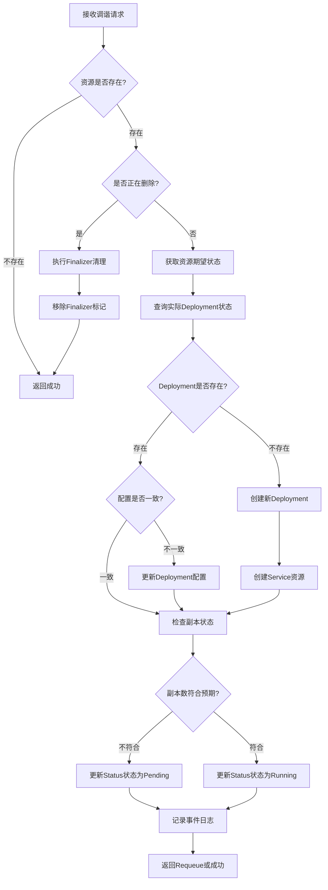
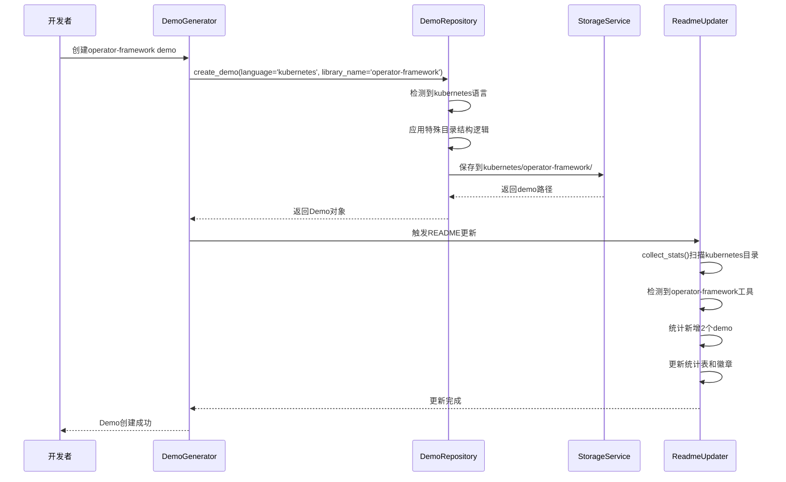
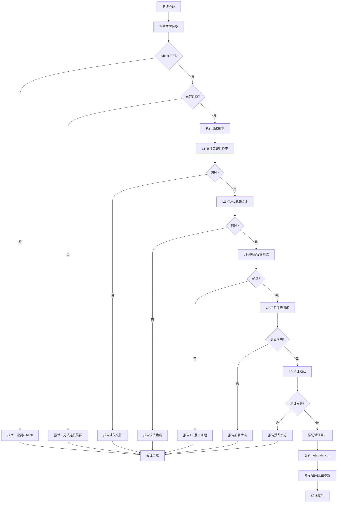

# Kubernetes Operator和CRD Demo设计

## 需求概述

为opendemo-cli项目新增两个高质量的Kubernetes Demo，分别演示Kubernetes Operator开发和CustomResourceDefinition (CRD)使用。这些Demo将融入现有的demo生成、验证、测试和文档更新机制。

### 目标受众

初学者到中级Kubernetes开发者，需要了解如何扩展Kubernetes API和实现自定义控制器。

### 核心价值

提供完整可执行的Operator和CRD示例，包含从资源定义、控制器实现到部署验证的全流程实操文档，帮助用户快速理解Kubernetes扩展机制。

---

## Demo规格定义

### Demo 1: CustomResourceDefinition基础使用

#### 元数据

| 属性 | 值 |
|------|-----|
| 名称 | CRD自定义资源定义演示 |
| 文件夹名 | `crd-basic-usage` |
| 语言 | `kubernetes` |
| 工具分类 | `operator-framework` |
| 难度 | `beginner` |
| 关键词 | `crd`, `custom-resource`, `api-extension`, `kubectl` |
| 描述 | 展示如何定义和使用CustomResourceDefinition扩展Kubernetes API，创建自定义资源类型 |

#### 功能范围

演示CRD的完整生命周期管理：

- CRD定义与注册
  - Schema定义（使用OpenAPI v3规范）
  - 版本管理（v1版本示例）
  - 字段验证规则
  - 打印列配置（kubectl输出展示）
  
- 自定义资源CRUD操作
  - 创建自定义资源实例
  - 查询资源状态
  - 更新资源配置
  - 删除资源清理
  
- 实用场景示例
  - 定义一个应用部署资源（AppDeployment）
  - 包含副本数、镜像、端口等自定义字段
  - 模拟应用生命周期管理场景

#### 文件结构

```
crd-basic-usage/
├── metadata.json                    # Demo元数据
├── README.md                        # 完整实操文档
├── manifests/                       # Kubernetes清单文件
│   ├── crd-definition.yaml         # CRD定义文件
│   └── cr-example.yaml             # 自定义资源示例
├── scripts/                         # 操作脚本
│   ├── deploy.sh                   # 部署CRD脚本
│   ├── test.sh                     # 测试验证脚本
│   └── cleanup.sh                  # 清理脚本
└── docs/                           # 扩展文档
    ├── schema-guide.md             # Schema设计指南
    └── troubleshooting.md          # 故障排查指南
```

#### 资源模型设计

自定义资源（AppDeployment）的核心字段：

| 字段组 | 字段名 | 类型 | 说明 | 验证规则 |
|--------|--------|------|------|----------|
| Spec | replicas | integer | 副本数量 | 最小值1，最大值10 |
| Spec | image | string | 容器镜像 | 必填，符合镜像命名规范 |
| Spec | port | integer | 服务端口 | 1-65535范围 |
| Spec | resources | object | 资源限制 | CPU和内存配置 |
| Status | phase | string | 部署阶段 | Pending/Running/Failed |
| Status | conditions | array | 状态条件列表 | 记录部署事件 |

---

### Demo 2: Kubernetes Operator开发实战

#### 元数据

| 属性 | 值 |
|------|-----|
| 名称 | Kubernetes Operator控制器开发演示 |
| 文件夹名 | `operator-controller-demo` |
| 语言 | `kubernetes` |
| 工具分类 | `operator-framework` |
| 难度 | `intermediate` |
| 关键词 | `operator`, `controller`, `reconcile`, `client-go`, `kubebuilder` |
| 描述 | 使用Kubebuilder框架开发完整的Kubernetes Operator，实现自定义资源的自动化管理 |

#### 功能范围

演示Operator控制器的核心能力：

- 项目初始化与脚手架
  - 使用Kubebuilder创建项目结构
  - 定义API资源和控制器
  - 生成CRD和RBAC配置
  
- 控制器核心逻辑
  - Reconcile调谐循环实现
  - 事件监听与资源同步
  - 状态更新与错误处理
  - Finalizer资源清理机制
  
- 自动化运维场景
  - 监听AppDeployment资源变化
  - 自动创建/更新Deployment和Service
  - 实现扩缩容自动化
  - 健康检查与故障自愈
  
- 测试与部署
  - 单元测试编写
  - 集成测试执行
  - 本地运行与调试
  - 集群内部署运行

#### 文件结构

```
operator-controller-demo/
├── metadata.json                    # Demo元数据
├── README.md                        # 完整开发指南
├── project/                         # Kubebuilder项目目录
│   ├── api/                         # API定义
│   │   └── v1/                     
│   │       ├── appdeployment_types.go    # 资源类型定义
│   │       └── zz_generated.deepcopy.go  # 自动生成代码
│   ├── controllers/                 # 控制器实现
│   │   ├── appdeployment_controller.go   # 主控制器逻辑
│   │   └── suite_test.go                 # 测试套件
│   ├── config/                      # 部署配置
│   │   ├── crd/                    # CRD定义
│   │   ├── rbac/                   # RBAC权限
│   │   ├── manager/                # Manager部署
│   │   └── samples/                # 示例资源
│   ├── go.mod                       # Go依赖管理
│   ├── go.sum
│   ├── Makefile                     # 构建自动化
│   └── main.go                      # 程序入口
├── scripts/                         # 操作脚本
│   ├── setup.sh                    # 环境准备脚本
│   ├── install-kubebuilder.sh      # 安装Kubebuilder
│   ├── run-local.sh                # 本地运行
│   ├── deploy.sh                   # 集群部署
│   ├── test.sh                     # 运行测试
│   └── cleanup.sh                  # 清理资源
└── docs/                           # 文档目录
    ├── architecture.md             # 架构设计说明
    ├── development-guide.md        # 开发指南
    ├── reconcile-loop.md           # 调谐循环详解
    └── best-practices.md           # 最佳实践
```

#### 控制器逻辑设计

Reconcile调谐循环的核心流程：



#### 技术栈选型

| 组件 | 工具/框架 | 用途 |
|------|-----------|------|
| 开发框架 | Kubebuilder 3.x | Operator脚手架生成 |
| 编程语言 | Go 1.20+ | 控制器开发 |
| Kubernetes客户端 | client-go | API交互 |
| 测试框架 | envtest | 集成测试 |
| 日志库 | logr | 结构化日志 |
| 构建工具 | Make | 自动化构建 |

---

## 目录结构集成

### Kubernetes工具分类层级

现有结构：`opendemo_output/kubernetes/kubeskoop/`

新增结构：`opendemo_output/kubernetes/operator-framework/`

完整目录树：

```
opendemo_output/
└── kubernetes/
    ├── kubeskoop/                          # 现有：网络诊断工具（10个demo）
    │   ├── helm-basic-installation-guide/
    │   ├── pod-connectivity-diagnosis/
    │   └── ...
    └── operator-framework/                  # 新增：Operator开发框架
        ├── crd-basic-usage/                # Demo 1: CRD基础
        └── operator-controller-demo/       # Demo 2: Operator开发
```

### 与现有机制的集成点

| 集成点 | 关键文件 | 集成策略 |
|--------|----------|----------|
| Demo仓库 | `demo_repository.py` | 利用现有kubernetes特殊处理逻辑，按`kubernetes/<tool_name>/<demo_name>`结构存储 |
| 目录扫描 | `get_supported_libraries()` | 自动识别`operator-framework`为新工具类别 |
| 元数据管理 | `metadata.json` | 遵循现有schema，language设为`kubernetes` |
| Demo清单 | `demo_mapping.json` | 追加两条新记录到kubernetes数组 |
| README更新 | `readme_updater.py` | 使用`collect_stats()`自动统计新增demo |

---

## 文档内容规范

### README.md结构标准

每个Demo的README.md必须包含以下章节（按顺序）：

#### 1. 标题与描述

- 一级标题：Demo名称
- 简短描述：一句话说明Demo用途
- 徽章区：难度、状态、版本等

#### 2. 功能概述

- 核心功能列表（3-5个要点）
- 适用场景说明
- 学习目标

#### 3. 前置要求

清单格式列出必需条件：

| 类别 | 要求 | 说明 |
|------|------|------|
| Kubernetes集群 | v1.24+ | 本地minikube或云端集群 |
| kubectl | v1.24+ | 命令行工具 |
| Go环境 | 1.20+ （仅Operator Demo） | 编译控制器代码 |
| Kubebuilder | 3.x （仅Operator Demo） | Operator框架 |

#### 4. 快速开始

步骤编号清晰，每步包含：

- 目标说明
- 执行命令（代码块格式）
- 预期输出示例
- 验证方法

CRD Demo快速开始示例：

```
步骤1：部署CRD定义
目标：向Kubernetes集群注册自定义资源类型

执行命令：
$ kubectl apply -f manifests/crd-definition.yaml

预期输出：
customresourcedefinition.apiextensions.k8s.io/appdeployments.demo.opendemo.io created

验证：
$ kubectl get crd appdeployments.demo.opendemo.io
NAME                                 CREATED AT
appdeployments.demo.opendemo.io     2025-01-06T06:00:00Z
```

#### 5. 详细步骤

每个功能点的深入讲解，包含：

- 原理说明
- 配置文件解析（关键字段注释）
- 操作命令详解
- 状态查询方法
- 故障排查提示

#### 6. 测试验证

提供完整的测试场景：

- 功能正确性测试
- 边界条件测试
- 错误处理测试
- 清理验证

#### 7. 进阶使用

高级特性说明：

- 参数调优建议
- 生产环境注意事项
- 与其他组件集成
- 性能优化技巧

#### 8. 故障排查

常见问题表格：

| 现象 | 可能原因 | 解决方法 |
|------|----------|----------|
| CRD创建失败 | API版本不兼容 | 检查集群版本，调整apiVersion字段 |
| 资源无法创建 | Schema验证失败 | 查看错误详情，修正字段值 |

#### 9. 清理资源

完整的卸载步骤：

```bash
# 删除自定义资源实例
kubectl delete appdeployments --all

# 删除CRD定义
kubectl delete crd appdeployments.demo.opendemo.io

# 验证清理完成
kubectl get appdeployments
```

#### 10. 参考资料

分类链接清单：

- 官方文档
- 相关教程
- 社区资源
- 源码仓库

---

## 实操文档质量标准

### 可执行性要求

| 要求项 | 标准 | 检查方法 |
|--------|------|----------|
| 命令准确性 | 所有命令可直接复制执行，无需修改 | 在干净集群验证 |
| 输出一致性 | 示例输出与实际执行结果匹配 | 对比验证 |
| 路径正确性 | 文件路径相对于Demo根目录准确 | 路径检查脚本 |
| 依赖完整性 | 明确列出所有外部依赖和版本 | 依赖扫描 |

### 易懂性要求

| 要求项 | 标准 | 评估标准 |
|--------|------|----------|
| 术语解释 | 首次出现的专业术语提供简明注释 | 无需额外查阅文档即可理解 |
| 步骤粒度 | 每步操作原子化，不含复合动作 | 初学者可独立完成 |
| 图表辅助 | 复杂流程使用Mermaid图示化 | 视觉化增强理解 |
| 代码注释 | YAML配置包含行内注释说明关键字段 | 自解释性强 |

### 完整性要求

覆盖完整生命周期：


---

## 测试验证机制

### 验证层级设计

| 层级 | 验证内容 | 实现方式 | 成功标准 |
|------|----------|----------|----------|
| L1-文件完整性 | 必需文件存在性检查 | Shell脚本扫描 | 所有必需文件存在 |
| L2-语法正确性 | YAML语法验证 | kubeval工具 | 无语法错误 |
| L3-API兼容性 | Kubernetes API版本检查 | kubectl dry-run | 能通过API服务器验证 |
| L4-功能可用性 | 部署后功能测试 | 自动化测试脚本 | 资源创建成功并达到预期状态 |
| L5-清理完整性 | 资源清理验证 | 残留检测脚本 | 所有资源被完全删除 |

### 自动化测试脚本设计

CRD Demo测试脚本示例框架（`scripts/test.sh`）：

```
功能模块：
1. 环境检查
   - 验证kubectl可用
   - 检查集群连接
   - 确认权限足够

2. CRD安装测试
   - 部署CRD定义
   - 验证CRD注册成功
   - 检查API可用性

3. 资源CRUD测试
   - 创建自定义资源
   - 查询资源状态
   - 更新资源配置
   - 删除资源

4. 验证测试
   - Schema验证测试（提交非法数据）
   - 字段默认值测试
   - 打印列输出测试

5. 清理验证
   - 执行清理脚本
   - 确认资源完全删除
   - 验证无残留CRD

输出格式：
每个测试步骤显示：[PASS/FAIL] 测试名称 - 详细信息
```

Operator Demo测试脚本额外包含：

- 控制器启动测试
- Reconcile循环验证
- 事件监听测试
- Finalizer清理测试
- 多副本扩缩容测试

---

## README.md更新策略

### 更新触发机制

在以下时机自动触发README更新：

| 触发事件 | 执行时机 | 更新范围 |
|----------|----------|----------|
| Demo生成完成 | `demo_generator.generate()`返回后 | 统计数据、Demo清单 |
| Demo验证通过 | `demo_verifier.verify()`成功后 | 测试状态标记 |
| 批量导入完成 | 多个Demo导入脚本结束后 | 全量重新统计 |

### 更新内容明细

需要修改的README.md章节：

#### 1. Demo统计表（📊 Demo统计）

现有内容：

```markdown
| ⎈ **Kubernetes** | 0 | kubeskoop(10) | 10 | ✅ 全部通过 |
| **总计** | **210** | **37** | **247** | ✅ |
```

更新后内容：

```markdown
| ⎈ **Kubernetes** | 0 | kubeskoop(10), operator-framework(2) | 12 | ✅ 全部通过 |
| **总计** | **210** | **39** | **249** | ✅ |
```

#### 2. 徽章更新

现有：`[]`

更新：`[]`

#### 3. Demo完整清单（⎈ Kubernetes部分）

在现有KubeSkoop列表后追加：

```markdown
<details>
<summary><b>📦 Operator Framework (2个)</b> - 点击展开</summary>

> 路径: `opendemo_output/kubernetes/operator-framework/`

| # | Demo名称 | 功能说明 | 状态 |
|---|---------|---------|------|
| 1 | `crd-basic-usage` | CRD自定义资源定义 | ✅ |
| 2 | `operator-controller-demo` | Operator控制器开发 | ✅ |

</details>
```

### 自动化更新实现

利用现有`readme_updater.py`模块，无需修改核心逻辑：

| 现有能力 | 支持情况 | 说明 |
|---------|---------|------|
| Kubernetes目录扫描 | ✅ 已支持 | `collect_stats()`已实现kubernetes特殊处理 |
| 工具分类统计 | ✅ 已支持 | 通过`tools`字段统计各工具demo数量 |
| 表格自动生成 | ✅ 已支持 | `generate_stats_table()`自动格式化输出 |
| 徽章数量更新 | ✅ 已支持 | `update_badge()`自动计算总数 |

执行方式：

```
在Demo创建完成后调用：
updater = ReadmeUpdater(output_dir, readme_path)
updater.update()
```

---

## demo_mapping.json更新

### 新增条目设计

在`kubernetes`数组中追加两条记录：

```json
{
  "kubernetes": [
    {
      "folder": "kubeskoop/helm-basic-installation-guide",
      "name": "Helm基础安装与使用演示",
      "description": "一个展示Helm在Kubernetes中基本安装和使用的入门级演示项目。"
    },
    // ... 现有9条kubeskoop记录 ...
    {
      "folder": "operator-framework/crd-basic-usage",
      "name": "CRD自定义资源定义演示",
      "description": "展示如何定义和使用CustomResourceDefinition扩展Kubernetes API，创建自定义资源类型"
    },
    {
      "folder": "operator-framework/operator-controller-demo",
      "name": "Kubernetes Operator控制器开发演示",
      "description": "使用Kubebuilder框架开发完整的Kubernetes Operator，实现自定义资源的自动化管理"
    }
  ]
}
```

### 数据一致性保障

| 字段 | 取值来源 | 验证规则 |
|------|----------|----------|
| folder | Demo目录结构 | 必须与实际路径一致 |
| name | metadata.json中的name字段 | 保持字面一致 |
| description | metadata.json中的description字段 | 保持字面一致 |

---

## 工作流集成

### Demo创建流程



### 验证测试流程



---

## 交付物清单

### Demo 1交付内容

| 文件路径 | 文件类型 | 内容要求 |
|----------|----------|----------|
| `crd-basic-usage/metadata.json` | JSON | 完整元数据，verified初始为false |
| `crd-basic-usage/README.md` | Markdown | 符合文档质量标准的完整实操指南（2000+字） |
| `crd-basic-usage/manifests/crd-definition.yaml` | YAML | 完整CRD定义，包含validation和printer columns |
| `crd-basic-usage/manifests/cr-example.yaml` | YAML | 2-3个不同场景的资源示例 |
| `crd-basic-usage/scripts/deploy.sh` | Shell | 自动化部署脚本，含错误处理 |
| `crd-basic-usage/scripts/test.sh` | Shell | 完整的5层验证测试脚本 |
| `crd-basic-usage/scripts/cleanup.sh` | Shell | 彻底清理脚本，含验证步骤 |
| `crd-basic-usage/docs/schema-guide.md` | Markdown | OpenAPI Schema设计详解 |
| `crd-basic-usage/docs/troubleshooting.md` | Markdown | 常见问题解决方案库 |

### Demo 2交付内容

| 文件路径 | 文件类型 | 内容要求 |
|----------|----------|----------|
| `operator-controller-demo/metadata.json` | JSON | 完整元数据，difficulty为intermediate |
| `operator-controller-demo/README.md` | Markdown | 完整开发指南（3000+字），含架构图 |
| `operator-controller-demo/project/` | Go项目 | 完整的Kubebuilder项目，可编译运行 |
| `operator-controller-demo/project/api/v1/appdeployment_types.go` | Go | 资源类型定义，含注释标记 |
| `operator-controller-demo/project/controllers/appdeployment_controller.go` | Go | 控制器逻辑，含详细注释 |
| `operator-controller-demo/project/config/` | YAML集合 | 完整的CRD、RBAC、Manager配置 |
| `operator-controller-demo/project/Makefile` | Makefile | 构建、测试、部署目标 |
| `operator-controller-demo/scripts/setup.sh` | Shell | 环境准备脚本（安装Go、Kubebuilder等） |
| `operator-controller-demo/scripts/run-local.sh` | Shell | 本地开发运行脚本 |
| `operator-controller-demo/scripts/deploy.sh` | Shell | 集群部署脚本 |
| `operator-controller-demo/scripts/test.sh` | Shell | 端到端测试脚本 |
| `operator-controller-demo/scripts/cleanup.sh` | Shell | 完整清理脚本 |
| `operator-controller-demo/docs/architecture.md` | Markdown | 架构设计说明，含组件交互图 |
| `operator-controller-demo/docs/reconcile-loop.md` | Markdown | Reconcile循环深度解析 |
| `operator-controller-demo/docs/development-guide.md` | Markdown | 本地开发调试指南 |
| `operator-controller-demo/docs/best-practices.md` | Markdown | 生产环境最佳实践 |

### 配置文件更新

| 文件 | 更新内容 | 变更量 |
|------|----------|--------|
| `demo_mapping.json` | kubernetes数组新增2条记录 | +15行 |
| `README.md` | 统计表、徽章、Demo清单 | 自动更新 |

---

## 质量保障措施

### 代码审查检查点

| 检查项 | 审查标准 | 不通过后果 |
|--------|----------|-----------|
| YAML格式规范 | 符合Kubernetes规范，通过kubeval验证 | 阻止合并 |
| Go代码规范 | 通过golangci-lint检查 | 要求修改 |
| 注释完整性 | 关键逻辑有清晰注释 | 要求补充 |
| 错误处理 | 所有错误路径有处理 | 要求修改 |
| 资源清理 | Finalizer正确实现 | 阻止合并 |

### 文档审查检查点

| 检查项 | 审查标准 | 检查方法 |
|--------|----------|----------|
| 命令可执行性 | 所有命令在干净环境可执行 | 实际运行验证 |
| 输出准确性 | 示例输出与实际一致 | 对比检查 |
| 术语准确性 | 无技术概念错误 | 专家review |
| 图表清晰性 | Mermaid图正确渲染 | 渲染测试 |
| 链接有效性 | 所有外部链接可访问 | 自动检查工具 |

### 验证通过标准

Demo必须满足以下条件才能标记为verified:

| 验证项 | 通过标准 | 验证环境 |
|--------|----------|----------|
| 部署成功率 | 100%成功（3次独立测试） | minikube v1.28+ |
| 功能正确性 | 所有测试用例通过 | 自动化测试脚本 |
| 清理完整性 | 无资源残留 | 清理后检查脚本 |
| 文档可用性 | 初学者可独立完成 | 用户测试反馈 |
| 跨版本兼容 | Kubernetes 1.24-1.28可用 | 多版本测试 |

---

## 实施计划

### 阶段划分

| 阶段 | 任务 | 输出 | 验收标准 |
|------|------|------|----------|
| 阶段1：CRD Demo开发 | 编写CRD定义、示例资源、脚本、文档 | Demo 1完整交付 | 通过5层验证测试 |
| 阶段2：Operator Demo开发 | Kubebuilder项目搭建、控制器开发、文档编写 | Demo 2完整交付 | 控制器正确reconcile |
| 阶段3：文档更新 | 更新demo_mapping.json和README.md | 配置文件更新完成 | 统计数据准确 |
| 阶段4：集成测试 | 端到端测试、跨版本兼容测试 | 测试报告 | 所有测试通过 |
| 阶段5：文档完善 | 根据测试反馈优化文档 | 最终版文档 | 用户可独立完成 |

### 风险与缓解

| 风险 | 影响 | 概率 | 缓解措施 |
|------|------|------|----------|
| Kubernetes版本兼容性问题 | 高 | 中 | 明确支持版本范围，提供多版本测试 |
| Kubebuilder API变更 | 中 | 低 | 锁定Kubebuilder版本，提供升级指南 |
| 控制器逻辑复杂度过高 | 中 | 中 | 简化场景，专注核心功能演示 |
| 文档理解门槛高 | 高 | 中 | 增加图解，提供逐步详解 |
| 测试环境依赖 | 中 | 高 | 提供minikube快速搭建指南 |

---

## 成功指标

### 定量指标

| 指标 | 目标值 | 测量方法 |
|------|--------|----------|
| Demo完成率 | 100% | 交付物清单完成度 |
| 验证通过率 | 100% | 自动化测试结果 |
| 文档字数 | CRD ≥2000字，Operator ≥3000字 | 字数统计 |
| 代码注释率 | ≥30% | 代码分析工具 |
| 命令可执行率 | 100% | 实际执行验证 |

### 定性指标

| 指标 | 评价标准 | 评估方式 |
|------|----------|----------|
| 易懂性 | 初学者可独立完成 | 用户测试反馈 |
| 完整性 | 覆盖从开发到部署全流程 | checklist检查 |
| 实用性 | 可作为实际项目参考 | 专家评审 |
| 一致性 | 风格与现有demo保持一致 | 对比检查 |

---

## 后续优化方向

### 功能扩展建议

| 扩展方向 | 描述 | 优先级 |
|----------|------|--------|
| Webhook集成 | 新增Admission Webhook演示 | 中 |
| 多版本CRD | 演示CRD版本升级机制 | 低 |
| 性能优化 | 控制器并发处理优化 | 低 |
| 监控集成 | 集成Prometheus指标采集 | 中 |
| 高可用部署 | 多副本Leader Election | 低 |

### 文档增强建议

| 增强项 | 内容 | 优先级 |
|--------|------|--------|
| 视频教程 | 录制实操演示视频 | 中 |
| 交互式练习 | 提供在线Playground链接 | 低 |
| 故障案例库 | 汇总真实故障案例 | 高 |
| 对比分析 | 与其他Operator框架对比 | 中 |
| 迁移指南 | 从手写控制器迁移到Kubebuilder | 低 |

---

## 附录

### 参考资源

| 类别 | 资源 | URL |
|------|------|-----|
| 官方文档 | Kubernetes CRD | kubernetes.io/docs/tasks/extend-kubernetes/custom-resources/ |
| 官方文档 | Kubebuilder Book | book.kubebuilder.io |
| 工具文档 | client-go | github.com/kubernetes/client-go |
| 示例项目 | sample-controller | github.com/kubernetes/sample-controller |
| 最佳实践 | Operator Best Practices | sdk.operatorframework.io/docs/best-practices/ |

### 术语表

| 术语 | 英文 | 解释 |
|------|------|------|
| 自定义资源定义 | CustomResourceDefinition (CRD) | 扩展Kubernetes API的机制，允许定义新的资源类型 |
| 控制器 | Controller | 监听资源变化并执行协调逻辑的组件 |
| 调谐循环 | Reconcile Loop | 控制器将实际状态向期望状态靠拢的核心逻辑循环 |
| Finalizer | Finalizer | 资源删除前执行清理逻辑的钩子机制 |
| Operator | Operator | 封装运维知识的Kubernetes应用管理模式 |
| Kubebuilder | Kubebuilder | Kubernetes官方推荐的Operator开发框架 |
| client-go | client-go | Kubernetes官方Go客户端库 |
| Scheme | Scheme | 类型注册表，用于序列化和反序列化 |
| Manager | Manager | 管理多个控制器的运行时组件 |
| Webhook | Admission Webhook | 请求进入API服务器前的拦截验证机制 |

| 阶段 | 任务 | 输出 | 验收标准 |
|------|------|------|----------|
| 阶段1：CRD Demo开发 | 编写CRD定义、示例资源、脚本、文档 | Demo 1完整交付 | 通过5层验证测试 |
| 阶段2：Operator Demo开发 | Kubebuilder项目搭建、控制器开发、文档编写 | Demo 2完整交付 | 控制器正确reconcile |
| 阶段3：文档更新 | 更新demo_mapping.json和README.md | 配置文件更新完成 | 统计数据准确 |
| 阶段4：集成测试 | 端到端测试、跨版本兼容测试 | 测试报告 | 所有测试通过 |
| 阶段5：文档完善 | 根据测试反馈优化文档 | 最终版文档 | 用户可独立完成 |

### 风险与缓解

| 风险 | 影响 | 概率 | 缓解措施 |
|------|------|------|----------|
| Kubernetes版本兼容性问题 | 高 | 中 | 明确支持版本范围，提供多版本测试 |
| Kubebuilder API变更 | 中 | 低 | 锁定Kubebuilder版本，提供升级指南 |
| 控制器逻辑复杂度过高 | 中 | 中 | 简化场景，专注核心功能演示 |
| 文档理解门槛高 | 高 | 中 | 增加图解，提供逐步详解 |
| 测试环境依赖 | 中 | 高 | 提供minikube快速搭建指南 |

---

## 成功指标

### 定量指标

| 指标 | 目标值 | 测量方法 |
|------|--------|----------|
| Demo完成率 | 100% | 交付物清单完成度 |
| 验证通过率 | 100% | 自动化测试结果 |
| 文档字数 | CRD ≥2000字，Operator ≥3000字 | 字数统计 |
| 代码注释率 | ≥30% | 代码分析工具 |
| 命令可执行率 | 100% | 实际执行验证 |

### 定性指标

| 指标 | 评价标准 | 评估方式 |
|------|----------|----------|
| 易懂性 | 初学者可独立完成 | 用户测试反馈 |
| 完整性 | 覆盖从开发到部署全流程 | checklist检查 |
| 实用性 | 可作为实际项目参考 | 专家评审 |
| 一致性 | 风格与现有demo保持一致 | 对比检查 |

---

## 后续优化方向

### 功能扩展建议

| 扩展方向 | 描述 | 优先级 |
|----------|------|--------|
| Webhook集成 | 新增Admission Webhook演示 | 中 |
| 多版本CRD | 演示CRD版本升级机制 | 低 |
| 性能优化 | 控制器并发处理优化 | 低 |
| 监控集成 | 集成Prometheus指标采集 | 中 |
| 高可用部署 | 多副本Leader Election | 低 |

### 文档增强建议

| 增强项 | 内容 | 优先级 |
|--------|------|--------|
| 视频教程 | 录制实操演示视频 | 中 |
| 交互式练习 | 提供在线Playground链接 | 低 |
| 故障案例库 | 汇总真实故障案例 | 高 |
| 对比分析 | 与其他Operator框架对比 | 中 |
| 迁移指南 | 从手写控制器迁移到Kubebuilder | 低 |

---

## 附录

### 参考资源

| 类别 | 资源 | URL |
|------|------|-----|
| 官方文档 | Kubernetes CRD | kubernetes.io/docs/tasks/extend-kubernetes/custom-resources/ |
| 官方文档 | Kubebuilder Book | book.kubebuilder.io |
| 工具文档 | client-go | github.com/kubernetes/client-go |
| 示例项目 | sample-controller | github.com/kubernetes/sample-controller |
| 最佳实践 | Operator Best Practices | sdk.operatorframework.io/docs/best-practices/ |

### 术语表

| 术语 | 英文 | 解释 |
|------|------|------|
| 自定义资源定义 | CustomResourceDefinition (CRD) | 扩展Kubernetes API的机制，允许定义新的资源类型 |
| 控制器 | Controller | 监听资源变化并执行协调逻辑的组件 |
| 调谐循环 | Reconcile Loop | 控制器将实际状态向期望状态靠拢的核心逻辑循环 |
| Finalizer | Finalizer | 资源删除前执行清理逻辑的钩子机制 |
| Operator | Operator | 封装运维知识的Kubernetes应用管理模式 |
| Kubebuilder | Kubebuilder | Kubernetes官方推荐的Operator开发框架 |
| client-go | client-go | Kubernetes官方Go客户端库 |
| Scheme | Scheme | 类型注册表，用于序列化和反序列化 |
| Manager | Manager | 管理多个控制器的运行时组件 |
| Webhook | Admission Webhook | 请求进入API服务器前的拦截验证机制 |

### 阶段划分

| 阶段 | 任务 | 输出 | 验收标准 |
|------|------|------|----------|
| 阶段1：CRD Demo开发 | 编写CRD定义、示例资源、脚本、文档 | Demo 1完整交付 | 通过5层验证测试 |
| 阶段2：Operator Demo开发 | Kubebuilder项目搭建、控制器开发、文档编写 | Demo 2完整交付 | 控制器正确reconcile |
| 阶段3：文档更新 | 更新demo_mapping.json和README.md | 配置文件更新完成 | 统计数据准确 |
| 阶段4：集成测试 | 端到端测试、跨版本兼容测试 | 测试报告 | 所有测试通过 |
| 阶段5：文档完善 | 根据测试反馈优化文档 | 最终版文档 | 用户可独立完成 |

### 风险与缓解

| 风险 | 影响 | 概率 | 缓解措施 |
|------|------|------|----------|
| Kubernetes版本兼容性问题 | 高 | 中 | 明确支持版本范围，提供多版本测试 |
| Kubebuilder API变更 | 中 | 低 | 锁定Kubebuilder版本，提供升级指南 |
| 控制器逻辑复杂度过高 | 中 | 中 | 简化场景，专注核心功能演示 |
| 文档理解门槛高 | 高 | 中 | 增加图解，提供逐步详解 |
| 测试环境依赖 | 中 | 高 | 提供minikube快速搭建指南 |

---

## 成功指标

### 定量指标

| 指标 | 目标值 | 测量方法 |
|------|--------|----------|
| Demo完成率 | 100% | 交付物清单完成度 |
| 验证通过率 | 100% | 自动化测试结果 |
| 文档字数 | CRD ≥2000字，Operator ≥3000字 | 字数统计 |
| 代码注释率 | ≥30% | 代码分析工具 |
| 命令可执行率 | 100% | 实际执行验证 |

### 定性指标

| 指标 | 评价标准 | 评估方式 |
|------|----------|----------|
| 易懂性 | 初学者可独立完成 | 用户测试反馈 |
| 完整性 | 覆盖从开发到部署全流程 | checklist检查 |
| 实用性 | 可作为实际项目参考 | 专家评审 |
| 一致性 | 风格与现有demo保持一致 | 对比检查 |

---

## 后续优化方向

### 功能扩展建议

| 扩展方向 | 描述 | 优先级 |
|----------|------|--------|
| Webhook集成 | 新增Admission Webhook演示 | 中 |
| 多版本CRD | 演示CRD版本升级机制 | 低 |
| 性能优化 | 控制器并发处理优化 | 低 |
| 监控集成 | 集成Prometheus指标采集 | 中 |
| 高可用部署 | 多副本Leader Election | 低 |

### 文档增强建议

| 增强项 | 内容 | 优先级 |
|--------|------|--------|
| 视频教程 | 录制实操演示视频 | 中 |
| 交互式练习 | 提供在线Playground链接 | 低 |
| 故障案例库 | 汇总真实故障案例 | 高 |
| 对比分析 | 与其他Operator框架对比 | 中 |
| 迁移指南 | 从手写控制器迁移到Kubebuilder | 低 |

---

## 附录

### 参考资源

| 类别 | 资源 | URL |
|------|------|-----|
| 官方文档 | Kubernetes CRD | kubernetes.io/docs/tasks/extend-kubernetes/custom-resources/ |
| 官方文档 | Kubebuilder Book | book.kubebuilder.io |
| 工具文档 | client-go | github.com/kubernetes/client-go |
| 示例项目 | sample-controller | github.com/kubernetes/sample-controller |
| 最佳实践 | Operator Best Practices | sdk.operatorframework.io/docs/best-practices/ |

### 术语表

| 术语 | 英文 | 解释 |
|------|------|------|
| 自定义资源定义 | CustomResourceDefinition (CRD) | 扩展Kubernetes API的机制，允许定义新的资源类型 |
| 控制器 | Controller | 监听资源变化并执行协调逻辑的组件 |
| 调谐循环 | Reconcile Loop | 控制器将实际状态向期望状态靠拢的核心逻辑循环 |
| Finalizer | Finalizer | 资源删除前执行清理逻辑的钩子机制 |
| Operator | Operator | 封装运维知识的Kubernetes应用管理模式 |
| Kubebuilder | Kubebuilder | Kubernetes官方推荐的Operator开发框架 |
| client-go | client-go | Kubernetes官方Go客户端库 |
| Scheme | Scheme | 类型注册表，用于序列化和反序列化 |
| Manager | Manager | 管理多个控制器的运行时组件 |
| Webhook | Admission Webhook | 请求进入API服务器前的拦截验证机制 |
