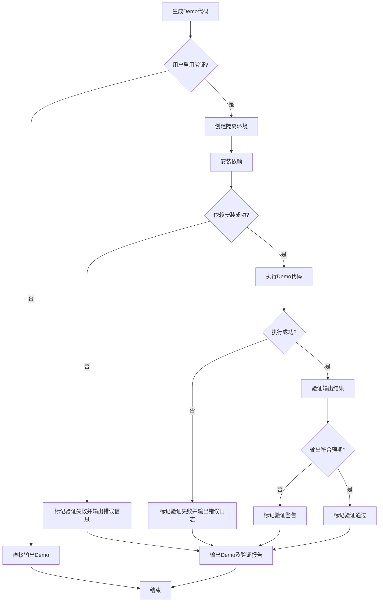
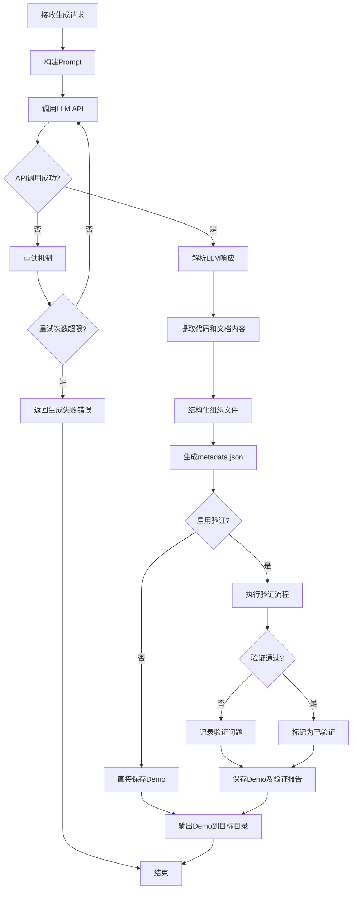
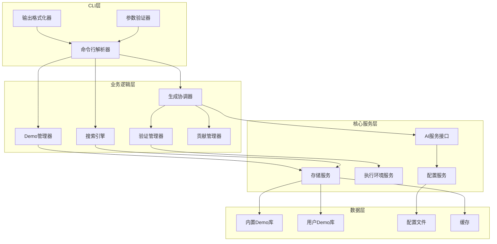
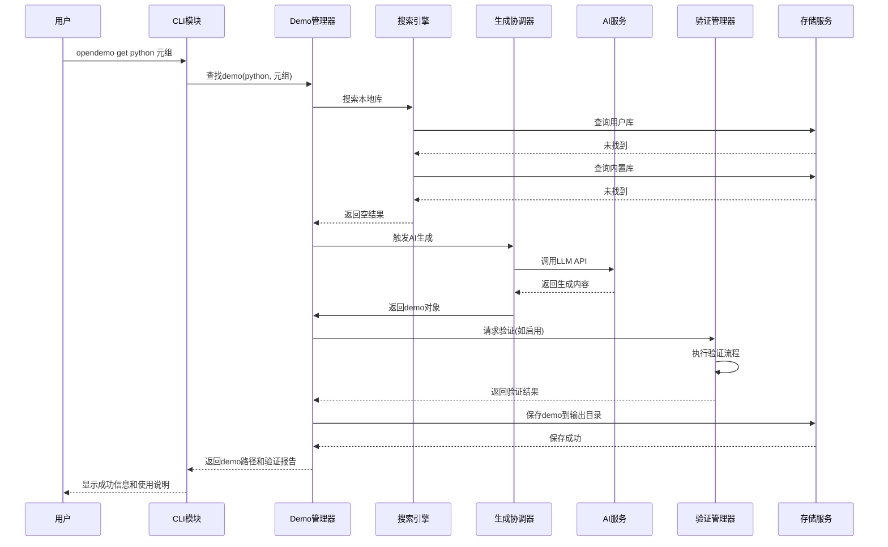
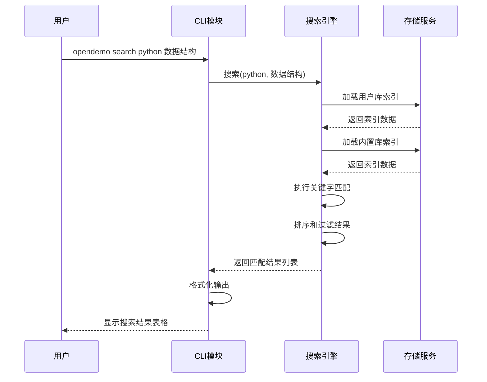
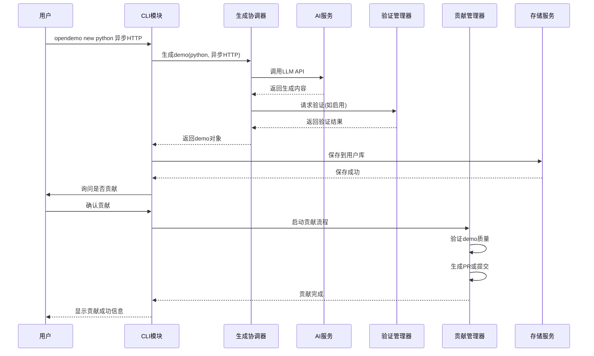

# Open Demo CLI 开发设计文档

## 项目概述

Open Demo 是一个智能化的编程学习辅助CLI工具,旨在帮助开发者快速获取高质量、可执行的编程语言demo代码。通过简单的命令行交互,用户可以获取特定编程语言和主题的完整示例代码,并配有详细的实操指南文档。

### 核心价值
- 快速获取可执行的高质量demo代码
- 提供完整的本地执行指导文档
- 支持demo库的持续扩展和社区贡献
- 降低编程学习和技术验证的时间成本

### 目标用户
- 编程语言学习者
- 需要快速验证技术方案的开发者
- 技术面试准备者
- 开源贡献者

## 功能设计

### 命令结构

#### 1. get命令 - 获取demo

**命令格式**
```
opendemo get <语言> <关键字>
```

**行为流程**
1. 解析用户输入的语言和关键字参数
2. 在本地demo库中搜索匹配的demo
3. 如果本地库存在匹配项,直接返回demo内容
4. 如果本地库不存在,调用AI/LLM动态生成demo
5. 将生成的demo输出到用户指定或默认目录
6. 如果启用验证功能,执行可选的自动验证流程
7. 显示demo的使用说明和执行建议

**输出内容**
- 一个或多个可执行的代码文件
- 一个markdown格式的实操建议文档(包含逐步操作指南)
- 环境依赖说明(如需要的库、工具版本等)

**示例**
```
opendemo get python 元组
```

#### 2. search命令 - 搜索demo

**命令格式**
```
opendemo search <语言> [关键字]
```

**行为流程**
1. 如果指定语言但未提供关键字,列出该语言的所有可用demo
2. 如果提供关键字,进行模糊匹配搜索
3. 返回匹配结果列表,包括demo名称、简介、标签等元信息
4. 支持分页显示搜索结果

**输出格式**
以表格或列表形式展示搜索结果,包含:
- Demo名称
- 所属语言
- 关键字标签
- 简短描述
- 最后更新时间

**示例**
```
opendemo search python
opendemo search python 数据结构
```

#### 3. new命令 - 创建新demo

**命令格式**
```
opendemo new <语言> <主题描述>
```

**行为流程**
1. 接收用户输入的语言和主题描述
2. 调用AI/LLM生成完整的demo代码和文档
3. 将生成的demo保存到用户本地demo库
4. 询问用户是否愿意贡献到公共demo库
5. 如果用户选择贡献,引导完成贡献流程(可能包括代码审查、格式化等)
6. 如果启用验证功能,执行可选的自动验证流程

**贡献流程**
- 用户确认贡献意愿
- 系统对demo进行基础检查(代码格式、文档完整性)
- 生成贡献提交信息(可能包括PR模板)
- 将demo标记为待审核状态或直接提交到公共库

**示例**
```
opendemo new python 异步HTTP请求处理
```

### 支持的编程语言

**第一版支持语言**
- Python
- Java

**语言扩展机制**
系统设计应支持未来添加更多编程语言,通过配置化或插件化方式实现语言支持的扩展。

## Demo库设计

### Demo库结构

**双层存储架构**

1. **内置公共Demo库**
   - 位置:项目安装目录下的固定路径
   - 内容:官方维护的高质量demo集合
   - 更新:通过工具版本升级或专门的update命令同步
   - 权限:只读,用户不可直接修改

2. **用户本地Demo库**
   - 位置:用户可配置的本地目录(默认为用户主目录下的.opendemo目录)
   - 内容:用户通过new命令创建的demo或从其他渠道导入的demo
   - 更新:用户自主管理
   - 权限:读写,用户完全控制

**Demo查找优先级**
执行get或search命令时,按以下顺序查找:
1. 用户本地demo库
2. 内置公共demo库
3. 如果都未找到,触发AI生成流程

### Demo目录结构

每个demo应包含以下标准结构:

```
demo-name/
├── metadata.json          # demo元数据
├── README.md             # 实操建议文档
├── code/                 # 代码文件目录
│   ├── example1.py/.java
│   ├── example2.py/.java
│   └── ...
├── requirements.txt      # 依赖声明(Python)
├── pom.xml/build.gradle  # 依赖声明(Java)
└── tests/                # 可选的测试文件
```

**metadata.json结构**

| 字段名 | 类型 | 说明 |
|--------|------|------|
| name | string | demo名称 |
| language | string | 编程语言 |
| keywords | array | 关键字标签列表 |
| description | string | 简短描述 |
| difficulty | string | 难度级别(beginner/intermediate/advanced) |
| author | string | 作者信息 |
| created_at | datetime | 创建时间 |
| updated_at | datetime | 最后更新时间 |
| version | string | demo版本号 |
| dependencies | object | 环境依赖信息 |
| verified | boolean | 是否已验证可执行 |

### 初始Python Demo库范围

**覆盖100+个主题,包括但不限于:**

**基础概念类(30+)**
- 数据类型:整数、浮点数、字符串、布尔值
- 数据结构:列表、元组、字典、集合
- 运算符:算术、比较、逻辑、位运算
- 控制流:if/elif/else、for循环、while循环、break/continue
- 函数:定义、参数、返回值、lambda表达式
- 作用域:局部变量、全局变量、闭包
- 异常处理:try/except/finally、自定义异常

**面向对象类(20+)**
- 类与对象:定义、实例化、属性、方法
- 继承:单继承、多继承、super()
- 封装:私有属性、属性装饰器
- 多态:方法重写、鸭子类型
- 特殊方法:__init__、__str__、__repr__等
- 抽象类与接口
- 数据类dataclass

**标准库类(30+)**
- 文件操作:读写、上下文管理器
- 路径处理:pathlib
- 日期时间:datetime、time
- 正则表达式:re模块
- JSON处理
- CSV处理
- 日志:logging
- 命令行参数:argparse
- 环境变量:os.environ
- 进程与线程:multiprocessing、threading
- 异步编程:asyncio、async/await

**数据处理类(20+)**
- 列表推导式
- 字典推导式
- 生成器与迭代器
- 装饰器
- 上下文管理器
- collections模块:deque、Counter、defaultdict
- itertools模块
- functools模块:partial、lru_cache

**生产环境技能类(20+)**
- HTTP请求:requests库
- API开发:Flask/FastAPI基础
- 数据库操作:SQLite、MySQL连接
- ORM:SQLAlchemy基础
- 配置管理:ConfigParser、yaml
- 单元测试:unittest、pytest
- 虚拟环境管理
- 包管理:pip、requirements.txt
- 错误监控与调试
- 性能分析:timeit、cProfile
- 并发处理实践
- 缓存策略:Redis基础
- 定时任务:schedule、cron
- 邮件发送:smtplib
- 文件压缩:zipfile、tarfile

## Demo验证机制

### 验证功能设计

**可选验证模式**
用户可通过配置或命令行参数选择是否启用自动验证功能。

**验证流程**



**验证环境隔离**

为保证验证过程不影响用户本地环境,需要提供隔离机制:

| 隔离方案 | 优势 | 劣势 | 适用场景 |
|----------|------|------|----------|
| 虚拟环境(venv/virtualenv) | 轻量、快速 | 仅隔离Python包 | Python demo验证 |
| Docker容器 | 完全隔离、跨平台 | 需要Docker环境 | 复杂demo或跨语言 |
| 临时目录+进程隔离 | 无额外依赖 | 隔离程度有限 | 简单demo快速验证 |

**验证检查项**

1. **依赖检查**
   - 解析依赖声明文件
   - 验证依赖包是否可安装
   - 记录依赖安装时间和结果

2. **执行检查**
   - 运行demo代码
   - 捕获标准输出和错误输出
   - 设置超时限制(防止无限循环)
   - 记录执行时间

3. **输出验证**
   - 检查是否有预期输出
   - 验证是否有运行时错误
   - 对比实际输出与预期输出(如果定义了预期)

4. **清理检查**
   - 确保临时文件被清理
   - 验证环境恢复到初始状态

**验证报告**

验证完成后生成验证报告,包含:
- 验证状态:通过/失败/警告
- 执行时长
- 依赖安装情况
- 代码执行输出
- 错误信息(如有)
- 建议和注意事项

### 实操建议文档要求

**文档必须包含的内容**

1. **环境准备**
   - 所需的编程语言版本
   - 需要安装的依赖包及安装命令
   - 操作系统兼容性说明

2. **逐步操作指南**
   - 每一步的具体操作命令
   - 每一步的预期结果
   - 可能遇到的问题及解决方案

3. **代码说明**
   - 每个代码文件的作用
   - 关键代码段的解释
   - 代码执行逻辑流程

4. **执行演示**
   - 如何运行demo代码
   - 预期的输出结果
   - 输出结果的含义解释

5. **扩展学习**
   - 相关概念的延伸阅读
   - 推荐的进阶主题
   - 常见实践场景

**文档格式规范**

采用Markdown格式,结构清晰,包含:
- 标题层次分明
- 代码块使用正确的语言标记
- 命令行操作使用代码块标注
- 重要提示使用引用或高亮格式
- 必要时使用图表辅助说明

## AI/LLM集成设计

### AI生成触发场景

1. get命令未在本地找到匹配demo时
2. new命令创建新demo时
3. 用户主动请求生成或更新demo时

### AI生成流程



### Prompt设计策略

**Prompt应包含的信息**

1. **角色定位**
   - 定义AI为专业的编程导师和代码示例生成器

2. **任务描述**
   - 明确需要生成的编程语言和主题
   - 说明生成内容的格式要求

3. **质量要求**
   - 代码必须完整可执行
   - 包含必要的注释
   - 遵循语言的最佳实践和编码规范
   - 提供详细的实操文档

4. **输出格式**
   - 明确代码文件的命名和组织方式
   - 要求生成README.md和依赖声明文件
   - 定义metadata信息的结构

5. **约束条件**
   - 代码复杂度适中,适合学习和演示
   - 避免使用过时或不安全的API
   - 确保跨平台兼容性

**Prompt模板示例结构**

```
角色:你是一位经验丰富的{语言}编程导师

任务:为"{主题}"生成一个完整的、可执行的demo示例

要求:
1. 生成1-3个代码文件,每个文件聚焦一个具体场景
2. 代码必须包含详细注释,解释关键逻辑
3. 遵循{语言}的PEP8/Google编码规范
4. 生成完整的README.md实操文档,包含环境准备、逐步操作、预期输出
5. 生成依赖声明文件
6. 提供metadata.json元数据

输出格式:
- 以JSON格式返回,包含files数组
- 每个文件包含filename、content、file_type字段

约束:
- 代码行数控制在50-200行
- 使用稳定版本的库
- 确保Windows/Linux/Mac兼容
```

### LLM API集成

**API配置管理**

支持多种LLM服务商,通过配置文件管理:
- OpenAI GPT系列
- 其他兼容OpenAI API格式的服务
- 本地部署的LLM模型

**配置项**

| 配置项 | 说明 | 默认值 |
|--------|------|--------|
| api_provider | API服务提供商 | openai |
| api_key | API密钥 | 无(必须配置) |
| api_endpoint | API端点URL | 根据provider决定 |
| model | 使用的模型名称 | gpt-4 |
| temperature | 生成随机性参数 | 0.7 |
| max_tokens | 最大生成token数 | 4000 |
| timeout | 请求超时时间(秒) | 60 |
| retry_times | 失败重试次数 | 3 |
| retry_interval | 重试间隔(秒) | 5 |

**错误处理**

- API密钥无效:提示用户配置正确的密钥
- 网络超时:自动重试,超过次数后提示用户检查网络
- 配额超限:提示用户检查账户配额或更换API密钥
- 响应格式错误:记录日志并提示生成失败,建议重试

## 配置管理

### 配置文件位置

**全局配置**
- 位置:用户主目录/.opendemo/config.yaml
- 作用范围:所有opendemo命令
- 优先级:低

**项目配置(可选)**
- 位置:当前工作目录/.opendemo.yaml
- 作用范围:当前项目
- 优先级:高(覆盖全局配置)

### 配置项设计

**通用配置**

| 配置项 | 说明 | 默认值 |
|--------|------|--------|
| output_directory | demo输出目录 | ./opendemo_output |
| user_demo_library | 用户demo库路径 | ~/.opendemo/demos |
| default_language | 默认编程语言 | python |
| enable_verification | 是否启用自动验证 | false |
| verification_method | 验证方法 | venv |
| verification_timeout | 验证超时时间(秒) | 300 |

**AI配置**

| 配置项 | 说明 | 默认值 |
|--------|------|--------|
| ai.provider | LLM服务提供商 | openai |
| ai.api_key | API密钥 | 空 |
| ai.model | 模型名称 | gpt-4 |
| ai.temperature | 温度参数 | 0.7 |
| ai.max_tokens | 最大token数 | 4000 |

**贡献配置**

| 配置项 | 说明 | 默认值 |
|--------|------|--------|
| contribution.auto_prompt | new命令后是否自动询问贡献 | true |
| contribution.author_name | 贡献者名称 | 空 |
| contribution.author_email | 贡献者邮箱 | 空 |
| contribution.repository_url | 公共demo库仓库地址 | 官方仓库地址 |

**显示配置**

| 配置项 | 说明 | 默认值 |
|--------|------|--------|
| display.color_output | 是否使用彩色输出 | true |
| display.page_size | 搜索结果分页大小 | 10 |
| display.verbose | 是否显示详细信息 | false |

### 配置初始化

**首次运行时**
1. 检测是否存在配置文件
2. 如果不存在,引导用户进行初始化配置
3. 至少需要配置AI API密钥才能使用生成功能
4. 其他配置项可使用默认值

**配置命令**

提供配置管理命令:
```
opendemo config set <key> <value>    # 设置配置项
opendemo config get <key>             # 查看配置项
opendemo config list                  # 列出所有配置
opendemo config init                  # 重新初始化配置
```

## 技术架构

### 架构模式

采用模块化的分层架构设计,确保各模块职责清晰、松耦合。



### 核心模块

**1. 命令行接口模块(CLI Module)**

职责:
- 解析用户输入的命令和参数
- 验证参数的合法性和完整性
- 格式化输出结果到终端
- 处理交互式输入(如确认、选择等)

关键组件:
- 命令解析器:使用argparse或click库实现
- 参数验证器:检查语言、关键字等参数的有效性
- 输出格式化器:支持表格、列表、彩色输出等

**2. Demo管理模块(Demo Manager)**

职责:
- 管理demo的生命周期(创建、读取、更新、删除)
- 协调内置库和用户库的访问
- 处理demo的元数据

关键组件:
- Demo加载器:从文件系统加载demo
- Demo保存器:将demo保存到指定位置
- 元数据管理器:处理metadata.json的读写

**3. 搜索引擎模块(Search Engine)**

职责:
- 在demo库中执行搜索查询
- 支持关键字匹配、模糊搜索
- 对搜索结果进行排序和过滤

关键组件:
- 索引构建器:为demo库建立搜索索引
- 匹配算法:实现关键字匹配逻辑
- 结果排序器:根据相关性排序结果

**4. AI生成协调模块(Generation Coordinator)**

职责:
- 协调AI生成流程
- 构建和管理prompt
- 解析AI响应并组织文件结构
- 处理生成失败和重试

关键组件:
- Prompt构建器:根据语言和主题构建prompt
- AI客户端:封装LLM API调用
- 响应解析器:解析AI返回的内容
- 重试管理器:处理失败重试逻辑

**5. 验证管理模块(Verification Manager)**

职责:
- 管理demo的验证流程
- 创建和管理隔离环境
- 执行代码并收集结果
- 生成验证报告

关键组件:
- 环境管理器:创建venv、Docker等隔离环境
- 执行器:运行demo代码
- 输出捕获器:捕获执行输出和错误
- 报告生成器:生成验证报告

**6. 贡献管理模块(Contribution Manager)**

职责:
- 处理demo的贡献流程
- 验证贡献内容的质量
- 与远程仓库交互(如GitHub)

关键组件:
- 贡献验证器:检查demo格式和完整性
- 仓库客户端:与Git仓库交互
- PR生成器:生成Pull Request

**7. 存储服务模块(Storage Service)**

职责:
- 统一管理文件系统访问
- 处理内置库和用户库的读写
- 管理缓存

关键组件:
- 文件系统抽象:统一的文件操作接口
- 库管理器:管理多个demo库的访问优先级
- 缓存管理器:缓存常用demo和搜索结果

**8. 配置服务模块(Configuration Service)**

职责:
- 加载和管理配置文件
- 提供配置项的读写接口
- 处理配置合并(全局+项目)

关键组件:
- 配置加载器:读取YAML配置文件
- 配置合并器:合并多层配置
- 配置验证器:验证配置的有效性

### 数据流设计

**get命令数据流**



**search命令数据流**



**new命令数据流**



### 扩展性设计

**语言插件化**

为支持未来添加更多编程语言,设计语言适配器接口:

每个语言适配器需实现:
- 依赖文件解析(如requirements.txt、pom.xml)
- 代码执行命令构建
- 环境准备逻辑
- 验证脚本生成

**验证方式插件化**

支持多种验证隔离方式,通过策略模式实现:
- VenvVerifier:使用Python虚拟环境
- DockerVerifier:使用Docker容器
- ProcessVerifier:使用进程隔离

用户可通过配置选择验证方式。

**AI服务适配器**

设计统一的AI服务接口,支持多种LLM提供商:
- OpenAIAdapter
- AnthropicAdapter
- LocalLLMAdapter
- CustomAPIAdapter

通过配置切换不同的AI服务。

## 用户体验设计

### 命令行交互体验

**友好的错误提示**

当用户输入错误或遇到问题时,提供清晰的错误信息和建议:
- 参数缺失:提示缺少的参数名称和示例
- 语言不支持:列出当前支持的语言列表
- API配置错误:引导用户如何配置API密钥
- 网络错误:提示检查网络连接并提供重试选项

**进度指示**

对于耗时操作,提供进度指示:
- AI生成中:显示生成进度动画
- 验证执行中:显示当前验证步骤
- 下载依赖中:显示下载进度

**彩色输出**

使用不同颜色区分信息类型:
- 成功信息:绿色
- 警告信息:黄色
- 错误信息:红色
- 提示信息:蓝色

**交互式确认**

对于重要操作,提供交互式确认:
- 是否贡献demo到公共库
- 是否覆盖已存在的文件
- 是否启用验证功能

### 输出内容设计

**Demo输出格式**

执行get或new命令成功后,输出:
```
✓ Demo生成成功!

语言: Python
主题: 元组操作
输出位置: ./opendemo_output/python-tuple-demo/

包含文件:
  - tuple_basics.py        (基础元组操作)
  - tuple_advanced.py      (高级元组技巧)
  - README.md              (实操指南)
  - requirements.txt       (依赖声明)

验证状态: ✓ 已验证通过
执行时间: 2.3秒

快速开始:
  1. cd ./opendemo_output/python-tuple-demo/
  2. pip install -r requirements.txt
  3. python tuple_basics.py

查看完整指南: cat README.md
```

**搜索结果格式**

执行search命令后,以表格形式展示:
```
找到 5 个匹配的demo:

┌────┬──────────────────┬────────┬──────────────────┬────────────┐
│ #  │ 名称             │ 语言   │ 关键字           │ 难度       │
├────┼──────────────────┼────────┼──────────────────┼────────────┤
│ 1  │ tuple-basics     │ Python │ 元组,基础        │ beginner   │
│ 2  │ tuple-unpacking  │ Python │ 元组,解包        │ intermediate│
│ 3  │ named-tuple      │ Python │ 元组,命名元组    │ intermediate│
│ 4  │ tuple-performance│ Python │ 元组,性能优化    │ advanced   │
│ 5  │ tuple-practices  │ Python │ 元组,最佳实践    │ intermediate│
└────┴──────────────────┴────────┴──────────────────┴────────────┘

使用 'opendemo get python <关键字>' 获取具体demo
```

### 文档可读性

**README.md模板结构**

每个demo的README.md应遵循统一结构:

1. Demo标题和简介
2. 学习目标
3. 环境要求
4. 安装依赖
5. 文件说明
6. 逐步实操指南
7. 代码解析
8. 预期输出
9. 常见问题
10. 扩展学习

**代码注释规范**

生成的代码必须包含:
- 文件头部说明(用途、作者、日期)
- 函数/方法的文档字符串
- 关键逻辑的行内注释
- 复杂算法的步骤说明

## 质量保证

### Demo质量标准

**代码质量**
- 遵循语言的官方编码规范(PEP8、Google Java Style等)
- 代码结构清晰,命名语义化
- 无明显的安全漏洞或不良实践
- 异常处理完善

**文档质量**
- 实操步骤完整且准确
- 说明清晰易懂,无歧义
- 包含必要的截图或示例输出
- 语法和拼写正确

**可执行性**
- 在标准环境下能成功运行
- 依赖声明完整准确
- 输出结果符合预期

### 验证策略

**自动验证**
- 代码语法检查(使用linter)
- 依赖可安装性检查
- 代码可执行性检查
- 输出正确性检查(如果定义了预期输出)

**人工审核(针对贡献到公共库的demo)**
- 代码质量人工review
- 文档准确性审核
- 最佳实践符合性检查
- 安全性审查

### 错误处理策略

**分级错误处理**

| 错误级别 | 处理方式 | 示例 |
|----------|----------|------|
| 致命错误 | 立即终止,显示错误信息和建议 | API密钥未配置 |
| 可恢复错误 | 重试或降级处理,提示用户 | 网络超时 |
| 警告 | 继续执行,记录警告信息 | 验证未通过但demo已生成 |
| 信息 | 正常流程提示 | 开始生成demo |

**日志记录**

所有操作应记录日志,便于问题排查:
- 日志级别:DEBUG、INFO、WARNING、ERROR、CRITICAL
- 日志位置:~/.opendemo/logs/
- 日志轮转:按日期或大小自动轮转
- 日志内容:时间戳、级别、模块、消息、堆栈跟踪(错误时)

## 安全性设计

### 代码执行安全

**隔离执行**
- 验证过程必须在隔离环境中执行
- 限制文件系统访问范围
- 限制网络访问(可选)
- 设置资源使用限制(CPU、内存、磁盘)

**危险操作检测**
- 扫描生成的代码是否包含危险操作(如删除文件、修改系统配置)
- 对可疑代码进行警告或拒绝执行

### API密钥安全

**密钥存储**
- 配置文件权限限制(仅当前用户可读写)
- 建议使用环境变量存储敏感信息
- 支持密钥加密存储(可选)

**密钥传输**
- 使用HTTPS协议调用API
- 不在日志中记录完整密钥

### 用户数据隐私

**本地优先**
- 所有demo和配置默认存储在用户本地
- 贡献到公共库需用户明确授权

**数据最小化**
- 仅收集必要的元数据
- 不收集用户的个人敏感信息

## 部署和分发

### 安装方式

**推荐方式:pip安装**
```
pip install opendemo
```

**其他方式**
- 从源码安装:git clone后pip install .
- 下载预编译二进制文件(PyInstaller打包)

### 依赖管理

**核心依赖**
- Python 3.8+
- click或argparse(命令行解析)
- requests(HTTP请求)
- pyyaml(配置文件解析)
- 其他语言运行时(如Java,按需安装)

**可选依赖**
- docker-py(Docker验证)
- gitpython(Git操作)
- rich(增强终端输出)

### 版本更新

**内置库更新**
- 随工具版本升级自动更新
- 提供独立的update命令:opendemo update

**向后兼容**
- 配置文件格式保持兼容
- 提供迁移工具处理破坏性变更

## 未来扩展规划

### 短期扩展(v1.x)

**更多编程语言支持**
- JavaScript/TypeScript
- Go
- Rust
- C++

**增强搜索功能**
- 支持标签组合搜索
- 支持难度筛选
- 支持按时间排序

**批量操作**
- 批量下载某个主题的所有demo
- 批量验证用户库中的demo

### 中期扩展(v2.x)

**Web界面**
- 提供Web UI浏览和管理demo
- 在线预览demo代码和文档
- 可视化的搜索和筛选

**社区功能**
- Demo评分和评论
- 用户贡献排行榜
- Demo使用统计

**IDE插件**
- VSCode插件
- PyCharm插件
- 支持在IDE内直接搜索和导入demo

### 长期愿景(v3.x+)

**智能推荐**
- 根据用户历史推荐相关demo
- 根据项目代码推荐实用demo

**多模态支持**
- 支持视频教程
- 支持交互式Jupyter Notebook

**企业版功能**
- 私有demo库部署
- 团队协作和共享
- Demo使用分析和报告

## 成功指标

### 技术指标

- Demo生成成功率 > 95%
- 验证通过率 > 90%(针对生成的demo)
- 平均生成时间 < 30秒
- 搜索响应时间 < 1秒
- 工具启动时间 < 2秒

### 用户指标

- 用户满意度 > 4.5/5
- Demo准确性评分 > 4.0/5
- 月活跃用户增长率 > 20%
- 用户贡献demo数量持续增长

### 质量指标

- 代码规范符合率 > 95%
- 文档完整性 > 95%
- 安全漏洞数量 = 0(关键和高危)
- 平均bug修复时间 < 7天
