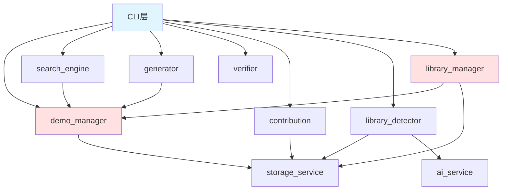
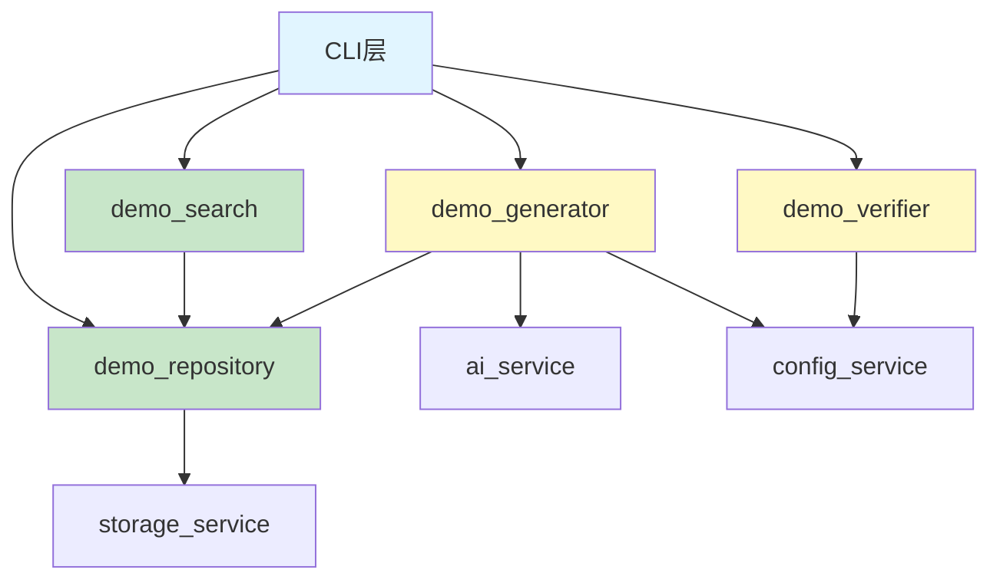

# Open Demo CLI 架构简化设计

## 设计目标

简化 Open Demo CLI 的 core 模块架构，通过代码优化、合并和职责重组，降低复杂度，提升代码质量和可读性，同时保持系统的核心功能不变。

## 当前架构分析

### 现有 Core 模块组成

当前 core 层包含 7 个独立模块：

| 模块 | 文件大小 | 主要职责 | 依赖关系 |
|------|----------|----------|----------|
| demo_manager.py | 9.9KB | Demo对象封装、加载、创建、缓存、文件管理 | storage_service |
| search_engine.py | 7.1KB | Demo搜索、过滤、匹配评分、排序 | demo_manager |
| generator.py | 4.0KB | 协调AI服务生成Demo、补充元数据 | ai_service, demo_manager, config_service |
| verifier.py | 17.8KB | Python/Java/Go/NodeJS代码验证、环境创建、执行 | config_service |
| contribution.py | 5.3KB | Demo贡献验证、用户库复制、贡献信息生成 | config_service, storage_service |
| library_detector.py | 8.5KB | 库名识别、库命令解析、启发式检测 | storage_service, ai_service |
| library_manager.py | 11.6KB | 库元数据管理、功能列表、搜索、复制 | storage_service, demo_manager |

### 架构复杂度问题

#### 职责分散

- **Demo管理碎片化**：demo_manager、library_manager 分别管理普通Demo和库Demo，存在重复逻辑
- **搜索功能冗余**：search_engine 和 library_manager 都实现搜索匹配逻辑，算法相似但分散
- **库相关功能分离**：library_detector（检测）和 library_manager（管理）职责耦合，常需同时使用

#### 依赖关系复杂



CLI 层需要直接依赖 7 个 core 模块，增加耦合度和维护成本。

#### 代码重复

- Demo 加载逻辑：demo_manager 和 library_manager 重复实现
- 搜索匹配算法：search_engine._calculate_score 和 library_manager._calculate_feature_match_score 逻辑相似
- 元数据读取：多个模块重复调用 storage.load_demo_metadata
- 路径拼接：library_detector 和 library_manager 重复拼接 libraries 路径

## 简化方案设计

### 简化原则

- **单一职责**：每个模块专注一个核心功能领域
- **高内聚低耦合**：相关功能聚合，减少跨模块依赖
- **消除重复**：提取公共逻辑，复用代码
- **最小接口**：CLI 层仅依赖少数核心模块

### 目标架构

将 7 个模块简化为 4 个模块：

| 简化后模块 | 整合内容 | 核心职责 | 规模预估 |
|------------|----------|----------|----------|
| **demo_repository.py** | demo_manager + library_manager + library_detector | 统一的Demo仓库管理（普通+库Demo） | 15-18KB |
| **demo_search.py** | search_engine + library搜索逻辑 | 统一的搜索引擎 | 8-10KB |
| **demo_generator.py** | generator（保持独立） | Demo生成协调 | 4-5KB |
| **demo_verifier.py** | verifier（保持独立） | Demo验证执行 | 18-20KB |

贡献功能（contribution.py）并入 demo_repository.py 作为仓库管理的一部分。

### 简化后架构图



## 模块设计详解

### demo_repository.py - Demo仓库管理

#### 职责范围

统一管理所有Demo资源（普通Demo + 库Demo），提供仓库级别的操作接口。

#### 整合策略

**合并 demo_manager**
- Demo 类定义
- Demo 对象加载、缓存机制
- Demo 创建、元数据更新
- 文件信息获取

**合并 library_manager**
- 库元数据加载
- 库功能列表扫描
- 库Demo路径解析

**合并 library_detector**
- 库名识别逻辑
- 库命令解析
- AI辅助库名判断

**合并 contribution**
- Demo贡献验证
- 用户库复制
- 贡献信息生成

#### 核心接口

| 接口方法 | 说明 | 整合来源 |
|----------|------|----------|
| load_demo(path) | 加载Demo对象 | demo_manager |
| load_all_demos(library, language) | 加载Demo列表 | demo_manager |
| create_demo(...) | 创建新Demo | demo_manager |
| update_metadata(demo, updates) | 更新元数据 | demo_manager |
| copy_to_output(demo) | 复制到输出目录 | demo_manager |
| detect_library_command(language, keywords) | 检测库命令 | library_detector |
| get_library_info(language, library) | 获取库信息 | library_manager |
| list_library_features(language, library) | 列出库功能 | library_manager |
| get_library_demo(language, library, feature) | 获取库Demo | library_manager |
| validate_contribution(demo_path) | 验证贡献 | contribution |
| contribute_to_user_library(demo_path) | 贡献到用户库 | contribution |

#### 内部优化

**统一Demo加载逻辑**

无论普通Demo还是库Demo，统一通过 load_demo 方法加载，内部根据路径判断类型。

**统一路径解析**

提取公共方法 _resolve_demo_path(library_type, language, library_name, feature_name)，消除路径拼接重复代码。

**缓存优化**

扩展缓存机制，缓存库元数据和功能列表，减少重复文件I/O。

**库名检测简化**

将 library_detector 的检测逻辑作为 demo_repository 的内部方法，减少对外暴露的模块数量。

### demo_search.py - 统一搜索引擎

#### 职责范围

提供统一的Demo搜索、匹配、排序能力，支持普通Demo和库Demo搜索。

#### 整合策略

**合并 search_engine**
- 关键字匹配算法
- 难度过滤
- 评分排序

**合并 library_manager 搜索逻辑**
- 库功能搜索
- 功能匹配评分

#### 核心接口

| 接口方法 | 说明 | 搜索范围 |
|----------|------|----------|
| search_demos(language, keywords, difficulty, library) | 搜索普通Demo | 内置库/用户库 |
| search_library_features(language, library, keyword) | 搜索库功能 | 指定库的功能列表 |
| get_all_languages() | 获取所有语言 | 统计维度 |
| get_all_keywords() | 获取所有关键字 | 统计维度 |

#### 内部优化

**统一匹配算法**

提取公共方法 _calculate_match_score(target, keywords, weights)，统一处理普通Demo和库功能的匹配评分。

评分权重配置化：

| 匹配类型 | 权重 | 说明 |
|----------|------|------|
| 精确匹配名称 | 10 | 名称完全相等 |
| 前缀匹配 | 8 | 名称以关键字开头 |
| 包含匹配 | 6 | 名称包含关键字 |
| 关键字匹配 | 5 | metadata.keywords包含 |
| 标题匹配 | 4 | title字段包含 |
| 描述匹配 | 3 | description字段包含 |

**统一排序策略**

提取公共方法 _sort_results(results, sort_by)，支持按分数、难度、名称组合排序。

### demo_generator.py - Demo生成协调器

#### 保持独立的理由

- 职责单一：仅负责协调AI生成和元数据补充
- 依赖明确：依赖ai_service和demo_repository
- 规模适中：4KB左右，无需拆分
- 变化独立：生成逻辑可能根据AI服务调整，独立模块便于维护

#### 调整优化

**依赖调整**

将对 demo_manager 的依赖改为 demo_repository。

**库Demo生成增强**

通过 library_name 参数标识库Demo生成，由 demo_repository 统一处理目录结构。

### demo_verifier.py - Demo验证执行器

#### 保持独立的理由

- 职责独立：专注Demo可执行性验证
- 规模最大：17.8KB，包含多语言验证逻辑
- 变化独立：验证逻辑随语言工具链变化
- 可选功能：验证是可选功能，独立模块利于按需加载

#### 调整优化

**无需整合**

保持当前实现，仅调整代码风格统一。

**扩展性预留**

为未来增加更多语言验证预留接口扩展点。

## CLI层调整

### 依赖简化

简化前 CLI 导入：

| 导入模块数 | 模块列表 |
|------------|----------|
| 7个 | demo_manager, search_engine, generator, verifier, contribution, library_detector, library_manager |

简化后 CLI 导入：

| 导入模块数 | 模块列表 |
|------------|----------|
| 4个 | demo_repository, demo_search, demo_generator, demo_verifier |

### 调用示例调整

#### 获取Demo流程

简化前：

```
初始化7个模块
library_detector.parse_library_command() -> 检测库命令
library_manager.get_library_info() -> 获取库信息
library_manager.search_library_feature() -> 搜索库功能
library_manager.get_feature_demo() -> 获取库Demo
library_manager.copy_feature_to_output() -> 复制
search_engine.search() -> 搜索普通Demo
demo_manager.copy_demo_to_output() -> 复制
```

简化后：

```
初始化4个模块
repository.detect_library_command() -> 检测库命令
repository.get_library_info() -> 获取库信息
search.search_library_features() -> 搜索库功能
repository.get_library_demo() -> 获取库Demo
repository.copy_to_output() -> 复制（统一接口）
search.search_demos() -> 搜索普通Demo
repository.copy_to_output() -> 复制（统一接口）
```

#### 生成Demo流程

简化前：

```
generator.generate()
  -> demo_manager.create_demo()
contribution_manager.prompt_contribution()
contribution_manager.validate_demo()
contribution_manager.copy_to_user_library()
```

简化后：

```
generator.generate()
  -> repository.create_demo()
repository.prompt_contribution()
repository.validate_contribution()
repository.contribute_to_user_library()
```

## 代码质量提升措施

### 命名规范统一

- 类名：PascalCase（DemoRepository）
- 方法名：snake_case（load_demo）
- 常量：UPPER_SNAKE_CASE（DEFAULT_DIFFICULTY）
- 私有方法：_leading_underscore（_resolve_path）

### 类型注解完善

所有公共方法添加完整类型注解：

| 注解位置 | 示例 |
|----------|------|
| 参数类型 | def load_demo(self, path: Path) -> Optional[Demo] |
| 返回类型 | -> Optional[Demo] |
| 列表泛型 | List[Demo] |
| 字典泛型 | Dict[str, Any] |

### 文档字符串规范

采用 Google 风格文档字符串：

- 模块级：说明模块职责
- 类级：说明类用途
- 方法级：说明参数、返回值、异常

### 错误处理增强

- 异常捕获明确化：捕获具体异常类型而非通用Exception
- 日志记录完善：关键操作记录日志，便于调试
- 失败降级：非关键功能失败时提供降级方案

### 代码复用

提取以下公共工具方法：

| 工具方法 | 功能 | 使用场景 |
|----------|------|----------|
| _generate_safe_name(name) | 生成安全目录名 | Demo创建、库名处理 |
| _resolve_demo_path(...) | 解析Demo路径 | 所有路径查找操作 |
| _calculate_match_score(...) | 计算匹配分数 | 搜索匹配 |
| _sort_by_criteria(...) | 多条件排序 | 搜索结果排序 |

## 性能优化

### 缓存策略

| 缓存内容 | 缓存位置 | 失效策略 |
|----------|----------|----------|
| Demo对象 | demo_repository._demo_cache | 元数据更新时清除 |
| 库元数据 | demo_repository._library_metadata_cache | 扫描新库时清除 |
| 库功能列表 | demo_repository._library_features_cache | 新增功能时清除 |
| 支持的库列表 | demo_repository._supported_libraries_cache | 手动调用clear_cache清除 |

### I/O优化

- 批量加载：load_all_demos 一次性扫描目录，避免多次递归
- 延迟加载：库功能列表按需加载，减少启动时间
- 路径缓存：已解析路径缓存避免重复计算

### 搜索优化

- 提前过滤：先按语言、库类型过滤，再进行关键字匹配
- 分数阈值：设置最低匹配分数，过滤无关结果
- Top-K限制：搜索结果默认返回前20条，避免大量无用结果

## 兼容性保证

### 对外接口兼容

虽然内部模块合并，但对外接口保持兼容，通过别名导出支持旧代码过渡：

| 旧接口 | 新实现位置 | 兼容方式 |
|--------|------------|----------|
| demo_manager.DemoManager | demo_repository.DemoRepository | 类型别名 |
| search_engine.SearchEngine | demo_search.DemoSearch | 类型别名 |

### 元数据兼容

- metadata.json 格式不变
- 目录结构不变
- 库Demo路径规范不变

### CLI命令兼容

所有CLI命令行为保持不变，用户无感知。

## 迁移策略

### 迁移步骤

| 步骤 | 操作 | 验证方式 |
|------|------|----------|
| 1 | 创建新模块 demo_repository.py | 单元测试通过 |
| 2 | 迁移 demo_manager 逻辑到 demo_repository | 功能测试对比 |
| 3 | 迁移 library_manager 和 library_detector | 库Demo测试 |
| 4 | 迁移 contribution 逻辑 | 贡献流程测试 |
| 5 | 创建新模块 demo_search.py | 单元测试通过 |
| 6 | 迁移 search_engine 逻辑 | 搜索结果对比 |
| 7 | 迁移 library搜索逻辑 | 库功能搜索测试 |
| 8 | 更新 demo_generator 依赖 | 生成流程测试 |
| 9 | 调整 CLI 层导入和调用 | 集成测试 |
| 10 | 删除旧模块文件 | 回归测试 |

### 测试策略

**单元测试**

为新模块编写单元测试，覆盖率目标 80% 以上。

**功能测试**

对比简化前后核心功能行为一致性：

- get 命令：普通Demo获取、库Demo获取
- search 命令：普通搜索、库功能搜索
- new 命令：Demo生成、库Demo生成
- 贡献流程：验证、复制、信息生成

**性能测试**

对比简化前后性能指标：

- 启动时间
- 搜索响应时间
- 内存占用

### 回滚方案

保留旧模块代码分支，如遇严重问题可快速回滚。

## 风险评估

### 技术风险

| 风险项 | 风险等级 | 缓解措施 |
|--------|----------|----------|
| 模块合并引入缺陷 | 中 | 充分的单元测试和集成测试 |
| 性能回退 | 低 | 性能基准测试对比 |
| 接口兼容性问题 | 低 | 保留兼容层，逐步迁移 |

### 工作量风险

| 任务 | 预估工作量 | 风险 |
|------|------------|------|
| demo_repository 实现 | 2-3天 | 中，逻辑复杂需仔细整合 |
| demo_search 实现 | 1-2天 | 低，逻辑相对独立 |
| CLI 层调整 | 1天 | 低，主要是导入和调用调整 |
| 测试编写和执行 | 2-3天 | 中，需覆盖多种场景 |
| 文档更新 | 0.5天 | 低 |

总工作量：6.5-9.5天

## 预期收益

### 代码质量提升

- 模块数量：7个 -> 4个，减少 43%
- 代码重复率：预计降低 30%
- 循环依赖：消除 library_detector 和 library_manager 的循环引用
- 可读性：职责更清晰，接口更简洁

### 维护成本降低

- CLI 依赖模块减少，降低耦合度
- 统一的Demo管理逻辑，减少理解成本
- 统一的搜索算法，便于优化和扩展

### 性能提升

- 缓存策略优化，减少重复I/O
- 统一路径解析，减少重复计算
- 搜索算法优化，提升响应速度

### 扩展性增强

- 新增语言支持更简单（仅需扩展 demo_repository 和 demo_verifier）
- 新增库Demo更方便（统一的库管理接口）
- 搜索算法升级更容易（集中在 demo_search）

## 后续优化方向

### 异步I/O

在大规模Demo库场景，考虑引入异步I/O提升搜索性能。

### 索引机制

构建Demo索引文件，加速搜索和统计操作。

### 插件化架构

将语言验证器抽象为插件接口，支持动态加载验证器。

### 分布式缓存

对于企业级部署，支持Redis等分布式缓存共享Demo元数据。
