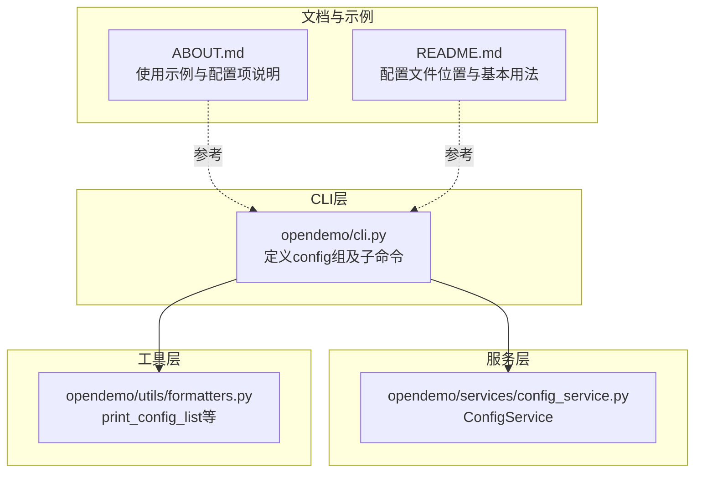
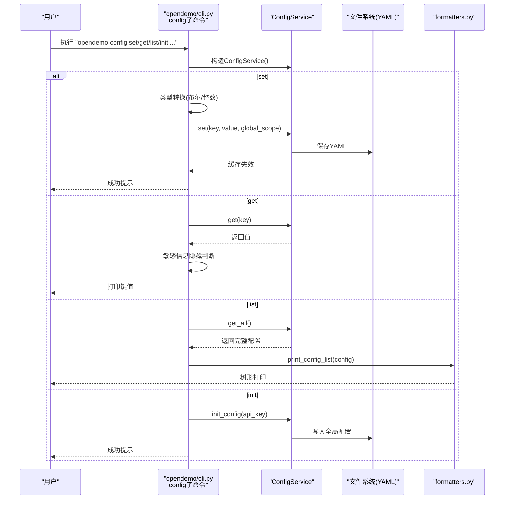
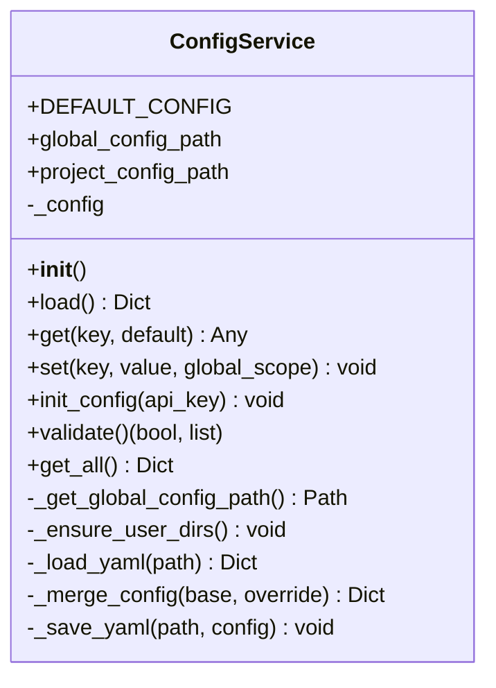
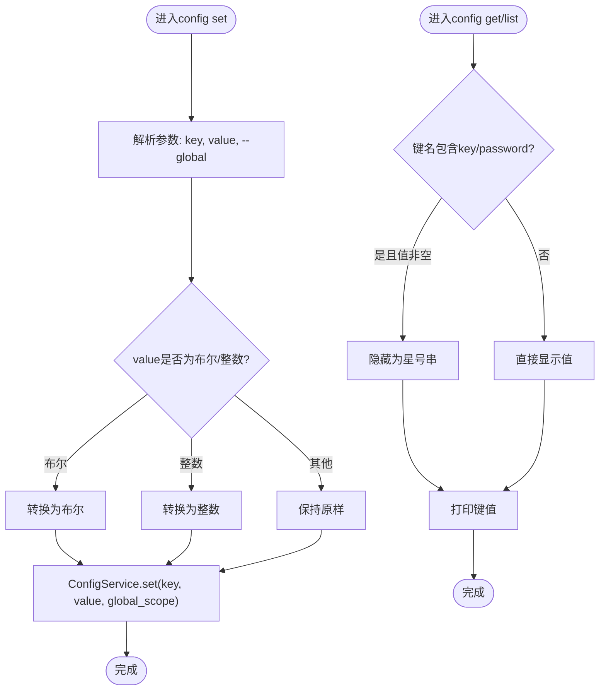
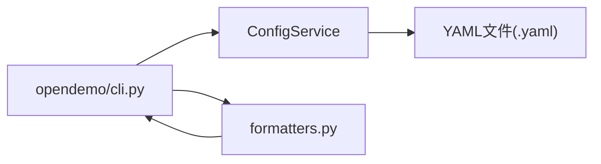

# config命令

<cite>
**本文引用的文件**
- [opendemo/cli.py](file://opendemo/cli.py)
- [opendemo/services/config_service.py](file://opendemo/services/config_service.py)
- [opendemo/utils/formatters.py](file://opendemo/utils/formatters.py)
- [ABOUT.md](file://ABOUT.md)
- [README.md](file://README.md)
</cite>

## 目录
1. [简介](#简介)
2. [项目结构](#项目结构)
3. [核心组件](#核心组件)
4. [架构总览](#架构总览)
5. [详细组件分析](#详细组件分析)
6. [依赖分析](#依赖分析)
7. [性能考虑](#性能考虑)
8. [故障排查指南](#故障排查指南)
9. [结论](#结论)
10. [附录](#附录)

## 简介
本文件聚焦于config配置管理子命令组，系统性阐述其在CLI中的职责与实现：初始化配置、设置键值对、获取配置项、列出全部配置。文档同时解析config命令与ConfigService之间的依赖关系，说明其如何通过YAML文件读写配置，并结合ABOUT.md中的示例演示完整的配置管理工作流。针对初学者，提供常用配置项（如ai.api_key、output_directory）的说明；针对开发者，解释全局/项目配置的作用域与内部实现机制。

## 项目结构
config命令位于CLI入口文件中，作为@cli.group()的一个子命令组，包含四个子命令：init、set、get、list。ConfigService负责实际的配置读写与合并逻辑，格式化输出由formatters模块提供。

图表来源
- [opendemo/cli.py](file://opendemo/cli.py#L473-L538)
- [opendemo/services/config_service.py](file://opendemo/services/config_service.py#L1-L280)
- [opendemo/utils/formatters.py](file://opendemo/utils/formatters.py#L131-L154)
- [ABOUT.md](file://ABOUT.md#L204-L219)
- [README.md](file://README.md#L91-L101)

章节来源
- [opendemo/cli.py](file://opendemo/cli.py#L473-L538)
- [opendemo/services/config_service.py](file://opendemo/services/config_service.py#L1-L280)
- [opendemo/utils/formatters.py](file://opendemo/utils/formatters.py#L131-L154)
- [ABOUT.md](file://ABOUT.md#L204-L219)
- [README.md](file://README.md#L91-L101)

## 核心组件
- config组与子命令
  - @cli.group()定义config组，包含init、set、get、list四个子命令。
  - 子命令均通过ConfigService实例完成配置读写。
- ConfigService
  - 提供默认配置、全局/项目配置文件路径、加载与合并策略、键值访问与设置、初始化、校验与全量读取。
- 输出格式化
  - print_config_list用于以树形键路径形式打印配置，支持敏感信息隐藏。

章节来源
- [opendemo/cli.py](file://opendemo/cli.py#L473-L538)
- [opendemo/services/config_service.py](file://opendemo/services/config_service.py#L1-L280)
- [opendemo/utils/formatters.py](file://opendemo/utils/formatters.py#L131-L154)

## 架构总览
config命令的调用链路如下：CLI子命令接收参数，构造ConfigService，按需进行类型转换、敏感信息隐藏、YAML读写与合并，最终通过formatters输出结果。

图表来源
- [opendemo/cli.py](file://opendemo/cli.py#L479-L538)
- [opendemo/services/config_service.py](file://opendemo/services/config_service.py#L170-L242)
- [opendemo/utils/formatters.py](file://opendemo/utils/formatters.py#L131-L154)

## 详细组件分析

### config组与子命令
- 组定义
  - @cli.group()定义config组，作为配置管理的命名空间。
- 子命令
  - init：初始化全局配置文件，可传入API密钥。
  - set：设置配置项，支持布尔/整数类型自动转换，默认写入全局配置。
  - get：获取配置项，若键名包含“key”或“password”，值会被隐藏。
  - list：列出所有配置，采用树形键路径打印，敏感信息同样隐藏。

章节来源
- [opendemo/cli.py](file://opendemo/cli.py#L473-L538)

### ConfigService：配置读写与合并
- 默认配置
  - 包含输出目录、用户库路径、默认语言、验证开关与方法、AI相关参数、贡献与显示配置等。
- 配置文件位置
  - 全局配置：用户主目录下的“.opendemo/config.yaml”
  - 项目配置：当前工作目录下的“.opendemo.yaml”
- 加载与合并
  - 从默认配置开始，依次合并全局配置与项目配置；项目配置优先级更高。
- 键访问与设置
  - get支持点分隔嵌套键；set支持点分隔嵌套键，自动创建中间字典并保存至对应文件。
- 初始化
  - init_config根据默认配置创建全局配置文件，可选填充API密钥。
- 校验
  - validate检查AI密钥、输出目录可写性、验证超时等。
- 全量读取
  - get_all返回合并后的完整配置副本。

图表来源
- [opendemo/services/config_service.py](file://opendemo/services/config_service.py#L1-L280)

章节来源
- [opendemo/services/config_service.py](file://opendemo/services/config_service.py#L1-L280)

### 输出格式化：print_config_list
- 递归遍历配置字典，以“前缀.键”的形式打印，便于理解嵌套结构。
- 对包含“key”或“password”的键，值会被隐藏，避免泄露敏感信息。

章节来源
- [opendemo/utils/formatters.py](file://opendemo/utils/formatters.py#L131-L154)

### 类型转换与敏感信息隐藏流程
- set命令的类型转换
  - 将字符串"true"/"false"转换为布尔值；将纯数字字符串转换为整数；否则保持原样。
- get与list的敏感信息隐藏
  - 当键名包含“key”或“password”时，非空值会被替换为固定长度的星号串。

图表来源
- [opendemo/cli.py](file://opendemo/cli.py#L488-L538)
- [opendemo/utils/formatters.py](file://opendemo/utils/formatters.py#L131-L154)

## 依赖分析
- CLI对ConfigService的依赖
  - config子命令在执行时均构造ConfigService实例，委托其完成配置读写与合并。
- ConfigService对文件系统的依赖
  - 通过YAML安全加载与写入，读取全局与项目配置文件。
- 输出格式化对CLI的依赖
  - print_config_list由CLI调用，用于list子命令的输出。

图表来源
- [opendemo/cli.py](file://opendemo/cli.py#L473-L538)
- [opendemo/services/config_service.py](file://opendemo/services/config_service.py#L108-L219)
- [opendemo/utils/formatters.py](file://opendemo/utils/formatters.py#L131-L154)

章节来源
- [opendemo/cli.py](file://opendemo/cli.py#L473-L538)
- [opendemo/services/config_service.py](file://opendemo/services/config_service.py#L108-L219)
- [opendemo/utils/formatters.py](file://opendemo/utils/formatters.py#L131-L154)

## 性能考虑
- 配置缓存
  - ConfigService在load()中缓存合并后的配置，避免重复读取与合并开销。
- YAML读写
  - 仅在set时写入，get/list不触发写入，减少I/O。
- 嵌套键访问
  - get按点分隔逐层访问，复杂度与嵌套深度成正比，通常较浅，影响有限。
- 敏感信息隐藏
  - 仅在输出阶段进行字符串替换，开销极小。

[本节为通用性能讨论，无需特定文件引用]

## 故障排查指南
- 初始化失败
  - 若全局配置文件已存在，初始化会被跳过；可手动删除后再尝试。
- set写入失败
  - 检查目标路径权限与磁盘空间；确认--global选项是否符合预期。
- get/list显示异常
  - 确认键名正确（支持点分隔嵌套）；敏感信息会被隐藏。
- 配置验证告警
  - validate会提示AI密钥缺失、输出目录不可写、验证超时非法等问题。

章节来源
- [opendemo/services/config_service.py](file://opendemo/services/config_service.py#L220-L242)
- [opendemo/services/config_service.py](file://opendemo/services/config_service.py#L243-L271)

## 结论
config命令组提供了完善的配置管理能力：通过init快速建立全局配置，set支持类型转换与作用域控制，get与list兼顾易用性与安全性（敏感信息隐藏）。ConfigService以YAML文件为载体，实现默认、全局、项目三层配置的合并，满足不同场景下的配置需求。结合ABOUT.md与README中的示例，用户可以快速完成配置初始化与日常维护。

[本节为总结性内容，无需特定文件引用]

## 附录

### 配置项说明（面向初学者）
- ai.api_key：AI服务API密钥，用于生成新Demo。
- output_directory：Demo输出目录，默认为项目根目录下的opendemo_output。
- enable_verification：是否启用自动验证。
- ai.model：使用的AI模型名称。
- display.color_output：是否启用彩色输出。
- user_demo_library：用户Demo库路径，默认位于用户主目录的.opendemo/demos。

章节来源
- [ABOUT.md](file://ABOUT.md#L267-L288)
- [README.md](file://README.md#L91-L101)

### 全局/项目配置作用域与内部实现（面向开发者）
- 作用域
  - 全局配置：用户主目录下的~/.opendemo/config.yaml，适用于所有项目。
  - 项目配置：当前工作目录下的./.opendemo.yaml，仅影响当前项目。
- 合并策略
  - 默认配置为基础，依次合并全局配置与项目配置；项目配置优先级更高。
- set行为
  - 默认写入全局配置；若指定--global=false，则写入项目配置。
- get行为
  - 从合并后的配置中按点分隔键访问，支持嵌套字典。
- 初始化
  - init_config基于默认配置创建全局配置文件，可选填充API密钥。

章节来源
- [opendemo/services/config_service.py](file://opendemo/services/config_service.py#L51-L106)
- [opendemo/services/config_service.py](file://opendemo/services/config_service.py#L170-L203)
- [opendemo/services/config_service.py](file://opendemo/services/config_service.py#L220-L242)

### 完整工作流示例（来自ABOUT.md）
- 初始化配置
  - opendemo config init
- 查看所有配置
  - opendemo config list
- 获取特定配置
  - opendemo config get ai.model
- 设置配置项
  - opendemo config set ai.api_key sk-xxx
  - opendemo config set output_directory ./my_demos

章节来源
- [ABOUT.md](file://ABOUT.md#L204-L219)