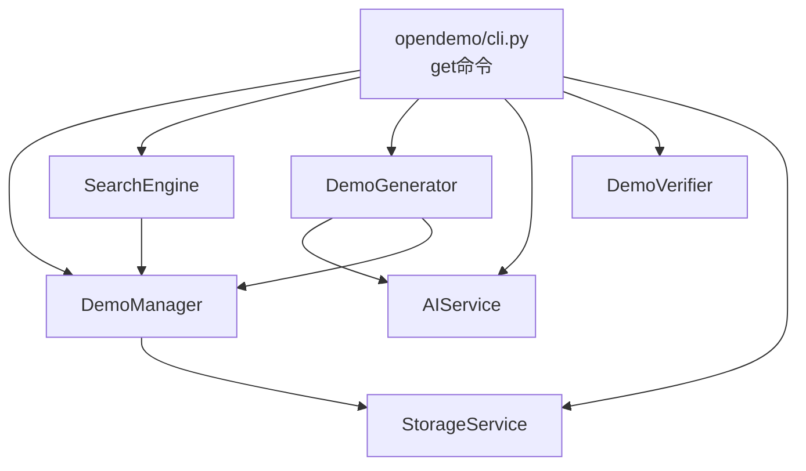
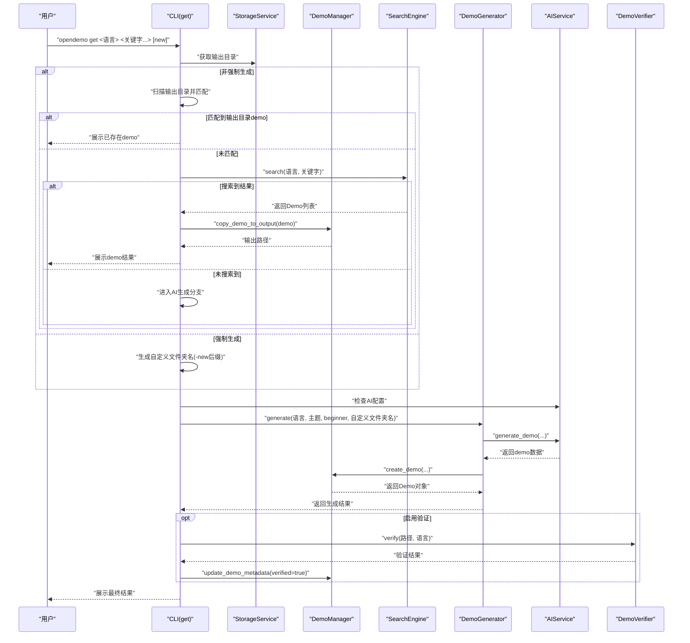
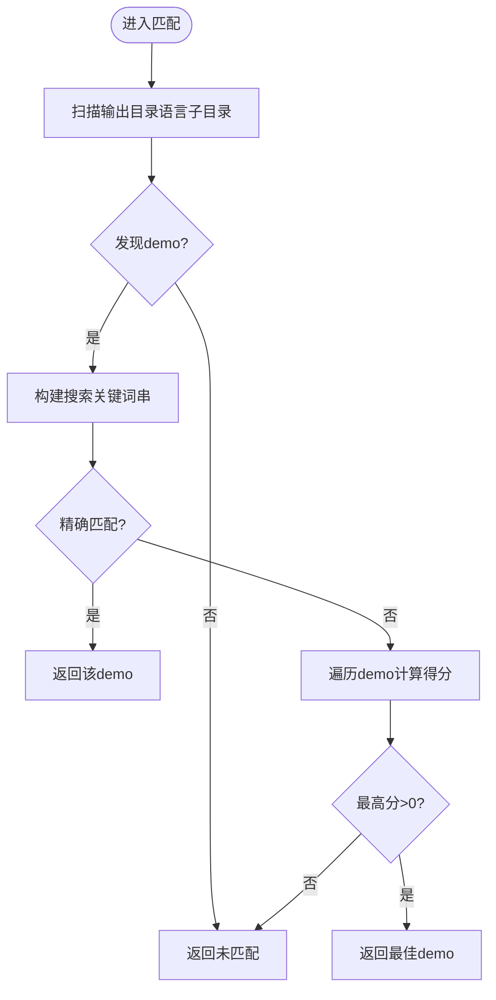
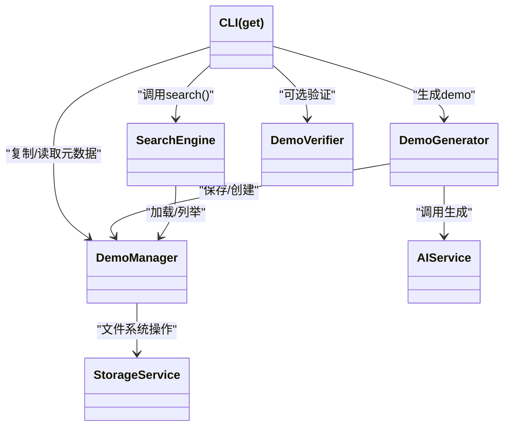
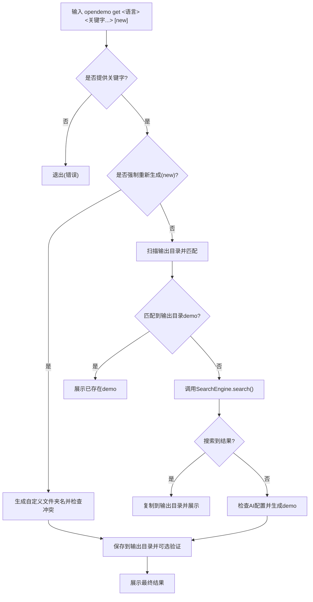

# get命令

<cite>
**本文引用的文件**
- [opendemo/cli.py](file://opendemo/cli.py)
- [opendemo/core/search_engine.py](file://opendemo/core/search_engine.py)
- [opendemo/core/demo_manager.py](file://opendemo/core/demo_manager.py)
- [opendemo/core/generator.py](file://opendemo/core/generator.py)
- [opendemo/core/verifier.py](file://opendemo/core/verifier.py)
- [opendemo/services/ai_service.py](file://opendemo/services/ai_service.py)
- [opendemo/services/storage_service.py](file://opendemo/services/storage_service.py)
- [ABOUT.md](file://ABOUT.md)
- [USAGE_GUIDE.md](file://USAGE_GUIDE.md)
</cite>

## 目录
1. [简介](#简介)
2. [项目结构](#项目结构)
3. [核心组件](#核心组件)
4. [架构总览](#架构总览)
5. [详细组件分析](#详细组件分析)
6. [依赖分析](#依赖分析)
7. [性能考虑](#性能考虑)
8. [故障排查指南](#故障排查指南)
9. [结论](#结论)
10. [附录](#附录)

## 简介
本节围绕 get 命令展开，重点说明其“三层匹配优先级机制”（精确匹配 > 语义匹配 > AI生成），以及 force_new 参数（'new'关键字）如何触发强制重新生成流程。文档同时梳理 get 命令与 DemoManager、SearchEngine、DemoGenerator 和 DemoVerifier 的交互关系，并结合 ABOUT.md 中的示例展示不同场景下的输出结果。最后提供初学者使用流程图与开发者错误处理机制及系统退出码说明。

## 项目结构
get 命令位于 CLI 层，负责解析参数、组织服务层与核心业务层协作，并在不同匹配阶段输出结果。其核心流程涉及：
- CLI 参数解析与校验
- 输出目录扫描与匹配
- 本地库搜索（SearchEngine）
- AI 生成（DemoGenerator + AIService）
- 结果展示与可选验证（DemoVerifier）

图表来源
- [opendemo/cli.py](file://opendemo/cli.py#L196-L324)
- [opendemo/core/search_engine.py](file://opendemo/core/search_engine.py#L26-L66)
- [opendemo/core/demo_manager.py](file://opendemo/core/demo_manager.py#L74-L110)
- [opendemo/core/generator.py](file://opendemo/core/generator.py#L15-L103)
- [opendemo/services/ai_service.py](file://opendemo/services/ai_service.py#L38-L86)
- [opendemo/services/storage_service.py](file://opendemo/services/storage_service.py#L213-L222)

章节来源
- [opendemo/cli.py](file://opendemo/cli.py#L196-L324)

## 核心组件
- CLI 层（get 命令）：负责参数解析、分支控制（是否强制重新生成）、调用各服务、展示结果与错误处理。
- DemoManager：封装 Demo 对象、加载/保存/复制、元数据更新、文件列举。
- SearchEngine：在内置/用户库中按关键字与难度进行匹配与排序。
- DemoGenerator：协调 AIService 生成 demo，并通过 DemoManager 保存到输出目录或用户库。
- DemoVerifier：根据配置对生成的 demo 进行可执行性验证。
- AIService：封装 LLM API 调用、重试、prompt 构造与响应解析。
- StorageService：提供输出目录、内置/用户库路径、文件系统操作。

章节来源
- [opendemo/core/demo_manager.py](file://opendemo/core/demo_manager.py#L74-L110)
- [opendemo/core/search_engine.py](file://opendemo/core/search_engine.py#L26-L66)
- [opendemo/core/generator.py](file://opendemo/core/generator.py#L15-L103)
- [opendemo/core/verifier.py](file://opendemo/core/verifier.py#L19-L60)
- [opendemo/services/ai_service.py](file://opendemo/services/ai_service.py#L38-L86)
- [opendemo/services/storage_service.py](file://opendemo/services/storage_service.py#L213-L222)

## 架构总览
get 命令的执行路径分为两条主线：
- 本地命中路径：先扫描输出目录，若未命中再在内置/用户库中搜索；命中即复制到输出目录并展示。
- AI 生成路径：当 force_new 或未命中时，检查配置后调用 AIService 生成 demo，保存到输出目录并可选验证。

图表来源
- [opendemo/cli.py](file://opendemo/cli.py#L226-L324)
- [opendemo/core/search_engine.py](file://opendemo/core/search_engine.py#L26-L66)
- [opendemo/core/generator.py](file://opendemo/core/generator.py#L31-L103)
- [opendemo/services/ai_service.py](file://opendemo/services/ai_service.py#L38-L86)
- [opendemo/core/verifier.py](file://opendemo/core/verifier.py#L31-L60)
- [opendemo/core/demo_manager.py](file://opendemo/core/demo_manager.py#L252-L271)

## 详细组件分析

### get 命令实现与三层匹配优先级
- 参数解析与校验
  - 语言白名单校验，不支持则退出。
  - 支持 --verify 标志。
- force_new 机制
  - 若 keywords 末尾为 'new'，则标记 force_new 并移除该关键字。
  - 强制生成时，生成自定义文件夹名（基于关键字拼接），若同名存在则追加数字后缀。
- 三层匹配优先级
  1) 精确匹配：输出目录中文件夹名与“连字符连接后的关键字”或“单个关键字”完全一致。
  2) 语义匹配：输出目录中文件夹名包含任一关键字，或 metadata.keywords 包含关键字，按匹配得分选择最佳。
  3) AI生成：若前两步均未命中，则检查 AI 配置并调用 AIService 生成 demo，保存到输出目录。
- 与 SearchEngine 的交互
  - 未命中输出目录时，调用 search(language, keywords) 返回排序后的 Demo 列表，取首个复制到输出目录。
- 与 DemoManager 的交互
  - 复制：copy_demo_to_output(demo)。
  - 展示：get_demo_files(demo)、update_demo_metadata(...)。
- 与 DemoVerifier 的交互
  - 可选验证：verify(demo.path, language)，通过后更新 metadata.verified。

章节来源
- [opendemo/cli.py](file://opendemo/cli.py#L226-L324)
- [opendemo/cli.py](file://opendemo/cli.py#L104-L159)
- [opendemo/core/search_engine.py](file://opendemo/core/search_engine.py#L26-L66)
- [opendemo/core/demo_manager.py](file://opendemo/core/demo_manager.py#L252-L271)
- [opendemo/core/verifier.py](file://opendemo/core/verifier.py#L31-L60)

### _match_demo_in_output 精确/语义匹配算法
- 扫描输出目录语言子目录，收集包含 metadata.json 的 demo。
- 精确匹配：folder_name 等于“关键字连字符拼接”或“单个关键字”。
- 语义匹配：计算 folder_name 与 metadata.keywords 的包含关系得分，取最高分者。
- 得分规则（示例）：folder 名包含关键字+10，metadata.keywords 包含关键字+5；最终保留最高分 demo。

图表来源
- [opendemo/cli.py](file://opendemo/cli.py#L104-L159)

章节来源
- [opendemo/cli.py](file://opendemo/cli.py#L104-L159)

### SearchEngine.search 的语义匹配与排序
- 加载内置/用户库全部 demo。
- 计算匹配分数：名称包含+高权重、metadata.keywords 包含+中等权重、description 包含+中等权重、整体文本包含+低权重。
- 可选难度过滤：若指定难度则精确匹配，否则返回所有匹配并按分数降序排列。
- 默认排序：若无过滤条件，按名称排序。

章节来源
- [opendemo/core/search_engine.py](file://opendemo/core/search_engine.py#L26-L66)
- [opendemo/core/search_engine.py](file://opendemo/core/search_engine.py#L67-L129)
- [opendemo/core/search_engine.py](file://opendemo/core/search_engine.py#L131-L147)
- [opendemo/core/search_engine.py](file://opendemo/core/search_engine.py#L148-L160)

### DemoGenerator 与 AIService 的协作
- DemoGenerator.generate
  - 调用 AIService.generate_demo(...) 生成 demo 数据。
  - 补充元数据（作者、时间戳、版本、verified=false）。
  - 通过 DemoManager.create_demo(...) 保存到输出目录或用户库。
  - 返回包含 demo、路径、文件列表等的结果字典。
- AIService.generate_demo
  - 加载配置（api_key、endpoint、model、temperature、max_tokens）。
  - 构建 prompt（包含编码规范、依赖文件、输出格式约束）。
  - 调用 API 并重试，解析响应为 JSON，校验必需字段。
  - 返回 demo 数据（metadata + files）。

章节来源
- [opendemo/core/generator.py](file://opendemo/core/generator.py#L31-L103)
- [opendemo/services/ai_service.py](file://opendemo/services/ai_service.py#L38-L86)
- [opendemo/services/ai_service.py](file://opendemo/services/ai_service.py#L87-L176)
- [opendemo/services/ai_service.py](file://opendemo/services/ai_service.py#L177-L225)
- [opendemo/services/ai_service.py](file://opendemo/services/ai_service.py#L226-L291)

### DemoVerifier 的验证策略
- 当配置开启验证时，按语言分别验证：
  - Python：复制到临时目录，创建虚拟环境，安装 requirements.txt（如有），依次执行 code/*.py，记录步骤、输出与错误。
  - Java：当前简化返回“尚未完全实现”的错误信息。
- 生成报告：汇总状态、方法、步骤、输出与错误。

章节来源
- [opendemo/core/verifier.py](file://opendemo/core/verifier.py#L31-L60)
- [opendemo/core/verifier.py](file://opendemo/core/verifier.py#L61-L129)
- [opendemo/core/verifier.py](file://opendemo/core/verifier.py#L204-L224)
- [opendemo/core/verifier.py](file://opendemo/core/verifier.py#L225-L270)

### 不同场景下的输出结果（结合 ABOUT.md 示例）
- 精确匹配已有 Demo
  - 输出包含：Demo已存在、名称、语言、路径、关键字、描述、包含文件、快速开始步骤、重新生成提示。
- 语义匹配（如 list → list-operations）
  - 输出与上述类似，但来自本地库搜索结果。
- 强制重新生成（添加 'new'）
  - 输出包含：强制重新生成提示、AI生成进度、成功生成、快速开始步骤、验证结果（如启用）。

章节来源
- [ABOUT.md](file://ABOUT.md#L149-L188)
- [ABOUT.md](file://ABOUT.md#L156-L167)
- [ABOUT.md](file://ABOUT.md#L168-L187)
- [USAGE_GUIDE.md](file://USAGE_GUIDE.md#L56-L97)
- [USAGE_GUIDE.md](file://USAGE_GUIDE.md#L177-L191)

## 依赖分析
- get 命令对各组件的依赖关系
  - CLI(get) 依赖：ConfigService、StorageService、DemoManager、SearchEngine、AIService、DemoGenerator、DemoVerifier。
  - SearchEngine 依赖：DemoManager。
  - DemoGenerator 依赖：AIService、DemoManager、ConfigService。
  - DemoVerifier 依赖：ConfigService。
  - StorageService 依赖：ConfigService。
- 耦合与内聚
  - CLI 层承担编排职责，耦合度适中；核心业务（匹配、生成、验证）由独立模块实现，内聚良好。
- 外部依赖
  - AIService 依赖网络请求与 LLM API；DemoVerifier 依赖系统子进程与虚拟环境。

图表来源
- [opendemo/cli.py](file://opendemo/cli.py#L196-L324)
- [opendemo/core/search_engine.py](file://opendemo/core/search_engine.py#L26-L66)
- [opendemo/core/demo_manager.py](file://opendemo/core/demo_manager.py#L74-L110)
- [opendemo/core/generator.py](file://opendemo/core/generator.py#L15-L103)
- [opendemo/services/ai_service.py](file://opendemo/services/ai_service.py#L38-L86)
- [opendemo/core/verifier.py](file://opendemo/core/verifier.py#L31-L60)
- [opendemo/services/storage_service.py](file://opendemo/services/storage_service.py#L213-L222)

## 性能考虑
- 匹配阶段
  - 输出目录扫描与匹配为 O(N)（N 为语言子目录下 demo 数量），语义匹配得分计算为 O(N×K)（K 为关键字数量）。
- 搜索阶段
  - SearchEngine 需加载全部 demo 并逐个计算分数，复杂度 O(M×K)（M 为库中 demo 数量）。
- 生成阶段
  - AIService 的 API 调用受网络与模型响应时间影响，具备重试机制。
- 验证阶段
  - Python 验证涉及虚拟环境创建、依赖安装与多次执行，耗时较长，建议按需启用。

[本节为一般性指导，不直接分析具体文件]

## 故障排查指南
- 语言不支持
  - 现象：打印不支持的语言并退出。
  - 处理：确认语言在支持列表中。
- 关键字缺失
  - 现象：提示需要提供关键字并退出。
  - 处理：确保至少提供一个关键字。
- AI API 密钥未配置
  - 现象：提示未配置 API 密钥并退出。
  - 处理：使用 config 命令设置 ai.api_key。
- 生成失败
  - 现象：生成失败并退出。
  - 处理：检查网络、API 端点与模型配置；查看日志。
- 验证失败
  - 现象：验证未通过，列出错误。
  - 处理：检查依赖安装、代码可执行性与超时设置；必要时禁用验证。
- 强制重新生成冲突
  - 现象：输出目录已存在同名文件夹。
  - 处理：系统自动追加数字后缀；也可手动清理后重试。

章节来源
- [opendemo/cli.py](file://opendemo/cli.py#L211-L236)
- [opendemo/cli.py](file://opendemo/cli.py#L283-L313)
- [opendemo/core/verifier.py](file://opendemo/core/verifier.py#L31-L60)

## 结论
get 命令通过“输出目录精确/语义匹配 + 本地库搜索 + AI 生成”的三层机制，兼顾效率与覆盖范围。force_new 参数为用户提供可控的强制重新生成能力。配合 DemoManager、SearchEngine、DemoGenerator、DemoVerifier 与 AIService 的协同，实现了从检索到生成再到验证的完整闭环。建议在生产环境中按需启用验证，并合理配置 AI 与存储路径以获得最佳体验。

[本节为总结性内容，不直接分析具体文件]

## 附录

### 使用流程图（初学者友好）

图表来源
- [opendemo/cli.py](file://opendemo/cli.py#L226-L324)
- [opendemo/core/search_engine.py](file://opendemo/core/search_engine.py#L26-L66)

### 错误处理机制与系统退出码（开发者参考）
- 语言不支持：打印提示并 sys.exit(1)
- 关键字缺失：打印提示并 sys.exit(1)
- AI API 密钥未配置：打印提示并 sys.exit(1)
- 生成失败：打印失败并 sys.exit(1)
- 验证未通过：打印错误并继续（不影响退出码）
- Ctrl+C：捕获异常并打印取消提示，sys.exit(0)
- 其他未预期异常：打印错误并记录日志，sys.exit(1)

章节来源
- [opendemo/cli.py](file://opendemo/cli.py#L211-L236)
- [opendemo/cli.py](file://opendemo/cli.py#L283-L313)
- [opendemo/cli.py](file://opendemo/cli.py#L594-L610)