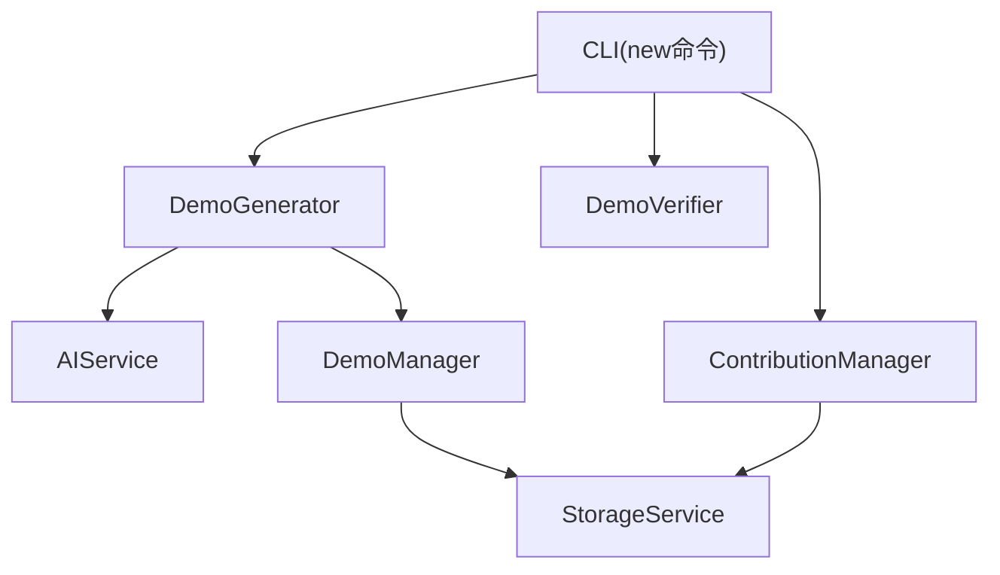
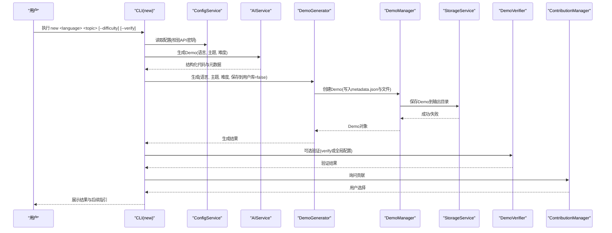
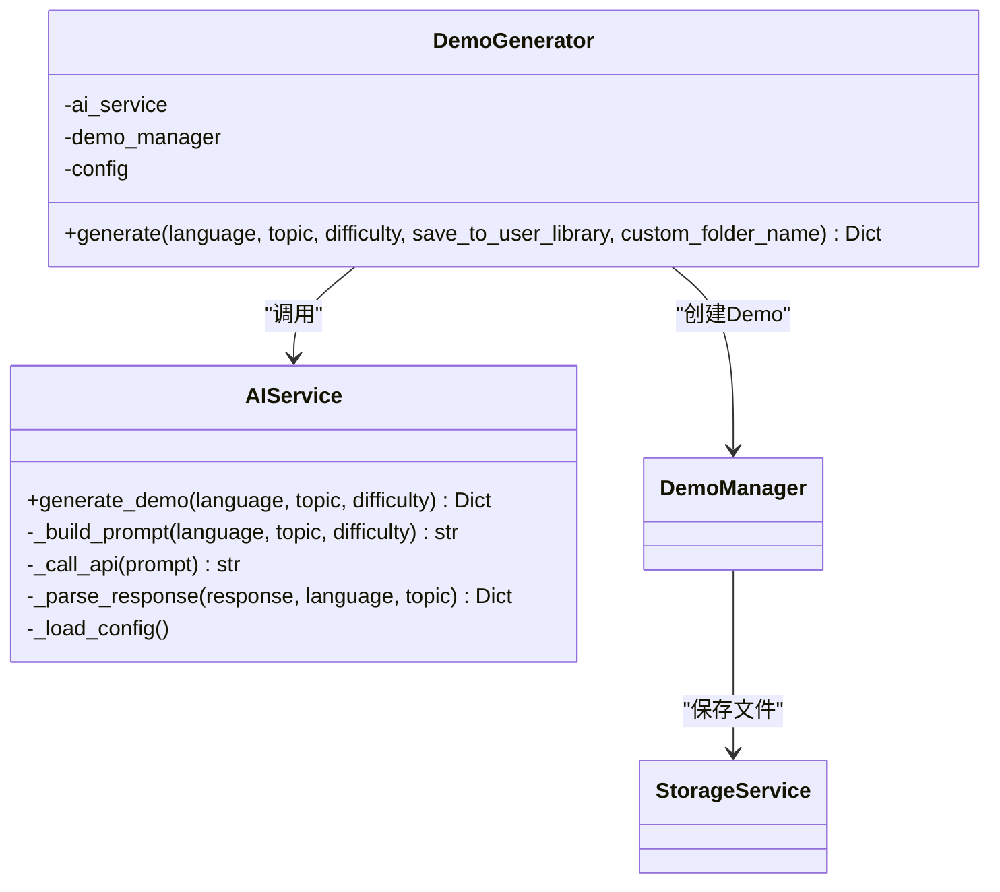
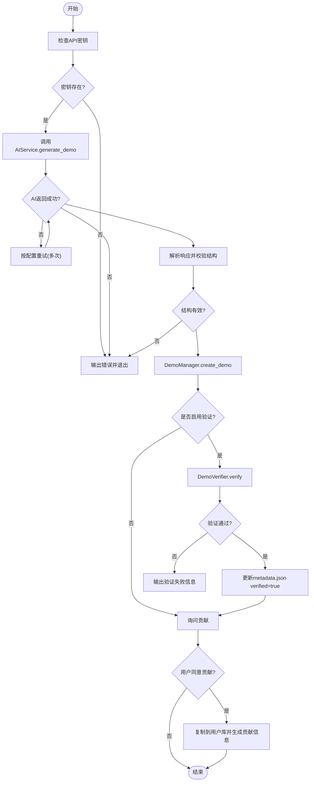
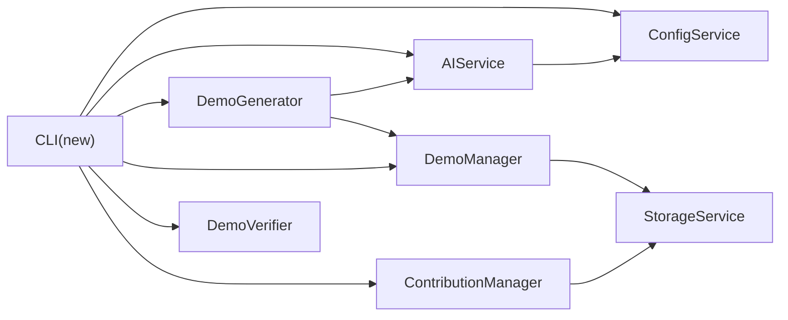

# new命令

<cite>
**本文引用的文件**
- [opendemo/cli.py](file://opendemo/cli.py)
- [opendemo/core/generator.py](file://opendemo/core/generator.py)
- [opendemo/services/ai_service.py](file://opendemo/services/ai_service.py)
- [opendemo/core/demo_manager.py](file://opendemo/core/demo_manager.py)
- [opendemo/core/contribution.py](file://opendemo/core/contribution.py)
- [opendemo/core/verifier.py](file://opendemo/core/verifier.py)
- [opendemo/services/storage_service.py](file://opendemo/services/storage_service.py)
- [opendemo/utils/formatters.py](file://opendemo/utils/formatters.py)
- [ABOUT.md](file://ABOUT.md)
</cite>

## 目录
1. [简介](#简介)
2. [项目结构](#项目结构)
3. [核心组件](#核心组件)
4. [架构总览](#架构总览)
5. [详细组件分析](#详细组件分析)
6. [依赖关系分析](#依赖关系分析)
7. [性能考量](#性能考量)
8. [故障排查指南](#故障排查指南)
9. [结论](#结论)
10. [附录](#附录)

## 简介
本章节聚焦于Open Demo CLI中的new命令，系统性阐述其通过AI生成全新Demo的核心流程，包括：
- new命令的公共接口、参数与返回值
- difficulty选项与verify标志的处理逻辑
- 调用DemoGenerator通过AIService生成代码的完整链路
- 主题合并、难度传递与结果处理
- 生成后是否贡献到公共库及与ContributionManager的交互
- 面向初学者的AI生成步骤说明与面向开发者的错误处理与验证机制

## 项目结构
new命令位于CLI入口文件中，围绕其展开的协作组件包括：
- CLI层：命令定义、参数解析、流程编排
- 生成器：协调AI生成与本地落盘
- AI服务：与大模型API交互，产出结构化代码与元数据
- 存储服务：文件系统操作与目录管理
- 验证器：可选的可执行性验证
- 贡献管理器：贡献流程提示与用户库复制

图表来源
- [opendemo/cli.py](file://opendemo/cli.py#L386-L472)
- [opendemo/core/generator.py](file://opendemo/core/generator.py#L15-L103)
- [opendemo/services/ai_service.py](file://opendemo/services/ai_service.py#L16-L110)
- [opendemo/core/demo_manager.py](file://opendemo/core/demo_manager.py#L132-L201)
- [opendemo/services/storage_service.py](file://opendemo/services/storage_service.py#L213-L222)
- [opendemo/core/verifier.py](file://opendemo/core/verifier.py#L31-L60)
- [opendemo/core/contribution.py](file://opendemo/core/contribution.py#L28-L47)

章节来源
- [opendemo/cli.py](file://opendemo/cli.py#L386-L472)

## 核心组件
- new命令公共接口
  - 语言参数：必填，限定为支持的语言集合
  - 主题参数：可变长度，最终合并为单一主题字符串
  - 选项：
    - --difficulty：可选，取值范围为 beginner、intermediate、advanced，默认 beginner
    - --verify：可选，布尔开关，启用后对生成的Demo进行可执行性验证
  - 返回值：无显式返回，通过CLI输出与文件系统落盘完成结果交付

- difficulty选项处理
  - new命令接收--difficulty参数并直接传入生成流程
  - AIService在构建提示词时注入难度级别，确保生成内容与难度一致
  - DemoManager在创建Demo时写入metadata.json的difficulty字段

- verify标志处理
  - new命令内部根据--verify或全局配置决定是否执行验证
  - 若启用，调用DemoVerifier对生成的Demo进行可执行性验证
  - 验证通过后，DemoManager更新metadata.json的verified字段

- ContributionManager交互
  - new命令在生成完成后询问用户是否贡献到公共库
  - 若用户同意，将Demo复制到用户库，并生成贡献信息模板

章节来源
- [opendemo/cli.py](file://opendemo/cli.py#L386-L472)
- [opendemo/core/generator.py](file://opendemo/core/generator.py#L31-L103)
- [opendemo/services/ai_service.py](file://opendemo/services/ai_service.py#L87-L176)
- [opendemo/core/demo_manager.py](file://opendemo/core/demo_manager.py#L132-L201)
- [opendemo/core/verifier.py](file://opendemo/core/verifier.py#L31-L60)
- [opendemo/core/contribution.py](file://opendemo/core/contribution.py#L28-L47)

## 架构总览
new命令从CLI入口进入，串联AI生成与本地落盘，并在必要时执行验证与贡献流程。

图表来源
- [opendemo/cli.py](file://opendemo/cli.py#L386-L472)
- [opendemo/services/ai_service.py](file://opendemo/services/ai_service.py#L38-L86)
- [opendemo/core/generator.py](file://opendemo/core/generator.py#L31-L103)
- [opendemo/core/demo_manager.py](file://opendemo/core/demo_manager.py#L132-L201)
- [opendemo/services/storage_service.py](file://opendemo/services/storage_service.py#L130-L166)
- [opendemo/core/verifier.py](file://opendemo/core/verifier.py#L31-L60)
- [opendemo/core/contribution.py](file://opendemo/core/contribution.py#L28-L47)

## 详细组件分析

### new命令实现与参数解析
- 命令定义与参数
  - 语言参数：必填，限制支持的语言集合
  - 主题参数：可变长度，最终合并为单一主题字符串
  - 选项：
    - --difficulty：难度级别
    - --verify：是否验证
- 流程要点
  - 校验API密钥是否存在，不存在则提示配置
  - 调用DemoGenerator.generate(language, topic, difficulty, save_to_user_library=False)
  - 可选执行验证
  - 展示结果并询问贡献

章节来源
- [opendemo/cli.py](file://opendemo/cli.py#L386-L472)

### DemoGenerator与AIService协作
- DemoGenerator.generate
  - 接收语言、主题、难度、是否保存到用户库、自定义文件夹名等参数
  - 调用AIService.generate_demo(language, topic, difficulty)
  - 解析AI返回的metadata与files，补充作者、时间戳、版本、verified等字段
  - 通过DemoManager.create_demo创建Demo并落盘
  - 返回包含demo对象、路径、语言、主题、metadata、文件列表与验证状态的结果字典

- AIService.generate_demo
  - 加载配置（API密钥、端点、模型、温度、最大token等）
  - 构建提示词（包含语言规范、依赖文件、输出格式与约束）
  - 调用LLM API并重试（次数与间隔由配置控制）
  - 解析响应为JSON，校验必需字段，补全缺失字段
  - 返回结构化数据

图表来源
- [opendemo/core/generator.py](file://opendemo/core/generator.py#L15-L103)
- [opendemo/services/ai_service.py](file://opendemo/services/ai_service.py#L38-L176)
- [opendemo/core/demo_manager.py](file://opendemo/core/demo_manager.py#L132-L201)
- [opendemo/services/storage_service.py](file://opendemo/services/storage_service.py#L130-L166)

章节来源
- [opendemo/core/generator.py](file://opendemo/core/generator.py#L31-L103)
- [opendemo/services/ai_service.py](file://opendemo/services/ai_service.py#L38-L176)

### 难度级别与主题合并
- 主题合并
  - new命令将可变主题参数合并为单一字符串，作为生成主题传入
- 难度传递
  - CLI层接收--difficulty并传给DemoGenerator.generate
  - DemoGenerator.generate再传给AIService.generate_demo
  - AIService在构建提示词时注入难度级别，确保生成内容与难度一致
  - DemoManager.create_demo将difficulty写入metadata.json

章节来源
- [opendemo/cli.py](file://opendemo/cli.py#L386-L472)
- [opendemo/core/generator.py](file://opendemo/core/generator.py#L31-L103)
- [opendemo/services/ai_service.py](file://opendemo/services/ai_service.py#L87-L176)
- [opendemo/core/demo_manager.py](file://opendemo/core/demo_manager.py#L132-L201)

### 验证机制与错误处理
- 验证触发
  - new命令根据--verify或全局配置决定是否验证
  - DemoVerifier.verify根据语言选择不同验证策略
  - Python路径：创建虚拟环境、安装依赖、执行代码文件
  - 验证通过后，DemoManager更新metadata.json的verified字段
- 错误处理
  - AIService.generate_demo在API调用失败时按配置重试
  - AIService._parse_response对响应进行严格校验，缺失字段或解析异常会返回None
  - CLI层在API密钥缺失、生成失败、验证失败等情况下输出错误并退出

图表来源
- [opendemo/cli.py](file://opendemo/cli.py#L386-L472)
- [opendemo/services/ai_service.py](file://opendemo/services/ai_service.py#L38-L86)
- [opendemo/core/verifier.py](file://opendemo/core/verifier.py#L31-L60)
- [opendemo/core/contribution.py](file://opendemo/core/contribution.py#L28-L47)

章节来源
- [opendemo/core/verifier.py](file://opendemo/core/verifier.py#L31-L60)
- [opendemo/services/ai_service.py](file://opendemo/services/ai_service.py#L38-L86)

### 贡献流程与用户库交互
- 贡献提示
  - new命令在生成完成后询问用户是否贡献到公共库
  - 受配置项控制（默认自动提示），用户确认后继续
- 用户库复制
  - ContributionManager.copy_to_user_library将Demo复制到用户库对应语言目录
  - 生成贡献信息（包含名称、语言、描述、作者、仓库地址等）
- 验证与准备
  - ContributionManager.validate_demo检查必需文件与内容长度
  - prepare_contribution加载metadata并组装贡献信息字典

章节来源
- [opendemo/cli.py](file://opendemo/cli.py#L451-L471)
- [opendemo/core/contribution.py](file://opendemo/core/contribution.py#L28-L47)
- [opendemo/core/contribution.py](file://opendemo/core/contribution.py#L84-L119)
- [opendemo/core/contribution.py](file://opendemo/core/contribution.py#L120-L147)
- [opendemo/core/contribution.py](file://opendemo/core/contribution.py#L148-L176)

### 输出与展示
- CLI层通过格式化工具输出结果
  - print_demo_result展示语言、主题、输出位置、文件列表、验证状态与快速开始步骤
  - print_progress、print_success、print_error、print_warning、print_info用于统一输出风格

章节来源
- [opendemo/utils/formatters.py](file://opendemo/utils/formatters.py#L18-L81)
- [opendemo/utils/formatters.py](file://opendemo/utils/formatters.py#L180-L188)

## 依赖关系分析
- 组件耦合
  - CLI依赖ConfigService、StorageService、DemoManager、AIService、DemoVerifier、ContributionManager
  - DemoGenerator依赖AIService与DemoManager
  - DemoManager依赖StorageService
  - AIService依赖ConfigService
  - ContributionManager依赖ConfigService与StorageService
- 外部依赖
  - LLM API（通过AIService调用）
  - 文件系统（通过StorageService）
  - Python虚拟环境与pip（通过DemoVerifier）

图表来源
- [opendemo/cli.py](file://opendemo/cli.py#L386-L472)
- [opendemo/core/generator.py](file://opendemo/core/generator.py#L15-L30)
- [opendemo/services/ai_service.py](file://opendemo/services/ai_service.py#L16-L37)
- [opendemo/core/demo_manager.py](file://opendemo/core/demo_manager.py#L74-L86)
- [opendemo/services/storage_service.py](file://opendemo/services/storage_service.py#L16-L48)
- [opendemo/core/contribution.py](file://opendemo/core/contribution.py#L14-L27)

章节来源
- [opendemo/cli.py](file://opendemo/cli.py#L386-L472)
- [opendemo/core/generator.py](file://opendemo/core/generator.py#L15-L30)
- [opendemo/services/ai_service.py](file://opendemo/services/ai_service.py#L16-L37)
- [opendemo/core/demo_manager.py](file://opendemo/core/demo_manager.py#L74-L86)
- [opendemo/services/storage_service.py](file://opendemo/services/storage_service.py#L16-L48)
- [opendemo/core/contribution.py](file://opendemo/core/contribution.py#L14-L27)

## 性能考量
- API调用与重试
  - AIService支持配置重试次数与间隔，避免瞬时网络波动导致失败
- 生成内容规模
  - AIService提示词约束了代码行数与输出格式，有助于控制生成体积
- 验证开销
  - Python验证涉及虚拟环境创建、依赖安装与逐文件执行，建议仅在需要时启用
- I/O与落盘
  - DemoManager与StorageService负责批量文件写入，注意磁盘空间与权限

[本节为通用指导，无需引用具体文件]

## 故障排查指南
- API密钥缺失
  - 现象：new命令提示未配置AI API密钥并退出
  - 处理：使用配置命令设置ai.api_key
- AI响应解析失败
  - 现象：AIService.parse_response无法解析JSON或缺少必需字段
  - 处理：检查提示词构造与模型输出稳定性；适当调整temperature或max_tokens
- 生成失败
  - 现象：DemoGenerator返回None或CLI输出生成失败
  - 处理：确认API连通性与凭证；查看日志定位错误
- 验证失败
  - 现象：DemoVerifier输出错误或超时
  - 处理：检查requirements.txt与代码可执行性；调整verification_timeout
- 贡献流程异常
  - 现象：复制到用户库失败或贡献信息准备失败
  - 处理：确认用户库路径与权限；检查metadata完整性

章节来源
- [opendemo/cli.py](file://opendemo/cli.py#L410-L414)
- [opendemo/services/ai_service.py](file://opendemo/services/ai_service.py#L226-L291)
- [opendemo/core/verifier.py](file://opendemo/core/verifier.py#L190-L203)
- [opendemo/core/contribution.py](file://opendemo/core/contribution.py#L84-L119)

## 结论
new命令通过清晰的参数设计与严谨的流程编排，实现了从主题输入到AI生成、本地落盘、可选验证与贡献引导的完整闭环。其核心在于：
- 明确的difficulty与verify选项，满足不同学习阶段与质量需求
- AIService与DemoGenerator的职责分离，便于扩展与维护
- ContributionManager与DemoVerifier分别承担贡献与质量保障，提升生态可持续性

[本节为总结性内容，无需引用具体文件]

## 附录

### 命令用法与示例
- 基本用法
  - 生成新Demo：opendemo new python 网络爬虫
  - 指定难度：opendemo new python 设计模式 --difficulty intermediate
  - 生成并验证：opendemo new python 异步IO --verify
- 参考示例来自ABOUT.md
  - 示例命令与输出参考：[ABOUT.md](file://ABOUT.md#L190-L203)

章节来源
- [ABOUT.md](file://ABOUT.md#L190-L203)