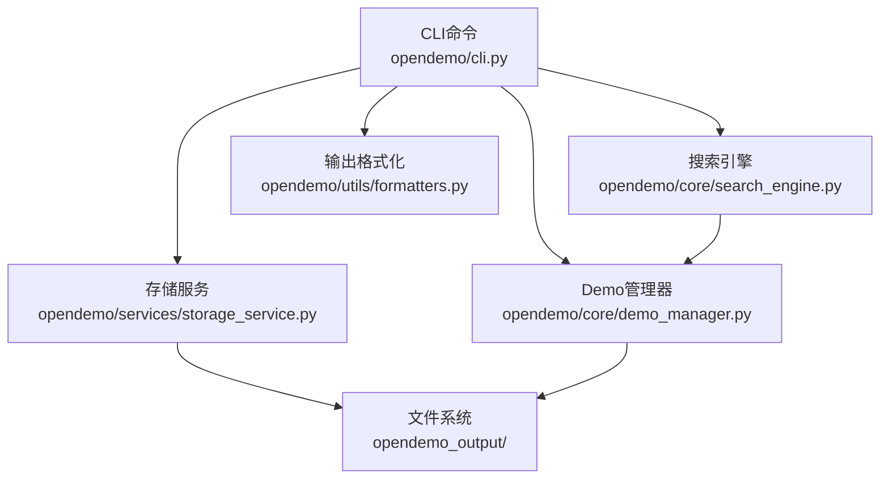
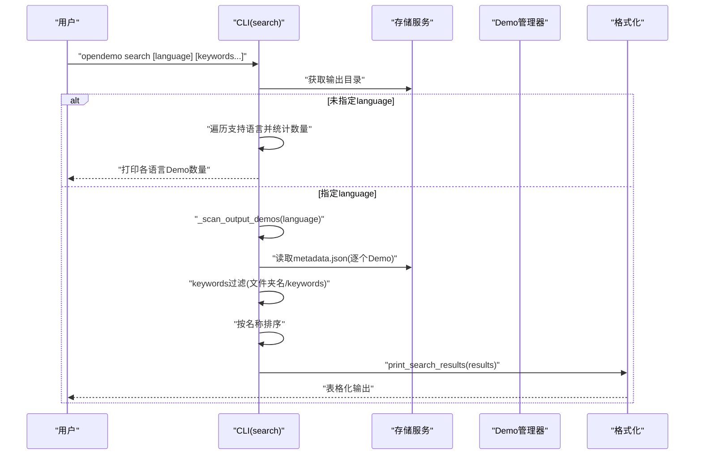
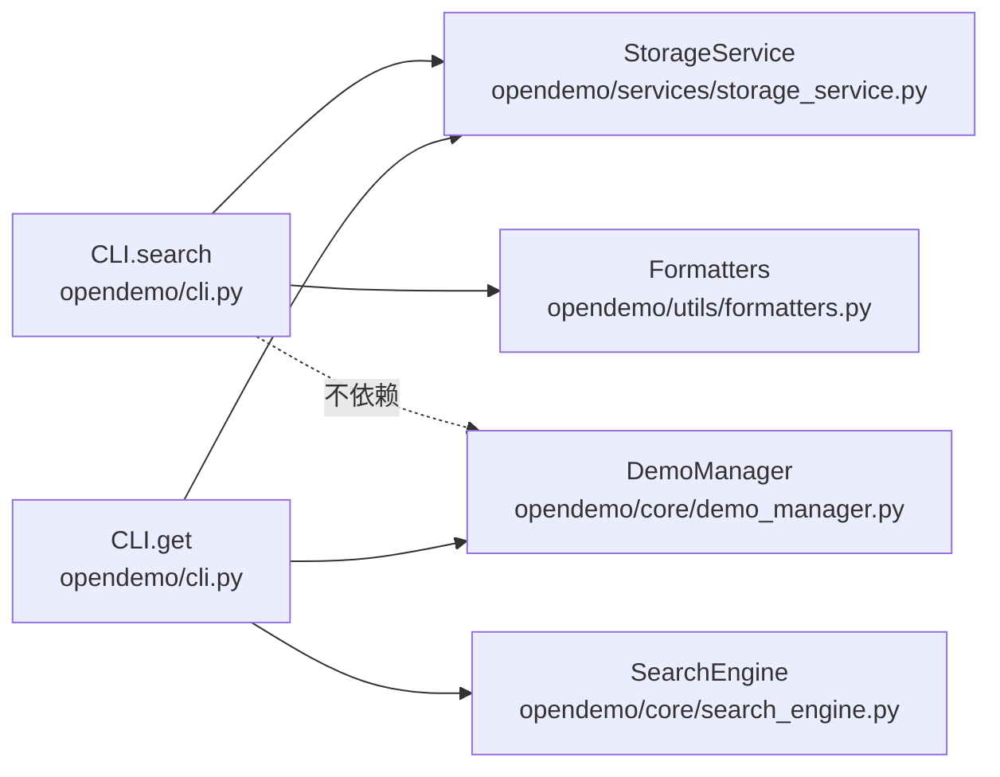
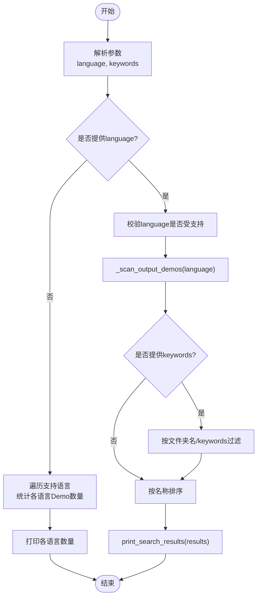

# search命令

<cite>
**本文引用的文件**
- [opendemo/cli.py](file://opendemo/cli.py)
- [ABOUT.md](file://ABOUT.md)
- [opendemo/core/demo_manager.py](file://opendemo/core/demo_manager.py)
- [opendemo/core/search_engine.py](file://opendemo/core/search_engine.py)
- [opendemo/services/storage_service.py](file://opendemo/services/storage_service.py)
- [opendemo/utils/formatters.py](file://opendemo/utils/formatters.py)
- [opendemo/builtin_demos/python/python-tuple-basics/metadata.json](file://opendemo/builtin_demos/python/python-tuple-basics/metadata.json)
</cite>

## 目录
1. [简介](#简介)
2. [项目结构](#项目结构)
3. [核心组件](#核心组件)
4. [架构总览](#架构总览)
5. [详细组件分析](#详细组件分析)
6. [依赖关系分析](#依赖关系分析)
7. [性能考量](#性能考量)
8. [故障排查指南](#故障排查指南)
9. [结论](#结论)
10. [附录](#附录)

## 简介
本文件全面介绍 opendemo-cli 中的 search 命令，重点说明其按语言和关键字搜索 Demo 的能力。文档从使用者视角出发，提供来自 ABOUT.md 的实际使用示例；同时为开发者解析其与 StorageService、DemoManager 的调用关系与内部数据流，涵盖参数处理、扫描策略、过滤逻辑与输出格式化等细节。

## 项目结构
search 命令位于 CLI 入口文件中，围绕以下核心模块协作：
- CLI 层：命令定义、参数解析、流程控制
- 存储服务：文件系统操作、输出目录定位、Demo库扫描
- Demo 管理器：Demo 对象封装、元数据加载、文件列举
- 搜索引擎：关键字匹配与排序（用于 get 命令的库内搜索）
- 输出格式化：表格化展示搜索结果

图表来源
- [opendemo/cli.py](file://opendemo/cli.py#L326-L384)
- [opendemo/services/storage_service.py](file://opendemo/services/storage_service.py#L213-L222)
- [opendemo/core/demo_manager.py](file://opendemo/core/demo_manager.py#L111-L130)
- [opendemo/core/search_engine.py](file://opendemo/core/search_engine.py#L26-L66)
- [opendemo/utils/formatters.py](file://opendemo/utils/formatters.py#L83-L129)

章节来源
- [opendemo/cli.py](file://opendemo/cli.py#L326-L384)

## 核心组件
- search 命令：按语言列出 Demo，或按关键字过滤输出目录中的 Demo
- StorageService：提供输出目录路径、扫描 Demo 库、读取元数据
- DemoManager：加载 Demo 元数据为 Demo 对象，列举文件
- SearchEngine：在内置/用户库中按关键字与难度进行匹配与排序（get 命令使用）
- Formatters：表格化输出搜索结果

章节来源
- [opendemo/cli.py](file://opendemo/cli.py#L326-L384)
- [opendemo/services/storage_service.py](file://opendemo/services/storage_service.py#L213-L222)
- [opendemo/core/demo_manager.py](file://opendemo/core/demo_manager.py#L111-L130)
- [opendemo/core/search_engine.py](file://opendemo/core/search_engine.py#L26-L66)
- [opendemo/utils/formatters.py](file://opendemo/utils/formatters.py#L83-L129)

## 架构总览
search 命令的执行流程如下：
- 解析参数：language（可选）、keywords（可选）
- 若未指定 language：列出支持语言及其各自 Demo 数量
- 若指定 language：扫描输出目录对应语言子目录，读取每个 Demo 的 metadata.json，构造结果列表
- 若提供 keywords：对结果进行过滤（文件夹名包含关键字，或 metadata.keywords 包含关键字）
- 最终按名称排序并以表格形式输出

图表来源
- [opendemo/cli.py](file://opendemo/cli.py#L326-L384)
- [opendemo/services/storage_service.py](file://opendemo/services/storage_service.py#L106-L129)
- [opendemo/utils/formatters.py](file://opendemo/utils/formatters.py#L83-L129)

## 详细组件分析

### search 命令实现细节
- 命令定义与参数
  - @click.argument('language', required=False)
  - @click.argument('keywords', nargs=-1)
  - 无 language 时仅列出支持语言及各语言的 Demo 数量
  - 有 language 时扫描该语言目录并可按 keywords 过滤
- 语言校验
  - 使用 SUPPORTED_LANGUAGES 列表进行校验
- 扫描与过滤
  - _scan_output_demos：遍历 language 子目录，尝试读取 metadata.json，构造包含 name、language、keywords、description、difficulty、verified 等字段的结果
  - keywords 过滤：若文件夹名包含任意关键字，或 metadata.keywords 中包含任意关键字，则保留
- 排序与输出
  - 按名称排序
  - 使用 print_search_results 输出表格

章节来源
- [opendemo/cli.py](file://opendemo/cli.py#L326-L384)
- [opendemo/cli.py](file://opendemo/cli.py#L41-L102)
- [opendemo/cli.py](file://opendemo/cli.py#L346-L384)
- [opendemo/utils/formatters.py](file://opendemo/utils/formatters.py#L83-L129)

### language 参数处理逻辑
- 未提供 language：列出 SUPPORTED_LANGUAGES 中每种语言的 Demo 数量
- 提供 language：校验是否在 SUPPORTED_LANGUAGES 内，否则报错并退出
- 扫描输出目录：根据 language 构造路径，遍历子目录，读取 metadata.json 并填充结果

章节来源
- [opendemo/cli.py](file://opendemo/cli.py#L346-L384)
- [opendemo/cli.py](file://opendemo/cli.py#L41-L102)

### keywords 参数处理逻辑
- 未提供 keywords：直接列出该语言下所有 Demo
- 提供 keywords：对每个 Demo，检查其文件夹名是否包含任一关键字，或其 metadata.keywords 是否包含任一关键字
- 过滤后按名称排序并输出

章节来源
- [opendemo/cli.py](file://opendemo/cli.py#L366-L384)

### 扫描与匹配策略
- 扫描策略
  - _scan_output_demos：遍历 language 子目录，逐个读取 metadata.json，若缺失则仍构造条目（language、keywords、description、difficulty、verified 等字段回退为默认值）
- 匹配策略（search 命令）
  - 文件夹名包含关键字
  - metadata.keywords 包含关键字
- 排序策略
  - 按名称升序排列

章节来源
- [opendemo/cli.py](file://opendemo/cli.py#L41-L102)
- [opendemo/cli.py](file://opendemo/cli.py#L366-L384)

### 与 StorageService 的关系
- 通过 StorageService.get_output_directory() 获取输出目录
- 通过 StorageService.load_demo_metadata() 读取单个 Demo 的 metadata.json
- 通过 DemoManager.load_all_demos() 读取内置/用户库 Demo（search 命令不使用，但 get 命令使用）

章节来源
- [opendemo/cli.py](file://opendemo/cli.py#L344-L345)
- [opendemo/cli.py](file://opendemo/cli.py#L363-L364)
- [opendemo/services/storage_service.py](file://opendemo/services/storage_service.py#L106-L129)
- [opendemo/core/demo_manager.py](file://opendemo/core/demo_manager.py#L111-L130)

### 与 DemoManager 的关系
- search 命令不直接使用 DemoManager.load_demo/load_all_demos
- get 命令使用 DemoManager.copy_demo_to_output 和 get_demo_files 等方法（search 不涉及复制与文件列举）

章节来源
- [opendemo/cli.py](file://opendemo/cli.py#L326-L384)
- [opendemo/core/demo_manager.py](file://opendemo/core/demo_manager.py#L252-L271)
- [opendemo/core/demo_manager.py](file://opendemo/core/demo_manager.py#L272-L301)

### 与 SearchEngine 的关系
- search 命令不调用 SearchEngine.search
- get 命令在未命中输出目录时，会调用 SearchEngine.search 在内置/用户库中搜索匹配 Demo
- SearchEngine.search 会对 Demo 进行更复杂的匹配与排序（基于名称、keywords、description、整体文本与难度）

章节来源
- [opendemo/cli.py](file://opendemo/cli.py#L326-L384)
- [opendemo/cli.py](file://opendemo/cli.py#L259-L269)
- [opendemo/core/search_engine.py](file://opendemo/core/search_engine.py#L26-L66)

### 输出格式化
- print_search_results：输出包含序号、名称、语言、关键字、难度的表格，并给出使用 get 命令获取 Demo 的提示

章节来源
- [opendemo/utils/formatters.py](file://opendemo/utils/formatters.py#L83-L129)

### 实际使用示例（来自 ABOUT.md）
- 列出所有支持的语言
  - 命令：opendemo search
  - 效果：打印各语言的 Demo 数量
- 列出特定语言的 Demo
  - 命令：opendemo search python
  - 效果：扫描 opendemo_output/python 下的 Demo 并输出表格
- 按关键字过滤
  - 命令：opendemo search python async
  - 效果：仅输出文件夹名或 metadata.keywords 包含 async 的 Demo

章节来源
- [ABOUT.md](file://ABOUT.md#L121-L148)

### Demo 元数据与扫描范围
- 扫描范围：opendemo_output/<language>/
- 元数据来源：每个 Demo 目录下的 metadata.json
- 元数据示例：包含 name、language、keywords、description、difficulty、verified 等字段

章节来源
- [opendemo/cli.py](file://opendemo/cli.py#L41-L102)
- [opendemo/builtin_demos/python/python-tuple-basics/metadata.json](file://opendemo/builtin_demos/python/python-tuple-basics/metadata.json#L1-L14)

## 依赖关系分析
search 命令的依赖关系如下：
- CLI.search 依赖 StorageService.get_output_directory 与 load_demo_metadata
- CLI.search 依赖 Formatters.print_search_results
- CLI.search 不依赖 DemoManager（不复制/列举文件）
- get 命令依赖 SearchEngine.search 与 DemoManager.copy_demo_to_output

图表来源
- [opendemo/cli.py](file://opendemo/cli.py#L326-L384)
- [opendemo/services/storage_service.py](file://opendemo/services/storage_service.py#L213-L222)
- [opendemo/utils/formatters.py](file://opendemo/utils/formatters.py#L83-L129)
- [opendemo/core/search_engine.py](file://opendemo/core/search_engine.py#L26-L66)
- [opendemo/core/demo_manager.py](file://opendemo/core/demo_manager.py#L252-L271)

## 性能考量
- 扫描复杂度
  - 对于每个语言，_scan_output_demos 需要遍历其子目录并对每个 Demo 读取 metadata.json，时间复杂度近似 O(N)，N 为该语言下 Demo 数量
- 过滤复杂度
  - keywords 过滤对每个 Demo 检查文件夹名与 metadata.keywords，时间复杂度近似 O(N×K)，K 为关键字数量
- 排序复杂度
  - 按名称排序，时间复杂度 O(N log N)
- I/O 开销
  - 读取 metadata.json 与遍历文件系统是主要开销来源
- 优化建议
  - 若 Demo 数量巨大，可考虑缓存 metadata.json 或按需懒加载
  - 对 keywords 过滤可采用预处理（如小写化、去重）减少重复计算

章节来源
- [opendemo/cli.py](file://opendemo/cli.py#L41-L102)
- [opendemo/cli.py](file://opendemo/cli.py#L366-L384)

## 故障排查指南
- 未找到 Demo
  - 确认输出目录是否存在且包含对应语言子目录
  - 确认每个 Demo 目录下存在 metadata.json
  - 尝试使用更宽泛的关键字
- 语言不受支持
  - 检查 SUPPORTED_LANGUAGES 列表，确认输入语言是否正确
- 输出为空
  - 检查 keywords 是否与 Demo 的文件夹名或 metadata.keywords 匹配
- 权限问题
  - 确保对输出目录具有读取权限

章节来源
- [ABOUT.md](file://ABOUT.md#L319-L324)
- [opendemo/cli.py](file://opendemo/cli.py#L346-L384)

## 结论
search 命令专注于“按语言与关键字检索输出目录中的 Demo”，其设计简洁高效：通过扫描与过滤实现快速定位，借助表格化输出提升可读性。对于开发者而言，理解其与 StorageService 的交互、元数据来源与过滤策略，有助于扩展与维护该功能。

## 附录

### 命令公共接口与参数
- 命令：search
- 参数：
  - language：可选，语言名称（如 python、java），若省略则列出支持语言
  - keywords：可选，关键字列表，用于过滤输出目录中的 Demo
- 返回值：无（直接输出表格化结果）

章节来源
- [opendemo/cli.py](file://opendemo/cli.py#L326-L384)

### 内部数据流图（search 命令）

图表来源
- [opendemo/cli.py](file://opendemo/cli.py#L326-L384)
- [opendemo/cli.py](file://opendemo/cli.py#L41-L102)
- [opendemo/utils/formatters.py](file://opendemo/utils/formatters.py#L83-L129)