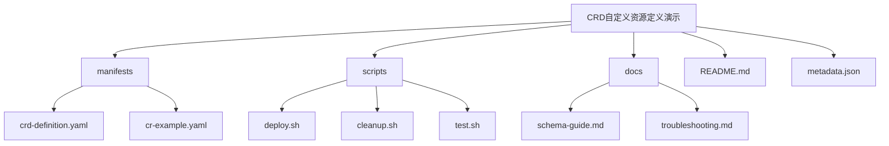
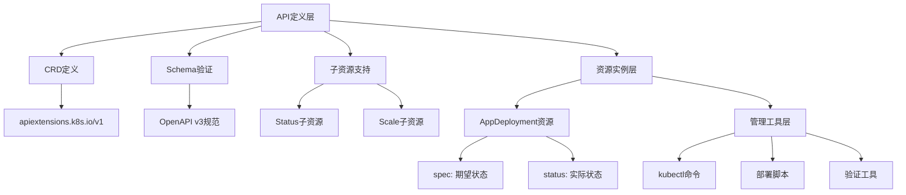
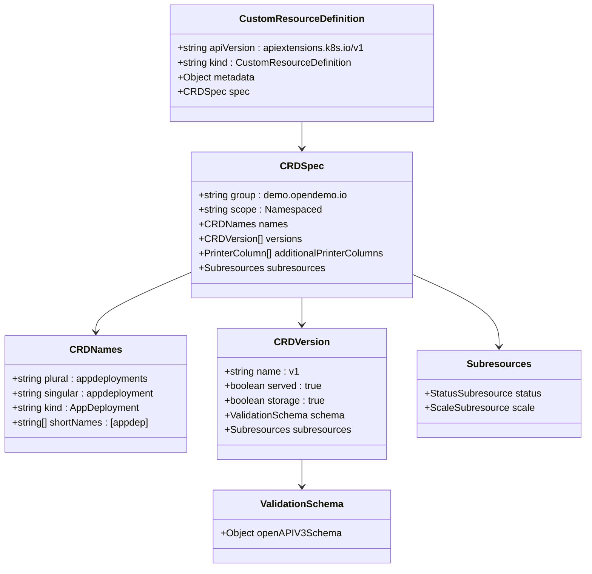
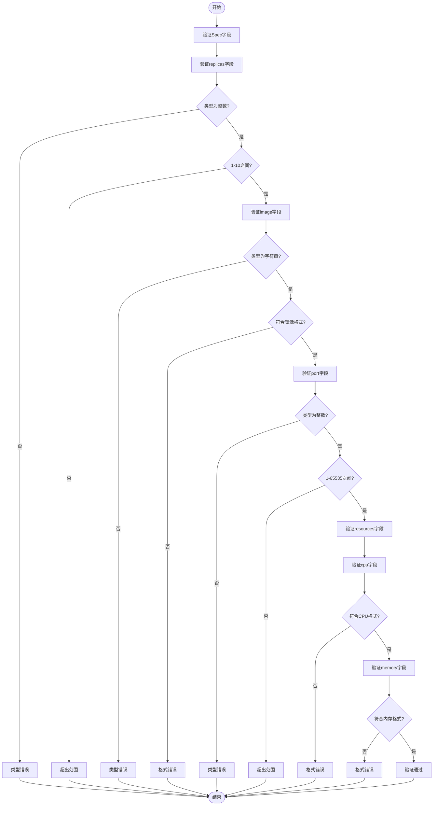
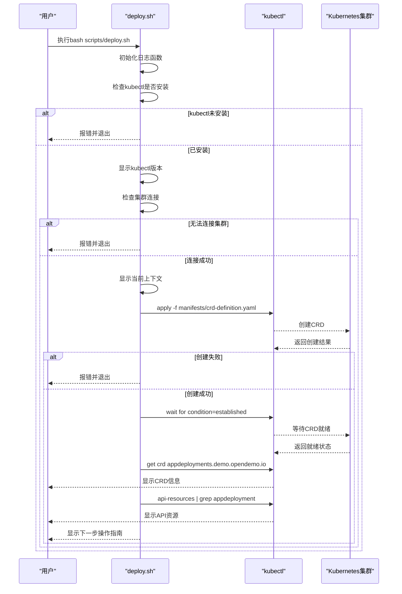
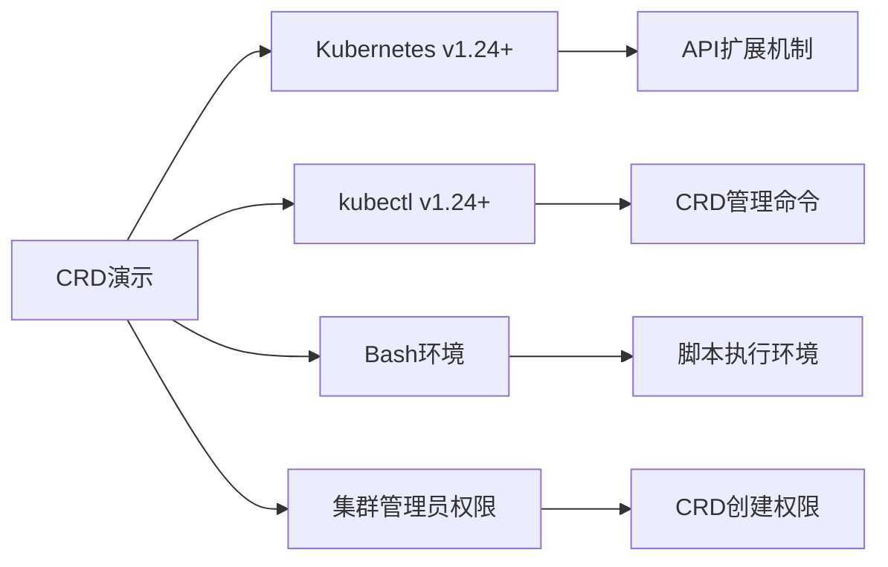

# CRD自定义资源定义演示

<cite>
**本文档中引用的文件**   
- [crd-definition.yaml](file://opendemo_output/kubernetes/operator-framework/crd-basic-usage/manifests/crd-definition.yaml)
- [cr-example.yaml](file://opendemo_output/kubernetes/operator-framework/crd-basic-usage/manifests/cr-example.yaml)
- [deploy.sh](file://opendemo_output/kubernetes/operator-framework/crd-basic-usage/scripts/deploy.sh)
- [README.md](file://opendemo_output/kubernetes/operator-framework/crd-basic-usage/README.md)
- [metadata.json](file://opendemo_output/kubernetes/operator-framework/crd-basic-usage/metadata.json)
</cite>

## 目录
1. [简介](#简介)
2. [项目结构](#项目结构)
3. [核心组件](#核心组件)
4. [架构概述](#架构概述)
5. [详细组件分析](#详细组件分析)
6. [依赖分析](#依赖分析)
7. [性能考虑](#性能考虑)
8. [故障排除指南](#故障排除指南)
9. [结论](#结论)

## 简介
本文档详细介绍了Kubernetes中CRD（CustomResourceDefinition）自定义资源定义的完整使用流程。该演示展示了如何通过CRD扩展Kubernetes API，创建和管理自定义资源类型，帮助用户理解Kubernetes API扩展机制和Operator模式的基础概念。

## 项目结构
CRD自定义资源定义演示项目提供了完整的文件组织结构，包含定义文件、示例资源、部署脚本和文档说明。



**图示来源**
- [crd-definition.yaml](file://opendemo_output/kubernetes/operator-framework/crd-basic-usage/manifests/crd-definition.yaml)
- [cr-example.yaml](file://opendemo_output/kubernetes/operator-framework/crd-basic-usage/manifests/cr-example.yaml)
- [deploy.sh](file://opendemo_output/kubernetes/operator-framework/crd-basic-usage/scripts/deploy.sh)

**本节来源**
- [README.md](file://opendemo_output/kubernetes/operator-framework/crd-basic-usage/README.md)

## 核心组件
本演示的核心组件包括CRD定义文件、自定义资源实例和部署脚本。CRD定义文件使用OpenAPI v3规范定义了AppDeployment资源的结构和验证规则，包括必填字段、数据类型、取值范围等。自定义资源实例展示了如何创建具体的AppDeployment资源，而部署脚本则提供了自动化部署CRD的便捷方式。

**本节来源**
- [crd-definition.yaml](file://opendemo_output/kubernetes/operator-framework/crd-basic-usage/manifests/crd-definition.yaml#L1-L174)
- [cr-example.yaml](file://opendemo_output/kubernetes/operator-framework/crd-basic-usage/manifests/cr-example.yaml#L1-L41)
- [deploy.sh](file://opendemo_output/kubernetes/operator-framework/crd-basic-usage/scripts/deploy.sh#L1-L113)

## 架构概述
CRD自定义资源定义演示的架构基于Kubernetes的API扩展机制，通过CustomResourceDefinition资源向集群注册新的API类型。该架构分为三个主要层次：API定义层、资源实例层和管理工具层。



**图示来源**
- [crd-definition.yaml](file://opendemo_output/kubernetes/operator-framework/crd-basic-usage/manifests/crd-definition.yaml#L1-L174)
- [README.md](file://opendemo_output/kubernetes/operator-framework/crd-basic-usage/README.md)

## 详细组件分析

### CRD定义分析
CRD定义文件详细描述了AppDeployment资源的结构和行为特征，包括API组、版本、命名规范、验证规则等。

#### CRD结构定义


**图示来源**
- [crd-definition.yaml](file://opendemo_output/kubernetes/operator-framework/crd-basic-usage/manifests/crd-definition.yaml#L1-L174)

#### 资源验证规则


**图示来源**
- [crd-definition.yaml](file://opendemo_output/kubernetes/operator-framework/crd-basic-usage/manifests/crd-definition.yaml#L40-L88)

**本节来源**
- [crd-definition.yaml](file://opendemo_output/kubernetes/operator-framework/crd-basic-usage/manifests/crd-definition.yaml#L1-L174)
- [README.md](file://opendemo_output/kubernetes/operator-framework/crd-basic-usage/README.md)

### 自定义资源实例分析
自定义资源实例展示了如何使用定义的CRD创建具体的资源对象，包括不同配置场景的示例。

#### 资源实例示例
```mermaid
graph TD
A[AppDeployment实例] --> B[nginx-app]
A --> C[nodejs-api]
A --> D[minimal-app]
B --> B1[replicas: 3]
B --> B2[image: nginx:1.21]
B --> B3[port: 80]
B --> B4[cpu: "200m"]
B --> B5[memory: "256Mi"]
C --> C1[replicas: 2]
C --> C2[image: node:18-alpine]
C --> C3[port: 3000]
C --> C4[cpu: "500m"]
C --> C5[memory: "512Mi"]
D --> D1[replicas: 1]
D --> D2[image: httpd:2.4]
D --> D3[port: 8080]
```

**图示来源**
- [cr-example.yaml](file://opendemo_output/kubernetes/operator-framework/crd-basic-usage/manifests/cr-example.yaml#L1-L41)

### 部署脚本分析
部署脚本提供了自动化部署CRD的流程，包括环境检查、CRD部署和验证等步骤。

#### 部署流程


**图示来源**
- [deploy.sh](file://opendemo_output/kubernetes/operator-framework/crd-basic-usage/scripts/deploy.sh#L1-L113)

**本节来源**
- [cr-example.yaml](file://opendemo_output/kubernetes/operator-framework/crd-basic-usage/manifests/cr-example.yaml#L1-L41)
- [deploy.sh](file://opendemo_output/kubernetes/operator-framework/crd-basic-usage/scripts/deploy.sh#L1-L113)

## 依赖分析
CRD自定义资源定义演示的依赖关系主要涉及Kubernetes版本要求和工具依赖。



**图示来源**
- [README.md](file://opendemo_output/kubernetes/operator-framework/crd-basic-usage/README.md)
- [metadata.json](file://opendemo_output/kubernetes/operator-framework/crd-basic-usage/metadata.json)

**本节来源**
- [README.md](file://opendemo_output/kubernetes/operator-framework/crd-basic-usage/README.md#L36-L43)
- [metadata.json](file://opendemo_output/kubernetes/operator-framework/crd-basic-usage/metadata.json)

## 性能考虑
CRD的性能主要体现在API服务器的验证效率和资源管理开销上。由于Schema验证在API服务器层面执行，具有很高的效率。合理的默认值设置和验证规则可以减少客户端的配置负担，同时避免无效的资源创建请求。Status子资源的独立更新机制可以避免频繁更新整个资源对象，减少etcd的存储压力和网络传输开销。

## 故障排除指南
当遇到CRD相关问题时，可以按照以下步骤进行排查：

**本节来源**
- [README.md](file://opendemo_output/kubernetes/operator-framework/crd-basic-usage/README.md#L578-L633)
- [docs/troubleshooting.md](file://opendemo_output/kubernetes/operator-framework/crd-basic-usage/docs/troubleshooting.md)

## 结论
CRD自定义资源定义演示完整展示了Kubernetes API扩展的核心概念和实践方法。通过定义AppDeployment CRD，我们能够创建和管理自定义的应用部署资源，实现了对Kubernetes原生资源模型的扩展。这种机制为构建Operator和实现声明式API管理提供了基础，是云原生应用开发的重要技术。虽然CRD本身不包含业务逻辑，但它为控制器和Operator提供了标准化的资源接口，是实现自动化运维的关键组件。