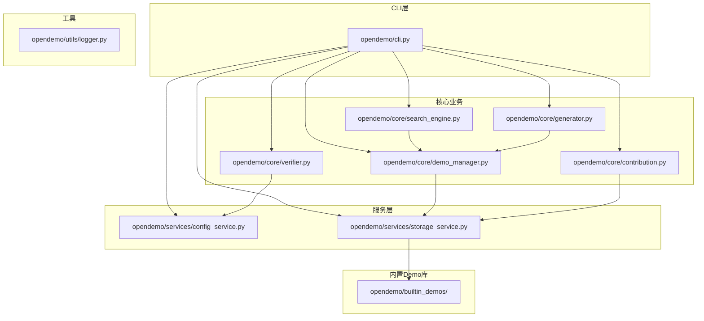
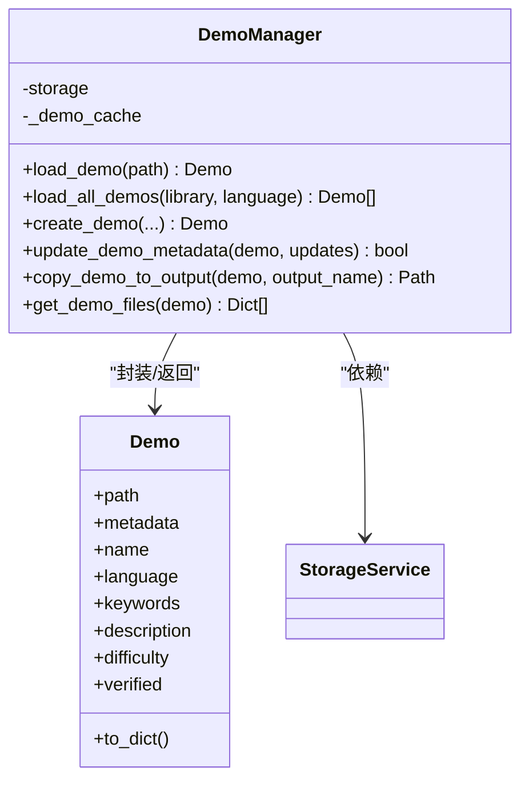
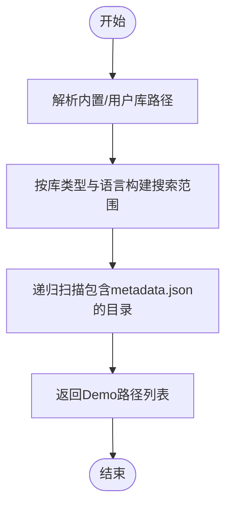
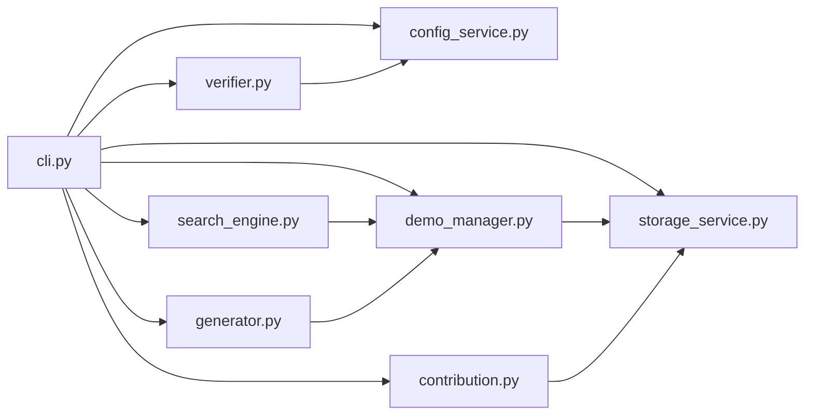

# Demo库架构

<cite>
**本文引用的文件**
- [README.md](file://README.md)
- [opendemo/cli.py](file://opendemo/cli.py)
- [opendemo/services/storage_service.py](file://opendemo/services/storage_service.py)
- [opendemo/core/demo_manager.py](file://opendemo/core/demo_manager.py)
- [opendemo/core/search_engine.py](file://opendemo/core/search_engine.py)
- [opendemo/core/generator.py](file://opendemo/core/generator.py)
- [opendemo/core/verifier.py](file://opendemo/core/verifier.py)
- [opendemo/core/contribution.py](file://opendemo/core/contribution.py)
- [opendemo/services/config_service.py](file://opendemo/services/config_service.py)
- [opendemo/utils/logger.py](file://opendemo/utils/logger.py)
- [opendemo/builtin_demos/python/python-tuple-basics/metadata.json](file://opendemo/builtin_demos/python/python-tuple-basics/metadata.json)
- [opendemo/builtin_demos/python/python-tuple-basics/README.md](file://opendemo/builtin_demos/python/python-tuple-basics/README.md)
- [opendemo/builtin_demos/python/python-tuple-basics/requirements.txt](file://opendemo/builtin_demos/python/python-tuple-basics/requirements.txt)
- [opendemo/builtin_demos/README.md](file://opendemo/builtin_demos/README.md)
</cite>

## 目录
1. [简介](#简介)
2. [项目结构](#项目结构)
3. [核心组件](#核心组件)
4. [架构总览](#架构总览)
5. [详细组件分析](#详细组件分析)
6. [依赖关系分析](#依赖关系分析)
7. [性能考量](#性能考量)
8. [故障排查指南](#故障排查指南)
9. [结论](#结论)
10. [附录](#附录)

## 简介
本文件面向初学者与贡献者，系统阐述Demo库的双层架构：内置Demo库（只读）与用户Demo库（可写）。围绕storage_service.py中的优先级查找机制，结合demo_manager.py对Demo的加载、保存与元数据管理，解释标准Demo目录结构与各文件职责，并给出实际文件路径示例，帮助快速上手与规范贡献。

## 项目结构
OpenDemo CLI采用清晰的分层结构：
- CLI入口与命令编排：opendemo/cli.py
- 服务层：配置服务、存储服务、AI服务（未在本文展开）
- 核心业务：Demo管理、搜索、生成、验证、贡献
- 工具与日志：统一日志工具
- 内置Demo库：opendemo/builtin_demos



图表来源
- [opendemo/cli.py](file://opendemo/cli.py#L1-L120)
- [opendemo/services/storage_service.py](file://opendemo/services/storage_service.py#L1-L120)
- [opendemo/core/demo_manager.py](file://opendemo/core/demo_manager.py#L1-L120)
- [opendemo/core/search_engine.py](file://opendemo/core/search_engine.py#L1-L80)
- [opendemo/core/generator.py](file://opendemo/core/generator.py#L1-L60)
- [opendemo/core/verifier.py](file://opendemo/core/verifier.py#L1-L60)
- [opendemo/core/contribution.py](file://opendemo/core/contribution.py#L1-L60)
- [opendemo/utils/logger.py](file://opendemo/utils/logger.py#L1-L65)
- [opendemo/builtin_demos/README.md](file://opendemo/builtin_demos/README.md#L1-L2)

章节来源
- [README.md](file://README.md#L62-L110)

## 核心组件
- 双层Demo库
  - 内置Demo库：位于包内目录，只读，供搜索与复制到输出目录使用。
  - 用户Demo库：位于用户家目录下的专用路径，可写，用于保存贡献或自定义Demo。
- 存储服务（StorageService）
  - 负责路径解析、Demo发现、元数据读取、文件读写、复制与删除等。
- Demo管理器（DemoManager）
  - 负责Demo对象封装、缓存、加载、创建、复制到输出目录、元数据更新、文件枚举等。
- 搜索引擎（SearchEngine）
  - 基于关键字与难度过滤，计算匹配分数并排序。
- 生成器（DemoGenerator）
  - 协调AI生成Demo，补充元数据并调用DemoManager保存。
- 验证器（DemoVerifier）
  - 针对Python/Java进行可执行性验证，支持虚拟环境与依赖安装。
- 贡献管理器（ContributionManager）
  - 负责验证Demo结构、提示贡献、复制到用户库并生成贡献信息。
- 配置服务（ConfigService）
  - 提供全局与项目配置合并、读取、设置与校验。
- 日志工具（Logger）
  - 统一日志输出与文件落盘。

章节来源
- [opendemo/services/storage_service.py](file://opendemo/services/storage_service.py#L1-L120)
- [opendemo/core/demo_manager.py](file://opendemo/core/demo_manager.py#L1-L120)
- [opendemo/core/search_engine.py](file://opendemo/core/search_engine.py#L1-L80)
- [opendemo/core/generator.py](file://opendemo/core/generator.py#L1-L60)
- [opendemo/core/verifier.py](file://opendemo/core/verifier.py#L1-L60)
- [opendemo/core/contribution.py](file://opendemo/core/contribution.py#L1-L60)
- [opendemo/services/config_service.py](file://opendemo/services/config_service.py#L1-L120)
- [opendemo/utils/logger.py](file://opendemo/utils/logger.py#L1-L65)

## 架构总览
双层Demo库的优先级查找机制由CLI层在“获取Demo”流程中体现：
- 若用户输入强制生成标记，则直接走AI生成路径。
- 否则优先在输出目录（opendemo_output）按文件夹名与关键字匹配命中即返回。
- 若未命中，再在内置库与用户库中进行搜索与匹配，命中后复制到输出目录并展示。
- 未命中且未强制生成时，进入AI生成流程。

```mermaid
sequenceDiagram
participant U as "用户"
participant CLI as "CLI(get命令)"
participant STG as "StorageService"
participant DEMO_MGR as "DemoManager"
participant SEARCH as "SearchEngine"
participant GEN as "DemoGenerator"
U->>CLI : 输入语言+关键字
CLI->>CLI : 解析是否强制生成
alt 非强制生成
CLI->>CLI : 在输出目录扫描并匹配
opt 命中
CLI-->>U : 展示已存在Demo
exit
end
CLI->>SEARCH : 搜索内置/用户库
SEARCH->>DEMO_MGR : 加载Demo列表
DEMO_MGR->>STG : 列举Demo目录
STG-->>DEMO_MGR : 返回Demo路径集合
DEMO_MGR-->>SEARCH : 返回Demo对象列表
SEARCH-->>CLI : 返回匹配结果
opt 命中
CLI->>DEMO_MGR : 复制到输出目录
DEMO_MGR->>STG : 复制Demo
STG-->>DEMO_MGR : 成功/失败
DEMO_MGR-->>CLI : 输出路径
CLI-->>U : 展示Demo信息
end
end
opt 未命中或强制生成
CLI->>GEN : 调用AI生成
GEN-->>CLI : 返回生成结果
CLI-->>U : 展示Demo信息
end
```

图表来源
- [opendemo/cli.py](file://opendemo/cli.py#L196-L324)
- [opendemo/core/search_engine.py](file://opendemo/core/search_engine.py#L26-L66)
- [opendemo/core/demo_manager.py](file://opendemo/core/demo_manager.py#L111-L131)
- [opendemo/services/storage_service.py](file://opendemo/services/storage_service.py#L49-L82)

章节来源
- [opendemo/cli.py](file://opendemo/cli.py#L196-L324)

## 详细组件分析

### 双层Demo库与优先级查找机制
- 内置Demo库（只读）
  - 位置：opendemo/builtin_demos
  - 特点：包含多种语言的Demo，仅用于搜索与复制，不直接修改。
- 用户Demo库（可写）
  - 位置：由配置服务决定，默认位于用户家目录的专用路径。
  - 特点：保存贡献或自定义Demo，支持创建、更新、复制与删除。
- 优先级查找流程
  - 输出目录优先：若存在同名或关键字匹配的Demo，直接展示。
  - 内置/用户库次之：未命中输出目录时，在内置与用户库中搜索并匹配。
  - AI生成兜底：未命中且非强制生成时，触发AI生成。

章节来源
- [opendemo/services/storage_service.py](file://opendemo/services/storage_service.py#L30-L48)
- [opendemo/services/config_service.py](file://opendemo/services/config_service.py#L58-L106)
- [opendemo/cli.py](file://opendemo/cli.py#L240-L274)

### Demo管理器（DemoManager）
- 职责
  - 封装Demo对象，提供属性访问与字典序列化。
  - 加载Demo元数据并缓存，避免重复IO。
  - 创建新Demo并保存至内置/用户库输出目录。
  - 复制Demo到输出目录，便于用户直接使用。
  - 更新元数据并刷新缓存。
  - 枚举Demo文件并标注用途。
- 关键点
  - 缓存策略：基于绝对路径作为键，减少重复加载。
  - 目录命名：根据语言与名称生成合法目录名。
  - 文件枚举：递归遍历并跳过隐藏文件与缓存目录。



图表来源
- [opendemo/core/demo_manager.py](file://opendemo/core/demo_manager.py#L16-L120)
- [opendemo/core/demo_manager.py](file://opendemo/core/demo_manager.py#L132-L201)
- [opendemo/core/demo_manager.py](file://opendemo/core/demo_manager.py#L252-L328)

章节来源
- [opendemo/core/demo_manager.py](file://opendemo/core/demo_manager.py#L16-L120)
- [opendemo/core/demo_manager.py](file://opendemo/core/demo_manager.py#L132-L201)
- [opendemo/core/demo_manager.py](file://opendemo/core/demo_manager.py#L252-L328)

### 存储服务（StorageService）
- 职责
  - 解析内置库与用户库路径。
  - 列举Demo目录（递归查找包含metadata.json的目录）。
  - 读取/写入元数据与文件。
  - 复制/删除Demo目录。
  - 获取输出目录并确保其存在。
- 优先级查找支撑
  - list_demos支持按库类型（内置/用户/全部）与语言过滤，为SearchEngine提供数据源。



图表来源
- [opendemo/services/storage_service.py](file://opendemo/services/storage_service.py#L49-L82)
- [opendemo/services/storage_service.py](file://opendemo/services/storage_service.py#L84-L105)

章节来源
- [opendemo/services/storage_service.py](file://opendemo/services/storage_service.py#L1-L120)
- [opendemo/services/storage_service.py](file://opendemo/services/storage_service.py#L120-L200)

### 搜索引擎（SearchEngine）
- 职责
  - 在Demo集合上按语言、关键字与难度进行过滤与排序。
  - 计算匹配分数，综合名称、关键字、描述与全文文本。
- 与DemoManager协作
  - 通过DemoManager加载Demo列表，避免重复扫描。

章节来源
- [opendemo/core/search_engine.py](file://opendemo/core/search_engine.py#L26-L66)
- [opendemo/core/search_engine.py](file://opendemo/core/search_engine.py#L67-L130)

### 生成器（DemoGenerator）
- 职责
  - 调用AI服务生成Demo数据。
  - 补充元数据（作者、时间戳、版本、验证标记）。
  - 通过DemoManager创建Demo并返回结果。

章节来源
- [opendemo/core/generator.py](file://opendemo/core/generator.py#L31-L103)

### 验证器（DemoVerifier）
- 职责
  - Python：创建虚拟环境、安装依赖、执行代码文件，支持超时控制。
  - Java：占位实现，提示尚未完全实现。
- 与配置服务协作
  - 读取验证开关、方法与超时配置。

章节来源
- [opendemo/core/verifier.py](file://opendemo/core/verifier.py#L31-L60)
- [opendemo/core/verifier.py](file://opendemo/core/verifier.py#L61-L129)
- [opendemo/services/config_service.py](file://opendemo/services/config_service.py#L147-L169)

### 贡献管理器（ContributionManager）
- 职责
  - 验证Demo结构（必需文件、代码目录与文件数量、README长度）。
  - 提示用户是否贡献，复制到用户库并生成贡献信息模板。

章节来源
- [opendemo/core/contribution.py](file://opendemo/core/contribution.py#L28-L83)
- [opendemo/core/contribution.py](file://opendemo/core/contribution.py#L120-L147)

### 配置服务（ConfigService）
- 职责
  - 默认配置、全局与项目配置合并、读取与设置、初始化与校验。
  - 用户目录与内置库路径的默认值处理。

章节来源
- [opendemo/services/config_service.py](file://opendemo/services/config_service.py#L16-L49)
- [opendemo/services/config_service.py](file://opendemo/services/config_service.py#L76-L120)
- [opendemo/services/config_service.py](file://opendemo/services/config_service.py#L147-L169)

### 日志工具（Logger）
- 职责
  - 统一日志格式与输出，支持控制台与文件落盘。

章节来源
- [opendemo/utils/logger.py](file://opendemo/utils/logger.py#L13-L65)

## 依赖关系分析
- 组件耦合
  - CLI依赖配置、存储、Demo管理、搜索、生成、验证与贡献模块。
  - DemoManager依赖StorageService进行文件系统操作。
  - SearchEngine依赖DemoManager加载Demo。
  - Generator依赖AI服务与DemoManager。
  - Verifier依赖ConfigService。
  - ContributionManager依赖ConfigService与StorageService。
- 外部依赖
  - Python标准库（pathlib、json、shutil、subprocess等）。
  - 第三方库（click、rich等，用于CLI与输出格式化）。



图表来源
- [opendemo/cli.py](file://opendemo/cli.py#L1-L60)
- [opendemo/core/demo_manager.py](file://opendemo/core/demo_manager.py#L74-L86)
- [opendemo/core/search_engine.py](file://opendemo/core/search_engine.py#L14-L25)
- [opendemo/core/generator.py](file://opendemo/core/generator.py#L15-L30)
- [opendemo/core/verifier.py](file://opendemo/core/verifier.py#L19-L30)
- [opendemo/core/contribution.py](file://opendemo/core/contribution.py#L14-L27)
- [opendemo/services/storage_service.py](file://opendemo/services/storage_service.py#L16-L29)
- [opendemo/services/config_service.py](file://opendemo/services/config_service.py#L16-L38)

章节来源
- [opendemo/cli.py](file://opendemo/cli.py#L1-L60)

## 性能考量
- 缓存优化
  - DemoManager对已加载的Demo进行缓存，避免重复读取元数据与构造对象。
- I/O优化
  - StorageService在列举Demo时使用递归扫描并仅匹配包含metadata.json的目录，减少无效遍历。
- 并发与异步
  - 当前实现为同步流程，建议在大规模Demo库场景中考虑异步I/O与并发搜索。
- 验证开销
  - Python验证涉及虚拟环境创建与依赖安装，建议在CI或离线场景中谨慎开启。

[本节为通用指导，不直接分析具体文件]

## 故障排查指南
- 配置问题
  - AI API密钥缺失：检查全局配置文件路径与密钥设置。
  - 输出目录权限不足：确认配置的输出目录可写。
- Demo结构问题
  - 缺少必需文件：确保包含metadata.json与README.md；代码文件应位于code目录。
  - README内容过短：建议至少包含基本使用说明与文件说明。
- 验证失败
  - Python依赖安装失败：检查requirements.txt与网络环境。
  - 执行超时：适当提高验证超时配置。
- 日志定位
  - 使用统一日志工具输出错误堆栈，定位异常发生点。

章节来源
- [opendemo/services/config_service.py](file://opendemo/services/config_service.py#L243-L271)
- [opendemo/core/contribution.py](file://opendemo/core/contribution.py#L48-L83)
- [opendemo/core/verifier.py](file://opendemo/core/verifier.py#L188-L203)
- [opendemo/utils/logger.py](file://opendemo/utils/logger.py#L13-L65)

## 结论
本架构通过双层Demo库与清晰的服务分层，实现了“优先使用已生成Demo”的高效体验，并在未命中时无缝衔接内置/用户库搜索与AI生成。DemoManager与StorageService共同保障了Demo的标准化管理与持久化，SearchEngine与Generator分别承担检索与生成的核心能力，Verifer与ContributionManager完善了质量与贡献闭环。遵循标准Demo目录结构与元数据规范，有助于贡献者快速上手并产出高质量Demo。

[本节为总结性内容，不直接分析具体文件]

## 附录

### 标准Demo目录结构与文件职责
- metadata.json
  - 作用：描述Demo基本信息（名称、语言、关键字、难度、作者、时间戳、版本、验证标记等）。
  - 示例路径：opendemo/builtin_demos/python/python-tuple-basics/metadata.json
- README.md
  - 作用：实操指南与说明文档，包含简介、学习目标、环境要求、文件说明、逐步实操指南、代码解析、常见问题与扩展学习。
  - 示例路径：opendemo/builtin_demos/python/python-tuple-basics/README.md
- code/
  - 作用：存放可执行代码文件，按语言分类（如Python文件）。
  - 示例路径：opendemo/builtin_demos/python/python-tuple-basics/code/
- requirements.txt
  - 作用：Python依赖声明，用于验证阶段自动安装。
  - 示例路径：opendemo/builtin_demos/python/python-tuple-basics/requirements.txt
- tests/（可选）
  - 作用：测试文件目录，便于扩展自动化测试。

章节来源
- [opendemo/builtin_demos/python/python-tuple-basics/metadata.json](file://opendemo/builtin_demos/python/python-tuple-basics/metadata.json#L1-L14)
- [opendemo/builtin_demos/python/python-tuple-basics/README.md](file://opendemo/builtin_demos/python/python-tuple-basics/README.md#L1-L89)
- [opendemo/builtin_demos/python/python-tuple-basics/requirements.txt](file://opendemo/builtin_demos/python/python-tuple-basics/requirements.txt#L1-L2)
- [README.md](file://README.md#L102-L110)

### 双层Demo库组织方式示例
- 内置Demo库
  - 路径示例：opendemo/builtin_demos/python/python-tuple-basics
  - 用途：只读示例，供搜索与复制。
- 用户Demo库
  - 路径示例：~/.opendemo/demos/python/python-tuple-basics（默认）
  - 用途：贡献与自定义Demo的可写存储。
- 输出目录
  - 路径示例：opendemo_output/python/python-tuple-basics
  - 用途：用户执行与查看Demo的临时工作区。

章节来源
- [opendemo/services/storage_service.py](file://opendemo/services/storage_service.py#L30-L48)
- [opendemo/services/config_service.py](file://opendemo/services/config_service.py#L58-L106)
- [opendemo/cli.py](file://opendemo/cli.py#L240-L274)