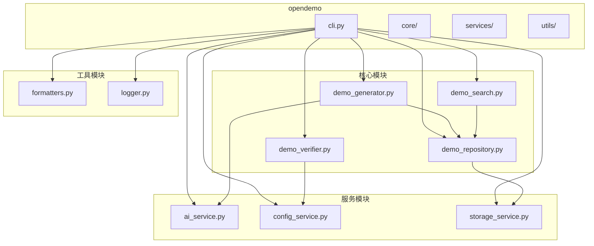

# Go Cobra CLI 工具演示

<cite>
**本文档引用的文件**
- [cli.py](file://opendemo/cli.py)
- [demo_generator.py](file://opendemo/core/demo_generator.py)
- [demo_repository.py](file://opendemo/core/demo_repository.py)
- [demo_search.py](file://opendemo/core/demo_search.py)
- [demo_verifier.py](file://opendemo/core/demo_verifier.py)
- [ai_service.py](file://opendemo/services/ai_service.py)
- [storage_service.py](file://opendemo/services/storage_service.py)
- [config_service.py](file://opendemo/services/config_service.py)
- [formatters.py](file://opendemo/utils/formatters.py)
- [logger.py](file://opendemo/utils/logger.py)
- [main.go](file://opendemo_output/go/go-cobra-cli-cli-tool-demo/main.go)
- [hello.go](file://opendemo_output/go/go-cobra-cli-cli-tool-demo/cmd/hello.go)
- [version.go](file://opendemo_output/go/go-cobra-cli-cli-tool-demo/cmd/version.go)
- [metadata.json](file://opendemo_output/go/go-cobra-cli-cli-tool-demo/metadata.json)
</cite>

## 目录
1. [简介](#简介)
2. [项目结构](#项目结构)
3. [核心组件](#核心组件)
4. [架构概述](#架构概述)
5. [详细组件分析](#详细组件分析)
6. [依赖分析](#依赖分析)
7. [性能考虑](#性能考虑)
8. [故障排除指南](#故障排除指南)
9. [结论](#结论)

## 简介
本项目是一个名为“Open Demo”的智能化编程学习辅助命令行工具（CLI），旨在帮助开发者快速获取和生成各种编程主题的代码示例。该工具的核心功能之一是能够生成和演示使用Go语言的Cobra库构建现代化命令行应用的完整示例。Cobra是一个广泛使用的Go库，用于创建功能丰富、易于使用的CLI工具。

该工具通过集成AI服务，能够根据用户输入的主题和编程语言，动态生成包含完整代码、文档和依赖声明的可执行demo。用户可以通过简单的命令行指令，如`opendemo get go cobra`来获取Cobra CLI工具的演示代码。项目不仅提供了生成代码的能力，还包含了搜索、验证、配置管理等完整功能，形成了一个闭环的开发辅助系统。

## 项目结构
项目采用模块化设计，代码结构清晰，主要分为核心功能、服务层、工具层和CLI入口。核心功能模块（`core`）负责demo的生成、搜索、验证和存储管理。服务层（`services`）提供配置、AI交互和存储等基础服务。工具层（`utils`）包含日志记录和输出格式化等辅助功能。CLI入口（`cli.py`）作为用户交互的唯一入口，协调所有模块。

**图源**
- [cli.py](file://opendemo/cli.py#L31-L34)
- [demo_generator.py](file://opendemo/core/demo_generator.py#L14-L17)
- [demo_repository.py](file://opendemo/core/demo_repository.py#L75-L93)
- [demo_search.py](file://opendemo/core/demo_search.py#L26-L32)
- [demo_verifier.py](file://opendemo/core/demo_verifier.py#L19-L22)
- [ai_service.py](file://opendemo/services/ai_service.py#L16-L19)
- [config_service.py](file://opendemo/services/config_service.py#L16-L20)
- [storage_service.py](file://opendemo/services/storage_service.py#L17-L20)
- [formatters.py](file://opendemo/utils/formatters.py#L18-L20)
- [logger.py](file://opendemo/utils/logger.py#L13-L14)

## 核心组件
项目的**核心组件**包括`DemoGenerator`、`DemoRepository`、`DemoSearch`和`DemoVerifier`，它们共同构成了一个完整的demo管理生命周期。`DemoGenerator`负责协调AI服务生成新的代码示例。`DemoRepository`是所有demo的中央管理器，负责加载、创建和组织demo。`DemoSearch`提供强大的搜索和匹配功能，能够根据关键字、语言和难度找到最合适的demo。`DemoVerifier`则确保生成的demo代码是可执行和正确的。

**组件源**
- [demo_generator.py](file://opendemo/core/demo_generator.py#L14-L104)
- [demo_repository.py](file://opendemo/core/demo_repository.py#L75-L100)
- [demo_search.py](file://opendemo/core/demo_search.py#L26-L41)
- [demo_verifier.py](file://opendemo/core/demo_verifier.py#L19-L30)

## 架构概述
整个系统的架构遵循清晰的分层模式。最上层是**CLI入口层**，由`click`库驱动，处理用户命令和参数。中间是**业务逻辑层**，包含`DemoGenerator`、`DemoSearch`等核心类，它们不直接与外部系统交互，而是通过服务层。底层是**服务层**，`AIService`、`ConfigService`和`StorageService`分别处理与AI API、配置文件和文件系统的交互。这种分层设计确保了高内聚、低耦合，使得系统易于维护和扩展。

**图源**
- [cli.py](file://opendemo/cli.py#L31-L34)
- [demo_generator.py](file://opendemo/core/demo_generator.py#L14-L17)
- [demo_repository.py](file://opendemo/core/demo_repository.py#L75-L93)
- [demo_search.py](file://opendemo/core/demo_search.py#L26-L32)
- [demo_verifier.py](file://opendemo/core/demo_verifier.py#L19-L22)
- [ai_service.py](file://opendemo/services/ai_service.py#L16-L19)
- [config_service.py](file://opendemo/services/config_service.py#L16-L20)
- [storage_service.py](file://opendemo/services/storage_service.py#L17-L20)

## 详细组件分析
### CLI 入口分析
`cli.py`是整个应用的入口点，使用`click`库构建了一个功能完整的命令行界面。它定义了`get`、`search`、`new`和`config`等顶级命令。`get`命令是核心功能，允许用户获取已有的或由AI生成的新demo。`config`命令则提供了一个子命令组，用于初始化、设置和查看配置。

#### CLI 命令流程图

**图源**
- [cli.py](file://opendemo/cli.py#L316-L320)
- [cli.py](file://opendemo/cli.py#L465-L468)
- [cli.py](file://opendemo/cli.py#L525-L528)
- [cli.py](file://opendemo/cli.py#L629-L632)

### Go Cobra CLI 演示分析
`opendemo_output/go/go-cobra-cli-cli-tool-demo`目录下的代码是一个完整的Go Cobra CLI应用示例。其架构遵循Cobra的标准模式：`main.go`作为程序入口，调用`cmd`包的`Execute`函数。`cmd`包中定义了根命令`rootCmd`和子命令`helloCmd`、`versionCmd`。

#### Go Cobra CLI 类图

**图源**
- [main.go](file://opendemo_output/go/go-cobra-cli-cli-tool-demo/main.go#L9-L10)
- [hello.go](file://opendemo_output/go/go-cobra-cli-cli-tool-demo/cmd/hello.go#L14-L22)
- [version.go](file://opendemo_output/go/go-cobra-cli-cli-tool-demo/cmd/version.go#L10-L18)

### AI 服务分析
`AIService`是连接外部LLM（如OpenAI）的桥梁。它负责构建符合要求的prompt，调用API，并解析返回的JSON响应。其`_build_prompt`方法精心设计了指令，要求AI生成包含`metadata.json`、`README.md`和代码文件的完整demo，并遵循特定的编码规范。

#### AI 服务调用序列图

**图源**
- [demo_generator.py](file://opendemo/core/demo_generator.py#L30-L52)
- [ai_service.py](file://opendemo/services/ai_service.py#L38-L85)
- [ai_service.py](file://opendemo/services/ai_service.py#L87-L175)

## 依赖分析
项目依赖关系清晰，遵循单向依赖原则。CLI入口依赖所有核心和工具模块。核心模块（如`DemoGenerator`）依赖服务模块（如`AIService`）。服务模块之间相互独立，都依赖于`utils`中的`logger`。Go Cobra CLI演示代码则依赖于`github.com/spf13/cobra`库。

**图源**
- [cli.py](file://opendemo/cli.py#L13-L23)
- [demo_generator.py](file://opendemo/core/demo_generator.py#L17-L28)
- [demo_repository.py](file://opendemo/core/demo_repository.py#L81-L92)
- [demo_search.py](file://opendemo/core/demo_search.py#L32-L39)
- [demo_verifier.py](file://opendemo/core/demo_verifier.py#L22-L29)
- [ai_service.py](file://opendemo/services/ai_service.py#L19-L26)
- [storage_service.py](file://opendemo/services/storage_service.py#L20-L27)
- [config_service.py](file://opendemo/services/config_service.py#L51-L55)
- [formatters.py](file://opendemo/utils/formatters.py#L8-L15)
- [logger.py](file://opendemo/utils/logger.py#L13-L14)

## 性能考虑
该项目在性能方面主要考虑了以下几点：
1.  **缓存机制**：`DemoRepository`和`DemoSearch`类中实现了缓存，避免了对文件系统的重复扫描和元数据加载，显著提升了搜索和加载demo的性能。
2.  **异步与重试**：`AIService`在调用外部API时实现了重试机制，通过`retry_times`和`retry_interval`配置，增强了在网络不稳定情况下的鲁棒性。
3.  **资源管理**：`DemoVerifier`在验证Python demo时，使用`tempfile.TemporaryDirectory`创建临时环境，确保了验证过程的隔离性和安全性，避免了对系统环境的污染。
4.  **配置化**：关键性能参数（如`verification_timeout`、`ai.max_tokens`）均通过配置文件管理，允许用户根据实际环境进行调整。

## 故障排除指南
当使用此工具时，可能会遇到以下常见问题：

**问题：执行`opendemo get go cobra`时提示“AI API密钥未配置”**
- **原因**：未配置访问AI服务（如OpenAI）所需的API密钥。
- **解决方案**：运行`opendemo config init`命令并输入您的API密钥，或使用`opendemo config set ai.api_key YOUR_KEY`手动设置。

**问题：生成的Go demo无法编译，提示找不到`cobra`包**
- **原因**：生成的demo可能缺少`go.mod`文件，或`go mod tidy`命令执行失败。
- **解决方案**：检查`DemoVerifier`的`_verify_go`方法，确保在临时目录中正确执行了`go mod init`和`go mod tidy`。确认系统已安装Go，并且`go`命令在PATH中。

**问题：搜索功能无法找到已生成的demo**
- **原因**：`_scan_output_demos`函数可能未能正确扫描输出目录，或`metadata.json`文件格式有误。
- **解决方案**：检查`opendemo_output`目录结构是否符合`<language>/<demo_name>`的格式，并确认`metadata.json`文件存在且包含正确的`name`和`language`字段。

**组件源**
- [cli.py](file://opendemo/cli.py#L423-L426)
- [demo_verifier.py](file://opendemo/core/demo_verifier.py#L247-L313)
- [demo_repository.py](file://opendemo/core/demo_repository.py#L402-L439)

## 结论
本“Go Cobra CLI 工具演示”项目展示了一个功能完备、架构清晰的智能化编程辅助工具。它不仅成功演示了如何使用Go的Cobra库构建CLI应用，其自身的设计也堪称典范。项目通过模块化、分层和依赖注入等设计模式，实现了高内聚、低耦合的代码结构。集成AI服务的能力使其能够动态生成高质量的代码示例，极大地提升了开发效率。整体而言，该项目是一个集实用性、教育性和技术先进性于一体的优秀开源工具。