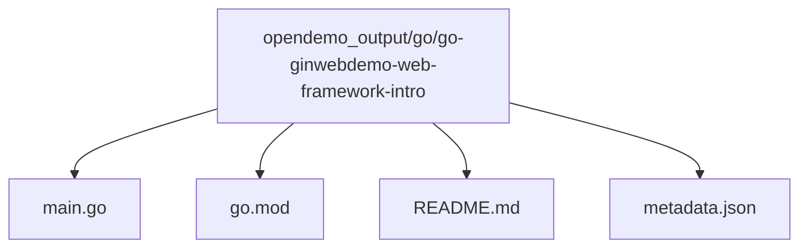
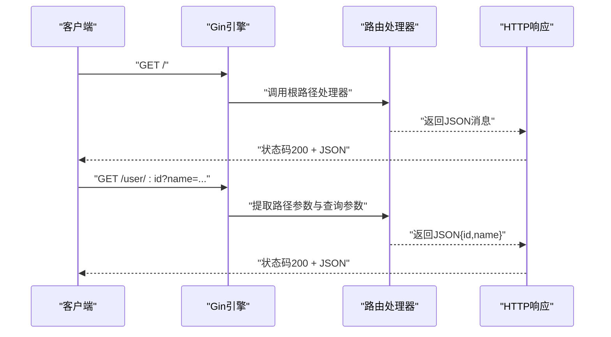
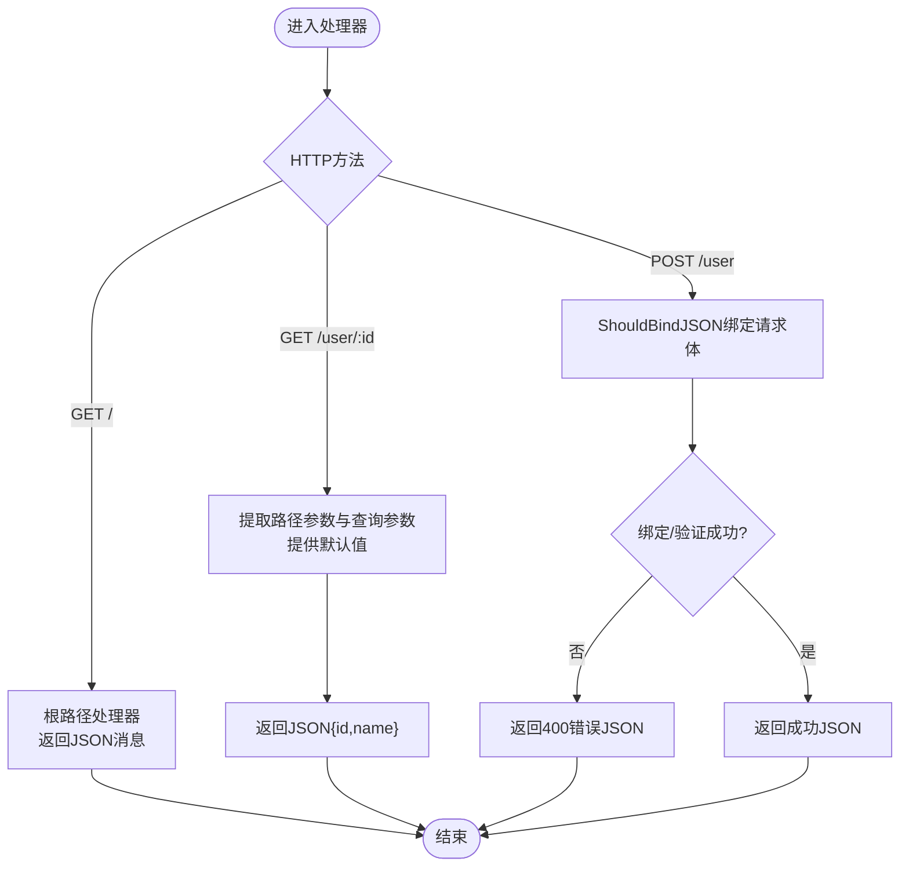
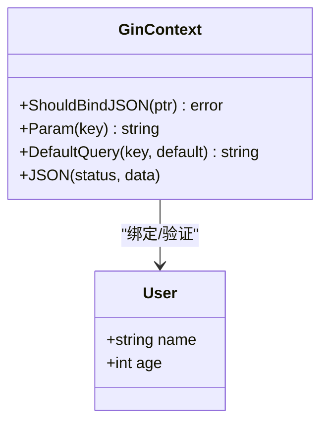
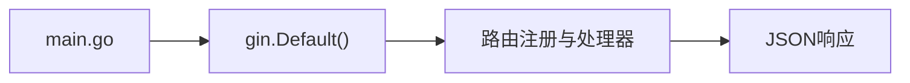

# Go Gin Web框架演示

<cite>
**本文引用的文件**
- [README.md](file://README.md)
- [opendemo_output/go/go-ginwebdemo-web-framework-intro/main.go](file://opendemo_output/go/go-ginwebdemo-web-framework-intro/main.go)
- [opendemo_output/go/go-ginwebdemo-web-framework-intro/go.mod](file://opendemo_output/go/go-ginwebdemo-web-framework-intro/go.mod)
- [opendemo_output/go/go-ginwebdemo-web-framework-intro/README.md](file://opendemo_output/go/go-ginwebdemo-web-framework-intro/README.md)
- [opendemo_output/go/go-ginwebdemo-web-framework-intro/metadata.json](file://opendemo_output/go/go-ginwebdemo-web-framework-intro/metadata.json)
- [opendemo/services/config_service.py](file://opendemo/services/config_service.py)
- [opendemo/core/demo_generator.py](file://opendemo/core/demo_generator.py)
</cite>

## 目录
1. [简介](#简介)
2. [项目结构](#项目结构)
3. [核心组件](#核心组件)
4. [架构总览](#架构总览)
5. [详细组件分析](#详细组件分析)
6. [依赖分析](#依赖分析)
7. [性能考虑](#性能考虑)
8. [故障排查指南](#故障排查指南)
9. [结论](#结论)
10. [附录](#附录)

## 简介
本文件面向希望快速上手 Go 语言 Web 开发的初学者与进阶用户，系统讲解如何使用 Gin 框架搭建一个轻量级 HTTP 服务，涵盖路由定义、请求参数解析、JSON 响应、结构体绑定与验证等关键知识点。该演示项目来自 OpenDemo CLI 的 Go 语言示例集合，便于结合 CLI 工具进行一键获取与运行。

## 项目结构
该演示位于 Go 语言输出目录下的 Gin Web 入门示例，包含最小可运行的 main.go、模块声明 go.mod、示例文档 README.md 以及元数据 metadata.json。

图表来源
- [opendemo_output/go/go-ginwebdemo-web-framework-intro/main.go](file://opendemo_output/go/go-ginwebdemo-web-framework-intro/main.go#L1-L66)
- [opendemo_output/go/go-ginwebdemo-web-framework-intro/go.mod](file://opendemo_output/go/go-ginwebdemo-web-framework-intro/go.mod#L1-L5)
- [opendemo_output/go/go-ginwebdemo-web-framework-intro/README.md](file://opendemo_output/go/go-ginwebdemo-web-framework-intro/README.md#L1-L131)
- [opendemo_output/go/go-ginwebdemo-web-framework-intro/metadata.json](file://opendemo_output/go/go-ginwebdemo-web-framework-intro/metadata.json#L1-L22)

章节来源
- [opendemo_output/go/go-ginwebdemo-web-framework-intro/main.go](file://opendemo_output/go/go-ginwebdemo-web-framework-intro/main.go#L1-L66)
- [opendemo_output/go/go-ginwebdemo-web-framework-intro/go.mod](file://opendemo_output/go/go-ginwebdemo-web-framework-intro/go.mod#L1-L5)
- [opendemo_output/go/go-ginwebdemo-web-framework-intro/README.md](file://opendemo_output/go/go-ginwebdemo-web-framework-intro/README.md#L1-L131)
- [opendemo_output/go/go-ginwebdemo-web-framework-intro/metadata.json](file://opendemo_output/go/go-ginwebdemo-web-framework-intro/metadata.json#L1-L22)

## 核心组件
- Gin 引擎与中间件
  - 使用 gin.Default() 创建包含 Logger 和 Recovery 的默认引擎，便于调试与健壮性。
- 路由与处理器
  - GET 根路径返回简单 JSON 消息。
  - GET 带路径参数与查询参数的用户信息接口。
  - POST 接收 JSON 用户数据，使用结构体绑定与验证。
- 数据模型与绑定
  - User 结构体定义 name 与 age 字段，并通过标签进行必填与范围约束。
- 依赖与运行
  - go.mod 声明 Gin v1.9.1 依赖；main.go 启动 HTTP 服务器，默认监听 :8080。

章节来源
- [opendemo_output/go/go-ginwebdemo-web-framework-intro/main.go](file://opendemo_output/go/go-ginwebdemo-web-framework-intro/main.go#L1-L66)
- [opendemo_output/go/go-ginwebdemo-web-framework-intro/go.mod](file://opendemo_output/go/go-ginwebdemo-web-framework-intro/go.mod#L1-L5)

## 架构总览
下面以序列图展示一次典型请求的处理流程，包括 GET 根路径与 GET 用户信息接口。

图表来源
- [opendemo_output/go/go-ginwebdemo-web-framework-intro/main.go](file://opendemo_output/go/go-ginwebdemo-web-framework-intro/main.go#L20-L41)

## 详细组件分析

### 组件A：请求处理与参数解析
- 功能要点
  - GET 根路径处理器直接返回 JSON。
  - GET /user/:id 处理路径参数与查询参数，提供默认值。
  - POST /user 使用 ShouldBindJSON 将请求体绑定到结构体并进行验证，错误时返回 400。
- 关键实现路径
  - GET 根路径处理器：[opendemo_output/go/go-ginwebdemo-web-framework-intro/main.go](file://opendemo_output/go/go-ginwebdemo-web-framework-intro/main.go#L20-L25)
  - GET 带参数用户接口：[opendemo_output/go/go-ginwebdemo-web-framework-intro/main.go](file://opendemo_output/go/go-ginwebdemo-web-framework-intro/main.go#L27-L41)
  - POST JSON 绑定与验证：[opendemo_output/go/go-ginwebdemo-web-framework-intro/main.go](file://opendemo_output/go/go-ginwebdemo-web-framework-intro/main.go#L43-L61)

图表来源
- [opendemo_output/go/go-ginwebdemo-web-framework-intro/main.go](file://opendemo_output/go/go-ginwebdemo-web-framework-intro/main.go#L20-L61)

章节来源
- [opendemo_output/go/go-ginwebdemo-web-framework-intro/main.go](file://opendemo_output/go/go-ginwebdemo-web-framework-intro/main.go#L20-L61)

### 组件B：数据模型与绑定
- User 结构体
  - 字段 name 必填，age 限定范围。
  - 通过标签实现自动绑定与验证。
- 绑定与验证流程
  - ShouldBindJSON 自动解析 JSON 并应用标签规则。
  - 失败时返回错误信息，避免后续逻辑继续执行。

图表来源
- [opendemo_output/go/go-ginwebdemo-web-framework-intro/main.go](file://opendemo_output/go/go-ginwebdemo-web-framework-intro/main.go#L9-L13)
- [opendemo_output/go/go-ginwebdemo-web-framework-intro/main.go](file://opendemo_output/go/go-ginwebdemo-web-framework-intro/main.go#L43-L61)

章节来源
- [opendemo_output/go/go-ginwebdemo-web-framework-intro/main.go](file://opendemo_output/go/go-ginwebdemo-web-framework-intro/main.go#L9-L13)
- [opendemo_output/go/go-ginwebdemo-web-framework-intro/main.go](file://opendemo_output/go/go-ginwebdemo-web-framework-intro/main.go#L43-L61)

### 组件C：运行与依赖
- 模块与依赖
  - go.mod 声明模块名与 Gin 版本。
- 启动与监听
  - main.go 使用 gin.Default() 创建引擎并启动 HTTP 服务器，默认监听 :8080。
- 文档与元数据
  - README.md 提供安装、运行与测试步骤。
  - metadata.json 描述示例名称、关键词、难度等元信息。

章节来源
- [opendemo_output/go/go-ginwebdemo-web-framework-intro/go.mod](file://opendemo_output/go/go-ginwebdemo-web-framework-intro/go.mod#L1-L5)
- [opendemo_output/go/go-ginwebdemo-web-framework-intro/main.go](file://opendemo_output/go/go-ginwebdemo-web-framework-intro/main.go#L15-L18)
- [opendemo_output/go/go-ginwebdemo-web-framework-intro/main.go](file://opendemo_output/go/go-ginwebdemo-web-framework-intro/main.go#L63-L66)
- [opendemo_output/go/go-ginwebdemo-web-framework-intro/README.md](file://opendemo_output/go/go-ginwebdemo-web-framework-intro/README.md#L1-L131)
- [opendemo_output/go/go-ginwebdemo-web-framework-intro/metadata.json](file://opendemo_output/go/go-ginwebdemo-web-framework-intro/metadata.json#L1-L22)

## 依赖分析
- Gin 引擎
  - gin.Default() 提供 Logger 与 Recovery 中间件，提升开发体验与稳定性。
- 依赖关系
  - main.go 直接依赖 Gin；go.mod 声明 Gin v1.9.1。
- 运行时行为
  - 服务器启动后，按路由注册顺序匹配请求，执行对应处理器并返回 JSON 响应。

图表来源
- [opendemo_output/go/go-ginwebdemo-web-framework-intro/main.go](file://opendemo_output/go/go-ginwebdemo-web-framework-intro/main.go#L15-L18)
- [opendemo_output/go/go-ginwebdemo-web-framework-intro/main.go](file://opendemo_output/go/go-ginwebdemo-web-framework-intro/main.go#L20-L61)

章节来源
- [opendemo_output/go/go-ginwebdemo-web-framework-intro/main.go](file://opendemo_output/go/go-ginwebdemo-web-framework-intro/main.go#L15-L18)
- [opendemo_output/go/go-ginwebdemo-web-framework-intro/go.mod](file://opendemo_output/go/go-ginwebdemo-web-framework-intro/go.mod#L1-L5)

## 性能考虑
- 中间件选择
  - gin.Default() 已包含 Logger 与 Recovery，适合开发阶段；生产环境可通过环境变量切换至 release 模式以减少调试开销。
- 路由与处理器
  - 路由层级尽量扁平，避免深层嵌套导致匹配开销增加。
  - 处理器内部尽量短小精悍，避免阻塞 IO。
- 绑定与验证
  - 使用 ShouldBindJSON 与结构体标签可减少手动解析与重复校验，提高可靠性与性能。

章节来源
- [opendemo_output/go/go-ginwebdemo-web-framework-intro/README.md](file://opendemo_output/go/go-ginwebdemo-web-framework-intro/README.md#L116-L125)
- [opendemo_output/go/go-ginwebdemo-web-framework-intro/main.go](file://opendemo_output/go/go-ginwebdemo-web-framework-intro/main.go#L43-L61)

## 故障排查指南
- 找不到 Gin 包
  - 确认已执行依赖安装命令并在 go.mod 中声明 Gin 版本。
- 端口被占用
  - 修改 r.Run() 中的端口为其他可用端口。
- 生产环境模式
  - 设置环境变量 GIN_MODE=release 以启用 release 模式。
- 请求参数缺失或类型不匹配
  - 检查请求体 JSON 字段与结构体标签是否一致；ShouldBindJSON 失败时会返回 400。

章节来源
- [opendemo_output/go/go-ginwebdemo-web-framework-intro/README.md](file://opendemo_output/go/go-ginwebdemo-web-framework-intro/README.md#L116-L125)
- [opendemo_output/go/go-ginwebdemo-web-framework-intro/main.go](file://opendemo_output/go/go-ginwebdemo-web-framework-intro/main.go#L43-L61)

## 结论
该 Gin Web 演示项目以最小实现展示了 Go Web 开发的核心要素：路由注册、参数解析、结构体绑定与验证、JSON 响应与服务器启动。结合 CLI 工具可快速获取并运行该示例，适合入门与进阶学习。建议在掌握基础后逐步引入中间件、数据库集成、认证授权与文档生成等高级特性。

## 附录
- CLI 工具与配置
  - OpenDemo CLI 提供配置服务与 Demo 生成器，支持从内置库或 AI 生成 Demo，并自动补充元数据与 README。
- 相关文件路径
  - 配置服务：[opendemo/services/config_service.py](file://opendemo/services/config_service.py#L1-L280)
  - Demo 生成器：[opendemo/core/demo_generator.py](file://opendemo/core/demo_generator.py#L1-L137)
  - 项目总览与使用说明：[README.md](file://README.md#L1-L207)

章节来源
- [opendemo/services/config_service.py](file://opendemo/services/config_service.py#L1-L280)
- [opendemo/core/demo_generator.py](file://opendemo/core/demo_generator.py#L1-L137)
- [README.md](file://README.md#L1-L207)