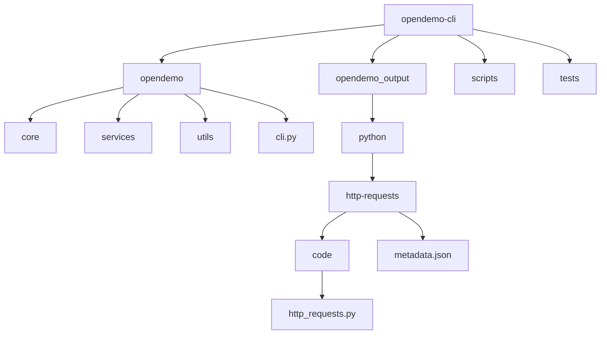
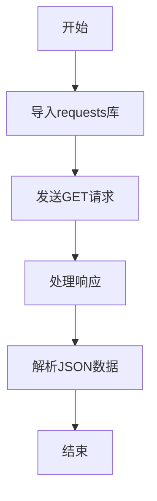
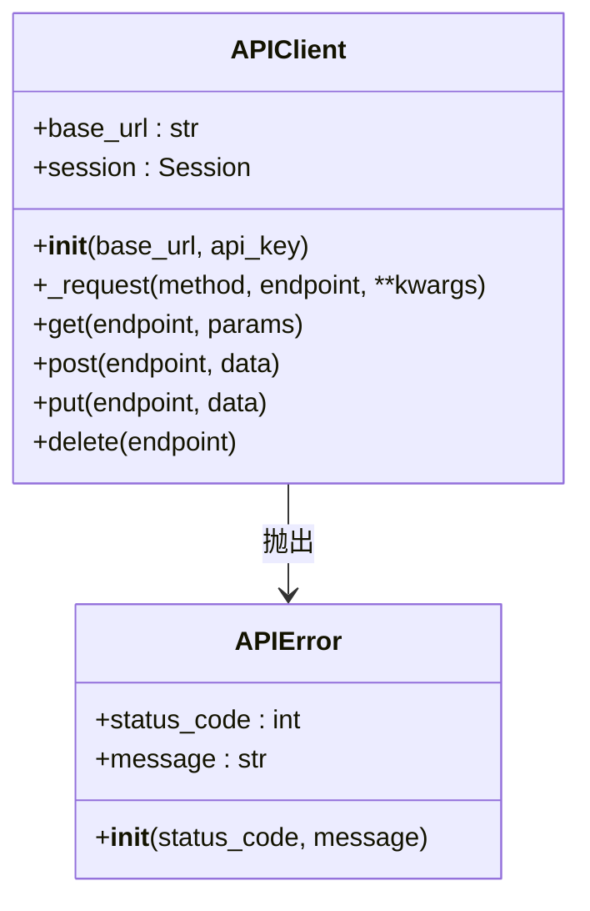

# Python HTTP请求演示

<cite>
**本文档引用的文件**   
- [http_requests.py](file://opendemo_output/python/http-requests/code/http_requests.py)
- [metadata.json](file://opendemo_output/python/http-requests/metadata.json)
- [README.md](file://README.md)
- [cli.py](file://opendemo/cli.py)
</cite>

## 目录
1. [简介](#简介)
2. [项目结构](#项目结构)
3. [核心组件](#核心组件)
4. [HTTP请求演示详解](#http请求演示详解)
5. [使用模式](#使用模式)
6. [API客户端封装](#api客户端封装)
7. [运行演示](#运行演示)
8. [结论](#结论)

## 简介
本演示展示了Python中HTTP请求的多种实现方式，重点介绍了使用requests库进行HTTP通信的最佳实践。该演示是Open Demo CLI工具的一部分，旨在帮助开发者快速学习和掌握Python HTTP请求编程。

演示内容包括：
- 使用内置urllib库的HTTP请求
- requests库的常用模式
- API客户端的封装方法
- 错误处理和超时管理

**Section sources**
- [README.md](file://README.md#L1-L207)

## 项目结构
Open Demo CLI项目采用模块化设计，将不同功能分离到独立的目录中。Python HTTP请求演示位于opendemo_output/python/http-requests目录下，遵循标准的演示项目结构。



**Diagram sources **
- [README.md](file://README.md#L96-L141)
- [http_requests.py](file://opendemo_output/python/http-requests/code/http_requests.py#L1-L249)

**Section sources**
- [README.md](file://README.md#L96-L141)

## 核心组件
Python HTTP请求演示的核心组件包括演示代码文件和元数据文件，它们共同构成了一个完整的教学示例。

**Section sources**
- [http_requests.py](file://opendemo_output/python/http-requests/code/http_requests.py#L1-L249)
- [metadata.json](file://opendemo_output/python/http-requests/metadata.json#L1-L11)

## HTTP请求演示详解
HTTP请求演示代码展示了三种不同的HTTP请求实现方式：使用内置urllib库、模拟请求演示和requests库的实际应用。

### 内置urllib演示
演示展示了如何使用Python内置的urllib库进行HTTP GET请求，这是不依赖第三方库的基础实现方式。

### 模拟请求演示
当网络不可用或需要离线演示时，代码提供了MockResponse类来模拟HTTP响应，确保演示可以在任何环境下运行。

### 功能特点
- 支持GET请求演示
- 包含错误处理机制
- 提供超时处理示例
- 展示响应头和状态码处理

**Section sources**
- [http_requests.py](file://opendemo_output/python/http-requests/code/http_requests.py#L11-L99)

## 使用模式
演示详细展示了requests库的各种使用模式，这是Python中最流行的HTTP客户端库。

### 基本请求模式


**Diagram sources **
- [http_requests.py](file://opendemo_output/python/http-requests/code/http_requests.py#L101-L183)

### 主要功能
- 带参数的GET请求
- POST JSON数据
- POST表单数据
- 自定义请求头
- 超时设置
- 会话保持
- 文件上传
- 错误处理

**Section sources**
- [http_requests.py](file://opendemo_output/python/http-requests/code/http_requests.py#L101-L183)

## API客户端封装
演示展示了如何封装一个专业的API客户端，提供统一的请求接口和错误处理机制。

### 客户端设计


**Diagram sources **
- [http_requests.py](file://opendemo_output/python/http-requests/code/http_requests.py#L186-L240)

### 封装优势
- 统一的错误处理
- 自动的JSON解析
- 可配置的超时设置
- 会话级别的头部管理
- 简化的HTTP方法调用

**Section sources**
- [http_requests.py](file://opendemo_output/python/http-requests/code/http_requests.py#L186-L240)

## 运行演示
要运行此HTTP请求演示，可以使用Open Demo CLI工具或直接执行Python脚本。

### CLI方式
```bash
opendemo get python http-requests
```

### 直接执行
```bash
python opendemo_output/python/http-requests/code/http_requests.py
```

演示将依次展示：
1. 使用urllib的HTTP请求
2. requests库的使用模式
3. API客户端封装示例

**Section sources**
- [cli.py](file://opendemo/cli.py#L316-L463)
- [http_requests.py](file://opendemo_output/python/http-requests/code/http_requests.py#L244-L249)

## 结论
Python HTTP请求演示提供了一个全面的学习资源，涵盖了从基础到高级的HTTP请求技术。通过这个演示，开发者可以快速掌握Python中HTTP通信的最佳实践，包括使用requests库、错误处理、超时管理和API客户端封装等关键技能。

该演示作为Open Demo CLI工具的一部分，体现了项目"快速获取高质量、可执行的编程语言demo代码"的核心理念，为开发者提供了一个实用的学习和参考工具。