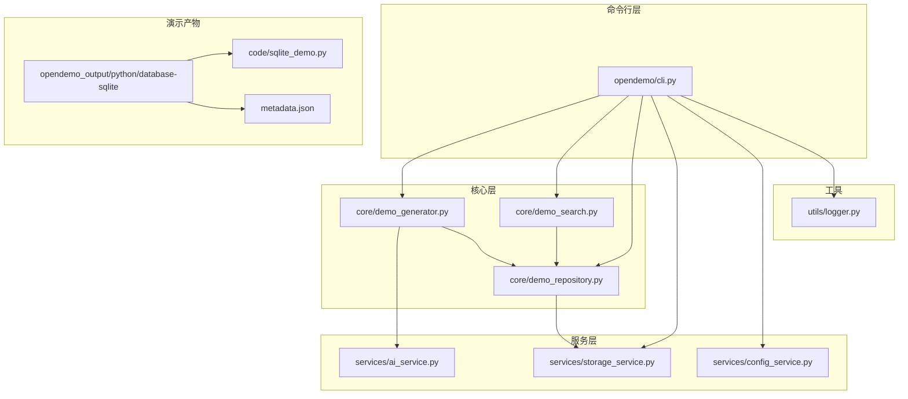
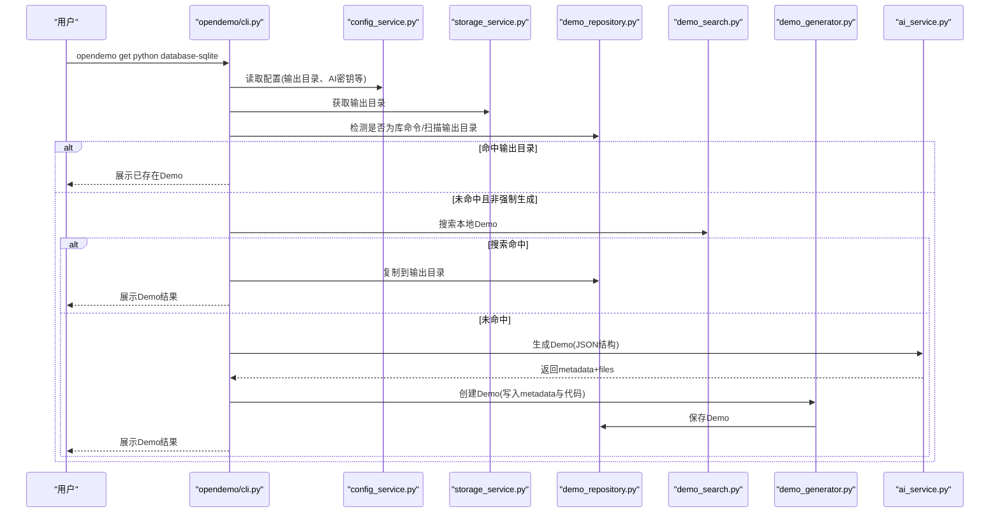
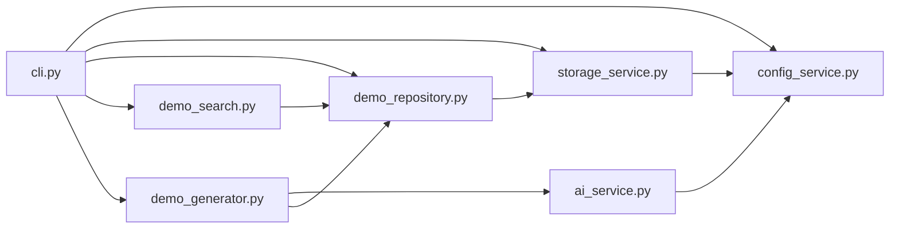

# Python SQLite数据库操作演示

<cite>
**本文引用的文件**
- [README.md](file://README.md)
- [cli.py](file://opendemo/cli.py)
- [demo_generator.py](file://opendemo/core/demo_generator.py)
- [demo_repository.py](file://opendemo/core/demo_repository.py)
- [demo_search.py](file://opendemo/core/demo_search.py)
- [storage_service.py](file://opendemo/services/storage_service.py)
- [ai_service.py](file://opendemo/services/ai_service.py)
- [config_service.py](file://opendemo/services/config_service.py)
- [logger.py](file://opendemo/utils/logger.py)
- [sqlite_demo.py](file://opendemo_output/python/database-sqlite/code/sqlite_demo.py)
- [metadata.json](file://opendemo_output/python/database-sqlite/metadata.json)
</cite>

## 目录
1. [简介](#简介)
2. [项目结构](#项目结构)
3. [核心组件](#核心组件)
4. [架构总览](#架构总览)
5. [组件详解](#组件详解)
6. [依赖关系分析](#依赖关系分析)
7. [性能与实践建议](#性能与实践建议)
8. [故障排查指南](#故障排查指南)
9. [结论](#结论)
10. [附录](#附录)

## 简介
本文件围绕“Python SQLite数据库操作演示”这一主题，系统梳理该项目的命令行工具如何通过内置Demo与AI生成能力，帮助用户快速获取、搜索、运行与验证Python SQLite数据库操作示例。文档既面向技术读者，也兼顾非技术背景用户，提供从入门到进阶的可视化流程与最佳实践。

## 项目结构
- 命令行入口与业务编排位于 opendemo/cli.py，提供 get/search/new/config 等子命令。
- 核心业务逻辑集中在 opendemo/core 下的 demo_generator.py、demo_repository.py、demo_search.py。
- 服务层包括 opendemo/services 下的 ai_service.py、config_service.py、storage_service.py。
- 工具与日志位于 opendemo/utils/logger.py。
- Python SQLite演示位于 opendemo_output/python/database-sqlite，包含代码与元数据。

图表来源
- [cli.py](file://opendemo/cli.py#L316-L463)
- [demo_generator.py](file://opendemo/core/demo_generator.py#L30-L105)
- [demo_repository.py](file://opendemo/core/demo_repository.py#L147-L222)
- [demo_search.py](file://opendemo/core/demo_search.py#L43-L83)
- [storage_service.py](file://opendemo/services/storage_service.py#L131-L167)
- [ai_service.py](file://opendemo/services/ai_service.py#L38-L86)
- [config_service.py](file://opendemo/services/config_service.py#L147-L169)
- [logger.py](file://opendemo/utils/logger.py#L13-L65)
- [sqlite_demo.py](file://opendemo_output/python/database-sqlite/code/sqlite_demo.py#L1-L324)
- [metadata.json](file://opendemo_output/python/database-sqlite/metadata.json#L1-L11)

章节来源
- [README.md](file://README.md#L96-L141)

## 核心组件
- 命令行入口与控制流：opendemo/cli.py 提供 get/search/new/config 子命令，串联配置、存储、仓库、搜索与生成器。
- Demo生成器：core/demo_generator.py 调用AI生成器，补充元数据并创建Demo。
- Demo仓库：core/demo_repository.py 统一管理Demo与库Demo，提供复制、元数据更新、库功能检索等。
- 搜索引擎：core/demo_search.py 提供普通Demo与库功能的匹配与排序。
- 存储服务：services/storage_service.py 负责文件系统操作、复制、迁移与输出目录管理。
- AI服务：services/ai_service.py 负责与LLM交互，生成Demo结构化数据。
- 配置服务：services/config_service.py 负责全局/项目配置加载、合并与持久化。
- 日志工具：utils/logger.py 提供统一日志记录。

章节来源
- [cli.py](file://opendemo/cli.py#L316-L463)
- [demo_generator.py](file://opendemo/core/demo_generator.py#L30-L105)
- [demo_repository.py](file://opendemo/core/demo_repository.py#L147-L222)
- [demo_search.py](file://opendemo/core/demo_search.py#L43-L83)
- [storage_service.py](file://opendemo/services/storage_service.py#L131-L167)
- [ai_service.py](file://opendemo/services/ai_service.py#L38-L86)
- [config_service.py](file://opendemo/services/config_service.py#L147-L169)
- [logger.py](file://opendemo/utils/logger.py#L13-L65)

## 架构总览
下面以“获取Python SQLite演示”的典型流程为例，展示从命令行到AI生成与产物落盘的端到端调用链。

图表来源
- [cli.py](file://opendemo/cli.py#L316-L463)
- [demo_search.py](file://opendemo/core/demo_search.py#L43-L83)
- [demo_repository.py](file://opendemo/core/demo_repository.py#L147-L222)
- [demo_generator.py](file://opendemo/core/demo_generator.py#L30-L105)
- [ai_service.py](file://opendemo/services/ai_service.py#L38-L86)
- [storage_service.py](file://opendemo/services/storage_service.py#L214-L223)
- [config_service.py](file://opendemo/services/config_service.py#L147-L169)

## 组件详解

### 命令行入口与控制流
- get 子命令：支持语言校验、库命令检测、输出目录扫描、本地搜索、AI生成与验证。
- search 子命令：列出语言与Demo，支持关键字过滤。
- new 子命令：基于AI生成新Demo，支持库主题识别与贡献流程。
- config 子命令：初始化、设置、获取与列出配置。

章节来源
- [cli.py](file://opendemo/cli.py#L316-L463)
- [cli.py](file://opendemo/cli.py#L465-L523)
- [cli.py](file://opendemo/cli.py#L525-L606)
- [cli.py](file://opendemo/cli.py#L629-L713)

### Demo生成器（AI驱动）
- 职责：调用AI生成Demo结构化数据，补充元数据，创建Demo并返回结果。
- 关键点：语言、主题、难度、自定义文件夹名、库名等参数透传；元数据包含作者、时间戳、版本、验证状态等。

章节来源
- [demo_generator.py](file://opendemo/core/demo_generator.py#L30-L105)

### Demo仓库（统一管理）
- 职责：加载/创建Demo、复制到输出目录、更新元数据、库功能检索与贡献流程。
- 特性：支持普通Demo与库Demo（libraries/库名/功能名）的目录结构；缓存机制提升性能；支持贡献验证与消息生成。

章节来源
- [demo_repository.py](file://opendemo/core/demo_repository.py#L147-L222)
- [demo_repository.py](file://opendemo/core/demo_repository.py#L256-L276)
- [demo_repository.py](file://opendemo/core/demo_repository.py#L223-L249)
- [demo_repository.py](file://opendemo/core/demo_repository.py#L309-L349)
- [demo_repository.py](file://opendemo/core/demo_repository.py#L441-L469)
- [demo_repository.py](file://opendemo/core/demo_repository.py#L539-L596)
- [demo_repository.py](file://opendemo/core/demo_repository.py#L597-L625)
- [demo_repository.py](file://opendemo/core/demo_repository.py#L628-L712)
- [demo_repository.py](file://opendemo/core/demo_repository.py#L713-L777)

### 搜索引擎（匹配与排序）
- 职责：对普通Demo与库功能进行匹配评分与排序，支持难度过滤、关键字匹配与多维度权重。
- 特性：内置权重配置；对库功能提供前缀/包含/标题/描述等多维匹配。

章节来源
- [demo_search.py](file://opendemo/core/demo_search.py#L43-L83)
- [demo_search.py](file://opendemo/core/demo_search.py#L177-L217)
- [demo_search.py](file://opendemo/core/demo_search.py#L220-L283)
- [demo_search.py](file://opendemo/core/demo_search.py#L284-L330)

### 存储服务（文件系统）
- 职责：列出Demo、加载/保存元数据、复制/删除Demo、读写文件、输出目录管理、内置库迁移。
- 特性：支持多库源（内置/用户/全部）；迁移标记避免重复迁移。

章节来源
- [storage_service.py](file://opendemo/services/storage_service.py#L50-L83)
- [storage_service.py](file://opendemo/services/storage_service.py#L107-L130)
- [storage_service.py](file://opendemo/services/storage_service.py#L131-L167)
- [storage_service.py](file://opendemo/services/storage_service.py#L168-L190)
- [storage_service.py](file://opendemo/services/storage_service.py#L191-L213)
- [storage_service.py](file://opendemo/services/storage_service.py#L214-L223)
- [storage_service.py](file://opendemo/services/storage_service.py#L225-L261)
- [storage_service.py](file://opendemo/services/storage_service.py#L279-L375)

### AI服务（LLM集成）
- 职责：构建提示词、调用API、解析响应、分类关键字（库/主题）、验证API密钥。
- 特性：重试机制、温度与Token配置、分类结果包含置信度与库名。

章节来源
- [ai_service.py](file://opendemo/services/ai_service.py#L38-L86)
- [ai_service.py](file://opendemo/services/ai_service.py#L87-L176)
- [ai_service.py](file://opendemo/services/ai_service.py#L177-L225)
- [ai_service.py](file://opendemo/services/ai_service.py#L226-L291)
- [ai_service.py](file://opendemo/services/ai_service.py#L292-L329)
- [ai_service.py](file://opendemo/services/ai_service.py#L330-L404)
- [ai_service.py](file://opendemo/services/ai_service.py#L405-L468)
- [ai_service.py](file://opendemo/services/ai_service.py#L469-L551)

### 配置服务（全局/项目）
- 职责：加载/合并全局与项目配置，提供键值读取、设置与保存，初始化配置文件。
- 特性：支持点分隔键访问；默认值覆盖；校验有效性。

章节来源
- [config_service.py](file://opendemo/services/config_service.py#L16-L49)
- [config_service.py](file://opendemo/services/config_service.py#L76-L107)
- [config_service.py](file://opendemo/services/config_service.py#L147-L169)
- [config_service.py](file://opendemo/services/config_service.py#L170-L203)
- [config_service.py](file://opendemo/services/config_service.py#L204-L219)
- [config_service.py](file://opendemo/services/config_service.py#L220-L242)
- [config_service.py](file://opendemo/services/config_service.py#L243-L271)
- [config_service.py](file://opendemo/services/config_service.py#L272-L280)

### 日志工具
- 职责：统一日志格式化、控制台与文件双通道输出，支持轮转。

章节来源
- [logger.py](file://opendemo/utils/logger.py#L13-L65)

### Python SQLite演示（产物）
- 代码：展示连接、建表与索引、CRUD、行工厂、事务、聚合函数与上下文管理器等常见用法。
- 元数据：包含语言、关键字、难度、验证状态等。

章节来源
- [sqlite_demo.py](file://opendemo_output/python/database-sqlite/code/sqlite_demo.py#L1-L324)
- [metadata.json](file://opendemo_output/python/database-sqlite/metadata.json#L1-L11)

## 依赖关系分析
- 命令行层依赖配置、存储、仓库、搜索与生成器。
- 生成器依赖AI服务与仓库。
- 仓库依赖存储服务与配置服务（用于贡献流程）。
- 搜索引擎依赖仓库。
- AI服务依赖配置服务（密钥、模型、超时等）。
- 存储服务依赖配置服务（输出目录、用户库路径）。

图表来源
- [cli.py](file://opendemo/cli.py#L316-L463)
- [demo_generator.py](file://opendemo/core/demo_generator.py#L30-L105)
- [demo_repository.py](file://opendemo/core/demo_repository.py#L147-L222)
- [demo_search.py](file://opendemo/core/demo_search.py#L43-L83)
- [storage_service.py](file://opendemo/services/storage_service.py#L131-L167)
- [ai_service.py](file://opendemo/services/ai_service.py#L38-L86)
- [config_service.py](file://opendemo/services/config_service.py#L147-L169)

## 性能与实践建议
- 缓存策略：仓库对Demo与库元数据、特性列表、支持库列表进行缓存，减少重复IO与解析开销。
- IO优化：批量写入文件、避免重复创建目录；复制Demo采用拷贝树，必要时先清理目标再复制。
- 搜索效率：对关键字匹配采用预计算与权重累加，避免多次全量扫描；库功能排序按分数与难度综合排序。
- 生成稳定性：AI调用具备重试与超时配置，解析响应时支持多种包裹形式，提高鲁棒性。
- 日志轮转：文件日志采用轮转，避免单文件过大影响性能。

章节来源
- [demo_repository.py](file://opendemo/core/demo_repository.py#L94-L99)
- [storage_service.py](file://opendemo/services/storage_service.py#L131-L167)
- [demo_search.py](file://opendemo/core/demo_search.py#L220-L283)
- [ai_service.py](file://opendemo/services/ai_service.py#L68-L85)
- [logger.py](file://opendemo/utils/logger.py#L44-L58)

## 故障排查指南
- AI API密钥未配置：命令行会在生成前检查配置，提示初始化与设置。
- 生成失败：检查网络与API端点，确认重试次数与间隔配置；查看日志定位异常。
- 产物未显示：确认输出目录是否存在，权限是否正确；检查元数据文件是否存在。
- 库命令未识别：若关键字非内置库，AI会进行分类判断；也可使用启发式规则回退。
- 验证失败：若启用自动验证，查看验证器输出与错误列表；必要时手动执行Demo。

章节来源
- [cli.py](file://opendemo/cli.py#L414-L463)
- [config_service.py](file://opendemo/services/config_service.py#L243-L271)
- [ai_service.py](file://opendemo/services/ai_service.py#L177-L225)
- [storage_service.py](file://opendemo/services/storage_service.py#L131-L167)
- [demo_repository.py](file://opendemo/core/demo_repository.py#L628-L712)

## 结论
本项目通过清晰的分层架构与完善的工具链，实现了从命令行到AI生成再到产物落盘的闭环。Python SQLite演示作为内置Demo之一，展示了从连接、建表、CRUD、事务到聚合与上下文管理的完整实践路径。对于希望快速上手SQLite的用户而言，该演示提供了可直接运行、可扩展的学习范式。

## 附录
- 快速开始：安装、初始化配置、获取Demo、搜索Demo、创建新Demo、配置管理。
- 目录结构：opendemo_output/python/database-sqlite 下包含代码与元数据，便于直接运行与学习。

章节来源
- [README.md](file://README.md#L21-L95)
- [README.md](file://README.md#L96-L141)