# Python异步编程演示

<cite>
**本文档引用的文件**   
- [async_programming.py](file://opendemo_output/python/async-programming/code/async_programming.py)
- [README.md](file://README.md)
- [ABOUT.md](file://ABOUT.md)
- [cli.py](file://opendemo/cli.py)
- [config_service.py](file://opendemo/services/config_service.py)
- [demo_search.py](file://opendemo/core/demo_search.py)
- [demo_generator.py](file://opendemo/core/demo_generator.py)
</cite>

## 目录
1. [项目简介](#项目简介)
2. [Python异步编程演示](#python异步编程演示)
3. [核心功能与实现](#核心功能与实现)
4. [系统架构与组件](#系统架构与组件)
5. [详细组件分析](#详细组件分析)
6. [依赖关系分析](#依赖关系分析)
7. [性能与验证](#性能与验证)
8. [使用指南](#使用指南)
9. [结论](#结论)

## 项目简介

Open Demo CLI 是一个智能化的编程学习辅助命令行工具，旨在帮助开发者快速获取高质量、可执行的编程语言示例代码。该项目通过命令行接口提供对多种编程语言Demo的搜索、获取和创建功能，支持Python、Go、Node.js等语言。

项目的核心功能包括：
- 快速获取Demo：通过简单命令获取特定编程语言和主题的完整示例代码
- AI智能生成：当本地库未找到时，自动调用AI生成高质量Demo
- 第三方库支持：AI智能识别第三方库，自动组织到libraries目录
- 可选验证：自动验证生成的代码可执行性，确保质量
- 智能搜索：在本地Demo库中快速搜索相关示例
- 社区贡献：支持将优质Demo贡献到公共库

本项目特别关注Python异步编程的演示，提供了全面的异步编程示例，涵盖了asyncio、async/await、并发任务等核心概念。

**Section sources**
- [README.md](file://README.md#L1-L207)
- [ABOUT.md](file://ABOUT.md#L1-L537)

## Python异步编程演示

Python异步编程演示是Open Demo CLI项目中的一个重要组成部分，专注于展示Python中asyncio库的使用方法和最佳实践。该演示通过一个完整的Python脚本展示了异步编程的各个方面，包括异步基础、协程、并发控制、超时处理、信号量限制、异步队列和异常处理等。

演示代码位于`opendemo_output/python/async-programming/code/async_programming.py`，通过一系列函数展示了Python异步编程的核心概念。每个函数都专注于一个特定的异步编程主题，并通过实际示例演示其用法。

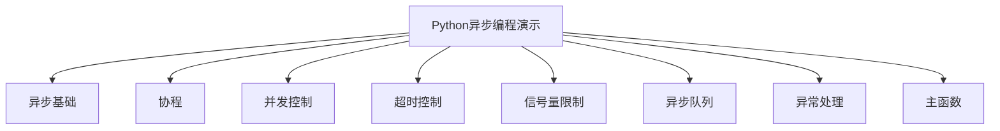

**Diagram sources **
- [async_programming.py](file://opendemo_output/python/async-programming/code/async_programming.py#L11-L205)

**Section sources**
- [async_programming.py](file://opendemo_output/python/async-programming/code/async_programming.py#L1-L205)

## 核心功能与实现

Python异步编程演示的核心功能是通过asyncio库实现的，展示了Python中异步编程的各种模式和最佳实践。演示代码通过一系列函数展示了异步编程的不同方面，每个函数都专注于一个特定的主题。

演示的主要功能包括：
- 异步基础：展示async/await语法的基本用法，比较顺序执行和并发执行的差异
- 协程：演示协程的定义和调用，以及任务的创建和管理
- 并发控制：展示asyncio.gather和asyncio.wait的使用，用于并发执行多个协程
- 超时控制：演示asyncio.wait_for和asyncio.timeout的使用，用于设置操作超时
- 信号量限制：展示如何使用asyncio.Semaphore限制并发数量
- 异步队列：演示asyncio.Queue的使用，实现生产者-消费者模式
- 异常处理：展示在异步环境中如何处理异常

这些功能通过一个主函数`main()`进行组织和调用，确保所有演示按顺序执行。

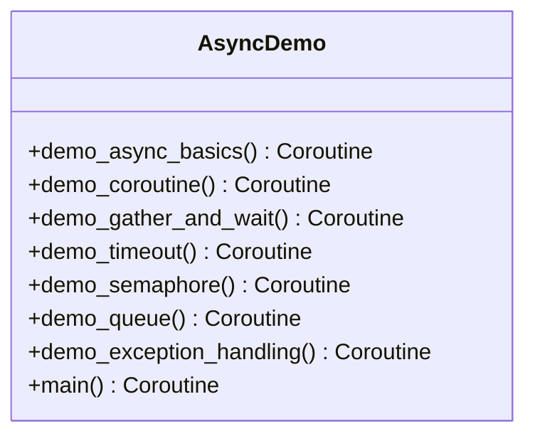

**Diagram sources **
- [async_programming.py](file://opendemo_output/python/async-programming/code/async_programming.py#L11-L205)

**Section sources**
- [async_programming.py](file://opendemo_output/python/async-programming/code/async_programming.py#L1-L205)

## 系统架构与组件

Open Demo CLI项目的系统架构采用分层设计，将不同的功能模块分离，提高了代码的可维护性和可扩展性。架构分为CLI层、业务逻辑层、服务层和数据层，每一层都有明确的职责。

CLI层负责处理用户输入和输出，使用Click框架实现命令行界面。业务逻辑层包含核心业务逻辑，如Demo管理、搜索、生成和验证。服务层提供各种服务，如AI服务、配置服务和存储服务。数据层负责与文件系统交互，管理Demo库和配置文件。

Python异步编程演示作为项目的一部分，位于数据层的Demo库中，通过业务逻辑层的Demo管理器进行访问和管理。

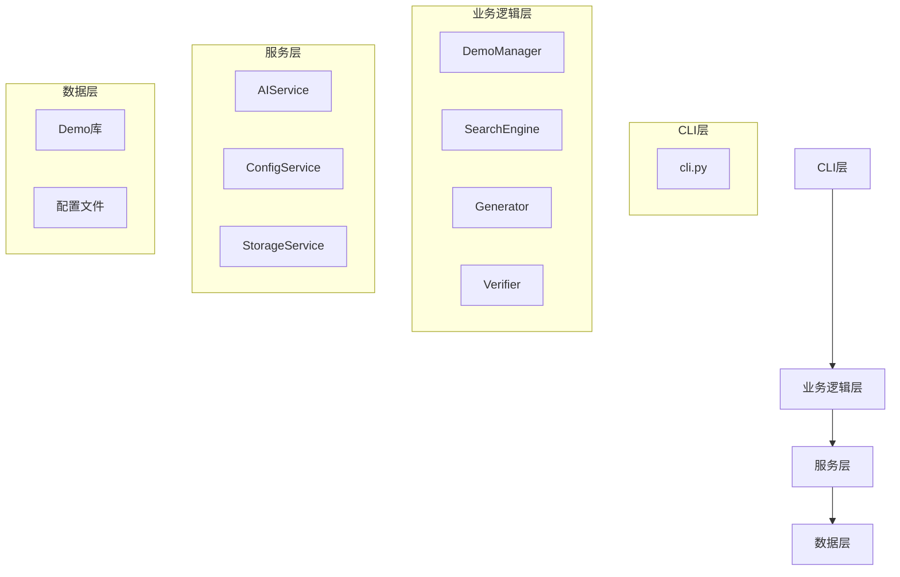

**Diagram sources **
- [cli.py](file://opendemo/cli.py#L7-L766)
- [config_service.py](file://opendemo/services/config_service.py#L1-L280)

**Section sources**
- [cli.py](file://opendemo/cli.py#L7-L766)
- [config_service.py](file://opendemo/services/config_service.py#L1-L280)

## 详细组件分析

### 异步基础分析

异步基础演示展示了async/await语法的基本用法，通过比较顺序执行和并发执行的差异来说明异步编程的优势。演示中定义了一个简单的`say_hello`协程，该协程使用`asyncio.sleep()`模拟异步操作。

在顺序执行中，每个协程依次执行，总耗时为所有协程耗时之和。而在并发执行中，使用`asyncio.gather()`同时启动所有协程，总耗时为最长协程的耗时。这种并发执行方式可以显著提高I/O密集型任务的效率。

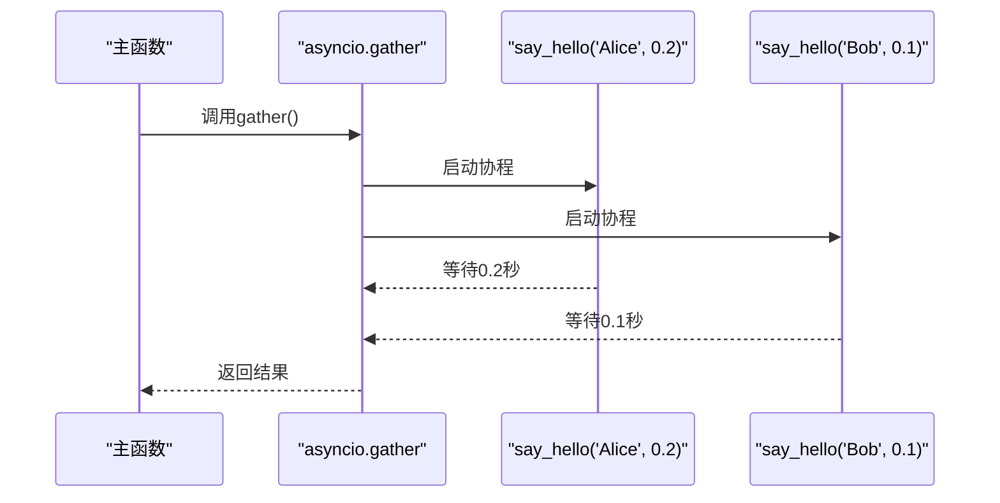

**Diagram sources **
- [async_programming.py](file://opendemo_output/python/async-programming/code/async_programming.py#L11-L35)

**Section sources**
- [async_programming.py](file://opendemo_output/python/async-programming/code/async_programming.py#L11-L35)

### 协程分析

协程演示展示了协程的定义和调用，以及任务的创建和管理。演示中定义了一个`fetch_data`协程，该协程模拟从URL获取数据的过程。通过直接await和创建任务两种方式调用协程，展示了不同的使用场景。

直接await方式会阻塞当前协程，直到被调用的协程完成。而创建任务方式可以立即返回任务对象，允许在任务完成前执行其他操作。这种方式提供了更好的并发控制能力。

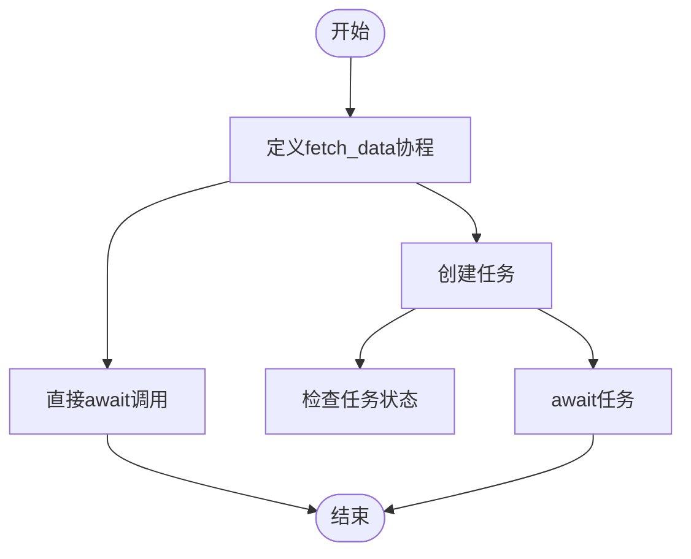

**Diagram sources **
- [async_programming.py](file://opendemo_output/python/async-programming/code/async_programming.py#L38-L57)

**Section sources**
- [async_programming.py](file://opendemo_output/python/async-programming/code/async_programming.py#L38-L57)

### 并发控制分析

并发控制演示展示了`asyncio.gather()`和`asyncio.wait()`的使用。`gather()`函数用于并发执行多个协程，并返回所有结果。它提供了一种简单的方式来并行执行多个异步操作。

`wait()`函数提供了更细粒度的控制，可以设置超时时间，并返回已完成和待完成的任务集合。这在需要对并发任务进行更复杂控制的场景中非常有用，例如实现超时机制或部分结果处理。

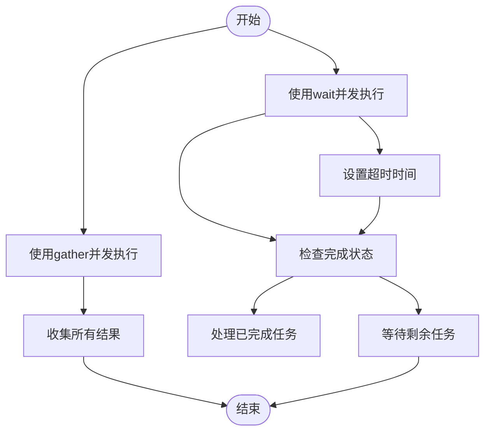

**Diagram sources **
- [async_programming.py](file://opendemo_output/python/async-programming/code/async_programming.py#L60-L92)

**Section sources**
- [async_programming.py](file://opendemo_output/python/async-programming/code/async_programming.py#L60-L92)

### 超时控制分析

超时控制演示展示了如何在异步编程中处理超时情况。使用`asyncio.wait_for()`函数可以为协程设置超时时间，如果协程在指定时间内未完成，将抛出`TimeoutError`异常。

此外，演示还展示了Python 3.11+引入的`asyncio.timeout()`上下文管理器，提供了一种更优雅的超时处理方式。这两种方法都可以有效防止异步操作无限期等待，提高程序的健壮性。

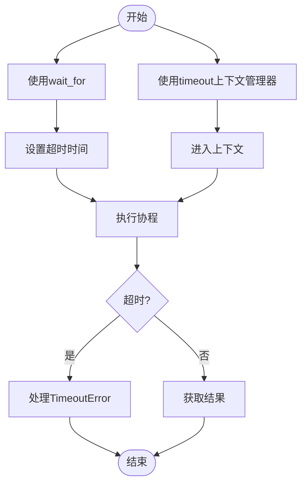

**Diagram sources **
- [async_programming.py](file://opendemo_output/python/async-programming/code/async_programming.py#L94-L118)

**Section sources**
- [async_programming.py](file://opendemo_output/python/async-programming/code/async_programming.py#L94-L118)

### 信号量限制分析

信号量限制演示展示了如何使用`asyncio.Semaphore`限制并发数量。在某些场景下，可能需要限制同时执行的协程数量，例如数据库连接池或API调用限制。

通过创建一个信号量对象并设置最大并发数，可以在协程中使用`async with`语句来获取和释放信号量。这种方式确保了在同一时间只有指定数量的协程可以执行，避免了资源过度使用。

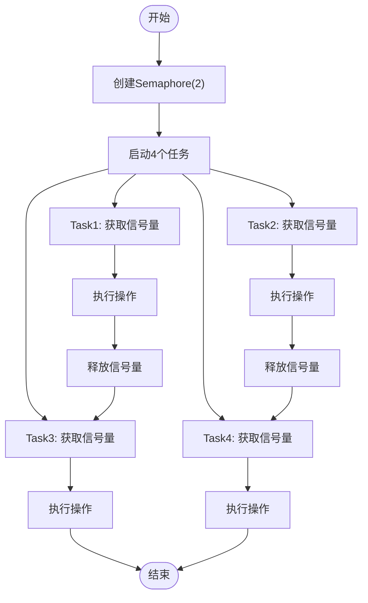

**Diagram sources **
- [async_programming.py](file://opendemo_output/python/async-programming/code/async_programming.py#L121-L136)

**Section sources**
- [async_programming.py](file://opendemo_output/python/async-programming/code/async_programming.py#L121-L136)

### 异步队列分析

异步队列演示展示了`asyncio.Queue`的使用，实现生产者-消费者模式。异步队列是协调多个协程之间数据交换的重要工具，特别适用于需要解耦生产者和消费者速度差异的场景。

演示中创建了一个生产者协程和一个消费者协程，生产者向队列中放入数据，消费者从队列中取出数据。通过`queue.put()`和`queue.get()`方法实现异步的数据交换，`q.task_done()`方法用于通知队列任务已完成。

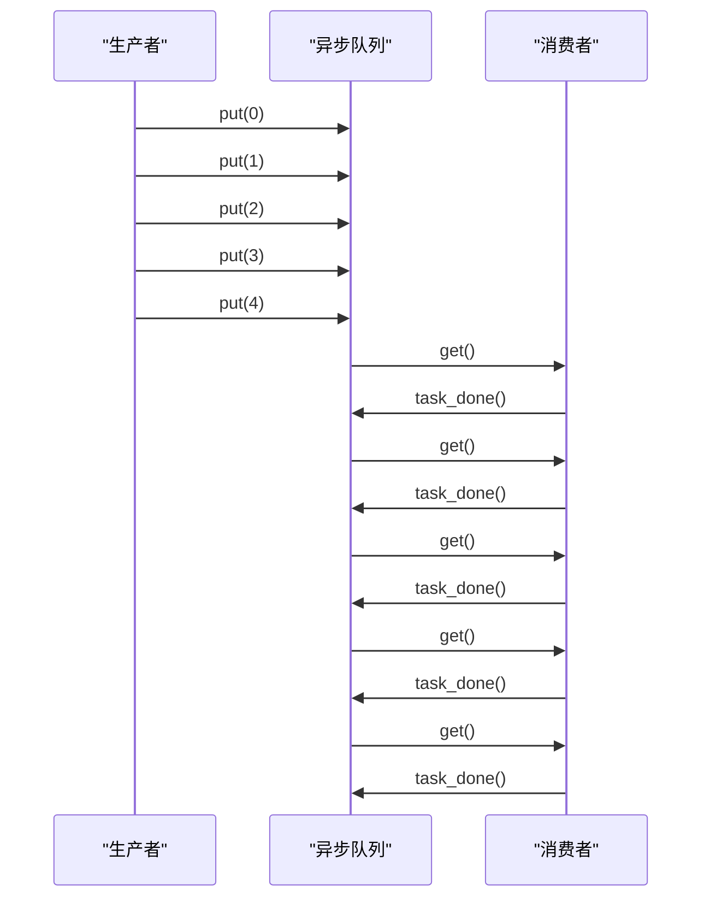

**Diagram sources **
- [async_programming.py](file://opendemo_output/python/async-programming/code/async_programming.py#L139-L162)

**Section sources**
- [async_programming.py](file://opendemo_output/python/async-programming/code/async_programming.py#L139-L162)

### 异常处理分析

异常处理演示展示了在异步编程中如何处理异常。在并发执行多个协程时，如果其中一个协程抛出异常，需要有适当的机制来捕获和处理这些异常。

演示中使用`asyncio.gather()`的`return_exceptions=True`参数，使得即使某些协程抛出异常，其他协程的结果仍然可以获取。通过检查结果列表中的每个元素是否为异常实例，可以分别处理成功的结果和异常情况。

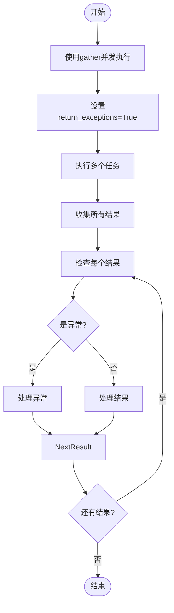

**Diagram sources **
- [async_programming.py](file://opendemo_output/python/async-programming/code/async_programming.py#L165-L188)

**Section sources**
- [async_programming.py](file://opendemo_output/python/async-programming/code/async_programming.py#L165-L188)

## 依赖关系分析

Python异步编程演示的依赖关系相对简单，主要依赖于Python标准库中的asyncio和time模块。asyncio模块提供了异步编程所需的所有核心功能，包括事件循环、协程、任务、队列等。time模块用于测量执行时间，展示并发执行的性能优势。

在项目层面，Python异步编程演示作为Open Demo CLI项目的一部分，依赖于项目的CLI、配置、搜索和生成等核心组件。这些组件共同构成了一个完整的Demo管理系统，使得用户可以方便地获取和管理各种编程示例。

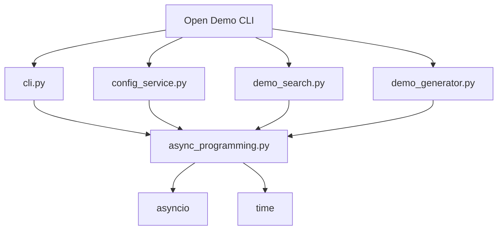

**Diagram sources **
- [async_programming.py](file://opendemo_output/python/async-programming/code/async_programming.py#L7-L8)
- [cli.py](file://opendemo/cli.py#L7-L766)
- [config_service.py](file://opendemo/services/config_service.py#L7-L280)
- [demo_search.py](file://opendemo/core/demo_search.py#L8-L381)
- [demo_generator.py](file://opendemo/core/demo_generator.py#L6-L137)

**Section sources**
- [async_programming.py](file://opendemo_output/python/async-programming/code/async_programming.py#L7-L8)
- [cli.py](file://opendemo/cli.py#L7-L766)
- [config_service.py](file://opendemo/services/config_service.py#L7-L280)
- [demo_search.py](file://opendemo/core/demo_search.py#L8-L381)
- [demo_generator.py](file://opendemo/core/demo_generator.py#L6-L137)

## 性能与验证

Python异步编程演示通过对比顺序执行和并发执行的耗时，直观地展示了异步编程的性能优势。在I/O密集型任务中，异步编程可以显著提高程序的执行效率，因为它允许在等待I/O操作完成的同时执行其他任务。

Open Demo CLI项目还提供了可选的自动验证功能，可以验证生成的代码是否可执行。验证过程包括环境检查、依赖管理、编译检查和运行验证等步骤，确保生成的Demo代码质量。

对于Python Demo，验证过程包括：
1. 检查Python环境
2. 安装依赖（如果有requirements.txt）
3. 运行Python脚本

这种验证机制确保了用户获取的Demo代码不仅语法正确，而且可以实际运行。

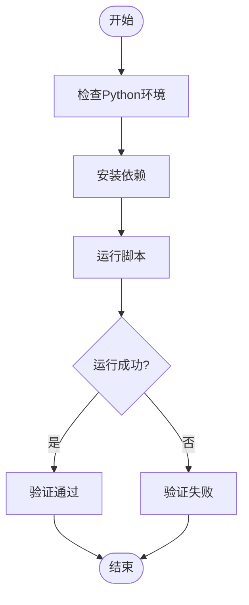

**Diagram sources **
- [cli.py](file://opendemo/cli.py#L696-L712)

**Section sources**
- [cli.py](file://opendemo/cli.py#L696-L712)

## 使用指南

要使用Python异步编程演示，可以通过Open Demo CLI工具获取：

```bash
opendemo get python async-programming
```

获取后，进入演示目录并运行：

```bash
cd opendemo_output/python/async-programming
python code/async_programming.py
```

用户也可以通过以下命令搜索相关的Python异步编程Demo：

```bash
opendemo search python async
```

如果需要创建新的异步编程Demo，可以使用：

```bash
opendemo new python 异步编程 --difficulty beginner
```

这些命令将帮助用户快速获取和使用Python异步编程的相关示例。

**Section sources**
- [README.md](file://README.md#L39-L72)
- [ABOUT.md](file://ABOUT.md#L80-L97)

## 结论

Python异步编程演示提供了一个全面而实用的异步编程学习资源，涵盖了asyncio库的核心功能和最佳实践。通过具体的代码示例，演示了异步基础、协程、并发控制、超时处理、信号量限制、异步队列和异常处理等关键概念。

Open Demo CLI项目为这类编程示例的管理和分发提供了一个高效的平台，使得开发者可以轻松获取高质量的代码示例。项目的模块化设计和清晰的架构使得扩展和维护变得简单，为未来的功能添加提供了良好的基础。

总的来说，Python异步编程演示不仅是一个学习资源，也是Open Demo CLI项目能力的一个展示，体现了现代编程工具在提高开发效率和促进知识共享方面的价值。