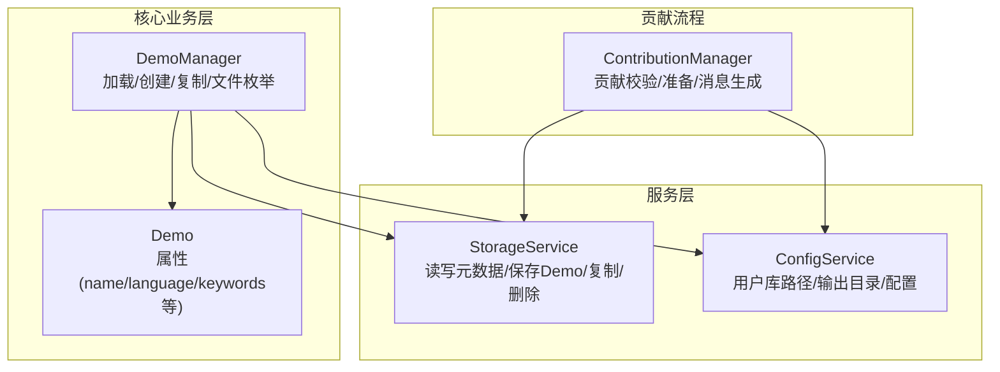
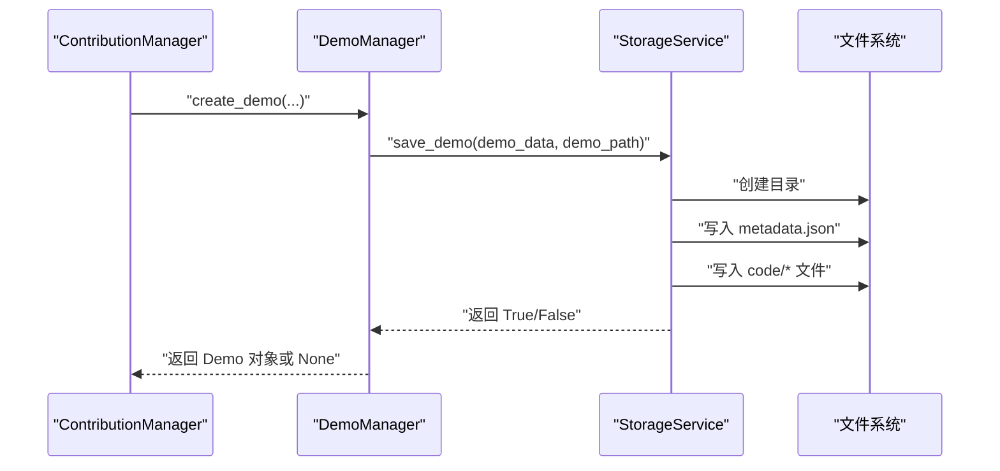
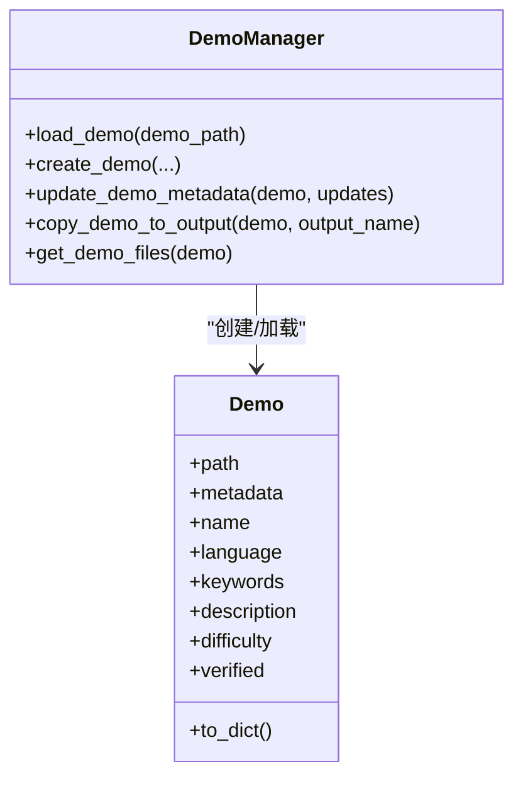
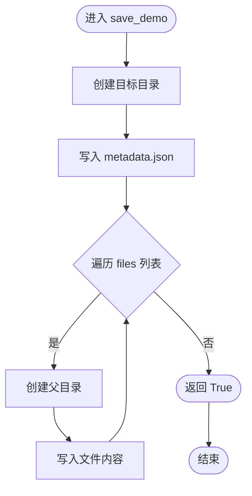
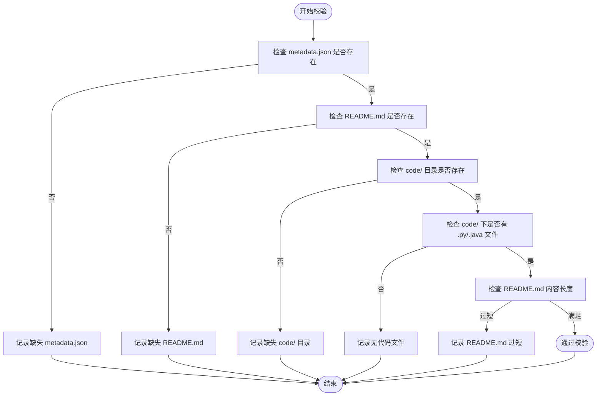
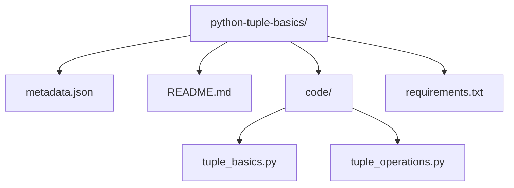
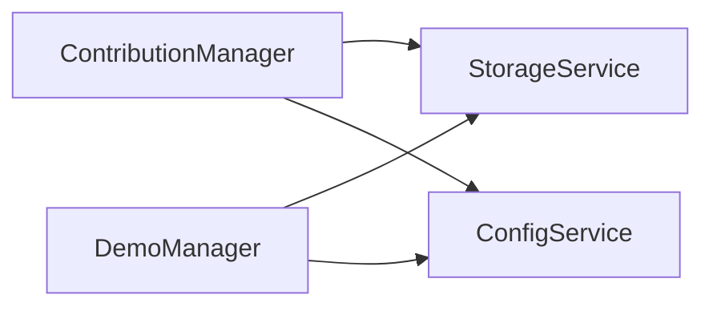

# 单个Demo结构标准

<cite>
**本文引用的文件**
- [opendemo/core/demo_manager.py](file://opendemo/core/demo_manager.py)
- [opendemo/services/storage_service.py](file://opendemo/services/storage_service.py)
- [opendemo/core/contribution.py](file://opendemo/core/contribution.py)
- [opendemo/services/config_service.py](file://opendemo/services/config_service.py)
- [opendemo/builtin_demos/python/python-tuple-basics/metadata.json](file://opendemo/builtin_demos/python/python-tuple-basics/metadata.json)
- [opendemo/builtin_demos/python/python-tuple-basics/README.md](file://opendemo/builtin_demos/python/python-tuple-basics/README.md)
- [opendemo/builtin_demos/python/python-tuple-basics/requirements.txt](file://opendemo/builtin_demos/python/python-tuple-basics/requirements.txt)
- [opendemo/builtin_demos/python/python-tuple-basics/code/tuple_basics.py](file://opendemo/builtin_demos/python/python-tuple-basics/code/tuple_basics.py)
- [opendemo/builtin_demos/python/python-tuple-basics/code/tuple_operations.py](file://opendemo/builtin_demos/python/python-tuple-basics/code/tuple_operations.py)
- [README.md](file://README.md)
</cite>

## 目录
1. [简介](#简介)
2. [项目结构](#项目结构)
3. [核心组件](#核心组件)
4. [架构总览](#架构总览)
5. [详细组件分析](#详细组件分析)
6. [依赖关系分析](#依赖关系分析)
7. [性能考量](#性能考量)
8. [故障排查指南](#故障排查指南)
9. [结论](#结论)
10. [附录](#附录)

## 简介
本文件面向新贡献者，提供“单个Demo”的标准化结构文档。围绕一个合规Demo必须包含的四个核心部分：metadata.json、code/目录、requirements.txt、README.md，结合Demo类的属性定义与存储服务的文件持久化流程，给出清晰的目录结构、字段含义、文件职责与最佳实践。同时以 python-tuple-basics 为例，展示实际目录结构与各文件的作用，并提供创建Demo的模板与验证清单。

## 项目结构
OpenDemo CLI 的 Demo 结构由“核心业务层”和“服务层”共同支撑：
- 核心业务层：Demo 类与 DemoManager 负责 Demo 的属性封装、加载、创建、复制与文件枚举。
- 服务层：StorageService 负责文件系统操作、Demo 库扫描、元数据读写、文件保存与复制。
- 贡献流程：ContributionManager 负责贡献前的校验与准备，确保 Demo 符合最低要求。
- 配置服务：ConfigService 提供用户库路径、输出目录等配置项，影响 Demo 的保存位置与行为。

图表来源
- [opendemo/core/demo_manager.py](file://opendemo/core/demo_manager.py#L16-L328)
- [opendemo/services/storage_service.py](file://opendemo/services/storage_service.py#L16-L277)
- [opendemo/core/contribution.py](file://opendemo/core/contribution.py#L14-L176)
- [opendemo/services/config_service.py](file://opendemo/services/config_service.py#L16-L280)

章节来源
- [README.md](file://README.md#L102-L110)

## 核心组件
- Demo 类：封装 Demo 的元数据属性（name、language、keywords、description、difficulty、verified 等），并提供 to_dict 导出能力。
- DemoManager：负责加载 Demo、创建 Demo、复制 Demo 到输出目录、列举 Demo 文件等。
- StorageService：负责 Demo 库扫描、元数据读取、Demo 保存（含 metadata.json 与 code/ 文件）、复制与删除。
- ContributionManager：对 Demo 进行贡献前校验，确保包含 metadata.json、README.md、code/ 目录及至少一个代码文件。
- ConfigService：提供用户库路径与输出目录等配置，影响 Demo 的保存位置。

章节来源
- [opendemo/core/demo_manager.py](file://opendemo/core/demo_manager.py#L16-L328)
- [opendemo/services/storage_service.py](file://opendemo/services/storage_service.py#L16-L277)
- [opendemo/core/contribution.py](file://opendemo/core/contribution.py#L14-L176)
- [opendemo/services/config_service.py](file://opendemo/services/config_service.py#L16-L280)

## 架构总览
下面的序列图展示了“创建并保存 Demo”的典型流程，体现 DemoManager 与 StorageService 的协作，以及 metadata.json 的写入时机。

图表来源
- [opendemo/core/demo_manager.py](file://opendemo/core/demo_manager.py#L132-L201)
- [opendemo/services/storage_service.py](file://opendemo/services/storage_service.py#L130-L166)

## 详细组件分析

### Demo 类与属性定义
Demo 类通过 metadata 字典暴露以下属性，这些属性在 DemoManager 中被广泛使用：
- name：Demo 名称，默认回退为路径名
- language：编程语言
- keywords：关键字列表
- description：描述
- difficulty：难度级别
- verified：是否已验证

图表来源
- [opendemo/core/demo_manager.py](file://opendemo/core/demo_manager.py#L16-L120)
- [opendemo/core/demo_manager.py](file://opendemo/core/demo_manager.py#L132-L201)

章节来源
- [opendemo/core/demo_manager.py](file://opendemo/core/demo_manager.py#L16-L120)
- [opendemo/core/demo_manager.py](file://opendemo/core/demo_manager.py#L132-L201)

### 文件持久化流程（StorageService.save_demo）
StorageService.save_demo 是 Demo 写盘的核心方法，其职责包括：
- 创建目标目录
- 写入 metadata.json
- 遍历 files 列表，按相对路径写入 code/ 及其他文件
- 记录日志并返回布尔结果

图表来源
- [opendemo/services/storage_service.py](file://opendemo/services/storage_service.py#L130-L166)

章节来源
- [opendemo/services/storage_service.py](file://opendemo/services/storage_service.py#L130-L166)

### 贡献前校验（ContributionManager.validate_demo）
ContributionManager.validate_demo 保证 Demo 至少包含以下内容：
- metadata.json
- README.md
- code/ 目录
- code/ 下至少有一个 .py 或 .java 源文件
- README.md 内容长度不小于阈值（避免过短）

图表来源
- [opendemo/core/contribution.py](file://opendemo/core/contribution.py#L48-L83)

章节来源
- [opendemo/core/contribution.py](file://opendemo/core/contribution.py#L48-L83)

### 示例：python-tuple-basics 的目录结构与职责
以 python-tuple-basics 为例，展示一个合规 Demo 的实际目录结构与各文件职责：
- metadata.json：定义 Demo 的元数据（名称、语言、关键字、难度、作者、版本、依赖、验证状态等）
- README.md：提供实操指南、学习目标、环境要求、文件说明、逐步实操、代码解析、常见问题与扩展学习
- code/：存放源码文件（例如 tuple_basics.py、tuple_operations.py）
- requirements.txt：声明依赖（若无依赖可为空注释）

图表来源
- [opendemo/builtin_demos/python/python-tuple-basics/metadata.json](file://opendemo/builtin_demos/python/python-tuple-basics/metadata.json#L1-L14)
- [opendemo/builtin_demos/python/python-tuple-basics/README.md](file://opendemo/builtin_demos/python/python-tuple-basics/README.md#L1-L89)
- [opendemo/builtin_demos/python/python-tuple-basics/requirements.txt](file://opendemo/builtin_demos/python/python-tuple-basics/requirements.txt#L1-L2)
- [opendemo/builtin_demos/python/python-tuple-basics/code/tuple_basics.py](file://opendemo/builtin_demos/python/python-tuple-basics/code/tuple_basics.py#L1-L87)
- [opendemo/builtin_demos/python/python-tuple-basics/code/tuple_operations.py](file://opendemo/builtin_demos/python/python-tuple-basics/code/tuple_operations.py#L1-L111)

章节来源
- [opendemo/builtin_demos/python/python-tuple-basics/metadata.json](file://opendemo/builtin_demos/python/python-tuple-basics/metadata.json#L1-L14)
- [opendemo/builtin_demos/python/python-tuple-basics/README.md](file://opendemo/builtin_demos/python/python-tuple-basics/README.md#L1-L89)
- [opendemo/builtin_demos/python/python-tuple-basics/requirements.txt](file://opendemo/builtin_demos/python/python-tuple-basics/requirements.txt#L1-L2)
- [opendemo/builtin_demos/python/python-tuple-basics/code/tuple_basics.py](file://opendemo/builtin_demos/python/python-tuple-basics/code/tuple_basics.py#L1-L87)
- [opendemo/builtin_demos/python/python-tuple-basics/code/tuple_operations.py](file://opendemo/builtin_demos/python/python-tuple-basics/code/tuple_operations.py#L1-L111)

## 依赖关系分析
- DemoManager 依赖 StorageService 进行元数据读取与 Demo 保存/复制。
- ContributionManager 依赖 StorageService 读取 README.md 内容并进行校验。
- ConfigService 提供用户库路径与输出目录，影响 Demo 的保存位置与输出目录。

图表来源
- [opendemo/core/contribution.py](file://opendemo/core/contribution.py#L14-L176)
- [opendemo/core/demo_manager.py](file://opendemo/core/demo_manager.py#L74-L120)
- [opendemo/services/config_service.py](file://opendemo/services/config_service.py#L16-L120)

章节来源
- [opendemo/core/contribution.py](file://opendemo/core/contribution.py#L14-L176)
- [opendemo/core/demo_manager.py](file://opendemo/core/demo_manager.py#L74-L120)
- [opendemo/services/config_service.py](file://opendemo/services/config_service.py#L16-L120)

## 性能考量
- 目录扫描：StorageService 在 list_demos 时会递归扫描内置与用户库，建议控制 Demo 数量与层级深度，避免深层嵌套导致扫描开销增大。
- 缓存策略：DemoManager 内部维护了 Demo 对象缓存，减少重复加载带来的 IO 开销。
- 文件写入：save_demo 采用逐文件写入，建议批量创建时尽量减少多次 IO 操作，可在上层聚合后再一次性写入。

[本节为通用指导，不直接分析具体文件]

## 故障排查指南
- 元数据缺失：若缺少 metadata.json，DemoManager.load_demo 会返回 None；StorageService.load_demo_metadata 会记录警告并返回 None。
- README.md 过短：ContributionManager.validate_demo 会对 README.md 内容长度进行校验，过短会被标记为错误。
- 无代码文件：ContributionManager.validate_demo 会检查 code/ 目录是否存在且至少包含一个 .py 或 .java 文件。
- 保存失败：StorageService.save_demo 在写入过程中抛出异常会记录错误并返回 False；检查磁盘权限与路径合法性。
- 复制/删除失败：StorageService.copy_demo 与 delete_demo 在异常情况下会记录错误并返回 False；确认源路径存在且目标路径可写。

章节来源
- [opendemo/services/storage_service.py](file://opendemo/services/storage_service.py#L106-L129)
- [opendemo/core/contribution.py](file://opendemo/core/contribution.py#L48-L83)
- [opendemo/core/demo_manager.py](file://opendemo/core/demo_manager.py#L87-L110)
- [opendemo/services/storage_service.py](file://opendemo/services/storage_service.py#L167-L212)

## 结论
一个合规的 Demo 必须包含 metadata.json、README.md、code/ 目录与 requirements.txt（或对应语言的依赖声明文件）。DemoManager 与 StorageService 共同保障 Demo 的加载、创建与持久化；ContributionManager 则提供贡献前的最小化校验。遵循本文提供的结构与最佳实践，有助于新贡献者快速创建高质量 Demo，并提升整体可维护性与一致性。

[本节为总结性内容，不直接分析具体文件]

## 附录

### 一、Demo 四要素与职责
- metadata.json：定义 Demo 的元数据（名称、语言、关键字、难度、作者、版本、依赖、验证状态等），用于检索、展示与管理。
- README.md：提供实操指南、学习目标、环境要求、文件说明、逐步实操、代码解析、常见问题与扩展学习。
- code/：存放源码文件，建议按功能拆分多个文件，便于阅读与维护。
- requirements.txt：声明依赖（Python）；若无依赖可为空注释；其他语言可用对应依赖声明文件（如 pom.xml、build.gradle）。

章节来源
- [opendemo/builtin_demos/python/python-tuple-basics/metadata.json](file://opendemo/builtin_demos/python/python-tuple-basics/metadata.json#L1-L14)
- [opendemo/builtin_demos/python/python-tuple-basics/README.md](file://opendemo/builtin_demos/python/python-tuple-basics/README.md#L1-L89)
- [opendemo/builtin_demos/python/python-tuple-basics/requirements.txt](file://opendemo/builtin_demos/python/python-tuple-basics/requirements.txt#L1-L2)
- [opendemo/builtin_demos/python/python-tuple-basics/code/tuple_basics.py](file://opendemo/builtin_demos/python/python-tuple-basics/code/tuple_basics.py#L1-L87)
- [opendemo/builtin_demos/python/python-tuple-basics/code/tuple_operations.py](file://opendemo/builtin_demos/python/python-tuple-basics/code/tuple_operations.py#L1-L111)

### 二、metadata.json 字段含义与作用
- name：Demo 名称，通常与目录名一致或与语言组合形成唯一标识
- language：编程语言，决定 Demo 的分类与输出目录语言子目录
- keywords：关键字列表，用于搜索与标签
- description：简要描述，便于用户快速了解 Demo 主题
- difficulty：难度级别（如 beginner），用于筛选与推荐
- author：作者信息，便于溯源与致谢
- created_at/updated_at：时间戳，用于版本管理与排序
- version：版本号，便于演进追踪
- dependencies：依赖声明，用于自动安装或提示
- verified：是否已验证，用于质量标识

章节来源
- [opendemo/core/demo_manager.py](file://opendemo/core/demo_manager.py#L16-L72)
- [opendemo/builtin_demos/python/python-tuple-basics/metadata.json](file://opendemo/builtin_demos/python/python-tuple-basics/metadata.json#L1-L14)

### 三、文件组织最佳实践
- 目录命名：建议使用“语言-名称”的形式，名称仅包含字母数字与连字符，避免空格与特殊字符
- README.md：结构清晰、步骤完整、示例可运行、包含常见问题与扩展学习
- code/：按功能拆分文件，避免单文件过大；保持单一职责
- requirements.txt：仅声明必要依赖；若无依赖可保留注释占位
- tests/：可选，建议提供最小可运行测试

章节来源
- [opendemo/core/demo_manager.py](file://opendemo/core/demo_manager.py#L202-L218)
- [opendemo/core/contribution.py](file://opendemo/core/contribution.py#L48-L83)
- [README.md](file://README.md#L102-L110)

### 四、创建 Demo 的模板与验证清单
- 模板路径建议
  - 用户库：用户库根目录/语言/目录名
  - 输出目录：输出目录/语言/目录名
- 必填项清单
  - metadata.json：必须存在
  - README.md：必须存在，内容长度不短于阈值
  - code/：必须存在，至少包含一个 .py 或 .java 源文件
  - requirements.txt：可选，无依赖可为空注释
- 验证清单（贡献前）
  - [ ] 包含 metadata.json
  - [ ] 包含 README.md
  - [ ] 包含 code/ 目录
  - [ ] code/ 下至少有一个 .py/.java 源文件
  - [ ] README.md 内容长度合理
  - [ ] 代码可运行且无明显错误

章节来源
- [opendemo/core/contribution.py](file://opendemo/core/contribution.py#L48-L83)
- [opendemo/services/config_service.py](file://opendemo/services/config_service.py#L16-L120)
- [opendemo/core/demo_manager.py](file://opendemo/core/demo_manager.py#L162-L178)