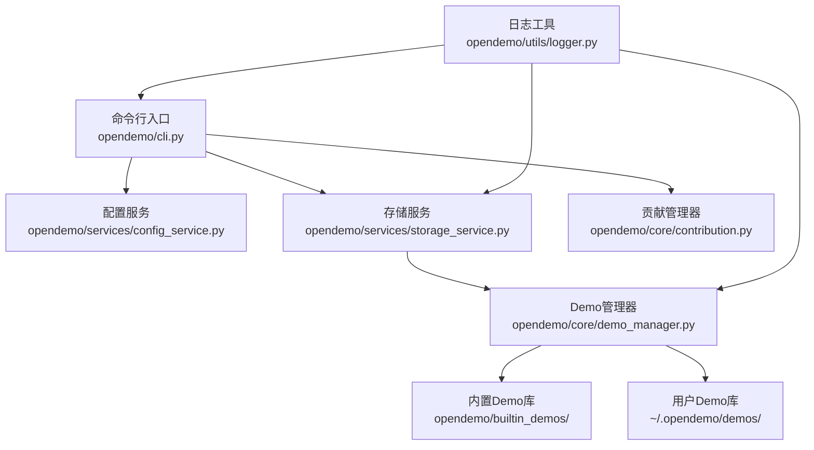
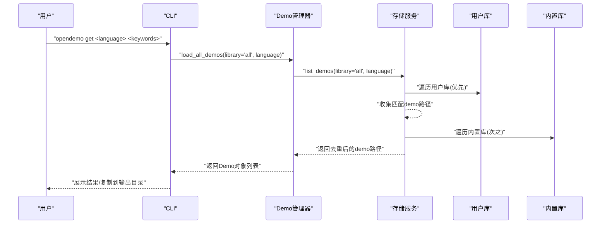
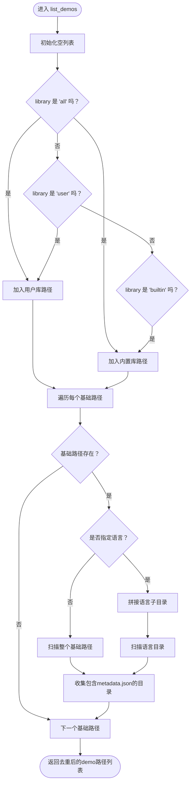
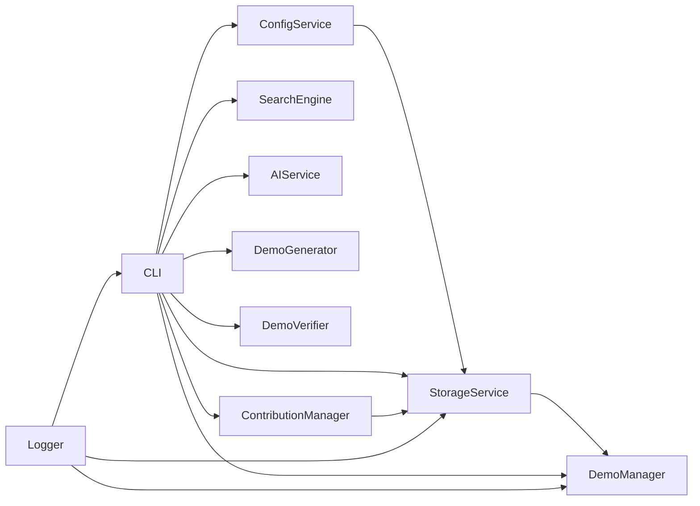

# 双层Demo库架构

<cite>
**本文引用的文件**
- [README.md](file://README.md)
- [opendemo/services/storage_service.py](file://opendemo/services/storage_service.py)
- [opendemo/services/config_service.py](file://opendemo/services/config_service.py)
- [opendemo/core/demo_manager.py](file://opendemo/core/demo_manager.py)
- [opendemo/cli.py](file://opendemo/cli.py)
- [opendemo/core/contribution.py](file://opendemo/core/contribution.py)
- [opendemo/utils/logger.py](file://opendemo/utils/logger.py)
- [opendemo/builtin_demos/python/python-tuple-basics/metadata.json](file://opendemo/builtin_demos/python/python-tuple-basics/metadata.json)
- [opendemo/builtin_demos/python/python-tuple-basics/README.md](file://opendemo/builtin_demos/python/python-tuple-basics/README.md)
- [ABOUT.md](file://ABOUT.md)
</cite>

## 目录
1. [简介](#简介)
2. [项目结构](#项目结构)
3. [核心组件](#核心组件)
4. [架构总览](#架构总览)
5. [组件详解](#组件详解)
6. [依赖关系分析](#依赖关系分析)
7. [性能与可靠性](#性能与可靠性)
8. [故障排查指南](#故障排查指南)
9. [结论](#结论)
10. [附录](#附录)

## 简介
本文件围绕“双层Demo库架构”展开，系统阐述内置Demo库（只读）与用户Demo库（可写）的设计理念与实现机制。重点解释：
- StorageService类如何通过builtin_library_path与user_library_path属性管理两套独立的库路径；
- list_demos方法中实现的优先级查找逻辑（用户库优先于内置库）；
- 配置服务如何通过'user_demo_library'配置项动态指定用户库位置；
- 分层设计的优势：既保证内置Demo的稳定性，又支持用户自定义扩展；
- 为初学者提供架构图示与查找流程说明，为开发者提供路径解析、权限控制与扩展建议等技术细节。

## 项目结构
Open Demo CLI采用清晰的分层组织：
- 顶层命令行入口与业务流程：opendemo/cli.py
- 服务层：配置服务、存储服务
- 核心业务：Demo管理、搜索、生成、验证、贡献
- 工具与日志：统一日志工具
- 内置Demo库：opendemo/builtin_demos

图表来源
- [opendemo/cli.py](file://opendemo/cli.py#L1-L120)
- [opendemo/services/config_service.py](file://opendemo/services/config_service.py#L1-L120)
- [opendemo/services/storage_service.py](file://opendemo/services/storage_service.py#L1-L120)
- [opendemo/core/demo_manager.py](file://opendemo/core/demo_manager.py#L1-L120)
- [opendemo/core/contribution.py](file://opendemo/core/contribution.py#L1-L60)
- [opendemo/utils/logger.py](file://opendemo/utils/logger.py#L1-L65)

章节来源
- [README.md](file://README.md#L60-L110)

## 核心组件
- 配置服务(ConfigService)：负责加载、合并与管理全局与项目级配置；默认将user_demo_library指向用户目录下的demos子目录；支持读取与设置配置项。
- 存储服务(StorageService)：封装文件系统操作，管理内置库与用户库路径；提供demo列表、元数据读取、保存、复制、删除等能力；list_demos按优先级组合用户库与内置库。
- Demo管理器(DemoManager)：基于StorageService加载与管理Demo对象；提供创建、复制到输出目录、更新元数据、枚举文件等功能。
- CLI：命令行入口，协调各服务完成获取、搜索、新建、配置等流程。
- 贡献管理器(ContributionManager)：协助将本地生成的Demo复制到用户库，便于后续贡献。

章节来源
- [opendemo/services/config_service.py](file://opendemo/services/config_service.py#L1-L120)
- [opendemo/services/storage_service.py](file://opendemo/services/storage_service.py#L1-L120)
- [opendemo/core/demo_manager.py](file://opendemo/core/demo_manager.py#L1-L120)
- [opendemo/cli.py](file://opendemo/cli.py#L1-L120)
- [opendemo/core/contribution.py](file://opendemo/core/contribution.py#L1-L60)

## 架构总览
双层Demo库的核心思想是“隔离与优先级”：
- 内置库（只读）：随包分发，稳定可靠，作为默认参考与基线；
- 用户库（可写）：由用户维护，支持新增、修改、删除，优先级高于内置库；
- 查找策略：当用户请求某主题Demo时，优先在用户库中查找，若未命中再回退到内置库；若仍未命中，则通过AI生成。

图表来源
- [opendemo/cli.py](file://opendemo/cli.py#L200-L324)
- [opendemo/core/demo_manager.py](file://opendemo/core/demo_manager.py#L111-L130)
- [opendemo/services/storage_service.py](file://opendemo/services/storage_service.py#L49-L82)

## 组件详解

### 存储服务：双库路径与优先级查找
- builtin_library_path：通过包路径定位内置库根目录，避免硬编码，提升可移植性。
- user_library_path：从配置服务读取user_demo_library，若为空则默认指向用户目录下的demos；同时确保目录存在。
- list_demos(library, language)：
  - 当library为'all'时，先扫描用户库，再扫描内置库，形成“用户优先”的结果集；
  - 当library为'user'或'builtin'时，仅扫描对应库；
  - language参数可限定语言目录，提高检索效率；
  - 内部通过递归遍历，以是否存在metadata.json作为判断Demo目录的标准。

图表来源
- [opendemo/services/storage_service.py](file://opendemo/services/storage_service.py#L49-L104)

章节来源
- [opendemo/services/storage_service.py](file://opendemo/services/storage_service.py#L30-L82)

### 配置服务：user_demo_library的动态解析
- 默认配置DEFAULT_CONFIG中包含user_demo_library项；
- 初始化时若为空，将其设置为用户主目录下的.demos；
- 支持全局配置(~/.opendemo/config.yaml)与项目配置(.opendemo.yaml)合并，后者优先级更高；
- get(key)支持点分隔嵌套键，便于读取复杂配置；
- set(key, value, global_scope)支持将配置写入全局或项目配置文件。

章节来源
- [opendemo/services/config_service.py](file://opendemo/services/config_service.py#L1-L120)
- [opendemo/services/config_service.py](file://opendemo/services/config_service.py#L147-L203)
- [ABOUT.md](file://ABOUT.md#L267-L292)

### Demo管理器：加载、创建与复制
- load_demo：基于StorageService.load_demo_metadata加载元数据，构造Demo对象并缓存；
- load_all_demos：委托StorageService.list_demos，再逐个加载Demo；
- create_demo：根据save_to_user_library决定保存到用户库还是输出目录；生成metadata与文件集合；
- copy_demo_to_output：将Demo复制到输出目录，便于直接运行与验证；
- get_demo_files：枚举Demo内文件，忽略隐藏文件与缓存目录，提供友好描述。

章节来源
- [opendemo/core/demo_manager.py](file://opendemo/core/demo_manager.py#L74-L201)
- [opendemo/core/demo_manager.py](file://opendemo/core/demo_manager.py#L252-L328)

### CLI工作流：获取与搜索
- get命令：优先在输出目录匹配，其次在内置/用户库搜索，最后通过AI生成；
- search命令：扫描输出目录并按关键字过滤，支持列出所有语言的Demo数量；
- new命令：通过AI生成Demo，默认保存到输出目录，可选择贡献至用户库；
- config命令：初始化、设置、获取与列出配置项。

章节来源
- [opendemo/cli.py](file://opendemo/cli.py#L196-L324)
- [opendemo/cli.py](file://opendemo/cli.py#L326-L471)
- [opendemo/cli.py](file://opendemo/cli.py#L473-L592)

### 贡献管理器：用户库写入与验证
- prompt_contribution：询问用户是否贡献；
- validate_demo：校验必需文件与内容长度；
- copy_to_user_library：将Demo复制到用户库对应语言目录；
- generate_contribution_message：生成贡献模板信息。

章节来源
- [opendemo/core/contribution.py](file://opendemo/core/contribution.py#L1-L176)

### 内置Demo样例
- python-tuple-basics：包含metadata.json与README.md，演示标准Demo结构。

章节来源
- [opendemo/builtin_demos/python/python-tuple-basics/metadata.json](file://opendemo/builtin_demos/python/python-tuple-basics/metadata.json#L1-L14)
- [opendemo/builtin_demos/python/python-tuple-basics/README.md](file://opendemo/builtin_demos/python/python-tuple-basics/README.md#L1-L89)

## 依赖关系分析
- StorageService依赖ConfigService获取user_demo_library，依赖Logger记录日志；
- DemoManager依赖StorageService进行文件系统操作与Demo加载；
- CLI依赖ConfigService、StorageService、DemoManager、SearchEngine、AIService、DemoGenerator、DemoVerifier、ContributionManager；
- ContributionManager依赖ConfigService与StorageService；
- Logger被多个模块共享。

图表来源
- [opendemo/services/config_service.py](file://opendemo/services/config_service.py#L1-L120)
- [opendemo/services/storage_service.py](file://opendemo/services/storage_service.py#L1-L120)
- [opendemo/core/demo_manager.py](file://opendemo/core/demo_manager.py#L1-L120)
- [opendemo/cli.py](file://opendemo/cli.py#L1-L120)
- [opendemo/core/contribution.py](file://opendemo/core/contribution.py#L1-L60)
- [opendemo/utils/logger.py](file://opendemo/utils/logger.py#L1-L65)

## 性能与可靠性
- 路径解析与缓存
  - StorageService对builtin_library_path与user_library_path采用惰性初始化并缓存，避免重复计算。
  - DemoManager对已加载的Demo对象进行缓存，减少重复读取元数据的开销。
- 查找策略优化
  - list_demos先扫描用户库再扫描内置库，满足“用户优先”的需求；同时通过language参数缩小搜索范围。
  - _find_demos_in_path使用递归遍历并以metadata.json作为判定条件，确保准确性。
- I/O与异常处理
  - 所有文件读写均捕获异常并记录日志，避免中断；必要时返回None或False，便于上层决策。
- 输出目录与权限
  - get_output_directory确保输出目录存在；user_library_path与内置库路径均在首次访问时创建目录，降低权限问题风险。

章节来源
- [opendemo/services/storage_service.py](file://opendemo/services/storage_service.py#L30-L47)
- [opendemo/core/demo_manager.py](file://opendemo/core/demo_manager.py#L87-L110)
- [opendemo/services/storage_service.py](file://opendemo/services/storage_service.py#L213-L222)

## 故障排查指南
- 配置项缺失
  - user_demo_library未设置：检查全局配置与项目配置合并结果；可通过config命令设置。
  - output_directory无效：确认路径可写且存在；必要时手动创建。
- 权限问题
  - 用户库或输出目录无写权限：修正目录权限或更换路径；确保StorageService.ensure_directory与mkdir调用成功。
- Demo未被识别
  - 缺少metadata.json：确保每个Demo目录包含该文件；否则不会被list_demos识别。
  - 语言目录不匹配：确认language参数与Demo实际语言一致。
- 日志定位
  - 使用日志工具记录错误与警告；查看~/.opendemo/logs/opendemo.log获取详细堆栈。

章节来源
- [opendemo/services/config_service.py](file://opendemo/services/config_service.py#L243-L280)
- [opendemo/services/storage_service.py](file://opendemo/services/storage_service.py#L106-L166)
- [opendemo/utils/logger.py](file://opendemo/utils/logger.py#L1-L65)

## 结论
双层Demo库架构通过“内置只读 + 用户可写”的分层设计，在保证内置Demo稳定性的同时，赋予用户充分的扩展空间。StorageService的list_demos实现了明确的优先级策略，结合ConfigService对user_demo_library的动态解析，使得用户库位置可灵活配置。DemoManager与CLI协同，提供了从搜索、复制到验证、贡献的完整链路。该架构既适合初学者快速上手，也为开发者提供了清晰的扩展点与良好的可维护性。

## 附录

### 路径解析与权限控制要点
- 内置库路径：通过包路径定位，避免硬编码，提升可移植性。
- 用户库路径：来自配置项user_demo_library，若为空则默认指向用户主目录下的demos；首次访问时创建目录。
- 输出目录：默认位于项目根目录下的opendemo_output，可通过配置项调整；首次访问时创建目录。
- 权限建议：确保用户库与输出目录具备读写权限；避免在只读文件系统上存放用户库。

章节来源
- [opendemo/services/storage_service.py](file://opendemo/services/storage_service.py#L30-L47)
- [opendemo/services/storage_service.py](file://opendemo/services/storage_service.py#L213-L222)
- [opendemo/services/config_service.py](file://opendemo/services/config_service.py#L57-L98)

### 扩展建议
- 新增语言支持：在内置库与用户库中分别创建对应语言目录，保持一致的Demo结构。
- 自定义查找策略：可在DemoManager中扩展更多过滤条件（如关键词权重、难度等级等）。
- 贡献流程自动化：在ContributionManager中增加自动验证与模板生成，提升贡献体验。
- 性能优化：对大型库可引入索引或缓存机制，减少递归遍历成本。

章节来源
- [opendemo/core/contribution.py](file://opendemo/core/contribution.py#L120-L176)
- [opendemo/core/demo_manager.py](file://opendemo/core/demo_manager.py#L111-L130)