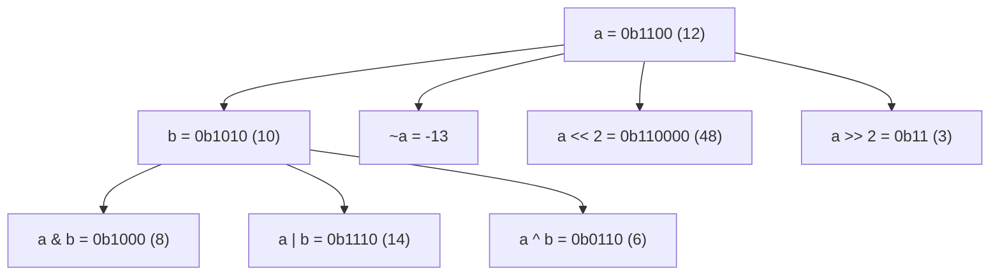
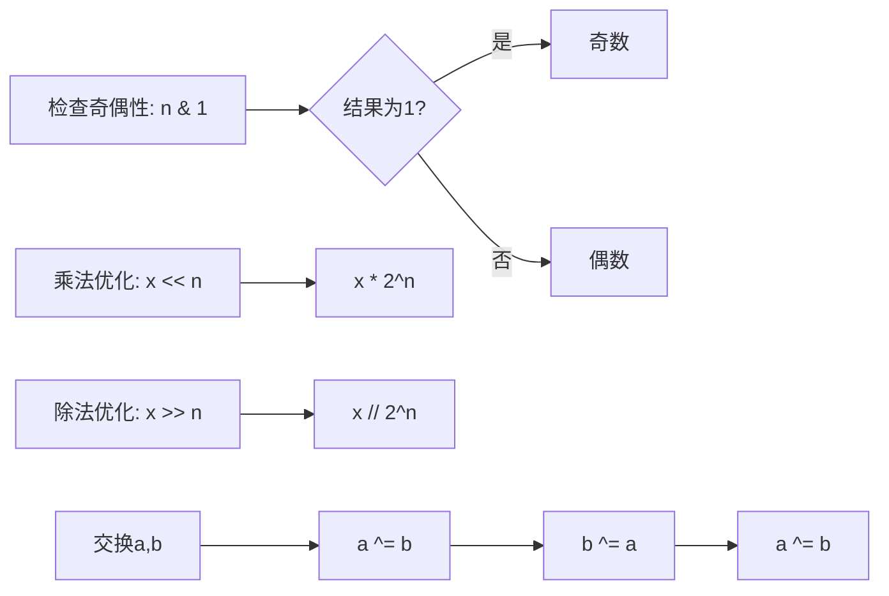
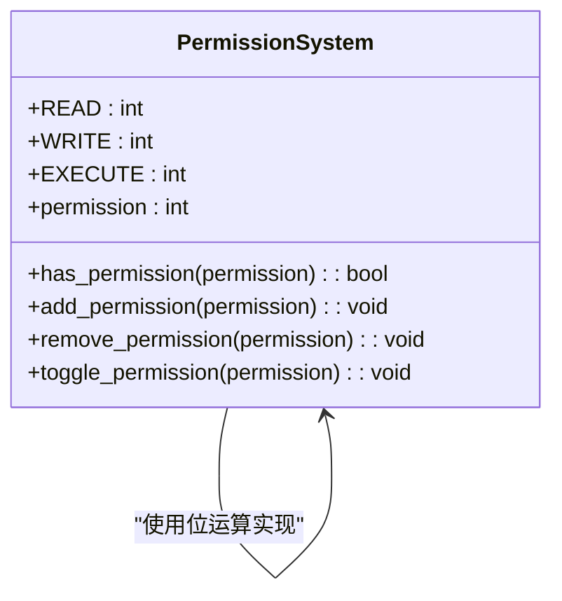

# 位运算

<cite>
**本文档引用的文件**  
- [bitwise_demo.py](file://opendemo_output/python/bitwise-operations/code/bitwise_demo.py)
- [example1.py](file://opendemo_output/python/libraries/numpy/bitwise-operations/code/example1.py)
- [example2.py](file://opendemo_output/python/libraries/numpy/bitwise-operations/code/example2.py)
- [numbers_math_demo.py](file://opendemo_output/python/numbers-math/code/numbers_math_demo.py)
- [README.md](file://opendemo_output/python/libraries/numpy/bitwise-operations/README.md)
</cite>

## 目录
1. [简介](#简介)
2. [位运算符基础](#位运算符基础)
3. [二进制表示](#二进制表示)
4. [位操作技巧](#位操作技巧)
5. [位掩码与权限控制](#位掩码与权限控制)
6. [位操作函数](#位操作函数)
7. [常用位操作算法](#常用位操作算法)
8. [实际应用场景](#实际应用场景)
9. [位域与标志枚举](#位域与标志枚举)
10. [有符号数处理](#有符号数处理)
11. [常见问题解答](#常见问题解答)
12. [扩展学习建议](#扩展学习建议)

## 简介
位运算是计算机底层数据操作的核心技术之一，通过直接对二进制位进行操作，实现高效的数据处理和状态管理。本项目提供了一个完整的Python位运算学习示例，涵盖从基础运算符到高级应用的多个方面。

位运算在权限控制系统、配置标志管理、网络协议解析、图像处理等领域有广泛应用。它能够将多个布尔状态压缩到一个整数中，极大地节省内存并提高判断效率。

**Section sources**
- [README.md](file://opendemo_output/python/libraries/numpy/bitwise-operations/README.md#L3-L10)

## 位运算符基础
Python提供了六种基本的位运算符，用于对整数的二进制位进行操作：

- **按位与 (&)**：两位都为1时结果为1
- **按位或 (|)**：任一位为1时结果为1
- **按位异或 (^)**：两位不同时结果为1
- **按位取反 (~)**：每一位取反（结果为 -(n+1)）
- **左移 (<<)**：向左移动n位，相当于乘以2^n
- **右移 (>>)**：向右移动n位，相当于除以2^n

这些运算符可以用于各种高效的数值操作和状态管理。

**Diagram sources**
- [bitwise_demo.py](file://opendemo_output/python/bitwise-operations/code/bitwise_demo.py#L14-L37)
- [numbers_math_demo.py](file://opendemo_output/python/numbers-math/code/numbers_math_demo.py#L234-L242)

**Section sources**
- [bitwise_demo.py](file://opendemo_output/python/bitwise-operations/code/bitwise_demo.py#L9-L38)

## 二进制表示
在进行位运算之前，理解数字的二进制表示至关重要。Python提供了多种方式来处理不同进制的数字：

- `bin()` 函数将十进制数转换为二进制字符串
- `oct()` 函数转换为八进制
- `hex()` 函数转换为十六进制
- 格式化字符串如 `{num:08b}` 可以输出固定宽度的二进制表示
- `bit_length()` 方法返回表示该数所需的最少位数

这些工具帮助开发者直观地理解和调试位运算过程。

**Section sources**
- [bitwise_demo.py](file://opendemo_output/python/bitwise-operations/code/bitwise_demo.py#L40-L57)

## 位操作技巧
位运算可以实现一些高效的编程技巧：

- **奇偶性检查**：使用 `n & 1` 判断奇偶性，结果为1表示奇数
- **乘除2的幂**：左移n位相当于乘以2^n，右移n位相当于整除2^n
- **变量交换**：使用异或运算可以在不使用临时变量的情况下交换两个数的值

这些技巧在算法优化和性能敏感的场景中非常有用。

**Diagram sources**
- [bitwise_demo.py](file://opendemo_output/python/bitwise-operations/code/bitwise_demo.py#L64-L84)

**Section sources**
- [bitwise_demo.py](file://opendemo_output/python/bitwise-operations/code/bitwise_demo.py#L60-L85)

## 位掩码与权限控制
位掩码是位运算的重要应用，常用于权限控制系统。通过为每个权限分配一个唯一的二进制位，可以将多个权限状态压缩到一个整数中进行管理。

典型的权限控制操作包括：
- **设置权限**：使用按位或 (`|`) 添加权限
- **检查权限**：使用按位与 (`&`) 判断是否拥有某权限
- **移除权限**：使用按位与和取反 (`& ~`) 撤销权限
- **切换权限**：使用异或 (`^`) 翻转权限状态

这种模式在操作系统、数据库和Web应用的权限管理中广泛使用。

**Diagram sources**
- [example1.py](file://opendemo_output/python/libraries/numpy/bitwise-operations/code/example1.py#L9-L12)
- [bitwise_demo.py](file://opendemo_output/python/bitwise-operations/code/bitwise_demo.py#L93-L121)

**Section sources**
- [example1.py](file://opendemo_output/python/libraries/numpy/bitwise-operations/code/example1.py#L8-L80)
- [bitwise_demo.py](file://opendemo_output/python/bitwise-operations/code/bitwise_demo.py#L87-L122)

## 位操作函数
可以封装常用的位操作为函数，提高代码的可读性和复用性：

- `get_bit(n, pos)`：获取第pos位的值
- `set_bit(n, pos)`：将第pos位设为1
- `clear_bit(n, pos)`：将第pos位设为0
- `toggle_bit(n, pos)`：切换第pos位的值

这些函数通过组合基本的位运算符实现，是构建更复杂位操作的基础。

**Section sources**
- [bitwise_demo.py](file://opendemo_output/python/bitwise-operations/code/bitwise_demo.py#L129-L151)

## 常用位操作算法
一些经典的位操作算法在面试和实际开发中经常出现：

- **统计1的个数**：使用 `n & (n-1)` 清除最低位的1，直到n为0
- **判断2的幂**：`n > 0 and (n & (n-1)) == 0`
- **获取最低位的1**：`n & (-n)`
- **向上取整到2的幂**：通过一系列位或和右移操作实现

这些算法展示了位运算在优化计算效率方面的强大能力。

**Section sources**
- [bitwise_demo.py](file://opendemo_output/python/bitwise-operations/code/bitwise_demo.py#L159-L197)

## 实际应用场景
位运算在多个实际场景中有重要应用：

- **IP地址转换**：将点分十进制IP地址与32位整数相互转换
- **颜色处理**：将RGB三元组与24位颜色值相互转换
- **数据压缩**：将多个布尔状态打包到一个整数中
- **加密算法**：XOR操作可用于简单的加密解密

这些应用体现了位运算在系统编程和数据处理中的实用性。

**Section sources**
- [bitwise_demo.py](file://opendemo_output/python/bitwise-operations/code/bitwise_demo.py#L205-L240)

## 位域与标志
Python的 `enum.Flag` 类提供了高级的位标志支持，允许以面向对象的方式处理位运算：

- 可以定义具有自动分配值的标志枚举
- 支持自然的按位或、与等操作
- 提供了成员资格测试
- 代码更加清晰易读

这是现代Python中处理位标志的推荐方式。

**Section sources**
- [bitwise_demo.py](file://opendemo_output/python/bitwise-operations/code/bitwise_demo.py#L248-L265)

## 有符号数处理
在处理有符号数时需要注意：

- Python的整数是无限精度的，需要模拟固定位数的行为
- 补码表示是负数的标准表示方法
- 可以通过掩码和条件判断实现有符号数的转换
- `twos_complement` 函数可以计算指定位数下的补码

这在与硬件交互或处理网络协议时尤为重要。

**Section sources**
- [bitwise_demo.py](file://opendemo_output/python/bitwise-operations/code/bitwise_demo.py#L272-L292)

## 常见问题解答
**问：为什么使用位运算而不是布尔变量？**  
答：位运算更节省内存，适合管理大量互斥或组合状态，且在底层系统和嵌入式开发中非常高效。

**问：`1 << n` 是什么意思？**  
答：将数字1向左移动n位，等价于 $2^n$，用于生成唯一的二进制位标识。

**问：异或 `^` 如何用于切换状态？**  
答：因为 `x ^ 1 = ~x` 当x为0或1时成立，所以对某一位异或1可实现开关效果。

**问：负数的位运算是什么结果？**  
答：Python中负数使用补码表示，`~x` 等价于 `-x-1`，需注意符号扩展。

**Section sources**
- [README.md](file://opendemo_output/python/libraries/numpy/bitwise-operations/README.md#L92-L103)

## 扩展学习建议
- 尝试实现一个支持角色的多级权限系统
- 使用位运算实现简单的加密/解密算法（如XOR加密）
- 学习位运算在图像处理、网络协议解析中的应用
- 阅读Python源码中关于`os.chmod()`等系统调用的实现
- 探索 `enum.IntFlag` 类，它是位标志的高级封装

**Section sources**
- [README.md](file://opendemo_output/python/libraries/numpy/bitwise-operations/README.md#L106-L110)