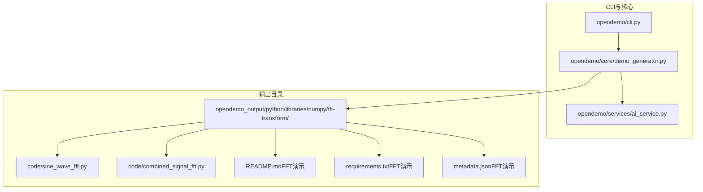
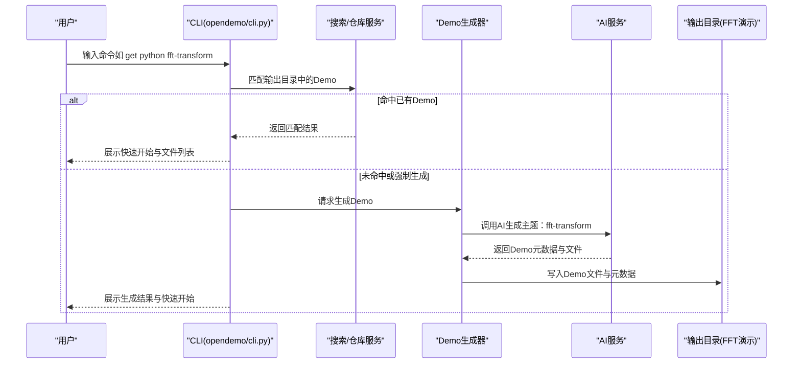
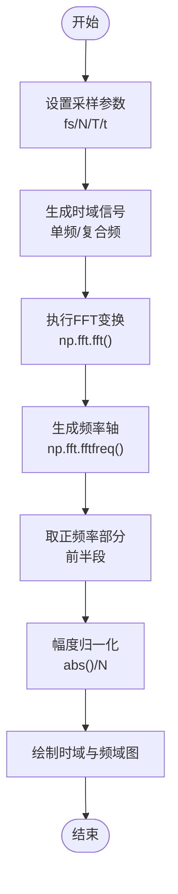
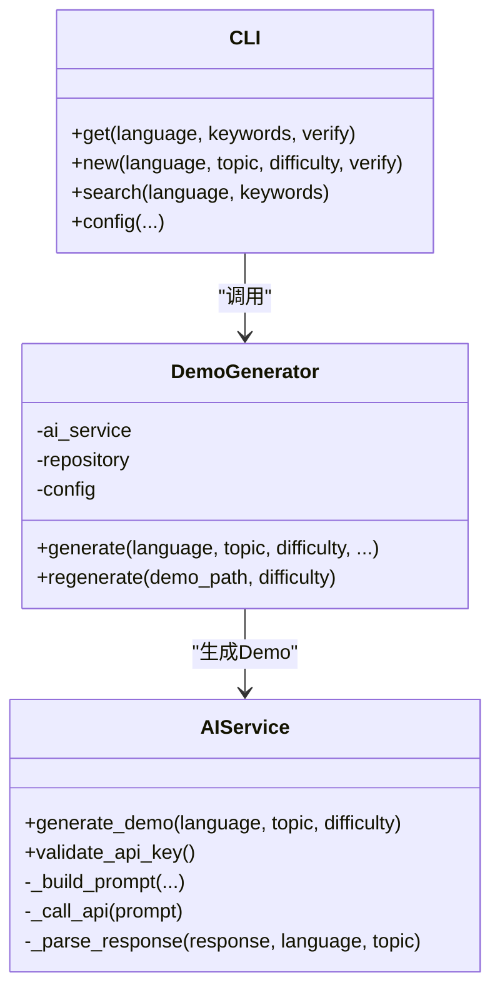
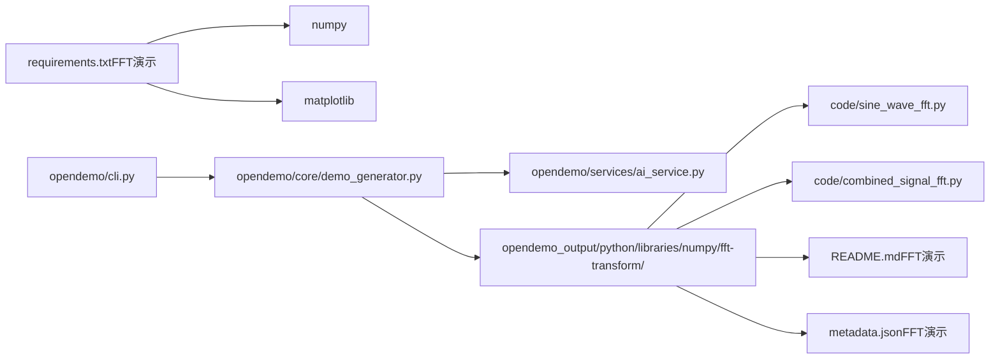

# 傅里叶变换

<cite>
**本文引用的文件**
- [README.md](file://README.md)
- [cli.py](file://opendemo/cli.py)
- [ai_service.py](file://opendemo/services/ai_service.py)
- [demo_generator.py](file://opendemo/core/demo_generator.py)
- [sine_wave_fft.py](file://opendemo_output/python/libraries/numpy/fft-transform/code/sine_wave_fft.py)
- [combined_signal_fft.py](file://opendemo_output/python/libraries/numpy/fft-transform/code/combined_signal_fft.py)
- [README.md（FFT演示）](file://opendemo_output/python/libraries/numpy/fft-transform/README.md)
- [requirements.txt（FFT演示）](file://opendemo_output/python/libraries/numpy/fft-transform/requirements.txt)
- [metadata.json（FFT演示）](file://opendemo_output/python/libraries/numpy/fft-transform/metadata.json)
</cite>

## 目录
1. [简介](#简介)
2. [项目结构](#项目结构)
3. [核心组件](#核心组件)
4. [架构总览](#架构总览)
5. [详细组件分析](#详细组件分析)
6. [依赖关系分析](#依赖关系分析)
7. [性能考量](#性能考量)
8. [故障排查指南](#故障排查指南)
9. [结论](#结论)
10. [附录](#附录)

## 简介
本文件围绕“傅里叶变换（Fourier Transform）”主题，结合仓库中的Python NumPy FFT演示，系统梳理从命令行入口、AI生成流程到具体示例代码的完整链路，并给出可视化与实践建议。读者可以基于此文档快速理解时域到频域的转换原理，并在本地环境中运行示例，观察单一频率与复合频率信号的频谱特征。

## 项目结构
仓库采用CLI工具 + Demo模板生成的组织方式：
- CLI入口负责命令解析、搜索、获取与生成、配置管理等。
- 核心模块负责Demo生成协调、搜索、仓库管理与校验。
- 服务模块负责AI服务、存储服务与配置服务。
- opendemo_output 目录存放已生成或内置的Demo，其中包含Python库（如NumPy）下的FFT演示。

图表来源
- [cli.py](file://opendemo/cli.py#L320-L467)
- [demo_generator.py](file://opendemo/core/demo_generator.py#L30-L111)
- [ai_service.py](file://opendemo/services/ai_service.py#L38-L86)
- [README.md（FFT演示）](file://opendemo_output/python/libraries/numpy/fft-transform/README.md#L1-L108)

章节来源
- [README.md](file://README.md#L449-L525)
- [cli.py](file://opendemo/cli.py#L320-L467)

## 核心组件
- CLI命令入口：提供 search、get、new、config 等命令，支持在输出目录中匹配已有Demo，或通过AI生成新Demo。
- Demo生成器：协调AI服务生成Demo，补全元数据并落盘到输出目录。
- AI服务：封装LLM调用、重试、响应解析与库/主题关键字分类。
- FFT演示：包含两个Python脚本，分别演示单频与复合频信号的FFT频谱分析，并配套README与依赖声明。

章节来源
- [cli.py](file://opendemo/cli.py#L320-L467)
- [demo_generator.py](file://opendemo/core/demo_generator.py#L30-L111)
- [ai_service.py](file://opendemo/services/ai_service.py#L38-L86)
- [README.md（FFT演示）](file://opendemo_output/python/libraries/numpy/fft-transform/README.md#L1-L108)

## 架构总览
下图展示了从用户输入到FFT示例运行的端到端流程，包括命令解析、Demo匹配/生成、AI调用与示例执行。

图表来源
- [cli.py](file://opendemo/cli.py#L320-L467)
- [demo_generator.py](file://opendemo/core/demo_generator.py#L30-L111)
- [ai_service.py](file://opendemo/services/ai_service.py#L38-L86)

## 详细组件分析

### 傅里叶变换示例（单频与复合频）
- 单频正弦波FFT：生成固定频率的正弦波，执行FFT并绘制时域与频域图，强调只取正频率部分并做幅度归一化。
- 复合信号FFT：叠加两个不同频率的正弦波，展示频域中两个主峰的出现，帮助识别混合信号中的频率成分。

图表来源
- [sine_wave_fft.py](file://opendemo_output/python/libraries/numpy/fft-transform/code/sine_wave_fft.py#L1-L49)
- [combined_signal_fft.py](file://opendemo_output/python/libraries/numpy/fft-transform/code/combined_signal_fft.py#L1-L50)

章节来源
- [sine_wave_fft.py](file://opendemo_output/python/libraries/numpy/fft-transform/code/sine_wave_fft.py#L1-L49)
- [combined_signal_fft.py](file://opendemo_output/python/libraries/numpy/fft-transform/code/combined_signal_fft.py#L1-L50)
- [README.md（FFT演示）](file://opendemo_output/python/libraries/numpy/fft-transform/README.md#L1-L108)
- [requirements.txt（FFT演示）](file://opendemo_output/python/libraries/numpy/fft-transform/requirements.txt#L1-L2)
- [metadata.json（FFT演示）](file://opendemo_output/python/libraries/numpy/fft-transform/metadata.json#L1-L19)

### CLI与Demo生成链路
- 命令入口：解析语言与关键字，支持在输出目录中匹配Demo；若未命中或指定强制生成，则走AI生成流程。
- 生成器：调用AI服务生成Demo，补充作者、时间戳、版本与验证标记，最终写入输出目录。
- AI服务：构建提示词、调用LLM、解析JSON响应、重试与API密钥校验。

图表来源
- [ai_service.py](file://opendemo/services/ai_service.py#L38-L86)
- [demo_generator.py](file://opendemo/core/demo_generator.py#L30-L111)
- [cli.py](file://opendemo/cli.py#L320-L467)

章节来源
- [cli.py](file://opendemo/cli.py#L320-L467)
- [demo_generator.py](file://opendemo/core/demo_generator.py#L30-L111)
- [ai_service.py](file://opendemo/services/ai_service.py#L38-L86)

## 依赖关系分析
- FFT演示依赖NumPy与Matplotlib，用于数值计算与可视化。
- CLI与核心模块通过服务层解耦，Demo生成器与AI服务通过统一接口协作。
- 输出目录中的Demo具备独立的README、requirements与元数据，便于独立运行与维护。

图表来源
- [requirements.txt（FFT演示）](file://opendemo_output/python/libraries/numpy/fft-transform/requirements.txt#L1-L2)
- [cli.py](file://opendemo/cli.py#L320-L467)
- [demo_generator.py](file://opendemo/core/demo_generator.py#L30-L111)
- [ai_service.py](file://opendemo/services/ai_service.py#L38-L86)

章节来源
- [requirements.txt（FFT演示）](file://opendemo_output/python/libraries/numpy/fft-transform/requirements.txt#L1-L2)
- [README.md（FFT演示）](file://opendemo_output/python/libraries/numpy/fft-transform/README.md#L1-L108)

## 性能考量
- FFT计算复杂度：标准FFT算法的时间复杂度为O(N log N)，适合大规模时域数据的频域分析。
- 采样参数影响：采样频率与采样点数决定频率分辨率与频谱泄漏，建议根据信号最高频率选择合适的采样率与窗长。
- 可视化开销：Matplotlib绘图在大数据量下可能较慢，可在调试阶段减小N或仅绘制关键片段。

## 故障排查指南
- 未找到匹配Demo：确认关键字是否正确，或使用强制生成选项重新生成。
- 依赖缺失：确保已安装NumPy与Matplotlib，或在虚拟环境中安装requirements。
- 图形未弹出：检查后端配置或手动添加显示命令，确保环境支持GUI。
- AI生成失败：检查API密钥是否配置，必要时增加重试次数与间隔。

章节来源
- [cli.py](file://opendemo/cli.py#L320-L467)
- [README.md（FFT演示）](file://opendemo_output/python/libraries/numpy/fft-transform/README.md#L1-L108)

## 结论
本仓库提供了从CLI到AI生成再到具体FFT示例的完整实践路径。通过单频与复合频信号的频谱分析，初学者可以直观理解时域与频域之间的关系，并在此基础上扩展至噪声、真实音频与短时傅里叶变换等高级主题。

## 附录
- 快速开始（在输出目录中运行示例）：
  - 进入FFT演示目录，安装依赖后运行示例脚本，观察时域与频域图像。
- 扩展建议：
  - 添加噪声观察频谱变化
  - 使用SciPy的FFT接口以获得更高性能
  - 实现逆FFT（IFFT）还原原始信号
  - 对真实音频文件进行频谱分析
  - 学习短时傅里叶变换（STFT）用于时频分析

章节来源
- [README.md（FFT演示）](file://opendemo_output/python/libraries/numpy/fft-transform/README.md#L1-L108)