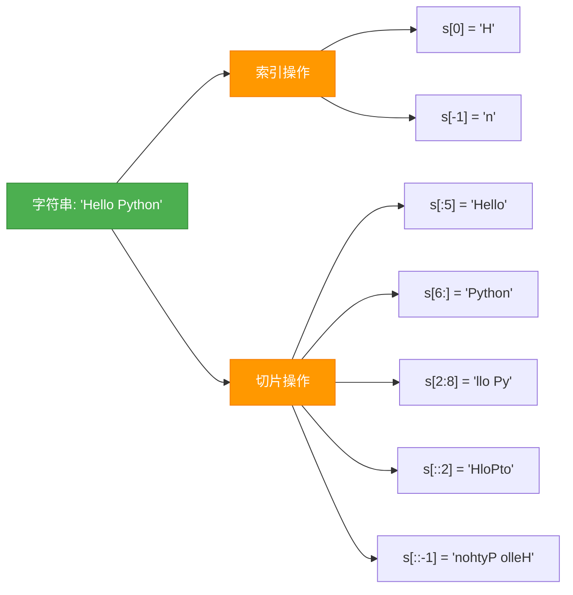
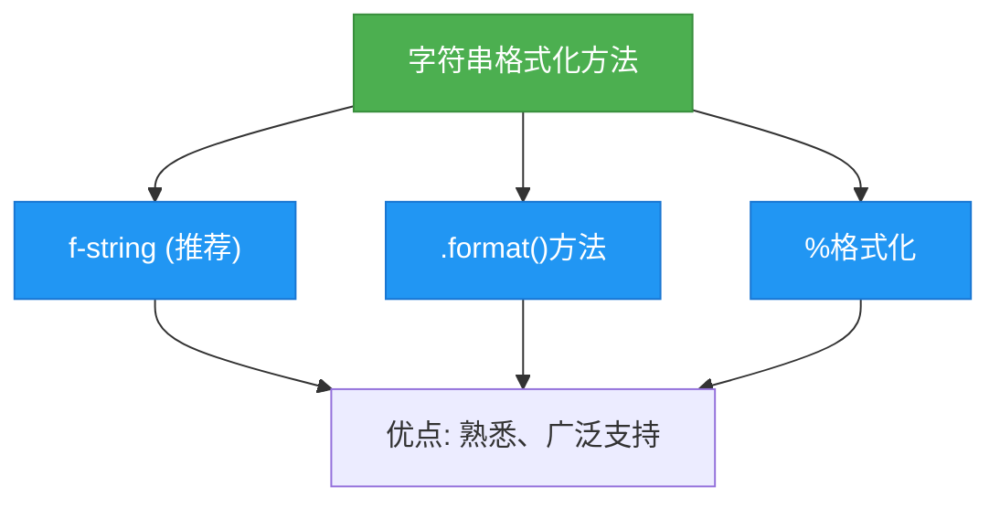
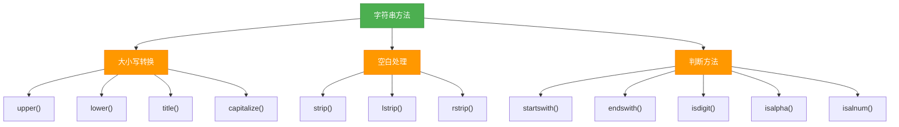
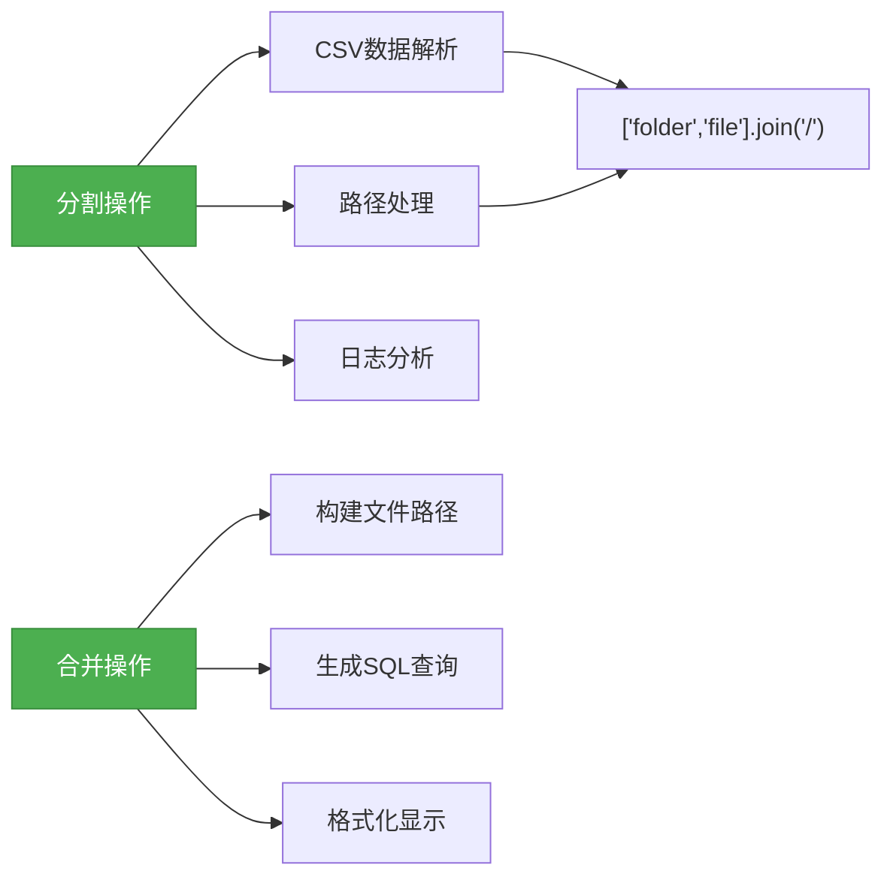
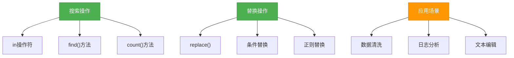
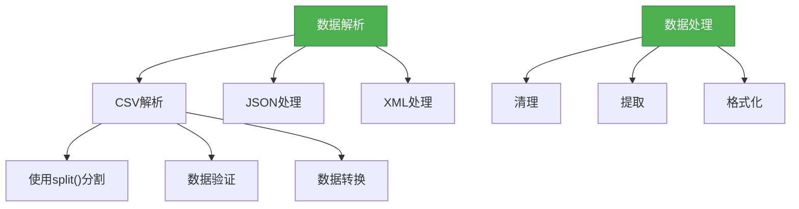
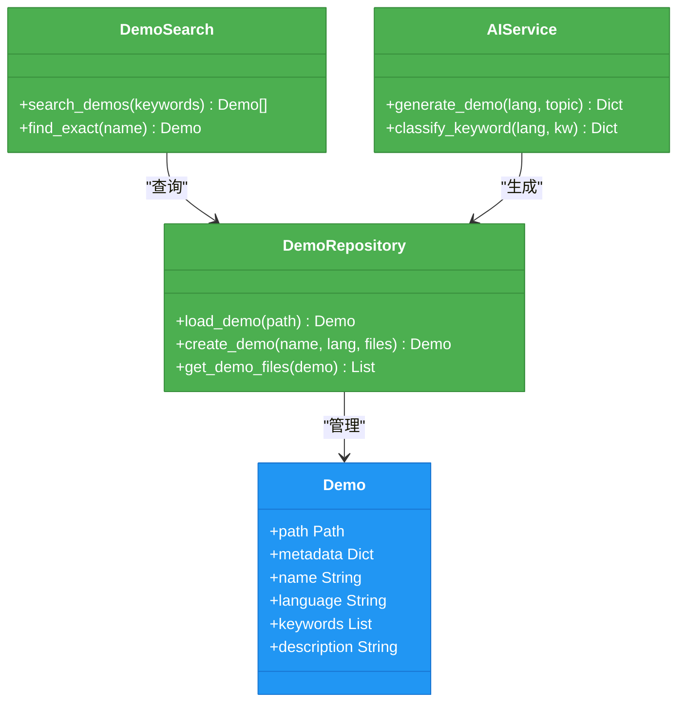

# 字符串操作

<cite>
**本文档引用的文件**   
- [string_basics.py](file://opendemo_output/python/string-operations/code/string_basics.py)
- [basic_formatting.py](file://opendemo_output/python/libraries/numpy/string-operations/code/basic_formatting.py)
- [text_processing.py](file://opendemo_output/python/libraries/numpy/string-operations/code/text_processing.py)
- [data_parsing.py](file://opendemo_output/python/libraries/numpy/string-operations/code/data_parsing.py)
- [metadata.json](file://opendemo_output/python/libraries/numpy/string-operations/metadata.json)
- [cli.py](file://opendemo/cli.py)
- [demo_repository.py](file://opendemo/core/demo_repository.py)
- [demo_search.py](file://opendemo/core/demo_search.py)
- [ai_service.py](file://opendemo/services/ai_service.py)
- [formatters.py](file://opendemo/utils/formatters.py)
</cite>

## 目录
1. [简介](#简介)
2. [字符串创建与表示](#字符串创建与表示)
3. [字符串索引与切片](#字符串索引与切片)
4. [字符串格式化方法](#字符串格式化方法)
5. [字符串常用操作方法](#字符串常用操作方法)
6. [字符串分割与合并](#字符串分割与合并)
7. [文本搜索与替换](#文本搜索与替换)
8. [数据解析与处理](#数据解析与处理)
9. [系统实现机制](#系统实现机制)

## 简介

字符串操作是编程中最基础且最重要的技能之一。本文档详细介绍了Python中各种字符串操作技术，包括字符串的创建、格式化、索引、切片、搜索、替换、分割和合并等核心功能。通过系统化的示例演示，帮助开发者掌握高效处理文本数据的方法。

**Section sources**
- [metadata.json](file://opendemo_output/python/libraries/numpy/string-operations/metadata.json)

## 字符串创建与表示

Python提供了多种方式来创建和表示字符串，每种方式都有其特定的应用场景。

### 单引号与双引号
可以使用单引号（'）或双引号（"）来创建字符串。两者功能相同，主要区别在于可以在一种引号内直接包含另一种引号而无需转义。

### 三引号多行字符串
使用三个引号（'''或"""）可以创建多行字符串，这对于包含换行的文本内容非常有用。

### 原始字符串
在字符串前添加`r`前缀可以创建原始字符串，其中的转义字符不会被处理，这在处理文件路径或正则表达式时特别有用。

### f-string格式化
f-string（以`f`开头的字符串）允许在字符串中直接嵌入表达式，是Python 3.6+推荐的字符串格式化方式。

```mermaid
flowchart TD
Start["字符串创建方式"] --> SingleQuote["单引号 'Hello'"]
Start --> DoubleQuote["双引号 \"World\""]
Start --> TripleQuote["三引号多行字符串"]
Start --> RawString["原始字符串 r\"C:\\path\""]
Start --> FString["f-string f\"{name}\""]
style Start fill:#4CAF50,stroke:#388E3C,color:white
style SingleQuote fill:#2196F3,stroke:#1976D2,color:white
style DoubleQuote fill:#2196F3,stroke:#1976D2,color:white
style TripleQuote fill:#2196F3,stroke:#1976D2,color:white
style RawString fill:#2196F3,stroke:#1976D2,color:white
style FString fill:#2196F3,stroke:#1976D2,color:white
```

**Diagram sources**
- [string_basics.py](file://opendemo_output/python/string-operations/code/string_basics.py)

## 字符串索引与切片

字符串是序列类型，支持索引和切片操作，这是访问和提取字符串子集的基本方法。

### 索引操作
通过方括号`[]`和位置索引来访问字符串中的单个字符。Python支持正向索引（从0开始）和负向索引（从-1开始，表示最后一个字符）。

### 切片操作
切片语法`[start:end:step]`允许提取字符串的子串：
- `start`：起始位置（包含）
- `end`：结束位置（不包含）
- `step`：步长（可选，默认为1）



**Diagram sources**
- [string_basics.py](file://opendemo_output/python/string-operations/code/string_basics.py)

## 字符串格式化方法

Python提供了多种字符串格式化方法，每种都有其优势和适用场景。

### f-string（推荐）
f-string是Python 3.6引入的现代格式化方法，语法简洁高效：

```python
name = "张三"
age = 25
f"姓名: {name}, 年龄: {age}"
```

### .format()方法
`.format()`方法使用占位符{}，通过参数传递值：

```python
"用户{name}今年{age}岁了".format(name=name, age=age)
```

### %格式化（传统方式）
%格式化是较老的方式，类似于C语言的printf：

```python
"%s花了%d元买了%s" % (name, price, product)
```



**Diagram sources**
- [basic_formatting.py](file://opendemo_output/python/libraries/numpy/string-operations/code/basic_formatting.py)

## 字符串常用操作方法

Python字符串提供了丰富的内置方法来处理文本数据。

### 大小写转换
- `upper()`：转换为大写
- `lower()`：转换为小写
- `title()`：每个单词首字母大写
- `capitalize()`：首字母大写

### 空白字符处理
- `strip()`：去除首尾空白
- `lstrip()`：去除左侧空白
- `rstrip()`：去除右侧空白

### 判断方法
- `startswith()`：检查是否以指定字符串开头
- `endswith()`：检查是否以指定字符串结尾
- `isdigit()`：检查是否全为数字
- `isalpha()`：检查是否全为字母
- `isalnum()`：检查是否全为字母或数字



**Diagram sources**
- [string_basics.py](file://opendemo_output/python/string-operations/code/string_basics.py)

## 字符串分割与合并

分割和合并是处理结构化文本数据的核心操作。

### split()方法
将字符串按指定分隔符分割成列表：

```python
"apple,banana,orange".split(",")  # ['apple', 'banana', 'orange']
```

### join()方法
将列表元素合并成字符串：

```python
"-".join(['a', 'b', 'c'])  # 'a-b-c'
```

### 高级分割
- `splitlines()`：按行分割
- 限制分割次数：`split(',', 2)`



**Diagram sources**
- [data_parsing.py](file://opendemo_output/python/libraries/numpy/string-operations/code/data_parsing.py)

## 文本搜索与替换

搜索和替换是文本处理中最常见的需求。

### 搜索操作
- `in`操作符：检查子串是否存在
- `find()`：返回子串首次出现的位置，未找到返回-1
- `count()`：统计子串出现次数

### 替换操作
- `replace(old, new)`：将所有匹配的子串替换为新字符串

### 实际应用
这些操作广泛应用于数据清洗、日志分析、文本编辑等场景。



**Diagram sources**
- [text_processing.py](file://opendemo_output/python/libraries/numpy/string-operations/code/text_processing.py)

## 数据解析与处理

字符串操作在数据解析中扮演着关键角色。

### CSV数据解析
使用`split()`方法可以轻松解析CSV格式的数据：

```python
"张三,25,工程师".split(",")  # 解析为['张三', '25', '工程师']
```

### 路径处理
使用`join()`方法可以安全地构建文件路径：

```python
"/".join(['folder', 'subfolder', 'file.txt'])
```

### 文本清理
结合`strip()`和`split()`可以清理和标准化文本数据：

```python
"  hello    world  ".strip().split()  # ['hello', 'world']
```



**Diagram sources**
- [data_parsing.py](file://opendemo_output/python/libraries/numpy/string-operations/code/data_parsing.py)

## 系统实现机制

本节介绍字符串操作示例在系统中的组织和管理方式。

### 文件结构
字符串操作示例按照功能分类组织在不同的文件中：
- `string_basics.py`：基础操作
- `basic_formatting.py`：格式化方法
- `text_processing.py`：搜索替换
- `data_parsing.py`：数据解析

### 元数据管理
每个示例都有对应的`metadata.json`文件，包含名称、描述、关键字等信息，便于搜索和管理。

### 搜索与检索
系统通过`demo_search.py`实现高效的搜索功能，支持按关键字、语言等条件查找示例。



**Diagram sources**
- [demo_repository.py](file://opendemo/core/demo_repository.py)
- [demo_search.py](file://opendemo/core/demo_search.py)
- [ai_service.py](file://opendemo/services/ai_service.py)

**Section sources**
- [cli.py](file://opendemo/cli.py)
- [demo_repository.py](file://opendemo/core/demo_repository.py)
- [demo_search.py](file://opendemo/core/demo_search.py)
- [ai_service.py](file://opendemo/services/ai_service.py)
- [formatters.py](file://opendemo/utils/formatters.py)