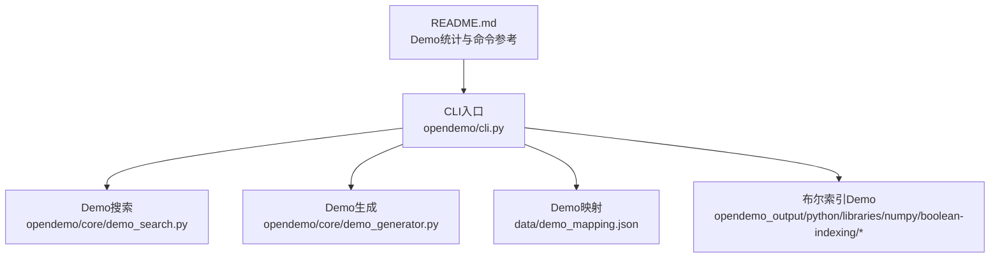
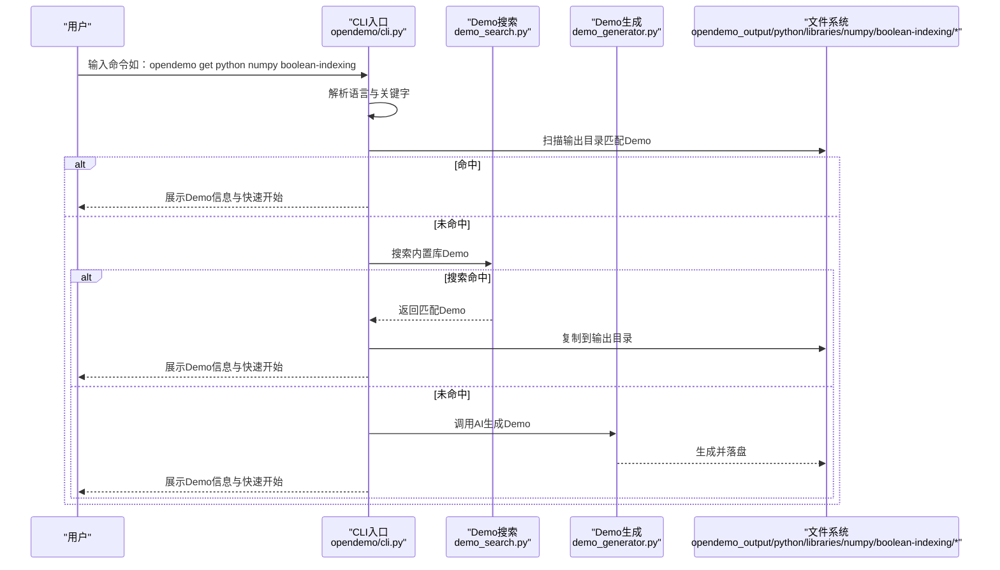
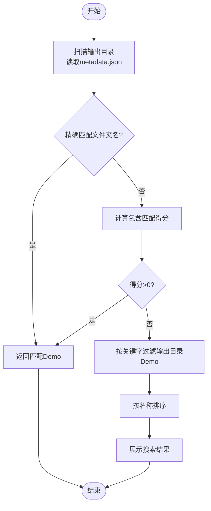
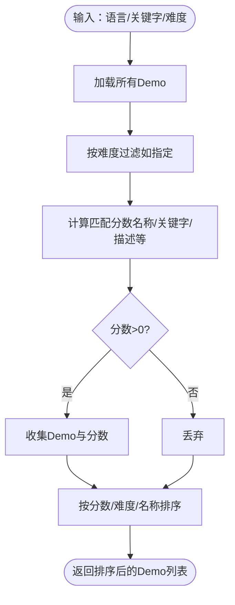
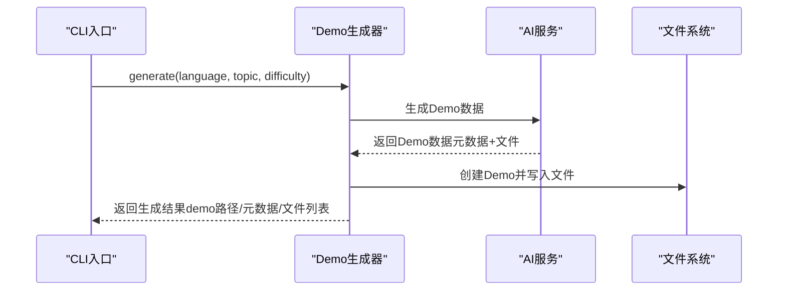
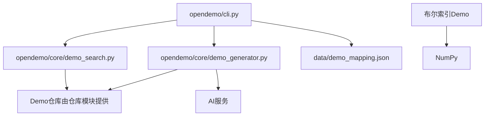

# 布尔索引

<cite>
**本文引用的文件**
- [README.md](file://README.md)
- [cli.py](file://opendemo/cli.py)
- [demo_search.py](file://opendemo/core/demo_search.py)
- [demo_generator.py](file://opendemo/core/demo_generator.py)
- [demo_mapping.json](file://data/demo_mapping.json)
- [boolean-indexing/README.md](file://opendemo_output/python/libraries/numpy/boolean-indexing/README.md)
- [boolean-indexing/metadata.json](file://opendemo_output/python/libraries/numpy/boolean-indexing/metadata.json)
- [boolean-indexing/code/example1.py](file://opendemo_output/python/libraries/numpy/boolean-indexing/code/example1.py)
- [boolean-indexing/code/example2.py](file://opendemo_output/python/libraries/numpy/boolean-indexing/code/example2.py)
- [boolean-indexing/requirements.txt](file://opendemo_output/python/libraries/numpy/boolean-indexing/requirements.txt)
</cite>

## 目录
1. [简介](#简介)
2. [项目结构](#项目结构)
3. [核心组件](#核心组件)
4. [架构总览](#架构总览)
5. [组件详细分析](#组件详细分析)
6. [依赖关系分析](#依赖关系分析)
7. [性能考量](#性能考量)
8. [故障排查指南](#故障排查指南)
9. [结论](#结论)
10. [附录](#附录)

## 简介
本篇文档围绕“布尔索引”主题，结合项目中的NumPy库Demo，系统阐述布尔索引的概念、使用方式、组合条件的注意事项以及在多维数组中的实践。同时，文档还展示了该Demo在CLI工具中的检索与获取流程，帮助读者从“如何找到Demo”到“如何运行与学习Demo”的完整闭环。

## 项目结构
- 顶层README提供了Demo统计与命令参考，明确展示了“布尔索引”属于Python库（NumPy）的Demo分类之一。
- CLI入口负责命令解析、搜索、获取与生成等流程；Demo搜索模块提供关键词匹配与排序；Demo生成模块负责AI生成与落地。
- Demo映射文件用于描述各语言与Demo的对应关系，便于CLI扫描与匹配。
- 布尔索引Demo位于Python库（NumPy）目录下，包含README、元数据、示例代码与依赖声明。

图表来源
- [README.md](file://README.md#L1-L525)
- [cli.py](file://opendemo/cli.py#L1-L840)
- [demo_search.py](file://opendemo/core/demo_search.py#L1-L381)
- [demo_generator.py](file://opendemo/core/demo_generator.py#L1-L143)
- [demo_mapping.json](file://data/demo_mapping.json#L1-L1043)
- [boolean-indexing/README.md](file://opendemo_output/python/libraries/numpy/boolean-indexing/README.md#L1-L102)

章节来源
- [README.md](file://README.md#L1-L525)
- [cli.py](file://opendemo/cli.py#L1-L840)
- [demo_search.py](file://opendemo/core/demo_search.py#L1-L381)
- [demo_generator.py](file://opendemo/core/demo_generator.py#L1-L143)
- [demo_mapping.json](file://data/demo_mapping.json#L1-L1043)

## 核心组件
- CLI命令与交互：提供search、get、new、config等命令，支持在输出目录中匹配Demo、在内置库中搜索、通过AI生成Demo。
- Demo搜索：根据语言、关键字、难度等条件进行匹配与排序，支持库功能搜索。
- Demo生成：调用AI服务生成Demo，补充元数据并落盘到输出目录。
- Demo映射：描述语言与Demo的映射关系，辅助CLI扫描与匹配。
- 布尔索引Demo：包含两个示例，分别演示一维与二维数组的布尔索引实践，配套README与元数据。

章节来源
- [cli.py](file://opendemo/cli.py#L1-L840)
- [demo_search.py](file://opendemo/core/demo_search.py#L1-L381)
- [demo_generator.py](file://opendemo/core/demo_generator.py#L1-L143)
- [demo_mapping.json](file://data/demo_mapping.json#L1-L1043)
- [boolean-indexing/README.md](file://opendemo_output/python/libraries/numpy/boolean-indexing/README.md#L1-L102)

## 架构总览
下图展示了从CLI到Demo搜索、生成与落地的端到端流程，以及布尔索引Demo的组织形态。

图表来源
- [cli.py](file://opendemo/cli.py#L319-L466)
- [demo_search.py](file://opendemo/core/demo_search.py#L43-L83)
- [demo_generator.py](file://opendemo/core/demo_generator.py#L30-L111)
- [boolean-indexing/README.md](file://opendemo_output/python/libraries/numpy/boolean-indexing/README.md#L1-L102)

## 组件详细分析

### 布尔索引Demo概览
- 适用语言：Python
- 所属库：NumPy
- 关键词：布尔索引、数据筛选、NumPy
- 难度：入门
- 示例内容：
  - 示例1：一维数组的布尔索引，筛选偶数与大于某值的元素。
  - 示例2：二维数组的组合条件布尔索引，按行筛选最大值。
- 依赖：NumPy（版本≥1.21.0）

章节来源
- [boolean-indexing/README.md](file://opendemo_output/python/libraries/numpy/boolean-indexing/README.md#L1-L102)
- [boolean-indexing/metadata.json](file://opendemo_output/python/libraries/numpy/boolean-indexing/metadata.json#L1-L17)
- [boolean-indexing/requirements.txt](file://opendemo_output/python/libraries/numpy/boolean-indexing/requirements.txt#L1-L1)
- [boolean-indexing/code/example1.py](file://opendemo_output/python/libraries/numpy/boolean-indexing/code/example1.py#L1-L26)
- [boolean-indexing/code/example2.py](file://opendemo_output/python/libraries/numpy/boolean-indexing/code/example2.py#L1-L27)

### CLI中的布尔索引Demo匹配流程
- 输出目录扫描：CLI会扫描输出目录下的Demo，读取metadata.json以获取语言、关键字、描述等信息。
- 匹配策略：
  - 精确匹配文件夹名称
  - 文件夹名称包含关键字
  - 关键字出现在metadata.keywords中
- 搜索过滤：当提供关键字时，CLI会对输出目录中的Demo进行过滤，支持按文件夹名或metadata.keywords匹配。
- 未命中时的回退：若输出目录未命中，CLI会调用Demo搜索模块在内置库中查找匹配Demo；若仍无匹配，则通过AI生成。

图表来源
- [cli.py](file://opendemo/cli.py#L43-L161)
- [cli.py](file://opendemo/cli.py#L468-L526)

章节来源
- [cli.py](file://opendemo/cli.py#L43-L161)
- [cli.py](file://opendemo/cli.py#L468-L526)

### Demo搜索与排序（面向布尔索引Demo）
- 匹配权重：名称、关键字、描述等维度赋予不同权重，综合评分决定排序。
- 难度过滤：若指定难度，将进行精确匹配；不匹配则直接剔除。
- 排序规则：按分数降序、难度升序、名称升序进行综合排序。

图表来源
- [demo_search.py](file://opendemo/core/demo_search.py#L43-L83)
- [demo_search.py](file://opendemo/core/demo_search.py#L220-L282)
- [demo_search.py](file://opendemo/core/demo_search.py#L284-L330)

章节来源
- [demo_search.py](file://opendemo/core/demo_search.py#L43-L83)
- [demo_search.py](file://opendemo/core/demo_search.py#L220-L282)
- [demo_search.py](file://opendemo/core/demo_search.py#L284-L330)

### Demo生成与落地（面向布尔索引Demo）
- 生成入口：CLI在未命中输出目录且未命中内置库时，调用Demo生成器通过AI生成Demo。
- 元数据补充：作者、创建/更新时间、版本、校验标记等。
- 落地路径：根据语言与主题生成文件夹，将生成的文件写入输出目录。

图表来源
- [demo_generator.py](file://opendemo/core/demo_generator.py#L30-L111)
- [cli.py](file://opendemo/cli.py#L417-L466)

章节来源
- [demo_generator.py](file://opendemo/core/demo_generator.py#L30-L111)
- [cli.py](file://opendemo/cli.py#L417-L466)

### 布尔索引Demo的示例要点
- 示例1（一维数组）：通过布尔条件构造掩码，使用掩码进行筛选，直观展示偶数与大于某值的元素提取。
- 示例2（二维数组）：演示组合条件（大于5且为奇数），强调括号与逻辑运算符的使用；并展示按行筛选最大值的实践。

章节来源
- [boolean-indexing/code/example1.py](file://opendemo_output/python/libraries/numpy/boolean-indexing/code/example1.py#L1-L26)
- [boolean-indexing/code/example2.py](file://opendemo_output/python/libraries/numpy/boolean-indexing/code/example2.py#L1-L27)

## 依赖关系分析
- CLI依赖Demo搜索与Demo生成模块，以及存储服务与配置服务。
- Demo搜索依赖Demo仓库（负责加载与列举Demo）。
- Demo生成依赖AI服务与Demo仓库。
- 布尔索引Demo依赖NumPy，示例代码中使用NumPy数组与布尔索引。

图表来源
- [cli.py](file://opendemo/cli.py#L1-L840)
- [demo_search.py](file://opendemo/core/demo_search.py#L1-L381)
- [demo_generator.py](file://opendemo/core/demo_generator.py#L1-L143)
- [demo_mapping.json](file://data/demo_mapping.json#L1-L1043)
- [boolean-indexing/README.md](file://opendemo_output/python/libraries/numpy/boolean-indexing/README.md#L1-L102)

章节来源
- [cli.py](file://opendemo/cli.py#L1-L840)
- [demo_search.py](file://opendemo/core/demo_search.py#L1-L381)
- [demo_generator.py](file://opendemo/core/demo_generator.py#L1-L143)
- [demo_mapping.json](file://data/demo_mapping.json#L1-L1043)

## 性能考量
- 匹配与排序：Demo搜索采用逐条计算匹配分数的方式，复杂度与Demo总量成正比；建议在大规模Demo库中引入索引或缓存机制以降低查询成本。
- 布尔索引本身：NumPy的布尔索引是向量化操作，通常具有良好的性能表现；但在多维数组上组合条件时，注意逻辑运算符的优先级与括号使用，避免不必要的中间结果与重复计算。
- I/O与存储：CLI扫描输出目录时，应避免频繁读取metadata.json；可在首次扫描后建立轻量缓存，减少重复I/O。

## 故障排查指南
- 无法找到布尔索引Demo：
  - 检查输出目录是否存在对应Demo文件夹与metadata.json。
  - 若未命中，确认是否已安装NumPy依赖。
- 运行示例报错：
  - 确认NumPy版本满足requirements.txt要求。
  - 检查示例代码中的逻辑运算符使用是否正确（组合条件需用括号包裹）。
- CLI命令无效：
  - 确认语言参数与关键字正确。
  - 若需要AI生成，请先配置AI API密钥。

章节来源
- [cli.py](file://opendemo/cli.py#L319-L466)
- [boolean-indexing/requirements.txt](file://opendemo_output/python/libraries/numpy/boolean-indexing/requirements.txt#L1-L1)
- [boolean-indexing/code/example2.py](file://opendemo_output/python/libraries/numpy/boolean-indexing/code/example2.py#L1-L27)

## 结论
布尔索引是数据分析与科学计算中的高频操作，通过CLI工具可以快速定位与获取相关Demo，并在本地环境中运行示例代码加深理解。结合Demo搜索与生成机制，用户可以在未命中内置库的情况下，借助AI生成定制化的Demo，从而形成从“发现—获取—学习—验证”的完整闭环。

## 附录
- 命令参考（布尔索引相关）：
  - 搜索：opendemo search python numpy boolean-indexing
  - 获取：opendemo get python numpy boolean-indexing
  - 新建：opendemo new python numpy 布尔索引（如需AI生成）
- Demo统计（布尔索引所在分类）：
  - Python库（NumPy）包含“布尔索引”等Demo，可在README的Demo统计与清单中查看。

章节来源
- [README.md](file://README.md#L1-L525)
- [cli.py](file://opendemo/cli.py#L528-L609)