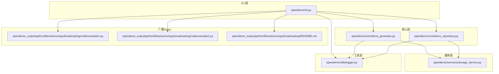
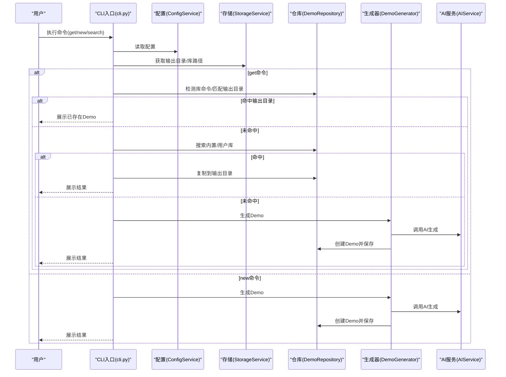
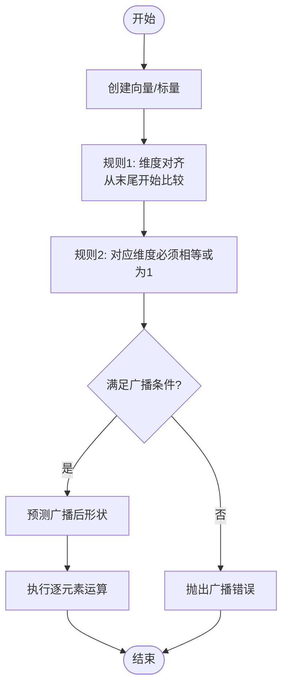
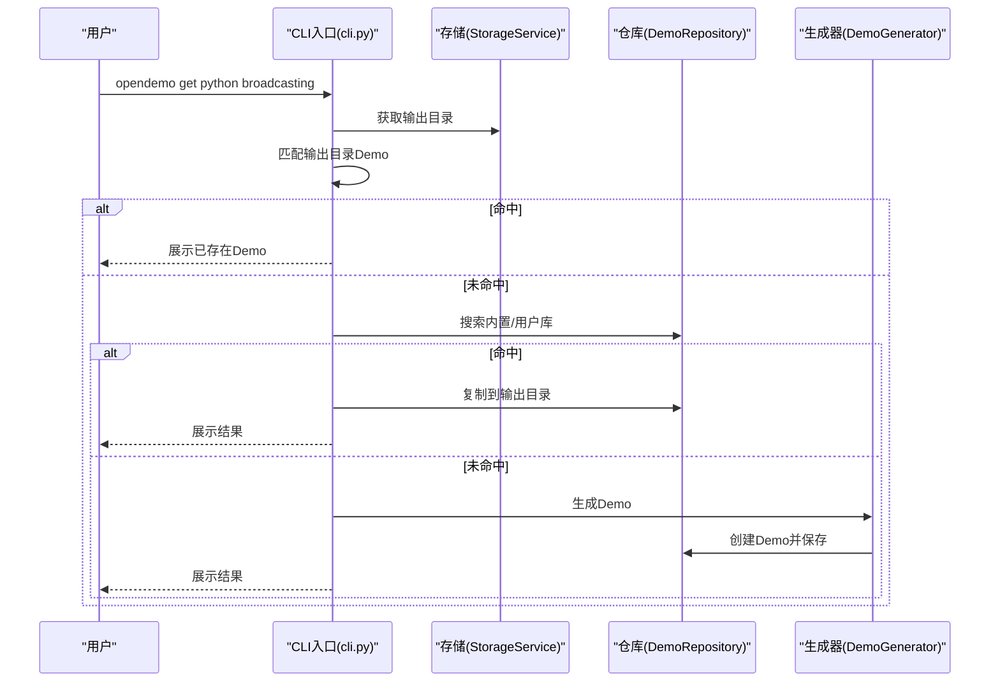
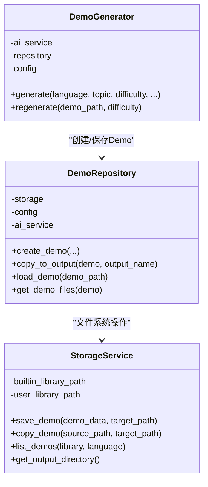
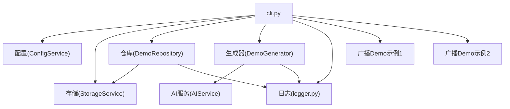

# 广播机制

<cite>
**本文引用的文件**
- [README.md](file://README.md)
- [cli.py](file://opendemo/cli.py)
- [demo_generator.py](file://opendemo/core/demo_generator.py)
- [demo_repository.py](file://opendemo/core/demo_repository.py)
- [storage_service.py](file://opendemo/services/storage_service.py)
- [logger.py](file://opendemo/utils/logger.py)
- [example1.py](file://opendemo_output/python/libraries/numpy/broadcasting/code/example1.py)
- [example2.py](file://opendemo_output/python/libraries/numpy/broadcasting/code/example2.py)
- [README.md（广播Demo）](file://opendemo_output/python/libraries/numpy/broadcasting/README.md)
</cite>

## 目录
1. [简介](#简介)
2. [项目结构](#项目结构)
3. [核心组件](#核心组件)
4. [架构总览](#架构总览)
5. [详细组件分析](#详细组件分析)
6. [依赖关系分析](#依赖关系分析)
7. [性能考量](#性能考量)
8. [故障排查指南](#故障排查指南)
9. [结论](#结论)
10. [附录](#附录)

## 简介
本文件聚焦于“广播机制”的实现与使用，围绕仓库中的NumPy广播Demo展开，同时梳理CLI工具在生成、复制、展示Demo过程中的关键流程。文档以循序渐进的方式呈现，既适合初学者理解广播的基本概念与使用方法，也便于开发者把握CLI工具的内部协作关系与扩展点。

## 项目结构
仓库采用分层组织：CLI入口负责命令解析与流程编排，核心模块负责Demo生成与仓库管理，服务层负责存储与配置，工具层提供日志与格式化能力。广播机制的Demo位于Python库Demo的NumPy子目录中，体现“库Demo”的组织方式。

图表来源
- [cli.py](file://opendemo/cli.py#L1-L120)
- [demo_generator.py](file://opendemo/core/demo_generator.py#L1-L120)
- [demo_repository.py](file://opendemo/core/demo_repository.py#L1-L120)
- [storage_service.py](file://opendemo/services/storage_service.py#L1-L120)
- [logger.py](file://opendemo/utils/logger.py#L1-L65)
- [example1.py](file://opendemo_output/python/libraries/numpy/broadcasting/code/example1.py#L1-L30)
- [example2.py](file://opendemo_output/python/libraries/numpy/broadcasting/code/example2.py#L1-L40)
- [README.md（广播Demo）](file://opendemo_output/python/libraries/numpy/broadcasting/README.md#L1-L124)

章节来源
- [README.md](file://README.md#L449-L525)
- [cli.py](file://opendemo/cli.py#L1-L120)

## 核心组件
- CLI入口：解析命令、初始化服务、协调生成/获取/搜索流程，并在生成后更新README统计。
- Demo生成器：协调AI服务生成Demo，补充元数据并创建Demo目录与文件。
- Demo仓库：统一管理Demo与库Demo，提供复制、查询、缓存与贡献相关能力。
- 存储服务：负责文件系统操作（读写、复制、删除、迁移）、输出目录与库路径管理。
- 日志工具：统一日志配置与获取，支持控制台与文件输出。
- 广播Demo：NumPy广播机制的两个示例，分别演示标量与向量、二维与一维数组的广播行为。

章节来源
- [cli.py](file://opendemo/cli.py#L319-L612)
- [demo_generator.py](file://opendemo/core/demo_generator.py#L1-L143)
- [demo_repository.py](file://opendemo/core/demo_repository.py#L1-L250)
- [storage_service.py](file://opendemo/services/storage_service.py#L1-L220)
- [logger.py](file://opendemo/utils/logger.py#L1-L65)
- [example1.py](file://opendemo_output/python/libraries/numpy/broadcasting/code/example1.py#L1-L30)
- [example2.py](file://opendemo_output/python/libraries/numpy/broadcasting/code/example2.py#L1-L40)

## 架构总览
CLI命令“get”与“new”贯穿Demo生命周期：从解析关键词、匹配输出目录、搜索内置/用户库，到AI生成与复制到输出目录，最终展示结果与可执行步骤。广播Demo作为Python库Demo的一部分，遵循相同的目录与元数据规范。

图表来源
- [cli.py](file://opendemo/cli.py#L319-L612)
- [demo_generator.py](file://opendemo/core/demo_generator.py#L1-L143)
- [demo_repository.py](file://opendemo/core/demo_repository.py#L1-L250)
- [storage_service.py](file://opendemo/services/storage_service.py#L1-L220)

## 详细组件分析

### 广播Demo示例与规则
- 示例1：标量与向量的广播运算，展示NumPy如何将标量“虚拟扩展”到向量的每个元素，从而实现逐元素运算。
- 示例2：二维数组与一维数组的广播，演示通过reshape将列向量调整为(3,1)以按列广播，以及行向量(3,)按行广播的两种常见模式。
- 文档还总结了广播的两条基本规则、常见报错与注意事项，以及如何使用广播实现Z-score标准化等实践。

图表来源
- [README.md（广播Demo）](file://opendemo_output/python/libraries/numpy/broadcasting/README.md#L80-L124)
- [example1.py](file://opendemo_output/python/libraries/numpy/broadcasting/code/example1.py#L1-L30)
- [example2.py](file://opendemo_output/python/libraries/numpy/broadcasting/code/example2.py#L1-L40)

章节来源
- [README.md（广播Demo）](file://opendemo_output/python/libraries/numpy/broadcasting/README.md#L1-L124)
- [example1.py](file://opendemo_output/python/libraries/numpy/broadcasting/code/example1.py#L1-L30)
- [example2.py](file://opendemo_output/python/libraries/numpy/broadcasting/code/example2.py#L1-L40)

### CLI命令与Demo生命周期
- get命令：优先在输出目录匹配Demo，若未命中则在内置/用户库中搜索，最后回退到AI生成；支持“new”强制重新生成并在输出目录展示。
- new命令：检测是否为库Demo（通过库名识别），随后调用生成器生成并复制到输出目录，最后更新README统计。
- 搜索命令：列出各语言的Demo数量与过滤结果，便于定位目标Demo。

图表来源
- [cli.py](file://opendemo/cli.py#L319-L612)
- [demo_generator.py](file://opendemo/core/demo_generator.py#L1-L143)
- [demo_repository.py](file://opendemo/core/demo_repository.py#L1-L250)
- [storage_service.py](file://opendemo/services/storage_service.py#L1-L220)

章节来源
- [cli.py](file://opendemo/cli.py#L319-L612)

### Demo生成器与仓库协作
- 生成器负责调用AI服务生成Demo数据，补充元数据（作者、时间戳、版本、验证状态等），并通过仓库创建Demo目录与文件。
- 仓库负责将Demo复制到输出目录、加载元数据、维护缓存、支持库Demo的特征扫描与复制。

图表来源
- [demo_generator.py](file://opendemo/core/demo_generator.py#L1-L143)
- [demo_repository.py](file://opendemo/core/demo_repository.py#L1-L250)
- [storage_service.py](file://opendemo/services/storage_service.py#L1-L220)

章节来源
- [demo_generator.py](file://opendemo/core/demo_generator.py#L1-L143)
- [demo_repository.py](file://opendemo/core/demo_repository.py#L1-L250)
- [storage_service.py](file://opendemo/services/storage_service.py#L1-L220)

## 依赖关系分析
- CLI依赖配置、存储、仓库、生成器与验证器，形成清晰的控制流。
- 生成器依赖AI服务与仓库，仓库依赖存储服务，日志贯穿各层。
- 广播Demo作为Python库Demo的一部分，遵循统一的目录结构与元数据规范，便于CLI统一处理。

图表来源
- [cli.py](file://opendemo/cli.py#L1-L120)
- [demo_generator.py](file://opendemo/core/demo_generator.py#L1-L143)
- [demo_repository.py](file://opendemo/core/demo_repository.py#L1-L250)
- [storage_service.py](file://opendemo/services/storage_service.py#L1-L220)
- [logger.py](file://opendemo/utils/logger.py#L1-L65)
- [example1.py](file://opendemo_output/python/libraries/numpy/broadcasting/code/example1.py#L1-L30)
- [example2.py](file://opendemo_output/python/libraries/numpy/broadcasting/code/example2.py#L1-L40)

章节来源
- [cli.py](file://opendemo/cli.py#L1-L120)
- [demo_generator.py](file://opendemo/core/demo_generator.py#L1-L143)
- [demo_repository.py](file://opendemo/core/demo_repository.py#L1-L250)
- [storage_service.py](file://opendemo/services/storage_service.py#L1-L220)
- [logger.py](file://opendemo/utils/logger.py#L1-L65)

## 性能考量
- 广播机制避免显式复制数据，属于“虚拟扩展”，在大规模数组运算中显著降低内存占用与拷贝成本。
- 在CLI侧，仓库对Demo与库元数据做了缓存，减少重复I/O与解析开销。
- 存储服务提供迁移标记与目录确保，保障库Demo的首次访问与后续访问的稳定性。

章节来源
- [README.md（广播Demo）](file://opendemo_output/python/libraries/numpy/broadcasting/README.md#L110-L124)
- [demo_repository.py](file://opendemo/core/demo_repository.py#L90-L120)
- [storage_service.py](file://opendemo/services/storage_service.py#L279-L375)

## 故障排查指南
- 广播错误：当两个数组对应维度既不相等又都不是1时，会触发广播错误。可通过调整形状或使用reshape实现对齐。
- 生成失败：检查AI API密钥配置、输出目录权限与磁盘空间；查看日志文件定位具体错误。
- 未找到Demo：确认关键词与语言是否正确，或使用“search”命令列出可用Demo；必要时使用“new”强制生成。

章节来源
- [README.md（广播Demo）](file://opendemo_output/python/libraries/numpy/broadcasting/README.md#L109-L118)
- [cli.py](file://opendemo/cli.py#L420-L466)
- [logger.py](file://opendemo/utils/logger.py#L1-L65)

## 结论
本仓库通过CLI工具与核心模块的协同，实现了从搜索、生成到展示的完整Demo生命周期管理；其中NumPy广播Demo作为Python库Demo的典型代表，直观体现了广播机制在数组运算中的高效与简洁。CLI层的职责清晰、依赖关系明确，便于扩展与维护。

## 附录
- 快速开始：在输出目录中运行广播Demo示例，观察标量与向量、二维与一维数组的广播效果。
- 扩展建议：在CLI中增加“广播规则可视化”或“形状预测工具”，辅助用户理解广播行为。