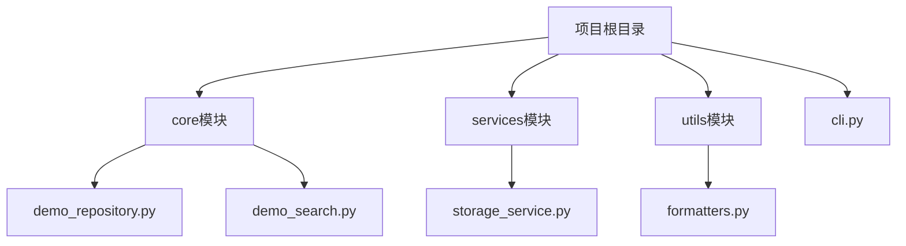
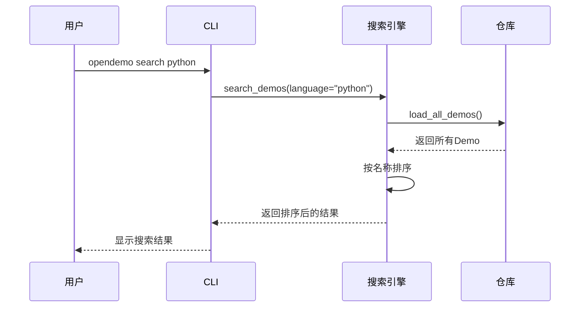
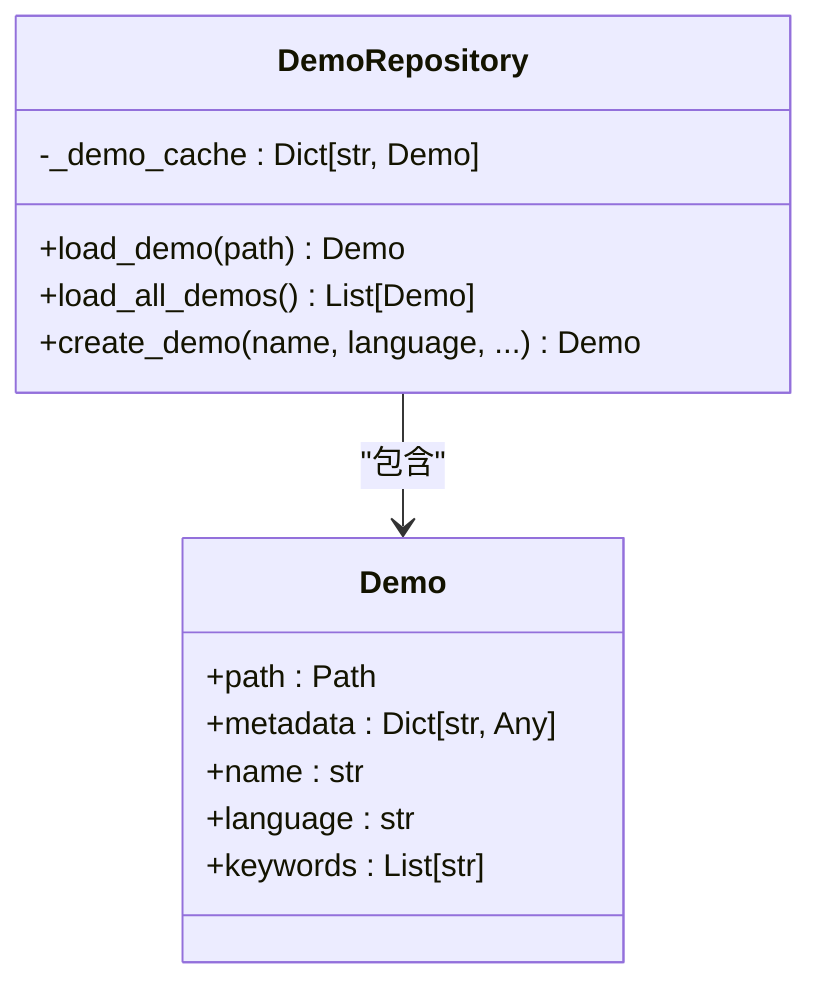
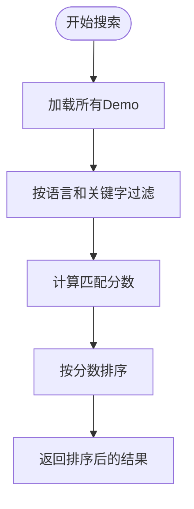
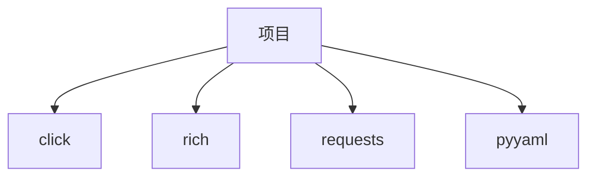

# 排序与搜索

<cite>
**本文档引用的文件**   
- [cli.py](file://opendemo/cli.py)
- [demo_repository.py](file://opendemo/core/demo_repository.py)
- [demo_search.py](file://opendemo/core/demo_search.py)
- [storage_service.py](file://opendemo/services/storage_service.py)
- [formatters.py](file://opendemo/utils/formatters.py)
- [README.md](file://README.md)
</cite>

## 目录
1. [简介](#简介)
2. [项目结构](#项目结构)
3. [核心组件](#核心组件)
4. [排序与搜索机制](#排序与搜索机制)
5. [详细组件分析](#详细组件分析)
6. [依赖分析](#依赖分析)
7. [性能考虑](#性能考虑)
8. [故障排除指南](#故障排除指南)
9. [结论](#结论)

## 简介
本项目是一个智能化的编程学习CLI工具，旨在帮助开发者快速获取高质量、可执行的Demo代码。系统支持多种编程语言，包括Python、Go、Node.js和Kubernetes等，并提供了搜索、获取和AI生成Demo的功能。通过`opendemo search`和`opendemo get`命令，用户可以方便地查找和获取所需的学习资源。

## 项目结构
项目采用模块化设计，主要分为核心模块、服务模块和工具模块。核心模块负责Demo的管理与搜索，服务模块提供配置和存储服务，工具模块则包含格式化和日志记录功能。这种分层架构使得系统易于维护和扩展。

**图源**
- [demo_repository.py](file://opendemo/core/demo_repository.py)
- [demo_search.py](file://opendemo/core/demo_search.py)
- [storage_service.py](file://opendemo/services/storage_service.py)
- [formatters.py](file://opendemo/utils/formatters.py)

**节源**
- [README.md](file://README.md)

## 核心组件
核心组件包括Demo仓库管理、搜索引擎和CLI接口。`DemoRepository`类负责管理所有Demo资源，`DemoSearch`类提供统一的搜索能力，而`cli.py`则作为用户交互的入口点。这些组件协同工作，实现了Demo的高效管理和检索。

**节源**
- [demo_repository.py](file://opendemo/core/demo_repository.py)
- [demo_search.py](file://opendemo/core/demo_search.py)
- [cli.py](file://opendemo/cli.py)

## 排序与搜索机制
排序与搜索机制是本项目的核心功能之一。当用户执行`opendemo search`命令时，系统会调用`DemoSearch`类的`search_demos`方法，该方法根据语言和关键字过滤Demo，并按匹配分数排序。匹配分数由多个因素决定，包括名称匹配、关键字匹配和描述匹配等。

**图源**
- [cli.py](file://opendemo/cli.py#L470-L528)
- [demo_search.py](file://opendemo/core/demo_search.py#L43-L82)

**节源**
- [cli.py](file://opendemo/cli.py#L470-L528)
- [demo_search.py](file://opendemo/core/demo_search.py#L43-L82)

## 详细组件分析
### Demo仓库管理
`DemoRepository`类是Demo管理的核心，它提供了加载、创建和更新Demo的功能。通过缓存机制，系统能够快速访问常用的Demo信息，提高了性能。

#### 类图

**图源**
- [demo_repository.py](file://opendemo/core/demo_repository.py#L75-L314)

**节源**
- [demo_repository.py](file://opendemo/core/demo_repository.py#L75-L314)

### 搜索引擎
`DemoSearch`类实现了复杂的搜索逻辑，支持模糊匹配和精确匹配。它利用权重配置来计算每个Demo的匹配分数，并根据分数进行排序。

#### 流程图

**图源**
- [demo_search.py](file://opendemo/core/demo_search.py#L43-L82)

**节源**
- [demo_search.py](file://opendemo/core/demo_search.py#L43-L82)

## 依赖分析
系统依赖于多个外部库，如`click`用于CLI框架，`rich`用于终端美化，`requests`用于API调用。这些依赖通过`pyproject.toml`文件进行管理，确保了项目的可移植性和一致性。

**图源**
- [pyproject.toml](file://pyproject.toml)

**节源**
- [pyproject.toml](file://pyproject.toml)

## 性能考虑
为了提高性能，系统采用了多种优化策略。例如，`DemoRepository`使用缓存来减少重复的文件读取操作；`DemoSearch`通过预计算匹配分数来加快搜索速度。此外，异步操作也被用于网络请求，以避免阻塞主线程。

## 故障排除指南
如果搜索功能无法正常工作，请检查以下几点：
1. 确认`README.md`中列出的语言是否正确。
2. 检查`storage_service.py`中的路径配置是否正确。
3. 确保`demo_search.py`中的权重配置合理。

**节源**
- [README.md](file://README.md)
- [storage_service.py](file://opendemo/services/storage_service.py)
- [demo_search.py](file://opendemo/core/demo_search.py)

## 结论
本项目通过高效的排序与搜索机制，为用户提供了一个便捷的编程学习工具。通过对核心组件的深入分析，我们可以看到系统设计的精巧之处。未来的工作可以集中在进一步优化搜索算法和增加更多编程语言的支持上。