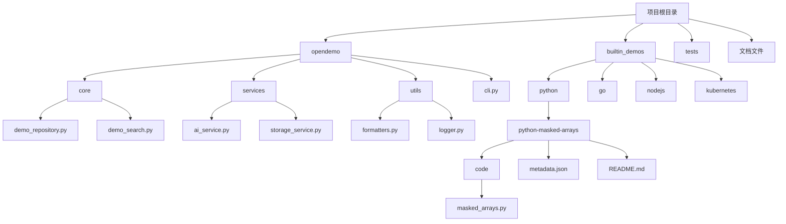
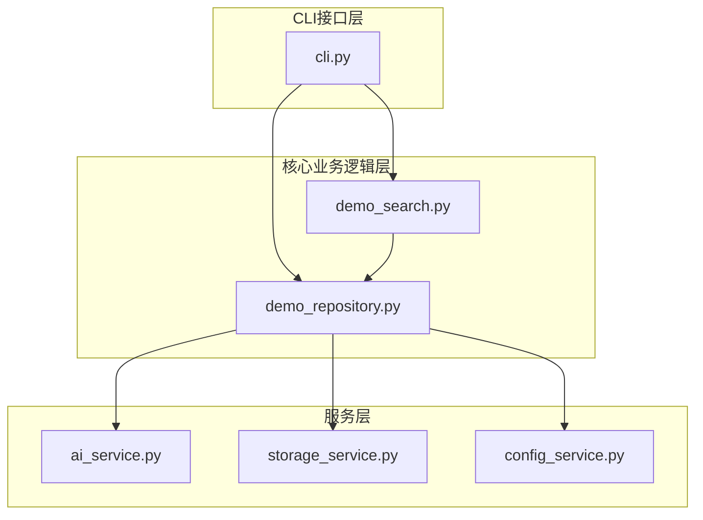
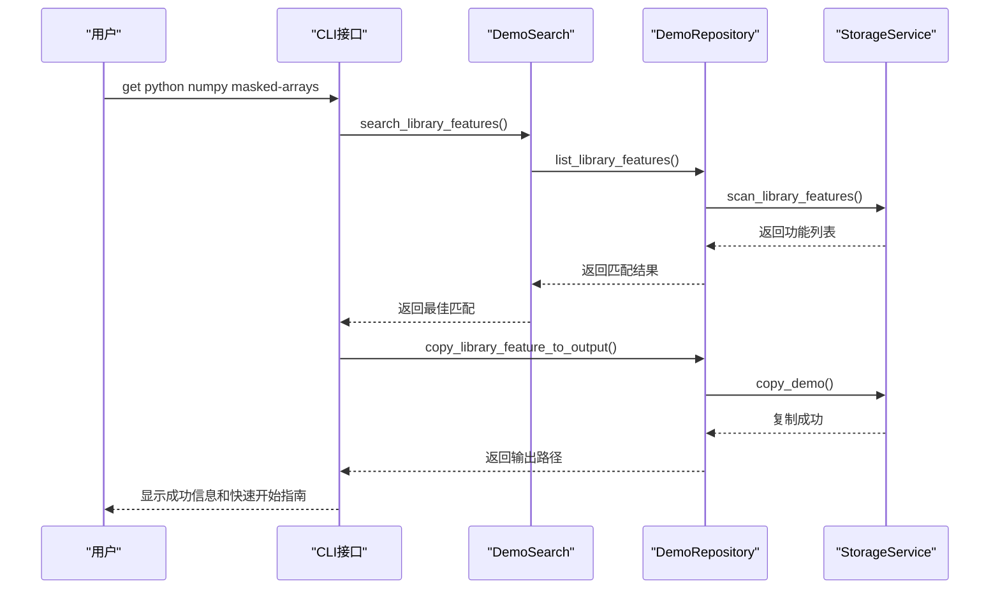
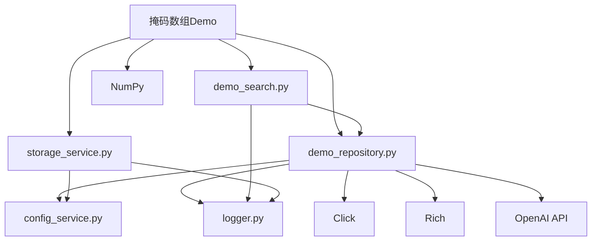

# 掩码数组

<cite>
**本文档引用的文件 **  
- [README.md](file://README.md#L157-L181)
- [masked_arrays.py](file://opendemo/builtin_demos/python/python-masked-arrays/code/masked_arrays.py)
- [demo_repository.py](file://opendemo/core/demo_repository.py)
- [demo_search.py](file://opendemo/core/demo_search.py)
</cite>

## 目录
1. [简介](#简介)
2. [项目结构](#项目结构)
3. [核心组件](#核心组件)
4. [架构概述](#架构概述)
5. [详细组件分析](#详细组件分析)
6. [依赖分析](#依赖分析)
7. [性能考虑](#性能考虑)
8. [故障排除指南](#故障排除指南)
9. [结论](#结论)

## 简介
"掩码数组"是OpenDemo CLI工具中NumPy库系列的一个重要功能模块。该工具是一个智能化的编程学习CLI工具，旨在帮助开发者快速获取高质量、可执行的Demo代码。掩码数组功能允许用户通过命令行快速获取关于NumPy掩码数组的完整示例，包括创建、操作和应用掩码数组的各种场景。通过`opendemo get python numpy masked-arrays`命令，用户可以轻松获取这一特定功能的完整代码示例和文档。

**Section sources**
- [README.md](file://README.md#L157-L181)

## 项目结构
OpenDemo CLI项目采用模块化设计，其结构清晰地分离了核心功能、服务层和工具层。项目根目录包含主要的Python包`opendemo`，其中`core`目录存放核心业务逻辑，`services`目录提供各种服务接口，`utils`目录包含通用工具函数。内置的Demo示例存放在`builtin_demos`目录中，按照编程语言和库进行组织。对于掩码数组功能，相关代码位于`opendemo/builtin_demos/python/python-masked-arrays/code/masked_arrays.py`，而其元数据和文档则在同级目录中。

**Diagram sources **
- [README.md](file://README.md#L87-L181)
- [project_structure](file://project_structure)

**Section sources**
- [README.md](file://README.md#L87-L181)

## 核心组件
掩码数组功能的核心组件包括`demo_repository.py`和`demo_search.py`。`demo_repository.py`负责管理所有Demo资源，提供统一的仓库级别操作接口，包括加载、创建和复制Demo。`demo_search.py`则提供搜索引擎功能，支持对普通Demo和库功能的搜索与匹配。这两个组件协同工作，确保用户能够快速定位并获取所需的掩码数组Demo。当用户执行`get`命令时，系统首先通过`demo_search.py`搜索匹配的Demo，然后由`demo_repository.py`负责将其复制到输出目录。

**Section sources**
- [demo_repository.py](file://opendemo/core/demo_repository.py)
- [demo_search.py](file://opendemo/core/demo_search.py)

## 架构概述
OpenDemo CLI的架构采用分层设计，从上至下分为CLI接口层、核心业务逻辑层和服务层。CLI接口层由`cli.py`实现，负责解析用户命令并调用相应的功能。核心业务逻辑层包含`demo_repository`和`demo_search`等模块，处理Demo的管理和搜索逻辑。服务层提供AI生成、存储和配置管理等基础服务。对于掩码数组功能，整个流程始于用户命令，经过CLI解析后，由核心组件定位并获取相应的Demo，最终通过存储服务将其复制到用户的输出目录。

**Diagram sources **
- [cli.py](file://opendemo/cli.py)
- [demo_repository.py](file://opendemo/core/demo_repository.py)
- [demo_search.py](file://opendemo/core/demo_search.py)

## 详细组件分析

### 掩码数组功能分析
掩码数组功能是NumPy库中的一个重要特性，允许用户在数组中创建和使用掩码来处理缺失或无效数据。在OpenDemo CLI中，该功能通过一个独立的Demo模块实现，包含完整的代码示例和文档。用户可以通过`opendemo get python numpy masked-arrays`命令获取这一功能的完整实现。该Demo展示了如何创建掩码数组、应用各种操作以及处理实际数据场景。

#### 对于API/服务组件：

**Diagram sources **
- [cli.py](file://opendemo/cli.py#L321-L368)
- [demo_search.py](file://opendemo/core/demo_search.py#L177-L216)
- [demo_repository.py](file://opendemo/core/demo_repository.py#L661-L693)
- [storage_service.py](file://opendemo/services/storage_service.py#L168-L189)

**Section sources**
- [cli.py](file://opendemo/cli.py#L321-L368)
- [demo_search.py](file://opendemo/core/demo_search.py#L177-L216)
- [demo_repository.py](file://opendemo/core/demo_repository.py#L661-L693)

## 依赖分析
掩码数组功能的实现依赖于多个核心组件和外部库。在项目内部，它依赖于`demo_repository.py`进行资源管理，`demo_search.py`进行功能搜索，以及`storage_service.py`进行文件操作。外部依赖方面，该功能基于NumPy库实现，需要用户系统中安装NumPy。此外，整个OpenDemo CLI工具依赖于Click库实现命令行接口，Rich库用于终端美化输出，以及OpenAI API用于AI生成新Demo。这些依赖关系确保了掩码数组功能的完整性和可执行性。

**Diagram sources **
- [demo_repository.py](file://opendemo/core/demo_repository.py)
- [demo_search.py](file://opendemo/core/demo_search.py)
- [storage_service.py](file://opendemo/services/storage_service.py)

**Section sources**
- [demo_repository.py](file://opendemo/core/demo_repository.py)
- [demo_search.py](file://opendemo/core/demo_search.py)
- [storage_service.py](file://opendemo/services/storage_service.py)

## 性能考虑
在实现掩码数组功能时，系统考虑了多个性能因素。首先，通过缓存机制优化了Demo的加载和搜索性能，`demo_repository.py`中的缓存设计减少了重复的文件系统操作。其次，搜索算法采用了加权匹配策略，优先考虑精确匹配和前缀匹配，提高了搜索效率。此外，文件复制操作使用了高效的`shutil.copytree`方法，确保了大文件Demo的快速复制。对于AI生成功能，系统实现了重试机制和超时控制，保证了在API响应缓慢时的用户体验。

## 故障排除指南
如果在使用掩码数组功能时遇到问题，可以参考以下故障排除步骤。首先，确保已正确安装NumPy库，可以通过`pip install numpy`命令进行安装。其次，检查OpenDemo CLI的配置是否正确，特别是AI API密钥的配置。如果搜索不到预期的Demo，可以尝试使用`search`命令查看所有可用的NumPy功能列表。对于文件复制失败的问题，检查目标目录的写权限。如果AI生成功能无法工作，验证API密钥的有效性，并确保网络连接正常。

**Section sources**
- [cli.py](file://opendemo/cli.py#L427-L431)
- [ai_service.py](file://opendemo/services/ai_service.py#L309-L346)

## 结论
掩码数组功能作为OpenDemo CLI工具的一部分，为用户提供了一个便捷的方式来学习和使用NumPy的高级特性。通过清晰的架构设计和模块化实现，该功能能够高效地响应用户请求，提供高质量的代码示例。项目的分层架构和组件化设计不仅保证了功能的稳定性，也为未来的扩展提供了良好的基础。用户可以通过简单的命令行操作，快速获取和学习掩码数组的相关知识，极大地提高了学习和开发效率。