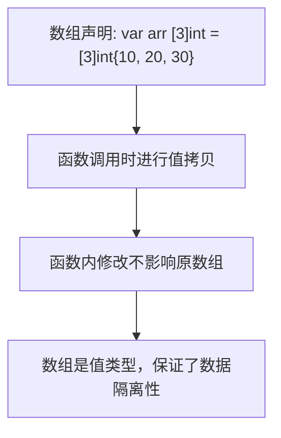
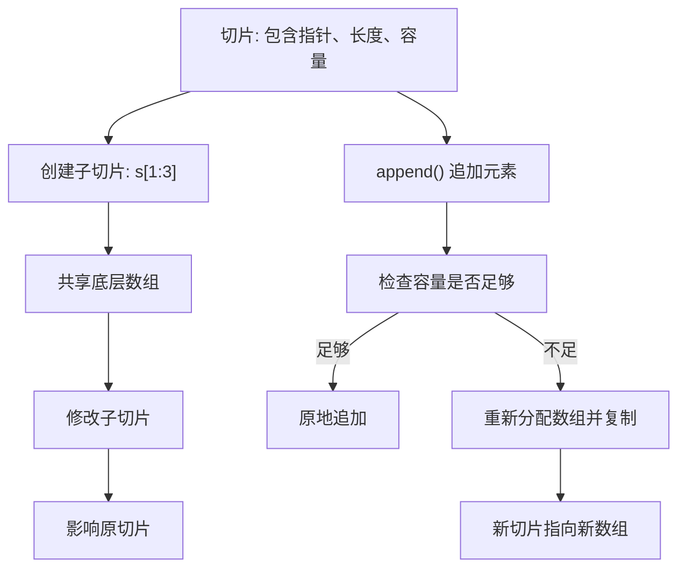
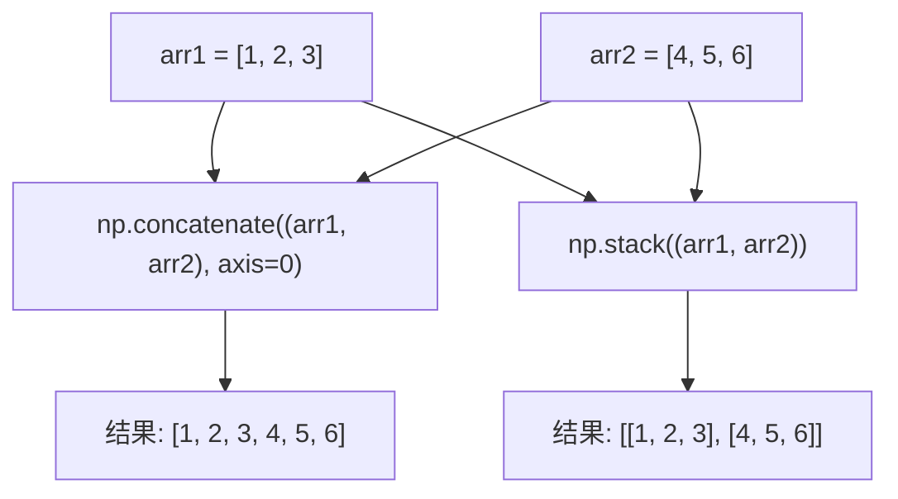
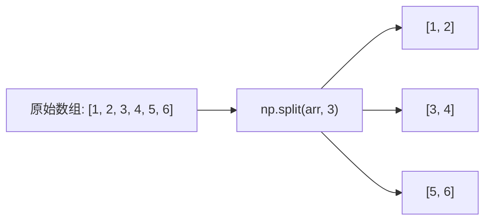
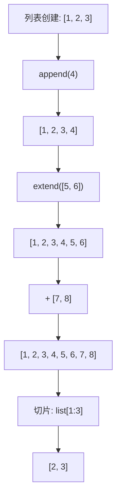

# 数组拼接与分割

<cite>
**本文档引用的文件**   
- [arrays_slices_demo.go](file://opendemo_output/go/go-go-demo-7/arrays_slices_demo.go)
- [slice_demo.go](file://opendemo_output/go/go-go-demo-7/slice_demo.go)
- [slices.go](file://opendemo_output/go/go-go-demo-7/slices.go)
- [slices_advanced.go](file://opendemo_output/go/go-go-demo-7/slices_advanced.go)
- [example1.py](file://opendemo_output/python/libraries/numpy/array-concatenation/code/example1.py)
- [example2.py](file://opendemo_output/python/libraries/numpy/array-concatenation/code/example2.py)
- [list_basics.py](file://opendemo_output/python/list-operations/code/list_basics.py)
- [README.md](file://opendemo_output/go/go-go-demo-7/README.md)
- [README.md](file://opendemo_output/python/libraries/numpy/array-concatenation/README.md)
</cite>

## 目录
1. [简介](#简介)
2. [Go语言中的数组与切片](#go语言中的数组与切片)
3. [Python NumPy数组操作](#python-numpy数组操作)
4. [Python列表操作](#python列表操作)
5. [核心概念对比](#核心概念对比)

## 简介
本文档旨在全面介绍在Go语言和Python语言中进行数组拼接与分割的核心概念和实践方法。通过分析`opendemo-cli`项目中的相关演示代码，我们将深入探讨Go语言的数组与切片机制，以及Python中NumPy库和原生列表在处理数组操作时的不同方式。文档将涵盖基础语法、关键函数、内存管理机制以及最佳实践，帮助开发者理解这些数据结构的本质差异和应用场景。

**Section sources**
- [README.md](file://opendemo_output/go/go-go-demo-7/README.md)
- [README.md](file://opendemo_output/python/libraries/numpy/array-concatenation/README.md)

## Go语言中的数组与切片
Go语言提供了两种主要的序列数据结构：数组（Array）和切片（Slice）。理解它们的区别是掌握Go语言数据处理的关键。

### 数组（Array）
Go中的数组是值类型，具有固定长度。一旦声明，其大小无法改变。当数组作为参数传递给函数时，会进行值拷贝，这意味着函数内部对数组的修改不会影响原始数组。

**Diagram sources**
- [arrays_slices_demo.go](file://opendemo_output/go/go-go-demo-7/arrays_slices_demo.go)

### 切片（Slice）
切片是Go语言中更常用和更强大的数据结构。它是一个引用类型，是对底层数组的动态视图。切片本身包含三个部分：指向底层数组的指针、长度（len）和容量（cap）。

#### 切片的核心操作
- **创建与初始化**：使用`[]T{...}`语法创建切片。
- **追加元素**：使用`append()`函数向切片添加元素。当切片的长度超过其容量时，Go会自动分配一个新的、更大的底层数组，并将原数据复制过去，这个过程称为扩容。
- **创建子切片**：使用`s[low:high]`语法创建子切片。子切片与原切片共享同一底层数组，因此对子切片的修改在未触发扩容的情况下会影响原切片。
- **复制切片**：使用`copy()`函数可以创建一个独立的副本，避免意外的数据共享。

**Diagram sources**
- [slice_demo.go](file://opendemo_output/go/go-go-demo-7/slice_demo.go)
- [slices.go](file://opendemo_output/go/go-go-demo-7/slices.go)
- [slices_advanced.go](file://opendemo_output/go/go-go-demo-7/slices_advanced.go)

**Section sources**
- [slice_demo.go](file://opendemo_output/go/go-go-demo-7/slice_demo.go)
- [slices.go](file://opendemo_output/go/go-go-demo-7/slices.go)
- [slices_advanced.go](file://opendemo_output/go/go-go-demo-7/slices_advanced.go)

## Python NumPy数组操作
NumPy是Python中用于科学计算的核心库，其`ndarray`对象提供了高效的多维数组操作。

### 数组拼接
NumPy提供了多种数组拼接函数，主要区别在于它们如何处理维度。

- **`np.concatenate()`**：在现有的轴上连接数组。这是最通用的拼接函数。
  - `axis=0`：沿第一个轴（通常是行）拼接，实现垂直拼接。
  - `axis=1`：沿第二个轴（通常是列）拼接，实现水平拼接。
- **`np.stack()`**：创建一个新的轴来堆叠数组。这会增加数组的维度。
  - 例如，将两个一维数组`stack`后，会得到一个二维数组。

**Diagram sources**
- [example1.py](file://opendemo_output/python/libraries/numpy/array-concatenation/code/example1.py)

### 数组分割
`np.split()`函数用于将一个数组分割成多个子数组。

- **等分分割**：`np.split(arr, 3)`会将数组`arr`平均分成3个部分。数组的长度必须能被分割数整除。
- **指定位置分割**：`np.split(arr, [2, 4])`会在索引2和4处进行分割，生成三个子数组。
- **按轴分割**：对于多维数组，可以使用`axis`参数指定沿哪个轴进行分割。

**Diagram sources**
- [example2.py](file://opendemo_output/python/libraries/numpy/array-concatenation/code/example2.py)

**Section sources**
- [example1.py](file://opendemo_output/python/libraries/numpy/array-concatenation/code/example1.py)
- [example2.py](file://opendemo_output/python/libraries/numpy/array-concatenation/code/example2.py)

## Python列表操作
Python的原生列表（List）是一种动态数组，功能非常灵活。

### 列表的拼接
Python列表的拼接主要通过`+`操作符和`extend()`方法实现。

- **`+` 操作符**：创建一个新列表，包含两个列表的所有元素。例如，`list1 + list2`。
- **`list.extend(iterable)`**：将一个可迭代对象的所有元素添加到列表末尾，直接修改原列表。
- **`list.append(item)`**：将单个元素作为一个整体添加到列表末尾。

### 列表的分割
Python列表的分割主要通过切片（Slicing）语法实现。

- **`list[start:end]`**：创建一个从索引`start`到`end-1`的新列表。
- **`list[start:end:step]`**：可以指定步长，例如`list[::-1]`可以反转列表。
- 虽然Python列表没有直接的`split`函数，但可以通过切片或列表推导式来实现复杂的分割逻辑。

**Diagram sources**
- [list_basics.py](file://opendemo_output/python/list-operations/code/list_basics.py)

**Section sources**
- [list_basics.py](file://opendemo_output/python/list-operations/code/list_basics.py)

## 核心概念对比
| 特性 | Go 数组 | Go 切片 | Python 列表 | NumPy 数组 |
| :--- | :--- | :--- | :--- | :--- |
| **类型** | 值类型 | 引用类型 | 引用类型 | 引用类型 |
| **长度** | 固定 | 动态 | 动态 | 固定（创建后） |
| **内存** | 连续 | 连续（底层数组） | 不连续（对象引用） | 连续 |
| **拼接** | 不支持 | `append()` | `+`, `extend()` | `concatenate()`, `stack()` |
| **分割** | 通过切片 | 通过切片 | 通过切片 | `split()` |
| **性能** | 高 | 高 | 中 | 极高（C实现） |
| **适用场景** | 小型、固定大小的数据 | 通用序列操作 | 通用数据容器 | 科学计算、大数据 |

**Section sources**
- [arrays_slices_demo.go](file://opendemo_output/go/go-go-demo-7/arrays_slices_demo.go)
- [slice_demo.go](file://opendemo_output/go/go-go-demo-7/slice_demo.go)
- [example1.py](file://opendemo_output/python/libraries/numpy/array-concatenation/code/example1.py)
- [list_basics.py](file://opendemo_output/python/list-operations/code/list_basics.py)