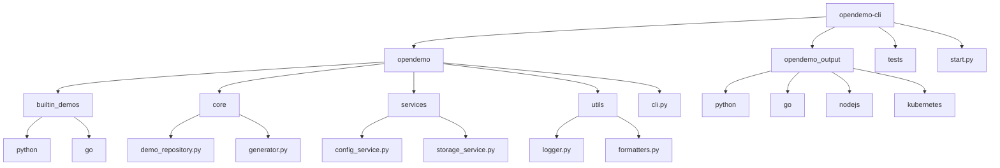
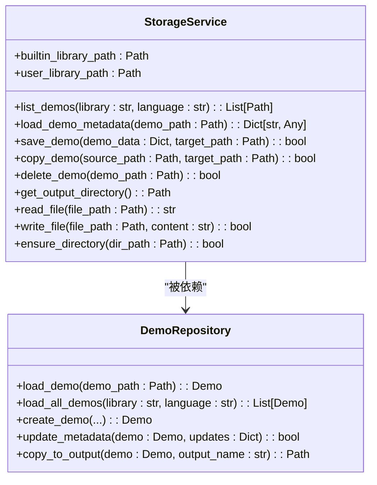
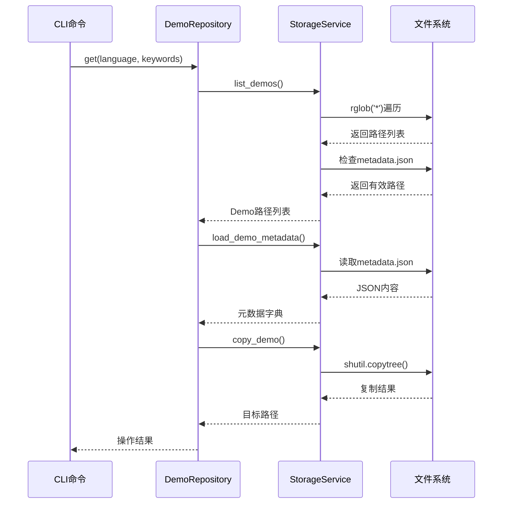
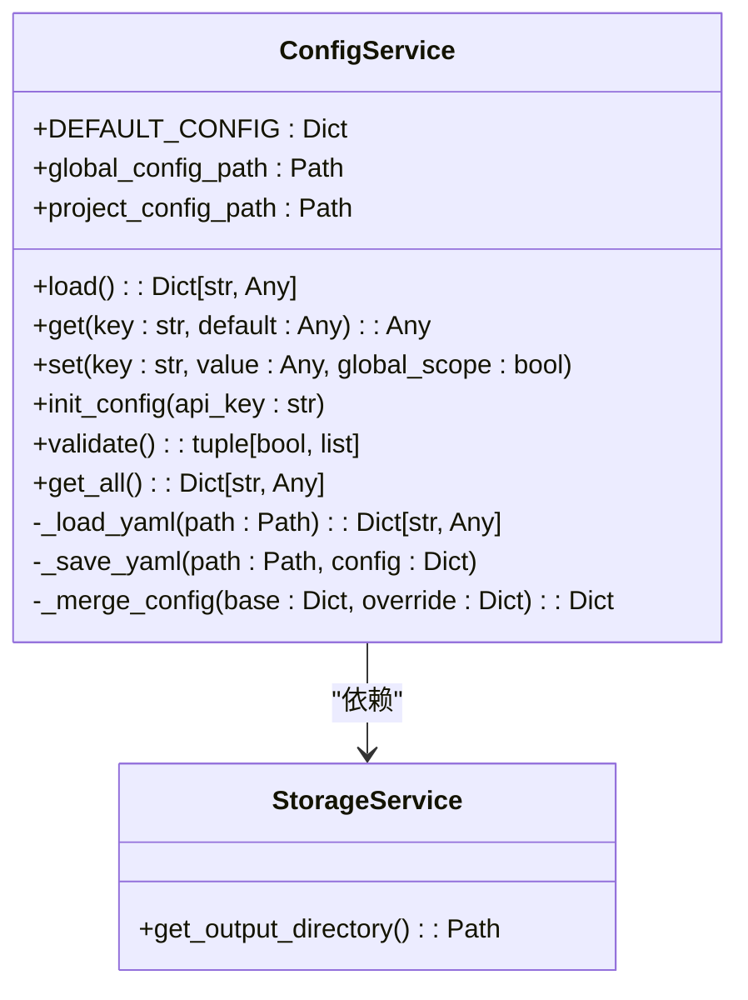
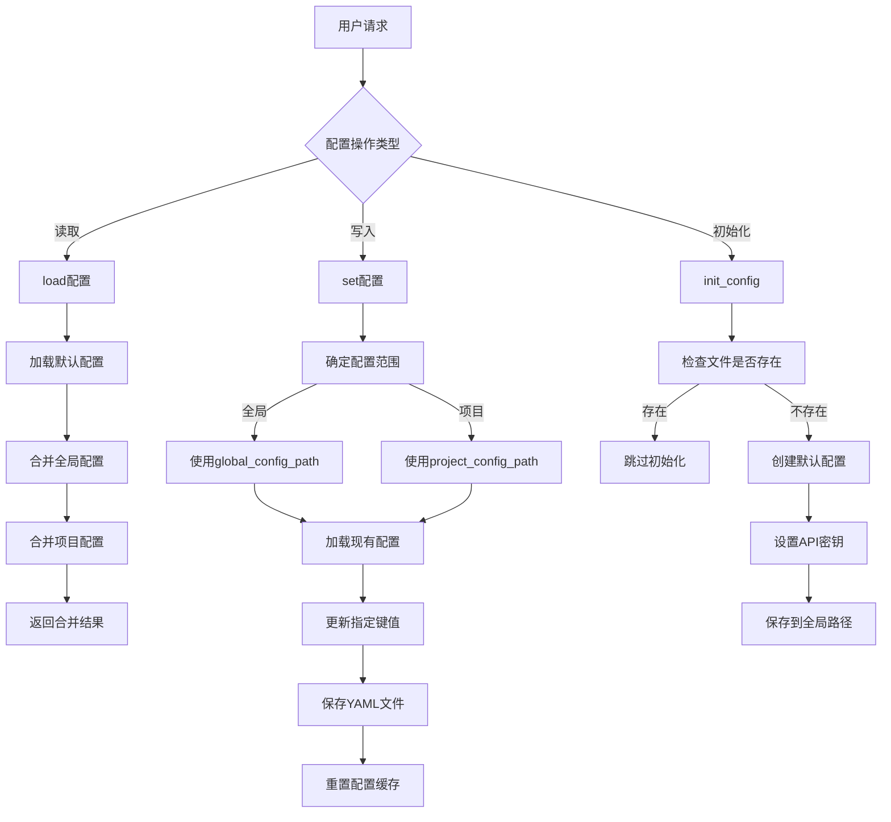
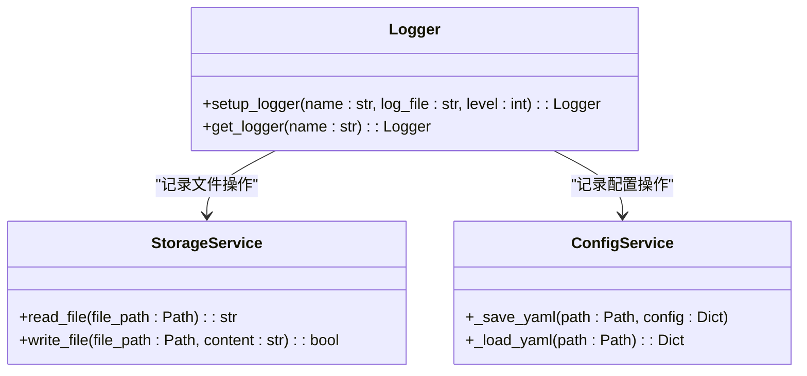
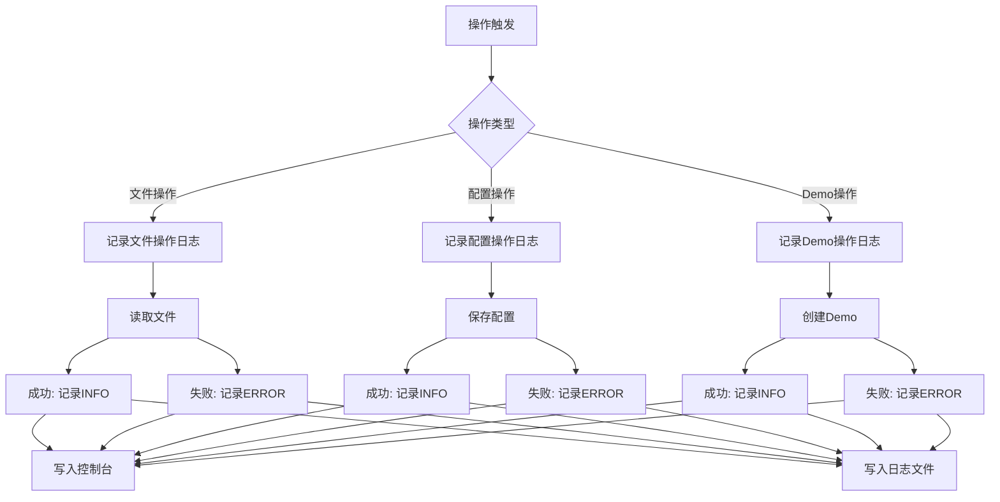
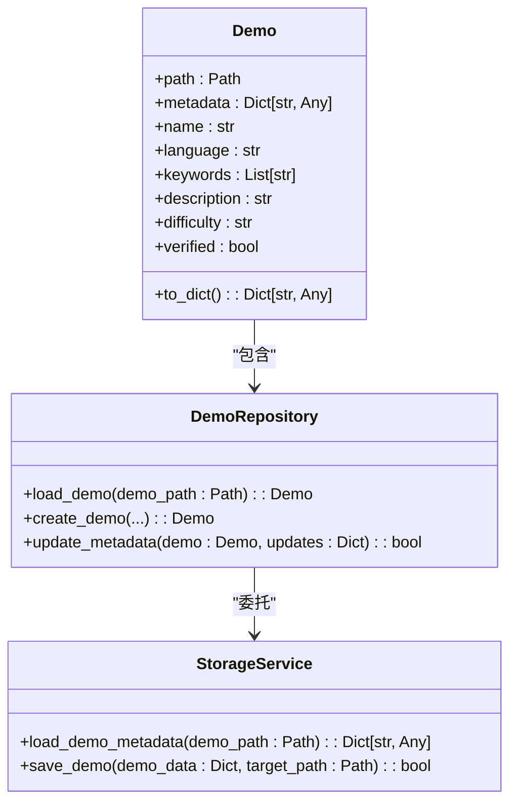
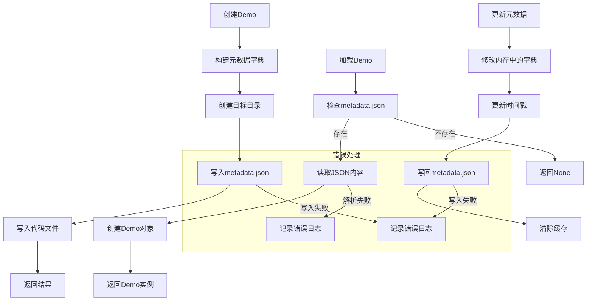
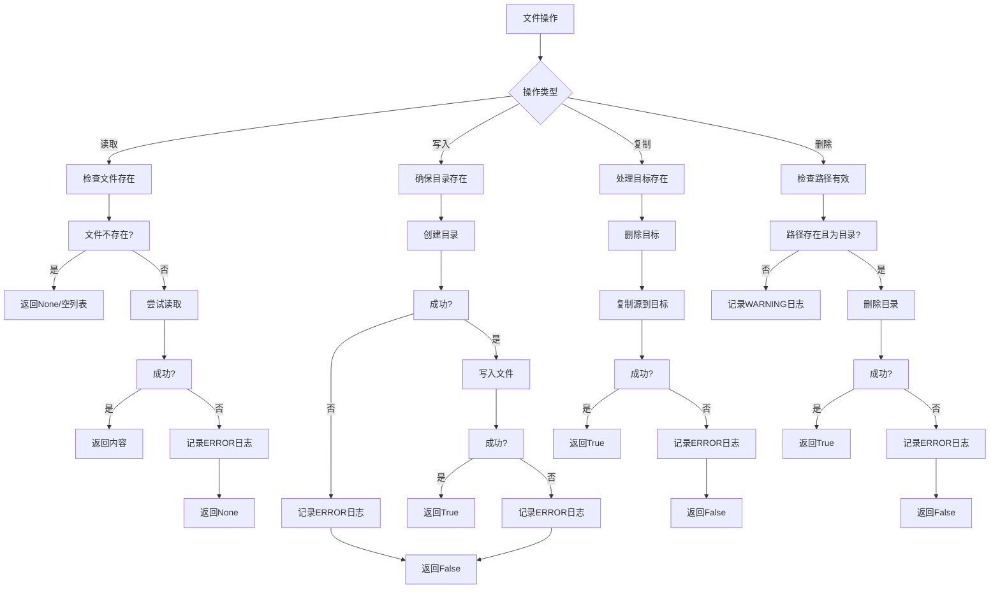

# 文件读写操作

<cite>
**本文档引用的文件**   
- [cli.py](file://opendemo/cli.py)
- [storage_service.py](file://opendemo/services/storage_service.py)
- [demo_repository.py](file://opendemo/core/demo_repository.py)
- [config_service.py](file://opendemo/services/config_service.py)
- [logger.py](file://opendemo/utils/logger.py)
- [metadata.json](file://opendemo_output/python/tuple-basics/metadata.json)
- [README.md](file://opendemo_output/python/tuple-basics/README.md)
- [tuple_basics.py](file://opendemo_output/python/tuple-basics/code/tuple_basics.py)
</cite>

## 目录
1. [简介](#简介)
2. [项目结构](#项目结构)
3. [核心组件](#核心组件)
4. [文件读写操作实现](#文件读写操作实现)
5. [配置管理与持久化](#配置管理与持久化)
6. [日志记录机制](#日志记录机制)
7. [数据序列化与反序列化](#数据序列化与反序列化)
8. [错误处理与异常管理](#错误处理与异常管理)
9. [最佳实践与安全考虑](#最佳实践与安全考虑)

## 简介

本项目是一个智能化编程学习CLI工具，旨在帮助开发者快速获取高质量、可执行的Demo代码。系统通过命令行接口提供搜索、获取和生成代码示例的功能，支持多种编程语言和第三方库。

在文件读写操作方面，系统实现了完整的文件系统交互机制，包括配置文件管理、元数据持久化、日志记录、Demo代码存储等功能。这些操作贯穿于整个应用的生命周期，从用户配置到Demo生成，再到结果输出，都依赖于稳健的文件读写能力。

系统采用分层架构设计，将文件操作封装在专门的服务层中，确保了代码的可维护性和可扩展性。通过统一的API接口，上层业务逻辑可以安全、高效地进行文件操作，而无需直接处理底层细节。

## 项目结构



**图示来源**
- [cli.py](file://opendemo/cli.py)
- [storage_service.py](file://opendemo/services/storage_service.py)

**本节来源**
- [cli.py](file://opendemo/cli.py)
- [storage_service.py](file://opendemo/services/storage_service.py)

## 核心组件

系统的核心组件围绕文件读写操作构建，主要包括存储服务、配置服务、Demo仓库和日志工具。这些组件协同工作，实现了完整的文件系统交互功能。

存储服务（StorageService）是文件操作的核心，提供了文件读取、写入、复制、删除等基本操作。配置服务（ConfigService）负责管理用户和项目的配置信息，确保设置的持久化。Demo仓库（DemoRepository）则封装了Demo相关的文件操作，包括元数据加载和保存。日志工具（logger）提供了结构化的日志记录功能，便于问题追踪和系统监控。

这些组件通过清晰的接口定义和依赖注入机制相互协作，形成了一个稳定可靠的文件操作体系。每个组件都有明确的职责边界，遵循单一职责原则，提高了代码的可测试性和可维护性。

**本节来源**
- [storage_service.py](file://opendemo/services/storage_service.py#L17-L375)
- [config_service.py](file://opendemo/services/config_service.py#L16-L280)
- [demo_repository.py](file://opendemo/core/demo_repository.py#L75-L800)
- [logger.py](file://opendemo/utils/logger.py#L1-L65)

## 文件读写操作实现

### 存储服务设计



**图示来源**
- [storage_service.py](file://opendemo/services/storage_service.py#L17-L375)
- [demo_repository.py](file://opendemo/core/demo_repository.py#L75-L800)

存储服务是文件读写操作的核心实现，提供了全面的文件系统交互功能。服务通过`read_file`和`write_file`方法实现了基本的文件读写操作，采用UTF-8编码确保文本内容的正确处理。

在读取文件时，系统使用`with open()`语句确保文件资源的正确释放，即使发生异常也能保证文件被关闭。写入文件前，服务会自动创建必要的目录结构，避免因路径不存在而导致的错误。这种设计提高了API的易用性，减少了调用方的负担。

对于二进制文件操作，系统主要使用`shutil`模块提供的`copytree`和`rmtree`方法，实现了目录的复制和删除功能。这些操作在Demo的迁移和更新过程中发挥着关键作用，确保了文件结构的完整性和一致性。

### 文件操作流程



**图示来源**
- [cli.py](file://opendemo/cli.py#L321-L468)
- [storage_service.py](file://opendemo/services/storage_service.py#L168-L186)
- [demo_repository.py](file://opendemo/core/demo_repository.py#L264-L283)

文件操作流程展示了从用户请求到文件系统交互的完整过程。以`get`命令为例，系统首先通过存储服务列出所有可用的Demo，然后加载相应的元数据，最后将选中的Demo复制到输出目录。

在元数据加载过程中，系统会检查`metadata.json`文件的存在性，并使用`json.load()`方法解析JSON内容。如果文件不存在或解析失败，服务会记录警告日志并返回None，确保错误不会中断主流程。这种容错设计提高了系统的健壮性。

Demo复制操作采用原子性设计，先删除目标目录再进行复制，避免了文件冲突的可能性。操作完成后，系统会记录详细的日志信息，包括源路径和目标路径，便于后续的审计和问题排查。

**本节来源**
- [storage_service.py](file://opendemo/services/storage_service.py#L225-L261)
- [demo_repository.py](file://opendemo/core/demo_repository.py#L107-L129)
- [cli.py](file://opendemo/cli.py#L321-L468)

## 配置管理与持久化

### 配置服务架构



**图示来源**
- [config_service.py](file://opendemo/services/config_service.py#L16-L280)
- [storage_service.py](file://opendemo/services/storage_service.py#L214-L223)

配置服务负责管理系统的配置信息，采用分层配置策略，支持全局配置和项目配置。配置数据以YAML格式存储，提供了良好的可读性和编辑性。服务实现了配置的加载、保存、合并和验证功能，确保配置管理的完整性和一致性。

系统优先加载默认配置，然后合并全局配置文件（`~/.opendemo/config.yaml`），最后应用项目配置文件（`.opendemo.yaml`）。这种层级结构允许用户在不同范围内自定义设置，同时保持了配置的继承性。配置项支持嵌套结构，通过点分隔的键名（如`ai.api_key`）访问深层属性。

配置的持久化通过`_save_yaml`方法实现，该方法确保配置目录的存在，并以UTF-8编码保存YAML文件。YAML的`allow_unicode=True`选项保证了中文字符的正确存储，`default_flow_style=False`选项则生成更易读的格式化输出。

### 配置操作流程



**图示来源**
- [config_service.py](file://opendemo/services/config_service.py#L76-L242)
- [cli.py](file://opendemo/cli.py#L622-L652)

配置操作流程展示了不同类型配置请求的处理逻辑。读取操作采用懒加载策略，只有在首次请求时才从文件系统加载配置，之后的结果会被缓存以提高性能。写入操作则立即持久化到指定的配置文件中，并重置缓存以确保后续读取能获取最新值。

在配置保存过程中，系统会递归创建所需的目录结构，确保配置文件能够成功写入。对于嵌套配置的更新，服务会逐层创建字典结构，避免因中间节点缺失而导致的KeyError。这种设计使得配置更新更加安全和可靠。

配置验证功能在关键操作前执行，检查必要的配置项（如AI API密钥）是否设置，输出目录是否可写等。这有助于在问题发生前及时发现并提示用户，提高了系统的用户体验。

**本节来源**
- [config_service.py](file://opendemo/services/config_service.py#L76-L280)
- [cli.py](file://opendemo/cli.py#L622-L652)

## 日志记录机制

### 日志服务设计



**图示来源**
- [logger.py](file://opendemo/utils/logger.py#L1-L65)
- [storage_service.py](file://opendemo/services/storage_service.py#L225-L261)
- [config_service.py](file://opendemo/services/config_service.py#L108-L125)

日志记录机制采用Python标准库的`logging`模块实现，提供了灵活的日志管理功能。系统通过`setup_logger`函数初始化日志器，支持控制台输出和文件输出两种方式。文件输出使用`RotatingFileHandler`，当日志文件达到10MB时自动轮转，最多保留5个备份文件。

日志格式包含时间戳、日志器名称、级别和消息内容，便于问题追踪和分析。时间戳采用ISO格式，确保了时间信息的标准化。日志级别从INFO开始，记录了系统的主要操作流程，错误信息则使用ERROR级别，便于快速定位问题。

为了避免重复添加处理器，系统在初始化时检查是否已存在处理器。这种设计防止了日志消息的重复输出，保证了日志的清晰性和可读性。每个模块使用独立的日志器名称，如`opendemo`，便于按模块过滤日志。

### 日志记录流程



**图示来源**
- [logger.py](file://opendemo/utils/logger.py#L13-L65)
- [storage_service.py](file://opendemo/services/storage_service.py#L117-L129)
- [config_service.py](file://opendemo/services/config_service.py#L212-L218)

日志记录流程贯穿于系统的主要操作中，包括文件操作、配置管理和Demo处理。每次文件读取或写入都会生成相应的日志记录，成功操作记录为INFO级别，失败操作则记录为ERROR级别，并包含具体的异常信息。

在配置操作中，无论是加载还是保存配置，系统都会记录详细的操作日志。这不仅有助于调试，也为用户提供了操作的透明度。例如，当配置文件被修改时，日志会明确记录"Set ai.api_key = *** in ~/.opendemo/config.yaml"。

Demo操作的日志记录更为详细，包括创建、更新和复制等操作。每个操作都会记录源路径和目标路径，便于追踪文件的生命周期。对于批量操作，如库迁移，系统会记录每个子操作的结果，提供了完整的操作审计轨迹。

**本节来源**
- [logger.py](file://opendemo/utils/logger.py#L13-L65)
- [storage_service.py](file://opendemo/services/storage_service.py#L117-L129)
- [config_service.py](file://opendemo/services/config_service.py#L212-L218)

## 数据序列化与反序列化

### 元数据管理



**图示来源**
- [demo_repository.py](file://opendemo/core/demo_repository.py#L17-L73)
- [storage_service.py](file://opendemo/services/storage_service.py#L107-L167)

元数据管理是系统文件操作的重要组成部分，采用JSON格式存储Demo的元信息。每个Demo目录都包含一个`metadata.json`文件，记录了名称、语言、关键字、描述等属性。这些信息用于Demo的搜索、分类和展示。

系统通过`Demo`类封装元数据，提供了属性访问接口和字典转换功能。`DemoRepository`负责元数据的加载和创建，而`StorageService`则处理底层的文件读写。这种分层设计将业务逻辑与文件操作分离，提高了代码的可维护性。

在序列化过程中，系统使用`json.dump()`方法将字典数据写入文件，设置`ensure_ascii=False`以支持中文字符，`indent=2`以生成格式化的输出。反序列化时，使用`json.load()`读取文件内容，并进行必要的错误处理，确保即使元数据文件损坏也不会导致系统崩溃。

### 序列化操作流程



**图示来源**
- [demo_repository.py](file://opendemo/core/demo_repository.py#L147-L229)
- [storage_service.py](file://opendemo/services/storage_service.py#L131-L167)

序列化操作流程展示了元数据的完整生命周期管理。创建Demo时，系统首先构建包含元数据和文件内容的字典结构，然后创建目标目录，依次写入`metadata.json`和代码文件。这种顺序确保了文件结构的完整性。

加载Demo时，系统优先检查`metadata.json`文件的存在性，然后尝试解析JSON内容。如果文件不存在或解析失败，服务会记录相应的日志并返回None，避免因单个Demo的问题影响整体功能。这种容错机制提高了系统的稳定性。

元数据更新采用先内存后文件的策略，先在内存中修改字典对象，然后一次性写回文件。更新时会自动刷新`updated_at`时间戳，便于追踪修改历史。操作完成后清除相关缓存，确保后续读取能获取最新数据。

**本节来源**
- [demo_repository.py](file://opendemo/core/demo_repository.py#L147-L229)
- [storage_service.py](file://opendemo/services/storage_service.py#L131-L167)

## 错误处理与异常管理

### 异常处理策略



**图示来源**
- [storage_service.py](file://opendemo/services/storage_service.py#L225-L261)
- [demo_repository.py](file://opendemo/core/demo_repository.py#L107-L129)

系统的异常处理策略采用防御性编程原则，对所有文件操作进行前置条件检查和后置结果验证。读取操作首先检查文件是否存在，避免因文件缺失导致的异常。写入操作确保目标目录存在，自动创建必要的路径结构。

在复制操作中，系统采用先删除后复制的策略，避免了目标路径冲突的问题。删除操作则检查路径的有效性，确保只删除目录而非文件，提高了操作的安全性。所有异常情况都会被妥善处理，不会导致程序崩溃。

日志记录是异常处理的重要组成部分，每个失败的操作都会生成详细的错误日志，包括操作类型、文件路径和异常信息。这为问题排查提供了有力支持。同时，服务会返回适当的错误指示（如False或None），让调用方能够根据结果采取相应措施。

### 错误处理实现

```mermaid
classDiagram
class StorageService {
+read_file(file_path : Path) : Optional[str]
+write_file(file_path : Path, content : str) : bool
+copy_demo(source_path : Path, target_path : Path) : bool
+delete_demo(demo_path : Path) : bool
}
class Logger {
+error(msg : str)
+warning(msg : str)
+info(msg : str)
}
StorageService --> Logger : "记录日志"
note right of StorageService
所有文件操作都包含 :
- 异常捕获 (try-except)
- 错误日志记录
- 适当的返回值
- 资源清理 (with语句)
end
```

**图示来源**
- [storage_service.py](file://opendemo/services/storage_service.py#L225-L261)
- [logger.py](file://opendemo/utils/logger.py#L7-L65)

错误处理实现在`StorageService`中得到了充分体现。每个文件操作方法都使用try-except块捕获可能的异常，如`FileNotFoundError`、`PermissionError`等。捕获异常后，系统会通过日志工具记录详细的错误信息，包括文件路径和异常描述。

返回值设计遵循约定：读取操作返回`Optional[str]`，成功时返回内容，失败时返回None；写入和操作类方法返回`bool`，表示操作是否成功。这种设计让调用方能够清晰地判断操作结果，并根据需要采取后续行动。

资源管理采用Python的上下文管理器（with语句），确保文件句柄在使用后被正确关闭，即使发生异常也不会造成资源泄漏。对于目录操作，使用`shutil`模块的高级函数，这些函数内部已经包含了完善的错误处理机制。

**本节来源**
- [storage_service.py](file://opendemo/services/storage_service.py#L225-L261)
- [logger.py](file://opendemo/utils/logger.py#L7-L65)

## 最佳实践与安全考虑

### 文件操作最佳实践

```mermaid
flowchart TD
A[文件操作最佳实践] --> B[使用Path对象]
A --> C[指定编码UTF-8]
A --> D[使用with语句]
A --> E[异常处理]
A --> F[日志记录]
A --> G[缓存机制]
A --> H[原子操作]
B --> I[路径操作更安全]
C --> J[支持国际化]
D --> K[自动资源管理]
E --> L[防止程序崩溃]
F --> M[便于问题追踪]
G --> N[提高性能]
H --> O[保证数据一致性]
subgraph 实际应用
B --> P[Path.home()/'.opendemo']
C --> Q[encoding='utf-8']
D --> R[with open() as f:]
E --> S[try-except块]
F --> T[logger.info/error()]
G --> U[_demo_cache字典]
H --> V[先删除后复制]
end
```

**图示来源**
- [storage_service.py](file://opendemo/services/storage_service.py)
- [config_service.py](file://opendemo/services/config_service.py)
- [demo_repository.py](file://opendemo/core/demo_repository.py)

系统在文件操作中遵循了多项最佳实践。使用`pathlib.Path`对象进行路径操作，提供了更安全、更直观的API。所有文本文件读写都明确指定UTF-8编码，确保了中文字符的正确处理，支持国际化需求。

采用`with`语句管理文件资源，确保文件在使用后被正确关闭，这是Python中推荐的文件操作方式。完整的异常处理机制捕获并处理各种可能的IO错误，防止程序因文件系统问题而意外终止。

详细的日志记录为系统维护提供了重要支持，每个关键操作都有相应的日志输出。缓存机制减少了重复的文件系统访问，提高了性能。原子性操作设计（如先删除后复制）保证了数据的一致性，避免了中间状态的问题。

### 安全考虑

```mermaid
flowchart TD
A[安全考虑] --> B[路径验证]
A --> C[敏感信息保护]
A --> D[权限管理]
A --> E[输入验证]
A --> F[防注入]
B --> G[使用Path.resolve()]
C --> H[隐藏API密钥]
D --> I[用户主目录]
E --> J[检查文件扩展名]
F --> K[避免shell注入]
subgraph 具体实现
G --> L[Path.home()/.opendemo]
H --> M[config get时掩码]
I --> N[~/.opendemo/logs]
J --> O[只处理.py/.json等]
K --> P[不使用os.system()]
end
note right of A
系统设计考虑了:
- 数据安全
- 用户隐私
- 系统稳定性
- 防御性编程
end
```

**图示来源**
- [config_service.py](file://opendemo/services/config_service.py#L667-L669)
- [storage_service.py](file://opendemo/services/storage_service.py)
- [cli.py](file://opendemo/cli.py)

系统在安全方面采取了多项措施。配置服务在显示敏感信息（如API密钥）时会进行掩码处理，防止密钥意外泄露。用户数据存储在主目录下的隐藏文件夹中，遵循了标准的配置文件存储规范。

路径操作使用`Path`对象，避免了路径遍历攻击的风险。输入验证检查文件扩展名和路径有效性，防止恶意输入。系统避免使用`os.system()`等可能引发shell注入的函数，提高了安全性。

权限管理方面，日志和配置文件默认创建在用户可写目录中，不需要管理员权限。这种设计降低了安全风险，同时也方便了普通用户的使用。对于关键操作，系统会记录详细的审计日志，便于安全审查。

**本节来源**
- [config_service.py](file://opendemo/services/config_service.py#L667-L669)
- [storage_service.py](file://opendemo/services/storage_service.py)
- [cli.py](file://opendemo/cli.py)