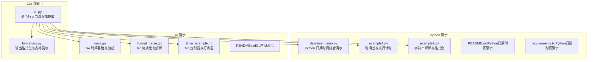
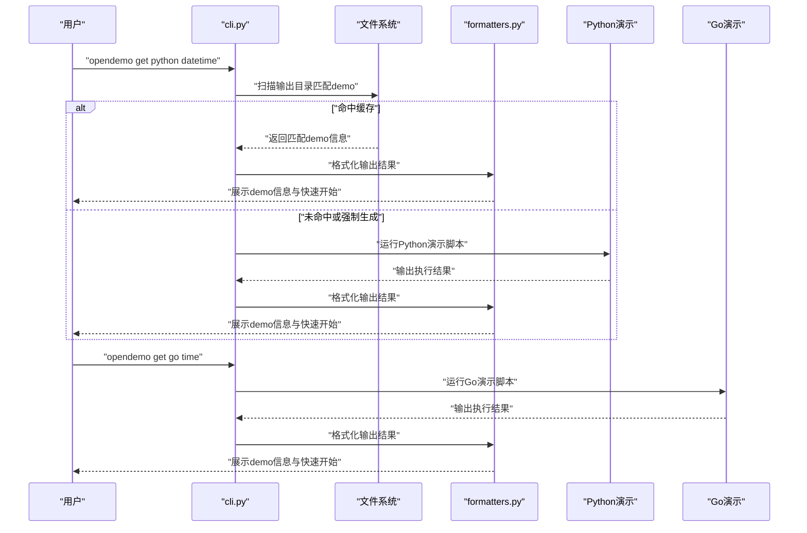
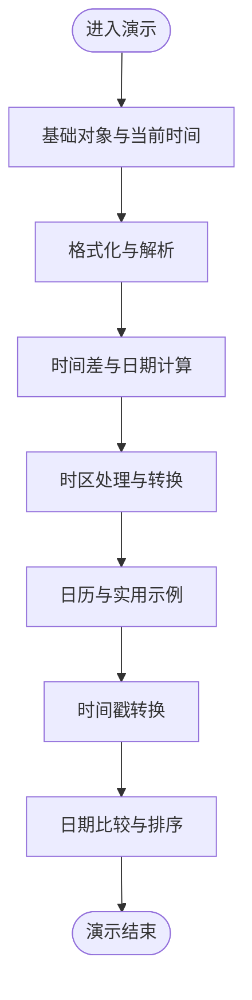
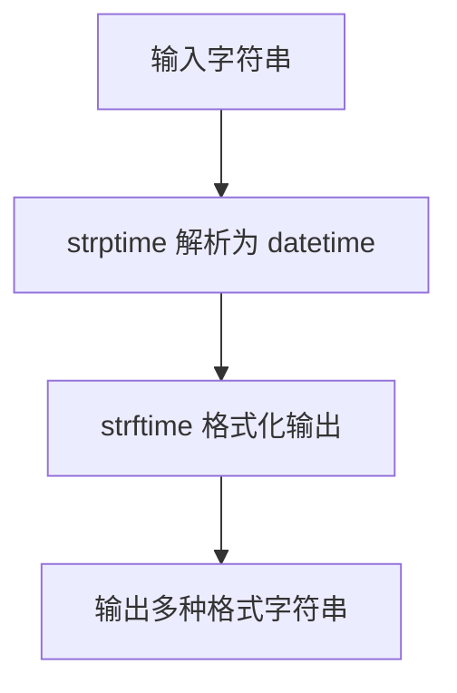
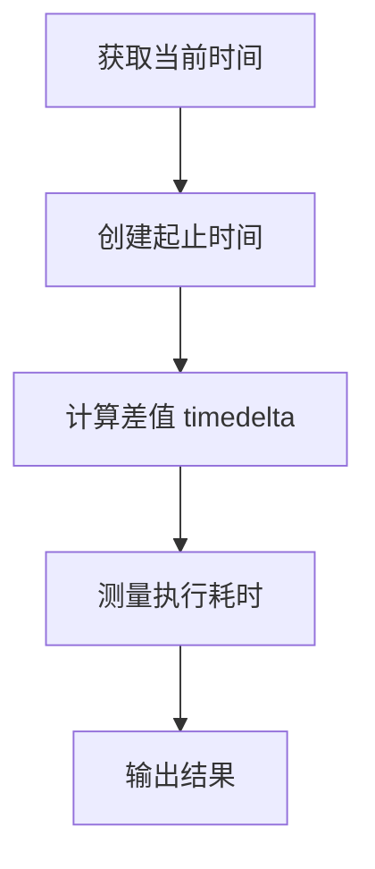
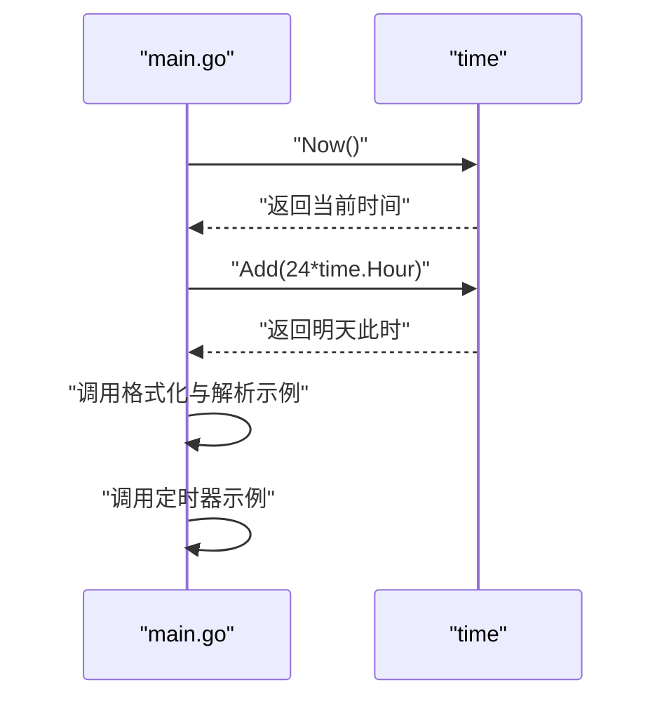
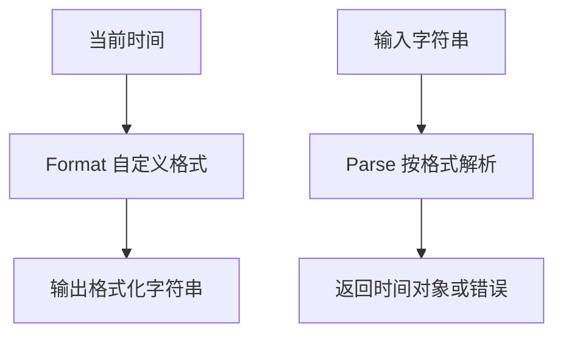
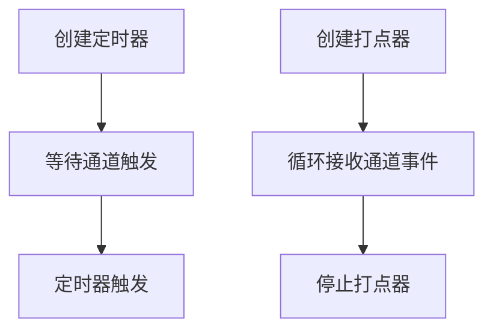
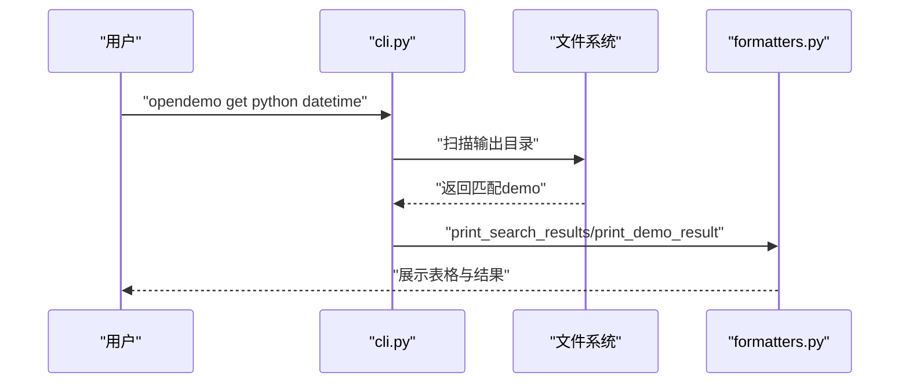
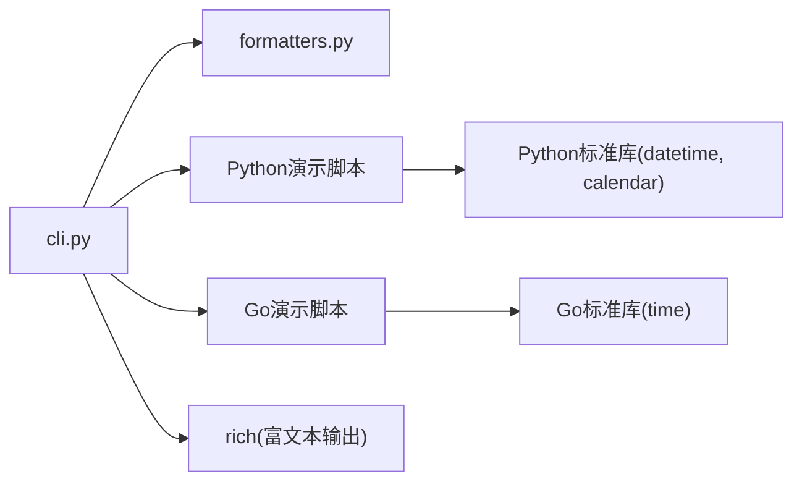

# 日期时间操作

<cite>
**本文引用的文件**
- [cli.py](file://opendemo/cli.py)
- [formatters.py](file://opendemo/utils/formatters.py)
- [datetime_demo.py](file://opendemo_output/python/datetime/code/datetime_demo.py)
- [example1.py](file://opendemo_output/python/libraries/numpy/datetime-operations/code/example1.py)
- [example2.py](file://opendemo_output/python/libraries/numpy/datetime-operations/code/example2.py)
- [README.md（Python日期时间演示）](file://opendemo_output/python/libraries/numpy/datetime-operations/README.md)
- [requirements.txt（Python日期时间演示）](file://opendemo_output/python/libraries/numpy/datetime-operations/requirements.txt)
- [main.go（Go时间演示）](file://opendemo_output/go/go-go-demo-9/main.go)
- [format_parse.go（Go时间格式化与解析）](file://opendemo_output/go/go-go-demo-9/format_parse.go)
- [timer_example.go（Go定时器与打点器）](file://opendemo_output/go/go-go-demo-9/timer_example.go)
- [README.md（Go时间演示）](file://opendemo_output/go/go-go-demo-9/README.md)
</cite>

## 目录
1. [简介](#简介)
2. [项目结构](#项目结构)
3. [核心组件](#核心组件)
4. [架构总览](#架构总览)
5. [详细组件分析](#详细组件分析)
6. [依赖关系分析](#依赖关系分析)
7. [性能考虑](#性能考虑)
8. [故障排查指南](#故障排查指南)
9. [结论](#结论)
10. [附录](#附录)

## 简介
本文件聚焦于仓库中与“日期时间操作”相关的演示与实践，覆盖 Python 与 Go 两大语言的标准库时间处理能力，包括：
- Python：datetime 基础、格式化/解析、timedelta 计算、时区处理、日历与实用示例、时间戳转换、日期比较与排序
- Go：time 包基础、格式化/解析、时间加减、定时器与打点器

同时，结合 CLI 工具对这些演示的检索、获取与展示流程进行说明，帮助用户快速定位并运行相关示例。

## 项目结构
围绕日期时间操作的相关文件主要分布在以下位置：
- Python 演示：opendemo_output/python/datetime 与 opendemo_output/python/libraries/numpy/datetime-operations
- Go 演示：opendemo_output/go/go-go-demo-9
- CLI 与输出展示：opendemo/cli.py、opendemo/utils/formatters.py

图表来源
- [cli.py](file://opendemo/cli.py#L320-L467)
- [formatters.py](file://opendemo/utils/formatters.py#L83-L129)
- [datetime_demo.py](file://opendemo_output/python/datetime/code/datetime_demo.py#L1-L235)
- [example1.py](file://opendemo_output/python/libraries/numpy/datetime-operations/code/example1.py#L1-L34)
- [example2.py](file://opendemo_output/python/libraries/numpy/datetime-operations/code/example2.py#L1-L37)
- [README.md（Python日期时间演示）](file://opendemo_output/python/libraries/numpy/datetime-operations/README.md#L1-L56)
- [requirements.txt（Python日期时间演示）](file://opendemo_output/python/libraries/numpy/datetime-operations/requirements.txt#L1-L3)
- [main.go（Go时间演示）](file://opendemo_output/go/go-go-demo-9/main.go#L1-L23)
- [format_parse.go（Go时间格式化与解析）](file://opendemo_output/go/go-go-demo-9/format_parse.go#L1-L23)
- [timer_example.go（Go定时器与打点器）](file://opendemo_output/go/go-go-demo-9/timer_example.go#L1-L27)
- [README.md（Go时间演示）](file://opendemo_output/go/go-go-demo-9/README.md#L1-L71)

章节来源
- [cli.py](file://opendemo/cli.py#L320-L467)
- [formatters.py](file://opendemo/utils/formatters.py#L83-L129)

## 核心组件
- Python 日期时间综合演示：涵盖基础对象、格式化/解析、时间差、时区、日历、实用示例、时间戳与比较排序
- Python 字符串解析与格式化示例：展示 strptime/strftime 的典型用法与多格式输出
- Python 时间差与执行计时示例：演示 timedelta 计算与程序执行耗时测量
- Go 时间基础与加减：展示 time.Now、Add、Format、Parse 的基本用法
- Go 定时器与打点器：演示 NewTimer、NewTicker 的创建与使用
- CLI 获取与展示：支持按语言与关键字检索、复制到输出目录、格式化输出结果

章节来源
- [datetime_demo.py](file://opendemo_output/python/datetime/code/datetime_demo.py#L1-L235)
- [example1.py](file://opendemo_output/python/libraries/numpy/datetime-operations/code/example1.py#L1-L34)
- [example2.py](file://opendemo_output/python/libraries/numpy/datetime-operations/code/example2.py#L1-L37)
- [main.go（Go时间演示）](file://opendemo_output/go/go-go-demo-9/main.go#L1-L23)
- [format_parse.go（Go时间格式化与解析）](file://opendemo_output/go/go-go-demo-9/format_parse.go#L1-L23)
- [timer_example.go（Go定时器与打点器）](file://opendemo_output/go/go-go-demo-9/timer_example.go#L1-L27)
- [cli.py](file://opendemo/cli.py#L320-L467)
- [formatters.py](file://opendemo/utils/formatters.py#L83-L129)

## 架构总览
下图展示 CLI 与演示获取的整体流程，以及 Python/Go 演示的核心调用关系。

图表来源
- [cli.py](file://opendemo/cli.py#L320-L467)
- [formatters.py](file://opendemo/utils/formatters.py#L83-L129)
- [datetime_demo.py](file://opendemo_output/python/datetime/code/datetime_demo.py#L1-L235)
- [main.go（Go时间演示）](file://opendemo_output/go/go-go-demo-9/main.go#L1-L23)

## 详细组件分析

### Python：日期时间综合演示（datetime_demo.py）
该脚本系统演示了 Python datetime 模块的常用能力：
- 基础对象：datetime、date、time 的创建与属性访问
- 格式化与解析：strftime/strptime 的多种格式输出与输入解析
- 时间差：timedelta 的构造、加减与 total_seconds
- 时区：timezone、astimezone、UTC 与本地时区转换
- 日历：calendar.month/monthrange/isleap 的使用
- 实用示例：年龄计算、工作日计算、本月首尾日、时间戳转换
- 比较与排序：日期对象的比较与排序

图表来源
- [datetime_demo.py](file://opendemo_output/python/datetime/code/datetime_demo.py#L1-L235)

章节来源
- [datetime_demo.py](file://opendemo_output/python/datetime/code/datetime_demo.py#L1-L235)

### Python：字符串解析与格式化（example2.py）
该脚本聚焦于字符串与 datetime 对象之间的双向转换：
- strptime：按指定格式解析字符串为 datetime
- strftime：将 datetime 格式化为字符串（含中文、ISO、自定义格式）
- 多格式解析：从不同格式的日志字符串解析

图表来源
- [example2.py](file://opendemo_output/python/libraries/numpy/datetime-operations/code/example2.py#L1-L37)

章节来源
- [example2.py](file://opendemo_output/python/libraries/numpy/datetime-operations/code/example2.py#L1-L37)
- [README.md（Python日期时间演示）](file://opendemo_output/python/libraries/numpy/datetime-operations/README.md#L1-L56)
- [requirements.txt（Python日期时间演示）](file://opendemo_output/python/libraries/numpy/datetime-operations/requirements.txt#L1-L3)

### Python：时间差与执行计时（example1.py）
该脚本演示：
- 通过减法获得 timedelta，计算两个时间点之间的差
- 使用 datetime.now() 测量程序执行耗时

图表来源
- [example1.py](file://opendemo_output/python/libraries/numpy/datetime-operations/code/example1.py#L1-L34)

章节来源
- [example1.py](file://opendemo_output/python/libraries/numpy/datetime-operations/code/example1.py#L1-L34)

### Go：时间基础与加减（main.go）
该脚本演示：
- 获取当前时间 time.Now()
- 时间加减：Add(24*time.Hour) 计算明天此时
- 调用格式化与解析示例函数
- 调用定时器示例函数

图表来源
- [main.go（Go时间演示）](file://opendemo_output/go/go-go-demo-9/main.go#L1-L23)

章节来源
- [main.go（Go时间演示）](file://opendemo_output/go/go-go-demo-9/main.go#L1-L23)
- [README.md（Go时间演示）](file://opendemo_output/go/go-go-demo-9/README.md#L1-L71)

### Go：格式化与解析（format_parse.go）
该脚本演示：
- Format：将时间格式化为自定义字符串
- Parse：将字符串解析为时间对象，并处理解析错误

图表来源
- [format_parse.go（Go时间格式化与解析）](file://opendemo_output/go/go-go-demo-9/format_parse.go#L1-L23)

章节来源
- [format_parse.go（Go时间格式化与解析）](file://opendemo_output/go/go-go-demo-9/format_parse.go#L1-L23)

### Go：定时器与打点器（timer_example.go）
该脚本演示：
- NewTimer：创建定时器并在通道触发后执行后续逻辑
- NewTicker：创建周期性打点器，在多次打点后停止

图表来源
- [timer_example.go（Go定时器与打点器）](file://opendemo_output/go/go-go-demo-9/timer_example.go#L1-L27)

章节来源
- [timer_example.go（Go定时器与打点器）](file://opendemo_output/go/go-go-demo-9/timer_example.go#L1-L27)
- [README.md（Go时间演示）](file://opendemo_output/go/go-go-demo-9/README.md#L1-L71)

### CLI：演示获取与展示（cli.py、formatters.py）
- 检索与匹配：在输出目录中按语言与关键字匹配 demo，支持精确匹配与模糊匹配
- 复制与展示：将匹配到的 demo 复制到输出目录并格式化展示
- 结果表格：使用 rich 表格展示 demo 列表，支持难度着色
- 快速开始：根据语言生成 cd、安装依赖、运行示例的步骤

图表来源
- [cli.py](file://opendemo/cli.py#L320-L467)
- [formatters.py](file://opendemo/utils/formatters.py#L83-L129)

章节来源
- [cli.py](file://opendemo/cli.py#L320-L467)
- [formatters.py](file://opendemo/utils/formatters.py#L83-L129)

## 依赖关系分析
- Python 演示依赖标准库 datetime、calendar；无需第三方依赖
- Go 演示依赖标准库 time；无需第三方依赖
- CLI 依赖 rich 进行富文本输出与表格渲染
- CLI 通过扫描输出目录与复制文件的方式组织演示

图表来源
- [cli.py](file://opendemo/cli.py#L320-L467)
- [formatters.py](file://opendemo/utils/formatters.py#L83-L129)
- [datetime_demo.py](file://opendemo_output/python/datetime/code/datetime_demo.py#L1-L235)
- [example1.py](file://opendemo_output/python/libraries/numpy/datetime-operations/code/example1.py#L1-L34)
- [example2.py](file://opendemo_output/python/libraries/numpy/datetime-operations/code/example2.py#L1-L37)
- [main.go（Go时间演示）](file://opendemo_output/go/go-go-demo-9/main.go#L1-L23)
- [format_parse.go（Go时间格式化与解析）](file://opendemo_output/go/go-go-demo-9/format_parse.go#L1-L23)
- [timer_example.go（Go定时器与打点器）](file://opendemo_output/go/go-go-demo-9/timer_example.go#L1-L27)

章节来源
- [requirements.txt（Python日期时间演示）](file://opendemo_output/python/libraries/numpy/datetime-operations/requirements.txt#L1-L3)
- [README.md（Go时间演示）](file://opendemo_output/go/go-go-demo-9/README.md#L1-L71)

## 性能考虑
- Python：datetime 对象与 timedelta 的加减、比较均为原生实现，性能良好；避免在热路径中频繁创建大量中间对象
- Go：time.Duration 与 Add/After 等操作高效；定时器与打点器注意及时 Stop 释放资源
- CLI：扫描输出目录时尽量缩小范围，避免不必要的递归遍历

## 故障排查指南
- Python 依赖缺失：Python 演示仅使用标准库，无需安装依赖；若报模块导入错误，请确认 Python 版本与环境
- Go 依赖缺失：Go 演示仅使用标准库 time；若编译失败，请检查 Go 版本与环境
- CLI 配置：首次使用需配置 AI API 密钥；可通过配置命令设置
- 输出目录：确保输出目录存在且可写；CLI 会在必要时创建目录

章节来源
- [requirements.txt（Python日期时间演示）](file://opendemo_output/python/libraries/numpy/datetime-operations/requirements.txt#L1-L3)
- [README.md（Go时间演示）](file://opendemo_output/go/go-go-demo-9/README.md#L1-L71)
- [cli.py](file://opendemo/cli.py#L320-L467)

## 结论
本仓库提供了跨语言的日期时间操作演示与 CLI 获取流程，覆盖了 Python 与 Go 的标准库时间处理能力。通过 CLI 可快速检索、复制并运行相关演示，配合 rich 的富文本输出，便于学习与实践。

## 附录
- Python 演示快速开始
  - 运行 Python 演示：在演示目录下执行相应脚本
  - 参考文档：Python 演示 README 与 requirements
- Go 演示快速开始
  - 运行 Go 演示：在演示目录下执行 go run
  - 参考文档：Go 演示 README

章节来源
- [README.md（Python日期时间演示）](file://opendemo_output/python/libraries/numpy/datetime-operations/README.md#L1-L56)
- [requirements.txt（Python日期时间演示）](file://opendemo_output/python/libraries/numpy/datetime-operations/requirements.txt#L1-L3)
- [README.md（Go时间演示）](file://opendemo_output/go/go-go-demo-9/README.md#L1-L71)