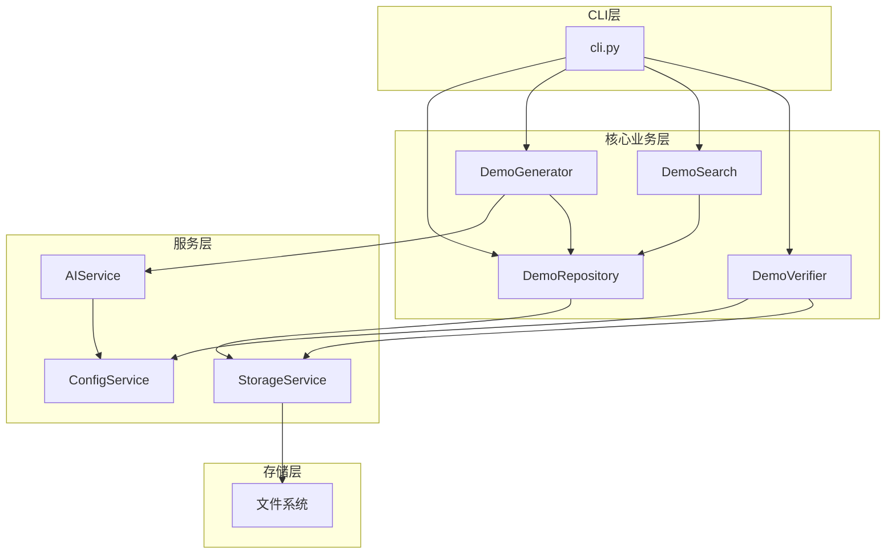
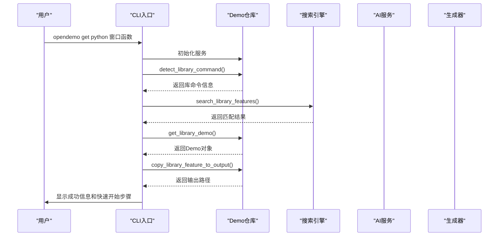
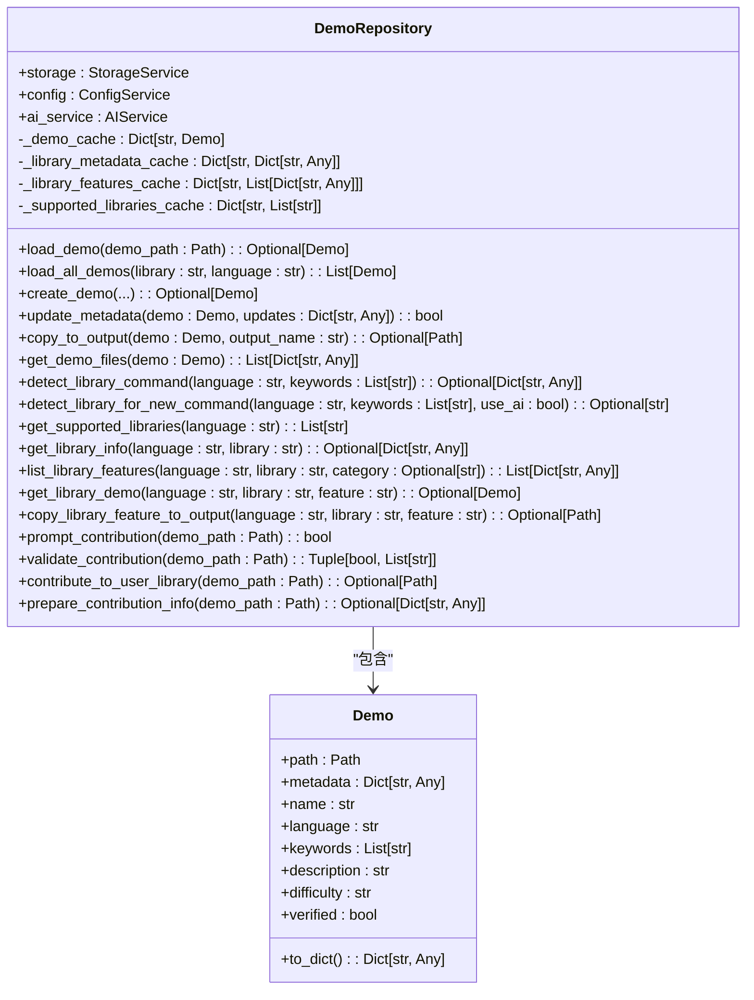
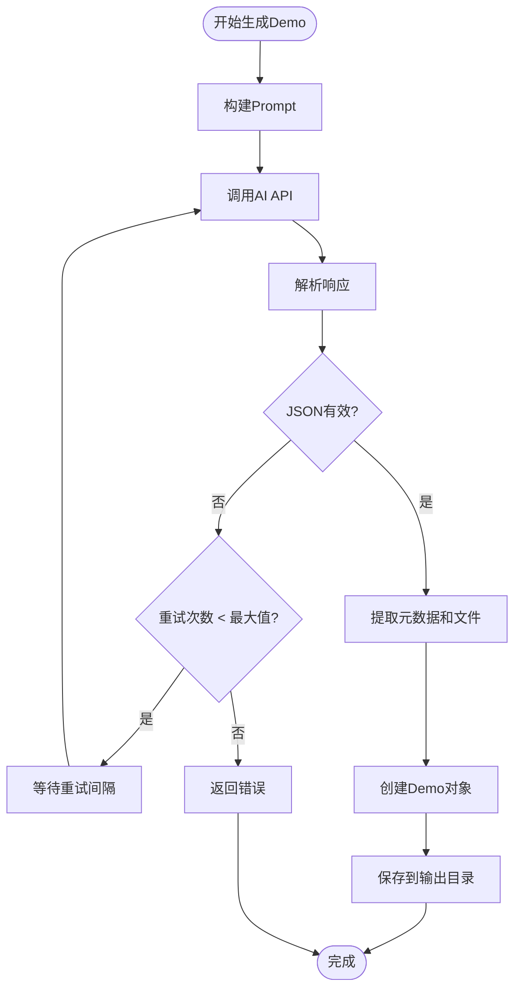
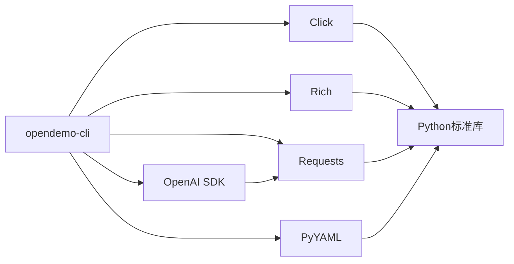

# 窗口函数

<cite>
**本文档引用的文件**  
- [README.md](file://README.md)
- [demo_repository.py](file://opendemo/core/demo_repository.py)
- [demo_search.py](file://opendemo/core/demo_search.py)
- [demo_generator.py](file://opendemo/core/demo_generator.py)
- [ai_service.py](file://opendemo/services/ai_service.py)
</cite>

## 目录
1. [简介](#简介)
2. [项目结构](#项目结构)
3. [核心组件](#核心组件)
4. [架构概述](#架构概述)
5. [详细组件分析](#详细组件分析)
6. [依赖分析](#依赖分析)
7. [性能考虑](#性能考虑)
8. [故障排除指南](#故障排除指南)
9. [结论](#结论)

## 简介
`opendemo-cli` 是一个智能化的编程学习命令行工具，旨在帮助开发者快速获取高质量、可执行的代码示例（Demo）。该工具支持多种编程语言，包括 Python、Go、Node.js 和 Kubernetes，并通过 AI 技术实现智能生成和检索功能。

本项目特别关注第三方库的使用，例如在 Python 中支持 NumPy 库的 25 个功能模块，其中包括“窗口函数”这一高级数据处理技术。用户可以通过简单的命令行指令搜索、获取或生成特定主题的代码示例，极大地提升了学习和开发效率。

该工具还具备自动验证功能，确保生成的代码可以在本地环境中成功运行。此外，系统支持中文主题输入，使得非英语用户也能方便地使用。

**Section sources**
- [README.md](file://README.md#L1-L563)

## 项目结构
`opendemo-cli` 项目采用模块化设计，整体结构清晰，便于维护和扩展。主要目录包括核心逻辑模块、服务层、工具函数以及内置的 Demo 示例。

```
.
├── opendemo\
│   ├── builtin_demos\          # 内置Demo示例
│   │   ├── python\python-tuple-basics\
│   │   │   ├── code\
│   │   │   │   ├── tuple_basics.py
│   │   │   │   └── tuple_operations.py
│   │   │   ├── README.md
│   │   │   ├── metadata.json
│   │   │   └── requirements.txt
│   │   └── README.md
│   ├── core\                   # 核心业务逻辑
│   │   ├── __init__.py
│   │   ├── demo_generator.py
│   │   ├── demo_repository.py
│   │   ├── demo_search.py
│   │   ├── demo_verifier.py
│   │   ├── quality_checker.py
│   │   └── readme_updater.py
│   ├── services\               # 服务层
│   │   ├── __init__.py
│   │   ├── ai_service.py
│   │   ├── config_service.py
│   │   └── storage_service.py
│   ├── utils\                  # 工具函数
│   │   ├── __init__.py
│   │   ├── formatters.py
│   │   └── logger.py
│   ├── __init__.py
│   └── cli.py
├── tests\
│   └── __init__.py
├── .gitignore
├── ABOUT.md
├── PROJECT_SUMMARY.md
├── README.md
├── TEST_REPORT.md
├── USAGE_GUIDE.md
├── pyproject.toml
└── start.py
```

**Diagram sources**
- [README.md](file://README.md#L485-L509)

## 核心组件
`opendemo-cli` 的核心组件主要包括 CLI 入口、Demo 仓库管理、AI 服务集成、搜索引擎和验证器。这些组件协同工作，实现了从用户请求到代码生成的完整流程。

CLI 入口 `cli.py` 负责解析用户命令并调用相应的服务。`DemoRepository` 类统一管理所有 Demo 资源，包括普通 Demo 和库 Demo，并提供创建、加载、更新等操作接口。`AIService` 类封装了与 LLM API 的交互逻辑，用于生成代码和分类关键词。`DemoSearch` 类提供统一的搜索能力，支持普通 Demo 和库功能的模糊匹配和排序。最后，`DemoVerifier` 类负责验证生成的代码是否可执行。

这些组件的设计体现了高内聚、低耦合的原则，每个模块职责明确，便于独立测试和维护。

**Section sources**
- [cli.py](file://opendemo/cli.py#L1-L864)
- [demo_repository.py](file://opendemo/core/demo_repository.py#L1-L1069)
- [ai_service.py](file://opendemo/services/ai_service.py#L1-L574)
- [demo_search.py](file://opendemo/core/demo_search.py#L1-L381)
- [demo_verifier.py](file://opendemo/core/demo_verifier.py#L1-L643)

## 架构概述
`opendemo-cli` 采用分层架构设计，分为 CLI 层、核心业务层、服务层和存储层。这种分层结构有助于分离关注点，提高系统的可维护性和可扩展性。

CLI 层通过 Click 框架实现命令行接口，接收用户输入并调用核心业务逻辑。核心业务层包含 `DemoRepository`、`DemoGenerator`、`DemoSearch` 和 `DemoVerifier` 等类，负责处理具体的业务逻辑。服务层提供配置管理、AI 服务和存储服务等基础设施支持。存储层则负责文件的读写操作和 Demo 的持久化管理。

整个系统通过依赖注入的方式将各层组件连接起来，确保了松耦合和高内聚的设计原则。



**Diagram sources**
- [cli.py](file://opendemo/cli.py#L36-L619)
- [demo_repository.py](file://opendemo/core/demo_repository.py#L81-L93)
- [demo_generator.py](file://opendemo/core/demo_generator.py#L17-L28)
- [demo_search.py](file://opendemo/core/demo_search.py#L32-L39)
- [demo_verifier.py](file://opendemo/core/demo_verifier.py#L22-L29)

## 详细组件分析

### CLI 入口分析
`cli.py` 是整个系统的入口点，使用 Click 框架构建命令行界面。它定义了 `get`、`search`、`new`、`config` 和 `check` 等命令，分别对应获取 Demo、搜索 Demo、创建新 Demo、配置管理和质量检查等功能。

`get` 命令是用户最常用的指令之一，它首先尝试在输出目录中查找匹配的 Demo，如果未找到则调用 AI 服务生成新的代码示例。该命令还支持 `--verify` 选项，用于自动验证生成的代码是否可执行。

`new` 命令允许用户创建全新的 Demo，系统会根据提供的主题和语言调用 AI 服务生成代码，并将其保存到指定位置。此命令特别适用于学习新技术或探索未知领域。



**Diagram sources**
- [cli.py](file://opendemo/cli.py#L321-L468)
- [demo_repository.py](file://opendemo/core/demo_repository.py#L317-L357)
- [demo_search.py](file://opendemo/core/demo_search.py#L177-L216)
- [demo_generator.py](file://opendemo/core/demo_generator.py#L30-L113)

### Demo 仓库管理分析
`DemoRepository` 类是系统的核心组件之一，负责统一管理所有 Demo 资源。它不仅管理普通 Demo，还专门处理第三方库的 Demo，如 NumPy 的“窗口函数”。

该类提供了丰富的 API，包括 `create_demo`、`load_demo`、`update_metadata` 和 `copy_to_output` 等方法。其中，`create_demo` 方法根据用户需求生成新的 Demo，并自动组织文件结构；`load_demo` 方法从磁盘加载已有的 Demo；`update_metadata` 方法允许更新 Demo 的元数据；`copy_to_output` 方法则将 Demo 复制到输出目录供用户使用。

此外，`DemoRepository` 还实现了缓存机制，提高了频繁访问的性能表现。



**Diagram sources**
- [demo_repository.py](file://opendemo/core/demo_repository.py#L75-L800)

### AI 服务集成分析
`AIService` 类负责与 LLM API 交互，生成高质量的代码示例。它通过 `generate_demo` 方法接收语言、主题和难度级别作为参数，构建合适的 prompt 并发送给 AI 模型。

该类还实现了关键词分类功能，通过 `classify_keyword` 方法判断用户输入的关键字是库名还是编程主题。这一功能对于正确处理库相关的请求至关重要，例如当用户搜索“numpy 窗口函数”时，系统需要识别“numpy”为库名，“窗口函数”为功能模块。

为了提高可靠性，`AIService` 实现了重试机制和超时控制，确保在网络不稳定的情况下仍能正常工作。



**Diagram sources**
- [ai_service.py](file://opendemo/services/ai_service.py#L16-L309)

## 依赖分析
`opendemo-cli` 项目的依赖关系清晰，主要依赖于以下几个外部库：

- **Click**: 用于构建命令行界面，提供强大的参数解析和命令组织功能。
- **Rich**: 用于终端美化，提供彩色输出、表格和进度条等视觉效果。
- **Requests**: 用于与 LLM API 进行 HTTP 通信。
- **PyYAML**: 用于验证 Kubernetes 相关的 YAML 文件语法。
- **OpenAI SDK**: 用于调用 GPT 模型生成代码。

这些依赖项都通过 `pyproject.toml` 文件进行管理，确保了版本的一致性和可重复构建。



**Diagram sources**
- [pyproject.toml](file://pyproject.toml)
- [ai_service.py](file://opendemo/services/ai_service.py#L7-L11)
- [demo_verifier.py](file://opendemo/core/demo_verifier.py#L7-L13)

## 性能考虑
`opendemo-cli` 在设计时充分考虑了性能因素。首先，系统实现了多级缓存机制，避免重复读取和解析相同的 Demo 数据。其次，AI 请求支持重试和超时控制，防止因网络问题导致长时间等待。

对于大规模 Demo 库的搜索操作，系统采用了高效的匹配算法，结合精确匹配、前缀匹配和包含匹配等多种策略，确保搜索结果的相关性和响应速度。

此外，代码生成过程中的临时文件操作也经过优化，使用 `tempfile.TemporaryDirectory` 确保资源及时释放，避免内存泄漏。

## 故障排除指南
在使用 `opendemo-cli` 时，可能会遇到以下常见问题：

1. **AI API 密钥未配置**：运行 `opendemo config set ai.api_key YOUR_KEY` 进行设置。
2. **生成的代码无法执行**：检查依赖是否安装完整，或尝试使用 `--verify` 参数重新生成。
3. **搜索结果不准确**：确认关键字拼写正确，或尝试使用更具体的关键词。
4. **Kubernetes 相关命令失败**：确保 `kubectl` 和 `helm` 已正确安装并加入 PATH。

对于更复杂的问题，可以查看日志文件 `~/.opendemo/logs/opendemo.log` 获取详细信息。

**Section sources**
- [cli.py](file://opendemo/cli.py#L427-L431)
- [demo_verifier.py](file://opendemo/core/demo_verifier.py#L42-L47)
- [ai_service.py](file://opendemo/services/ai_service.py#L57-L59)

## 结论
`opendemo-cli` 是一个功能强大且易于使用的编程学习工具，特别适合需要快速获取代码示例的开发者。其核心优势在于结合了 AI 技术和结构化知识库，既能提供高质量的预设 Demo，又能按需生成新的代码示例。

对于“窗口函数”这类高级主题，用户只需输入 `opendemo get python numpy window-functions` 即可获得完整的代码示例和实操指南。这种便捷的访问方式大大降低了学习门槛，提高了开发效率。

未来，该项目可以进一步扩展支持更多编程语言和库，同时增强 AI 生成的质量和多样性，成为开发者不可或缺的助手。