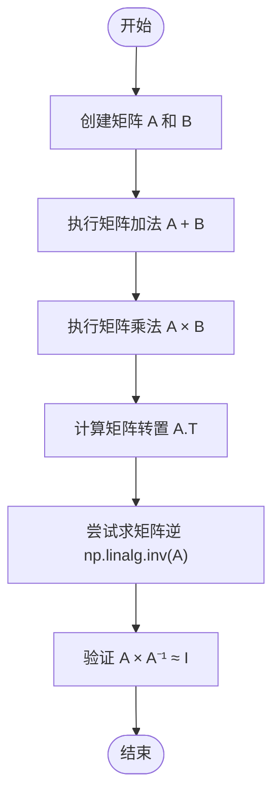
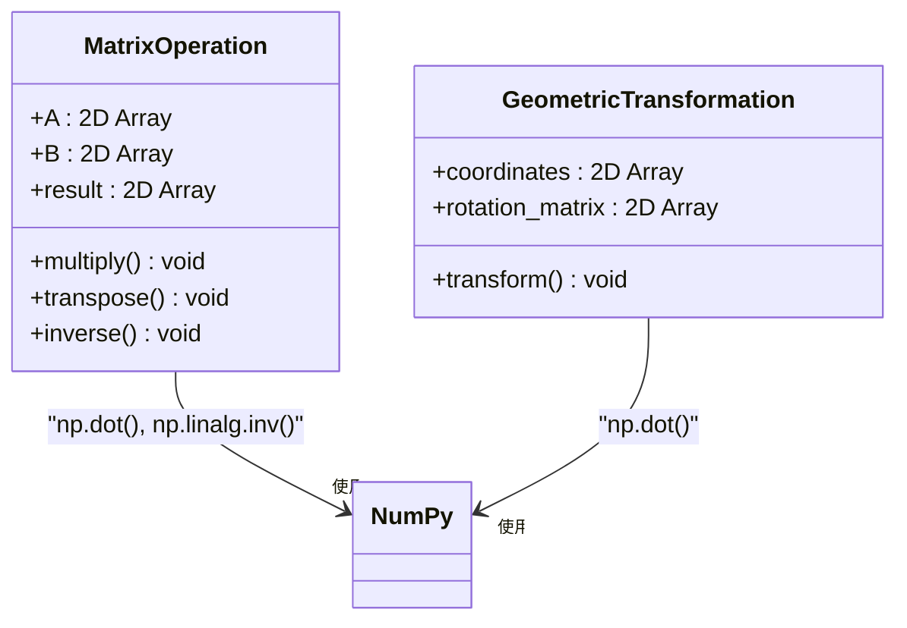

# 线性代数运算

<cite>
**本文档引用的文件**   
- [linear-algebra\metadata.json](file://opendemo_output/python/libraries/numpy/linear-algebra/metadata.json)
- [linear-algebra\README.md](file://opendemo_output/python/libraries/numpy/linear-algebra/README.md)
- [linear-algebra\code\example1.py](file://opendemo_output/python/libraries/numpy/linear-algebra/code/example1.py)
- [linear-algebra\requirements.txt](file://opendemo_output/python/libraries/numpy/linear-algebra/requirements.txt)
- [matrix-multiplication\README.md](file://opendemo_output/python/libraries/numpy/matrix-multiplication/README.md)
- [matrix-multiplication\metadata.json](file://opendemo_output/python/libraries/numpy/matrix-multiplication/metadata.json)
</cite>

## 目录
1. [简介](#简介)
2. [核心线性代数运算](#核心线性代数运算)
3. [矩阵乘法详解](#矩阵乘法详解)
4. [环境配置与依赖](#环境配置与依赖)
5. [操作指南](#操作指南)
6. [代码解析](#代码解析)
7. [常见问题解答](#常见问题解答)
8. [扩展学习建议](#扩展学习建议)

## 简介
本项目通过多个Python脚本，展示如何使用NumPy库进行常见的线性代数运算。内容涵盖矩阵的基本操作、求解线性方程组以及矩阵分解等核心主题，适合初学者理解和掌握线性代数在编程中的实际应用。

**Section sources**
- [linear-algebra\README.md](file://opendemo_output/python/libraries/numpy/linear-algebra/README.md#L1-L127)

## 核心线性代数运算
本部分演示了使用NumPy进行矩阵的基本线性代数运算，包括矩阵的创建、加法、乘法、转置和求逆等操作。这些运算是线性代数的基础，广泛应用于科学计算、机器学习和工程领域。



**Diagram sources **
- [linear-algebra\code\example1.py](file://opendemo_output/python/libraries/numpy/linear-algebra/code/example1.py#L1-L45)

**Section sources**
- [linear-algebra\code\example1.py](file://opendemo_output/python/libraries/numpy/linear-algebra/code/example1.py#L1-L45)

## 矩阵乘法详解
矩阵乘法是线性代数中的核心运算之一，本项目通过两个实际场景展示了其应用。第一种是基础的矩阵相乘，第二种是矩阵在几何变换中的应用，如坐标旋转。



**Diagram sources **
- [matrix-multiplication\README.md](file://opendemo_output/python/libraries/numpy/matrix-multiplication/README.md#L1-L119)

**Section sources**
- [matrix-multiplication\README.md](file://opendemo_output/python/libraries/numpy/matrix-multiplication/README.md#L1-L119)

## 环境配置与依赖
为了运行本项目，需要配置相应的Python环境并安装必要的依赖包。项目依赖于NumPy库，这是Python中进行科学计算的核心库。

**Section sources**
- [linear-algebra\requirements.txt](file://opendemo_output/python/libraries/numpy/linear-algebra/requirements.txt#L1-L1)

## 操作指南
以下是运行本项目中各个示例的详细步骤：

### 步骤1：运行矩阵基本操作示例
```bash
python code/matrix_operations.py
```

### 步骤2：求解线性方程组
```bash
python code/solve_linear_system.py
```

### 步骤3：执行矩阵分解
```bash
python code/matrix_decomposition.py
```

**Section sources**
- [linear-algebra\README.md](file://opendemo_output/python/libraries/numpy/linear-algebra/README.md#L49-L74)

## 代码解析
本部分对关键代码段进行解析，帮助理解其实现原理。

### matrix_operations.py 关键代码
```python
np.dot(A, B)
```
使用`np.dot()`进行矩阵乘法，这是线性代数中最核心的操作之一。

```python
np.linalg.inv(A)
```
调用线性代数模块求矩阵的逆，前提是矩阵必须是可逆的。

**Section sources**
- [linear-algebra\README.md](file://opendemo_output/python/libraries/numpy/linear-algebra/README.md#L75-L86)

## 常见问题解答
**Q: 运行时报错 'ModuleNotFoundError: No module named 'numpy''？**  
A: 请确保已正确安装依赖：`pip install -r requirements.txt`

**Q: 为什么不用A**(-1)来求逆矩阵？**  
A: 应使用`np.linalg.inv(A)`，因为`**`表示元素幂而非矩阵幂。

**Q: 如何判断矩阵是否可逆？**  
A: 可先检查行列式是否为零：`np.linalg.det(A) != 0`

**Section sources**
- [linear-algebra\README.md](file://opendemo_output/python/libraries/numpy/linear-algebra/README.md#L113-L121)

## 扩展学习建议
- 学习SciPy中的高级线性代数功能
- 尝试用线性代数实现最小二乘法拟合
- 探索PCA（主成分分析）的实现原理
- 阅读《线性代数应该这样学》配合代码实践

**Section sources**
- [linear-algebra\README.md](file://opendemo_output/python/libraries/numpy/linear-algebra/README.md#L123-L127)