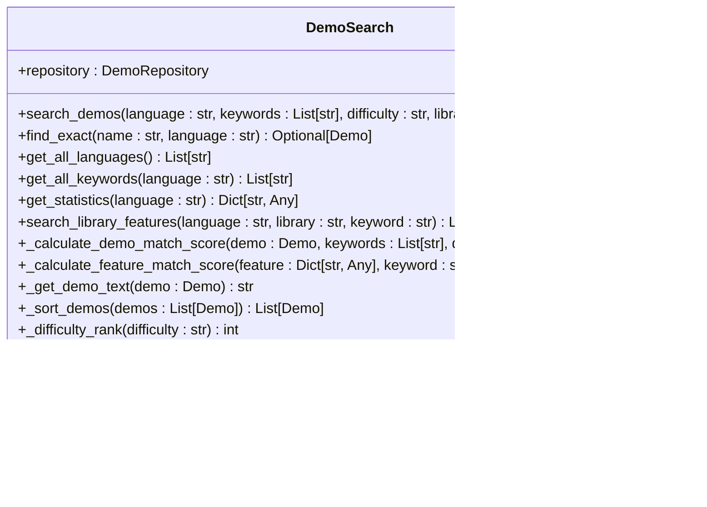

# 结构化数组

<cite>
**本文档引用的文件**   
- [README.md](file://README.md)
- [demo_repository.py](file://opendemo/core/demo_repository.py)
- [demo_search.py](file://opendemo/core/demo_search.py)
- [ai_service.py](file://opendemo/services/ai_service.py)
- [storage_service.py](file://opendemo/services/storage_service.py)
- [formatters.py](file://opendemo/utils/formatters.py)
- [tuple_basics.py](file://opendemo/builtin_demos/python/python-tuple-basics/code/tuple_basics.py)
- [tuple_operations.py](file://opendemo/builtin_demos/python/python-tuple-basics/code/tuple_operations.py)
</cite>

## 目录
1. [简介](#简介)
2. [项目结构](#项目结构)
3. [核心组件](#核心组件)
4. [架构概述](#架构概述)
5. [详细组件分析](#详细组件分析)
6. [依赖分析](#依赖分析)
7. [性能考虑](#性能考虑)
8. [故障排除指南](#故障排除指南)
9. [结论](#结论)
10. [附录](#附录)（如有必要）

## 简介
本项目是一个智能化的编程学习CLI工具，旨在帮助开发者快速获取高质量、可执行的Demo代码。通过命令行接口，用户可以搜索、获取和创建各种编程语言的示例代码，涵盖Python、Go、Node.js等多种语言。项目支持AI生成代码，能够根据用户的需求自动生成符合规范的代码示例，并提供详细的文档说明。此外，项目还具备验证功能，确保生成的代码可以在不同平台上顺利运行。

## 项目结构
该项目采用模块化设计，主要分为以下几个部分：核心模块、服务模块、工具模块和内置Demo。核心模块负责管理Demo的生命周期，包括创建、加载和更新；服务模块提供了配置、存储和AI服务；工具模块则提供了日志记录和格式化输出等功能。内置Demo部分包含了各种编程语言的基础语法和第三方库的使用示例，方便用户快速上手。

**图源**
- [demo_repository.py](file://opendemo/core/demo_repository.py)
- [demo_search.py](file://opendemo/core/demo_search.py)
- [ai_service.py](file://opendemo/services/ai_service.py)
- [storage_service.py](file://opendemo/services/storage_service.py)
- [formatters.py](file://opendemo/utils/formatters.py)

**节源**
- [README.md](file://README.md)
- [demo_repository.py](file://opendemo/core/demo_repository.py)
- [demo_search.py](file://opendemo/core/demo_search.py)

## 核心组件
### Demo仓库管理
Demo仓库管理模块是项目的核心，负责所有Demo的创建、加载和更新。它通过`DemoRepository`类实现，该类提供了加载单个Demo、加载所有Demo、创建新Demo、更新元数据和复制Demo到输出目录等方法。`Demo`类表示一个具体的Demo，包含路径、元数据等信息。

**节源**
- [demo_repository.py](file://opendemo/core/demo_repository.py)

### Demo搜索引擎
Demo搜索引擎模块负责搜索和匹配Demo。它通过`DemoSearch`类实现，提供了搜索普通Demo、精确查找Demo、获取所有语言和关键字、获取统计信息以及搜索库功能等方法。搜索引擎使用了多种匹配权重，如精确匹配名称、前缀匹配、包含匹配、关键字匹配、标题匹配和描述匹配，以提高搜索的准确性和效率。

**节源**
- [demo_search.py](file://opendemo/core/demo_search.py)

### AI服务
AI服务模块负责与LLM API交互，生成Demo代码。它通过`AIService`类实现，提供了生成Demo、构建Prompt、调用API、解析响应和验证API密钥等方法。AI服务还支持智能判断关键字是否为库名，从而更好地支持第三方库的Demo生成。

**节源**
- [ai_service.py](file://opendemo/services/ai_service.py)

## 架构概述
整个项目的架构设计遵循模块化原则，各模块之间通过清晰的接口进行通信。核心模块负责管理Demo的生命周期，服务模块提供必要的支持服务，工具模块提供辅助功能，内置Demo部分则提供了丰富的示例代码。这种设计使得项目易于维护和扩展，同时也方便了新功能的添加。

**图源**
- [cli.py](file://opendemo/cli.py)
- [demo_repository.py](file://opendemo/core/demo_repository.py)
- [demo_search.py](file://opendemo/core/demo_search.py)
- [ai_service.py](file://opendemo/services/ai_service.py)
- [storage_service.py](file://opendemo/services/storage_service.py)
- [formatters.py](file://opendemo/utils/formatters.py)

## 详细组件分析
### Demo仓库管理
#### 类图

**图源**
- [demo_repository.py](file://opendemo/core/demo_repository.py)

#### 序列图

**图源**
- [demo_repository.py](file://opendemo/core/demo_repository.py)
- [storage_service.py](file://opendemo/services/storage_service.py)

### Demo搜索引擎
#### 类图

**图源**
- [demo_search.py](file://opendemo/core/demo_search.py)

#### 序列图

**图源**
- [demo_search.py](file://opendemo/core/demo_search.py)
- [demo_repository.py](file://opendemo/core/demo_repository.py)

### AI服务
#### 类图

**图源**
- [ai_service.py](file://opendemo/services/ai_service.py)

#### 序列图

**图源**
- [ai_service.py](file://opendemo/services/ai_service.py)
- [config_service.py](file://opendemo/services/config_service.py)

## 依赖分析
项目依赖关系清晰，各模块之间通过接口进行通信，降低了耦合度。核心模块依赖于服务模块和工具模块，服务模块提供必要的支持服务，工具模块提供辅助功能。内置Demo部分独立于其他模块，方便管理和更新。

**图源**
- [demo_repository.py](file://opendemo/core/demo_repository.py)
- [demo_search.py](file://opendemo/core/demo_search.py)
- [ai_service.py](file://opendemo/services/ai_service.py)
- [storage_service.py](file://opendemo/services/storage_service.py)
- [formatters.py](file://opendemo/utils/formatters.py)

**节源**
- [demo_repository.py](file://opendemo/core/demo_repository.py)
- [demo_search.py](file://opendemo/core/demo_search.py)
- [ai_service.py](file://opendemo/services/ai_service.py)
- [storage_service.py](file://opendemo/services/storage_service.py)
- [formatters.py](file://opendemo/utils/formatters.py)

## 性能考虑
项目在设计时充分考虑了性能问题。例如，`DemoRepository`类使用缓存机制来减少重复加载Demo的开销；`DemoSearch`类通过多种匹配权重提高搜索效率；`AIService`类在调用API时设置了超时和重试机制，以应对网络不稳定的情况。此外，项目还提供了验证功能，确保生成的代码可以在不同平台上顺利运行，减少了用户的调试时间。

## 故障排除指南
### 常见问题
1. **无法找到匹配的Demo**：检查输入的关键字是否正确，或者尝试使用更具体的关键词进行搜索。
2. **AI生成失败**：确认AI API密钥已正确配置，且网络连接正常。
3. **验证失败**：检查生成的代码是否符合规范，或者尝试重新生成。

### 调试工具
项目提供了详细的日志记录功能，可以通过查看日志文件来定位问题。日志文件位于`~/.opendemo/logs/opendemo.log`，记录了所有操作的详细信息。

**节源**
- [logger.py](file://opendemo/utils/logger.py)
- [demo_verifier.py](file://opendemo/core/demo_verifier.py)

## 结论
本项目通过模块化设计和丰富的功能，为开发者提供了一个高效、便捷的编程学习工具。无论是初学者还是有经验的开发者，都可以通过这个工具快速获取高质量的代码示例，提高学习和开发效率。未来，项目将继续优化性能，增加更多语言的支持，并引入更多的AI功能，进一步提升用户体验。

## 附录
### 配置文件
| 类型 | 路径 |
|------|------|
| 全局配置 | `~/.opendemo/config.yaml` |
| 项目配置 | `./.opendemo.yaml` |

### 主要配置项
| 配置项 | 说明 | 默认值 |
|--------|------|--------|
| `output_directory` | Demo输出目录 | `./opendemo_output` |
| `default_language` | 默认语言 | `python` |
| `enable_verification` | 启用验证 | `false` |
| `ai.api_key` | API密钥 | - |
| `ai.api_endpoint` | API端点 | OpenAI默认 |
| `ai.model` | 模型 | `gpt-4` |