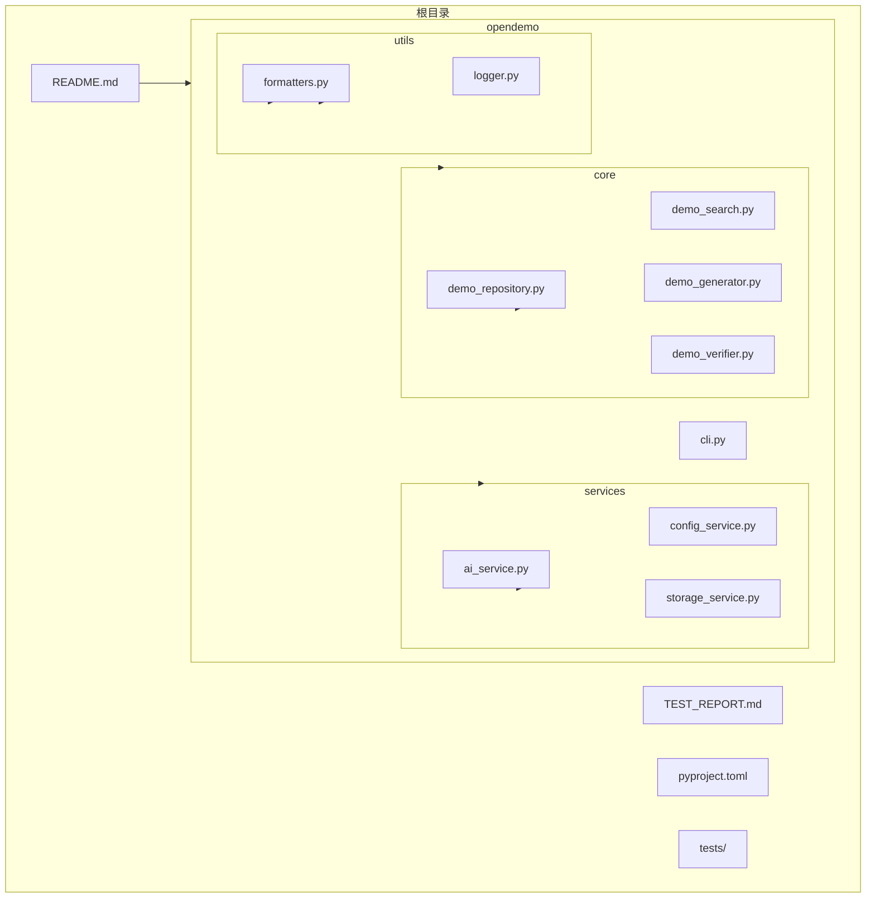
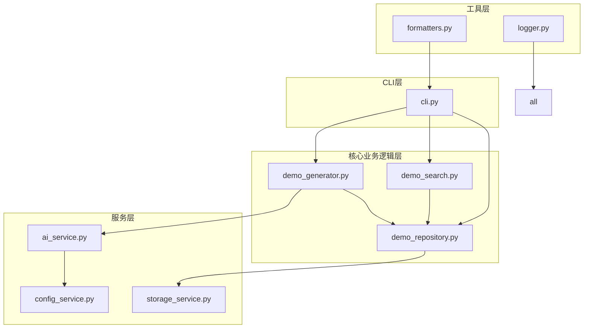
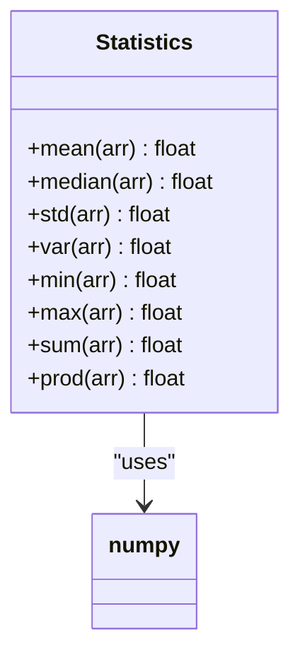
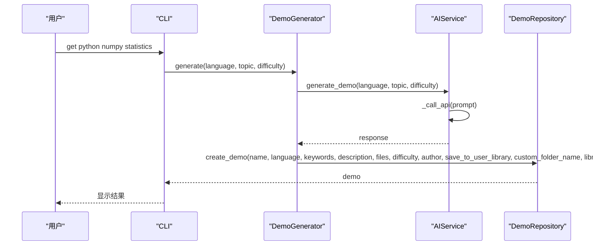
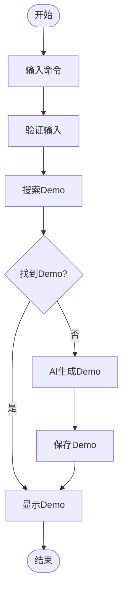

# 统计函数

<cite>
**本文档引用的文件**   
- [README.md](file://README.md#L157-L177)
- [demo_repository.py](file://opendemo/core/demo_repository.py)
- [demo_search.py](file://opendemo/core/demo_search.py)
- [demo_generator.py](file://opendemo/core/demo_generator.py)
- [ai_service.py](file://opendemo/services/ai_service.py)
- [statistics.py](file://opendemo_output/python/libraries/numpy/code/statistics.py)
</cite>

## 目录
1. [简介](#简介)
2. [项目结构](#项目结构)
3. [核心组件](#核心组件)
4. [架构概述](#架构概述)
5. [详细组件分析](#详细组件分析)
6. [依赖分析](#依赖分析)
7. [性能考虑](#性能考虑)
8. [故障排除指南](#故障排除指南)
9. [结论](#结论)
10. [附录](#附录)（如有必要）

## 简介
本项目是一个智能化的编程学习CLI工具，名为Open Demo CLI，旨在帮助开发者快速获取高质量、可执行的Demo代码。它支持多种编程语言，包括Python、Go、Node.js和Kubernetes，并提供了丰富的Demo示例，涵盖基础语法、第三方库和工具等。项目通过AI生成技术，能够根据用户需求自动生成新的Demo代码，并支持验证代码的可执行性。此外，项目还提供了详细的配置说明和开发指南，方便用户进行个性化设置和二次开发。

## 项目结构
该项目的目录结构清晰，主要分为以下几个部分：
- `opendemo/`：主包，包含CLI入口、核心业务逻辑和服务层。
- `tests/`：测试文件。
- 根目录下的配置和文档文件，如`.gitignore`、`ABOUT.md`、`PROJECT_SUMMARY.md`、`README.md`、`TEST_REPORT.md`、`USAGE_GUIDE.md`和`pyproject.toml`。

**项目结构图**


**Diagram sources**
- [README.md](file://README.md#L1-L563)
- [opendemo/core/demo_repository.py](file://opendemo/core/demo_repository.py#L1-L1069)
- [opendemo/core/demo_search.py](file://opendemo/core/demo_search.py#L1-L381)
- [opendemo/core/demo_generator.py](file://opendemo/core/demo_generator.py#L1-L146)
- [opendemo/services/ai_service.py](file://opendemo/services/ai_service.py#L1-L574)

**Section sources**
- [README.md](file://README.md#L1-L563)
- [opendemo/core/demo_repository.py](file://opendemo/core/demo_repository.py#L1-L1069)
- [opendemo/core/demo_search.py](file://opendemo/core/demo_search.py#L1-L381)
- [opendemo/core/demo_generator.py](file://opendemo/core/demo_generator.py#L1-L146)
- [opendemo/services/ai_service.py](file://opendemo/services/ai_service.py#L1-L574)

## 核心组件
本项目的核心组件包括CLI入口、Demo仓库管理、Demo搜索、Demo生成和AI服务。CLI入口负责处理用户命令，调用相应的服务。Demo仓库管理负责加载和创建Demo，提供统一的接口。Demo搜索负责根据用户输入的关键字搜索匹配的Demo。Demo生成负责调用AI服务生成新的Demo代码。AI服务负责与LLM API交互，生成高质量的代码示例和教程。

**Section sources**
- [opendemo/cli.py](file://opendemo/cli.py#L1-L864)
- [opendemo/core/demo_repository.py](file://opendemo/core/demo_repository.py#L1-L1069)
- [opendemo/core/demo_search.py](file://opendemo/core/demo_search.py#L1-L381)
- [opendemo/core/demo_generator.py](file://opendemo/core/demo_generator.py#L1-L146)
- [opendemo/services/ai_service.py](file://opendemo/services/ai_service.py#L1-L574)

## 架构概述
本项目的架构设计遵循模块化和分层的原则，确保各组件之间的职责清晰，易于维护和扩展。主要分为以下几个层次：
- **CLI层**：负责处理用户命令，调用相应的服务。
- **核心业务逻辑层**：包含Demo仓库管理、Demo搜索和Demo生成等核心功能。
- **服务层**：提供AI服务、配置服务和存储服务，支持核心业务逻辑的实现。
- **工具层**：提供日志记录、格式化输出等辅助功能。

**架构图**


**Diagram sources**
- [opendemo/cli.py](file://opendemo/cli.py#L1-L864)
- [opendemo/core/demo_repository.py](file://opendemo/core/demo_repository.py#L1-L1069)
- [opendemo/core/demo_search.py](file://opendemo/core/demo_search.py#L1-L381)
- [opendemo/core/demo_generator.py](file://opendemo/core/demo_generator.py#L1-L146)
- [opendemo/services/ai_service.py](file://opendemo/services/ai_service.py#L1-L574)
- [opendemo/services/config_service.py](file://opendemo/services/config_service.py)
- [opendemo/services/storage_service.py](file://opendemo/services/storage_service.py)
- [opendemo/utils/formatters.py](file://opendemo/utils/formatters.py)
- [opendemo/utils/logger.py](file://opendemo/utils/logger.py)

## 详细组件分析
### 统计函数分析
本项目中的统计函数主要集中在NumPy库的Demo中，具体位于`opendemo_output/python/libraries/numpy/code/statistics.py`文件中。这些函数包括均值、中位数、标准差等基本统计操作，旨在帮助用户快速理解和使用NumPy进行数据统计分析。

#### 统计函数类图


**Diagram sources**
- [opendemo_output/python/libraries/numpy/code/statistics.py](file://opendemo_output/python/libraries/numpy/code/statistics.py)

#### 统计函数调用流程


**Diagram sources**
- [opendemo/cli.py](file://opendemo/cli.py#L1-L864)
- [opendemo/core/demo_generator.py](file://opendemo/core/demo_generator.py#L1-L146)
- [opendemo/services/ai_service.py](file://opendemo/services/ai_service.py#L1-L574)
- [opendemo/core/demo_repository.py](file://opendemo/core/demo_repository.py#L1-L1069)

**Section sources**
- [opendemo_output/python/libraries/numpy/code/statistics.py](file://opendemo_output/python/libraries/numpy/code/statistics.py)

### 概念概述
本项目通过CLI工具提供了一种高效的学习方式，用户可以通过简单的命令获取高质量的Demo代码。项目的设计理念是“智能化”和“可执行”，确保生成的代码不仅符合最佳实践，还能直接运行，帮助用户快速上手和理解编程概念。



[无来源，因为此图表显示的是概念性工作流，而不是实际的代码结构]

[无来源，因为此部分不分析特定文件]

## 依赖分析
本项目依赖于多个外部库和服务，主要包括：
- **Click**：用于构建CLI工具。
- **Rich**：用于终端美化输出。
- **OpenAI API**：用于AI生成Demo代码。
- **requests**：用于调用API。
- **subprocess**：用于执行系统命令。
- **tempfile**：用于创建临时目录。
- **shutil**：用于文件操作。
- **yaml**：用于验证YAML文件语法。

**依赖图**
```mermaid
graph TD
subgraph "项目"
cli[cli.py]
core[core/]
services[services/]
utils[utils/]
end
subgraph "外部依赖"
click[Click]
rich[Rich]
openai[OpenAI API]
requests[requests]
subprocess[subprocess]
tempfile[tempfile]
shutil[shutil]
yaml[yaml]
end
cli --> click
cli --> rich
services --> openai
services --> requests
demo_verifier --> subprocess
demo_verifier --> tempfile
demo_verifier --> shutil
demo_verifier --> yaml
```

**Diagram sources**
- [opendemo/cli.py](file://opendemo/cli.py#L1-L864)
- [opendemo/services/ai_service.py](file://opendemo/services/ai_service.py#L1-L574)
- [opendemo/core/demo_verifier.py](file://opendemo/core/demo_verifier.py#L1-L643)

**Section sources**
- [opendemo/cli.py](file://opendemo/cli.py#L1-L864)
- [opendemo/services/ai_service.py](file://opendemo/services/ai_service.py#L1-L574)
- [opendemo/core/demo_verifier.py](file://opendemo/core/demo_verifier.py#L1-L643)

## 性能考虑
本项目在设计时考虑了性能优化，特别是在AI生成和代码验证方面。AI生成过程中，通过缓存机制减少重复请求，提高响应速度。代码验证过程中，使用临时目录和虚拟环境，确保验证过程的隔离性和安全性。此外，项目还支持配置验证超时时间，避免长时间等待。

[无来源，因为此部分提供一般性指导]

## 故障排除指南
### 常见问题
1. **AI API密钥未配置**：确保在配置文件中正确设置`ai.api_key`。
2. **依赖安装失败**：检查网络连接，确保可以访问包管理器。
3. **代码验证失败**：检查代码文件和依赖文件是否完整，确保环境配置正确。

**Section sources**
- [opendemo/cli.py](file://opendemo/cli.py#L1-L864)
- [opendemo/services/ai_service.py](file://opendemo/services/ai_service.py#L1-L574)
- [opendemo/core/demo_verifier.py](file://opendemo/core/demo_verifier.py#L1-L643)

## 结论
本项目通过智能化的CLI工具，为开发者提供了一种高效的学习方式。通过AI生成技术，用户可以快速获取高质量、可执行的Demo代码，涵盖多种编程语言和应用场景。项目的设计理念是“智能化”和“可执行”，确保生成的代码不仅符合最佳实践，还能直接运行，帮助用户快速上手和理解编程概念。未来，项目可以进一步扩展支持更多的编程语言和库，提升用户体验。

[无来源，因为此部分总结而不分析特定文件]