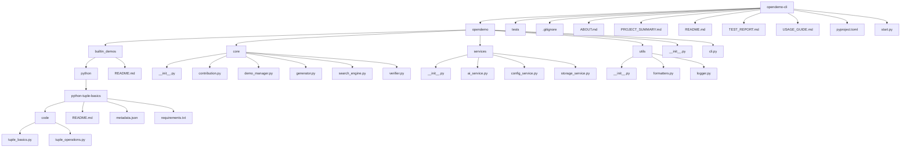
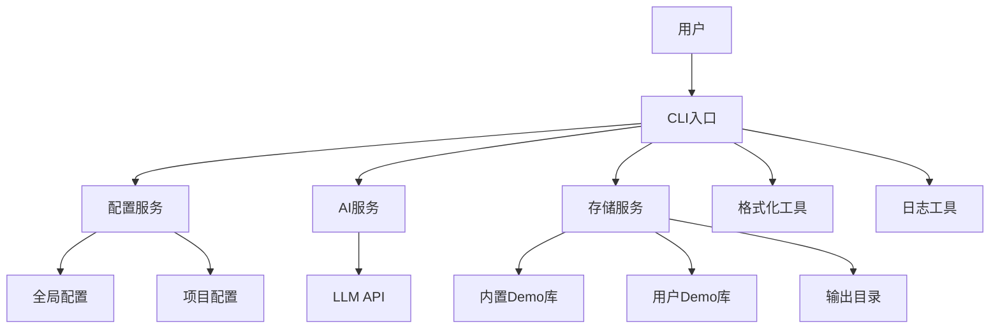
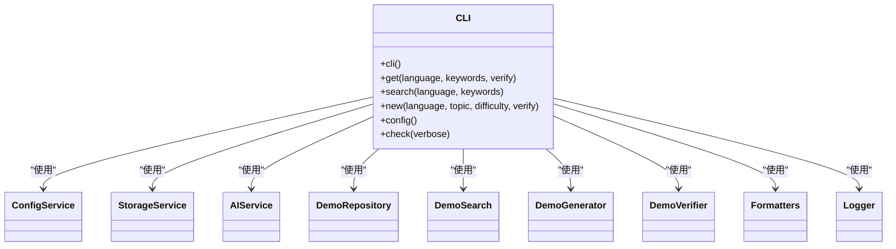
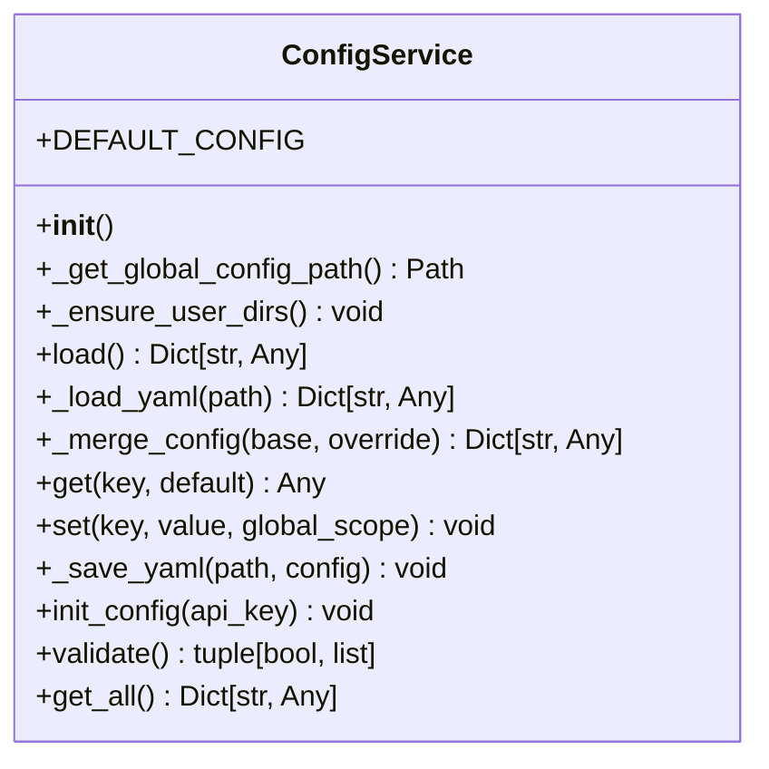
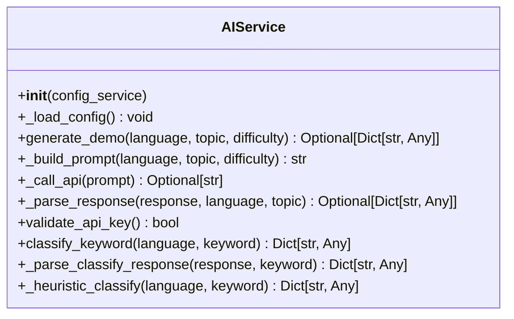
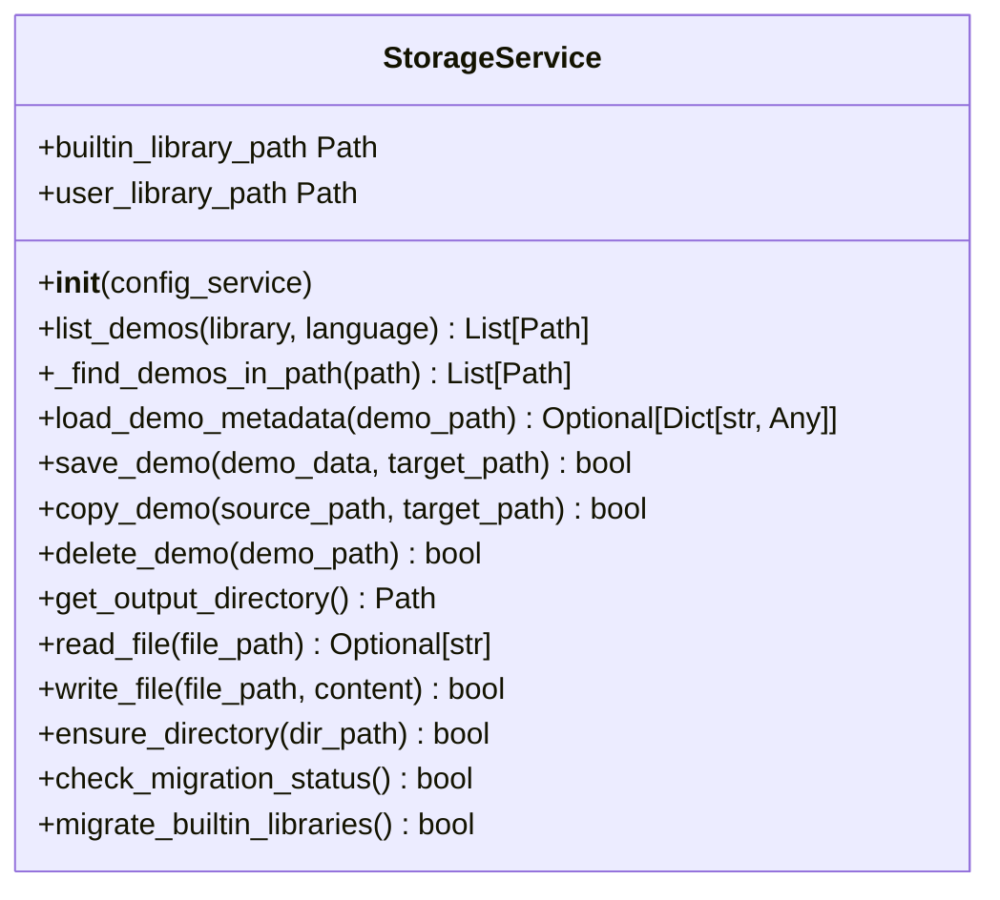
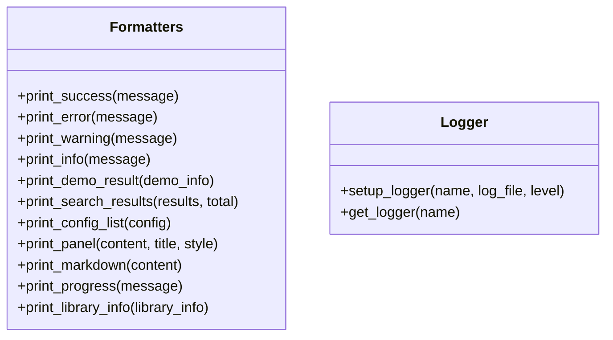
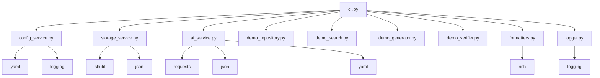

# 通用函数

<cite>
**本文档中引用的文件**  
- [cli.py](file://opendemo/cli.py)
- [config_service.py](file://opendemo/services/config_service.py)
- [ai_service.py](file://opendemo/services/ai_service.py)
- [storage_service.py](file://opendemo/services/storage_service.py)
- [formatters.py](file://opendemo/utils/formatters.py)
- [logger.py](file://opendemo/utils/logger.py)
</cite>

## 目录
1. [简介](#简介)
2. [项目结构](#项目结构)
3. [核心组件](#核心组件)
4. [架构概述](#架构概述)
5. [详细组件分析](#详细组件分析)
6. [依赖分析](#依赖分析)
7. [性能考虑](#性能考虑)
8. [故障排除指南](#故障排除指南)
9. [结论](#结论)
10. [附录](#附录)（如有必要）

## 简介
Open Demo CLI 是一个智能化的编程学习辅助工具，旨在帮助开发者快速获取高质量、可执行的代码示例。该工具支持多种编程语言，包括 Python、Go、Node.js 和 Kubernetes，并通过命令行接口提供搜索、获取和创建代码示例的功能。用户可以通过简单的命令搜索特定主题的代码示例，或使用 AI 生成新的代码示例。项目还支持配置管理，允许用户自定义输出目录、AI 服务密钥等设置。通过内置的验证机制，确保生成的代码示例可以成功执行。整体设计注重用户体验，提供了丰富的命令行输出格式化功能，使操作过程更加直观和友好。

## 项目结构

**图示来源**
- [cli.py](file://opendemo/cli.py#L1-L800)
- [config_service.py](file://opendemo/services/config_service.py#L1-L280)
- [ai_service.py](file://opendemo/services/ai_service.py#L1-L574)
- [storage_service.py](file://opendemo/services/storage_service.py#L1-L375)

**章节来源**
- [cli.py](file://opendemo/cli.py#L1-L800)
- [config_service.py](file://opendemo/services/config_service.py#L1-L280)
- [ai_service.py](file://opendemo/services/ai_service.py#L1-L574)
- [storage_service.py](file://opendemo/services/storage_service.py#L1-L375)

## 核心组件

Open Demo CLI 的核心组件包括 CLI 入口、配置服务、AI 服务、存储服务和工具模块。CLI 入口文件 `cli.py` 负责处理用户命令，初始化各种服务，并协调各个组件的工作。配置服务 `config_service.py` 管理全局和项目级别的配置，支持 YAML 格式的配置文件，并提供默认配置。AI 服务 `ai_service.py` 与 LLM API 交互，生成代码示例，支持重试机制和响应解析。存储服务 `storage_service.py` 负责文件系统操作，包括复制、删除和保存代码示例。工具模块 `formatters.py` 和 `logger.py` 提供了丰富的命令行输出格式化和日志记录功能，增强了用户体验。

**章节来源**
- [cli.py](file://opendemo/cli.py#L1-L800)
- [config_service.py](file://opendemo/services/config_service.py#L1-L280)
- [ai_service.py](file://opendemo/services/ai_service.py#L1-L574)
- [storage_service.py](file://opendemo/services/storage_service.py#L1-L375)
- [formatters.py](file://opendemo/utils/formatters.py#L1-L256)
- [logger.py](file://opendemo/utils/logger.py#L1-L65)

## 架构概述

**图示来源**
- [cli.py](file://opendemo/cli.py#L1-L800)
- [config_service.py](file://opendemo/services/config_service.py#L1-L280)
- [ai_service.py](file://opendemo/services/ai_service.py#L1-L574)
- [storage_service.py](file://opendemo/services/storage_service.py#L1-L375)

## 详细组件分析

### CLI入口分析

CLI入口文件 `cli.py` 是整个工具的入口点，负责解析用户命令并调用相应的服务。它使用 Click 框架定义了多个命令，如 `get`、`search`、`new` 和 `config`。每个命令都有明确的参数和选项，支持灵活的用户交互。CLI入口还负责初始化日志、配置、存储、AI 服务等组件，并协调它们的工作流程。

#### CLI命令类图

**图示来源**
- [cli.py](file://opendemo/cli.py#L1-L800)

**章节来源**
- [cli.py](file://opendemo/cli.py#L1-L800)

### 配置服务分析

配置服务 `config_service.py` 负责管理工具的配置信息。它支持全局配置和项目配置，优先级为项目配置 > 全局配置。配置服务提供了加载、合并、保存和验证配置的功能。默认配置包括输出目录、默认语言、AI 服务设置等。用户可以通过命令行工具修改配置，配置信息以 YAML 格式存储。

#### 配置服务类图

**图示来源**
- [config_service.py](file://opendemo/services/config_service.py#L1-L280)

**章节来源**
- [config_service.py](file://opendemo/services/config_service.py#L1-L280)

### AI服务分析

AI服务 `ai_service.py` 负责与 LLM API 交互，生成代码示例。它支持重试机制，确保在网络不稳定的情况下仍能成功生成代码。AI服务构建了详细的 prompt，指导 LLM 生成符合要求的代码示例，包括代码文件、README.md 和依赖文件。生成的响应经过解析和验证，确保其完整性和正确性。

#### AI服务类图

**图示来源**
- [ai_service.py](file://opendemo/services/ai_service.py#L1-L574)

**章节来源**
- [ai_service.py](file://opendemo/services/ai_service.py#L1-L574)

### 存储服务分析

存储服务 `storage_service.py` 负责文件系统操作，包括复制、删除和保存代码示例。它管理内置 Demo 库、用户 Demo 库和输出目录。存储服务提供了丰富的文件操作方法，如读取、写入、创建目录等。它还支持迁移内置库到输出目录，确保用户可以方便地访问所有代码示例。

#### 存储服务类图

**图示来源**
- [storage_service.py](file://opendemo/services/storage_service.py#L1-L375)

**章节来源**
- [storage_service.py](file://opendemo/services/storage_service.py#L1-L375)

### 工具模块分析

工具模块包括 `formatters.py` 和 `logger.py`，提供了丰富的命令行输出格式化和日志记录功能。`formatters.py` 使用 Rich 库美化输出，支持成功、错误、警告、信息等不同类型的输出。`logger.py` 使用标准 logging 模块，支持控制台和文件日志，便于调试和问题排查。

#### 工具模块类图

**图示来源**
- [formatters.py](file://opendemo/utils/formatters.py#L1-L256)
- [logger.py](file://opendemo/utils/logger.py#L1-L65)

**章节来源**
- [formatters.py](file://opendemo/utils/formatters.py#L1-L256)
- [logger.py](file://opendemo/utils/logger.py#L1-L65)

## 依赖分析

**图示来源**
- [cli.py](file://opendemo/cli.py#L1-L800)
- [config_service.py](file://opendemo/services/config_service.py#L1-L280)
- [ai_service.py](file://opendemo/services/ai_service.py#L1-L574)
- [storage_service.py](file://opendemo/services/storage_service.py#L1-L375)

**章节来源**
- [cli.py](file://opendemo/cli.py#L1-L800)
- [config_service.py](file://opendemo/services/config_service.py#L1-L280)
- [ai_service.py](file://opendemo/services/ai_service.py#L1-L574)
- [storage_service.py](file://opendemo/services/storage_service.py#L1-L375)

## 性能考虑
在性能方面，Open Demo CLI 通过多种机制确保高效运行。首先，配置服务使用缓存机制，避免重复加载和解析配置文件。其次，AI 服务实现了重试机制，确保在网络不稳定的情况下仍能成功生成代码。此外，存储服务在迁移内置库时会检查是否已迁移，避免重复操作。整体设计注重资源的有效利用，确保工具在各种环境下都能稳定运行。

## 故障排除指南
在使用 Open Demo CLI 时，可能会遇到一些常见问题。例如，AI API 密钥未配置会导致生成代码失败。此时，用户需要运行 `opendemo config set ai.api_key YOUR_KEY` 命令设置密钥。另一个常见问题是输出目录权限不足，导致无法保存代码示例。用户应确保输出目录具有写权限。如果遇到其他问题，建议查看日志文件，通常位于 `~/.opendemo/logs/` 目录下，以获取详细的错误信息。

**章节来源**
- [cli.py](file://opendemo/cli.py#L1-L800)
- [config_service.py](file://opendemo/services/config_service.py#L1-L280)
- [ai_service.py](file://opendemo/services/ai_service.py#L1-L574)
- [storage_service.py](file://opendemo/services/storage_service.py#L1-L375)

## 结论
Open Demo CLI 是一个功能强大且易于使用的编程学习辅助工具。通过智能化的命令行接口，用户可以快速获取高质量的代码示例，提高学习和开发效率。项目结构清晰，组件职责明确，便于维护和扩展。未来可以考虑增加更多编程语言的支持，优化 AI 生成的代码质量，并提供更丰富的文档和示例。