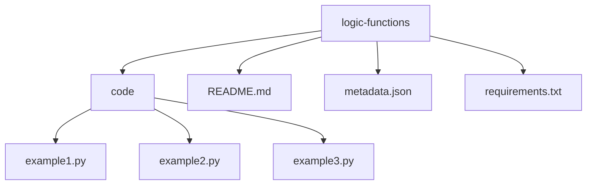
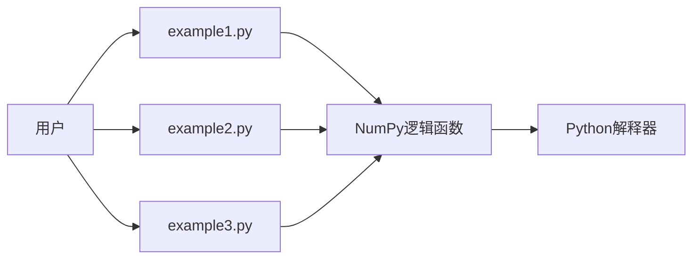
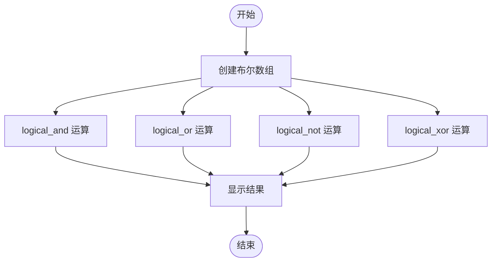
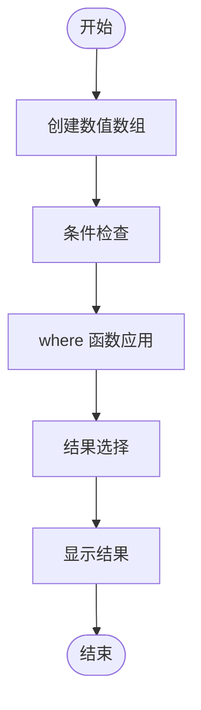
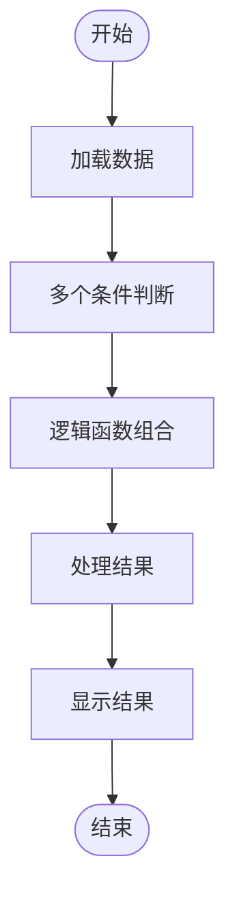
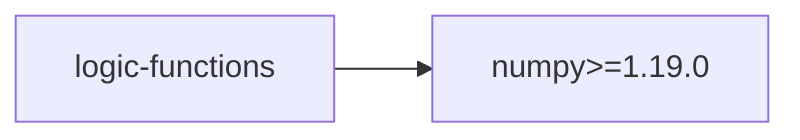

# 逻辑函数

<cite>
**本文档引用的文件**
- [logic-functions](file://opendemo_output/python/libraries/numpy/logic-functions)
- [example1.py](file://opendemo_output/python/libraries/numpy/logic-functions/code/example1.py)
- [example2.py](file://opendemo_output/python/libraries/numpy/logic-functions/code/example2.py)
- [example3.py](file://opendemo_output/python/libraries/numpy/logic-functions/code/example3.py)
- [README.md](file://opendemo_output/python/libraries/numpy/logic-functions/README.md)
- [metadata.json](file://opendemo_output/python/libraries/numpy/logic-functions/metadata.json)
- [requirements.txt](file://opendemo_output/python/libraries/numpy/logic-functions/requirements.txt)
</cite>

## 目录

1. [简介](#简介)
2. [项目结构](#项目结构)
3. [核心组件](#核心组件)
4. [架构概述](#架构概述)
5. [详细组件分析](#详细组件分析)
6. [依赖分析](#依赖分析)
7. [性能考虑](#性能考虑)
8. [故障排除指南](#故障排除指南)
9. [结论](#结论)
10. [附录](#附录)（如有必要）

## 简介

逻辑函数是 NumPy 库中用于执行逻辑运算和条件判断的重要功能。这些函数允许用户对数组进行布尔运算、条件筛选和逻辑比较，是数据处理和科学计算中的关键工具。本项目展示了 NumPy 中各种逻辑函数的使用方法，包括 `logical_and`、`logical_or`、`logical_not`、`logical_xor` 以及 `where` 等函数的实际应用。

## 项目结构

该项目遵循标准的 NumPy 库 Demo 结构，包含代码文件、文档和依赖声明。主要目录和文件组织如下：

**图示来源**
- [logic-functions](file://opendemo_output/python/libraries/numpy/logic-functions)

**章节来源**
- [logic-functions](file://opendemo_output/python/libraries/numpy/logic-functions)

## 核心组件

本项目的核心组件包括三个 Python 示例文件，分别演示了不同类型的逻辑函数应用。`example1.py` 展示了基本的逻辑运算，`example2.py` 演示了条件筛选和数组操作，而 `example3.py` 则综合运用了多种逻辑函数进行复杂的数据处理。

**章节来源**
- [example1.py](file://opendemo_output/python/libraries/numpy/logic-functions/code/example1.py)
- [example2.py](file://opendemo_output/python/libraries/numpy/logic-functions/code/example2.py)
- [example3.py](file://opendemo_output/python/libraries/numpy/logic-functions/code/example3.py)

## 架构概述

该项目的架构设计遵循模块化原则，将不同的逻辑函数示例分离到独立的文件中，便于学习和理解。每个示例文件都专注于特定的逻辑运算类型，同时保持代码的简洁性和可读性。

**图示来源**
- [example1.py](file://opendemo_output/python/libraries/numpy/logic-functions/code/example1.py)
- [example2.py](file://opendemo_output/python/libraries/numpy/logic-functions/code/example2.py)
- [example3.py](file://opendemo_output/python/libraries/numpy/logic-functions/code/example3.py)

## 详细组件分析

### 示例1分析
该示例文件演示了 NumPy 中基本逻辑函数的使用，包括 `logical_and`、`logical_or`、`logical_not` 和 `logical_xor`。这些函数用于对布尔数组进行逐元素的逻辑运算。

**图示来源**
- [example1.py](file://opendemo_output/python/libraries/numpy/logic-functions/code/example1.py)

**章节来源**
- [example1.py](file://opendemo_output/python/libraries/numpy/logic-functions/code/example1.py)

### 示例2分析
该示例文件展示了如何使用 `where` 函数进行条件筛选和数组操作。`where` 函数可以根据条件从两个数组中选择元素，或者返回满足条件的元素索引。

**图示来源**
- [example2.py](file://opendemo_output/python/libraries/numpy/logic-functions/code/example2.py)

**章节来源**
- [example2.py](file://opendemo_output/python/libraries/numpy/logic-functions/code/example2.py)

### 示例3分析
该示例文件综合运用了多种逻辑函数进行复杂的数据处理任务。它展示了如何将多个逻辑运算组合起来解决实际问题。

**图示来源**
- [example3.py](file://opendemo_output/python/libraries/numpy/logic-functions/code/example3.py)

**章节来源**
- [example3.py](file://opendemo_output/python/libraries/numpy/logic-functions/code/example3.py)

## 依赖分析

该项目依赖于 NumPy 库，这是 Python 中用于科学计算的核心库。通过 `requirements.txt` 文件声明了具体的依赖版本，确保了环境的一致性和可复现性。

**图示来源**
- [requirements.txt](file://opendemo_output/python/libraries/numpy/logic-functions/requirements.txt)

**章节来源**
- [requirements.txt](file://opendemo_output/python/libraries/numpy/logic-functions/requirements.txt)

## 性能考虑

在使用 NumPy 逻辑函数时，应考虑以下性能因素：首先，尽量使用向量化操作而不是循环，因为 NumPy 的向量化操作经过优化，执行速度更快。其次，对于大型数组，应注意内存使用情况，避免创建不必要的临时数组。最后，可以利用 NumPy 的广播机制来减少内存占用和提高计算效率。

## 故障排除指南

在使用逻辑函数时可能遇到的常见问题包括：数据类型不匹配、数组形状不兼容以及逻辑运算结果不符合预期。解决这些问题的方法包括：确保参与运算的数组具有兼容的数据类型和形状，仔细检查逻辑表达式的正确性，以及使用调试工具逐步验证中间结果。

**章节来源**
- [example1.py](file://opendemo_output/python/libraries/numpy/logic-functions/code/example1.py)
- [example2.py](file://opendemo_output/python/libraries/numpy/logic-functions/code/example2.py)
- [example3.py](file://opendemo_output/python/libraries/numpy/logic-functions/code/example3.py)

## 结论

NumPy 的逻辑函数为数组操作提供了强大的工具，能够高效地执行各种逻辑运算和条件判断。通过本项目的示例，用户可以学习到如何正确使用这些函数来解决实际的数据处理问题。掌握这些技能对于进行科学计算和数据分析至关重要。

## 附录

本项目的完整源代码和文档可在 `opendemo_output/python/libraries/numpy/logic-functions` 目录下找到。建议用户在学习时结合 `README.md` 文档和代码文件一起阅读，以获得最佳的学习效果。