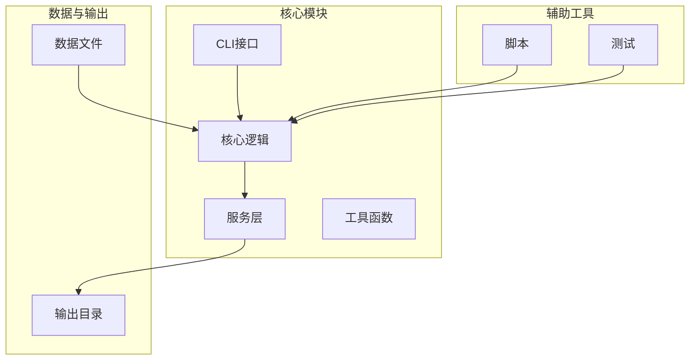
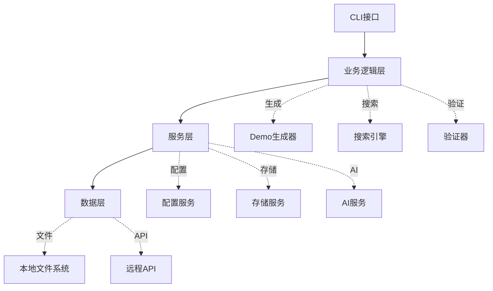
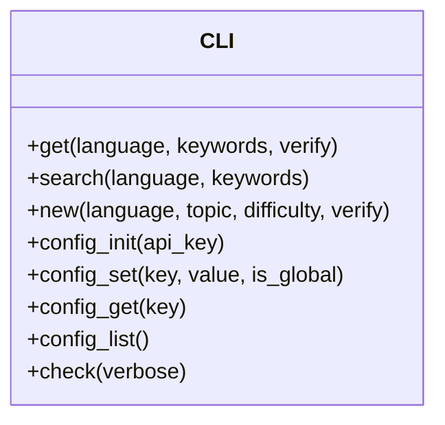
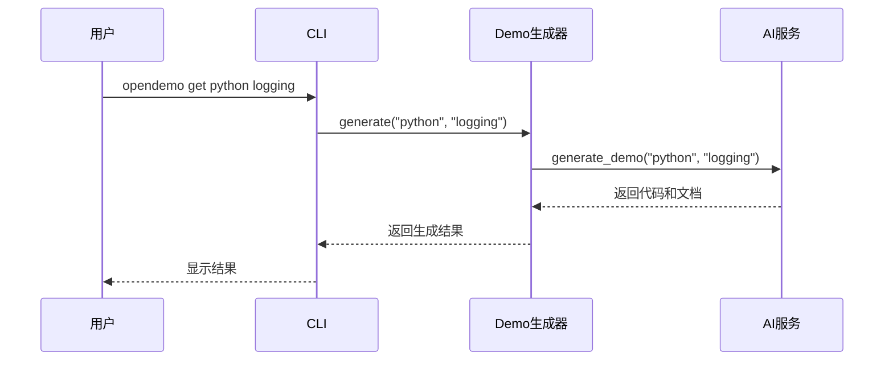
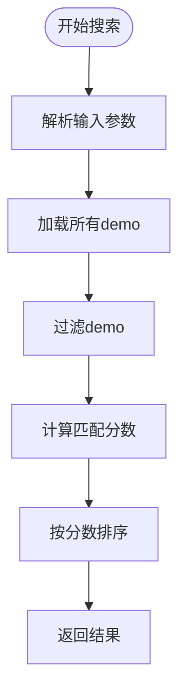
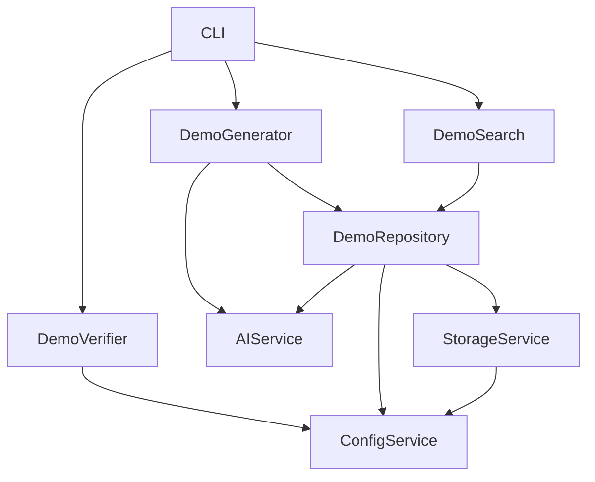

# Kubernetes Operator控制器开发演示

<cite>
**本文档引用的文件**
- [cli.py](file://opendemo/cli.py)
- [demo_generator.py](file://opendemo/core/demo_generator.py)
- [demo_repository.py](file://opendemo/core/demo_repository.py)
- [demo_search.py](file://opendemo/core/demo_search.py)
- [demo_verifier.py](file://opendemo/core/demo_verifier.py)
- [config_service.py](file://opendemo/services/config_service.py)
- [storage_service.py](file://opendemo/services/storage_service.py)
- [ai_service.py](file://opendemo/services/ai_service.py)
- [demo_mapping.json](file://data/demo_mapping.json)
- [operator-controller-demo](file://opendemo_output/kubernetes/operator-framework/operator-controller-demo)
- [crd-basic-usage](file://opendemo_output/kubernetes/operator-framework/crd-basic-usage)
</cite>

## 目录
1. [简介](#简介)
2. [项目结构](#项目结构)
3. [核心组件](#核心组件)
4. [架构概述](#架构概述)
5. [详细组件分析](#详细组件分析)
6. [依赖分析](#依赖分析)
7. [性能考虑](#性能考虑)
8. [故障排除指南](#故障排除指南)
9. [结论](#结论)

## 简介
本项目是一个智能编程学习辅助CLI工具，名为Open Demo。它通过命令行接口为开发者提供各种编程语言的代码示例。项目支持Python、Java、Go、Node.js和Kubernetes等多种语言和技术栈。其核心功能包括获取现有demo、搜索demo、创建新demo以及质量检查等。特别值得注意的是，该项目集成了AI服务，能够根据用户需求生成新的代码示例，并通过验证机制确保生成代码的可执行性。

## 项目结构
项目采用模块化设计，主要分为以下几个部分：
- `opendemo/`: 核心功能模块，包含CLI、核心逻辑、服务和工具
- `opendemo_output/`: 输出目录，存放生成的demo代码
- `data/`: 数据文件，如demo映射信息
- `scripts/`: 脚本文件，用于生成和管理demo
- `tests/`: 测试文件

核心功能模块包括：
- `core/`: 核心业务逻辑，如demo生成、搜索和验证
- `services/`: 服务层，如配置管理、存储服务和AI服务
- `utils/`: 工具函数，如日志记录和格式化输出

**图源**
- [cli.py](file://opendemo/cli.py)
- [demo_generator.py](file://opendemo/core/demo_generator.py)
- [demo_repository.py](file://opendemo/core/demo_repository.py)

**节源**
- [cli.py](file://opendemo/cli.py)
- [demo_generator.py](file://opendemo/core/demo_generator.py)
- [demo_repository.py](file://opendemo/core/demo_repository.py)

## 核心组件
项目的核心组件包括CLI接口、demo生成器、demo仓库、搜索引擎、验证器、配置服务、存储服务和AI服务。这些组件协同工作，实现了从用户请求到代码生成的完整流程。CLI接口负责接收用户命令并调用相应服务；demo生成器协调AI服务生成代码；demo仓库管理所有demo的元数据和文件；搜索引擎提供快速查找功能；验证器确保生成代码的可执行性；配置服务管理应用设置；存储服务处理文件系统操作；AI服务则负责与LLM API交互生成代码。

**节源**
- [cli.py](file://opendemo/cli.py)
- [demo_generator.py](file://opendemo/core/demo_generator.py)
- [demo_repository.py](file://opendemo/core/demo_repository.py)
- [demo_search.py](file://opendemo/core/demo_search.py)
- [demo_verifier.py](file://opendemo/core/demo_verifier.py)
- [config_service.py](file://opendemo/services/config_service.py)
- [storage_service.py](file://opendemo/services/storage_service.py)
- [ai_service.py](file://opendemo/services/ai_service.py)

## 架构概述
系统采用分层架构，从上到下分为接口层、业务逻辑层、服务层和数据层。接口层由CLI组成，负责与用户交互；业务逻辑层包含demo生成、搜索和验证等核心功能；服务层提供配置管理、存储和AI等基础服务；数据层则包括本地文件系统和可能的远程API。

**图源**
- [cli.py](file://opendemo/cli.py)
- [demo_generator.py](file://opendemo/core/demo_generator.py)
- [demo_search.py](file://opendemo/core/demo_search.py)
- [demo_verifier.py](file://opendemo/core/demo_verifier.py)
- [config_service.py](file://opendemo/services/config_service.py)
- [storage_service.py](file://opendemo/services/storage_service.py)
- [ai_service.py](file://opendemo/services/ai_service.py)

## 详细组件分析
### CLI接口分析
CLI接口是用户与系统交互的主要方式，提供了获取、搜索和创建demo的功能。它通过Click库实现命令行参数解析，并调用相应的业务逻辑。

**图源**
- [cli.py](file://opendemo/cli.py)

### Demo生成器分析
Demo生成器负责协调AI服务生成代码，并将其保存到指定位置。它处理生成过程中的各种细节，如元数据补充和文件组织。

**图源**
- [demo_generator.py](file://opendemo/core/demo_generator.py)
- [ai_service.py](file://opendemo/services/ai_service.py)

### 搜索引擎分析
搜索引擎提供强大的搜索功能，支持按语言、关键字和难度级别过滤demo。它通过计算匹配分数来排序搜索结果。

**图源**
- [demo_search.py](file://opendemo/core/demo_search.py)

**节源**
- [demo_search.py](file://opendemo/core/demo_search.py)

## 依赖分析
项目依赖关系复杂但组织良好。CLI依赖于核心业务逻辑，核心业务逻辑又依赖于各个服务。服务之间相对独立，通过接口进行通信。AI服务依赖于外部API，而存储服务则依赖于文件系统。

**图源**
- [cli.py](file://opendemo/cli.py)
- [demo_generator.py](file://opendemo/core/demo_generator.py)
- [demo_search.py](file://opendemo/core/demo_search.py)
- [demo_verifier.py](file://opendemo/core/demo_verifier.py)
- [demo_repository.py](file://opendemo/core/demo_repository.py)
- [config_service.py](file://opendemo/services/config_service.py)
- [storage_service.py](file://opendemo/services/storage_service.py)
- [ai_service.py](file://opendemo/services/ai_service.py)

**节源**
- [cli.py](file://opendemo/cli.py)
- [demo_generator.py](file://opendemo/core/demo_generator.py)
- [demo_search.py](file://opendemo/core/demo_search.py)
- [demo_verifier.py](file://opendemo/core/demo_verifier.py)
- [demo_repository.py](file://opendemo/core/demo_repository.py)
- [config_service.py](file://opendemo/services/config_service.py)
- [storage_service.py](file://opendemo/services/storage_service.py)
- [ai_service.py](file://opendemo/services/ai_service.py)

## 性能考虑
系统在设计时考虑了多个性能因素。首先，通过缓存机制减少重复的文件系统操作和网络请求。其次，AI服务的调用具有重试机制，以应对网络不稳定的情况。此外，验证过程在临时目录中进行，避免了对原始文件的修改。对于大量demo的管理，系统采用了分页和过滤机制，提高搜索效率。

## 故障排除指南
常见问题及解决方案：
1. **AI API密钥未配置**：运行`opendemo config set ai.api_key YOUR_KEY`进行配置
2. **生成demo失败**：检查网络连接和API密钥有效性
3. **验证失败**：确保相关编程环境已正确安装
4. **搜索无结果**：尝试使用更通用的关键字或检查语言拼写

**节源**
- [cli.py](file://opendemo/cli.py)
- [demo_verifier.py](file://opendemo/core/demo_verifier.py)

## 结论
Open Demo项目是一个功能完善的智能编程学习辅助工具。它通过集成AI技术，能够根据用户需求生成高质量的代码示例。项目架构清晰，模块化程度高，易于扩展和维护。未来可以考虑增加更多编程语言支持、优化AI生成算法以及增强用户界面体验。