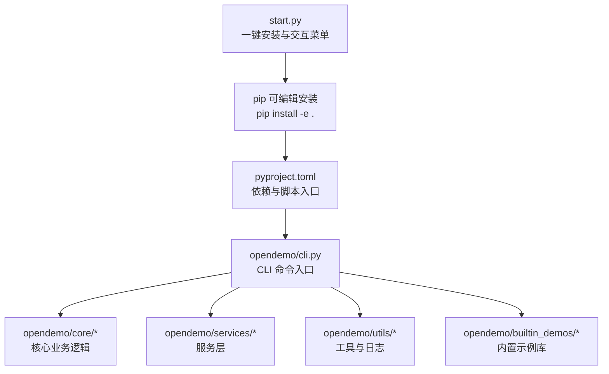
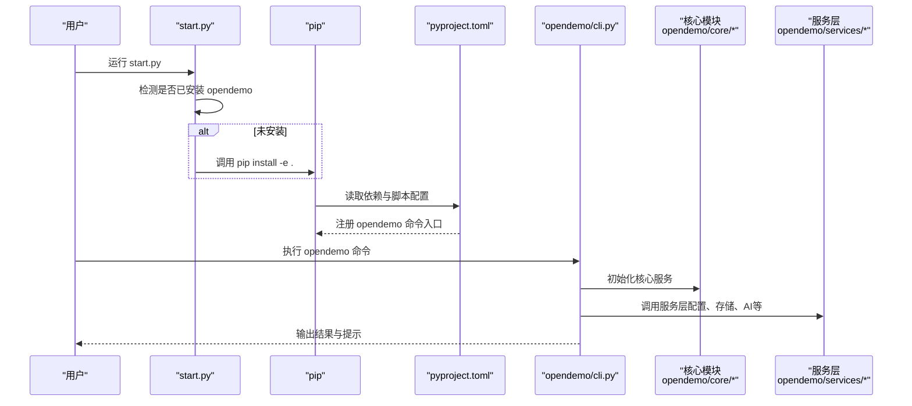
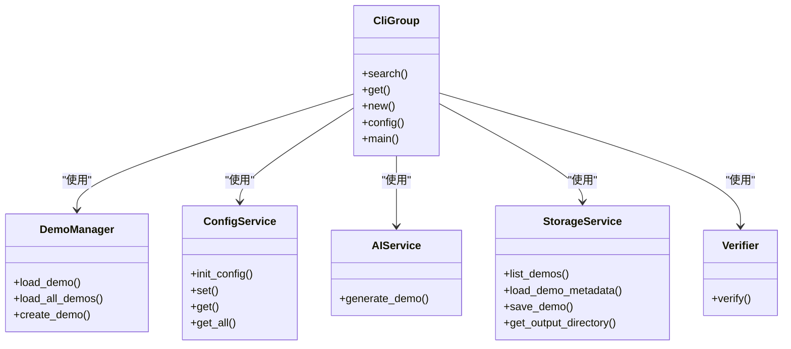

# 安装

<cite>
**本文引用的文件**
- [pyproject.toml](file://pyproject.toml)
- [README.md](file://README.md)
- [start.py](file://start.py)
- [opendemo/cli.py](file://opendemo/cli.py)
- [opendemo/__init__.py](file://opendemo/__init__.py)
- [opendemo/core/demo_manager.py](file://opendemo/core/demo_manager.py)
- [opendemo/services/ai_service.py](file://opendemo/services/ai_service.py)
- [opendemo/builtin_demos/python/python-tuple-basics/metadata.json](file://opendemo/builtin_demos/python/python-tuple-basics/metadata.json)
- [opendemo/builtin_demos/python/python-tuple-basics/requirements.txt](file://opendemo/builtin_demos/python/python-tuple-basics/requirements.txt)
</cite>

## 目录
1. [简介](#简介)
2. [项目结构](#项目结构)
3. [核心组件](#核心组件)
4. [架构总览](#架构总览)
5. [详细组件分析](#详细组件分析)
6. [依赖分析](#依赖分析)
7. [性能考虑](#性能考虑)
8. [故障排除指南](#故障排除指南)
9. [结论](#结论)
10. [附录](#附录)

## 简介
本章节面向希望安装并使用 opendemo-cli 的用户，提供从零开始的安装指南与开发模式安装说明。我们将重点解释如何使用 pip 的可编辑安装（开发模式），并结合 pyproject.toml 中的依赖声明，说明各依赖的作用与版本要求。同时，结合 start.py 脚本展示一键安装与快速体验流程，并为初学者与高级用户提供分步安装建议与可选依赖（dev、docker、git）的安装指导。

## 项目结构
opendemo-cli 是一个基于 Python 的命令行工具，采用 setuptools 构建系统与标准的项目配置文件 pyproject.toml。其核心入口为命令行模块，提供搜索、获取、创建 demo 等能力；同时内置了若干示例 demo 库，便于初次使用与验证。

图表来源
- [start.py](file://start.py#L1-L116)
- [pyproject.toml](file://pyproject.toml#L1-L84)
- [opendemo/cli.py](file://opendemo/cli.py#L1-L610)

章节来源
- [pyproject.toml](file://pyproject.toml#L1-L84)
- [README.md](file://README.md#L1-L145)

## 核心组件
- 可执行脚本入口：pyproject.toml 中通过 scripts 字段注册 opendemo 命令，指向 opendemo/cli.py 的 main 函数。
- CLI 命令组：opendemo/cli.py 提供 search、get、new、config 等子命令，覆盖搜索、获取、创建与配置管理。
- 版本与作者信息：opendemo/__init__.py 暴露版本号，便于 start.py 检测已安装状态。
- 内置示例库：opendemo/builtin_demos 下包含示例 demo，用于快速验证安装与功能。

章节来源
- [pyproject.toml](file://pyproject.toml#L53-L55)
- [opendemo/cli.py](file://opendemo/cli.py#L1-L610)
- [opendemo/__init__.py](file://opendemo/__init__.py#L1-L19)
- [opendemo/builtin_demos/python/python-tuple-basics/metadata.json](file://opendemo/builtin_demos/python/python-tuple-basics/metadata.json#L1-L14)

## 架构总览
下图展示了从用户执行安装到 CLI 命令运行的整体流程，以及依赖注入与数据流的关键节点。

图表来源
- [start.py](file://start.py#L1-L116)
- [pyproject.toml](file://pyproject.toml#L38-L55)
- [opendemo/cli.py](file://opendemo/cli.py#L1-L610)

## 详细组件分析

### 开发模式安装与 pip install -e . 的工作机制
- 可编辑安装（开发模式）会将当前源码目录作为包安装到环境中，使得对源码的修改无需重复安装即可生效。该模式适合开发者在本地直接调试与迭代。
- start.py 提供一键安装流程：若检测到未安装，则提示用户确认后自动执行 pip install -e .，随后进入交互菜单。
- pyproject.toml 中的 scripts 字段将 opendemo 命令映射到 opendemo/cli.py 的 main 函数，确保安装后可直接使用 opendemo 命令。

章节来源
- [start.py](file://start.py#L1-L116)
- [pyproject.toml](file://pyproject.toml#L38-L55)

### 依赖声明与版本要求
- Python 版本要求：requires-python >= 3.8，确保在 Python 3.8 至 3.12 系列上运行。
- 核心依赖：
  - click：命令行参数解析与子命令组织。
  - pyyaml：YAML 配置文件读写。
  - requests：网络请求（例如调用外部服务或下载资源）。
  - rich：终端美化与输出格式化。
  - colorama：跨平台颜色输出支持。
- 可选依赖：
  - dev：测试与代码质量工具（pytest、pytest-cov、black、flake8、mypy）。
  - docker：Docker 客户端集成（如需要容器化能力）。
  - git：Git 操作集成（如需要仓库管理能力）。

章节来源
- [pyproject.toml](file://pyproject.toml#L10-L11)
- [pyproject.toml](file://pyproject.toml#L30-L36)
- [pyproject.toml](file://pyproject.toml#L38-L51)

### 从 start.py 展示快速安装流程
- start.py 会在启动时尝试导入 opendemo，若导入失败则提示是否安装，并在确认后执行 pip install -e .。
- 安装完成后，start.py 提供交互菜单，支持搜索、获取、创建 demo，以及配置管理等常用操作。

章节来源
- [start.py](file://start.py#L1-L116)

### CLI 命令与入口
- 命令入口：opendemo/cli.py 中定义了 click.group() 作为根命令，并注册 search、get、new、config 等子命令。
- 版本信息：通过 @click.version_option 注入版本号，来源于 opendemo/__init__.py 的 __version__。
- 核心流程：命令执行时会初始化配置、存储、AI、验证等服务，按需调用搜索、生成、复制与验证逻辑。

章节来源
- [opendemo/cli.py](file://opendemo/cli.py#L1-L610)
- [opendemo/__init__.py](file://opendemo/__init__.py#L1-L19)

### 内置示例库与依赖声明
- 内置示例库位于 opendemo/builtin_demos，每个 demo 包含 metadata.json 与代码文件，部分 demo 可能包含 requirements.txt。
- 示例 metadata.json 展示了 demo 的元数据字段（名称、语言、关键字、难度、作者、时间戳、版本、依赖、验证标记等）。
- requirements.txt 用于声明 demo 运行所需的依赖（示例中可能为空，表示无需额外依赖）。

章节来源
- [opendemo/builtin_demos/python/python-tuple-basics/metadata.json](file://opendemo/builtin_demos/python/python-tuple-basics/metadata.json#L1-L14)
- [opendemo/builtin_demos/python/python-tuple-basics/requirements.txt](file://opendemo/builtin_demos/python/python-tuple-basics/requirements.txt#L1-L2)

## 依赖分析
下图展示了 CLI 命令在运行时的依赖关系与调用链，体现核心模块与服务层之间的协作。

图表来源
- [opendemo/cli.py](file://opendemo/cli.py#L1-L610)
- [opendemo/core/demo_manager.py](file://opendemo/core/demo_manager.py#L1-L200)

章节来源
- [opendemo/cli.py](file://opendemo/cli.py#L1-L610)
- [opendemo/core/demo_manager.py](file://opendemo/core/demo_manager.py#L1-L200)

## 性能考虑
- 可编辑安装（开发模式）避免了重复打包与安装，提升迭代效率。
- CLI 命令在执行前会进行必要的检查（如 API 密钥、语言支持、输出目录等），减少无效调用。
- 验证流程（如 Python 依赖安装与运行）会创建临时虚拟环境，注意磁盘空间与网络超时设置。

[本节为通用建议，不涉及具体文件分析]

## 故障排除指南
- 无法导入 opendemo：
  - 确认已执行 pip install -e . 并在当前环境中生效。
  - 若使用虚拟环境，请确保已激活对应环境后再执行安装。
- 命令不可用：
  - 检查 pyproject.toml 中的 scripts 字段是否正确注册了 opendemo 命令入口。
- 语言不支持：
  - 当前支持语言列表在 CLI 中定义，若传入不支持的语言会提示错误。
- 配置缺失：
  - 首次使用需初始化配置并设置 AI API 密钥，否则相关功能会报错。
- 验证失败：
  - 检查 demo 的 requirements.txt 与运行环境，必要时手动安装依赖或调整验证策略。

章节来源
- [pyproject.toml](file://pyproject.toml#L53-L55)
- [opendemo/cli.py](file://opendemo/cli.py#L1-L610)

## 结论
通过 pip 的可编辑安装（开发模式），用户可以快速将源码安装到环境中并立即使用 opendemo 命令。结合 pyproject.toml 中的依赖声明与可选依赖，用户可根据自身需求选择安装完整功能或仅安装开发工具链。start.py 提供了友好的一键安装与交互式体验，适合初学者快速上手；对于高级用户，可按需安装 dev、docker、git 等可选依赖以扩展功能。

[本节为总结性内容，不涉及具体文件分析]

## 附录

### 分步安装指南（初学者）
- 环境准备
  - 确保 Python 版本满足要求（>= 3.8）。
- 一键安装
  - 运行 start.py，根据提示确认安装，安装完成后自动进入交互菜单。
- 基本使用
  - 初始化配置并设置 AI API 密钥。
  - 使用 search、get、new 等命令体验核心功能。

章节来源
- [start.py](file://start.py#L1-L116)
- [README.md](file://README.md#L21-L60)

### 开发模式安装与可选依赖（高级用户）
- 开发模式安装
  - 使用 pip install -e . 进行可编辑安装，便于本地调试与迭代。
- 可选依赖
  - dev：安装 pytest、pytest-cov、black、flake8、mypy 等开发工具。
  - docker：安装 docker 客户端以支持容器化相关功能。
  - git：安装 GitPython 以支持仓库管理相关功能。

章节来源
- [README.md](file://README.md#L112-L132)
- [pyproject.toml](file://pyproject.toml#L38-L51)