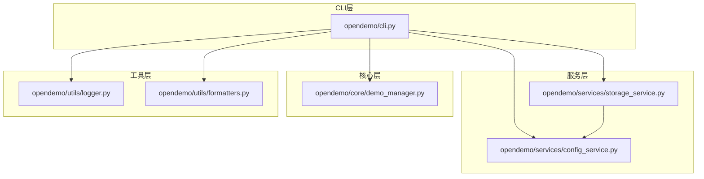
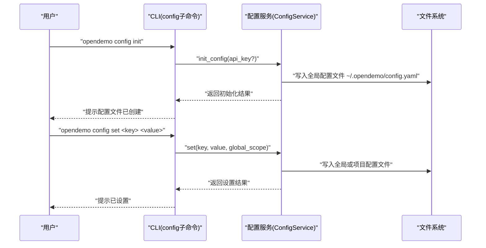
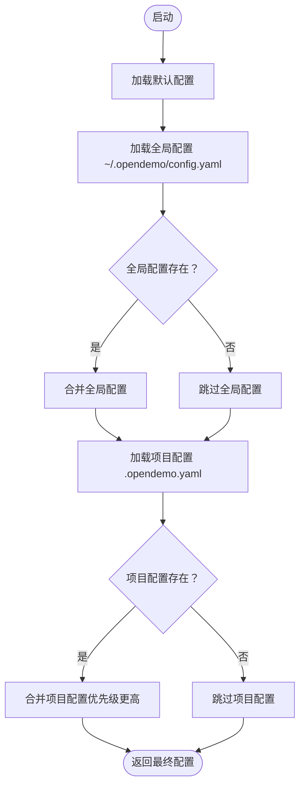
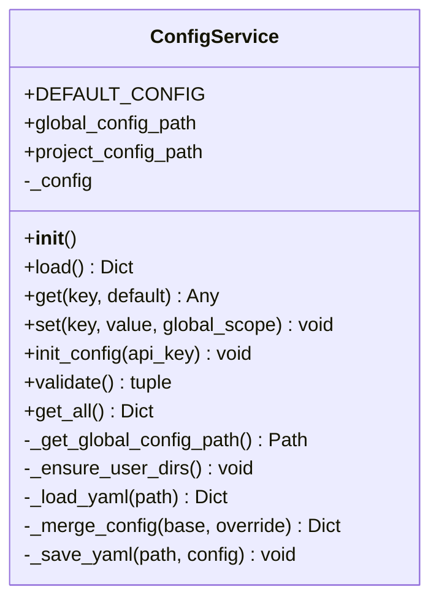

# 安装与配置

<cite>
**本文引用的文件**
- [README.md](file://README.md)
- [USAGE_GUIDE.md](file://USAGE_GUIDE.md)
- [pyproject.toml](file://pyproject.toml)
- [opendemo/cli.py](file://opendemo/cli.py)
- [opendemo/services/config_service.py](file://opendemo/services/config_service.py)
- [opendemo/services/storage_service.py](file://opendemo/services/storage_service.py)
- [opendemo/utils/logger.py](file://opendemo/utils/logger.py)
- [opendemo/utils/formatters.py](file://opendemo/utils/formatters.py)
</cite>

## 目录
1. [简介](#简介)
2. [项目结构](#项目结构)
3. [核心组件](#核心组件)
4. [架构总览](#架构总览)
5. [详细组件分析](#详细组件分析)
6. [依赖关系分析](#依赖关系分析)
7. [性能考虑](#性能考虑)
8. [故障排查指南](#故障排查指南)
9. [结论](#结论)
10. [附录](#附录)

## 简介
本指南聚焦于 opendemo-cli 的开发环境搭建与配置管理，围绕以下目标展开：
- 解释使用 pip 安装开发模式（editable install）的原理与实践细节，并引用 pyproject.toml 中的依赖声明。
- 详解配置管理功能：如何使用 config init、config set、config get、config list 等命令初始化与设置 AI API 密钥、端点与行为参数。
- 结合 USAGE_GUIDE.md 提供实际示例，说明配置流程与配置文件存储位置（全局与项目级）、YAML 格式要求。
- 为初学者提供分步安装说明；为高级用户提供关于依赖管理与配置优先级的技术深度。

## 项目结构
opendemo-cli 采用清晰的分层结构：
- CLI 层：命令入口与子命令（get、search、new、config）由 click 定义。
- 服务层：配置服务、存储服务、AI 服务、验证服务等。
- 核心层：Demo 管理、搜索、生成、验证、贡献管理。
- 工具层：日志、输出格式化等。

图表来源
- [opendemo/cli.py](file://opendemo/cli.py#L1-L120)
- [opendemo/services/config_service.py](file://opendemo/services/config_service.py#L1-L120)
- [opendemo/services/storage_service.py](file://opendemo/services/storage_service.py#L1-L120)
- [opendemo/utils/logger.py](file://opendemo/utils/logger.py#L1-L65)
- [opendemo/utils/formatters.py](file://opendemo/utils/formatters.py#L1-L80)

章节来源
- [README.md](file://README.md#L60-L110)
- [pyproject.toml](file://pyproject.toml#L53-L67)

## 核心组件
- CLI 入口与命令：定义了 get、search、new、config 子命令及其参数与行为。
- 配置服务：负责默认配置、全局与项目级配置的加载、合并、写入与校验。
- 存储服务：负责内置/用户 demo 库、输出目录、文件系统操作。
- 日志与格式化：统一日志输出与 CLI 友好输出。

章节来源
- [opendemo/cli.py](file://opendemo/cli.py#L326-L538)
- [opendemo/services/config_service.py](file://opendemo/services/config_service.py#L16-L120)
- [opendemo/services/storage_service.py](file://opendemo/services/storage_service.py#L213-L223)
- [opendemo/utils/logger.py](file://opendemo/utils/logger.py#L13-L65)
- [opendemo/utils/formatters.py](file://opendemo/utils/formatters.py#L18-L80)

## 架构总览
下面以“配置初始化与设置”的典型流程为例，展示从 CLI 到配置服务再到文件系统的调用链路。

图表来源
- [opendemo/cli.py](file://opendemo/cli.py#L473-L538)
- [opendemo/services/config_service.py](file://opendemo/services/config_service.py#L220-L242)
- [opendemo/services/config_service.py](file://opendemo/services/config_service.py#L170-L203)

## 详细组件分析

### 安装与开发模式（pip install -e .）
- 开发模式安装：使用可编辑安装（-e），将源码目录链接到 Python 环境，便于在本地修改代码后立即生效。
- 依赖声明：pyproject.toml 中的 dependencies 字段声明了运行期依赖；optional-dependencies 中的 dev、docker、git 等用于扩展开发与打包场景。
- 安装命令示例：
  - 基础安装：pip install opendemo
  - 开发模式安装：pip install -e .
  - 开发模式安装（含开发依赖）：pip install -e ".[dev]"

章节来源
- [README.md](file://README.md#L113-L120)
- [USAGE_GUIDE.md](file://USAGE_GUIDE.md#L7-L10)
- [pyproject.toml](file://pyproject.toml#L30-L51)
- [pyproject.toml](file://pyproject.toml#L53-L67)

### 配置管理：初始化与设置
- 初始化配置：
  - CLI 命令：opendemo config init
  - 行为：调用配置服务的 init_config，创建全局配置文件 ~/.opendemo/config.yaml，并可预填 AI API 密钥。
- 设置配置：
  - CLI 命令：opendemo config set <key> <value> [--global]
  - 行为：解析布尔/整数等类型，写入全局或项目配置文件；默认写入全局。
- 获取配置：
  - CLI 命令：opendemo config get <key>
  - 行为：读取配置值，对敏感键（如密钥）进行遮蔽显示。
- 列出配置：
  - CLI 命令：opendemo config list
  - 行为：递归打印所有配置项，隐藏敏感值。

章节来源
- [opendemo/cli.py](file://opendemo/cli.py#L473-L538)
- [opendemo/services/config_service.py](file://opendemo/services/config_service.py#L147-L203)
- [opendemo/services/config_service.py](file://opendemo/services/config_service.py#L220-L242)
- [opendemo/utils/formatters.py](file://opendemo/utils/formatters.py#L131-L154)

### 配置文件存储位置与 YAML 格式
- 存储位置：
  - 全局配置：~/.opendemo/config.yaml
  - 项目配置：当前工作目录下的 .opendemo.yaml
- YAML 格式：
  - 支持嵌套键（如 ai.api_key），配置服务按点号分隔键进行读取与写入。
  - 项目配置优先级高于全局配置，后者再高于默认配置。
- 配置项参考：
  - 通用：output_directory、user_demo_library、default_language、enable_verification、verification_method、verification_timeout、display.*
  - AI：ai.provider、ai.api_key、ai.api_endpoint、ai.model、ai.temperature、ai.max_tokens、ai.timeout、ai.retry_times、ai.retry_interval
  - 贡献：contribution.auto_prompt、author_name、author_email、repository_url
  - 显示：display.color_output、display.page_size、display.verbose

章节来源
- [README.md](file://README.md#L91-L101)
- [USAGE_GUIDE.md](file://USAGE_GUIDE.md#L242-L275)
- [opendemo/services/config_service.py](file://opendemo/services/config_service.py#L58-L106)
- [opendemo/services/config_service.py](file://opendemo/services/config_service.py#L126-L146)

### 配置加载与优先级（流程图）

图表来源
- [opendemo/services/config_service.py](file://opendemo/services/config_service.py#L76-L106)
- [opendemo/services/config_service.py](file://opendemo/services/config_service.py#L126-L146)

### 使用示例（来自 USAGE_GUIDE.md）
- 安装（开发模式）：pip install -e .
- 初始化配置：python -m opendemo.cli config init
- 设置 API 密钥：python -m opendemo.cli config set ai.api_key YOUR_API_KEY
- 列出配置：python -m opendemo.cli config list
- 获取配置：python -m opendemo.cli config get ai.model

章节来源
- [USAGE_GUIDE.md](file://USAGE_GUIDE.md#L7-L26)
- [USAGE_GUIDE.md](file://USAGE_GUIDE.md#L107-L127)

### 配置服务类图

图表来源
- [opendemo/services/config_service.py](file://opendemo/services/config_service.py#L16-L280)

## 依赖关系分析
- 运行期依赖（pyproject.toml）：
  - click、pyyaml、requests、rich、colorama
- 可选依赖（pyproject.toml）：
  - dev：pytest、pytest-cov、black、flake8、mypy
  - docker：docker
  - git：gitpython
- CLI 注册：
  - scripts.opendemo 指向 opendemo.cli:main，提供命令入口。

章节来源
- [pyproject.toml](file://pyproject.toml#L30-L51)
- [pyproject.toml](file://pyproject.toml#L53-L67)

## 性能考虑
- 配置加载缓存：ConfigService 对已加载配置进行缓存，避免重复 I/O。
- 配置合并策略：递归合并字典，减少深层嵌套的重复写入成本。
- 日志与输出：统一日志与 Rich 输出，避免冗余渲染开销。

章节来源
- [opendemo/services/config_service.py](file://opendemo/services/config_service.py#L76-L106)
- [opendemo/utils/logger.py](file://opendemo/utils/logger.py#L13-L65)
- [opendemo/utils/formatters.py](file://opendemo/utils/formatters.py#L18-L80)

## 故障排查指南
- 配置文件未创建或权限不足：
  - 确认 ~/.opendemo 目录存在且可写；必要时手动创建并赋予写权限。
- 配置项不存在或拼写错误：
  - 使用 opendemo config list 查看完整配置树；注意点号分隔的嵌套键。
- AI API 密钥未配置：
  - 使用 opendemo config set ai.api_key YOUR_KEY 设置；或通过 config init 初始化。
- 输出目录不可写：
  - 检查 output_directory 权限与路径有效性；必要时调整为可写路径。
- 验证失败：
  - 查看验证日志与错误信息；确认依赖安装与 Python 版本兼容性。

章节来源
- [opendemo/services/config_service.py](file://opendemo/services/config_service.py#L243-L271)
- [opendemo/services/storage_service.py](file://opendemo/services/storage_service.py#L213-L223)
- [opendemo/utils/logger.py](file://opendemo/utils/logger.py#L13-L65)

## 结论
通过 pip 的开发模式安装与 pyproject.toml 的依赖声明，开发者可以快速建立可热更新的开发环境。结合 CLI 的配置子命令与配置服务的全局/项目级 YAML 配置，用户可以在不同粒度上管理 opendemo-cli 的行为。建议初学者从 README 的基础安装与配置入手，进阶用户关注配置优先级与可选依赖的使用场景。

## 附录
- 常用命令速查
  - 安装：pip install -e .
  - 初始化配置：opendemo config init
  - 设置配置：opendemo config set <key> <value>
  - 获取配置：opendemo config get <key>
  - 列出配置：opendemo config list
- 配置文件位置
  - 全局：~/.opendemo/config.yaml
  - 项目：./.opendemo.yaml

章节来源
- [README.md](file://README.md#L21-L61)
- [USAGE_GUIDE.md](file://USAGE_GUIDE.md#L107-L127)
- [README.md](file://README.md#L91-L101)