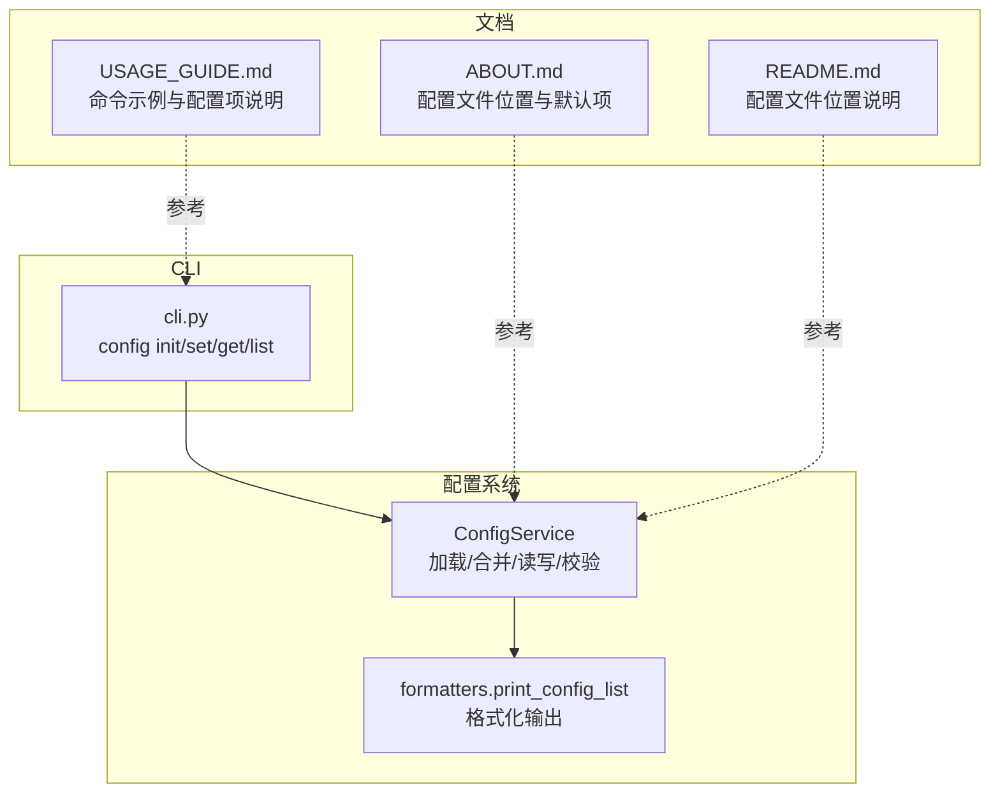
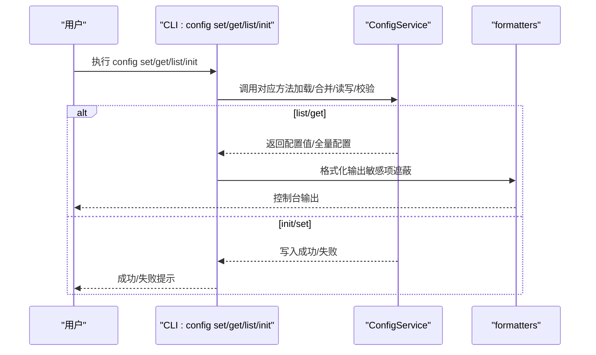
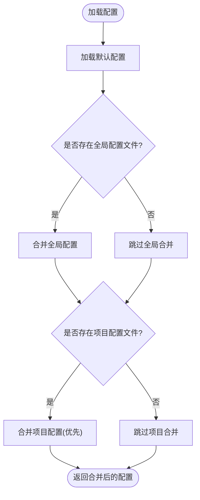
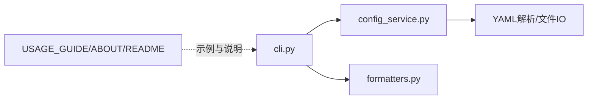

# 配置

<cite>
**本文引用的文件**
- [opendemo/services/config_service.py](file://opendemo/services/config_service.py)
- [opendemo/cli.py](file://opendemo/cli.py)
- [opendemo/utils/formatters.py](file://opendemo/utils/formatters.py)
- [USAGE_GUIDE.md](file://USAGE_GUIDE.md)
- [ABOUT.md](file://ABOUT.md)
- [README.md](file://README.md)
</cite>

## 目录
1. [简介](#简介)
2. [项目结构](#项目结构)
3. [核心组件](#核心组件)
4. [架构总览](#架构总览)
5. [详细组件分析](#详细组件分析)
6. [依赖关系分析](#依赖关系分析)
7. [性能与可靠性](#性能与可靠性)
8. [故障排查指南](#故障排查指南)
9. [结论](#结论)
10. [附录](#附录)

## 简介
本指南聚焦于 opendemo-cli 的配置系统，围绕 CLI 提供的配置管理命令（config init、config set、config get、config list）展开，结合 USAGE_GUIDE.md 中的实际示例，系统讲解：
- 配置文件的存储位置（全局 ~/.opendemo/config.yaml 与项目级 ./.opendemo.yaml）
- YAML 格式结构与配置优先级（项目配置优先于全局配置）
- 配置类别与字段含义（通用、AI、贡献、显示）
- 配置服务的实现细节（加载、合并、读写、校验）
- 初学者基础配置步骤与高级用户的配置继承、环境变量覆盖与安全存储 API 密钥建议

## 项目结构
与配置相关的核心文件与职责如下：
- 配置服务：负责默认配置、全局与项目配置的加载与合并、键值读写、校验与导出
- CLI 命令：封装 config init/set/get/list 四个子命令，调用配置服务并格式化输出
- 输出格式化：统一控制台输出样式，含配置列表打印与敏感信息隐藏
- 使用指南：提供命令示例与配置项说明

图表来源
- [opendemo/services/config_service.py](file://opendemo/services/config_service.py#L1-L280)
- [opendemo/cli.py](file://opendemo/cli.py#L473-L538)
- [opendemo/utils/formatters.py](file://opendemo/utils/formatters.py#L131-L154)
- [USAGE_GUIDE.md](file://USAGE_GUIDE.md#L107-L127)
- [ABOUT.md](file://ABOUT.md#L267-L288)
- [README.md](file://README.md#L90-L101)

章节来源
- [opendemo/services/config_service.py](file://opendemo/services/config_service.py#L1-L280)
- [opendemo/cli.py](file://opendemo/cli.py#L473-L538)
- [opendemo/utils/formatters.py](file://opendemo/utils/formatters.py#L131-L154)
- [USAGE_GUIDE.md](file://USAGE_GUIDE.md#L107-L127)
- [ABOUT.md](file://ABOUT.md#L267-L288)
- [README.md](file://README.md#L90-L101)

## 核心组件
- 配置服务（ConfigService）
  - 默认配置 DEFAULT_CONFIG：包含通用、AI、贡献、显示四类配置的默认值
  - 全局配置路径：~/.opendemo/config.yaml
  - 项目配置路径：./.opendemo.yaml
  - 加载策略：先默认配置，再合并全局配置，最后合并项目配置（项目配置优先）
  - 读取：支持点号键路径（如 ai.api_key），不存在返回默认值
  - 写入：支持点号键路径，按作用域写入全局或项目配置，写入后重置缓存
  - 校验：检查 AI API 密钥、输出目录可写、验证超时参数有效性
  - 导出：返回完整配置副本
- CLI 配置命令
  - init：初始化全局配置文件（可传入 API 密钥）
  - set：设置配置项（自动类型转换：布尔、整数；支持 --global）
  - get：获取配置项（敏感项自动隐藏）
  - list：打印所有配置（递归遍历字典，敏感项隐藏）

章节来源
- [opendemo/services/config_service.py](file://opendemo/services/config_service.py#L16-L280)
- [opendemo/cli.py](file://opendemo/cli.py#L479-L538)
- [opendemo/utils/formatters.py](file://opendemo/utils/formatters.py#L131-L154)

## 架构总览
配置系统采用“服务-命令-格式化”的分层设计：
- 服务层：ConfigService 负责配置生命周期管理
- 控制层：CLI group config 注册四个子命令
- 表现层：formatters 统一输出格式，含配置列表与敏感信息遮蔽

图表来源
- [opendemo/cli.py](file://opendemo/cli.py#L479-L538)
- [opendemo/services/config_service.py](file://opendemo/services/config_service.py#L76-L219)
- [opendemo/utils/formatters.py](file://opendemo/utils/formatters.py#L131-L154)

## 详细组件分析

### 配置文件与优先级
- 存储位置
  - 全局配置：~/.opendemo/config.yaml（首次使用自动创建用户目录）
  - 项目配置：./.opendemo.yaml（当前工作目录）
- 优先级规则
  - 默认配置 ← 全局配置 ← 项目配置（后者覆盖前者）
- YAML 结构
  - 顶层键：output_directory、user_demo_library、default_language、enable_verification、verification_method、verification_timeout、ai、contribution、display
  - ai/contribution/display 为嵌套对象，支持点号键路径访问与设置

章节来源
- [opendemo/services/config_service.py](file://opendemo/services/config_service.py#L53-L106)
- [ABOUT.md](file://ABOUT.md#L267-L273)
- [README.md](file://README.md#L90-L94)

### 配置类别与字段说明
- 通用配置
  - output_directory：输出目录，默认 ./opendemo_output
  - user_demo_library：用户 demo 库路径，默认 ~/.opendemo/demos
  - default_language：默认语言，默认 python
  - enable_verification：是否启用自动验证，默认 false
  - verification_method：验证方法，默认 venv
  - verification_timeout：验证超时（秒），默认 300
- AI 配置（ai.*）
  - provider：LLM 服务提供商，默认 openai
  - api_key：API 密钥（必须配置才可使用 AI 生成功能）
  - api_endpoint：API 端点 URL
  - model：使用的模型，默认 gpt-4
  - temperature/max_tokens：模型采样参数
  - timeout/retry_times/retry_interval：请求超时与重试策略
- 贡献配置（contribution.*）
  - auto_prompt：new 命令后是否自动询问贡献，默认 true
  - author_name/author_email：贡献者信息
  - repository_url：公共仓库地址
- 显示配置（display.*）
  - color_output：是否使用彩色输出，默认 true
  - page_size：搜索结果分页大小，默认 10
  - verbose：是否显示详细信息，默认 false

章节来源
- [opendemo/services/config_service.py](file://opendemo/services/config_service.py#L20-L49)
- [USAGE_GUIDE.md](file://USAGE_GUIDE.md#L242-L275)
- [ABOUT.md](file://ABOUT.md#L276-L288)

### CLI 配置命令详解与示例
- config init
  - 功能：初始化全局配置文件（可交互输入 API 密钥）
  - 示例：参见 USAGE_GUIDE.md 中的初始化与设置示例
- config set
  - 功能：设置配置项（支持 --global 与点号键路径）
  - 类型转换：字符串 true/false 自动转布尔；纯数字字符串转整数
  - 示例：参见 USAGE_GUIDE.md 中的 list/get/set 示例
- config get
  - 功能：获取配置项（敏感项如 key/password 自动遮蔽）
  - 示例：参见 USAGE_GUIDE.md 中的 get 示例
- config list
  - 功能：打印所有配置（递归遍历，敏感项遮蔽）
  - 示例：参见 USAGE_GUIDE.md 中的 list 示例

章节来源
- [opendemo/cli.py](file://opendemo/cli.py#L479-L538)
- [USAGE_GUIDE.md](file://USAGE_GUIDE.md#L107-L127)

### 配置服务实现要点
- 默认配置 DEFAULT_CONFIG：集中定义所有可配置项的默认值
- 加载与合并 load：
  - 从默认配置开始，依次合并全局与项目配置
  - 递归合并嵌套字典，项目配置覆盖全局配置
- 读取 get：支持点号路径解析，不存在返回默认值
- 写入 set：按作用域创建/更新 YAML 文件，写入后重置缓存
- 校验 validate：检查 AI API 密钥、输出目录可写、验证超时参数合法性
- 导出 get_all：返回完整配置副本

图表来源
- [opendemo/services/config_service.py](file://opendemo/services/config_service.py#L76-L106)

章节来源
- [opendemo/services/config_service.py](file://opendemo/services/config_service.py#L76-L219)

### 输出格式化与敏感信息遮蔽
- print_config_list：递归遍历配置字典，打印键值对；当键名包含 key 或 password 时，值以星号遮蔽
- config get：在输出前对敏感键进行遮蔽处理

章节来源
- [opendemo/utils/formatters.py](file://opendemo/utils/formatters.py#L131-L154)
- [opendemo/cli.py](file://opendemo/cli.py#L511-L530)

## 依赖关系分析
- CLI 依赖 ConfigService 完成配置读写与校验
- ConfigService 依赖 YAML 解析与文件系统（路径、目录创建）
- 输出格式化依赖 Rich 控制台渲染
- 文档（USAGE_GUIDE/ABOUT/README）提供配置项与命令示例，指导用户正确使用

图表来源
- [opendemo/cli.py](file://opendemo/cli.py#L473-L538)
- [opendemo/services/config_service.py](file://opendemo/services/config_service.py#L1-L280)
- [opendemo/utils/formatters.py](file://opendemo/utils/formatters.py#L131-L154)
- [USAGE_GUIDE.md](file://USAGE_GUIDE.md#L107-L127)
- [ABOUT.md](file://ABOUT.md#L267-L288)
- [README.md](file://README.md#L90-L101)

章节来源
- [opendemo/cli.py](file://opendemo/cli.py#L473-L538)
- [opendemo/services/config_service.py](file://opendemo/services/config_service.py#L1-L280)
- [opendemo/utils/formatters.py](file://opendemo/utils/formatters.py#L131-L154)
- [USAGE_GUIDE.md](file://USAGE_GUIDE.md#L107-L127)
- [ABOUT.md](file://ABOUT.md#L267-L288)
- [README.md](file://README.md#L90-L101)

## 性能与可靠性
- 性能特征
  - 配置加载为 O(n)（n 为配置项数量），通常很小，影响可忽略
  - set 写入为 O(m)（m 为目标层级深度），一般仅一次写入
- 可靠性
  - YAML 安全加载与异常捕获，避免配置文件损坏导致崩溃
  - 项目配置优先覆盖全局配置，便于局部定制
  - 敏感信息自动遮蔽，降低泄露风险

[本节为通用建议，无需引用具体文件]

## 故障排查指南
- AI API 密钥未配置
  - 现象：get/new 命令提示未配置
  - 处理：使用 config set 设置 ai.api_key，或使用 config init 初始化
- 输出目录不可写
  - 现象：校验失败提示无效输出目录
  - 处理：修正 output_directory 权限或路径
- 验证超时参数非法
  - 现象：校验失败提示 verification_timeout 必须为正整数
  - 处理：设置为大于 0 的整数值
- 配置项不存在
  - 现象：config get 返回不存在
  - 处理：确认键名与嵌套层级（点号路径），或先通过 config list 查看完整配置

章节来源
- [opendemo/services/config_service.py](file://opendemo/services/config_service.py#L243-L271)
- [opendemo/cli.py](file://opendemo/cli.py#L283-L288)
- [opendemo/cli.py](file://opendemo/cli.py#L409-L415)

## 结论
opendemo-cli 的配置系统以 ConfigService 为核心，提供默认配置、全局与项目配置的层次化加载与合并，配合 CLI 的 init/set/get/list 命令与统一的输出格式化，实现了易用且安全的配置管理。通过遵循项目配置优先于全局配置的原则，用户可在不同场景下灵活定制行为；通过敏感信息遮蔽与严格的校验，提升了安全性与可靠性。

[本节为总结，无需引用具体文件]

## 附录

### 命令与示例对照（来自 USAGE_GUIDE.md）
- 初始化与设置
  - 初始化：config init
  - 设置 AI 密钥：config set ai.api_key YOUR_KEY
- 查询与查看
  - 查看全部：config list
  - 获取某项：config get ai.model
  - 设置通用项：config set enable_verification true
  - 设置 AI 参数：config set ai.temperature 0.7

章节来源
- [USAGE_GUIDE.md](file://USAGE_GUIDE.md#L107-L127)

### 配置文件位置与默认项（来自 ABOUT/README）
- 全局配置：~/.opendemo/config.yaml
- 项目配置：./.opendemo.yaml
- 主要配置项（部分）：output_directory、user_demo_library、default_language、enable_verification、ai.api_key、ai.model 等

章节来源
- [ABOUT.md](file://ABOUT.md#L267-L288)
- [README.md](file://README.md#L90-L101)