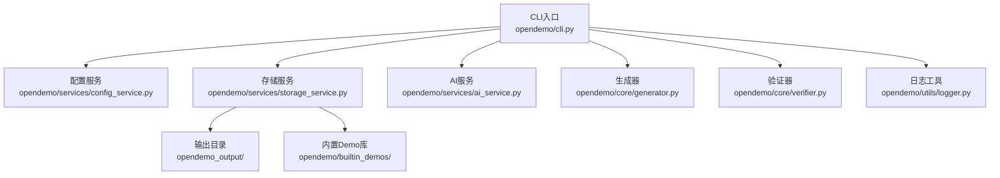
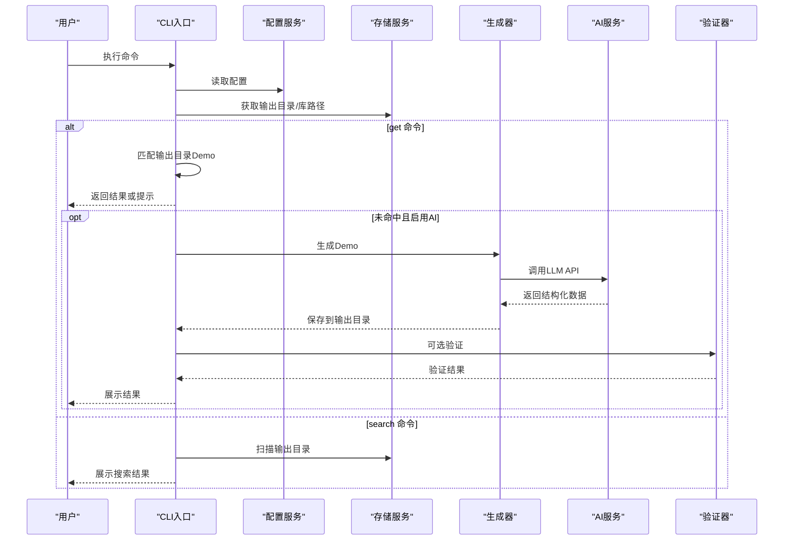
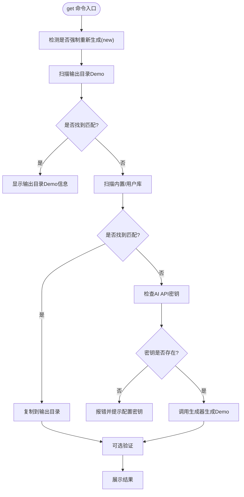
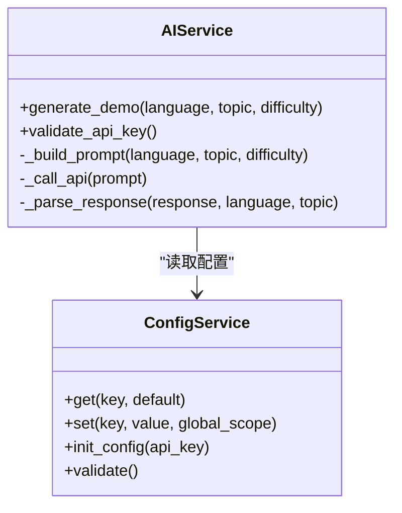
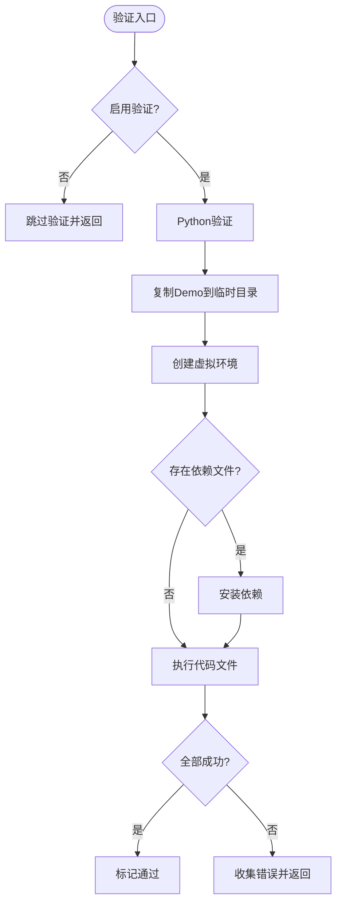
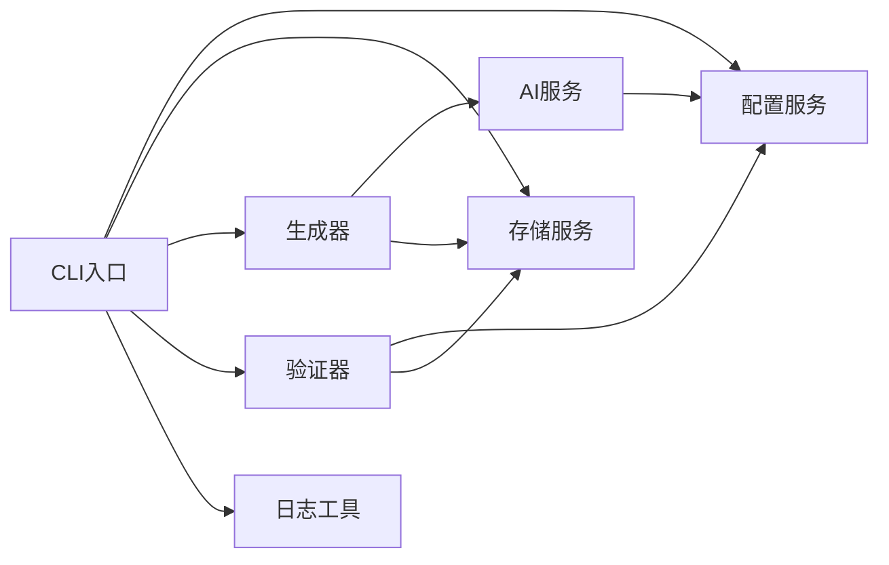

# 故障排除

<cite>
**本文引用的文件**
- [ABOUT.md](file://ABOUT.md)
- [TEST_REPORT.md](file://TEST_REPORT.md)
- [README.md](file://README.md)
- [USAGE_GUIDE.md](file://USAGE_GUIDE.md)
- [opendemo/cli.py](file://opendemo/cli.py)
- [opendemo/services/ai_service.py](file://opendemo/services/ai_service.py)
- [opendemo/services/config_service.py](file://opendemo/services/config_service.py)
- [opendemo/services/storage_service.py](file://opendemo/services/storage_service.py)
- [opendemo/core/generator.py](file://opendemo/core/generator.py)
- [opendemo/core/verifier.py](file://opendemo/core/verifier.py)
- [opendemo/utils/logger.py](file://opendemo/utils/logger.py)
- [opendemo/builtin_demos/python/python-tuple-basics/metadata.json](file://opendemo/builtin_demos/python/python-tuple-basics/metadata.json)
- [opendemo/builtin_demos/python/python-tuple-basics/requirements.txt](file://opendemo/builtin_demos/python/python-tuple-basics/requirements.txt)
</cite>

## 目录
1. [简介](#简介)
2. [项目结构](#项目结构)
3. [核心组件](#核心组件)
4. [架构总览](#架构总览)
5. [详细组件分析](#详细组件分析)
6. [依赖关系分析](#依赖关系分析)
7. [性能考虑](#性能考虑)
8. [故障排除指南](#故障排除指南)
9. [结论](#结论)
10. [附录](#附录)

## 简介
本指南面向使用 opendemo-cli 的用户，系统性梳理常见问题与解决方案，覆盖 AI 功能配置、Demo 搜索为空、验证失败、依赖安装错误等场景。文档结合测试报告与使用手册中的信息，提供面向初学者的快速修复步骤与面向高级用户的日志分析方法。

## 项目结构
- CLI 入口与命令分发：opendemo/cli.py
- 服务层：AI 服务、配置服务、存储服务
- 核心逻辑：生成器、验证器、搜索与匹配
- 工具与日志：统一日志工具
- 内置 Demo 库与输出目录约定

图表来源
- [opendemo/cli.py](file://opendemo/cli.py#L1-L120)
- [opendemo/services/config_service.py](file://opendemo/services/config_service.py#L1-L120)
- [opendemo/services/storage_service.py](file://opendemo/services/storage_service.py#L1-L120)
- [opendemo/services/ai_service.py](file://opendemo/services/ai_service.py#L1-L120)
- [opendemo/core/generator.py](file://opendemo/core/generator.py#L1-L80)
- [opendemo/core/verifier.py](file://opendemo/core/verifier.py#L1-L80)
- [opendemo/utils/logger.py](file://opendemo/utils/logger.py#L1-L65)

章节来源
- [README.md](file://README.md#L60-L120)
- [ABOUT.md](file://ABOUT.md#L20-L120)

## 核心组件
- CLI 命令分发与流程控制：search/get/new/config
- 配置服务：全局/项目配置合并、校验、读写
- 存储服务：输出目录、内置/用户库路径、文件读写与复制
- AI 服务：API 密钥加载、请求构造、重试、响应解析
- 生成器：协调 AI 生成、补充元数据、保存到输出目录
- 验证器：Python 验证（虚拟环境、依赖安装、执行）

章节来源
- [opendemo/cli.py](file://opendemo/cli.py#L196-L324)
- [opendemo/services/config_service.py](file://opendemo/services/config_service.py#L16-L120)
- [opendemo/services/storage_service.py](file://opendemo/services/storage_service.py#L190-L223)
- [opendemo/services/ai_service.py](file://opendemo/services/ai_service.py#L31-L120)
- [opendemo/core/generator.py](file://opendemo/core/generator.py#L31-L103)
- [opendemo/core/verifier.py](file://opendemo/core/verifier.py#L31-L120)

## 架构总览
CLI 命令在入口中初始化日志、加载配置、创建各服务实例，并根据命令分支执行搜索、获取、生成或配置管理逻辑。AI 生成功能依赖配置中的 API 密钥与端点；验证功能依赖配置开关与超时设置。

图表来源
- [opendemo/cli.py](file://opendemo/cli.py#L196-L384)
- [opendemo/services/ai_service.py](file://opendemo/services/ai_service.py#L38-L120)
- [opendemo/core/generator.py](file://opendemo/core/generator.py#L31-L103)
- [opendemo/core/verifier.py](file://opendemo/core/verifier.py#L31-L120)

## 详细组件分析

### CLI 命令与匹配逻辑
- get 命令优先在输出目录匹配，再回退到内置/用户库，最后调用 AI 生成。
- search 命令扫描输出目录并按关键字过滤，支持无语言参数列出可用语言。
- new 命令要求配置 API 密钥，生成后可选验证并询问贡献。

图表来源
- [opendemo/cli.py](file://opendemo/cli.py#L240-L324)
- [opendemo/core/generator.py](file://opendemo/core/generator.py#L31-L103)

章节来源
- [opendemo/cli.py](file://opendemo/cli.py#L196-L324)
- [TEST_REPORT.md](file://TEST_REPORT.md#L105-L211)

### AI 服务与重试机制
- 加载配置中的 API 密钥、端点、模型、温度、最大 token、超时与重试次数/间隔。
- 生成前构建 prompt，调用 API 并解析响应，支持多种响应包裹形式。
- 提供 API 密钥有效性验证方法。

图表来源
- [opendemo/services/ai_service.py](file://opendemo/services/ai_service.py#L16-L120)
- [opendemo/services/config_service.py](file://opendemo/services/config_service.py#L147-L203)

章节来源
- [opendemo/services/ai_service.py](file://opendemo/services/ai_service.py#L31-L209)
- [opendemo/services/config_service.py](file://opendemo/services/config_service.py#L16-L120)

### 验证器（Python）
- 启用验证时，创建临时目录与虚拟环境，安装依赖，执行代码文件，统计步骤、输出与错误。
- 超时由配置项控制，默认约 5 分钟；不支持时返回超时错误。

图表来源
- [opendemo/core/verifier.py](file://opendemo/core/verifier.py#L31-L120)
- [opendemo/core/verifier.py](file://opendemo/core/verifier.py#L120-L203)

章节来源
- [opendemo/core/verifier.py](file://opendemo/core/verifier.py#L31-L203)

### 存储服务与输出目录
- 输出目录默认为当前目录下的 opendemo_output，可通过配置修改。
- 内置/用户库路径分别指向包内内置库与用户目录 ~/.opendemo/demos。
- 读写文件、复制/删除目录、确保目录存在等。

章节来源
- [opendemo/services/storage_service.py](file://opendemo/services/storage_service.py#L190-L223)
- [ABOUT.md](file://ABOUT.md#L267-L288)

## 依赖关系分析
- CLI 依赖配置服务、存储服务、AI 服务、生成器、验证器与日志工具。
- 生成器依赖 AI 服务与 Demo 管理器（由存储服务提供）。
- 验证器依赖配置服务与存储服务。
- AI 服务依赖配置服务与网络请求。

图表来源
- [opendemo/cli.py](file://opendemo/cli.py#L1-L120)
- [opendemo/core/generator.py](file://opendemo/core/generator.py#L1-L80)
- [opendemo/core/verifier.py](file://opendemo/core/verifier.py#L1-L80)
- [opendemo/services/ai_service.py](file://opendemo/services/ai_service.py#L1-L80)
- [opendemo/services/config_service.py](file://opendemo/services/config_service.py#L1-L80)
- [opendemo/services/storage_service.py](file://opendemo/services/storage_service.py#L1-L80)

## 性能考虑
- 搜索与匹配：扫描输出目录并读取 metadata.json，建议保持输出目录整洁、避免过多无关子目录。
- AI 生成：受网络与模型限制，合理设置超时与重试；必要时降低温度与最大 token。
- 验证：Python 验证会创建虚拟环境与安装依赖，耗时较长；可关闭验证或调整超时。

[本节为通用指导，不涉及具体文件分析]

## 故障排除指南

### 1. AI 功能无法使用（API 密钥未配置）
现象
- get/new 命令提示“AI API密钥未配置”，或生成失败。

可能原因
- 未设置配置项 ai.api_key；或配置文件路径不正确。

排查步骤
- 初始化并设置密钥：
  - 使用交互式初始化：opendemo config init
  - 或直接设置：opendemo config set ai.api_key YOUR_KEY
- 检查配置文件位置：
  - 全局配置：~/.opendemo/config.yaml
  - 项目配置：当前目录 .opendemo.yaml
- 验证密钥有效性：
  - 可使用 AI 服务提供的验证方法（内部实现），或手动访问端点确认连通性。

解决方案
- 完成密钥设置后重试生成命令。
- 若使用第三方端点，确认 ai.api_endpoint 与模型名称正确。

章节来源
- [opendemo/cli.py](file://opendemo/cli.py#L283-L301)
- [opendemo/services/config_service.py](file://opendemo/services/config_service.py#L220-L241)
- [ABOUT.md](file://ABOUT.md#L291-L307)

---

### 2. Demo 搜索结果为空
现象
- search 命令显示“可用的语言: python: 0 个demo”或过滤后无结果。

可能原因
- 输出目录不存在或未生成过 Demo
- 输出目录存在但缺少 metadata.json
- 关键字过于精确或不匹配

排查步骤
- 确认输出目录存在且包含语言子目录：
  - 默认路径：opendemo_output/<语言>/
  - 可通过配置修改 output_directory
- 检查 Demo 目录是否包含 metadata.json：
  - 内置 Demo 示例：opendemo/builtin_demos/python/python-tuple-basics/metadata.json
- 尝试更宽泛的关键字或先列出所有 Demo 再缩小范围。

解决方案
- 先执行 get 命令获取一个 Demo，使其写入输出目录并生成 metadata.json
- 使用 search 无语言参数查看可用语言及数量
- 适当放宽关键字或使用内置 Demo 名称进行精确匹配

章节来源
- [opendemo/cli.py](file://opendemo/cli.py#L346-L384)
- [opendemo/services/storage_service.py](file://opendemo/services/storage_service.py#L49-L83)
- [TEST_REPORT.md](file://TEST_REPORT.md#L13-L21)
- [ABOUT.md](file://ABOUT.md#L319-L324)

---

### 3. 验证失败（依赖安装/执行错误）
现象
- 启用验证后，生成的 Demo 无法通过验证，出现依赖安装失败或执行异常。

可能原因
- Python 版本不兼容
- requirements.txt 中依赖不可用或版本冲突
- 代码存在 bug 或运行时异常
- 验证超时设置过短

排查步骤
- 查看验证报告中的步骤、输出与错误：
  - 验证器会记录复制、创建虚拟环境、安装依赖、执行文件等步骤
  - 输出包含各文件的标准输出与错误
- 检查 requirements.txt 是否存在且可安装：
  - 若为空或仅注释，验证器不会安装依赖
- 手动复现验证流程：
  - 在输出目录创建虚拟环境，安装依赖，执行代码文件
- 调整验证超时：
  - 配置 verification_timeout（秒），默认约 5 分钟

解决方案
- 修正 requirements.txt 或移除不必要的依赖
- 修改代码以修复运行时错误
- 适当提高 verification_timeout
- 临时关闭验证以快速定位问题

章节来源
- [opendemo/core/verifier.py](file://opendemo/core/verifier.py#L31-L203)
- [opendemo/services/config_service.py](file://opendemo/services/config_service.py#L16-L49)
- [USAGE_GUIDE.md](file://USAGE_GUIDE.md#L277-L297)

---

### 4. 依赖安装错误（pip 安装失败）
现象
- 验证阶段安装依赖时报错，例如网络超时、权限不足或包不可用。

可能原因
- 网络受限或代理未配置
- pip 源不可用或版本过低
- requirements.txt 中存在不受支持的包或版本

排查步骤
- 手动在输出目录的临时环境中执行 pip install -r requirements.txt
- 更换 pip 源或升级 pip
- 检查 requirements.txt 是否包含非主流或不稳定包

解决方案
- 优化网络或代理设置
- 使用国内镜像源
- 精简依赖或锁定版本
- 临时禁用验证以绕过依赖问题

章节来源
- [opendemo/core/verifier.py](file://opendemo/core/verifier.py#L144-L170)
- [opendemo/builtin_demos/python/python-tuple-basics/requirements.txt](file://opendemo/builtin_demos/python/python-tuple-basics/requirements.txt#L1-L2)

---

### 5. get 命令未命中且触发 AI 生成
现象
- 输入关键字未在输出目录找到匹配，系统提示“未找到匹配的demo”，随后尝试调用 AI 生成。

可能原因
- 关键字与 Demo 名称不一致
- 未配置 API 密钥导致生成失败

排查步骤
- 使用精确的 Demo 名称（如完整文件夹名）进行匹配
- 确认 ai.api_key 已设置
- 检查 AI 端点与模型配置是否正确

解决方案
- 优先使用内置 Demo 名称或更贴近的语义关键字
- 完成密钥与端点配置后重试

章节来源
- [opendemo/cli.py](file://opendemo/cli.py#L243-L301)
- [TEST_REPORT.md](file://TEST_REPORT.md#L105-L211)

---

### 6. 日志与调试
现象
- 命令执行异常但提示信息有限。

排查步骤
- 查看全局日志文件：
  - 路径：~/.opendemo/logs/opendemo.log
- 启动时 CLI 已初始化日志，异常会被记录并打印到控制台
- 结合验证报告与 AI 响应解析日志定位问题

解决方案
- 根据日志中的错误堆栈与关键信息（如 API 调用失败、JSON 解析失败、依赖安装失败）逐项修复
- 对于 AI 响应解析失败，检查模型返回格式或调整 prompt

章节来源
- [opendemo/cli.py](file://opendemo/cli.py#L32-L40)
- [opendemo/utils/logger.py](file://opendemo/utils/logger.py#L13-L65)
- [opendemo/services/ai_service.py](file://opendemo/services/ai_service.py#L226-L291)

---

### 7. 配置项缺失或无效
现象
- 配置读取不到或设置后不生效。

排查步骤
- 使用 config list 查看当前生效配置
- 使用 config get 检查单个配置项
- 确认配置文件路径与优先级：
  - 全局配置：~/.opendemo/config.yaml
  - 项目配置：当前目录 .opendemo.yaml（优先级更高）
- 使用 config set 设置配置项，注意布尔值与整数类型的转换

解决方案
- 重新设置并验证配置项
- 如需全局生效，明确使用 --global 选项

章节来源
- [opendemo/services/config_service.py](file://opendemo/services/config_service.py#L147-L203)
- [ABOUT.md](file://ABOUT.md#L267-L288)

---

### 8. Demo 目录结构不规范
现象
- 搜索结果缺少关键字或描述信息。

可能原因
- 缺少 metadata.json 或字段不完整
- 未按约定放置 code/requirements.txt 等文件

排查步骤
- 参考内置 Demo 结构：
  - metadata.json、README.md、code/、requirements.txt/pom.xml、tests/（可选）
- 确认 metadata.json 字段完整（名称、语言、关键字、难度等）

解决方案
- 按约定补齐 metadata.json 与文件结构
- 重新生成或复制 Demo 后再次搜索

章节来源
- [ABOUT.md](file://ABOUT.md#L240-L264)
- [opendemo/builtin_demos/python/python-tuple-basics/metadata.json](file://opendemo/builtin_demos/python/python-tuple-basics/metadata.json#L1-L14)

## 结论
通过本指南，用户可快速定位并解决 opendemo-cli 常见问题：从 AI 配置、搜索结果为空、验证失败到依赖安装错误。建议在日常使用中：
- 始终配置并验证 API 密钥
- 使用 search 先列出可用 Demo，再缩小关键字
- 启用验证时关注超时与依赖，必要时临时关闭验证
- 通过日志与验证报告定位根因，逐步修复

[本节为总结性内容，不涉及具体文件分析]

## 附录

### 常见命令与配置参考
- 初始化配置：opendemo config init
- 设置密钥：opendemo config set ai.api_key YOUR_KEY
- 查看配置：opendemo config list / get / set
- 搜索 Demo：opendemo search python
- 获取 Demo：opendemo get python logging
- 生成 Demo：opendemo new python 主题
- 启用验证：opendemo config set enable_verification true

章节来源
- [README.md](file://README.md#L29-L61)
- [USAGE_GUIDE.md](file://USAGE_GUIDE.md#L108-L127)
- [ABOUT.md](file://ABOUT.md#L291-L307)