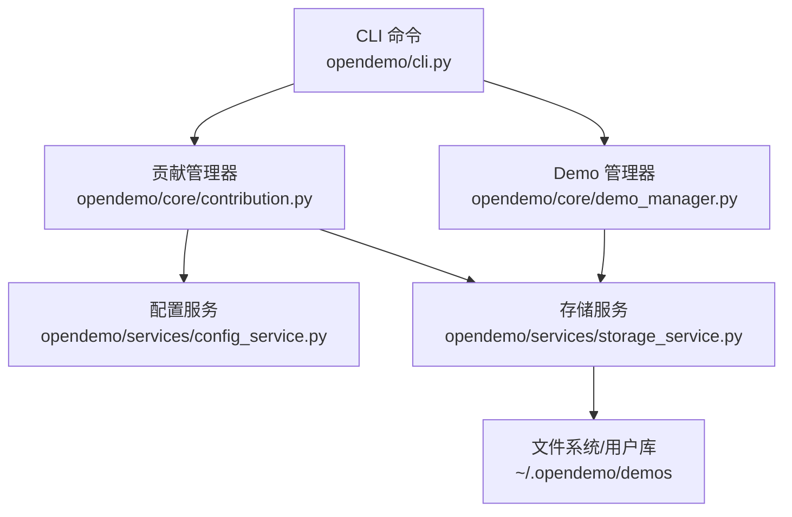
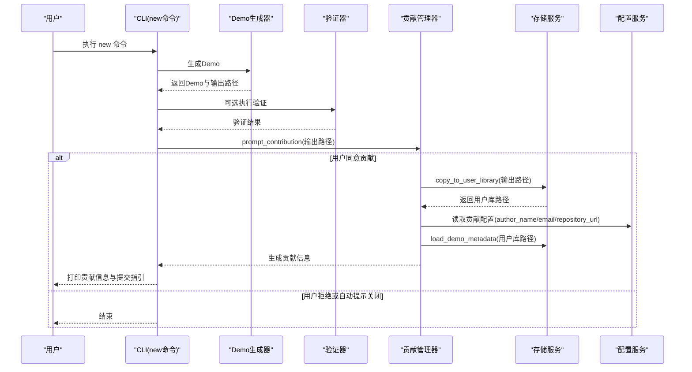
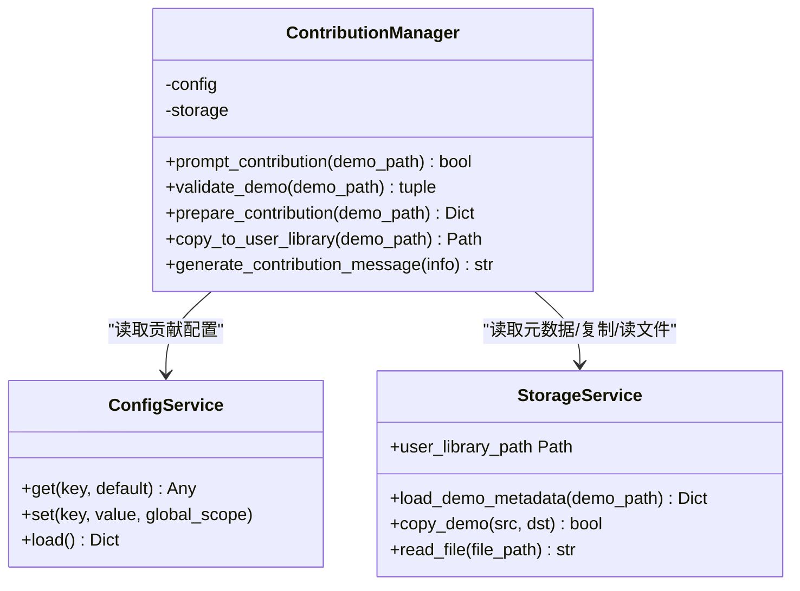
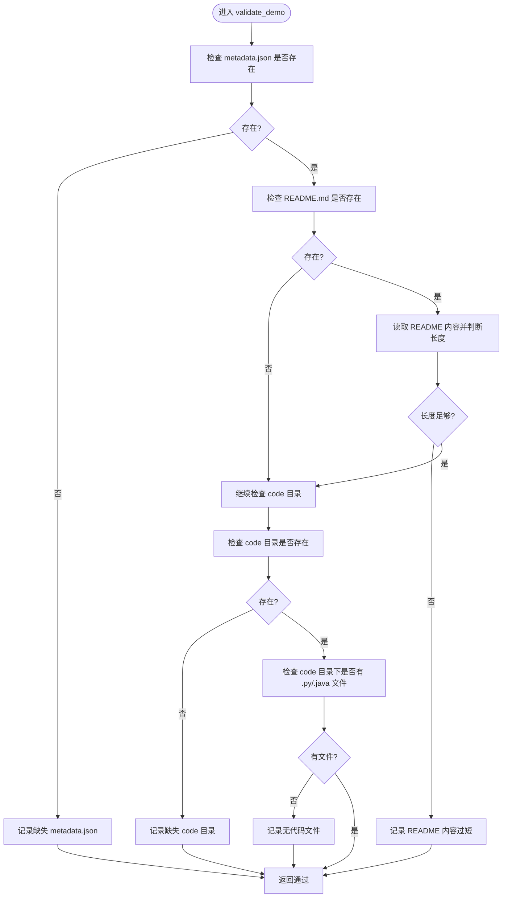
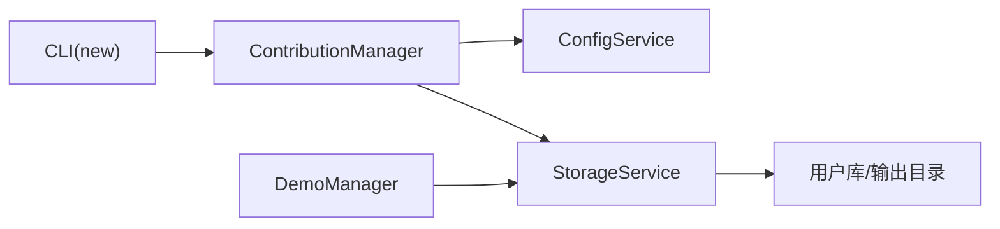

# 贡献机制

<cite>
**本文引用的文件**
- [contribution.py](file://opendemo/core/contribution.py)
- [cli.py](file://opendemo/cli.py)
- [config_service.py](file://opendemo/services/config_service.py)
- [storage_service.py](file://opendemo/services/storage_service.py)
- [demo_manager.py](file://opendemo/core/demo_manager.py)
- [USAGE_GUIDE.md](file://USAGE_GUIDE.md)
</cite>

## 目录
1. [简介](#简介)
2. [项目结构](#项目结构)
3. [核心组件](#核心组件)
4. [架构总览](#架构总览)
5. [详细组件分析](#详细组件分析)
6. [依赖关系分析](#依赖关系分析)
7. [性能与可靠性考量](#性能与可靠性考量)
8. [故障排查指南](#故障排查指南)
9. [结论](#结论)
10. [附录：贡献流程与最佳实践](#附录贡献流程与最佳实践)

## 简介
本文件围绕 OpenDemo CLI 的“贡献机制”展开，聚焦于如何将高质量的 Demo 贡献到公共库。文档基于源码分析，系统阐述 contribution.py 中的贡献流程管理，包括质量检查、用户库管理、贡献信息生成；解释用户在使用 new 命令后如何被提示贡献，以及贡献的 Demo 如何被保存和准备提交；说明贡献配置项（如 author_name、author_email）的作用；并结合 USAGE_GUIDE.md 提供实际流程示例，既面向初学者给出简单易懂的贡献指南，也为维护者提供关于贡献流程管理和质量控制的技术细节。

## 项目结构
贡献机制涉及 CLI 命令、贡献管理器、配置服务、存储服务与 Demo 管理器等模块。下图展示与贡献相关的模块关系与交互。

图表来源
- [cli.py](file://opendemo/cli.py#L386-L472)
- [contribution.py](file://opendemo/core/contribution.py#L1-L176)
- [config_service.py](file://opendemo/services/config_service.py#L16-L49)
- [storage_service.py](file://opendemo/services/storage_service.py#L16-L48)
- [demo_manager.py](file://opendemo/core/demo_manager.py#L74-L110)

章节来源
- [cli.py](file://opendemo/cli.py#L386-L472)
- [contribution.py](file://opendemo/core/contribution.py#L1-L176)
- [config_service.py](file://opendemo/services/config_service.py#L16-L49)
- [storage_service.py](file://opendemo/services/storage_service.py#L16-L48)
- [demo_manager.py](file://opendemo/core/demo_manager.py#L74-L110)

## 核心组件
- 贡献管理器（ContributionManager）
  - 负责贡献流程的完整生命周期：提示贡献、质量检查、准备贡献信息、复制到用户库、生成贡献提交信息。
- 配置服务（ConfigService）
  - 提供贡献相关的配置项读取，如 contribution.auto_prompt、contribution.author_name、contribution.author_email、contribution.repository_url 等。
- 存储服务（StorageService）
  - 提供用户库路径、读写文件、复制 Demo、加载元数据等能力，支撑贡献流程中的持久化与元数据访问。
- Demo 管理器（DemoManager）
  - 提供 Demo 对象封装、元数据更新、复制到输出目录等能力，配合贡献流程完成元数据与文件的组织。
- CLI 命令（new）
  - new 命令生成 Demo 后，触发贡献提示与后续流程。

章节来源
- [contribution.py](file://opendemo/core/contribution.py#L14-L176)
- [config_service.py](file://opendemo/services/config_service.py#L16-L49)
- [storage_service.py](file://opendemo/services/storage_service.py#L106-L160)
- [demo_manager.py](file://opendemo/core/demo_manager.py#L132-L201)
- [cli.py](file://opendemo/cli.py#L386-L472)

## 架构总览
下图展示 new 命令触发贡献流程的关键调用序列。

图表来源
- [cli.py](file://opendemo/cli.py#L386-L472)
- [contribution.py](file://opendemo/core/contribution.py#L28-L176)
- [storage_service.py](file://opendemo/services/storage_service.py#L167-L189)
- [config_service.py](file://opendemo/services/config_service.py#L147-L168)

## 详细组件分析

### 贡献管理器（ContributionManager）
- 角色定位
  - 负责贡献流程的编排：提示贡献、质量检查、准备贡献信息、复制到用户库、生成贡献提交信息。
- 关键职责
  - prompt_contribution：根据配置决定是否提示用户贡献，支持 y/yes/是 等输入。
  - validate_demo：对 Demo 进行质量检查，确保包含 metadata.json、README.md、code 目录及至少一种代码文件；校验 README 内容长度。
  - prepare_contribution：加载元数据，组装贡献信息（名称、语言、描述、作者、作者邮箱、仓库地址等），供后续生成提交信息使用。
  - copy_to_user_library：将 Demo 复制到用户库对应语言子目录，便于统一管理与后续提交。
  - generate_contribution_message：生成标准化的贡献提交信息模板，包含作者、语言、描述、验证清单与说明。
- 与服务的协作
  - 依赖配置服务读取贡献配置项。
  - 依赖存储服务读取/写入文件、复制 Demo、加载元数据。

图表来源
- [contribution.py](file://opendemo/core/contribution.py#L14-L176)
- [config_service.py](file://opendemo/services/config_service.py#L147-L168)
- [storage_service.py](file://opendemo/services/storage_service.py#L106-L189)

章节来源
- [contribution.py](file://opendemo/core/contribution.py#L28-L176)

### 质量检查流程（validate_demo）
- 检查清单
  - 必需文件：metadata.json、README.md。
  - 代码目录：code，且至少包含一种代码文件（支持 .py、.java）。
  - README 内容长度：若存在则应超过一定阈值（避免过短）。
- 返回值
  - 返回布尔值与错误列表，供调用方决定是否继续贡献流程。

图表来源
- [contribution.py](file://opendemo/core/contribution.py#L48-L83)

章节来源
- [contribution.py](file://opendemo/core/contribution.py#L48-L83)

### 用户库管理（copy_to_user_library）
- 目标
  - 将通过质量检查的 Demo 复制到用户库，按语言分类存放，便于统一管理与后续提交。
- 路径策略
  - 依据 Demo 元数据中的 language 字段，将 Demo 放置在用户库根路径下的对应语言子目录中。
- 失败处理
  - 若复制失败，返回 None 并由上层流程提示错误。

章节来源
- [contribution.py](file://opendemo/core/contribution.py#L120-L147)
- [storage_service.py](file://opendemo/services/storage_service.py#L167-L189)
- [config_service.py](file://opendemo/services/config_service.py#L20-L27)

### 贡献信息生成（generate_contribution_message）
- 输入
  - 贡献信息字典，包含 Demo 名称、语言、描述、作者、作者邮箱、仓库地址等。
- 输出
  - 标准化 Markdown 文本，包含标题、作者信息、验证清单、说明等，便于直接粘贴到 Issue/PR。
- 作用
  - 降低贡献门槛，帮助贡献者快速生成规范的提交信息。

章节来源
- [contribution.py](file://opendemo/core/contribution.py#L148-L176)

### CLI 中的贡献触发（new 命令）
- 流程要点
  - new 命令生成 Demo 后，若满足条件（配置允许自动提示且用户确认），则：
    1) 复制到用户库；
    2) 准备贡献信息；
    3) 生成并打印贡献提交信息；
    4) 提示用户前往仓库提交。
- 关键配置
  - contribution.auto_prompt：控制是否自动提示贡献。
  - contribution.author_name、contribution.author_email：贡献信息中的作者与邮箱。
  - contribution.repository_url：贡献目标仓库地址。

章节来源
- [cli.py](file://opendemo/cli.py#L386-L472)
- [config_service.py](file://opendemo/services/config_service.py#L38-L43)

## 依赖关系分析
- 组件耦合
  - ContributionManager 依赖 ConfigService 与 StorageService，耦合度适中，职责清晰。
  - CLI 仅在 new 命令中触发贡献流程，避免了对其他命令的侵入。
- 外部依赖
  - 文件系统：用户库目录、输出目录、元数据文件、README 等。
  - 配置文件：~/.opendemo/config.yaml。
- 循环依赖
  - 未发现循环依赖，模块边界清晰。

图表来源
- [contribution.py](file://opendemo/core/contribution.py#L14-L176)
- [cli.py](file://opendemo/cli.py#L386-L472)
- [storage_service.py](file://opendemo/services/storage_service.py#L16-L48)
- [demo_manager.py](file://opendemo/core/demo_manager.py#L74-L110)

章节来源
- [contribution.py](file://opendemo/core/contribution.py#L14-L176)
- [cli.py](file://opendemo/cli.py#L386-L472)
- [storage_service.py](file://opendemo/services/storage_service.py#L16-L48)
- [demo_manager.py](file://opendemo/core/demo_manager.py#L74-L110)

## 性能与可靠性考量
- 质量检查复杂度
  - validate_demo 为线性扫描，时间复杂度 O(n)，其中 n 为 code 目录下文件数量，开销较小。
- 复制操作
  - copy_to_user_library 采用目录复制，受文件数量与大小影响；建议在大型 Demo 时注意磁盘空间与 IO 性能。
- 配置读取
  - ConfigService 使用惰性加载与缓存，减少重复读取 YAML 的开销。
- 错误处理
  - 各模块均包含异常捕获与日志记录，保证流程在失败时仍可继续或回退。

[本节为一般性指导，无需特定文件引用]

## 故障排查指南
- 无法提示贡献
  - 检查配置 contribution.auto_prompt 是否为 true。
  - 章节来源
    - [config_service.py](file://opendemo/services/config_service.py#L38-L43)
- 质量检查失败
  - 确认 Demo 包含 metadata.json、README.md、code 目录及至少一种代码文件；README 内容长度应足够。
  - 章节来源
    - [contribution.py](file://opendemo/core/contribution.py#L48-L83)
- 复制到用户库失败
  - 检查用户库路径是否存在且可写；确认磁盘空间充足。
  - 章节来源
    - [storage_service.py](file://opendemo/services/storage_service.py#L167-L189)
    - [config_service.py](file://opendemo/services/config_service.py#L20-L27)
- 无法加载元数据
  - 确认 metadata.json 存在且可读；检查 JSON 格式是否正确。
  - 章节来源
    - [storage_service.py](file://opendemo/services/storage_service.py#L106-L129)

## 结论
贡献机制以 ContributionManager 为核心，串联配置、存储与 CLI，形成“提示—检查—复制—生成”的闭环流程。通过明确的质量检查标准与标准化的贡献信息模板，既降低了贡献门槛，又提升了贡献质量。对于维护者而言，贡献流程具备良好的扩展性与可维护性，便于在未来引入更严格的验证或自动化提交流程。

[本节为总结性内容，无需特定文件引用]

## 附录：贡献流程与最佳实践

### 贡献配置项说明
- contribution.auto_prompt
  - 控制 new 命令结束后是否自动提示贡献，默认开启。
- contribution.author_name / contribution.author_email
  - 贡献信息中的作者与邮箱，用于生成贡献提交信息。
- contribution.repository_url
  - 贡献目标仓库地址，用于提示用户提交到何处。

章节来源
- [config_service.py](file://opendemo/services/config_service.py#L38-L43)
- [contribution.py](file://opendemo/core/contribution.py#L108-L116)

### 贡献流程（基于 USAGE_GUIDE.md 的实际示例）
- 步骤概览
  1) 使用 new 命令生成 Demo；
  2) 系统提示是否贡献到公共库；
  3) 同意后，Demo 被复制到用户库；
  4) 生成贡献信息并打印；
  5) 手动前往仓库提交。
- 实际示例（摘自 USAGE_GUIDE.md）
  - new 命令后出现“是否贡献”的提示；
  - 同意后，系统打印“已将demo保存到用户库”的提示；
  - 最终提示“请手动将demo提交到仓库”。

章节来源
- [USAGE_GUIDE.md](file://USAGE_GUIDE.md#L299-L316)
- [cli.py](file://opendemo/cli.py#L451-L471)
- [contribution.py](file://opendemo/core/contribution.py#L120-L176)

### 贡献前质量自查清单
- 必备文件
  - metadata.json、README.md、code 目录及至少一种代码文件。
- README 内容
  - 内容充实，能指导读者快速理解与运行 Demo。
- 代码可执行性
  - 本地验证通过，依赖声明清晰（如 requirements.txt）。

章节来源
- [contribution.py](file://opendemo/core/contribution.py#L48-L83)
- [demo_manager.py](file://opendemo/core/demo_manager.py#L272-L328)

### 维护者视角：贡献流程管理与质量控制
- 可扩展点
  - 在 validate_demo 中增加更多规则（如最小代码行数、依赖完整性检查）。
  - 在 generate_contribution_message 中加入更多模板化字段（如难度、关键词）。
  - 在 CLI 层面增加“自动提交”选项（需谨慎处理认证与分支策略）。
- 日志与可观测性
  - 借助日志记录贡献流程各阶段的状态，便于追踪与审计。
- 配置管理
  - 通过 ConfigService 的 set/get 接口集中管理贡献相关配置，避免硬编码。

章节来源
- [contribution.py](file://opendemo/core/contribution.py#L28-L176)
- [config_service.py](file://opendemo/services/config_service.py#L147-L203)