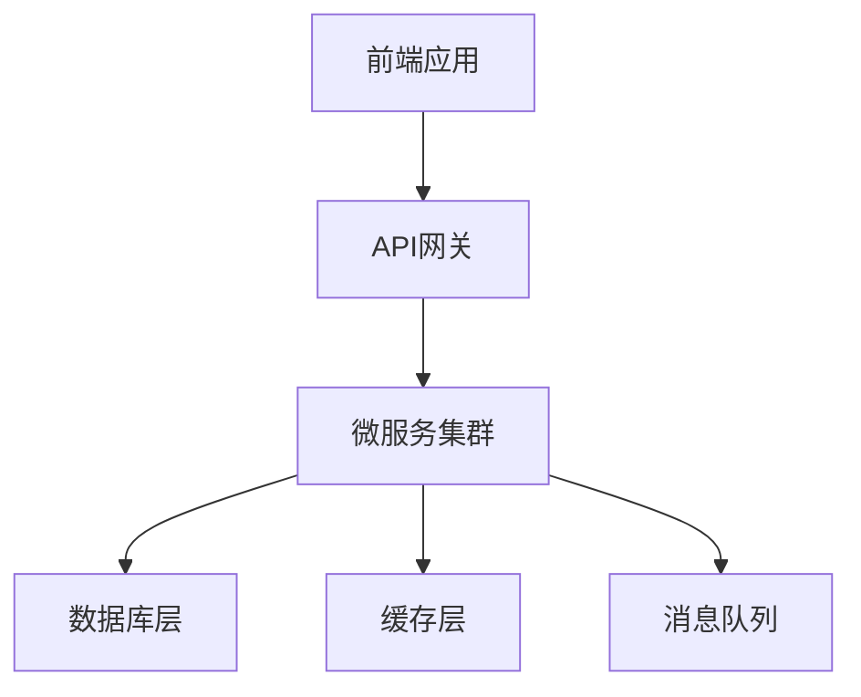
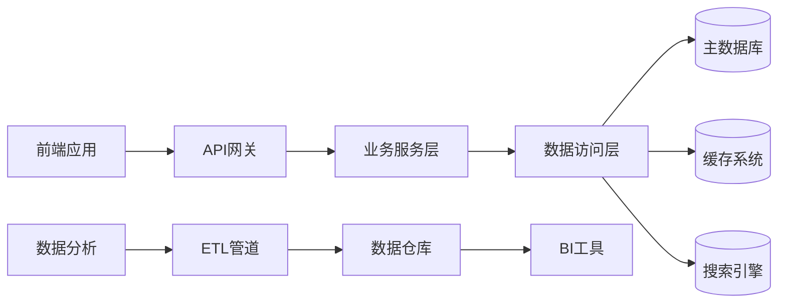

# 🔗 跨技术栈集成案例建设规划

> 日期：2026年1月30日  
> 版本：1.0.0  
> 作者：OpenDemo团队

---

## 📊 现状分析与建设目标

### 当前跨技术整合状况
- **单一技术栈案例**：各技术栈相对独立
- **集成案例缺失**：缺乏实际应用场景整合
- **全栈开发案例**：Real-world项目案例不足
- **微服务架构**：分布式系统集成案例有限

### 建设目标
```
跨技术栈集成目标：
├── 案例数量：30+个综合性项目
├── 技术融合：前后端+数据库+运维全栈
├── 场景覆盖：电商、社交、企业应用等
└── 实用性强：可直接用于生产环境
```

---

## 🎯 跨技术集成案例体系设计

### 1. 全栈Web应用系列 (10个案例)

#### 电商平台完整案例
```
电商系统全栈开发：
├── frontend-react-shop-demo           # React前端商城
├── backend-springboot-api-demo        # Spring Boot后端API
├── database-postgresql-demo           # PostgreSQL数据层
├── redis-cache-shopping-cart-demo     # Redis购物车缓存
├── payment-stripe-integration-demo    # Stripe支付集成
├── email-notification-demo            # 邮件通知服务
├── search-elasticsearch-demo          # Elasticsearch搜索
├── monitoring-prometheus-demo         # Prometheus监控
├── deployment-kubernetes-demo         # Kubernetes部署
└── cicd-jenkins-pipeline-demo         # CI/CD流水线
```

#### 社交媒体平台案例
```
社交网络应用集成：
├── vuejs-frontend-social-demo         # Vue.js社交前端
├── nodejs-express-backend-demo        # Express后端服务
├── mongodb-user-profile-demo          # MongoDB用户数据
├── websocket-realtime-chat-demo       # WebSocket实时聊天
├── image-processing-demo              # 图片处理服务
├── recommendation-engine-demo         # 推荐算法引擎
├── analytics-google-integration-demo  # Google Analytics集成
├── mobile-react-native-demo           # React Native移动端
├── api-gateway-demo                   # API网关管理
└── microservices-architecture-demo    # 微服务架构
```

### 2. 企业级应用系列 (8个案例)

#### CRM客户关系管理系统
```
企业CRM系统集成：
├── angular-admin-panel-demo           # Angular管理后台
├── java-spring-enterprise-demo        # Java企业后端
├── oracle-database-demo               # Oracle数据库
├── ldap-authentication-demo           # LDAP认证集成
├── reporting-jasperreports-demo       # Jasper报表系统
├── workflow-activiti-demo             # Activiti工作流
├── document-management-demo           # 文档管理系统
└── enterprise-security-demo           # 企业安全架构
```

#### 财务管理系统案例
```
财务管理应用：
├── react-financial-dashboard-demo     # React财务仪表板
├── python-flask-accounting-demo       # Flask会计服务
├── mysql-financial-data-demo          # MySQL财务数据
├── blockchain-transaction-demo        # 区块链交易记录
├── audit-logging-demo                 # 审计日志系统
├── compliance-checking-demo           # 合规检查模块
├── multi-currency-support-demo        # 多货币支持
└── financial-reporting-demo           # 财务报告生成
```

### 3. 数据分析与AI应用系列 (6个案例)

#### 商业智能平台
```
BI商业智能系统：
├── react-d3-dashboard-demo            # React + D3数据可视化
├── python-data-processing-demo        # Python数据处理
├── spark-big-data-demo                # Spark大数据分析
├── kafka-streaming-demo               # Kafka实时流处理
├── machine-learning-model-demo        # 机器学习模型
├── tableau-integration-demo           # Tableau集成
├── automated-reporting-demo           # 自动化报告
└── predictive-analytics-demo          # 预测分析引擎
```

#### 智能推荐系统
```
AI推荐引擎：
├── frontend-recommendation-demo       # 推荐前端界面
├── tensorflow-serving-demo            # TensorFlow模型服务
├── feature-engineering-demo           # 特征工程管道
├── ab-testing-platform-demo           # A/B测试平台
├── user-behavior-analytics-demo       # 用户行为分析
├── real-time-recommendation-demo      # 实时推荐服务
├── model-monitoring-demo              # 模型监控系统
└── feedback-loop-demo                 # 反馈闭环机制
```

### 4. DevOps与云原生系列 (6个案例)

#### 云原生微服务架构
```
现代化云原生应用：
├── multi-language-microservices-demo  # 多语言微服务
├── service-mesh-istio-demo            # Istio服务网格
├── serverless-functions-demo          # Serverless函数
├── gitops-argo-cd-demo                # GitOps部署
├── observability-stack-demo           # 可观测性栈
├── chaos-engineering-demo             # 混沌工程实践
├── security-scanning-demo             # 安全扫描集成
└── cost-optimization-demo             # 成本优化策略
```

#### 容器化部署流水线
```
容器化CI/CD实践：
├── docker-compose-fullstack-demo      # Docker Compose全栈
├── kubernetes-helm-chart-demo         # Helm Charts部署
├── terraform-infrastructure-demo      # Terraform基础设施
├── ansible-configuration-demo         # Ansible配置管理
├── vault-secrets-management-demo      # Vault密钥管理
├── istio-canary-deployment-demo       # Istio金丝雀发布
├── blue-green-deployment-demo         # 蓝绿部署策略
└── auto-scaling-kubernetes-demo       # 自动扩缩容
```

---

## 📚 集成案例文档标准

### 1. 系统架构文档模板
```markdown
# 🏗️ 系统架构设计文档

## 🎯 项目概述
### 业务背景
### 技术目标
### 预期成果

## 🏛️ 整体架构
### 架构图


### 技术栈选型
| 层次 | 技术选型 | 选择理由 |
|------|----------|----------|
| 前端 | React/Vue | 组件化开发，生态丰富 |
| 后端 | Spring Boot/Node.js | 高性能，开发效率高 |
| 数据库 | PostgreSQL/MongoDB | 根据数据特点选择 |
| 缓存 | Redis | 高性能缓存方案 |
| 部署 | Kubernetes | 容器化，弹性伸缩 |

## 🔧 核心模块设计
### 模块划分
### 接口设计
### 数据流向

## 🛡️ 安全架构
### 认证授权
### 数据安全
### 网络安全

## 📊 性能考量
### 性能指标
### 优化策略
### 监控方案
```

### 2. 部署运维文档模板
```markdown
# 🚀 部署与运维指南

## 🛠️ 环境准备
### 基础设施要求
### 依赖服务安装
### 环境变量配置

## 📦 部署流程
### 本地开发环境
```bash
# 克隆项目
git clone [repository-url]

# 安装依赖
npm install && mvn install

# 启动服务
docker-compose up -d
```

### 生产环境部署
```bash
# Kubernetes部署
kubectl apply -f k8s/

# Helm部署
helm install my-app ./charts/app

# 验证部署
kubectl get pods
```

## 🔍 监控告警
### 监控指标配置
### 告警规则设置
### 日志收集分析

## 🔄 CI/CD流程
### 自动化构建
### 测试流水线
### 部署策略
```

### 3. 多技术栈协调规范
```markdown
# 🔗 多技术栈协调规范

## 🎨 代码风格统一
### 命名规范
- 前端：camelCase变量命名
- 后端：snake_case数据库字段
- API：kebab-case接口路径

### 项目结构
```
project-root/
├── frontend/           # 前端代码
├── backend/            # 后端代码
├── infrastructure/     # 基础设施配置
├── docs/              # 文档资料
└── scripts/           # 脚本工具
```

## 📡 API接口规范
### RESTful设计原则
### 数据传输格式
### 错误处理统一

## 🔐 安全标准
### 认证授权统一
### 数据加密标准
### 安全审计要求

## 📊 测试策略
### 单元测试覆盖率
### 集成测试范围
### 端到端测试场景
```

---

## 🛠️ 实施策略与技术方案

### 1. 技术整合方法论

#### 微服务架构整合
```
微服务整合策略：
├── 服务拆分原则
│   ├── 单一职责原则
│   ├── 业务边界清晰
│   └── 数据隔离设计
├── 通信机制
│   ├── RESTful API
│   ├── gRPC协议
│   ├── 消息队列
│   └── 事件驱动
└── 治理策略
    ├── 服务注册发现
    ├── 负载均衡
    ├── 熔断降级
    └── 配置中心
```

#### 前后端分离架构
```
前后端协作模式：
├── 接口契约
│   ├── API文档规范
│   ├── Mock数据约定
│   └── 联调测试流程
├── 开发协作
│   ├── 并行开发机制
│   ├── 版本同步策略
│   └── 代码审查流程
└── 部署集成
    ├── 自动化构建
    ├── 环境一致性
    └── 灰度发布
```

### 2. 数据流转设计方案

#### 统一数据层架构


#### 事件驱动架构
```
事件驱动设计：
├── 事件发布订阅
├── 消息队列集成
├── 事件溯源模式
└── CQRS架构模式
```

### 3. 部署运维一体化

#### 容器化部署方案
```
容器化策略：
├── Docker镜像构建
│   ├── 多阶段构建
│   ├── 镜像优化
│   └── 安全扫描
├── Kubernetes编排
│   ├── Helm Charts管理
│   ├── 资源配额控制
│   └── 自动扩缩容
└── 服务网格集成
    ├── 流量管理
    ├── 安全策略
    └── 可观测性
```

#### 监控告警体系
```
全方位监控：
├── 应用性能监控(APM)
├── 基础设施监控
├── 业务指标监控
├── 用户体验监控
└── 安全威胁监控
```

---

## 📈 质量保障与评估体系

### 1. 集成测试策略
```
分层测试体系：
├── 单元测试层
│   ├── 各技术栈独立测试
│   ├── 组件级别测试
│   └── 服务接口测试
├── 集成测试层
│   ├── 接口集成测试
│   ├── 数据流测试
│   └── 服务间调用测试
└── 端到端测试层
    ├── 用户场景测试
    ├── 业务流程测试
    └── 性能压力测试
```

### 2. 质量评估标准
```
集成案例质量指标：
├── 功能完整性 ≥ 95%
├── 代码覆盖率 ≥ 80%
├── 性能指标达标率 ≥ 90%
├── 安全扫描通过率 100%
├── 文档完整性 100%
└── 用户满意度 ≥ 4.5/5.0
```

### 3. 持续改进机制
```
质量改进循环：
├── 定期代码审查
├── 技术债务跟踪
├── 用户反馈收集
├── 性能瓶颈分析
└── 最佳实践总结
```

---

## 🚀 实施路线图

### 第一阶段：基础整合案例 (4周)
- [ ] 完成2个全栈Web应用案例
- [ ] 建立技术整合标准规范
- [ ] 完善CI/CD集成流程
- [ ] 建立监控告警体系

### 第二阶段：企业级应用 (3周)
- [ ] 完成2个企业级集成案例
- [ ] 深化微服务架构实践
- [ ] 完善安全合规方案
- [ ] 建立性能优化标准

### 第三阶段：AI与数据分析 (3周)
- [ ] 完成2个AI集成案例
- [ ] 建立数据处理流水线
- [ ] 完善机器学习部署
- [ ] 建立模型监控体系

### 第四阶段：云原生与DevOps (2周)
- [ ] 完成2个云原生案例
- [ ] 深化容器化实践经验
- [ ] 完善GitOps工作流
- [ ] 建立成本优化策略

---

## 💡 预期价值与影响

### 项目价值提升
- **案例多样性**：增加30+个综合性项目案例
- **技术深度**：展现真实世界的复杂技术整合
- **实用价值**：提供可直接应用的企业级解决方案
- **学习效果**：帮助学习者理解技术间的关联和协作

### 用户受益
- **全栈能力**：掌握从前端到后端的完整技术栈
- **架构思维**：培养系统性思考和架构设计能力
- **实战经验**：积累真实项目开发和运维经验
- **就业竞争力**：具备企业级项目交付能力

### 生态影响
- **行业标杆**：建立技术整合案例的新标准
- **教育创新**：推动综合性技术教育发展
- **社区贡献**：为开发者提供高质量学习资源
- **技术推广**：促进现代软件开发方法普及

---

> **💡 总结**：通过系统化的跨技术栈集成案例建设，我们将打造真正贴近实际应用场景的学习资源，帮助开发者全面提升技术整合能力和项目实战水平。