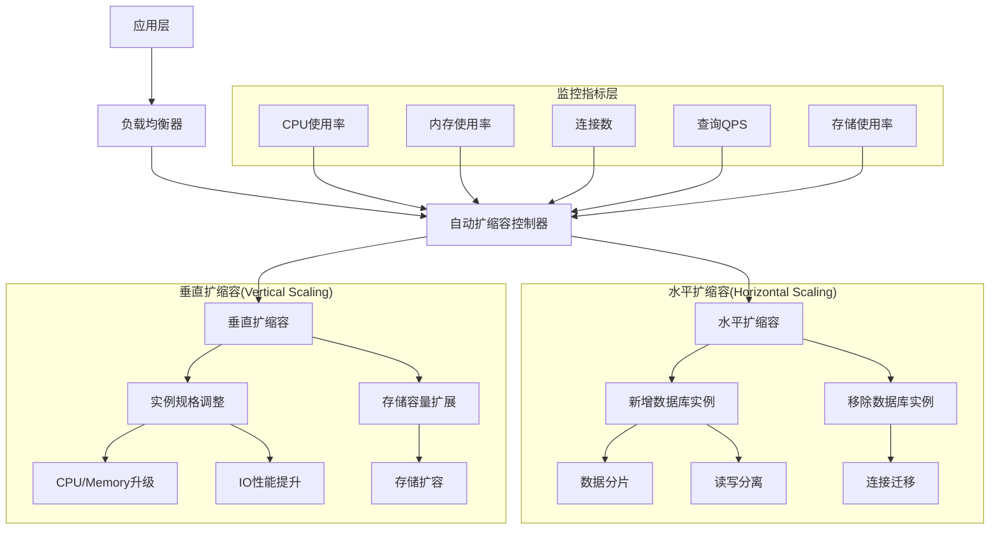
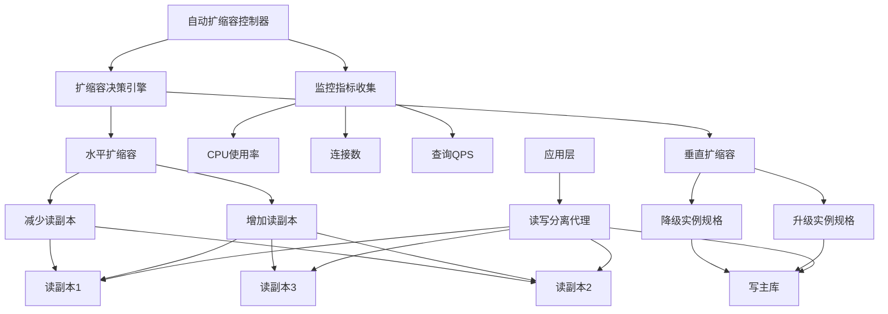

# 数据库自动扩缩容配置完整指南

## 🎯 概述

数据库自动扩缩容是现代云原生应用实现弹性伸缩的关键技术，通过智能化的资源调配机制应对流量波动和性能需求变化。本指南深入探讨水平扩缩容和垂直扩缩容的技术实现，提供从Kubernetes到云服务商的完整自动扩缩容解决方案。

## 📋 目录

1. [自动扩缩容基础理论](#1-自动扩缩容基础理论)
2. [Kubernetes HPA配置](#2-kubernetes-hpa配置)
3. [云服务商自动扩缩容](#3-云服务商自动扩缩容)
4. [数据库专用扩缩容策略](#4-数据库专用扩缩容策略)
5. [扩缩容监控与告警](#5-扩缩容监控与告警)
6. [最佳实践与故障处理](#6-最佳实践与故障处理)

---

## 1. 自动扩缩容基础理论

### 1.1 扩缩容类型与原理

#### 扩缩容架构模式


#### 扩缩容决策矩阵
```python
# auto_scaling_decision_engine.py
import numpy as np
from typing import Dict, List, Tuple, Any
from dataclasses import dataclass
from enum import Enum

class ScalingType(Enum):
    HORIZONTAL_UP = "horizontal_up"
    HORIZONTAL_DOWN = "horizontal_down"
    VERTICAL_UP = "vertical_up"
    VERTICAL_DOWN = "vertical_down"
    NO_SCALING = "no_scaling"

@dataclass
class ScalingMetrics:
    cpu_utilization: float
    memory_utilization: float
    connection_count: int
    query_per_second: float
    storage_utilization: float
    response_time: float

@dataclass
class ScalingDecision:
    scaling_type: ScalingType
    confidence: float
    reason: str
    recommended_action: str

class AutoScalingDecisionEngine:
    def __init__(self):
        # 扩缩容阈值配置
        self.thresholds = {
            'cpu_high': 0.75,
            'cpu_critical': 0.85,
            'memory_high': 0.80,
            'memory_critical': 0.90,
            'connections_high': 0.70,
            'qps_high': 0.80,
            'storage_high': 0.85,
            'response_time_high': 2.0,  # 秒
            'cooldown_period': 300  # 5分钟冷却期
        }
        
        self.scaling_history = []
        self.last_scaling_time = 0
    
    def make_scaling_decision(self, current_metrics: ScalingMetrics, 
                            current_resources: Dict[str, Any]) -> ScalingDecision:
        """基于当前指标做出扩缩容决策"""
        
        # 检查冷却期
        import time
        current_time = time.time()
        if current_time - self.last_scaling_time < self.thresholds['cooldown_period']:
            return ScalingDecision(
                scaling_type=ScalingType.NO_SCALING,
                confidence=1.0,
                reason="冷却期内，暂不执行扩缩容",
                recommended_action="维持当前资源配置"
            )
        
        # 多维度指标分析
        scaling_factors = self._analyze_scaling_factors(current_metrics, current_resources)
        
        # 综合决策
        decision = self._make_comprehensive_decision(scaling_factors, current_resources)
        
        # 记录决策历史
        self.scaling_history.append({
            'timestamp': current_time,
            'metrics': current_metrics.__dict__,
            'decision': decision.__dict__
        })
        
        return decision
    
    def _analyze_scaling_factors(self, metrics: ScalingMetrics, 
                               resources: Dict[str, Any]) -> Dict[str, float]:
        """分析各个维度的扩缩容因子"""
        factors = {}
        
        # CPU使用率因子
        if metrics.cpu_utilization > self.thresholds['cpu_critical']:
            factors['cpu'] = 1.0
        elif metrics.cpu_utilization > self.thresholds['cpu_high']:
            factors['cpu'] = 0.7
        else:
            factors['cpu'] = 0.0
        
        # 内存使用率因子
        if metrics.memory_utilization > self.thresholds['memory_critical']:
            factors['memory'] = 1.0
        elif metrics.memory_utilization > self.thresholds['memory_high']:
            factors['memory'] = 0.7
        else:
            factors['memory'] = 0.0
        
        # 连接数因子
        max_connections = resources.get('max_connections', 1000)
        connection_ratio = metrics.connection_count / max_connections
        if connection_ratio > self.thresholds['connections_high']:
            factors['connections'] = 0.8
        else:
            factors['connections'] = 0.0
        
        # QPS因子
        max_qps = resources.get('max_qps', 10000)
        qps_ratio = metrics.query_per_second / max_qps
        if qps_ratio > self.thresholds['qps_high']:
            factors['qps'] = 0.9
        else:
            factors['qps'] = 0.0
        
        # 存储使用率因子
        if metrics.storage_utilization > self.thresholds['storage_high']:
            factors['storage'] = 0.6
        else:
            factors['storage'] = 0.0
        
        # 响应时间因子
        if metrics.response_time > self.thresholds['response_time_high']:
            factors['response_time'] = 0.8
        else:
            factors['response_time'] = 0.0
        
        return factors
    
    def _make_comprehensive_decision(self, factors: Dict[str, float], 
                                   resources: Dict[str, Any]) -> ScalingDecision:
        """综合多个因子做出最终决策"""
        
        # 计算综合评分
        total_score = sum(factors.values())
        max_possible_score = len(factors)  # 最大可能得分为因子数量
        
        # 归一化评分
        normalized_score = total_score / max_possible_score if max_possible_score > 0 else 0
        
        # 确定扩缩容类型
        if normalized_score > 0.7:  # 高压力
            # 检查是否支持水平扩展
            if resources.get('supports_horizontal_scaling', False) and factors.get('qps', 0) > 0.8:
                scaling_type = ScalingType.HORIZONTAL_UP
                reason = "高负载且支持水平扩展，建议增加实例"
            else:
                scaling_type = ScalingType.VERTICAL_UP
                reason = "高负载但不支持水平扩展，建议升级实例规格"
                
        elif normalized_score > 0.4:  # 中等压力
            # 检查是否有缩减空间
            if (resources.get('current_replicas', 1) > resources.get('min_replicas', 1) and 
                factors.get('qps', 0) < 0.3):
                scaling_type = ScalingType.HORIZONTAL_DOWN
                reason = "负载较低且实例数超过最小值，建议减少实例"
            elif (resources.get('current_spec', '') != resources.get('min_spec', '') and
                  max(factors.values()) < 0.3):
                scaling_type = ScalingType.VERTICAL_DOWN
                reason = "负载较低且规格高于最小值，建议降级实例"
            else:
                scaling_type = ScalingType.NO_SCALING
                reason = "负载适中，无需扩缩容"
        else:  # 低压力
            scaling_type = ScalingType.NO_SCALING
            reason = "负载较低，维持当前配置"
        
        # 计算置信度
        confidence = min(1.0, normalized_score + 0.2)  # 基础置信度加上一些余量
        
        # 生成推荐动作
        recommended_action = self._generate_recommended_action(scaling_type, factors, resources)
        
        return ScalingDecision(
            scaling_type=scaling_type,
            confidence=confidence,
            reason=reason,
            recommended_action=recommended_action
        )
    
    def _generate_recommended_action(self, scaling_type: ScalingType, 
                                   factors: Dict[str, float], 
                                   resources: Dict[str, Any]) -> str:
        """生成具体的推荐动作"""
        
        if scaling_type == ScalingType.HORIZONTAL_UP:
            current_replicas = resources.get('current_replicas', 1)
            max_replicas = resources.get('max_replicas', 10)
            increment = min(2, max_replicas - current_replicas)  # 每次最多增加2个实例
            return f"将实例数从 {current_replicas} 增加到 {current_replicas + increment}"
        
        elif scaling_type == ScalingType.HORIZONTAL_DOWN:
            current_replicas = resources.get('current_replicas', 1)
            min_replicas = resources.get('min_replicas', 1)
            decrement = min(1, current_replicas - min_replicas)  # 每次最多减少1个实例
            return f"将实例数从 {current_replicas} 减少到 {current_replicas - decrement}"
        
        elif scaling_type == ScalingType.VERTICAL_UP:
            current_spec = resources.get('current_spec', 'small')
            upgrade_options = {
                'small': 'medium',
                'medium': 'large',
                'large': 'xlarge'
            }
            new_spec = upgrade_options.get(current_spec, current_spec)
            return f"将实例规格从 {current_spec} 升级到 {new_spec}"
        
        elif scaling_type == ScalingType.VERTICAL_DOWN:
            current_spec = resources.get('current_spec', 'small')
            downgrade_options = {
                'xlarge': 'large',
                'large': 'medium',
                'medium': 'small'
            }
            new_spec = downgrade_options.get(current_spec, current_spec)
            return f"将实例规格从 {current_spec} 降级到 {new_spec}"
        
        else:
            return "维持当前资源配置不变"
    
    def predict_future_scaling_needs(self, historical_data: List[Dict]) -> List[Dict[str, Any]]:
        """预测未来的扩缩容需求"""
        predictions = []
        
        # 简单的时间序列预测
        if len(historical_data) >= 24:  # 至少需要24小时的数据
            # 按小时聚合数据
            hourly_stats = self._aggregate_hourly_stats(historical_data)
            
            # 预测未来24小时的需求
            for hour in range(24):
                predicted_metrics = self._predict_hourly_metrics(hourly_stats, hour)
                current_resources = {}  # 当前资源配置信息
                decision = self.make_scaling_decision(predicted_metrics, current_resources)
                
                predictions.append({
                    'hour': hour,
                    'predicted_metrics': predicted_metrics.__dict__,
                    'scaling_decision': decision.__dict__
                })
        
        return predictions
    
    def _aggregate_hourly_stats(self, historical_data: List[Dict]) -> Dict[int, List[ScalingMetrics]]:
        """按小时聚合历史统计数据"""
        hourly_stats = {}
        
        for record in historical_data:
            hour = record['timestamp'].hour
            metrics = ScalingMetrics(**record['metrics'])
            
            if hour not in hourly_stats:
                hourly_stats[hour] = []
            hourly_stats[hour].append(metrics)
        
        return hourly_stats
    
    def _predict_hourly_metrics(self, hourly_stats: Dict[int, List[ScalingMetrics]], 
                              target_hour: int) -> ScalingMetrics:
        """预测指定小时的指标"""
        # 简单的移动平均预测
        recent_hours = [(target_hour - i) % 24 for i in range(1, 8)]  # 最近7个小时
        
        predictions = {
            'cpu_utilization': [],
            'memory_utilization': [],
            'connection_count': [],
            'query_per_second': [],
            'storage_utilization': [],
            'response_time': []
        }
        
        for hour in recent_hours:
            if hour in hourly_stats and hourly_stats[hour]:
                # 取该小时的平均值
                hour_metrics = hourly_stats[hour]
                avg_cpu = np.mean([m.cpu_utilization for m in hour_metrics])
                avg_memory = np.mean([m.memory_utilization for m in hour_metrics])
                avg_connections = np.mean([m.connection_count for m in hour_metrics])
                avg_qps = np.mean([m.query_per_second for m in hour_metrics])
                avg_storage = np.mean([m.storage_utilization for m in hour_metrics])
                avg_response = np.mean([m.response_time for m in hour_metrics])
                
                predictions['cpu_utilization'].append(avg_cpu)
                predictions['memory_utilization'].append(avg_memory)
                predictions['connection_count'].append(avg_connections)
                predictions['query_per_second'].append(avg_qps)
                predictions['storage_utilization'].append(avg_storage)
                predictions['response_time'].append(avg_response)
        
        # 返回预测的平均值
        return ScalingMetrics(
            cpu_utilization=np.mean(predictions['cpu_utilization']) if predictions['cpu_utilization'] else 0.5,
            memory_utilization=np.mean(predictions['memory_utilization']) if predictions['memory_utilization'] else 0.5,
            connection_count=int(np.mean(predictions['connection_count'])) if predictions['connection_count'] else 100,
            query_per_second=int(np.mean(predictions['query_per_second'])) if predictions['query_per_second'] else 1000,
            storage_utilization=np.mean(predictions['storage_utilization']) if predictions['storage_utilization'] else 0.5,
            response_time=np.mean(predictions['response_time']) if predictions['response_time'] else 1.0
        )

# 使用示例
engine = AutoScalingDecisionEngine()

# 模拟当前指标
current_metrics = ScalingMetrics(
    cpu_utilization=0.82,
    memory_utilization=0.75,
    connection_count=800,
    query_per_second=5000,
    storage_utilization=0.60,
    response_time=1.5
)

# 当前资源配置
current_resources = {
    'current_replicas': 3,
    'max_replicas': 10,
    'min_replicas': 2,
    'current_spec': 'medium',
    'max_connections': 1000,
    'max_qps': 10000,
    'supports_horizontal_scaling': True
}

# 做出扩缩容决策
decision = engine.make_scaling_decision(current_metrics, current_resources)
print(f"扩缩容决策: {decision.scaling_type.value}")
print(f"置信度: {decision.confidence:.2f}")
print(f"原因: {decision.reason}")
print(f"推荐动作: {decision.recommended_action}")
```

### 1.2 扩缩容策略模型

#### 动态扩缩容策略
```yaml
# auto-scaling-strategy.yaml
apiVersion: autoscaling/v2
kind: HorizontalPodAutoscaler
metadata:
  name: database-autoscaler
  namespace: database-system
spec:
  scaleTargetRef:
    apiVersion: apps/v1
    kind: StatefulSet
    name: database-cluster
  minReplicas: 2
  maxReplicas: 10
  
  # 多指标扩缩容策略
  metrics:
  - type: Resource
    resource:
      name: cpu
      target:
        type: Utilization
        averageUtilization: 70
  
  - type: Resource
    resource:
      name: memory
      target:
        type: Utilization
        averageUtilization: 80
  
  - type: Pods
    pods:
      metric:
        name: database_connections
      target:
        type: AverageValue
        averageValue: "500"
  
  - type: External
    external:
      metric:
        name: database_qps
      target:
        type: AverageValue
        averageValue: "2000"
  
  # 行为配置
  behavior:
    scaleDown:
      stabilizationWindowSeconds: 300
      policies:
      - type: Percent
        value: 10
        periodSeconds: 60
      - type: Pods
        value: 1
        periodSeconds: 60
      selectPolicy: Min
    
    scaleUp:
      stabilizationWindowSeconds: 60
      policies:
      - type: Percent
        value: 50
        periodSeconds: 60
      - type: Pods
        value: 2
        periodSeconds: 60
      selectPolicy: Max
```

## 2. Kubernetes HPA配置

### 2.1 HPA基础配置

#### 数据库HPA配置模板
```yaml
# database-hpa.yaml
apiVersion: autoscaling/v2
kind: HorizontalPodAutoscaler
metadata:
  name: mysql-hpa
  namespace: database
spec:
  scaleTargetRef:
    apiVersion: apps/v1
    kind: StatefulSet
    name: mysql-cluster
  minReplicas: 3
  maxReplicas: 15
  
  # 复合指标配置
  metrics:
  # CPU使用率指标
  - type: Resource
    resource:
      name: cpu
      target:
        type: Utilization
        averageUtilization: 75
  
  # 内存使用率指标
  - type: Resource
    resource:
      name: memory
      target:
        type: Utilization
        averageUtilization: 85
  
  # 自定义指标 - 数据库连接数
  - type: Pods
    pods:
      metric:
        name: database_connections
      target:
        type: AverageValue
        averageValue: "800"
  
  # 自定义指标 - 查询QPS
  - type: Pods
    pods:
      metric:
        name: database_qps
      target:
        type: AverageValue
        averageValue: "3000"
  
  # 自定义指标 - 响应时间
  - type: Pods
    pods:
      metric:
        name: database_response_time_ms
      target:
        type: AverageValue
        averageValue: "2000m"  # 2秒，使用milli单位
  
  # 外部指标 - 业务指标
  - type: External
    external:
      metric:
        name: business_transaction_rate
      target:
        type: AverageValue
        averageValue: "1000"

# 高级行为配置
behavior:
  # 缩容策略
  scaleDown:
    # 稳定期窗口
    stabilizationWindowSeconds: 300
    
    # 缩容策略
    policies:
    # 每分钟最多缩容10%
    - type: Percent
      value: 10
      periodSeconds: 60
    
    # 每分钟最多缩容1个Pod
    - type: Pods
      value: 1
      periodSeconds: 60
    
    # 选择最保守的策略
    selectPolicy: Min
  
  # 扩容策略
  scaleUp:
    # 稳定期窗口
    stabilizationWindowSeconds: 60
    
    # 扩容策略
    policies:
    # 每分钟最多扩容50%
    - type: Percent
      value: 50
      periodSeconds: 60
    
    # 每分钟最多扩容2个Pod
    - type: Pods
      value: 2
      periodSeconds: 60
    
    # 选择最激进的策略
    selectPolicy: Max
```

### 2.2 自定义指标适配器

#### Prometheus指标适配器配置
```yaml
# prometheus-adapter-config.yaml
apiVersion: v1
kind: ConfigMap
metadata:
  name: adapter-config
  namespace: custom-metrics
data:
  config.yaml: |
    rules:
    # 数据库连接数指标
    - seriesQuery: 'database_connections'
      resources:
        overrides:
          namespace:
            resource: namespace
          pod:
            resource: pod
      name:
        matches: "database_connections"
        as: "database_connections"
      metricsQuery: 'sum(database_connections{<<.LabelMatchers>>}) by (<<.GroupBy>>)'
    
    # 数据库QPS指标
    - seriesQuery: 'database_qps'
      resources:
        overrides:
          namespace:
            resource: namespace
          pod:
            resource: pod
      name:
        matches: "database_qps"
        as: "database_qps"
      metricsQuery: 'sum(rate(database_qps{<<.LabelMatchers>>}[5m])) by (<<.GroupBy>>)'
    
    # 数据库响应时间指标
    - seriesQuery: 'database_response_time_seconds'
      resources:
        overrides:
          namespace:
            resource: namespace
          pod:
            resource: pod
      name:
        matches: "database_response_time_seconds"
        as: "database_response_time_seconds"
      metricsQuery: 'avg(database_response_time_seconds{<<.LabelMatchers>>}) by (<<.GroupBy>>)'
    
    # 存储使用率指标
    - seriesQuery: 'database_storage_utilization'
      resources:
        overrides:
          namespace:
            resource: namespace
          pod:
            resource: pod
      name:
        matches: "database_storage_utilization"
        as: "database_storage_utilization"
      metricsQuery: 'avg(database_storage_utilization{<<.LabelMatchers>>}) by (<<.GroupBy>>)'
```

#### 自定义指标采集器
```python
# custom_metrics_collector.py
import time
import threading
from prometheus_client import Gauge, start_http_server
import pymysql
import psutil

class DatabaseMetricsCollector:
    def __init__(self, db_config: dict, port: int = 8000):
        self.db_config = db_config
        self.port = port
        
        # 初始化Prometheus指标
        self.connections_gauge = Gauge(
            'database_connections',
            'Current number of database connections',
            ['database']
        )
        
        self.qps_gauge = Gauge(
            'database_qps',
            'Database queries per second',
            ['database']
        )
        
        self.response_time_gauge = Gauge(
            'database_response_time_seconds',
            'Average database response time in seconds',
            ['database']
        )
        
        self.storage_utilization_gauge = Gauge(
            'database_storage_utilization',
            'Database storage utilization ratio',
            ['database']
        )
        
        self.previous_queries = 0
        self.start_time = time.time()
        
    def collect_metrics(self):
        """收集数据库指标"""
        try:
            # 建立数据库连接
            connection = pymysql.connect(**self.db_config)
            cursor = connection.cursor()
            
            # 收集连接数
            cursor.execute("SHOW STATUS LIKE 'Threads_connected'")
            connections = int(cursor.fetchone()[1])
            self.connections_gauge.labels(database=self.db_config['database']).set(connections)
            
            # 收集QPS
            cursor.execute("SHOW STATUS LIKE 'Questions'")
            current_queries = int(cursor.fetchone()[1])
            current_time = time.time()
            
            if hasattr(self, 'previous_queries'):
                time_delta = current_time - self.start_time
                qps = (current_queries - self.previous_queries) / time_delta if time_delta > 0 else 0
                self.qps_gauge.labels(database=self.db_config['database']).set(qps)
            
            self.previous_queries = current_queries
            self.start_time = current_time
            
            # 收集响应时间（简化实现）
            start_query = time.time()
            cursor.execute("SELECT 1")
            cursor.fetchone()
            response_time = time.time() - start_query
            self.response_time_gauge.labels(database=self.db_config['database']).set(response_time)
            
            # 收集存储使用率
            cursor.execute("SELECT table_schema, SUM(data_length + index_length) as size FROM information_schema.tables GROUP BY table_schema")
            schemas = cursor.fetchall()
            
            total_size = sum(size for _, size in schemas)
            # 这里需要获取总存储空间，简化处理
            storage_utilization = min(1.0, total_size / (100 * 1024 * 1024 * 1024))  # 假设100GB总空间
            self.storage_utilization_gauge.labels(database=self.db_config['database']).set(storage_utilization)
            
            cursor.close()
            connection.close()
            
        except Exception as e:
            print(f"指标收集失败: {str(e)}")
    
    def start_collection(self, interval: int = 30):
        """启动指标收集"""
        # 启动Prometheus HTTP服务器
        start_http_server(self.port)
        print(f"Prometheus指标服务器启动在端口 {self.port}")
        
        # 定期收集指标
        def collect_loop():
            while True:
                self.collect_metrics()
                time.sleep(interval)
        
        collector_thread = threading.Thread(target=collect_loop, daemon=True)
        collector_thread.start()
        
        return collector_thread

# 使用示例
if __name__ == "__main__":
    db_config = {
        'host': 'localhost',
        'port': 3306,
        'user': 'monitor_user',
        'password: "${DB_PASSWORD}",
        'database': 'production_db'
    }
    
    collector = DatabaseMetricsCollector(db_config)
    collector.start_collection(interval=30)
    
    # 保持程序运行
    try:
        while True:
            time.sleep(1)
    except KeyboardInterrupt:
        print("指标收集器停止")
```

## 3. 云服务商自动扩缩容

### 3.1 AWS RDS自动扩缩容

#### RDS自动扩缩容配置
```python
# aws_rds_autoscaling.py
import boto3
import json
from typing import Dict, List, Any
import time

class RDSAutoScaler:
    def __init__(self, region: str = 'us-east-1'):
        self.rds_client = boto3.client('rds', region_name=region)
        self.cloudwatch_client = boto3.client('cloudwatch', region_name=region)
        self.application_autoscaling_client = boto3.client('application-autoscaling', region_name=region)
    
    def setup_rds_autoscaling(self, db_instance_identifier: str, 
                            min_capacity: int = 2, max_capacity: int = 16) -> bool:
        """设置RDS自动扩缩容"""
        try:
            # 注册可扩展目标
            self._register_scalable_target(db_instance_identifier, min_capacity, max_capacity)
            
            # 创建扩缩容策略
            self._create_scaling_policies(db_instance_identifier)
            
            # 配置CloudWatch告警
            self._setup_cloudwatch_alarms(db_instance_identifier)
            
            return True
        except Exception as e:
            print(f"RDS自动扩缩容设置失败: {str(e)}")
            return False
    
    def _register_scalable_target(self, db_instance_identifier: str, 
                                min_capacity: int, max_capacity: int):
        """注册可扩展目标"""
        response = self.application_autoscaling_client.register_scalable_target(
            ServiceNamespace='rds',
            ResourceId=f'db:{db_instance_identifier}',
            ScalableDimension='rds:cluster:ReadReplicaCount',
            MinCapacity=min_capacity,
            MaxCapacity=max_capacity
        )
        print(f"可扩展目标注册成功: {response}")
    
    def _create_scaling_policies(self, db_instance_identifier: str):
        """创建扩缩容策略"""
        # 扩容策略
        scale_out_policy = {
            'PolicyName': f'{db_instance_identifier}-scale-out',
            'ServiceNamespace': 'rds',
            'ResourceId': f'db:{db_instance_identifier}',
            'ScalableDimension': 'rds:cluster:ReadReplicaCount',
            'PolicyType': 'TargetTrackingScaling',
            'TargetTrackingScalingPolicyConfiguration': {
                'TargetValue': 70.0,  # CPU使用率目标70%
                'PredefinedMetricSpecification': {
                    'PredefinedMetricType': 'RDSReaderAverageCPUUtilization'
                },
                'ScaleOutCooldown': 300,  # 5分钟扩容冷却期
                'ScaleInCooldown': 300,   # 5分钟缩容冷却期
                'DisableScaleIn': False
            }
        }
        
        # 存储自动扩展策略
        storage_scaling_policy = {
            'PolicyName': f'{db_instance_identifier}-storage-scaling',
            'ServiceNamespace': 'rds',
            'ResourceId': f'db:{db_instance_identifier}',
            'ScalableDimension': 'rds:cluster:Storage',
            'PolicyType': 'TargetTrackingScaling',
            'TargetTrackingScalingPolicyConfiguration': {
                'TargetValue': 80.0,  # 存储使用率目标80%
                'CustomizedMetricSpecification': {
                    'MetricName': 'FreeStorageSpace',
                    'Namespace': 'AWS/RDS',
                    'Dimensions': [
                        {
                            'Name': 'DBInstanceIdentifier',
                            'Value': db_instance_identifier
                        }
                    ],
                    'Statistic': 'Average',
                    'Unit': 'Bytes'
                },
                'ScaleOutCooldown': 600,  # 10分钟扩容冷却期
                'DisableScaleIn': True    # 存储只能扩容不能缩容
            }
        }
        
        # 应用扩缩容策略
        self.application_autoscaling_client.put_scaling_policy(**scale_out_policy)
        self.application_autoscaling_client.put_scaling_policy(**storage_scaling_policy)
        print("扩缩容策略创建成功")
    
    def _setup_cloudwatch_alarms(self, db_instance_identifier: str):
        """设置CloudWatch告警"""
        alarms_config = [
            {
                'AlarmName': f'{db_instance_identifier}-high-cpu-alarm',
                'AlarmDescription': 'High CPU utilization alarm',
                'MetricName': 'CPUUtilization',
                'Namespace': 'AWS/RDS',
                'Statistic': 'Average',
                'Period': 300,
                'EvaluationPeriods': 2,
                'Threshold': 80.0,
                'ComparisonOperator': 'GreaterThanThreshold',
                'Dimensions': [
                    {
                        'Name': 'DBInstanceIdentifier',
                        'Value': db_instance_identifier
                    }
                ]
            },
            {
                'AlarmName': f'{db_instance_identifier}-low-cpu-alarm',
                'AlarmDescription': 'Low CPU utilization alarm',
                'MetricName': 'CPUUtilization',
                'Namespace': 'AWS/RDS',
                'Statistic': 'Average',
                'Period': 300,
                'EvaluationPeriods': 10,
                'Threshold': 30.0,
                'ComparisonOperator': 'LessThanThreshold',
                'Dimensions': [
                    {
                        'Name': 'DBInstanceIdentifier',
                        'Value': db_instance_identifier
                    }
                ]
            }
        ]
        
        for alarm_config in alarms_config:
            self.cloudwatch_client.put_metric_alarm(**alarm_config)
        
        print("CloudWatch告警设置成功")
    
    def get_scaling_activities(self, db_instance_identifier: str, 
                             max_results: int = 50) -> List[Dict[str, Any]]:
        """获取扩缩容活动历史"""
        response = self.application_autoscaling_client.describe_scaling_activities(
            ServiceNamespace='rds',
            ResourceId=f'db:{db_instance_identifier}',
            ScalableDimension='rds:cluster:ReadReplicaCount',
            MaxResults=max_results
        )
        return response.get('ScalingActivities', [])
    
    def adjust_scaling_boundaries(self, db_instance_identifier: str,
                                new_min_capacity: int, new_max_capacity: int) -> bool:
        """调整扩缩容边界"""
        try:
            self.application_autoscaling_client.register_scalable_target(
                ServiceNamespace='rds',
                ResourceId=f'db:{db_instance_identifier}',
                ScalableDimension='rds:cluster:ReadReplicaCount',
                MinCapacity=new_min_capacity,
                MaxCapacity=new_max_capacity
            )
            print(f"扩缩容边界调整成功: {new_min_capacity}-{new_max_capacity}")
            return True
        except Exception as e:
            print(f"扩缩容边界调整失败: {str(e)}")
            return False

# 使用示例
autoscaler = RDSAutoScaler(region='us-east-1')
success = autoscaler.setup_rds_autoscaling(
    db_instance_identifier='production-mysql-cluster',
    min_capacity=2,
    max_capacity=10
)

if success:
    activities = autoscaler.get_scaling_activities('production-mysql-cluster')
    print("最近的扩缩容活动:")
    for activity in activities:
        print(f"- {activity['StatusCode']}: {activity['Description']}")

# 根据业务需求调整扩缩容边界
autoscaler.adjust_scaling_boundaries(
    'production-mysql-cluster',
    new_min_capacity=3,
    new_max_capacity=15
)
```

### 3.2 Azure自动扩缩容配置

#### Azure Database自动扩缩容
```powershell
# azure_database_autoscaling.ps1
param(
    [string]$ResourceGroupName = "Production-RG",
    [string]$ServerName = "mysql-production",
    [string]$DatabaseName = "production-db"
)

# 登录Azure
Connect-AzAccount

# 启用自动调优
Set-AzMySqlConfiguration -ResourceGroupName $ResourceGroupName -ServerName $ServerName -Name performance_schema -Value ON

# 配置自动增长存储
Update-AzMySqlConfiguration -ResourceGroupName $ResourceGroupName -ServerName $ServerName -Name storage_autogrow -Value ENABLED

# 设置计算层自动扩缩容
$autoGrowConfig = @{
    StorageAutogrow = "Enabled"
    BackupRetentionDays = 7
    GeoRedundantBackup = "Disabled"
}

Set-AzMySqlConfiguration @autoGrowConfig -ResourceGroupName $ResourceGroupName -ServerName $ServerName

# 创建指标告警规则
$actionGroup = New-AzActionGroup -Name "DatabaseScalingActionGroup" -ShortName "DBScale" -ResourceGroupName $ResourceGroupName

# CPU使用率高告警
Add-AzMetricAlertRuleV2 -Name "HighCPUAlert" -ResourceGroupName $ResourceGroupName -TargetResourceId "/subscriptions/$((Get-AzContext).Subscription.Id)/resourceGroups/$ResourceGroupName/providers/Microsoft.DBforMySQL/servers/$ServerName" -Condition (New-AzMetricAlertRuleV2Criteria -MetricName "cpu_percent" -Operator GreaterThan -Threshold 75 -TimeAggregation Average) -WindowSize 00:05:00 -Frequency 00:01:00 -ActionGroup $actionGroup

# CPU使用率低告警
Add-AzMetricAlertRuleV2 -Name "LowCPUAlert" -ResourceGroupName $ResourceGroupName -TargetResourceId "/subscriptions/$((Get-AzContext).Subscription.Id)/resourceGroups/$ResourceGroupName/providers/Microsoft.DBforMySQL/servers/$ServerName" -Condition (New-AzMetricAlertRuleV2Criteria -MetricName "cpu_percent" -Operator LessThan -Threshold 25 -TimeAggregation Average) -WindowSize 00:30:00 -Frequency 00:05:00 -ActionGroup $actionGroup

Write-Host "Azure数据库自动扩缩容配置完成"
```

## 4. 数据库专用扩缩容策略

### 4.1 读写分离扩缩容

#### 读写分离自动扩缩容架构


#### 读写分离扩缩容控制器
```python
# read_write_scaling_controller.py
import asyncio
import aiohttp
from typing import Dict, List, Any
import json

class ReadWriteScalingController:
    def __init__(self, proxy_endpoint: str, db_config: Dict[str, Any]):
        self.proxy_endpoint = proxy_endpoint
        self.db_config = db_config
        self.scaling_state = {
            'master_replicas': 1,
            'read_replicas': 2,
            'current_master_spec': 'medium',
            'scaling_in_progress': False
        }
        
    async def monitor_and_scale(self):
        """监控并执行扩缩容"""
        while True:
            try:
                # 收集监控指标
                metrics = await self.collect_metrics()
                
                # 分析是否需要扩缩容
                scaling_decision = self.analyze_scaling_need(metrics)
                
                if scaling_decision['should_scale']:
                    await self.execute_scaling(scaling_decision)
                
                # 等待下一个监控周期
                await asyncio.sleep(60)  # 每分钟检查一次
                
            except Exception as e:
                print(f"监控循环出错: {str(e)}")
                await asyncio.sleep(30)
    
    async def collect_metrics(self) -> Dict[str, Any]:
        """收集各种监控指标"""
        metrics = {}
        
        # 通过代理收集数据库指标
        async with aiohttp.ClientSession() as session:
            # 收集主库指标
            master_metrics = await self._collect_instance_metrics(session, 'master')
            metrics['master'] = master_metrics
            
            # 收集读副本指标
            read_replica_metrics = []
            for i in range(self.scaling_state['read_replicas']):
                replica_metrics = await self._collect_instance_metrics(session, f'read-{i}')
                read_replica_metrics.append(replica_metrics)
            
            metrics['read_replicas'] = read_replica_metrics
            
            # 收集代理层指标
            proxy_metrics = await self._collect_proxy_metrics(session)
            metrics['proxy'] = proxy_metrics
        
        return metrics
    
    async def _collect_instance_metrics(self, session: aiohttp.ClientSession, 
                                      instance_type: str) -> Dict[str, float]:
        """收集单个实例的指标"""
        try:
            url = f"{self.proxy_endpoint}/metrics/{instance_type}"
            async with session.get(url) as response:
                if response.status == 200:
                    data = await response.json()
                    return {
                        'cpu_utilization': data.get('cpu_percent', 0),
                        'memory_utilization': data.get('memory_percent', 0),
                        'connections': data.get('current_connections', 0),
                        'qps': data.get('queries_per_second', 0),
                        'response_time': data.get('avg_response_time', 0)
                    }
        except Exception:
            pass
        
        return {
            'cpu_utilization': 0,
            'memory_utilization': 0,
            'connections': 0,
            'qps': 0,
            'response_time': 0
        }
    
    async def _collect_proxy_metrics(self, session: aiohttp.ClientSession) -> Dict[str, Any]:
        """收集代理层指标"""
        try:
            url = f"{self.proxy_endpoint}/proxy/metrics"
            async with session.get(url) as response:
                if response.status == 200:
                    return await response.json()
        except Exception:
            pass
        
        return {}
    
    def analyze_scaling_need(self, metrics: Dict[str, Any]) -> Dict[str, Any]:
        """分析扩缩容需求"""
        decision = {
            'should_scale': False,
            'scaling_type': None,
            'target_count': 0,
            'reason': ''
        }
        
        # 分析主库压力
        master_metrics = metrics['master']
        master_pressure = self._calculate_instance_pressure(master_metrics)
        
        # 分析读副本整体压力
        read_metrics = metrics['read_replicas']
        avg_read_pressure = sum(self._calculate_instance_pressure(m) for m in read_metrics) / len(read_metrics)
        
        # 分析代理层负载分布
        proxy_metrics = metrics['proxy']
        read_write_ratio = proxy_metrics.get('read_write_ratio', 0.8)  # 80%读请求
        
        # 决策逻辑
        if master_pressure > 0.8:
            # 主库压力过大，考虑垂直扩容
            decision['should_scale'] = True
            decision['scaling_type'] = 'vertical_master_up'
            decision['target_spec'] = self._get_next_higher_spec(self.scaling_state['current_master_spec'])
            decision['reason'] = f'主库压力过高: {master_pressure:.2f}'
        
        elif avg_read_pressure > 0.7 and read_write_ratio > 0.6:
            # 读压力大且读请求占比高，考虑增加读副本
            current_replicas = self.scaling_state['read_replicas']
            if current_replicas < 8:  # 最大8个读副本
                decision['should_scale'] = True
                decision['scaling_type'] = 'horizontal_read_up'
                decision['target_count'] = min(current_replicas + 1, 8)
                decision['reason'] = f'读副本压力高: {avg_read_pressure:.2f}, 读请求占比: {read_write_ratio:.2f}'
        
        elif avg_read_pressure < 0.3 and read_write_ratio < 0.4:
            # 读压力小且读请求占比低，考虑减少读副本
            current_replicas = self.scaling_state['read_replicas']
            if current_replicas > 1:  # 至少保留1个读副本
                decision['should_scale'] = True
                decision['scaling_type'] = 'horizontal_read_down'
                decision['target_count'] = max(current_replicas - 1, 1)
                decision['reason'] = f'读副本压力低: {avg_read_pressure:.2f}, 读请求占比: {read_write_ratio:.2f}'
        
        return decision
    
    def _calculate_instance_pressure(self, metrics: Dict[str, float]) -> float:
        """计算实例压力指数"""
        # 加权计算各项指标的压力程度
        cpu_weight = 0.4
        connections_weight = 0.3
        qps_weight = 0.2
        response_time_weight = 0.1
        
        cpu_pressure = min(1.0, metrics['cpu_utilization'] / 80.0)
        connections_pressure = min(1.0, metrics['connections'] / 1000.0)
        qps_pressure = min(1.0, metrics['qps'] / 5000.0)
        response_time_pressure = min(1.0, metrics['response_time'] / 2.0)
        
        pressure_index = (
            cpu_pressure * cpu_weight +
            connections_pressure * connections_weight +
            qps_pressure * qps_weight +
            response_time_pressure * response_time_weight
        )
        
        return pressure_index
    
    def _get_next_higher_spec(self, current_spec: str) -> str:
        """获取更高的实例规格"""
        spec_hierarchy = ['small', 'medium', 'large', 'xlarge', '2xlarge']
        try:
            current_index = spec_hierarchy.index(current_spec)
            return spec_hierarchy[min(current_index + 1, len(spec_hierarchy) - 1)]
        except ValueError:
            return 'medium'
    
    async def execute_scaling(self, decision: Dict[str, Any]):
        """执行扩缩容操作"""
        if self.scaling_state['scaling_in_progress']:
            print("扩缩容正在进行中，跳过本次操作")
            return
        
        self.scaling_state['scaling_in_progress'] = True
        
        try:
            scaling_type = decision['scaling_type']
            
            if scaling_type == 'horizontal_read_up':
                await self._scale_read_replicas_up(decision['target_count'])
            elif scaling_type == 'horizontal_read_down':
                await self._scale_read_replicas_down(decision['target_count'])
            elif scaling_type == 'vertical_master_up':
                await self._scale_master_up(decision['target_spec'])
            
            print(f"扩缩容执行完成: {decision['reason']}")
            
        except Exception as e:
            print(f"扩缩容执行失败: {str(e)}")
        finally:
            self.scaling_state['scaling_in_progress'] = False
    
    async def _scale_read_replicas_up(self, target_count: int):
        """增加读副本"""
        current_count = self.scaling_state['read_replicas']
        for i in range(current_count, target_count):
            # 调用API创建新的读副本
            await self._create_read_replica(f'read-{i}')
        
        self.scaling_state['read_replicas'] = target_count
        print(f"读副本数量从 {current_count} 增加到 {target_count}")
    
    async def _scale_read_replicas_down(self, target_count: int):
        """减少读副本"""
        current_count = self.scaling_state['read_replicas']
        for i in range(current_count - 1, target_count - 1, -1):
            # 调用API删除读副本
            await self._delete_read_replica(f'read-{i}')
        
        self.scaling_state['read_replicas'] = target_count
        print(f"读副本数量从 {current_count} 减少到 {target_count}")
    
    async def _scale_master_up(self, target_spec: str):
        """升级主库规格"""
        current_spec = self.scaling_state['current_master_spec']
        # 调用API升级主库规格
        await self._upgrade_master_instance(target_spec)
        
        self.scaling_state['current_master_spec'] = target_spec
        print(f"主库规格从 {current_spec} 升级到 {target_spec}")
    
    async def _create_read_replica(self, replica_name: str):
        """创建读副本"""
        # 实际实现中调用相应的云服务API
        print(f"创建读副本: {replica_name}")
        await asyncio.sleep(2)  # 模拟创建时间
    
    async def _delete_read_replica(self, replica_name: str):
        """删除读副本"""
        # 实际实现中调用相应的云服务API
        print(f"删除读副本: {replica_name}")
        await asyncio.sleep(1)  # 模拟删除时间
    
    async def _upgrade_master_instance(self, new_spec: str):
        """升级主库实例"""
        # 实际实现中调用相应的云服务API
        print(f"升级主库到规格: {new_spec}")
        await asyncio.sleep(5)  # 模拟升级时间

# 使用示例
async def main():
    controller = ReadWriteScalingController(
        proxy_endpoint="http://proxy-service:8080",
        db_config={
            'master_endpoint': 'master.db.local:3306',
            'read_replica_prefix': 'read-replica',
            'max_read_replicas': 8
        }
    )
    
    # 启动监控和扩缩容
    await controller.monitor_and_scale()

# 运行控制器
if __name__ == "__main__":
    asyncio.run(main())
```

### 4.2 分片数据库扩缩容

#### 分片数据库扩缩容管理器
```python
# sharding_scaling_manager.py
import hashlib
import bisect
from typing import Dict, List, Any, Optional
import json

class ShardingScalingManager:
    def __init__(self, shard_config: Dict[str, Any]):
        self.shard_config = shard_config
        self.current_shards = shard_config.get('initial_shards', 4)
        self.max_shards = shard_config.get('max_shards', 64)
        self.min_shards = shard_config.get('min_shards', 2)
        self.shard_map = self._initialize_shard_map()
        
    def _initialize_shard_map(self) -> Dict[int, str]:
        """初始化分片映射表"""
        shard_map = {}
        for i in range(self.current_shards):
            shard_map[i] = f"shard-{i:02d}"
        return shard_map
    
    def get_shard_for_key(self, key: str) -> str:
        """根据键获取对应的分片"""
        hash_value = self._hash_key(key)
        shard_index = hash_value % self.current_shards
        return self.shard_map[shard_index]
    
    def _hash_key(self, key: str) -> int:
        """哈希键值"""
        return int(hashlib.md5(key.encode()).hexdigest(), 16)
    
    def analyze_scaling_need(self, metrics: Dict[str, Any]) -> Dict[str, Any]:
        """分析分片扩缩容需求"""
        decision = {
            'should_scale': False,
            'scaling_type': None,
            'target_shards': 0,
            'reason': ''
        }
        
        # 分析各分片负载
        shard_loads = metrics.get('shard_loads', {})
        avg_load = sum(shard_loads.values()) / len(shard_loads) if shard_loads else 0
        max_load = max(shard_loads.values()) if shard_loads else 0
        min_load = min(shard_loads.values()) if shard_loads else 0
        
        load_imbalance = (max_load - min_load) / avg_load if avg_load > 0 else 0
        
        # 决策逻辑
        if max_load > 0.8 and self.current_shards < self.max_shards:
            # 负载过高且未达到最大分片数，考虑增加分片
            decision['should_scale'] = True
            decision['scaling_type'] = 'scale_out'
            decision['target_shards'] = min(self.current_shards * 2, self.max_shards)
            decision['reason'] = f'分片负载过高: {max_load:.2f}, 负载不平衡: {load_imbalance:.2f}'
        
        elif avg_load < 0.3 and load_imbalance < 0.2 and self.current_shards > self.min_shards:
            # 整体负载低且负载均衡，考虑减少分片
            decision['should_scale'] = True
            decision['scaling_type'] = 'scale_in'
            decision['target_shards'] = max(self.current_shards // 2, self.min_shards)
            decision['reason'] = f'分片负载过低: {avg_load:.2f}, 负载较均衡: {load_imbalance:.2f}'
        
        return decision
    
    def execute_scaling(self, decision: Dict[str, Any]) -> bool:
        """执行分片扩缩容"""
        try:
            if decision['scaling_type'] == 'scale_out':
                return self._scale_out(decision['target_shards'])
            elif decision['scaling_type'] == 'scale_in':
                return self._scale_in(decision['target_shards'])
            return False
        except Exception as e:
            print(f"分片扩缩容执行失败: {str(e)}")
            return False
    
    def _scale_out(self, target_shards: int) -> bool:
        """分片扩容"""
        print(f"开始分片扩容: {self.current_shards} -> {target_shards}")
        
        # 创建新分片
        new_shards = []
        for i in range(self.current_shards, target_shards):
            shard_name = f"shard-{i:02d}"
            if self._create_shard(shard_name):
                new_shards.append((i, shard_name))
        
        if len(new_shards) == target_shards - self.current_shards:
            # 重新分配数据
            self._redistribute_data(self.current_shards, target_shards)
            
            # 更新分片映射
            for shard_index, shard_name in new_shards:
                self.shard_map[shard_index] = shard_name
            
            self.current_shards = target_shards
            print(f"分片扩容完成: {target_shards} 个分片")
            return True
        
        return False
    
    def _scale_in(self, target_shards: int) -> bool:
        """分片缩容"""
        print(f"开始分片缩容: {self.current_shards} -> {target_shards}")
        
        # 收集要合并的数据
        data_to_merge = {}
        for i in range(target_shards, self.current_shards):
            shard_name = self.shard_map[i]
            data_to_merge[shard_name] = self._collect_shard_data(shard_name)
        
        # 合并数据到现有分片
        for shard_name, data in data_to_merge.items():
            target_shard_index = self._hash_key(list(data.keys())[0]) % target_shards
            target_shard_name = self.shard_map[target_shard_index]
            self._merge_data_to_shard(data, target_shard_name)
        
        # 删除旧分片
        for i in range(target_shards, self.current_shards):
            shard_name = self.shard_map.pop(i)
            self._delete_shard(shard_name)
        
        self.current_shards = target_shards
        print(f"分片缩容完成: {target_shards} 个分片")
        return True
    
    def _create_shard(self, shard_name: str) -> bool:
        """创建新分片"""
        # 实际实现中调用数据库创建API
        print(f"创建分片: {shard_name}")
        return True
    
    def _delete_shard(self, shard_name: str) -> bool:
        """删除分片"""
        # 实际实现中调用数据库删除API
        print(f"删除分片: {shard_name}")
        return True
    
    def _collect_shard_data(self, shard_name: str) -> Dict[str, Any]:
        """收集分片数据"""
        # 实际实现中从分片收集数据
        print(f"收集分片数据: {shard_name}")
        return {}
    
    def _merge_data_to_shard(self, data: Dict[str, Any], target_shard: str):
        """合并数据到目标分片"""
        # 实际实现中将数据写入目标分片
        print(f"合并数据到分片: {target_shard}")
    
    def _redistribute_data(self, old_shard_count: int, new_shard_count: int):
        """重新分配数据"""
        print(f"重新分配数据: {old_shard_count} -> {new_shard_count}")
        # 实际实现中进行数据重分布逻辑

# 使用示例
shard_manager = ShardingScalingManager({
    'initial_shards': 4,
    'max_shards': 16,
    'min_shards': 2
})

# 模拟监控指标
metrics = {
    'shard_loads': {
        'shard-00': 0.85,
        'shard-01': 0.92,
        'shard-02': 0.78,
        'shard-03': 0.88
    }
}

# 分析扩缩容需求
decision = shard_manager.analyze_scaling_need(metrics)
print(f"扩缩容决策: {decision}")

# 执行扩缩容
if decision['should_scale']:
    success = shard_manager.execute_scaling(decision)
    print(f"扩缩容执行结果: {success}")
```

## 5. 扩缩容监控与告警

### 5.1 扩缩容监控面板

#### Grafana监控仪表板配置
```json
{
  "dashboard": {
    "id": null,
    "title": "数据库自动扩缩容监控",
    "timezone": "browser",
    "schemaVersion": 16,
    "version": 0,
    "refresh": "30s",
    "panels": [
      {
        "id": 1,
        "type": "graph",
        "title": "实例数量变化",
        "gridPos": {
          "h": 8,
          "w": 12,
          "x": 0,
          "y": 0
        },
        "targets": [
          {
            "expr": "database_replicas",
            "legendFormat": "当前实例数",
            "refId": "A"
          },
          {
            "expr": "database_desired_replicas",
            "legendFormat": "期望实例数",
            "refId": "B"
          }
        ],
        "alert": {
          "conditions": [
            {
              "evaluator": {
                "params": [2, 10],
                "type": "within_range"
              },
              "operator": {
                "type": "and"
              },
              "query": {
                "params": ["A", "5m", "now"]
              },
              "reducer": {
                "params": [],
                "type": "avg"
              },
              "type": "query"
            }
          ],
          "executionErrorState": "alerting",
          "frequency": "1m",
          "handler": 1,
          "name": "实例数量异常告警",
          "noDataState": "no_data",
          "notifications": []
        }
      },
      {
        "id": 2,
        "type": "graph",
        "title": "资源使用率",
        "gridPos": {
          "h": 8,
          "w": 12,
          "x": 12,
          "y": 0
        },
        "targets": [
          {
            "expr": "avg(database_cpu_utilization)",
            "legendFormat": "平均CPU使用率",
            "refId": "A"
          },
          {
            "expr": "avg(database_memory_utilization)",
            "legendFormat": "平均内存使用率",
            "refId": "B"
          }
        ]
      },
      {
        "id": 3,
        "type": "stat",
        "title": "最近扩缩容活动",
        "gridPos": {
          "h": 6,
          "w": 8,
          "x": 0,
          "y": 8
        },
        "targets": [
          {
            "expr": "increase(database_scaling_events_total[1h])",
            "legendFormat": "最近1小时扩缩容次数",
            "refId": "A"
          }
        ]
      },
      {
        "id": 4,
        "type": "table",
        "title": "扩缩容历史记录",
        "gridPos": {
          "h": 6,
          "w": 16,
          "x": 8,
          "y": 8
        },
        "targets": [
          {
            "expr": "database_scaling_events",
            "format": "table",
            "instant": true,
            "refId": "A"
          }
        ],
        "transformations": [
          {
            "id": "organize",
            "options": {
              "excludeByName": {
                "Time": true
              },
              "indexByName": {
                "Value": 4,
                "event_type": 1,
                "instance_count": 2,
                "reason": 3,
                "timestamp": 0
              }
            }
          }
        ]
      }
    ]
  }
}
```

### 5.2 扩缩容告警规则

#### Prometheus告警规则配置
```yaml
# autoscaling-alerts.yaml
groups:
- name: database-autoscaling-alerts
  rules:
  # 扩容告警
  - alert: DatabaseScalingUp
    expr: increase(database_scaling_events_total{event_type="scale_up"}[5m]) > 0
    for: 1m
    labels:
      severity: info
    annotations:
      summary: "数据库正在扩容"
      description: "检测到数据库实例正在扩容，当前实例数: {{ $value }}"

  # 缩容告警
  - alert: DatabaseScalingDown
    expr: increase(database_scaling_events_total{event_type="scale_down"}[5m]) > 0
    for: 1m
    labels:
      severity: info
    annotations:
      summary: "数据库正在缩容"
      description: "检测到数据库实例正在缩容，当前实例数: {{ $value }}"

  # 扩容过于频繁告警
  - alert: DatabaseScalingTooFrequent
    expr: increase(database_scaling_events_total[10m]) > 3
    for: 2m
    labels:
      severity: warning
    annotations:
      summary: "数据库扩缩容过于频繁"
      description: "10分钟内发生超过3次扩缩容操作，可能存在配置问题"

  # 扩容失败告警
  - alert: DatabaseScalingFailed
    expr: increase(database_scaling_failures_total[5m]) > 0
    for: 1m
    labels:
      severity: critical
    annotations:
      summary: "数据库扩缩容失败"
      description: "检测到数据库扩缩容操作失败，请检查相关配置和资源"

  # 资源不足告警
  - alert: DatabaseResourceExhausted
    expr: database_resource_available < 0.1
    for: 5m
    labels:
      severity: critical
    annotations:
      summary: "数据库资源不足"
      description: "可用数据库资源低于10%，无法满足扩缩容需求"

  # 性能下降告警
  - alert: DatabasePerformanceDegradedAfterScaling
    expr: database_response_time_seconds > 2 and changes(database_replicas[10m]) > 0
    for: 3m
    labels:
      severity: warning
    annotations:
      summary: "扩缩容后性能下降"
      description: "扩缩容操作后数据库响应时间超过2秒，需要检查扩缩容影响"
```

## 6. 最佳实践与故障处理

### 6.1 扩缩容最佳实践

#### 扩缩容配置检查清单
```yaml
# autoscaling-best-practices-checklist.yaml
best_practices:
  pre_scaling_setup:
    - item: "明确业务SLA要求"
      description: "确定可接受的响应时间和可用性指标"
      status: "pending"
    
    - item: "建立完整的监控体系"
      description: "配置CPU、内存、连接数、QPS等关键指标监控"
      status: "pending"
    
    - item: "设置合理的扩缩容阈值"
      description: "根据历史数据和业务特点设置适当的触发阈值"
      status: "pending"
    
    - item: "配置足够的资源配额"
      description: "确保云服务商或Kubernetes有足够的资源配额"
      status: "pending"
  
  scaling_configuration:
    - item: "设置合适的冷却期"
      description: "避免频繁的扩缩容操作，建议5-10分钟冷却期"
      status: "pending"
    
    - item: "配置渐进式扩缩容"
      description: "每次扩缩容幅度不宜过大，建议每次增减1-2个实例"
      status: "pending"
    
    - item: "启用多维度指标"
      description: "结合CPU、内存、连接数等多个指标进行综合判断"
      status: "pending"
    
    - item: "配置告警通知"
      description: "及时通知相关人员扩缩容事件和异常情况"
      status: "pending"
  
  post_scaling_validation:
    - item: "验证数据一致性"
      description: "检查扩缩容后数据完整性和一致性"
      status: "pending"
    
    - item: "监控性能指标"
      description: "观察扩缩容后的性能表现是否符合预期"
      status: "pending"
    
    - item: "验证应用兼容性"
      description: "确保应用程序能正确处理连接变化"
      status: "pending"
    
    - item: "更新文档记录"
      description: "记录扩缩容配置和操作历史"
      status: "pending"
```

### 6.2 常见故障处理

#### 扩缩容故障诊断工具
```python
# autoscaling_troubleshooter.py
import json
import traceback
from typing import Dict, List, Any, Optional
from datetime import datetime, timedelta

class AutoScalingTroubleshooter:
    def __init__(self):
        self.diagnosis_history = []
    
    def diagnose_scaling_issue(self, error_info: Dict[str, Any]) -> Dict[str, Any]:
        """诊断扩缩容问题"""
        diagnosis = {
            'timestamp': datetime.now().isoformat(),
            'error_type': error_info.get('type', 'unknown'),
            'symptoms': error_info.get('symptoms', []),
            'possible_causes': [],
            'recommended_actions': [],
            'severity': 'unknown'
        }
        
        # 根据错误类型进行诊断
        if error_info['type'] == 'scaling_failed':
            self._diagnose_scaling_failure(diagnosis, error_info)
        elif error_info['type'] == 'resource_exhausted':
            self._diagnose_resource_exhaustion(diagnosis, error_info)
        elif error_info['type'] == 'performance_degradation':
            self._diagnose_performance_issue(diagnosis, error_info)
        elif error_info['type'] == 'data_inconsistency':
            self._diagnose_data_issue(diagnosis, error_info)
        
        # 记录诊断历史
        self.diagnosis_history.append(diagnosis)
        
        return diagnosis
    
    def _diagnose_scaling_failure(self, diagnosis: Dict[str, Any], error_info: Dict[str, Any]):
        """诊断扩缩容失败问题"""
        symptoms = error_info.get('symptoms', [])
        diagnosis['severity'] = 'critical'
        
        # 检查常见失败原因
        if 'insufficient_resources' in symptoms:
            diagnosis['possible_causes'].append('资源配额不足')
            diagnosis['recommended_actions'].extend([
                '检查云服务商资源配额',
                '申请增加资源限制',
                '优化资源配置减少浪费'
            ])
        
        if 'configuration_error' in symptoms:
            diagnosis['possible_causes'].append('配置参数错误')
            diagnosis['recommended_actions'].extend([
                '检查HPA配置参数',
                '验证指标名称和格式',
                '确认权限配置正确'
            ])
        
        if 'api_call_failed' in symptoms:
            diagnosis['possible_causes'].append('API调用失败')
            diagnosis['recommended_actions'].extend([
                '检查API服务状态',
                '验证认证凭据',
                '查看API调用日志'
            ])
    
    def _diagnose_resource_exhaustion(self, diagnosis: Dict[str, Any], error_info: Dict[str, Any]):
        """诊断资源耗尽问题"""
        diagnosis['severity'] = 'critical'
        diagnosis['possible_causes'].append('资源规划不足')
        diagnosis['recommended_actions'].extend([
            '评估实际资源需求',
            '调整资源配额',
            '优化应用资源使用',
            '考虑分片或其他扩展方案'
        ])
    
    def _diagnose_performance_issue(self, diagnosis: Dict[str, Any], error_info: Dict[str, Any]):
        """诊断性能问题"""
        diagnosis['severity'] = 'warning'
        
        if error_info.get('performance_drop') > 30:
            diagnosis['severity'] = 'critical'
            diagnosis['possible_causes'].append('扩缩容导致性能急剧下降')
            diagnosis['recommended_actions'].extend([
                '立即回滚扩缩容操作',
                '分析性能瓶颈根本原因',
                '调整扩缩容策略参数',
                '增加性能测试验证'
            ])
        else:
            diagnosis['possible_causes'].append('扩缩容过程中的正常性能波动')
            diagnosis['recommended_actions'].extend([
                '监控性能指标趋势',
                '适当延长冷却期',
                '优化应用连接池配置'
            ])
    
    def _diagnose_data_issue(self, diagnosis: Dict[str, Any], error_info: Dict[str, Any]):
        """诊断数据一致性问题"""
        diagnosis['severity'] = 'critical'
        diagnosis['possible_causes'].append('扩缩容过程中的数据同步问题')
        diagnosis['recommended_actions'].extend([
            '暂停自动扩缩容',
            '检查数据同步状态',
            '验证主从复制健康状况',
            '执行数据一致性检查',
            '必要时手动修复数据'
        ])
    
    def get_troubleshooting_guide(self, issue_type: str) -> Dict[str, Any]:
        """获取故障排除指南"""
        guides = {
            'scaling_failed': {
                'title': '扩缩容失败故障排除',
                'steps': [
                    {
                        'step': 1,
                        'action': '检查系统日志',
                        'details': '查看扩缩容相关的错误日志和事件记录'
                    },
                    {
                        'step': 2,
                        'action': '验证资源配置',
                        'details': '确认有足够的资源配额和正确的权限配置'
                    },
                    {
                        'step': 3,
                        'action': '测试手动扩缩容',
                        'details': '尝试手动执行扩缩容操作验证基本功能'
                    },
                    {
                        'step': 4,
                        'action': '检查依赖服务',
                        'details': '确认相关服务(API Server、监控系统等)正常运行'
                    }
                ]
            },
            
            'performance_degradation': {
                'title': '性能下降故障排除',
                'steps': [
                    {
                        'step': 1,
                        'action': '立即回滚',
                        'details': '如果性能严重影响业务，立即回滚到之前的配置'
                    },
                    {
                        'step': 2,
                        'action': '性能分析',
                        'details': '使用性能分析工具找出具体瓶颈'
                    },
                    {
                        'step': 3,
                        'action': '连接检查',
                        'details': '检查应用连接池和数据库连接状态'
                    },
                    {
                        'step': 4,
                        'action': '参数调优',
                        'details': '根据分析结果调整相关性能参数'
                    }
                ]
            }
        }
        
        return guides.get(issue_type, {'title': '通用故障排除', 'steps': []})
    
    def generate_incident_report(self, diagnosis: Dict[str, Any]) -> str:
        """生成事故报告"""
        report = f"""
# 数据库自动扩缩容事故报告

## 基本信息
- 时间: {diagnosis['timestamp']}
- 类型: {diagnosis['error_type']}
- 严重程度: {diagnosis['severity']}

## 症状描述
{', '.join(diagnosis['symptoms'])}

## 可能原因
"""
        for cause in diagnosis['possible_causes']:
            report += f"- {cause}\n"
        
        report += "\n## 建议措施\n"
        for action in diagnosis['recommended_actions']:
            report += f"- {action}\n"
        
        report += f"\n## 诊断详情\n```json\n{json.dumps(diagnosis, indent=2, ensure_ascii=False)}\n```"
        
        return report

# 使用示例
troubleshooter = AutoScalingTroubleshooter()

# 模拟扩缩容失败情况
error_info = {
    'type': 'scaling_failed',
    'symptoms': ['insufficient_resources', 'api_call_failed'],
    'error_message': 'failed to create new replica: insufficient quota'
}

# 进行诊断
diagnosis = troubleshooter.diagnose_scaling_issue(error_info)
print("诊断结果:")
print(json.dumps(diagnosis, indent=2, ensure_ascii=False))

# 获取故障排除指南
guide = troubleshooter.get_troubleshooting_guide('scaling_failed')
print("\n故障排除指南:")
for step in guide['steps']:
    print(f"步骤 {step['step']}: {step['action']}")
    print(f"  详情: {step['details']}")

# 生成事故报告
report = troubleshooter.generate_incident_report(diagnosis)
print("\n事故报告:")
print(report)
```

---

## 🔍 关键要点总结

### ✅ 自动扩缩容成功要素
- **合理的阈值设置**：基于历史数据和业务特点设置适当的触发阈值
- **完善的监控体系**：建立多维度指标监控和实时告警机制
- **渐进式扩缩容**：避免剧烈的资源配置变化，确保业务平稳过渡
- **故障应急机制**：建立快速回滚和故障处理流程

### ⚠️ 常见风险提醒
- **配置复杂性**：自动扩缩容配置涉及多个系统组件，配置不当容易引发问题
- **资源竞争**：扩缩容操作可能与其他系统操作产生资源竞争
- **数据一致性**：特别是在分片数据库场景下，扩缩容可能影响数据一致性
- **成本控制**：自动扩容可能导致意外的成本增加

### 🎯 最佳实践建议
1. **充分测试验证**：在生产环境启用前进行充分的测试验证
2. **渐进式部署**：先在非核心业务上试点，再逐步推广到核心系统
3. **建立监控基线**：收集足够历史数据建立正常的性能基线
4. **制定应急预案**：准备好手动干预和快速回滚的应急方案
5. **定期评审优化**：定期回顾扩缩容效果，持续优化配置参数

通过科学的自动扩缩容配置和管理，可以实现数据库资源的智能调配，在保障业务性能的同时最大化资源利用效率。