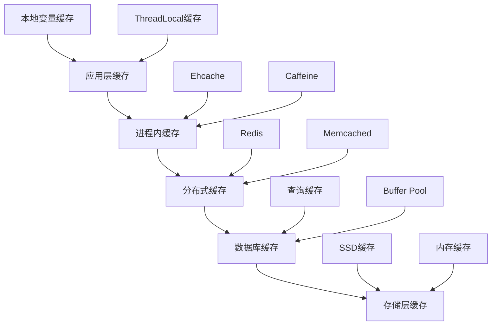

# 数据库缓存策略完整指南

## 🎯 概述

数据库缓存是提升系统性能的关键技术，通过合理的缓存策略可以显著减少数据库负载，提高响应速度。本指南涵盖从缓存基础理论到企业级缓存架构的完整实践方案。

## 📋 目录

1. [缓存基础理论](#1-缓存基础理论)
2. [多级缓存架构](#2-多级缓存架构)
3. [Redis缓存实现](#3-redis缓存实现)
4. [缓存策略模式](#4-缓存策略模式)
5. [一致性保障机制](#5-一致性保障机制)
6. [性能监控调优](#6-性能监控调优)

---

## 1. 缓存基础理论

### 1.1 缓存核心概念

#### 缓存层次结构


#### 缓存命中率优化
```python
# 缓存命中率计算和优化
class CacheHitRateOptimizer:
    def __init__(self):
        self.hit_count = 0
        self.miss_count = 0
        self.access_pattern = {}
    
    def calculate_hit_rate(self):
        """计算缓存命中率"""
        total_requests = self.hit_count + self.miss_count
        if total_requests == 0:
            return 0
        return (self.hit_count / total_requests) * 100
    
    def analyze_access_patterns(self, keys):
        """分析访问模式"""
        from collections import Counter
        pattern_counter = Counter(keys)
        
        # 识别热点数据
        hot_keys = [key for key, count in pattern_counter.most_common(10)]
        
        # 计算访问分布
        access_distribution = {
            'hot_data_ratio': len(hot_keys) / len(set(keys)),
            'skewness': self.calculate_skewness(pattern_counter.values())
        }
        
        return {
            'hot_keys': hot_keys,
            'distribution': access_distribution,
            'recommendations': self.generate_optimization_recommendations(access_distribution)
        }
    
    def generate_cache_strategy(self, analysis_result):
        """生成缓存策略建议"""
        strategy = {}
        
        if analysis_result['distribution']['skewness'] > 0.8:
            strategy['approach'] = 'LRU with TTL'
            strategy['eviction_policy'] = 'allkeys-lru'
            strategy['ttl_seconds'] = 3600
        else:
            strategy['approach'] = 'LFU'
            strategy['eviction_policy'] = 'allkeys-lfu'
            strategy['ttl_seconds'] = 7200
        
        return strategy
```

### 1.2 缓存失效策略

#### 失效模式对比
```yaml
cache_invalidation_strategies:
  write_through:
    description: "写透模式 - 数据同时写入缓存和数据库"
    advantages: ["数据一致性好", "缓存始终最新"]
    disadvantages: ["写入性能较差", "系统复杂度高"]
    use_cases: ["金融交易系统", "订单处理系统"]
  
  write_back:
    description: "回写模式 - 数据先写入缓存，异步写入数据库"
    advantages: ["写入性能好", "系统响应快"]
    disadvantages: ["数据一致性风险", "系统故障时可能丢数据"]
    use_cases: ["社交应用", "内容管理系统"]
  
  write_around:
    description: "绕写模式 - 数据直接写入数据库，不经过缓存"
    advantages: ["避免脏数据", "简化一致性管理"]
    disadvantages: ["后续读取需要重新加载缓存", "缓存命中率可能下降"]
    use_cases: ["报表系统", "分析系统"]
```

## 2. 多级缓存架构

### 2.1 架构设计原则

#### 多级缓存分层
```python
# 多级缓存架构实现
class MultiLevelCache:
    def __init__(self):
        self.l1_cache = {}  # 一级缓存 - 本地内存
        self.l2_cache = None  # 二级缓存 - 分布式缓存(Redis)
        self.l3_cache = None  # 三级缓存 - 数据库查询缓存
    
    def initialize_caches(self, redis_config, db_config):
        """初始化各级缓存"""
        # 初始化Redis缓存
        import redis
        self.l2_cache = redis.Redis(
            host=redis_config['host'],
            port=redis_config['port'],
            db=redis_config['db']
        )
        
        # 初始化数据库连接
        import mysql.connector
        self.db_connection = mysql.connector.connect(**db_config)
    
    def get_data(self, key):
        """多级缓存数据获取"""
        # L1缓存查找
        if key in self.l1_cache:
            self.increment_hit_count('l1')
            return self.l1_cache[key]
        
        # L2缓存查找
        if self.l2_cache:
            cached_data = self.l2_cache.get(key)
            if cached_data:
                # 加载到L1缓存
                self.l1_cache[key] = cached_data
                self.increment_hit_count('l2')
                return cached_data
        
        # L3缓存查找(数据库)
        db_result = self.query_database(key)
        if db_result:
            # 写入各级缓存
            self.l1_cache[key] = db_result
            if self.l2_cache:
                self.l2_cache.setex(key, 3600, db_result)  # 1小时过期
            self.increment_hit_count('l3')
            return db_result
        
        return None
    
    def increment_hit_count(self, level):
        """统计各级缓存命中次数"""
        # 实现命中统计逻辑
        pass
```

### 2.2 缓存穿透防护

#### 布隆过滤器实现
```python
# 布隆过滤器防止缓存穿透
import mmh3
from bitarray import bitarray

class BloomFilter:
    def __init__(self, capacity, error_rate=0.01):
        self.capacity = capacity
        self.error_rate = error_rate
        self.bit_array_size = self._calculate_bit_array_size()
        self.hash_count = self._calculate_hash_count()
        self.bit_array = bitarray(self.bit_array_size)
        self.bit_array.setall(0)
    
    def _calculate_bit_array_size(self):
        """计算位数组大小"""
        import math
        return int(-self.capacity * math.log(self.error_rate) / (math.log(2) ** 2))
    
    def _calculate_hash_count(self):
        """计算哈希函数数量"""
        import math
        return int(self.bit_array_size / self.capacity * math.log(2))
    
    def add(self, item):
        """添加元素到布隆过滤器"""
        for i in range(self.hash_count):
            index = mmh3.hash(item, i) % self.bit_array_size
            self.bit_array[index] = 1
    
    def contains(self, item):
        """检查元素是否存在"""
        for i in range(self.hash_count):
            index = mmh3.hash(item, i) % self.bit_array_size
            if self.bit_array[index] == 0:
                return False
        return True

# 缓存穿透防护应用
class CachePenetrationProtection:
    def __init__(self, bloom_filter_capacity=1000000):
        self.bloom_filter = BloomFilter(bloom_filter_capacity)
        self.null_cache = set()  # 空值缓存
    
    def get_with_protection(self, cache_client, key, db_query_func):
        """带防护的缓存获取"""
        # 1. 布隆过滤器检查
        if not self.bloom_filter.contains(key):
            return None  # 数据肯定不存在
        
        # 2. 检查空值缓存
        if key in self.null_cache:
            return None
        
        # 3. 正常缓存查询
        cached_value = cache_client.get(key)
        if cached_value is not None:
            return cached_value
        
        # 4. 查询数据库
        db_value = db_query_func(key)
        if db_value is not None:
            # 缓存正常数据
            cache_client.setex(key, 3600, db_value)
            self.bloom_filter.add(key)
        else:
            # 缓存空值，防止穿透
            cache_client.setex(f"null:{key}", 300, "NULL")  # 5分钟过期
            self.null_cache.add(key)
        
        return db_value
```

## 3. Redis缓存实现

### 3.1 Redis配置优化

#### 高性能配置
```conf
# redis.conf 高性能配置
# 内存优化
maxmemory 8gb
maxmemory-policy allkeys-lru
lazyfree-lazy-eviction yes
lazyfree-lazy-expire yes

# 持久化优化
save 900 1
save 300 10
save 60 10000
appendonly yes
appendfsync everysec

# 网络优化
tcp-keepalive 300
timeout 0
tcp-backlog 511

# 性能优化
hz 10
activerehashing yes
protected-mode yes

# 集群配置
cluster-enabled yes
cluster-config-file nodes.conf
cluster-node-timeout 15000
```

#### Redis客户端配置
```python
# Redis客户端优化配置
import redis

class OptimizedRedisClient:
    def __init__(self, host='localhost', port=6379, db=0):
        self.client = redis.Redis(
            host=host,
            port=port,
            db=db,
            decode_responses=True,
            socket_connect_timeout=5,
            socket_timeout=5,
            retry_on_timeout=True,
            health_check_interval=30,
            max_connections=100
        )
    
    def batch_get(self, keys):
        """批量获取优化"""
        pipeline = self.client.pipeline()
        for key in keys:
            pipeline.get(key)
        return pipeline.execute()
    
    def cache_with_ttl(self, key, value, ttl_seconds=3600):
        """带TTL的缓存设置"""
        return self.client.setex(key, ttl_seconds, value)
    
    def cache_with_condition(self, key, value, condition_func):
        """条件缓存"""
        if condition_func(value):
            return self.client.set(key, value)
        return False
```

### 3.2 缓存数据结构选择

#### 不同场景的数据结构
```python
# Redis数据结构应用场景
class RedisDataStructures:
    def __init__(self, redis_client):
        self.redis = redis_client
    
    def string_cache(self, key, value, expire_seconds=3600):
        """字符串缓存 - 适用于简单键值对"""
        return self.redis.setex(key, expire_seconds, str(value))
    
    def hash_cache(self, key, field_values, expire_seconds=3600):
        """哈希缓存 - 适用于对象缓存"""
        pipe = self.redis.pipeline()
        pipe.hset(key, mapping=field_values)
        pipe.expire(key, expire_seconds)
        return pipe.execute()
    
    def list_cache(self, key, values, max_length=1000):
        """列表缓存 - 适用于排行榜、消息队列"""
        pipe = self.redis.pipeline()
        pipe.delete(key)  # 清空原有数据
        pipe.lpush(key, *values[:max_length])
        pipe.ltrim(key, 0, max_length - 1)  # 保持最大长度
        return pipe.execute()
    
    def set_cache(self, key, values, expire_seconds=3600):
        """集合缓存 - 适用于去重、标签"""
        pipe = self.redis.pipeline()
        pipe.sadd(key, *values)
        pipe.expire(key, expire_seconds)
        return pipe.execute()
    
    def sorted_set_cache(self, key, score_member_pairs, expire_seconds=3600):
        """有序集合 - 适用于排行榜、范围查询"""
        pipe = self.redis.pipeline()
        pipe.zadd(key, dict(score_member_pairs))
        pipe.expire(key, expire_seconds)
        return pipe.execute()
```

## 4. 缓存策略模式

### 4.1 经典缓存模式

#### Cache-Aside Pattern
```python
# Cache-Aside模式实现
class CacheAsidePattern:
    def __init__(self, cache_client, db_client):
        self.cache = cache_client
        self.database = db_client
    
    def get_data(self, key):
        """读取数据 - Cache-Aside模式"""
        # 1. 先查缓存
        cached_data = self.cache.get(key)
        if cached_data is not None:
            return cached_data
        
        # 2. 缓存未命中，查数据库
        db_data = self.database.query(key)
        if db_data is not None:
            # 3. 将数据写入缓存
            self.cache.setex(key, 3600, db_data)
        
        return db_data
    
    def update_data(self, key, new_value):
        """更新数据 - Cache-Aside模式"""
        # 1. 更新数据库
        success = self.database.update(key, new_value)
        if success:
            # 2. 删除缓存（让下次读取重新加载）
            self.cache.delete(key)
        return success
    
    def delete_data(self, key):
        """删除数据"""
        # 1. 删除数据库记录
        success = self.database.delete(key)
        if success:
            # 2. 删除缓存
            self.cache.delete(key)
        return success
```

#### Read-Through Pattern
```python
# Read-Through模式实现
class ReadThroughPattern:
    def __init__(self, cache_client, data_loader):
        self.cache = cache_client
        self.loader = data_loader  # 数据加载器
    
    def get_data(self, key):
        """读取数据 - Read-Through模式"""
        # 缓存层自动处理加载逻辑
        cached_data = self.cache.get(key)
        if cached_data is None:
            # 缓存未命中时自动加载
            cached_data = self.loader.load(key)
            if cached_data is not None:
                self.cache.setex(key, 3600, cached_data)
        return cached_data

# 数据加载器实现
class DataLoader:
    def __init__(self, db_client):
        self.database = db_client
    
    def load(self, key):
        """从数据源加载数据"""
        return self.database.query(key)
```

### 4.2 高级缓存策略

#### 多租户缓存隔离
```python
# 多租户缓存隔离策略
class MultiTenantCache:
    def __init__(self, redis_client, tenant_resolver):
        self.redis = redis_client
        self.tenant_resolver = tenant_resolver  # 租户解析器
    
    def get_tenant_key(self, original_key):
        """生成租户隔离的缓存键"""
        tenant_id = self.tenant_resolver.get_current_tenant()
        return f"tenant:{tenant_id}:{original_key}"
    
    def get(self, key):
        """获取租户数据"""
        tenant_key = self.get_tenant_key(key)
        return self.redis.get(tenant_key)
    
    def set(self, key, value, expire_seconds=3600):
        """设置租户数据"""
        tenant_key = self.get_tenant_key(key)
        return self.redis.setex(tenant_key, expire_seconds, value)
    
    def invalidate_tenant_cache(self, tenant_id):
        """清空特定租户的缓存"""
        pattern = f"tenant:{tenant_id}:*"
        keys = self.redis.keys(pattern)
        if keys:
            self.redis.delete(*keys)
```

#### 缓存预热策略
```python
# 缓存预热实现
class CacheWarmup:
    def __init__(self, cache_client, data_source):
        self.cache = cache_client
        self.source = data_source
    
    def warmup_by_pattern(self, patterns):
        """按模式预热缓存"""
        for pattern in patterns:
            data_items = self.source.get_data_by_pattern(pattern)
            for item in data_items:
                self.cache.setex(
                    item['key'], 
                    item['ttl'], 
                    item['value']
                )
    
    def scheduled_warmup(self, cron_expression, warmup_function):
        """定时预热"""
        import schedule
        import time
        
        schedule.every().day.at(cron_expression).do(warmup_function)
        
        while True:
            schedule.run_pending()
            time.sleep(60)
    
    def smart_warmup(self, access_logs, threshold=100):
        """智能预热 - 基于访问日志"""
        # 分析热门数据
        popular_keys = self.analyze_popular_keys(access_logs, threshold)
        
        # 预热热门数据
        for key in popular_keys:
            if not self.cache.exists(key):
                data = self.source.get_data(key)
                if data:
                    self.cache.setex(key, 3600, data)
    
    def analyze_popular_keys(self, logs, threshold):
        """分析热门键"""
        from collections import Counter
        key_counts = Counter(log['key'] for log in logs)
        return [key for key, count in key_counts.items() if count > threshold]
```

## 5. 一致性保障机制

### 5.1 缓存一致性策略

#### 最终一致性实现
```python
# 最终一致性保障
class EventualConsistencyManager:
    def __init__(self, cache_client, message_queue):
        self.cache = cache_client
        self.message_queue = message_queue
        self.consistency_window = 300  # 5分钟一致性窗口
    
    def update_with_consistency(self, key, new_value):
        """更新数据并保障一致性"""
        # 1. 发布更新事件
        update_event = {
            'type': 'cache_update',
            'key': key,
            'value': new_value,
            'timestamp': time.time()
        }
        self.message_queue.publish('cache_updates', update_event)
        
        # 2. 设置短暂过期时间
        self.cache.setex(key, self.consistency_window, new_value)
        
        # 3. 异步更新数据库
        self.async_update_database(key, new_value)
    
    def handle_cache_invalidation(self, event):
        """处理缓存失效事件"""
        if event['type'] == 'data_updated':
            # 延迟删除缓存，给其他节点同步时间
            time.sleep(2)
            self.cache.delete(event['key'])
    
    def sync_cache_clusters(self):
        """同步缓存集群状态"""
        cluster_nodes = self.get_cluster_nodes()
        for node in cluster_nodes:
            # 同步缓存状态
            self.sync_node_cache(node)
```

### 5.2 分布式锁实现

#### Redis分布式锁
```python
# Redis分布式锁实现
import uuid
import time

class RedisDistributedLock:
    def __init__(self, redis_client, lock_timeout=30):
        self.redis = redis_client
        self.lock_timeout = lock_timeout
        self.local_lock_id = str(uuid.uuid4())
    
    def acquire_lock(self, lock_key, acquire_timeout=10):
        """获取分布式锁"""
        end_time = time.time() + acquire_timeout
        
        while time.time() < end_time:
            # 尝试设置锁
            if self.redis.setnx(lock_key, self.local_lock_id):
                # 设置过期时间防止死锁
                self.redis.expire(lock_key, self.lock_timeout)
                return True
            
            # 检查锁是否已过期
            lock_value = self.redis.get(lock_key)
            if lock_value and self.is_expired_lock(lock_key):
                # 尝试原子性地抢夺过期锁
                old_value = self.redis.getset(lock_key, self.local_lock_id)
                if old_value == lock_value:
                    self.redis.expire(lock_key, self.lock_timeout)
                    return True
            
            time.sleep(0.001)  # 短暂休眠
        
        return False
    
    def release_lock(self, lock_key):
        """释放分布式锁"""
        # Lua脚本原子性释放锁
        lua_script = """
        if redis.call("get", KEYS[1]) == ARGV[1] then
            return redis.call("del", KEYS[1])
        else
            return 0
        end
        """
        return self.redis.eval(lua_script, 1, lock_key, self.local_lock_id)
    
    def is_expired_lock(self, lock_key):
        """检查锁是否过期"""
        ttl = self.redis.ttl(lock_key)
        return ttl <= 0

# 缓存一致性应用
class ConsistentCacheUpdater:
    def __init__(self, cache_client, db_client):
        self.cache = cache_client
        self.database = db_client
        self.lock_manager = RedisDistributedLock(cache_client)
    
    def update_consistently(self, key, update_function):
        """一致性更新"""
        lock_key = f"lock:{key}"
        
        if self.lock_manager.acquire_lock(lock_key):
            try:
                # 1. 查询当前数据
                current_data = self.cache.get(key)
                
                # 2. 应用更新
                updated_data = update_function(current_data)
                
                # 3. 更新数据库
                self.database.update(key, updated_data)
                
                # 4. 更新缓存
                self.cache.set(key, updated_data)
                
                return updated_data
            finally:
                self.lock_manager.release_lock(lock_key)
        else:
            raise Exception("Failed to acquire lock for consistent update")
```

## 6. 性能监控调优

### 6.1 监控指标体系

#### 核心监控指标
```python
# 缓存监控指标收集
class CacheMonitor:
    def __init__(self, redis_client, metrics_collector):
        self.redis = redis_client
        self.collector = metrics_collector
    
    def collect_basic_metrics(self):
        """收集基础指标"""
        info = self.redis.info()
        
        metrics = {
            'memory_usage': info['used_memory'],
            'memory_peak': info['used_memory_peak'],
            'connected_clients': info['connected_clients'],
            'total_commands': info['total_commands_processed'],
            'keyspace_hits': info['keyspace_hits'],
            'keyspace_misses': info['keyspace_misses'],
            'expired_keys': info['expired_keys'],
            'evicted_keys': info['evicted_keys']
        }
        
        # 计算命中率
        total_access = metrics['keyspace_hits'] + metrics['keyspace_misses']
        if total_access > 0:
            metrics['hit_rate'] = metrics['keyspace_hits'] / total_access * 100
        else:
            metrics['hit_rate'] = 0
        
        return metrics
    
    def collect_advanced_metrics(self):
        """收集高级指标"""
        advanced_metrics = {}
        
        # 内存碎片率
        info = self.redis.info()
        advanced_metrics['memory_fragmentation_ratio'] = info['mem_fragmentation_ratio']
        
        # 慢查询统计
        slowlog = self.redis.slowlog_get(10)
        advanced_metrics['slow_queries_count'] = len(slowlog)
        
        # 连接统计
        client_list = self.redis.client_list()
        advanced_metrics['active_connections'] = len(client_list)
        
        return advanced_metrics
    
    def monitor_cache_performance(self):
        """持续监控缓存性能"""
        while True:
            basic_metrics = self.collect_basic_metrics()
            advanced_metrics = self.collect_advanced_metrics()
            
            # 上报指标
            self.collector.report_metrics({
                **basic_metrics,
                **advanced_metrics
            })
            
            # 性能告警检查
            self.check_performance_alerts(basic_metrics)
            
            time.sleep(60)  # 每分钟收集一次
```

### 6.2 性能调优建议

#### 自动化调优系统
```python
# 缓存性能自动调优
class AutoCacheTuner:
    def __init__(self, monitor, config_manager):
        self.monitor = monitor
        self.config_manager = config_manager
        self.performance_history = []
    
    def analyze_performance_trends(self, metrics_history):
        """分析性能趋势"""
        analysis = {
            'hit_rate_trend': self.calculate_trend(
                [m['hit_rate'] for m in metrics_history[-100:]]
            ),
            'memory_usage_trend': self.calculate_trend(
                [m['memory_usage'] for m in metrics_history[-100:]]
            ),
            'miss_rate_spike': self.detect_spikes(
                [m['keyspace_misses'] for m in metrics_history[-10:]]
            )
        }
        return analysis
    
    def generate_tuning_recommendations(self, analysis):
        """生成调优建议"""
        recommendations = []
        
        # 命中率优化建议
        if analysis['hit_rate_trend'] < -5:  # 命中率下降超过5%
            recommendations.append({
                'action': 'increase_cache_size',
                'priority': 'high',
                'reason': '缓存命中率持续下降'
            })
        
        # 内存使用优化建议
        if analysis['memory_usage_trend'] > 10:  # 内存使用快速增长
            recommendations.append({
                'action': 'review_eviction_policy',
                'priority': 'medium',
                'reason': '内存使用增长过快'
            })
        
        # 缓存穿透建议
        if analysis['miss_rate_spike']:
            recommendations.append({
                'action': 'implement_bloom_filter',
                'priority': 'high',
                'reason': '检测到缓存穿透现象'
            })
        
        return recommendations
    
    def apply_auto_tuning(self, recommendations):
        """自动应用调优建议"""
        for rec in recommendations:
            if rec['priority'] == 'high':
                self.implement_recommendation(rec)
    
    def implement_recommendation(self, recommendation):
        """实施具体建议"""
        if recommendation['action'] == 'increase_cache_size':
            current_size = self.config_manager.get('maxmemory')
            new_size = int(current_size * 1.2)  # 增加20%
            self.config_manager.set('maxmemory', new_size)
            
        elif recommendation['action'] == 'review_eviction_policy':
            # 分析数据访问模式，调整淘汰策略
            self.optimize_eviction_strategy()
            
        elif recommendation['action'] == 'implement_bloom_filter':
            # 部署布隆过滤器
            self.deploy_bloom_filter()

# 配置管理器
class ConfigManager:
    def __init__(self, redis_client):
        self.redis = redis_client
    
    def get(self, key):
        """获取配置"""
        return self.redis.config_get(key)[key]
    
    def set(self, key, value):
        """设置配置"""
        return self.redis.config_set(key, value)
    
    def save_config(self):
        """保存配置到磁盘"""
        return self.redis.config_rewrite()
```

---

## 🔍 关键要点总结

### ✅ 成功要素
- **分层缓存架构**：合理设计多级缓存，平衡性能和成本
- **智能失效策略**：选择合适的缓存失效和更新策略
- **一致性保障**：建立完善的缓存一致性机制
- **持续监控优化**：建立实时监控和自动调优体系

### ⚠️ 常见陷阱
- **缓存雪崩**：大量缓存同时失效导致系统冲击
- **缓存穿透**：恶意请求不存在的数据穿透缓存
- **缓存击穿**：热点数据过期瞬间大量请求打到数据库
- **数据不一致**：缓存和数据库数据出现不一致

### 🎯 最佳实践
1. **渐进式实施**：从简单的本地缓存开始，逐步扩展到分布式缓存
2. **监控先行**：建立完善的监控体系，及时发现问题
3. **测试验证**：充分测试缓存策略在各种场景下的表现
4. **文档化策略**：记录缓存设计决策和配置参数
5. **定期评估**：定期回顾缓存效果，持续优化策略

通过科学的缓存策略设计和实施，可以显著提升系统性能，为用户提供更好的体验。