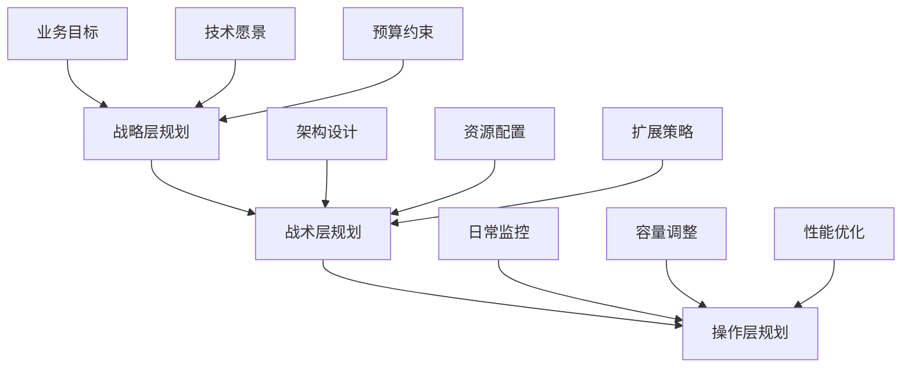

# 数据库容量规划完整指南

## 🎯 概述

数据库容量规划是确保系统稳定运行和业务持续发展的关键环节。本指南提供科学的容量规划方法论，帮助您准确预测资源需求，制定合理的扩展策略，实现成本效益最大化。

## 📋 目录

1. [容量规划基础理论](#1-容量规划基础理论)
2. [需求分析与预测](#2-需求分析与预测)
3. [资源评估与建模](#3-资源评估与建模)
4. [扩展策略设计](#4-扩展策略设计)
5. [监控预警体系](#5-监控预警体系)
6. [成本优化方案](#6-成本优化方案)
7. [自动化规划工具](#7-自动化规划工具)

---

## 1. 容量规划基础理论

### 1.1 容量规划核心概念

#### 容量的多维度定义
```yaml
capacity_dimensions:
  storage_capacity:
    definition: "数据存储空间需求"
    measurement: "GB/TB/PB"
    growth_factors: ["数据量增长", "备份保留", "日志存储"]
  
  compute_capacity:
    definition: "CPU和内存处理能力"
    measurement: "CPU核心数/内存GB"
    growth_factors: ["并发连接数", "查询复杂度", "批处理任务"]
  
  network_capacity:
    definition: "网络带宽和吞吐量"
    measurement: "Mbps/Gbps"
    growth_factors: ["用户访问量", "数据传输量", "复制同步"]
  
  iops_capacity:
    definition: "每秒输入输出操作数"
    measurement: "IOPS"
    growth_factors: ["随机读写比例", "事务处理量", "缓存命中率"]
```

### 1.2 规划周期与层次

#### 时间维度规划
```bash
# 容量规划时间框架
capacity_planning_timeline() {
    cat << 'EOF'
短期规划 (3-6个月):
- 当前资源利用率分析
- 性能瓶颈识别
- 紧急扩容需求

中期规划 (6-12个月):
- 业务增长趋势预测
- 架构优化方案
- 预算编制

长期规划 (1-3年):
- 技术路线图制定
- 平台演进策略
- 成本优化目标
EOF
}
```

#### 层次化规划模型


### 1.3 关键性能指标(KPI)

#### 核心容量指标
```sql
-- 容量相关关键指标查询
SELECT 
    -- 存储容量指标
    ROUND(SUM(data_length + index_length) / 1024 / 1024 / 1024, 2) AS data_size_gb,
    ROUND(SUM(data_free) / 1024 / 1024 / 1024, 2) AS free_space_gb,
    
    -- 连接和会话指标
    (SELECT VARIABLE_VALUE FROM information_schema.GLOBAL_STATUS WHERE VARIABLE_NAME = 'Threads_connected') AS current_connections,
    (SELECT VARIABLE_VALUE FROM information_schema.GLOBAL_VARIABLES WHERE VARIABLE_NAME = 'max_connections') AS max_connections,
    
    -- 查询性能指标
    (SELECT VARIABLE_VALUE FROM information_schema.GLOBAL_STATUS WHERE VARIABLE_NAME = 'Queries') AS total_queries,
    (SELECT VARIABLE_VALUE FROM information_schema.GLOBAL_STATUS WHERE VARIABLE_NAME = 'Slow_queries') AS slow_queries,
    
    -- 缓存效率指标
    ROUND((SELECT VARIABLE_VALUE FROM information_schema.GLOBAL_STATUS WHERE VARIABLE_NAME = 'Innodb_buffer_pool_reads') / 
          (SELECT VARIABLE_VALUE FROM information_schema.GLOBAL_STATUS WHERE VARIABLE_NAME = 'Innodb_buffer_pool_read_requests') * 100, 2) AS buffer_pool_hit_ratio
    
FROM information_schema.tables 
WHERE table_schema = 'your_database';
```

## 2. 需求分析与预测

### 2.1 业务驱动因素分析

#### 业务增长模型
```python
# 业务增长预测模型
import numpy as np
from sklearn.linear_model import LinearRegression
import pandas as pd

class BusinessGrowthPredictor:
    def __init__(self):
        self.models = {}
    
    def analyze_user_growth(self, historical_data):
        """用户增长分析"""
        df = pd.DataFrame(historical_data)
        X = df[['days']].values
        y = df['active_users'].values
        
        # 线性回归模型
        model = LinearRegression()
        model.fit(X, y)
        
        # 预测未来增长
        future_days = np.array([[30], [60], [90], [180], [365]])
        predictions = model.predict(future_days)
        
        return {
            'growth_rate': model.coef_[0],
            'predictions': dict(zip([30, 60, 90, 180, 365], predictions)),
            'r_squared': model.score(X, y)
        }
    
    def calculate_data_growth(self, business_metrics):
        """数据增长预测"""
        # 基于业务指标计算数据增长
        calculations = {
            'user_generated_data': business_metrics['active_users'] * 
                                 business_metrics['avg_data_per_user'] *
                                 business_metrics['growth_multiplier'],
            
            'transaction_data': business_metrics['daily_transactions'] *
                              business_metrics['avg_transaction_size'] *
                              business_metrics['retention_days'],
            
            'log_data': business_metrics['daily_requests'] *
                       business_metrics['avg_log_size'] *
                       business_metrics['log_retention_days']
        }
        
        return calculations
```

### 2.2 负载模式分析

#### 访问模式分类
```bash
# 负载模式分析脚本
analyze_load_patterns() {
    echo "=== 负载模式分析 ==="
    
    # 分析查询类型分布
    mysql -e "
        SELECT 
            LEFT(digest_text, 50) as query_pattern,
            count_star as execution_count,
            avg_timer_wait/1000000000 as avg_latency_ms,
            round(sum_rows_examined/count_star, 2) as avg_rows_examined
        FROM performance_schema.events_statements_summary_by_digest 
        WHERE digest_text IS NOT NULL 
        ORDER BY count_star DESC 
        LIMIT 10;
    "
    
    # 分析时间分布
    mysql -e "
        SELECT 
            HOUR(TIMER_START) as hour_of_day,
            COUNT(*) as query_count,
            AVG(AVG_TIMER_WAIT)/1000000000 as avg_latency_ms
        FROM performance_schema.events_statements_history_long
        WHERE TIMER_START IS NOT NULL
        GROUP BY HOUR(TIMER_START)
        ORDER BY query_count DESC;
    "
}
```

#### 季节性因素考量
```python
# 季节性分析模型
class SeasonalAnalyzer:
    def __init__(self):
        self.seasonal_patterns = {
            'business_hours': {'multiplier': 3.5, 'duration': '9:00-18:00'},
            'peak_season': {'multiplier': 2.0, 'months': ['11', '12']},
            'promotion_events': {'multiplier': 5.0, 'frequency': 'monthly'},
            'weekend_pattern': {'multiplier': 0.7, 'days': ['Sat', 'Sun']}
        }
    
    def apply_seasonal_adjustment(self, baseline_capacity, time_period):
        """应用季节性调整因子"""
        adjustment_factor = 1.0
        
        # 根据时间段应用不同因子
        current_hour = datetime.now().hour
        current_month = datetime.now().month
        current_weekday = datetime.now().strftime('%a')
        
        if 9 <= current_hour <= 18:
            adjustment_factor *= self.seasonal_patterns['business_hours']['multiplier']
        
        if str(current_month) in self.seasonal_patterns['peak_season']['months']:
            adjustment_factor *= self.seasonal_patterns['peak_season']['multiplier']
        
        if current_weekday in ['Sat', 'Sun']:
            adjustment_factor *= self.seasonal_patterns['weekend_pattern']['multiplier']
        
        return baseline_capacity * adjustment_factor
```

### 2.3 预测模型选择

#### 时间序列预测
```python
# ARIMA预测模型
from statsmodels.tsa.arima.model import ARIMA
import matplotlib.pyplot as plt

class CapacityForecaster:
    def __init__(self):
        self.model = None
    
    def forecast_storage_growth(self, historical_usage_data, periods=12):
        """存储容量增长预测"""
        # 数据预处理
        ts_data = pd.Series(historical_usage_data)
        ts_data.index = pd.date_range(start='2023-01-01', periods=len(ts_data), freq='M')
        
        # ARIMA模型训练
        self.model = ARIMA(ts_data, order=(1, 1, 1))
        fitted_model = self.model.fit()
        
        # 预测未来periods个月
        forecast = fitted_model.forecast(steps=periods)
        
        # 计算置信区间
        forecast_ci = fitted_model.get_forecast(steps=periods)
        confidence_intervals = forecast_ci.conf_int()
        
        return {
            'forecast': forecast.tolist(),
            'lower_bound': confidence_intervals.iloc[:, 0].tolist(),
            'upper_bound': confidence_intervals.iloc[:, 1].tolist(),
            'confidence_level': 0.95
        }
    
    def monte_carlo_simulation(self, base_parameters, simulations=10000):
        """蒙特卡洛模拟预测"""
        results = []
        
        for _ in range(simulations):
            # 随机生成参数
            params = {
                'user_growth_rate': np.random.normal(base_parameters['growth_mean'], base_parameters['growth_std']),
                'data_per_user': np.random.lognormal(base_parameters['data_mean'], base_parameters['data_std']),
                'seasonal_factor': np.random.uniform(0.8, 1.5)
            }
            
            # 计算容量需求
            capacity_needed = (
                base_parameters['current_users'] * 
                (1 + params['user_growth_rate']) * 
                params['data_per_user'] * 
                params['seasonal_factor']
            )
            
            results.append(capacity_needed)
        
        return {
            'mean': np.mean(results),
            'median': np.median(results),
            'percentile_95': np.percentile(results, 95),
            'percentile_5': np.percentile(results, 5),
            'std_deviation': np.std(results)
        }
```

## 3. 资源评估与建模

### 3.1 硬件资源配置

#### CPU需求计算
```bash
# CPU需求评估脚本
calculate_cpu_requirements() {
    echo "=== CPU需求计算 ==="
    
    # 获取当前CPU使用情况
    current_cpu_usage=$(top -bn1 | grep "Cpu(s)" | awk '{print $2}' | cut -d'%' -f1)
    
    # 分析MySQL CPU消耗
    mysql -e "
        SELECT 
            EVENT_NAME,
            SUM_TIMER_WAIT/1000000000000 as total_time_sec,
            COUNT_STAR as event_count,
            ROUND(AVG_TIMER_WAIT/1000000000, 2) as avg_time_ms
        FROM performance_schema.events_statements_summary_global_by_event_name
        WHERE SUM_TIMER_WAIT > 0
        ORDER BY SUM_TIMER_WAIT DESC
        LIMIT 10;
    "
    
    # 计算CPU需求
    echo "基于查询分析的CPU需求:"
    echo "- 当前峰值CPU使用率: ${current_cpu_usage}%"
    echo "- 预计增长后需求: $(echo "${current_cpu_usage} * 1.5" | bc)%"
    echo "- 建议CPU核心数: $(echo "scale=0; (${current_cpu_usage} * 1.5 * 8 / 100)/1" | bc)"
}
```

#### 内存容量规划
```sql
-- 内存使用分析
SELECT 
    -- Buffer Pool使用情况
    ROUND(buffer_pool_size/1024/1024/1024, 2) as buffer_pool_gb,
    ROUND((buffer_pool_pages_data + buffer_pool_pages_misc + buffer_pool_pages_free) * 16384 / 1024 / 1024 / 1024, 2) as actual_usage_gb,
    
    -- 查询缓存使用
    ROUND(qcache_hits/(qcache_hits + qcache_inserts) * 100, 2) as query_cache_hit_rate,
    
    -- 连接内存使用
    (SELECT VARIABLE_VALUE FROM information_schema.GLOBAL_STATUS WHERE VARIABLE_NAME = 'Threads_connected') * 
    (SELECT VARIABLE_VALUE FROM information_schema.GLOBAL_VARIABLES WHERE VARIABLE_NAME = 'sort_buffer_size') / 1024 / 1024 as sort_buffer_mb,
    
    -- 临时表内存使用
    (SELECT VARIABLE_VALUE FROM information_schema.GLOBAL_STATUS WHERE VARIABLE_NAME = 'Created_tmp_tables') * 
    (SELECT VARIABLE_VALUE FROM information_schema.GLOBAL_VARIABLES WHERE VARIABLE_NAME = 'tmp_table_size') / 1024 / 1024 / 1024 as tmp_tables_gb

FROM (
    SELECT 
        @@innodb_buffer_pool_size as buffer_pool_size,
        @@query_cache_size as query_cache_size,
        @@sort_buffer_size as sort_buffer_size,
        @@tmp_table_size as tmp_table_size,
        (SELECT COUNT(*) FROM information_schema.INNODB_BUFFER_PAGE) as buffer_pool_pages_total,
        (SELECT COUNT(*) FROM information_schema.INNODB_BUFFER_PAGE WHERE PAGE_TYPE = 'INDEX') as buffer_pool_pages_data,
        (SELECT COUNT(*) FROM information_schema.INNODB_BUFFER_PAGE WHERE PAGE_TYPE = 'IBUF_INDEX') as buffer_pool_pages_misc,
        (SELECT COUNT(*) FROM information_schema.INNODB_BUFFER_PAGE WHERE PAGE_TYPE IS NULL) as buffer_pool_pages_free
) as memory_stats;
```

### 3.2 存储容量计算

#### 数据增长预测模型
```python
# 存储容量预测
class StorageCapacityPlanner:
    def __init__(self):
        self.growth_models = {}
    
    def calculate_storage_needs(self, current_data, growth_params):
        """计算存储需求"""
        base_storage = current_data['data_size'] + current_data['indexes']
        log_storage = current_data['binlog_size'] + current_data['relay_log_size']
        backup_storage = base_storage * current_data['backup_copies']
        
        # 基于增长率预测
        monthly_growth = growth_params['monthly_growth_rate']
        retention_months = growth_params['retention_period']
        
        future_storage = base_storage * pow(1 + monthly_growth, retention_months)
        
        return {
            'current_total': base_storage + log_storage + backup_storage,
            'future_total': future_storage + log_storage + backup_storage,
            'growth_amount': future_storage - base_storage,
            'recommended_capacity': future_storage * 1.3  # 30%冗余
        }
    
    def storage_tier_analysis(self, data_characteristics):
        """存储层级分析"""
        tier_recommendations = []
        
        # 热数据 - SSD存储
        hot_data = data_characteristics['frequently_accessed']
        tier_recommendations.append({
            'tier': 'hot',
            'storage_type': 'SSD',
            'capacity': hot_data * 1.2,
            'iops_requirement': 'high',
            'cost_per_gb': 'high'
        })
        
        # 温数据 - SAS存储
        warm_data = data_characteristics['occasionally_accessed']
        tier_recommendations.append({
            'tier': 'warm',
            'storage_type': 'SAS',
            'capacity': warm_data * 1.1,
            'iops_requirement': 'medium',
            'cost_per_gb': 'medium'
        })
        
        # 冷数据 - SATA存储
        cold_data = data_characteristics['rarely_accessed']
        tier_recommendations.append({
            'tier': 'cold',
            'storage_type': 'SATA',
            'capacity': cold_data * 1.05,
            'iops_requirement': 'low',
            'cost_per_gb': 'low'
        })
        
        return tier_recommendations
```

### 3.3 网络带宽评估

#### 带宽需求计算
```bash
# 网络带宽需求分析
calculate_network_bandwidth() {
    echo "=== 网络带宽需求分析 ==="
    
    # 分析当前网络使用情况
    current_bandwidth=$(ss -i | grep -E "(bytes_sent|bytes_received)" | awk '{sum+=$2} END {print sum}')
    
    # MySQL网络流量分析
    mysql -e "
        SHOW GLOBAL STATUS LIKE 'Bytes_%';
    "
    
    # 计算复制带宽需求
    echo "复制带宽需求计算:"
    replication_traffic=$(mysql -e "SHOW MASTER STATUS\G" | grep "Position" | awk '{print $2}')
    echo "当前binlog位置: $replication_traffic"
    
    # 预测带宽需求
    peak_hourly_data=$(echo "$replication_traffic * 1.5" | bc)
    required_bandwidth_mbps=$(echo "scale=2; $peak_hourly_data / 3600 / 1024 / 1024 * 8" | bc)
    
    echo "建议最小带宽: ${required_bandwidth_mbps} Mbps"
    echo "建议预留带宽: $(echo "$required_bandwidth_mbps * 2" | bc) Mbps"
}
```

## 4. 扩展策略设计

### 4.1 垂直扩展策略

#### 硬件升级路径
```yaml
vertical_scaling_paths:
  cpu_upgrade:
    current: "8 cores"
    next_level: "16 cores"
    final_target: "32 cores"
    cost_impact: "中等"
    downtime_required: "需要停机"
  
  memory_upgrade:
    current: "32 GB"
    next_level: "64 GB"
    final_target: "128 GB"
    cost_impact: "较低"
    downtime_required: "热插拔支持"
  
  storage_upgrade:
    current: "1 TB SSD"
    next_level: "2 TB NVMe"
    final_target: "4 TB NVMe"
    cost_impact: "较高"
    downtime_required: "需要数据迁移"
```

#### 垂直扩展实施
```bash
# 垂直扩展检查清单
vertical_scaling_checklist() {
    cat << 'EOF'
硬件兼容性检查:
□ CPU插槽兼容性确认
□ 内存类型和频率匹配
□ 存储控制器支持
□ 电源供应充足

系统准备:
□ 备份当前配置
□ 计划停机窗口
□ 准备回滚方案
□ 通知相关人员

实施步骤:
1. 系统停机维护
2. 硬件更换安装
3. 系统启动验证
4. 性能基准测试
5. 业务功能验证
EOF
}
```

### 4.2 水平扩展策略

#### 读写分离架构
```sql
-- 读写分离配置示例
-- Master配置
[mysqld]
server-id = 1
log-bin = mysql-bin
binlog-format = ROW

-- Slave配置
[mysqld]
server-id = 2
relay-log = relay-bin
read-only = 1

-- 应用层路由配置
application_routing = {
    'write_operations': 'master_host:3306',
    'read_operations': [
        'slave1_host:3306',
        'slave2_host:3306',
        'slave3_host:3306'
    ],
    'load_balancing': 'round_robin'
}
```

#### 分片策略设计
```python
# 数据分片策略
class ShardingStrategy:
    def __init__(self, shard_count=4):
        self.shard_count = shard_count
        self.shard_map = {}
    
    def range_based_sharding(self, table_name, shard_key_column):
        """基于范围的分片"""
        return f"""
        CREATE TABLE {table_name}_shard_{{shard_id}} (
            {shard_key_column} INT NOT NULL,
            -- 其他字段...
            PRIMARY KEY ({shard_key_column})
        ) ENGINE=InnoDB;
        
        -- 分片规则
        Shard 0: {shard_key_column} BETWEEN 1 AND 1000000
        Shard 1: {shard_key_column} BETWEEN 1000001 AND 2000000
        Shard 2: {shard_key_column} BETWEEN 2000001 AND 3000000
        Shard 3: {shard_key_column} BETWEEN 3000001 AND 4000000
        """
    
    def hash_based_sharding(self, table_name, shard_key_column):
        """基于哈希的分片"""
        return f"""
        -- 使用哈希函数确定分片
        shard_id = HASH({shard_key_column}) % {self.shard_count}
        
        -- 在应用层实现路由
        def get_shard_connection(shard_key):
            shard_id = hash(shard_key) % {self.shard_count}
            return connections[f"shard_{shard_id}"]
        """

# 分片管理工具
class ShardManager:
    def __init__(self):
        self.shards = {}
        self.routing_table = {}
    
    def add_shard(self, shard_id, connection_info):
        """添加分片"""
        self.shards[shard_id] = connection_info
        self.update_routing_table()
    
    def rebalance_shards(self):
        """重新平衡分片"""
        # 实现数据重新分布逻辑
        pass
```

### 4.3 混合扩展方案

#### 云原生弹性扩展
```yaml
# Kubernetes自动扩缩容配置
apiVersion: autoscaling/v2
kind: HorizontalPodAutoscaler
metadata:
  name: mysql-autoscaler
spec:
  scaleTargetRef:
    apiVersion: apps/v1
    kind: StatefulSet
    name: mysql-cluster
  minReplicas: 3
  maxReplicas: 10
  metrics:
  - type: Resource
    resource:
      name: cpu
      target:
        type: Utilization
        averageUtilization: 70
  - type: Resource
    resource:
      name: memory
      target:
        type: Utilization
        averageUtilization: 80
  behavior:
    scaleDown:
      stabilizationWindowSeconds: 300
      policies:
      - type: Percent
        value: 10
        periodSeconds: 60
    scaleUp:
      stabilizationWindowSeconds: 60
      policies:
      - type: Percent
        value: 50
        periodSeconds: 60
```

## 5. 监控预警体系

### 5.1 容量监控指标

#### 核心监控面板
```python
# 容量监控仪表板
class CapacityMonitor:
    def __init__(self):
        self.thresholds = {
            'storage_utilization': 0.8,
            'cpu_utilization': 0.75,
            'memory_utilization': 0.85,
            'connection_utilization': 0.8,
            'iops_utilization': 0.7
        }
    
    def collect_capacity_metrics(self):
        """收集容量指标"""
        metrics = {
            'storage': self.get_storage_metrics(),
            'compute': self.get_compute_metrics(),
            'network': self.get_network_metrics(),
            'connections': self.get_connection_metrics()
        }
        return metrics
    
    def check_thresholds(self, current_metrics):
        """检查阈值告警"""
        alerts = []
        
        for resource_type, threshold in self.thresholds.items():
            current_value = current_metrics.get(resource_type, 0)
            if current_value > threshold:
                alerts.append({
                    'resource': resource_type,
                    'current_value': current_value,
                    'threshold': threshold,
                    'severity': self.calculate_severity(current_value, threshold)
                })
        
        return alerts
    
    def predict_capacity_exhaustion(self, metrics_history):
        """预测容量耗尽时间"""
        predictions = {}
        
        for resource in ['storage', 'memory', 'connections']:
            trend = self.calculate_growth_trend(metrics_history[resource])
            days_until_full = self.calculate_days_until_threshold(
                current_value=metrics_history[resource][-1],
                growth_rate=trend,
                threshold=self.thresholds[resource.replace('ions', '') + '_utilization']
            )
            predictions[resource] = days_until_full
        
        return predictions
```

### 5.2 智能预警机制

#### 多级预警系统
```python
# 智能预警系统
class IntelligentAlerting:
    def __init__(self):
        self.alert_levels = {
            'warning': 0.7,    # 70% 使用率
            'critical': 0.85,  # 85% 使用率
            'emergency': 0.95  # 95% 使用率
        }
    
    def generate_predictive_alerts(self, capacity_data):
        """生成预测性告警"""
        alerts = []
        
        # 基于历史趋势的预测
        for resource, data in capacity_data.items():
            growth_rate = self.calculate_growth_rate(data['historical'])
            predicted_utilization = self.predict_future_utilization(
                current=data['current'],
                growth_rate=growth_rate,
                timeframe=30  # 30天预测
            )
            
            # 检查各级别阈值
            for level, threshold in self.alert_levels.items():
                if predicted_utilization > threshold:
                    alerts.append({
                        'level': level,
                        'resource': resource,
                        'predicted_value': predicted_utilization,
                        'threshold': threshold,
                        'days_until_critical': self.calculate_days_to_threshold(
                            current=data['current'],
                            growth_rate=growth_rate,
                            threshold=threshold
                        ),
                        'recommendation': self.get_recommendation(level, resource)
                    })
        
        return sorted(alerts, key=lambda x: x['level'], reverse=True)
    
    def adaptive_thresholds(self, seasonal_patterns):
        """自适应阈值调整"""
        # 根据季节性模式调整阈值
        adjusted_thresholds = {}
        current_season = self.get_current_season()
        
        for resource, base_threshold in self.alert_levels.items():
            seasonal_multiplier = seasonal_patterns.get(current_season, 1.0)
            adjusted_thresholds[resource] = base_threshold * seasonal_multiplier
        
        return adjusted_thresholds
```

### 5.3 自动化响应机制

#### 自动扩容触发器
```yaml
# 自动扩容规则
autoscaling_triggers:
  storage_autoscale:
    condition: "storage_utilization > 85%"
    action: "increase_volume_size by 20%"
    cooldown: "24h"
  
  compute_autoscale:
    condition: "cpu_utilization > 80% for 15min"
    action: "add_2_cpu_cores"
    cooldown: "1h"
  
  memory_autoscale:
    condition: "memory_utilization > 90%"
    action: "increase_memory_by_50%"
    cooldown: "2h"
  
  connection_autoscale:
    condition: "connection_utilization > 85%"
    action: "scale_out_additional_instance"
    cooldown: "4h"
```

## 6. 成本优化方案

### 6.1 资源利用率优化

#### 成本效益分析
```python
# 成本优化分析器
class CostOptimizer:
    def __init__(self):
        self.pricing_models = {
            'on_premise': self.on_premise_costs,
            'cloud_ondemand': self.cloud_ondemand_costs,
            'cloud_reserved': self.cloud_reserved_costs,
            'hybrid': self.hybrid_costs
        }
    
    def analyze_cost_scenarios(self, capacity_requirements):
        """分析不同成本场景"""
        scenarios = {}
        
        for model_name, cost_calculator in self.pricing_models.items():
            total_cost = cost_calculator(capacity_requirements)
            scenarios[model_name] = {
                'total_cost': total_cost,
                'monthly_cost': total_cost / 12,
                'cost_per_gb': total_cost / capacity_requirements['storage_gb'],
                'roi_period': self.calculate_roi_period(total_cost)
            }
        
        return scenarios
    
    def right_sizing_recommendations(self, current_usage):
        """资源规格优化建议"""
        recommendations = []
        
        # CPU优化
        if current_usage['cpu_utilization'] < 0.3:
            recommendations.append({
                'resource': 'cpu',
                'action': 'downsize',
                'current': current_usage['cpu_cores'],
                'recommended': max(2, int(current_usage['cpu_cores'] * 0.7)),
                'savings': '20-30%'
            })
        
        # 内存优化
        if current_usage['memory_utilization'] < 0.4:
            recommendations.append({
                'resource': 'memory',
                'action': 'optimize',
                'current': current_usage['memory_gb'],
                'recommended': max(4, int(current_usage['memory_gb'] * 0.8)),
                'savings': '15-25%'
            })
        
        return recommendations
```

### 6.2 云成本管理

#### 云资源成本对比
```bash
# 云服务商成本比较
compare_cloud_pricing() {
    echo "=== 云数据库成本对比 ==="
    
    # AWS RDS定价示例
    aws_rds_cost() {
        local instance_type=$1
        local storage_gb=$2
        echo "AWS RDS ${instance_type}: $(( $storage_gb * 0.1 + 100 )) USD/月"
    }
    
    # Azure Database定价示例
    azure_db_cost() {
        local instance_type=$1
        local storage_gb=$2
        echo "Azure Database ${instance_type}: $(( $storage_gb * 0.12 + 80 )) USD/月"
    }
    
    # GCP Cloud SQL定价示例
    gcp_sql_cost() {
        local instance_type=$1
        local storage_gb=$2
        echo "GCP Cloud SQL ${instance_type}: $(( $storage_gb * 0.09 + 90 )) USD/月"
    }
    
    # 比较相同配置的成本
    instance_type="db.t3.medium"
    storage_size=500
    
    echo "配置: ${instance_type}, ${storage_size}GB存储"
    aws_rds_cost $instance_type $storage_size
    azure_db_cost $instance_type $storage_size
    gcp_sql_cost $instance_type $storage_size
}
```

### 6.3 混合部署策略

#### 成本最优部署方案
```python
# 混合部署成本优化
class HybridDeploymentOptimizer:
    def __init__(self):
        self.cost_models = {
            'core_data': {'on_premise_cost': 0.05, 'cloud_cost': 0.12},  # $/GB/月
            'analytics': {'on_premise_cost': 0.03, 'cloud_cost': 0.08},
            'backup': {'on_premise_cost': 0.02, 'cloud_cost': 0.05},
            'disaster_recovery': {'on_premise_cost': 0.04, 'cloud_cost': 0.09}
        }
    
    def optimize_deployment_strategy(self, data_classification):
        """优化部署策略"""
        deployment_plan = {}
        total_cost = 0
        
        for data_type, size_gb in data_classification.items():
            cost_comparison = {
                'on_premise': size_gb * self.cost_models[data_type]['on_premise_cost'],
                'cloud': size_gb * self.cost_models[data_type]['cloud_cost']
            }
            
            # 选择成本更低的方案
            if cost_comparison['on_premise'] < cost_comparison['cloud']:
                deployment_plan[data_type] = 'on_premise'
                total_cost += cost_comparison['on_premise']
            else:
                deployment_plan[data_type] = 'cloud'
                total_cost += cost_comparison['cloud']
        
        return {
            'deployment_plan': deployment_plan,
            'total_monthly_cost': total_cost,
            'cost_savings': self.calculate_savings(data_classification)
        }
```

## 7. 自动化规划工具

### 7.1 容量规划平台

#### 统一管理界面
```python
# 容量规划管理平台
class CapacityPlanningPlatform:
    def __init__(self):
        self.data_collectors = {}
        self.prediction_engines = {}
        self.optimization_algorithms = {}
    
    def create_capacity_plan(self, business_requirements):
        """创建容量规划方案"""
        # 1. 数据收集和分析
        current_state = self.collect_current_state()
        historical_trends = self.analyze_historical_data()
        
        # 2. 需求预测
        forecast = self.predict_future_requirements(
            business_requirements, 
            historical_trends
        )
        
        # 3. 方案生成
        capacity_options = self.generate_capacity_options(forecast)
        
        # 4. 成本优化
        optimized_plan = self.optimize_cost(capacity_options)
        
        return optimized_plan
    
    def continuous_monitoring(self):
        """持续监控和调整"""
        while True:
            # 实时监控指标
            current_metrics = self.collect_real_time_metrics()
            
            # 检查偏差
            deviations = self.detect_deviations(current_metrics)
            
            # 自动调整建议
            if deviations:
                adjustment_recommendations = self.generate_adjustments(deviations)
                self.notify_stakeholders(adjustment_recommendations)
            
            time.sleep(300)  # 5分钟检查一次
```

### 7.2 预测性维护

#### 智能维护调度
```python
# 预测性维护系统
class PredictiveMaintenance:
    def __init__(self):
        self.failure_models = {}
        self.maintenance_scheduler = MaintenanceScheduler()
    
    def predict_maintenance_needs(self, system_metrics):
        """预测维护需求"""
        maintenance_predictions = {}
        
        # 存储设备寿命预测
        storage_health = self.analyze_storage_health(system_metrics['storage'])
        if storage_health['failure_probability'] > 0.1:
            maintenance_predictions['storage'] = {
                'predicted_failure_date': self.calculate_failure_date(storage_health),
                'recommended_action': 'replace_disks',
                'urgency': self.calculate_urgency(storage_health)
            }
        
        # 数据库性能退化预测
        performance_degradation = self.analyze_performance_trends(system_metrics['performance'])
        if performance_degradation['degradation_rate'] > 0.05:
            maintenance_predictions['performance'] = {
                'predicted_issue_date': self.calculate_performance_issue_date(performance_degradation),
                'recommended_action': 'index_optimization_or_scaling',
                'urgency': 'medium'
            }
        
        return maintenance_predictions
    
    def schedule_preventive_maintenance(self, predictions):
        """安排预防性维护"""
        maintenance_schedule = []
        
        for component, prediction in predictions.items():
            if prediction['urgency'] in ['high', 'critical']:
                # 立即安排维护
                maintenance_job = self.maintenance_scheduler.schedule_immediate(
                    component=component,
                    action=prediction['recommended_action'],
                    priority=prediction['urgency']
                )
                maintenance_schedule.append(maintenance_job)
            elif prediction['urgency'] == 'medium':
                # 计划性维护
                maintenance_job = self.maintenance_scheduler.schedule_planned(
                    component=component,
                    action=prediction['recommended_action'],
                    target_date=prediction['predicted_issue_date']
                )
                maintenance_schedule.append(maintenance_job)
        
        return maintenance_schedule
```

### 7.3 报告与可视化

#### 容量规划仪表板
```python
# 容量规划可视化
import plotly.graph_objects as go
import plotly.express as px

class CapacityVisualization:
    def __init__(self):
        self.visualization_templates = {}
    
    def create_capacity_dashboard(self, capacity_data):
        """创建容量仪表板"""
        figures = {}
        
        # 存储容量趋势图
        figures['storage_trend'] = self.create_storage_trend_chart(capacity_data['storage_history'])
        
        # 资源利用率仪表盘
        figures['utilization_gauges'] = self.create_utilization_gauges(capacity_data['current_utilization'])
        
        # 成本分析饼图
        figures['cost_breakdown'] = self.create_cost_breakdown_chart(capacity_data['cost_analysis'])
        
        # 预测容量需求图
        figures['capacity_forecast'] = self.create_forecast_chart(capacity_data['predictions'])
        
        return figures
    
    def generate_executive_report(self, analysis_results):
        """生成高管报告"""
        report = {
            'executive_summary': self.create_executive_summary(analysis_results),
            'key_metrics': self.extract_key_metrics(analysis_results),
            'recommendations': self.generate_strategic_recommendations(analysis_results),
            'roi_analysis': self.perform_roi_analysis(analysis_results)
        }
        return report
```

---

## 🔍 关键要点总结

### ✅ 最佳实践
- **数据驱动决策**：基于历史数据和业务趋势进行科学预测
- **分层规划方法**：结合短期、中期、长期规划需求
- **成本效益平衡**：在性能和成本之间找到最优平衡点
- **持续监控优化**：建立动态调整和持续改进机制

### ⚠️ 常见误区
- **过度配置**：盲目追求高性能导致资源浪费
- **忽视增长趋势**：未能准确预测业务发展需求
- **单一方案依赖**：缺乏多种扩展策略的灵活组合
- **监控盲区**：缺少关键指标的实时监控和预警

### 🎯 实施建议
1. **建立基线标准**：首先了解当前系统的真实容量状况
2. **制定渐进计划**：采用分阶段实施策略，降低风险
3. **投资自动化工具**：提高规划效率和准确性
4. **培养专业团队**：建设具备容量规划能力的技术团队
5. **定期回顾优化**：持续改进规划方法和工具

通过科学的容量规划方法，您可以确保数据库系统既能满足当前业务需求，又能灵活应对未来发展，实现技术投入的最大化价值。