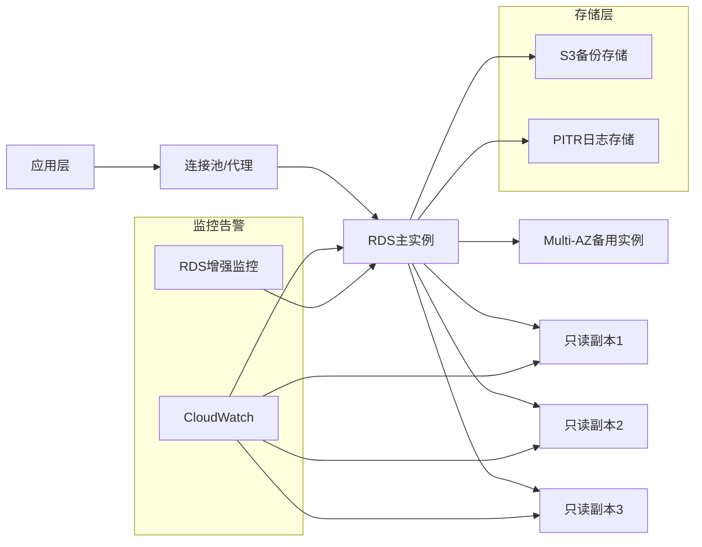
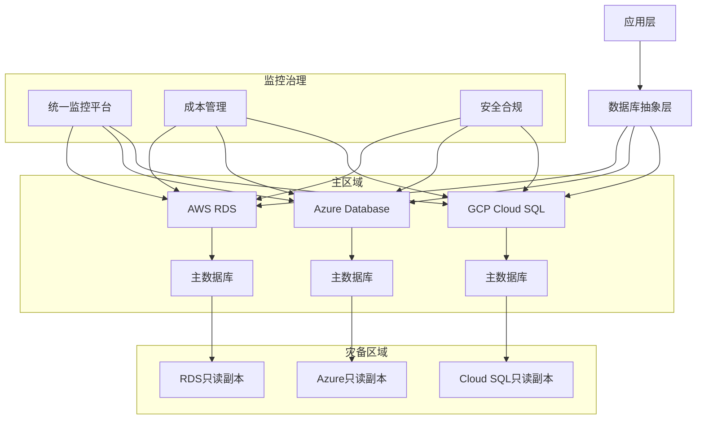

# 云数据库服务使用完整指南

## 🎯 概述

云数据库服务作为现代应用架构的核心组件，提供了托管的、可扩展的数据库解决方案。本指南深入解析AWS RDS、Azure Database和Google Cloud SQL等主流云数据库服务，帮助企业选择最适合的云数据库方案并实现高效运维。

## 📋 目录

1. [云数据库服务概览](#1-云数据库服务概览)
2. [AWS RDS深度实践](#2-aws-rds深度实践)
3. [Azure Database服务](#3-azure-database服务)
4. [Google Cloud SQL详解](#4-google-cloud-sql详解)
5. [多云数据库策略](#5-多云数据库策略)
6. [成本优化与性能调优](#6-成本优化与性能调优)

---

## 1. 云数据库服务概览

### 1.1 主流云数据库服务对比

#### 云数据库服务全景图

```mermaid
graph TD
    A[云数据库服务] --> B[AWS生态]
    A --> C[Azure生态]
    A --> D[GCP生态]
    
    B --> B1[RDS for MySQL]
    B --> B2[RDS for PostgreSQL]
    B --> B3[RDS for MariaDB]
    B --> B4[Aurora MySQL]
    B --> B5[Aurora PostgreSQL]
    B --> B6[DynamoDB]
    B --> B7[DocumentDB]
    B --> B8[ElastiCache]
    B --> B9[Timestream]
    
    C --> C1[Azure Database for MySQL]
    C --> C2[Azure Database for PostgreSQL]
    C --> C3[Azure SQL Database]
    C --> C4[Cosmos DB]
    C --> C5[Azure Cache for Redis]
    C --> C6[Azure Database for MariaDB]
    C --> C7[Synapse Analytics]
    
    D --> D1[Cloud SQL for MySQL]
    D --> D2[Cloud SQL for PostgreSQL]
    D --> D3[Cloud SQL for SQL Server]
    D --> D4[Cloud Spanner]
    D --> D5[Firestore]
    D --> D6[Bigtable]
    D --> D7[Memorystore]
    D --> D8[AlloyDB]
    
    subgraph "关系型数据库"
        B1 --> R1[MySQL兼容]
        B2 --> R1
        B3 --> R1
        C1 --> R1
        C2 --> R1
        D1 --> R1
        D2 --> R1
    end
    
    subgraph "NoSQL数据库"
        B6 --> N1[文档数据库]
        B7 --> N1
        C4 --> N1
        D5 --> N1
        B9 --> N2[时序数据库]
        D6 --> N3[宽列数据库]
    end
    
    subgraph "缓存服务"
        B8 --> CA1[Redis兼容]
        C5 --> CA1
        D7 --> CA1
    end
```


#### 云数据库服务特性对比矩阵
```python
# 云数据库服务对比分析系统
class CloudDatabaseComparison:
    def __init__(self):
        self.services = {
            'aws_rds_mysql': {
                'provider': 'AWS',
                'service_name': 'RDS for MySQL',
                'type': '关系型',
                'engine_version': '8.0.35',
                'pricing_model': ['按需', '预留实例', '节省计划'],
                'features': {
                    'automatic_backup': True,
                    'point_in_time_recovery': True,
                    'multi_az': True,
                    'read_replicas': 5,
                    'storage_auto_scaling': True,
                    'encryption_at_rest': True,
                    'iam_integration': True
                },
                'performance': {
                    'max_connections': 65535,
                    'max_storage': '64TB',
                    'max_iops': 16000,
                    'latency': '< 10ms'
                },
                'pricing': {
                    'small_instance': '$0.11/hour',
                    'medium_instance': '$0.44/hour',
                    'large_instance': '$1.76/hour',
                    'storage_per_gb': '$0.10/month'
                }
            },
            
            'azure_mysql': {
                'provider': 'Azure',
                'service_name': 'Azure Database for MySQL',
                'type': '关系型',
                'engine_version': '8.0.21',
                'pricing_model': ['按需', '预留实例'],
                'features': {
                    'automatic_backup': True,
                    'point_in_time_recovery': True,
                    'geo_restore': True,
                    'read_replicas': 5,
                    'storage_auto_scaling': True,
                    'encryption_at_rest': True,
                    'aad_integration': True
                },
                'performance': {
                    'max_connections': 8000,
                    'max_storage': '16TB',
                    'max_iops': 20000,
                    'latency': '< 5ms'
                },
                'pricing': {
                    'small_instance': '$0.12/hour',
                    'medium_instance': '$0.48/hour',
                    'large_instance': '$1.92/hour',
                    'storage_per_gb': '$0.115/month'
                }
            },
            
            'gcp_cloudsql_mysql': {
                'provider': 'GCP',
                'service_name': 'Cloud SQL for MySQL',
                'type': '关系型',
                'engine_version': '8.0.26',
                'pricing_model': ['按需', '承诺使用折扣'],
                'features': {
                    'automatic_backup': True,
                    'point_in_time_recovery': True,
                    'cross_region_replication': True,
                    'read_replicas': 10,
                    'storage_auto_scaling': True,
                    'encryption_at_rest': True,
                    'iam_integration': True
                },
                'performance': {
                    'max_connections': 4000,
                    'max_storage': '30TB',
                    'max_iops': 25000,
                    'latency': '< 3ms'
                },
                'pricing': {
                    'small_instance': '$0.10/hour',
                    'medium_instance': '$0.40/hour',
                    'large_instance': '$1.60/hour',
                    'storage_per_gb': '$0.17/month'
                }
            },
            
            'aws_aurora': {
                'provider': 'AWS',
                'service_name': 'Amazon Aurora',
                'type': '关系型',
                'engine_version': 'MySQL 8.0兼容',
                'pricing_model': ['按需', '预留实例'],
                'features': {
                    'automatic_backup': True,
                    'point_in_time_recovery': True,
                    'multi_master': True,
                    'global_database': True,
                    'serverless': True,
                    'parallel_query': True
                },
                'performance': {
                    'max_connections': 300000,
                    'max_storage': '128TB',
                    'max_throughput': '15GB/s',
                    'latency': '< 5ms'
                },
                'pricing': {
                    'small_instance': '$0.20/hour',
                    'medium_instance': '$0.80/hour',
                    'large_instance': '$3.20/hour',
                    'io_per_request': '$0.20/million'
                }
            }
        }
    
    def compare_services(self, criteria: list, providers: list = None):
        """按指定标准比较云数据库服务"""
        if providers is None:
            providers = list(self.services.keys())
        
        comparison_results = {}
        
        for provider in providers:
            if provider in self.services:
                service = self.services[provider]
                scores = {}
                
                for criterion in criteria:
                    if criterion == 'cost_effectiveness':
                        # 成本效益评分 (价格越低越好)
                        base_price = float(service['pricing']['medium_instance'].replace('$', '').replace('/hour', ''))
                        scores[criterion] = max(0, 100 - (base_price * 10))  # 标准化到0-100
                    
                    elif criterion == 'performance':
                        # 性能评分
                        perf_score = (
                            service['performance']['max_connections'] / 1000 +
                            service['performance']['max_iops'] / 1000 +
                            (30 - float(service['performance']['latency'].replace('< ', '').replace('ms', ''))) * 2
                        )
                        scores[criterion] = min(100, perf_score)
                    
                    elif criterion == 'feature_completeness':
                        # 功能完整性评分
                        features = service['features']
                        feature_score = sum([
                            features['automatic_backup'],
                            features['point_in_time_recovery'],
                            features['multi_az'] if 'multi_az' in features else 0,
                            features['read_replicas'] / 5,
                            features['storage_auto_scaling'],
                            features['encryption_at_rest'],
                            features['iam_integration'] if 'iam_integration' in features else 0
                        ]) * 15
                        scores[criterion] = min(100, feature_score)
                    
                    elif criterion == 'scalability':
                        # 可扩展性评分
                        max_storage = service['performance']['max_storage']
                        storage_tb = float(max_storage.replace('TB', '').replace('GB', '')) 
                        if 'GB' in max_storage:
                            storage_tb /= 1024
                        
                        scalability_score = (
                            storage_tb / 10 +  # 存储扩展能力
                            service['features']['read_replicas'] +  # 读副本数量
                            (10 if service['features'].get('storage_auto_scaling', False) else 0)  # 自动扩展
                        )
                        scores[criterion] = min(100, scalability_score * 3)
                
                comparison_results[provider] = {
                    'service_info': {
                        'provider': service['provider'],
                        'service_name': service['service_name'],
                        'type': service['type']
                    },
                    'scores': scores,
                    'total_score': sum(scores.values()) / len(criteria)
                }
        
        return comparison_results
    
    def recommend_service(self, workload_profile: dict, budget_limit: float = None):
        """基于工作负载特征推荐服务"""
        # 工作负载权重定义
        workload_weights = {
            'oltp_transactional': {
                'performance': 0.35,
                'feature_completeness': 0.25,
                'scalability': 0.25,
                'cost_effectiveness': 0.15
            },
            'olap_analytical': {
                'performance': 0.30,
                'scalability': 0.30,
                'feature_completeness': 0.25,
                'cost_effectiveness': 0.15
            },
            'mixed_workload': {
                'performance': 0.30,
                'scalability': 0.25,
                'feature_completeness': 0.25,
                'cost_effectiveness': 0.20
            },
            'development_testing': {
                'cost_effectiveness': 0.40,
                'feature_completeness': 0.30,
                'performance': 0.20,
                'scalability': 0.10
            }
        }
        
        # 确定工作负载类型
        workload_type = workload_profile.get('type', 'mixed_workload')
        weights = workload_weights.get(workload_type, workload_weights['mixed_workload'])
        
        # 获取比较结果
        criteria = list(weights.keys())
        comparison_results = self.compare_services(criteria)
        
        # 应用权重计算加权分数
        weighted_results = {}
        for provider, result in comparison_results.items():
            weighted_score = 0
            for criterion, weight in weights.items():
                if criterion in result['scores']:
                    weighted_score += result['scores'][criterion] * weight
            
            # 如果有预算限制，过滤超出预算的服务
            if budget_limit:
                medium_price = float(self.services[provider]['pricing']['medium_instance'].replace('$', '').replace('/hour', ''))
                if medium_price * 24 * 30 > budget_limit:  # 月费用估算
                    continue
            
            weighted_results[provider] = {
                'service_info': result['service_info'],
                'weighted_score': weighted_score,
                'detailed_scores': result['scores']
            }
        
        # 排序并返回推荐结果
        recommendations = sorted(weighted_results.items(), key=lambda x: x[1]['weighted_score'], reverse=True)
        
        return {
            'primary_recommendation': recommendations[0] if recommendations else None,
            'alternatives': recommendations[1:3] if len(recommendations) > 1 else [],
            'detailed_analysis': weighted_results
        }

# 使用示例
comparison_system = CloudDatabaseComparison()

# OLTP事务型工作负载推荐
oltp_workload = {
    'type': 'oltp_transactional',
    'connections': 1000,
    'transactions_per_second': 5000,
    'data_size_gb': 500
}

recommendation = comparison_system.recommend_service(oltp_workload, budget_limit=2000)
print("主要推荐:", recommendation['primary_recommendation'])
print("备选方案:", recommendation['alternatives'])
```

### 1.2 云数据库选型决策框架

#### 选型决策矩阵
```yaml
# cloud-database-selection-framework.yaml
selection_framework:
  business_requirements:
    - requirement: 数据一致性要求
      importance: critical
      evaluation_criteria:
        - strong_consistency: 需要强一致性保证
        - eventual_consistency: 可接受最终一致性
        - mixed_consistency: 混合一致性需求
    
    - requirement: 性能要求
      importance: high
      evaluation_criteria:
        - latency_sensitive: 低延迟敏感应用
        - throughput_focused: 高吞吐量需求
        - balanced: 平衡延迟和吞吐量
    
    - requirement: 扩展性需求
      importance: high
      evaluation_criteria:
        - vertical_scaling: 垂直扩展为主
        - horizontal_scaling: 水平扩展需求
        - auto_scaling: 自动扩展要求
    
    - requirement: 可用性要求
      importance: critical
      evaluation_criteria:
        - high_availability: 99.9%以上可用性
        - disaster_recovery: 完善的灾备方案
        - multi_region: 多区域部署需求
  
  technical_requirements:
    - requirement: 数据库引擎兼容性
      importance: high
      evaluation_criteria:
        - mysql_compatible: MySQL兼容性
        - postgresql_compatible: PostgreSQL兼容性
        - sql_server_compatible: SQL Server兼容性
        - nosql_support: NoSQL支持
    
    - requirement: 开发运维友好性
      importance: medium
      evaluation_criteria:
        - managed_service: 完全托管服务
        - self_managed: 需要自管理能力
        - migration_tools: 迁移工具支持
        - monitoring_integration: 监控集成能力
    
    - requirement: 安全合规要求
      importance: critical
      evaluation_criteria:
        - encryption_at_rest: 静态数据加密
        - encryption_in_transit: 传输加密
        - iam_integration: 身份认证集成
        - compliance_certifications: 合规认证支持
  
  financial_requirements:
    - requirement: 成本控制
      importance: high
      evaluation_criteria:
        - predictable_pricing: 可预测定价
        - pay_as_you_go: 按需付费模式
        - reserved_instances: 预留实例优惠
        - spot_instances: 竞价实例支持

decision_matrix:
  scoring_system:
    critical: 30
    high: 20
    medium: 10
    low: 5
  
  provider_evaluation:
    aws:
      strengths:
        - comprehensive_service_portfolio
        - mature_ecosystem
        - excellent_performance
        - strong_enterprise_features
      weaknesses:
        - pricing_complexity
        - steep_learning_curve
        - vendor_lock_in_concerns
      
    azure:
      strengths:
        - enterprise_integration
        - hybrid_cloud_capabilities
        - strong_compliance_support
        - good_net_developer_experience
      weaknesses:
        - limited_service_availability
        - higher_pricing_than_competitors
        - smaller_community
      
    gcp:
      strengths:
        - superior_performance
        - innovative_features
        - competitive_pricing
        - strong_analytics_integration
      weaknesses:
        - smaller_ecosystem
        - limited_enterprise_features
        - regional_availability_gaps
```

## 2. AWS RDS深度实践

### 2.1 RDS基础架构与部署

#### RDS架构设计


#### RDS部署配置模板
```yaml
# rds-deployment-template.yaml
AWSTemplateFormatVersion: '2010-09-09'
Description: 'Production RDS MySQL Database Template'

Parameters:
  DBInstanceIdentifier:
    Type: String
    Default: production-mysql
    Description: 数据库实例标识符
  
  DBName:
    Type: String
    Default: production_db
    Description: 数据库名称
  
  DBUsername:
    Type: String
    Default: admin
    Description: 数据库用户名
  
  DBPassword:
    Type: String
    NoEcho: true
    Description: 数据库密码
  
  DBInstanceClass:
    Type: String
    Default: db.r6g.large
    AllowedValues:
      - db.t4g.micro
      - db.t4g.small
      - db.r6g.large
      - db.r6g.xlarge
      - db.r6g.2xlarge
    Description: 数据库实例类型
  
  AllocatedStorage:
    Type: Number
    Default: 100
    Description: 分配的存储空间(GB)
  
  VPCId:
    Type: AWS::EC2::VPC::Id
    Description: VPC ID
  
  SubnetIds:
    Type: List<AWS::EC2::Subnet::Id>
    Description: 子网IDs

Resources:
  # 数据库子网组
  DBSubnetGroup:
    Type: AWS::RDS::DBSubnetGroup
    Properties:
      DBSubnetGroupDescription: Subnet group for RDS instances
      SubnetIds: !Ref SubnetIds
      Tags:
        - Key: Name
          Value: !Sub '${AWS::StackName}-subnet-group'

  # 安全组
  DatabaseSecurityGroup:
    Type: AWS::EC2::SecurityGroup
    Properties:
      GroupDescription: Security group for RDS database
      VpcId: !Ref VPCId
      SecurityGroupIngress:
        - IpProtocol: tcp
          FromPort: 3306
          ToPort: 3306
          SourceSecurityGroupId: !Ref ApplicationSecurityGroup
      Tags:
        - Key: Name
          Value: !Sub '${AWS::StackName}-db-sg'

  # RDS参数组
  DBParameterGroup:
    Type: AWS::RDS::DBParameterGroup
    Properties:
      Family: mysql8.0
      Description: Parameter group for production MySQL
      Parameters:
        max_connections: '2000'
        innodb_buffer_pool_size: '{DBInstanceClassMemory*3/4}'
        slow_query_log: '1'
        long_query_time: '2'
        log_queries_not_using_indexes: '1'
      Tags:
        - Key: Name
          Value: !Sub '${AWS::StackName}-param-group'

  # 选项组
  DBOptionGroup:
    Type: AWS::RDS::OptionGroup
    Properties:
      EngineName: mysql
      MajorEngineVersion: '8.0'
      OptionGroupDescription: Option group for MySQL with monitoring
      Options:
        - OptionName: MARIADB_AUDIT_PLUGIN
        - OptionName: MYSQL_BACKUP_RESTORE

  # 主数据库实例
  DBInstance:
    Type: AWS::RDS::DBInstance
    Properties:
      DBInstanceIdentifier: !Ref DBInstanceIdentifier
      DBName: !Ref DBName
      DBInstanceClass: !Ref DBInstanceClass
      AllocatedStorage: !Ref AllocatedStorage
      Engine: mysql
      EngineVersion: '8.0.35'
      MasterUsername: !Ref DBUsername
      MasterUserPassword: !Ref DBPassword
      StorageType: gp3
      StorageEncrypted: true
      KmsKeyId: !Ref DatabaseKMSKey
      BackupRetentionPeriod: 7
      MultiAZ: true
      AutoMinorVersionUpgrade: true
      DeletionProtection: true
      CopyTagsToSnapshot: true
      EnablePerformanceInsights: true
      PerformanceInsightsRetentionPeriod: 7
      EnableCloudwatchLogsExports:
        - error
        - general
        - slowquery
      DBSubnetGroupName: !Ref DBSubnetGroup
      VPCSecurityGroups:
        - !Ref DatabaseSecurityGroup
      DBParameterGroupName: !Ref DBParameterGroup
      OptionGroupName: !Ref DBOptionGroup
      Tags:
        - Key: Environment
          Value: Production
        - Key: Application
          Value: !Ref AWS::StackName

  # 只读副本
  ReadOnlyReplica:
    Type: AWS::RDS::DBInstance
    Properties:
      SourceDBInstanceIdentifier: !Ref DBInstance
      DBInstanceClass: !Ref DBInstanceClass
      PubliclyAccessible: false
      Tags:
        - Key: Name
          Value: !Sub '${DBInstanceIdentifier}-readonly'

Outputs:
  DBEndpoint:
    Description: Database endpoint
    Value: !GetAtt DBInstance.Endpoint.Address
    Export:
      Name: !Sub '${AWS::StackName}-DBEndpoint'
  
  DBPort:
    Description: Database port
    Value: !GetAtt DBInstance.Endpoint.Port
    Export:
      Name: !Sub '${AWS::StackName}-DBPort'
  
  DBResourceId:
    Description: Database resource ID
    Value: !Ref DBInstance
    Export:
      Name: !Sub '${AWS::StackName}-DBResourceId'
```

### 2.2 RDS高级配置与优化

#### 性能优化配置
```python
# rds_performance_optimizer.py
import boto3
import json
from typing import Dict, List, Any

class RDSPerformanceOptimizer:
    def __init__(self, region: str = 'us-east-1'):
        self.rds_client = boto3.client('rds', region_name=region)
        self.cloudwatch_client = boto3.client('cloudwatch', region_name=region)
    
    def analyze_instance_performance(self, db_instance_identifier: str) -> Dict[str, Any]:
        """分析RDS实例性能"""
        # 获取实例信息
        response = self.rds_client.describe_db_instances(
            DBInstanceIdentifier=db_instance_identifier
        )
        instance_info = response['DBInstances'][0]
        
        # 收集CloudWatch指标
        metrics = self._collect_performance_metrics(db_instance_identifier)
        
        # 分析性能瓶颈
        bottlenecks = self._identify_bottlenecks(metrics, instance_info)
        
        return {
            'instance_info': instance_info,
            'performance_metrics': metrics,
            'bottlenecks': bottlenecks,
            'optimization_recommendations': self._generate_recommendations(bottlenecks, instance_info)
        }
    
    def _collect_performance_metrics(self, db_instance_identifier: str) -> Dict[str, List[float]]:
        """收集性能指标"""
        metric_names = [
            'CPUUtilization',
            'DatabaseConnections',
            'FreeableMemory',
            'ReadIOPS',
            'WriteIOPS',
            'ReadLatency',
            'WriteLatency',
            'ReadThroughput',
            'WriteThroughput'
        ]
        
        metrics_data = {}
        
        for metric_name in metric_names:
            response = self.cloudwatch_client.get_metric_statistics(
                Namespace='AWS/RDS',
                MetricName=metric_name,
                Dimensions=[
                    {
                        'Name': 'DBInstanceIdentifier',
                        'Value': db_instance_identifier
                    }
                ],
                StartTime=datetime.utcnow() - timedelta(hours=1),
                EndTime=datetime.utcnow(),
                Period=300,  # 5分钟间隔
                Statistics=['Average', 'Maximum']
            )
            
            metrics_data[metric_name] = [
                datapoint['Average'] for datapoint in response['Datapoints']
            ]
        
        return metrics_data
    
    def _identify_bottlenecks(self, metrics: Dict[str, List[float]], instance_info: Dict[str, Any]) -> List[Dict[str, Any]]:
        """识别性能瓶颈"""
        bottlenecks = []
        
        # CPU瓶颈检测
        avg_cpu = sum(metrics.get('CPUUtilization', [])) / len(metrics.get('CPUUtilization', [1]))
        if avg_cpu > 70:
            bottlenecks.append({
                'type': 'cpu',
                'severity': 'high' if avg_cpu > 85 else 'medium',
                'current_value': avg_cpu,
                'threshold': 70,
                'description': f'CPU使用率过高: {avg_cpu:.1f}%'
            })
        
        # 内存瓶颈检测
        free_memory_mb = sum(metrics.get('FreeableMemory', [])) / len(metrics.get('FreeableMemory', [1])) / (1024 * 1024)
        total_memory_gb = instance_info.get('DBInstanceClassMemory', 0) / (1024 * 1024 * 1024)
        memory_utilization = (total_memory_gb - free_memory_mb / 1024) / total_memory_gb * 100
        
        if memory_utilization > 80:
            bottlenecks.append({
                'type': 'memory',
                'severity': 'high' if memory_utilization > 90 else 'medium',
                'current_value': memory_utilization,
                'threshold': 80,
                'description': f'内存使用率过高: {memory_utilization:.1f}%'
            })
        
        # I/O瓶颈检测
        avg_read_iops = sum(metrics.get('ReadIOPS', [])) / len(metrics.get('ReadIOPS', [1]))
        avg_write_iops = sum(metrics.get('WriteIOPS', [])) / len(metrics.get('WriteIOPS', [1]))
        max_iops = self._get_max_iops(instance_info['DBInstanceClass'])
        
        total_iops_utilization = (avg_read_iops + avg_write_iops) / max_iops * 100
        if total_iops_utilization > 70:
            bottlenecks.append({
                'type': 'io',
                'severity': 'high' if total_iops_utilization > 85 else 'medium',
                'current_value': total_iops_utilization,
                'threshold': 70,
                'description': f'I/O使用率过高: {total_iops_utilization:.1f}%'
            })
        
        return bottlenecks
    
    def _get_max_iops(self, instance_class: str) -> int:
        """获取实例类型的最大IOPS"""
        iops_map = {
            'db.t4g.micro': 3000,
            'db.t4g.small': 3000,
            'db.r6g.large': 16000,
            'db.r6g.xlarge': 16000,
            'db.r6g.2xlarge': 16000,
            'db.r6g.4xlarge': 16000
        }
        return iops_map.get(instance_class, 3000)
    
    def _generate_recommendations(self, bottlenecks: List[Dict[str, Any]], instance_info: Dict[str, Any]) -> List[Dict[str, str]]:
        """生成优化建议"""
        recommendations = []
        
        for bottleneck in bottlenecks:
            if bottleneck['type'] == 'cpu':
                recommendations.append({
                    'category': 'instance_scaling',
                    'action': '升级实例规格',
                    'details': f'当前CPU使用率{bottleneck["current_value"]:.1f}%，建议升级到更高规格的实例'
                })
            
            elif bottleneck['type'] == 'memory':
                recommendations.append({
                    'category': 'memory_optimization',
                    'action': '调整缓冲池大小',
                    'details': f'优化InnoDB缓冲池配置，当前内存使用率{bottleneck["current_value"]:.1f}%'
                })
            
            elif bottleneck['type'] == 'io':
                if 'gp3' in instance_info.get('StorageType', ''):
                    recommendations.append({
                        'category': 'storage_optimization',
                        'action': '增加存储IOPS',
                        'details': f'当前I/O使用率{bottleneck["current_value"]:.1f}%，建议增加GP3存储的IOPS配置'
                    })
                else:
                    recommendations.append({
                        'category': 'storage_upgrade',
                        'action': '升级存储类型',
                        'details': f'当前I/O使用率{bottleneck["current_value"]:.1f}%，建议升级到GP3存储类型'
                    })
        
        return recommendations
    
    def apply_optimizations(self, db_instance_identifier: str, optimizations: List[Dict[str, str]]) -> bool:
        """应用优化配置"""
        try:
            for optimization in optimizations:
                if optimization['category'] == 'instance_scaling':
                    # 实例规格升级逻辑
                    self._upgrade_instance_class(db_instance_identifier)
                
                elif optimization['category'] == 'memory_optimization':
                    # 内存优化逻辑
                    self._optimize_memory_parameters(db_instance_identifier)
                
                elif optimization['category'] == 'storage_optimization':
                    # 存储优化逻辑
                    self._optimize_storage_configuration(db_instance_identifier)
            
            return True
        except Exception as e:
            print(f"优化应用失败: {str(e)}")
            return False
    
    def _upgrade_instance_class(self, db_instance_identifier: str):
        """升级实例规格"""
        # 获取当前实例信息
        response = self.rds_client.describe_db_instances(
            DBInstanceIdentifier=db_instance_identifier
        )
        current_class = response['DBInstances'][0]['DBInstanceClass']
        
        # 确定升级后的实例规格
        upgrade_map = {
            'db.t4g.micro': 'db.t4g.small',
            'db.t4g.small': 'db.r6g.large',
            'db.r6g.large': 'db.r6g.xlarge'
        }
        
        new_class = upgrade_map.get(current_class, current_class)
        if new_class != current_class:
            self.rds_client.modify_db_instance(
                DBInstanceIdentifier=db_instance_identifier,
                DBInstanceClass=new_class,
                ApplyImmediately=False  # 在维护窗口期间应用
            )
            print(f"实例规格从 {current_class} 升级到 {new_class}")
    
    def _optimize_memory_parameters(self, db_instance_identifier: str):
        """优化内存相关参数"""
        # 修改参数组中的内存相关参数
        parameter_group_name = f"{db_instance_identifier}-optimized-params"
        
        # 创建新的参数组（如果不存在）
        try:
            self.rds_client.create_db_parameter_group(
                DBParameterGroupName=parameter_group_name,
                DBParameterGroupFamily='mysql8.0',
                Description='Optimized parameters for memory usage'
            )
        except self.rds_client.exceptions.DBParameterGroupAlreadyExistsFault:
            pass  # 参数组已存在
        
        # 修改参数
        parameters_to_modify = [
            {
                'ParameterName': 'innodb_buffer_pool_size',
                'ParameterValue': '{DBInstanceClassMemory*3/4}',
                'ApplyMethod': 'pending-reboot'
            },
            {
                'ParameterName': 'innodb_log_buffer_size',
                'ParameterValue': '67108864',  # 64MB
                'ApplyMethod': 'pending-reboot'
            },
            {
                'ParameterName': 'key_buffer_size',
                'ParameterValue': '{DBInstanceClassMemory*1/8}',
                'ApplyMethod': 'immediate'
            }
        ]
        
        self.rds_client.modify_db_parameter_group(
            DBParameterGroupName=parameter_group_name,
            Parameters=parameters_to_modify
        )
        
        # 将参数组应用到实例
        self.rds_client.modify_db_instance(
            DBInstanceIdentifier=db_instance_identifier,
            DBParameterGroupName=parameter_group_name,
            ApplyImmediately=False
        )

# 使用示例
optimizer = RDSPerformanceOptimizer(region='us-east-1')
analysis_result = optimizer.analyze_instance_performance('production-mysql')

print("性能分析结果:")
print(json.dumps(analysis_result, indent=2, ensure_ascii=False))

# 应用优化建议
if analysis_result['optimization_recommendations']:
    optimizer.apply_optimizations(
        'production-mysql',
        analysis_result['optimization_recommendations']
    )
```

### 2.3 RDS安全与合规配置

#### 安全配置最佳实践
```yaml
# rds-security-configuration.yaml
AWSTemplateFormatVersion: '2010-09-09'
Description: 'RDS Security Best Practices Configuration'

Parameters:
  Environment:
    Type: String
    Default: production
    AllowedValues:
      - development
      - staging
      - production
    Description: 环境类型

Resources:
  # KMS密钥用于加密
  DatabaseKMSKey:
    Type: AWS::KMS::Key
    Properties:
      Description: KMS key for RDS database encryption
      KeyPolicy:
        Version: '2012-10-17'
        Statement:
          - Sid: Enable IAM User Permissions
            Effect: Allow
            Principal:
              AWS: !Sub 'arn:aws:iam::${AWS::AccountId}:root'
            Action: 'kms:*'
            Resource: '*'
          - Sid: Allow RDS service to use the key
            Effect: Allow
            Principal:
              Service: 'rds.amazonaws.com'
            Action:
              - 'kms:Encrypt'
              - 'kms:Decrypt'
              - 'kms:ReEncrypt*'
              - 'kms:GenerateDataKey*'
              - 'kms:DescribeKey'
            Resource: '*'
      EnableKeyRotation: true
      PendingWindowInDays: 30

  # 数据库活动流配置
  DatabaseActivityStream:
    Type: AWS::RDS::DBClusterParameterGroup
    Properties:
      Description: Parameter group with audit logging enabled
      Family: aurora-mysql5.7
      Parameters:
        server_audit_logging: '1'
        server_audit_events: 'CONNECT,QUERY,TABLE'
        server_audit_excl_users: ''
        server_audit_incl_users: '*'
        log_output: 'FILE'
        general_log: '1'
        slow_query_log: '1'
        long_query_time: '2'

  # CloudTrail配置用于审计
  DatabaseCloudTrail:
    Type: AWS::CloudTrail::Trail
    Properties:
      TrailName: !Sub '${AWS::StackName}-database-audit-trail'
      S3BucketName: !Ref AuditLogBucket
      IsLogging: true
      IncludeGlobalServiceEvents: true
      IsMultiRegionTrail: true
      EventSelectors:
        - ReadWriteType: All
          IncludeManagementEvents: true
          DataResources:
            - Type: AWS::RDS::DBInstance
              Values:
                - !Sub 'arn:aws:rds:${AWS::Region}:${AWS::AccountId}:db:*'
            - Type: AWS::RDS::DBCluster
              Values:
                - !Sub 'arn:aws:rds:${AWS::Region}:${AWS::AccountId}:cluster:*'

  # 审计日志存储桶
  AuditLogBucket:
    Type: AWS::S3::Bucket
    Properties:
      BucketName: !Sub '${AWS::StackName}-audit-logs-${AWS::AccountId}'
      VersioningConfiguration:
        Status: Enabled
      BucketEncryption:
        ServerSideEncryptionConfiguration:
          - ServerSideEncryptionByDefault:
              SSEAlgorithm: AES256
      PublicAccessBlockConfiguration:
        BlockPublicAcls: true
        BlockPublicPolicy: true
        IgnorePublicAcls: true
        RestrictPublicBuckets: true
      LifecycleConfiguration:
        Rules:
          - Id: ArchiveOldLogs
            Status: Enabled
            Transitions:
              - TransitionInDays: 90
                StorageClass: STANDARD_IA
              - TransitionInDays: 365
                StorageClass: GLACIER
            ExpirationInDays: 1825  # 5年保留

  # IAM角色和策略
  DatabaseAdministratorRole:
    Type: AWS::IAM::Role
    Properties:
      RoleName: !Sub '${AWS::StackName}-db-admin-role'
      AssumeRolePolicyDocument:
        Version: '2012-10-17'
        Statement:
          - Effect: Allow
            Principal:
              Service: 'rds.amazonaws.com'
            Action: 'sts:AssumeRole'
      ManagedPolicyArns:
        - arn:aws:iam::aws:policy/AmazonRDSFullAccess
      Policies:
        - PolicyName: DatabaseSecurityPolicy
          PolicyDocument:
            Version: '2012-10-17'
            Statement:
              - Effect: Allow
                Action:
                  - 'kms:Encrypt'
                  - 'kms:Decrypt'
                  - 'kms:ReEncrypt*'
                  - 'kms:GenerateDataKey*'
                  - 'kms:DescribeKey'
                Resource: !GetAtt DatabaseKMSKey.Arn
              - Effect: Allow
                Action:
                  - 's3:GetObject'
                  - 's3:PutObject'
                  - 's3:DeleteObject'
                Resource: !Sub '${AuditLogBucket}/*'

Outputs:
  KMSKeyArn:
    Description: Database encryption KMS key ARN
    Value: !GetAtt DatabaseKMSKey.Arn
  
  AuditBucketName:
    Description: Audit log S3 bucket name
    Value: !Ref AuditLogBucket
  
  AdminRoleArn:
    Description: Database administrator role ARN
    Value: !GetAtt DatabaseAdministratorRole.Arn
```

## 3. Azure Database服务

### 3.1 Azure Database for MySQL配置

#### Azure MySQL部署配置
```json
{
  "$schema": "https://schema.management.azure.com/schemas/2019-04-01/deploymentTemplate.json#",
  "contentVersion": "1.0.0.0",
  "parameters": {
    "serverName": {
      "type": "string",
      "defaultValue": "[concat('mysql-', uniqueString(resourceGroup().id))]",
      "metadata": {
        "description": "服务器名称"
      }
    },
    "administratorLogin": {
      "type": "string",
      "metadata": {
        "description": "管理员登录名"
      }
    },
    "administratorLoginPassword": {
      "type": "securestring",
      "metadata": {
        "description": "管理员密码"
      }
    },
    "skuCapacity": {
      "type": "int",
      "defaultValue": 2,
      "metadata": {
        "description": "数据库计算单位"
      }
    },
    "skuName": {
      "type": "string",
      "defaultValue": "GP_Gen5_2",
      "metadata": {
        "description": "SKU名称"
      }
    },
    "skuSizeMB": {
      "type": "int",
      "defaultValue": 51200,
      "metadata": {
        "description": "存储大小(MB)"
      }
    },
    "skuTier": {
      "type": "string",
      "defaultValue": "GeneralPurpose",
      "metadata": {
        "description": "SKU层级"
      }
    },
    "version": {
      "type": "string",
      "defaultValue": "8.0",
      "metadata": {
        "description": "MySQL版本"
      }
    },
    "location": {
      "type": "string",
      "defaultValue": "[resourceGroup().location]",
      "metadata": {
        "description": "位置"
      }
    }
  },
  "variables": {
    "databaseName": "production_db"
  },
  "resources": [
    {
      "type": "Microsoft.DBforMySQL/servers",
      "apiVersion": "2017-12-01",
      "name": "[parameters('serverName')]",
      "location": "[parameters('location')]",
      "sku": {
        "name": "[parameters('skuName')]",
        "tier": "[parameters('skuTier')]",
        "capacity": "[parameters('skuCapacity')]"
      },
      "properties": {
        "version": "[parameters('version')]",
        "administratorLogin": "[parameters('administratorLogin')]",
        "administratorLoginpassword: "${DB_PASSWORD}"administratorLoginPassword')]",
        "storageProfile": {
          "storageMB": "[parameters('skuSizeMB')]",
          "backupRetentionDays": 7,
          "geoRedundantBackup": "Disabled",
          "storageAutogrow": "Enabled"
        }
      },
      "resources": [
        {
          "type": "firewallRules",
          "apiVersion": "2017-12-01",
          "name": "AllowAllWindowsAzureIps",
          "dependsOn": [
            "[resourceId('Microsoft.DBforMySQL/servers', parameters('serverName'))]"
          ],
          "properties": {
            "startIpAddress": "0.0.0.0",
            "endIpAddress": "0.0.0.0"
          }
        },
        {
          "type": "databases",
          "apiVersion": "2017-12-01",
          "name": "[variables('databaseName')]",
          "dependsOn": [
            "[resourceId('Microsoft.DBforMySQL/servers', parameters('serverName'))]"
          ],
          "properties": {}
        }
      ]
    }
  ],
  "outputs": {
    "fullyQualifiedDomainName": {
      "type": "string",
      "value": "[reference(resourceId('Microsoft.DBforMySQL/servers', parameters('serverName'))).fullyQualifiedDomainName]"
    }
  }
}
```

### 3.2 Azure安全配置
```powershell
# Azure Database安全配置脚本
param(
    [string]$ResourceGroupName = "Production-RG",
    [string]$ServerName = "mysql-production",
    [string]$Location = "East US"
)

# 登录Azure
Connect-AzAccount

# 创建资源组
New-AzResourceGroup -Name $ResourceGroupName -Location $Location

# 创建MySQL服务器
$Password = ConvertTo-SecureString "StrongPassword123!" -AsPlainText -Force
$Credential = New-Object System.Management.Automation.PSCredential ("adminuser", $Password)

New-AzMySqlServer -ResourceGroupName $ResourceGroupName -ServerName $ServerName -Location $Location -SqlAdministratorCredentials $Credential -SslEnforcement Enabled -MinimalTlsVersion TLSEnforcementDisabled -PublicNetworkAccess Disabled

# 配置防火墙规则
New-AzMySqlFirewallRule -ResourceGroupName $ResourceGroupName -ServerName $ServerName -FirewallRuleName "AllowAppServers" -StartIpAddress "10.0.1.0" -EndIpAddress "10.0.1.255"

# 启用审计日志
Update-AzMySqlServerConfiguration -ResourceGroupName $ResourceGroupName -ServerName $ServerName -Name audit_log_enabled -Value ON
Update-AzMySqlServerConfiguration -ResourceGroupName $ResourceGroupName -ServerName $ServerName -Name audit_log_events -Value "CONNECTION,DML,DDL"

# 配置威胁检测
Set-AzMySqlThreatDetectionPolicy -ResourceGroupName $ResourceGroupName -ServerName $ServerName -EmailAdmins Enabled -NotificationRecipientsEmails "security@company.com"

Write-Host "Azure MySQL安全配置完成"
```

## 4. Google Cloud SQL详解

### 4.1 Cloud SQL基础配置

#### Terraform配置文件
```hcl
# main.tf - Google Cloud SQL配置
terraform {
  required_providers {
    google = {
      source  = "hashicorp/google"
      version = "~> 4.0"
    }
  }
}

provider "google" {
  project = var.project_id
  region  = var.region
}

# 创建Cloud SQL实例
resource "google_sql_database_instance" "mysql_instance" {
  name             = var.instance_name
  database_version = "MYSQL_8_0"
  region           = var.region

  settings {
    tier = var.machine_type
    
    # 存储配置
    disk_size       = var.disk_size_gb
    disk_type       = "PD_SSD"
    disk_autoresize = true

    # 备份配置
    backup_configuration {
      enabled                        = true
      start_time                     = "02:00"
      point_in_time_recovery_enabled = true
      transaction_log_retention_days = 7
    }

    # 高可用配置
    availability_type = "REGIONAL"
    
    # 维护窗口
    maintenance_window {
      day          = 7  # 星期日
      hour         = 2  # 凌晨2点
      update_track = "stable"
    }

    # IP配置
    ip_configuration {
      ipv4_enabled    = true
      private_network = var.vpc_network
      
      authorized_networks {
        name  = "application-servers"
        value = var.app_server_cidr
      }
    }

    # 数据库标志
    database_flags {
      name  = "max_connections"
      value = "2000"
    }
    
    database_flags {
      name  = "innodb_buffer_pool_size"
      value = "2147483648"  # 2GB
    }
  }

  # 加密配置
  encryption_key_name = google_kms_crypto_key.sql_key.id

  deletion_protection = true
}

# 创建数据库
resource "google_sql_database" "main_database" {
  name     = var.database_name
  instance = google_sql_database_instance.mysql_instance.name
}

# 创建用户
resource "google_sql_user" "app_user" {
  name     = var.db_username
  instance = google_sql_database_instance.mysql_instance.name
  password = var.db_password
}

# KMS密钥用于加密
resource "google_kms_key_ring" "sql_keyring" {
  name     = "${var.instance_name}-keyring"
  location = var.region
}

resource "google_kms_crypto_key" "sql_key" {
  name     = "${var.instance_name}-crypto-key"
  key_ring = google_kms_key_ring.sql_keyring.id
}
```

### 4.2 Cloud SQL监控配置
```python
# cloud_sql_monitoring.py
from google.cloud import monitoring_v3
from google.cloud.sql import connector
import pymysql
import time

class CloudSQLMonitor:
    def __init__(self, project_id: str, instance_name: str):
        self.project_id = project_id
        self.instance_name = instance_name
        self.monitoring_client = monitoring_v3.MetricServiceClient()
        
    def collect_metrics(self) -> dict:
        """收集Cloud SQL指标"""
        metrics = {}
        
        # CPU使用率
        cpu_query = f"""
        fetch cloudsql_database
        | metric 'cloudsql.googleapis.com/database/cpu/utilization'
        | filter resource.database_id == '{self.project_id}:{self.instance_name}'
        | within 1h
        | align rate(1m)
        """
        
        # 连接数
        connections_query = f"""
        fetch cloudsql_database
        | metric 'cloudsql.googleapis.com/database/network/connections'
        | filter resource.database_id == '{self.project_id}:{self.instance_name}'
        | within 1h
        | align delta(1m)
        """
        
        # 查询延迟
        latency_query = f"""
        fetch cloudsql_database
        | metric 'cloudsql.googleapis.com/database/query/latency'
        | filter resource.database_id == '{self.project_id}:{self.instance_name}'
        | within 1h
        | align delta(1m)
        """
        
        metrics['cpu_utilization'] = self._execute_query(cpu_query)
        metrics['connections'] = self._execute_query(connections_query)
        metrics['query_latency'] = self._execute_query(latency_query)
        
        return metrics
    
    def _execute_query(self, query: str) -> list:
        """执行监控查询"""
        request = monitoring_v3.QueryTimeSeriesRequest(
            name=f"projects/{self.project_id}",
            query=query
        )
        response = self.monitoring_client.query_time_series(request=request)
        return list(response)
    
    def check_performance_thresholds(self, metrics: dict) -> list:
        """检查性能阈值"""
        alerts = []
        
        # CPU使用率阈值检查
        if metrics['cpu_utilization'] and max(metrics['cpu_utilization']) > 0.8:
            alerts.append({
                'type': 'HIGH_CPU',
                'severity': 'WARNING',
                'message': f'CPU使用率超过80%: {max(metrics["cpu_utilization"]):.2%}'
            })
        
        # 连接数阈值检查
        if metrics['connections'] and max(metrics['connections']) > 1000:
            alerts.append({
                'type': 'HIGH_CONNECTIONS',
                'severity': 'WARNING',
                'message': f'连接数超过1000: {max(metrics["connections"])}'
            })
        
        return alerts

# 使用示例
monitor = CloudSQLMonitor('my-project', 'mysql-instance-1')
metrics = monitor.collect_metrics()
alerts = monitor.check_performance_thresholds(metrics)

for alert in alerts:
    print(f"{alert['type']}: {alert['message']}")
```

## 5. 多云数据库策略

### 5.1 多云架构设计

#### 多云数据库架构图


### 5.2 多云数据库管理工具
```python
# multi_cloud_database_manager.py
import boto3
from azure.cosmos import CosmosClient
from google.cloud import sql_v1beta4
import json

class MultiCloudDatabaseManager:
    def __init__(self):
        # AWS客户端
        self.aws_rds = boto3.client('rds')
        
        # Azure客户端
        self.azure_cosmos = CosmosClient(
            'https://your-account.documents.azure.com:443/',
            credential='your-key'
        )
        
        # GCP客户端
        self.gcp_sql = sql_v1beta4.SqlInstancesServiceClient()
    
    def get_all_database_instances(self) -> dict:
        """获取所有云平台的数据库实例"""
        instances = {
            'aws': self._get_aws_instances(),
            'azure': self._get_azure_instances(),
            'gcp': self._get_gcp_instances()
        }
        return instances
    
    def _get_aws_instances(self) -> list:
        """获取AWS RDS实例"""
        response = self.aws_rds.describe_db_instances()
        return [
            {
                'name': instance['DBInstanceIdentifier'],
                'engine': instance['Engine'],
                'status': instance['DBInstanceStatus'],
                'endpoint': instance['Endpoint']['Address'],
                'region': instance['AvailabilityZone'][:-1]
            }
            for instance in response['DBInstances']
        ]
    
    def _get_azure_instances(self) -> list:
        """获取Azure数据库实例"""
        # 实现Azure数据库实例获取逻辑
        return []
    
    def _get_gcp_instances(self) -> list:
        """获取GCP Cloud SQL实例"""
        # 实现GCP数据库实例获取逻辑
        return []
    
    def compare_performance(self, instances: dict) -> dict:
        """比较不同云平台的性能"""
        performance_comparison = {}
        
        for cloud, cloud_instances in instances.items():
            performance_comparison[cloud] = {
                'average_cpu': self._calculate_average_cpu(cloud_instances),
                'average_connections': self._calculate_average_connections(cloud_instances),
                'cost_efficiency': self._calculate_cost_efficiency(cloud_instances)
            }
        
        return performance_comparison
    
    def _calculate_average_cpu(self, instances: list) -> float:
        """计算平均CPU使用率"""
        # 实现CPU使用率计算逻辑
        return 0.0
    
    def _calculate_average_connections(self, instances: list) -> float:
        """计算平均连接数"""
        # 实现连接数计算逻辑
        return 0.0
    
    def _calculate_cost_efficiency(self, instances: list) -> float:
        """计算成本效益"""
        # 实现成本效益计算逻辑
        return 0.0

# 使用示例
manager = MultiCloudDatabaseManager()
all_instances = manager.get_all_database_instances()
performance_comparison = manager.compare_performance(all_instances)

print(json.dumps(performance_comparison, indent=2))
```

## 6. 成本优化与性能调优

### 6.1 成本优化策略

#### 成本分析和优化工具
```python
# cost_optimizer.py
import boto3
import pandas as pd
from datetime import datetime, timedelta

class DatabaseCostOptimizer:
    def __init__(self, region: str = 'us-east-1'):
        self.ce_client = boto3.client('ce', region_name=region)
        self.rds_client = boto3.client('rds', region_name=region)
    
    def analyze_monthly_costs(self, months: int = 3) -> dict:
        """分析月度数据库成本"""
        end_date = datetime.now()
        start_date = end_date - timedelta(days=30 * months)
        
        response = self.ce_client.get_cost_and_usage(
            TimePeriod={
                'Start': start_date.strftime('%Y-%m-%d'),
                'End': end_date.strftime('%Y-%m-%d')
            },
            Granularity='MONTHLY',
            Metrics=['UNBLENDEDCOST'],
            GroupBy=[
                {
                    'Type': 'DIMENSION',
                    'Key': 'SERVICE'
                }
            ],
            Filter={
                'Dimensions': {
                    'Key': 'SERVICE',
                    'Values': ['Amazon Relational Database Service']
                }
            }
        )
        
        monthly_costs = {}
        for result in response['ResultsByTime']:
            month = result['TimePeriod']['Start'][:7]
            cost = float(result['Total']['UnblendedCost']['Amount'])
            monthly_costs[month] = cost
        
        return monthly_costs
    
    def identify_cost_saving_opportunities(self) -> list:
        """识别成本节约机会"""
        opportunities = []
        
        # 获取所有RDS实例
        instances = self.rds_client.describe_db_instances()['DBInstances']
        
        for instance in instances:
            # 检查未使用的实例
            if self._is_underutilized(instance):
                opportunities.append({
                    'instance_id': instance['DBInstanceIdentifier'],
                    'type': 'underutilized',
                    'savings_estimate': self._calculate_savings(instance, 'downsize'),
                    'recommendation': '考虑降级实例规格'
                })
            
            # 检查预留实例机会
            if self._eligible_for_reserved_instances(instance):
                opportunities.append({
                    'instance_id': instance['DBInstanceIdentifier'],
                    'type': 'reserved_instance',
                    'savings_estimate': self._calculate_savings(instance, 'ri'),
                    'recommendation': '购买预留实例以节省成本'
                })
        
        return opportunities
    
    def _is_underutilized(self, instance: dict) -> bool:
        """判断实例是否未充分利用"""
        # 实现利用率检查逻辑
        return False
    
    def _eligible_for_reserved_instances(self, instance: dict) -> bool:
        """判断是否适合预留实例"""
        # 实现预留实例适用性检查
        return True
    
    def _calculate_savings(self, instance: dict, optimization_type: str) -> float:
        """计算节约金额"""
        hourly_rate = self._get_hourly_rate(instance)
        monthly_hours = 730  # 平均每月小时数
        
        if optimization_type == 'downsize':
            # 降级节约估算
            return hourly_rate * monthly_hours * 0.3  # 假设节约30%
        elif optimization_type == 'ri':
            # 预留实例节约估算
            return hourly_rate * monthly_hours * 0.6  # 假设节约60%
        
        return 0.0
    
    def _get_hourly_rate(self, instance: dict) -> float:
        """获取实例小时费率"""
        instance_class = instance['DBInstanceClass']
        # 简化的费率映射
        rates = {
            'db.t3.micro': 0.017,
            'db.t3.small': 0.034,
            'db.t3.medium': 0.068,
            'db.m5.large': 0.152
        }
        return rates.get(instance_class, 0.1)

# 使用示例
optimizer = DatabaseCostOptimizer()
monthly_costs = optimizer.analyze_monthly_costs(months=6)
opportunities = optimizer.identify_cost_saving_opportunities()

print("月度成本分析:")
for month, cost in monthly_costs.items():
    print(f"{month}: ${cost:.2f}")

print("\n成本节约机会:")
for opportunity in opportunities:
    print(f"{opportunity['instance_id']}: {opportunity['recommendation']}")
    print(f"预计月节约: ${opportunity['savings_estimate']:.2f}")
```

### 6.2 性能基准测试工具

#### 数据库性能测试框架
```python
# performance_benchmark.py
import time
import threading
from concurrent.futures import ThreadPoolExecutor
import mysql.connector
import psycopg2
import pymongo
from typing import Dict, List, Any

class DatabaseBenchmark:
    def __init__(self, db_config: Dict[str, Any]):
        self.db_config = db_config
        self.db_type = db_config['type']
        self.connection = None
        self.test_results = {}
    
    def connect(self):
        """建立数据库连接"""
        if self.db_type == 'mysql':
            self.connection = mysql.connector.connect(
                host=self.db_config['host'],
                port=self.db_config['port'],
                user=self.db_config['user'],
                password=self.db_config['password'],
                database=self.db_config['database']
            )
        elif self.db_type == 'postgresql':
            self.connection = psycopg2.connect(
                host=self.db_config['host'],
                port=self.db_config['port'],
                user=self.db_config['user'],
                password=self.db_config['password'],
                database=self.db_config['database']
            )
        elif self.db_type == 'mongodb':
            self.connection = pymongo.MongoClient(
                f"mongodb://{self.db_config['host']}:{self.db_config['port']}/"
            )
    
    def run_benchmark_suite(self) -> Dict[str, Any]:
        """运行完整的基准测试套件"""
        self.connect()
        
        benchmarks = {
            'connection_latency': self.test_connection_latency(),
            'query_performance': self.test_query_performance(),
            'write_performance': self.test_write_performance(),
            'concurrency_handling': self.test_concurrency()
        }
        
        self.connection.close()
        return benchmarks
    
    def test_connection_latency(self, iterations: int = 100) -> Dict[str, float]:
        """测试连接延迟"""
        latencies = []
        
        for _ in range(iterations):
            start_time = time.time()
            if self.db_type in ['mysql', 'postgresql']:
                cursor = self.connection.cursor()
                cursor.execute("SELECT 1")
                cursor.fetchone()
                cursor.close()
            elif self.db_type == 'mongodb':
                self.connection.admin.command('ping')
            
            end_time = time.time()
            latencies.append((end_time - start_time) * 1000)  # 转换为毫秒
        
        return {
            'min': min(latencies),
            'max': max(latencies),
            'avg': sum(latencies) / len(latencies),
            'p95': sorted(latencies)[int(len(latencies) * 0.95)],
            'p99': sorted(latencies)[int(len(latencies) * 0.99)]
        }
    
    def test_query_performance(self) -> Dict[str, Any]:
        """测试查询性能"""
        queries = [
            "SELECT COUNT(*) FROM users",
            "SELECT * FROM orders WHERE status = 'completed' LIMIT 100",
            "SELECT u.name, o.total FROM users u JOIN orders o ON u.id = o.user_id WHERE o.created_at > DATE_SUB(NOW(), INTERVAL 1 DAY)"
        ]
        
        results = {}
        for i, query in enumerate(queries):
            start_time = time.time()
            
            if self.db_type in ['mysql', 'postgresql']:
                cursor = self.connection.cursor()
                cursor.execute(query)
                cursor.fetchall()
                cursor.close()
            elif self.db_type == 'mongodb':
                # MongoDB查询示例
                pass
            
            end_time = time.time()
            results[f'query_{i+1}'] = (end_time - start_time) * 1000
        
        return results
    
    def test_write_performance(self) -> Dict[str, float]:
        """测试写入性能"""
        # 准备测试数据
        test_data = [
            {'name': f'user_{i}', 'email': f'user{i}@test.com'} 
            for i in range(1000)
        ]
        
        start_time = time.time()
        
        if self.db_type in ['mysql', 'postgresql']:
            cursor = self.connection.cursor()
            if self.db_type == 'mysql':
                insert_query = "INSERT INTO users (name, email) VALUES (%s, %s)"
            else:
                insert_query = "INSERT INTO users (name, email) VALUES (%s, %s)"
            
            cursor.executemany(insert_query, [(user['name'], user['email']) for user in test_data])
            self.connection.commit()
            cursor.close()
        
        end_time = time.time()
        
        return {
            'insert_1000_records_ms': (end_time - start_time) * 1000,
            'records_per_second': 1000 / (end_time - start_time)
        }
    
    def test_concurrency(self, concurrent_users: int = 50) -> Dict[str, Any]:
        """测试并发处理能力"""
        def worker(worker_id: int) -> float:
            local_conn = None
            try:
                # 建立独立连接
                if self.db_type == 'mysql':
                    local_conn = mysql.connector.connect(
                        host=self.db_config['host'],
                        port=self.db_config['port'],
                        user=self.db_config['user'],
                        password=self.db_config['password'],
                        database=self.db_config['database']
                    )
                elif self.db_type == 'postgresql':
                    local_conn = psycopg2.connect(
                        host=self.db_config['host'],
                        port=self.db_config['port'],
                        user=self.db_config['user'],
                        password=self.db_config['password'],
                        database=self.db_config['database']
                    )
                
                start_time = time.time()
                
                # 执行查询
                if self.db_type in ['mysql', 'postgresql']:
                    cursor = local_conn.cursor()
                    cursor.execute("SELECT COUNT(*) FROM users")
                    cursor.fetchone()
                    cursor.close()
                
                end_time = time.time()
                return (end_time - start_time) * 1000
                
            finally:
                if local_conn:
                    local_conn.close()
        
        # 并发执行测试
        start_time = time.time()
        
        with ThreadPoolExecutor(max_workers=concurrent_users) as executor:
            futures = [executor.submit(worker, i) for i in range(concurrent_users)]
            results = [future.result() for future in futures]
        
        total_time = time.time() - start_time
        
        return {
            'concurrent_users': concurrent_users,
            'total_execution_time': total_time,
            'average_response_time': sum(results) / len(results),
            'max_response_time': max(results),
            'throughput_qps': concurrent_users / total_time
        }

# 使用示例
mysql_config = {
    'type': 'mysql',
    'host': 'localhost',
    'port': 3306,
    'user': 'benchmark_user',
    'password: "${DB_PASSWORD}",
    'database': 'benchmark_db'
}

benchmark = DatabaseBenchmark(mysql_config)
results = benchmark.run_benchmark_suite()

print("基准测试结果:")
print(json.dumps(results, indent=2, ensure_ascii=False))
```

---

## 🔍 关键要点总结

### ✅ 云数据库服务成功要素
- **合理选型**：基于业务需求、技术要求和成本考虑选择合适的云数据库服务
- **安全配置**：实施完善的加密、访问控制和审计日志配置
- **性能优化**：通过实例规格、存储配置和参数调优提升性能
- **成本管控**：建立成本监控和优化机制，避免不必要的支出

### ⚠️ 常见风险提醒
- **厂商锁定**：过度依赖特定云服务商可能带来迁移困难
- **网络延迟**：跨区域访问可能产生较高的网络延迟
- **成本失控**：不合理的资源配置可能导致成本急剧上升
- **合规挑战**：不同地区的数据合规要求可能增加复杂性

### 🎯 最佳实践建议
1. **多云策略**：采用多云部署降低单一供应商风险
2. **自动化运维**：利用云服务商提供的自动化工具减少人工干预
3. **持续监控**：建立全面的性能和成本监控体系
4. **定期评估**：定期重新评估云数据库服务的适用性和性价比
5. **灾难恢复**：制定完善的备份和灾备恢复方案

通过科学的云数据库服务选型和管理，企业可以获得更好的灵活性、可扩展性和成本效益，同时降低运维复杂度和技术风险。