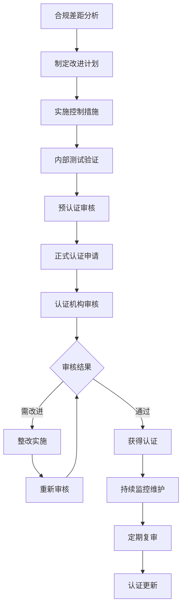

# 📋 数据库合规认证指南

> 企业级数据库合规认证体系，涵盖SOX、GDPR、ISO 27001、HIPAA等主流合规标准的实施指南和认证准备方案

## 📋 案例概述

本案例全面介绍数据库系统合规认证的要求、实施路径和最佳实践，帮助企业建立符合国际标准的数据库管理体系，确保业务合规运营。

### 🎯 学习目标

- 掌握主流合规标准的核心要求和实施要点
- 理解数据库合规认证的评估流程和准备方法
- 实施符合合规要求的技术控制措施
- 建立持续合规监控和改进机制
- 制定合规风险管理和应对策略

### ⏱️ 学习时长

- **理论学习**: 4小时
- **实践操作**: 6小时
- **总计**: 10小时

---

## 📚 合规标准体系

### 主流合规框架对比

```
┌─────────────────────────────────────────────────────────────────┐
│                        合规标准对比                             │
├───────────┬───────────┬───────────┬───────────┬───────────────┤
│ 标准名称  │ 适用范围  │ 核心要求  │ 认证周期  │ 主要关注点    │
├───────────┼───────────┼───────────┼───────────┼───────────────┤
│ SOX       │ 上市公司  │ 财务控制  │ 年度      │ 内部控制      │
│ GDPR      │ 欧盟数据  │ 数据保护  │ 持续      │ 隐私保护      │
│ ISO27001  │ 信息安    │ 信息安    │ 3年       │ 安全管理      │
│ HIPAA     │ 医疗机构  │ 健康信息  │ 2年       │ 医疗数据      │
│ PCI-DSS   │ 支付行业  │ 卡数据    │ 年度      │ 支付安全      │
│ SOC2      │ 云服务    │ 安全运营  │ 1-3年     │ 服务安全      │
└───────────┴───────────┴───────────┴───────────┴───────────────┘
```

### 合规成熟度模型

```
Level 1: 基础合规
├── 建立基本安全控制
├── 实施访问控制
└── 部署基础审计

Level 2: 规范合规
├── 完善管理制度
├── 实施风险评估
└── 建立监控机制

Level 3: 优化合规
├── 持续改进流程
├── 实施自动化监控
└── 建立预警机制

Level 4: 卓越合规
├── 预测性风险管理
├── 智能化合规管理
└── 主动合规优化
```

---

## 📋 SOX合规实施指南

### SOX核心要求解读

#### 财务报告内部控制
```sql
-- SOX 404条款要求的控制措施

-- 用户访问控制
CREATE TABLE sox_user_access_log (
    log_id BIGINT AUTO_INCREMENT PRIMARY KEY,
    user_id VARCHAR(50) NOT NULL,
    access_time TIMESTAMP DEFAULT CURRENT_TIMESTAMP,
    access_type ENUM('READ', 'WRITE', 'ADMIN') NOT NULL,
    table_name VARCHAR(100) NOT NULL,
    record_id VARCHAR(100),
    session_id VARCHAR(100),
    ip_address VARCHAR(45),
    approval_required BOOLEAN DEFAULT FALSE,
    approved_by VARCHAR(50),
    approval_time TIMESTAMP NULL
);

-- 关键财务数据变更日志
CREATE TABLE financial_data_audit (
    audit_id BIGINT AUTO_INCREMENT PRIMARY KEY,
    table_name VARCHAR(100) NOT NULL,
    record_id VARCHAR(100) NOT NULL,
    field_name VARCHAR(100) NOT NULL,
    old_value TEXT,
    new_value TEXT,
    changed_by VARCHAR(50) NOT NULL,
    change_time TIMESTAMP DEFAULT CURRENT_TIMESTAMP,
    change_reason VARCHAR(500),
    approval_status ENUM('PENDING', 'APPROVED', 'REJECTED') DEFAULT 'PENDING',
    approved_by VARCHAR(50),
    approval_time TIMESTAMP NULL
);

-- 权限变更审批流程
DELIMITER //
CREATE PROCEDURE request_financial_access(
    IN p_user_id VARCHAR(50),
    IN p_access_level VARCHAR(20),
    IN p_justification TEXT
)
BEGIN
    DECLARE v_request_id BIGINT;
    
    INSERT INTO access_requests (
        user_id, access_level, justification, 
        request_time, status
    ) VALUES (
        p_user_id, p_access_level, p_justification,
        NOW(), 'PENDING'
    );
    
    SET v_request_id = LAST_INSERT_ID();
    
    -- 通知审批人
    INSERT INTO notifications (
        recipient, message, priority, created_time
    ) VALUES (
        'sox_compliance_officer',
        CONCAT('Access request #', v_request_id, ' from ', p_user_id),
        'HIGH',
        NOW()
    );
    
    SELECT v_request_id as request_id;
END //
DELIMITER ;
```

#### 关键控制点实施
```sql
-- 职责分离控制
CREATE VIEW sox_segregation_of_duties AS
SELECT 
    u1.user_id as user_with_financial_access,
    u1.role as financial_role,
    u2.user_id as user_with_it_access,
    u2.role as it_role,
    CASE 
        WHEN u1.role IN ('FINANCE_ADMIN', 'ACCOUNTANT') 
             AND u2.role IN ('DBA', 'SYSTEM_ADMIN')
             AND u1.user_id = u2.user_id 
        THEN 'VIOLATION'
        ELSE 'COMPLIANT'
    END as segregation_status
FROM user_roles u1
JOIN user_roles u2 ON u1.user_id = u2.user_id;

-- 变更管理控制
CREATE TABLE change_management_log (
    change_id BIGINT AUTO_INCREMENT PRIMARY KEY,
    change_type ENUM('DATA', 'CONFIGURATION', 'ACCESS') NOT NULL,
    affected_system VARCHAR(100) NOT NULL,
    change_description TEXT NOT NULL,
    requested_by VARCHAR(50) NOT NULL,
    approval_required BOOLEAN DEFAULT TRUE,
    approved_by VARCHAR(50),
    approval_time TIMESTAMP NULL,
    implementation_time TIMESTAMP NULL,
    rollback_plan TEXT,
    post_implementation_review TEXT,
    compliance_review_status ENUM('PENDING', 'PASS', 'FAIL') DEFAULT 'PENDING'
);

-- 定期审查机制
CREATE EVENT monthly_sox_review
ON SCHEDULE EVERY 1 MONTH
STARTS '2024-01-01 00:00:00'
DO
BEGIN
    -- 生成月度SOX合规报告
    INSERT INTO sox_compliance_reports (
        report_month,
        review_date,
        reviewer,
        findings_summary,
        remediation_actions
    ) VALUES (
        DATE_FORMAT(NOW() - INTERVAL 1 MONTH, '%Y-%m'),
        NOW(),
        'automated_system',
        'Monthly automated SOX compliance review',
        'Review access logs, validate controls, update documentation'
    );
END;
```

### SOX合规检查清单

```markdown
# SOX合规检查清单

## 访问控制 (Section 404)
- [ ] 实施基于角色的访问控制(RBAC)
- [ ] 建立用户访问审批流程
- [ ] 定期审查用户权限分配
- [ ] 实施职责分离控制
- [ ] 记录所有访问和变更活动

## 数据完整性控制
- [ ] 实施数据变更审批流程
- [ ] 建立数据备份和恢复机制
- [ ] 部署数据校验和完整性检查
- [ ] 实施变更管理控制
- [ ] 建立数据质量监控机制

## 审计和监控
- [ ] 启用完整的审计日志记录
- [ ] 实施实时监控和告警
- [ ] 建立异常活动检测机制
- [ ] 定期审计日志分析
- [ ] 保存审计日志至少7年

## 文档和流程
- [ ] 建立内部控制文档
- [ ] 实施变更管理流程
- [ ] 建立风险评估机制
- [ ] 制定应急响应计划
- [ ] 定期合规培训
```

---

## 🛡️ GDPR合规实施指南

### GDPR核心原则落实

#### 数据保护影响评估(DPIA)
```sql
-- GDPR数据映射和分类
CREATE TABLE gdpr_data_inventory (
    inventory_id BIGINT AUTO_INCREMENT PRIMARY KEY,
    data_category VARCHAR(100) NOT NULL,
    data_type VARCHAR(100) NOT NULL,
    sensitivity_level ENUM('PUBLIC', 'INTERNAL', 'CONFIDENTIAL', 'RESTRICTED') NOT NULL,
    legal_basis VARCHAR(200),
    retention_period VARCHAR(50),
    data_processor VARCHAR(100),
    transfer_outside_eu BOOLEAN DEFAULT FALSE,
    encryption_required BOOLEAN DEFAULT TRUE,
    pseudonymization_applied BOOLEAN DEFAULT FALSE,
    last_updated TIMESTAMP DEFAULT CURRENT_TIMESTAMP ON UPDATE CURRENT_TIMESTAMP
);

-- 数据主体权利管理
CREATE TABLE data_subject_requests (
    request_id BIGINT AUTO_INCREMENT PRIMARY KEY,
    request_type ENUM('ACCESS', 'RECTIFICATION', 'ERASURE', 'PORTABILITY', 'RESTRICTION', 'OBJECTION') NOT NULL,
    data_subject_id VARCHAR(100) NOT NULL,
    request_details TEXT,
    submitted_date TIMESTAMP DEFAULT CURRENT_TIMESTAMP,
    fulfillment_deadline TIMESTAMP,
    status ENUM('SUBMITTED', 'PROCESSING', 'FULFILLED', 'REJECTED') DEFAULT 'SUBMITTED',
    fulfillment_method VARCHAR(200),
    response_sent_date TIMESTAMP NULL,
    proof_of_fulfillment TEXT
);

-- 隐私影响评估
CREATE TABLE privacy_impact_assessment (
    assessment_id BIGINT AUTO_INCREMENT PRIMARY KEY,
    system_name VARCHAR(100) NOT NULL,
    processing_purpose VARCHAR(300) NOT NULL,
    data_categories_involved TEXT,
    stakeholders_affected TEXT,
    risk_level ENUM('LOW', 'MEDIUM', 'HIGH') NOT NULL,
    mitigation_measures TEXT,
    assessment_date TIMESTAMP DEFAULT CURRENT_TIMESTAMP,
    reviewed_by VARCHAR(50),
    approval_status ENUM('DRAFT', 'REVIEW', 'APPROVED', 'REJECTED') DEFAULT 'DRAFT'
);
```

#### 技术和组织措施
```sql
-- 数据加密和保护
CREATE TABLE encryption_controls (
    control_id BIGINT AUTO_INCREMENT PRIMARY KEY,
    data_type VARCHAR(100) NOT NULL,
    encryption_method VARCHAR(50) NOT NULL,
    key_management_system VARCHAR(100),
    implementation_status ENUM('PLANNED', 'IMPLEMENTED', 'TESTED') NOT NULL,
    last_reviewed TIMESTAMP DEFAULT CURRENT_TIMESTAMP,
    compliance_notes TEXT
);

-- 数据处理协议
CREATE TABLE data_processing_agreements (
    agreement_id BIGINT AUTO_INCREMENT PRIMARY KEY,
    processor_name VARCHAR(100) NOT NULL,
    processing_purposes TEXT NOT NULL,
    data_categories TEXT NOT NULL,
    security_measures TEXT NOT NULL,
    subprocessing_allowed BOOLEAN DEFAULT FALSE,
    duration_of_processing VARCHAR(100),
    signed_date TIMESTAMP,
    renewal_date TIMESTAMP,
    termination_clause TEXT
);

-- 违规通知机制
DELIMITER //
CREATE PROCEDURE report_data_breach(
    IN p_breach_type VARCHAR(100),
    IN p_affected_records INT,
    IN p_discovered_time TIMESTAMP,
    IN p_description TEXT
)
BEGIN
    DECLARE v_breach_id BIGINT;
    
    INSERT INTO data_breaches (
        breach_type, affected_records, discovered_time, 
        description, reporting_deadline
    ) VALUES (
        p_breach_type, p_affected_records, p_discovered_time,
        p_description, p_discovered_time + INTERVAL 72 HOUR
    );
    
    SET v_breach_id = LAST_INSERT_ID();
    
    -- 立即通知监管机构（如需要）
    IF p_affected_records > 1000 THEN
        INSERT INTO regulatory_notifications (
            breach_id, notification_type, 
            sent_to, sent_time, response_required
        ) VALUES (
            v_breach_id, 'SUPRAVIZOR',
            'supraveghetor@dataprotection.ro',
            NOW(), TRUE
        );
    END IF;
    
    SELECT v_breach_id as breach_id;
END //
DELIMITER ;
```

### GDPR合规监控仪表板

```sql
-- GDPR合规状态视图
CREATE VIEW gdpr_compliance_dashboard AS
SELECT 
    'Data Inventory' as compliance_area,
    COUNT(*) as total_items,
    SUM(CASE WHEN sensitivity_level = 'RESTRICTED' THEN 1 ELSE 0 END) as high_risk_data,
    ROUND(AVG(CASE WHEN encryption_required AND encryption_implemented THEN 1 ELSE 0 END) * 100, 2) as encryption_rate
FROM gdpr_data_inventory

UNION ALL

SELECT 
    'Data Subject Requests' as compliance_area,
    COUNT(*) as total_items,
    SUM(CASE WHEN status = 'SUBMITTED' THEN 1 ELSE 0 END) as pending_requests,
    ROUND(AVG(CASE WHEN status = 'FULFILLED' AND response_sent_date <= fulfillment_deadline THEN 1 ELSE 0 END) * 100, 2) as timely_response_rate
FROM data_subject_requests

UNION ALL

SELECT 
    'Privacy Assessments' as compliance_area,
    COUNT(*) as total_items,
    SUM(CASE WHEN risk_level = 'HIGH' THEN 1 ELSE 0 END) as high_risk_assessments,
    ROUND(AVG(CASE WHEN approval_status = 'APPROVED' THEN 1 ELSE 0 END) * 100, 2) as approval_rate
FROM privacy_impact_assessment;
```

---

## 🔒 ISO 27001合规实施

### ISMS框架建立

#### 信息安全管理体系
```sql
-- 风险评估和管理
CREATE TABLE iso_risk_assessment (
    risk_id BIGINT AUTO_INCREMENT PRIMARY KEY,
    asset_name VARCHAR(100) NOT NULL,
    threat_type VARCHAR(100) NOT NULL,
    vulnerability VARCHAR(200),
    likelihood ENUM('VERY_LOW', 'LOW', 'MEDIUM', 'HIGH', 'VERY_HIGH') NOT NULL,
    impact ENUM('VERY_LOW', 'LOW', 'MEDIUM', 'HIGH', 'VERY_HIGH') NOT NULL,
    risk_level AS (CASE 
        WHEN (likelihood = 'VERY_HIGH' AND impact IN ('HIGH', 'VERY_HIGH')) 
             OR (likelihood IN ('HIGH', 'VERY_HIGH') AND impact = 'VERY_HIGH')
        THEN 'HIGH'
        WHEN likelihood IN ('MEDIUM', 'HIGH') AND impact IN ('MEDIUM', 'HIGH')
        THEN 'MEDIUM'
        ELSE 'LOW'
    END),
    treatment_plan TEXT,
    responsible_party VARCHAR(50),
    target_completion_date DATE,
    status ENUM('IDENTIFIED', 'ASSESSED', 'TREATED', 'ACCEPTED', 'CLOSED') DEFAULT 'IDENTIFIED'
);

-- 控制措施实施跟踪
CREATE TABLE iso_controls_implementation (
    control_id VARCHAR(20) PRIMARY KEY,
    control_name VARCHAR(200) NOT NULL,
    control_category VARCHAR(50) NOT NULL,
    implementation_status ENUM('NOT_STARTED', 'IN_PROGRESS', 'IMPLEMENTED', 'VERIFIED') NOT NULL,
    implementation_date DATE,
    responsible_department VARCHAR(100),
    evidence_document VARCHAR(200),
    last_review_date DATE,
    next_review_date DATE
);

-- 内部审核管理
CREATE TABLE internal_audits (
    audit_id BIGINT AUTO_INCREMENT PRIMARY KEY,
    audit_scope TEXT NOT NULL,
    audit_criteria VARCHAR(200),
    planned_date DATE NOT NULL,
    actual_date DATE,
    lead_auditor VARCHAR(50) NOT NULL,
    audit_team TEXT,
    findings TEXT,
    non_conformities INT DEFAULT 0,
    observations TEXT,
    conclusion TEXT,
    follow_up_actions TEXT,
    closure_date DATE
);
```

#### 持续改进机制
```sql
-- 纠正和预防措施
CREATE TABLE corrective_preventive_actions (
    action_id BIGINT AUTO_INCREMENT PRIMARY KEY,
    non_conformity_id BIGINT,
    action_type ENUM('CORRECTIVE', 'PREVENTIVE') NOT NULL,
    description TEXT NOT NULL,
    root_cause_analysis TEXT,
    proposed_solution TEXT,
    responsible_person VARCHAR(50) NOT NULL,
    target_completion_date DATE,
    actual_completion_date DATE,
    effectiveness_evaluation TEXT,
    status ENUM('OPEN', 'IN_PROGRESS', 'IMPLEMENTED', 'VERIFIED', 'CLOSED') DEFAULT 'OPEN'
);

-- 管理评审输入
CREATE VIEW management_review_input AS
SELECT 
    'Risk Assessment Summary' as input_type,
    CONCAT('Total risks: ', COUNT(*), ', High risks: ', 
           SUM(CASE WHEN risk_level = 'HIGH' THEN 1 ELSE 0 END)) as summary_data,
    MAX(last_updated) as last_updated
FROM iso_risk_assessment

UNION ALL

SELECT 
    'Control Implementation Status' as input_type,
    CONCAT('Implemented: ', 
           SUM(CASE WHEN implementation_status = 'IMPLEMENTED' THEN 1 ELSE 0 END),
           '/', COUNT(*)) as summary_data,
    MAX(last_review_date) as last_updated
FROM iso_controls_implementation

UNION ALL

SELECT 
    'Internal Audit Results' as input_type,
    CONCAT('Audits conducted: ', COUNT(*), 
           ', Non-conformities: ', SUM(non_conformities)) as summary_data,
    MAX(actual_date) as last_updated
FROM internal_audits
WHERE actual_date >= DATE_SUB(NOW(), INTERVAL 1 YEAR);
```

---

## 🏥 HIPAA合规实施

### 医疗信息安全控制

#### 受保护健康信息(PHI)管理
```sql
-- PHI数据分类和标记
CREATE TABLE phi_data_classification (
    classification_id BIGINT AUTO_INCREMENT PRIMARY KEY,
    data_element VARCHAR(100) NOT NULL,
    phi_category ENUM('IDENTIFIER', 'DEMOGRAPHIC', 'MEDICAL', 'PAYMENT', 'ADMINISTRATIVE') NOT NULL,
    sensitivity_level ENUM('LOW', 'MEDIUM', 'HIGH') NOT NULL,
    deidentification_required BOOLEAN DEFAULT TRUE,
    minimum_necessary BOOLEAN DEFAULT TRUE,
    business_associate_access BOOLEAN DEFAULT FALSE,
    audit_required BOOLEAN DEFAULT TRUE
);

-- 访问授权管理
CREATE TABLE hipaa_access_authorization (
    authorization_id BIGINT AUTO_INCREMENT PRIMARY KEY,
    patient_id VARCHAR(50) NOT NULL,
    authorized_entity VARCHAR(100) NOT NULL,
    purpose_of_use VARCHAR(200) NOT NULL,
    data_elements_requested TEXT NOT NULL,
    authorization_date DATE NOT NULL,
    expiration_date DATE,
    revocation_date DATE NULL,
    authorization_status ENUM('ACTIVE', 'EXPIRED', 'REVOKED') DEFAULT 'ACTIVE',
    documented_consent BOOLEAN DEFAULT FALSE
);

-- 业务伙伴协议管理
CREATE TABLE business_associate_agreements (
    agreement_id BIGINT AUTO_INCREMENT PRIMARY KEY,
    business_associate_name VARCHAR(100) NOT NULL,
    services_provided TEXT NOT NULL,
    phi_access_required TEXT NOT NULL,
    security_measures_required TEXT NOT NULL,
    breach_notification_requirements TEXT NOT NULL,
    agreement_effective_date DATE NOT NULL,
    agreement_expiration_date DATE,
    renewal_required BOOLEAN DEFAULT FALSE,
    compliance_status ENUM('COMPLIANT', 'NON_COMPLIANT', 'REVIEW_REQUIRED') DEFAULT 'COMPLIANT'
);
```

#### 安全事件响应
```sql
-- 安全事件管理
CREATE TABLE hipaa_security_incidents (
    incident_id BIGINT AUTO_INCREMENT PRIMARY KEY,
    incident_type ENUM('UNAUTHORIZED_ACCESS', 'DISCLOSURE', 'THEFT', 'LOSS', 'SYSTEM_COMPROMISE') NOT NULL,
    discovery_date TIMESTAMP NOT NULL,
    affected_individuals INT NOT NULL,
    phi_involved BOOLEAN DEFAULT TRUE,
    risk_assessment TEXT,
    containment_actions TEXT,
    notification_required BOOLEAN DEFAULT FALSE,
    notification_sent_date TIMESTAMP NULL,
    regulatory_reporting_due TIMESTAMP,
    investigation_findings TEXT,
    corrective_actions TEXT,
    incident_status ENUM('OPEN', 'INVESTIGATING', 'CONTAINED', 'RESOLVED', 'CLOSED') DEFAULT 'OPEN'
);

-- 风险分析和管理
DELIMITER //
CREATE PROCEDURE conduct_hipaa_risk_analysis()
BEGIN
    DECLARE done INT DEFAULT FALSE;
    DECLARE v_asset VARCHAR(100);
    DECLARE v_threat VARCHAR(100);
    DECLARE risk_cursor CURSOR FOR 
        SELECT DISTINCT asset_name, threat_type 
        FROM hipaa_assets ha, hipaa_threats ht;
    DECLARE CONTINUE HANDLER FOR NOT FOUND SET done = TRUE;
    
    OPEN risk_cursor;
    
    read_loop: LOOP
        FETCH risk_cursor INTO v_asset, v_threat;
        IF done THEN
            LEAVE read_loop;
        END IF;
        
        INSERT INTO hipaa_risk_analysis (
            asset_name, threat_type, likelihood, impact,
            risk_level, mitigation_strategy, review_date
        ) VALUES (
            v_asset, v_threat, 'MEDIUM', 'HIGH',
            'HIGH', 'Implement additional access controls and monitoring',
            DATE_ADD(CURDATE(), INTERVAL 1 YEAR)
        );
    END LOOP;
    
    CLOSE risk_cursor;
END //
DELIMITER ;
```

---

## 💳 PCI-DSS合规实施

### 支付卡数据安全

#### 卡数据保护控制
```sql
-- 卡数据存储和处理
CREATE TABLE pci_card_data_protection (
    protection_id BIGINT AUTO_INCREMENT PRIMARY KEY,
    data_element VARCHAR(100) NOT NULL,
    storage_permitted BOOLEAN DEFAULT FALSE,
    transmission_encrypted BOOLEAN DEFAULT TRUE,
    masking_required BOOLEAN DEFAULT TRUE,
    truncation_required BOOLEAN DEFAULT FALSE,
    secure_deletion_required BOOLEAN DEFAULT TRUE,
    scope_of_protection VARCHAR(200)
);

-- 访问控制和监控
CREATE TABLE pci_access_control (
    control_id BIGINT AUTO_INCREMENT PRIMARY KEY,
    system_component VARCHAR(100) NOT NULL,
    access_type ENUM('ADMINISTRATIVE', 'APPLICATION', 'DATABASE', 'NETWORK') NOT NULL,
    authentication_required BOOLEAN DEFAULT TRUE,
    multi_factor_auth_required BOOLEAN DEFAULT TRUE,
    session_logging_required BOOLEAN DEFAULT TRUE,
    idle_timeout_minutes INT DEFAULT 15,
    password_complexity_required BOOLEAN DEFAULT TRUE,
    password_change_interval_days INT DEFAULT 90
);

-- 网络安全控制
CREATE TABLE pci_network_security (
    security_id BIGINT AUTO_INCREMENT PRIMARY KEY,
    network_segment VARCHAR(100) NOT NULL,
    firewall_required BOOLEAN DEFAULT TRUE,
    intrusion_detection_required BOOLEAN DEFAULT TRUE,
    vulnerability_scanning_frequency ENUM('DAILY', 'WEEKLY', 'MONTHLY') DEFAULT 'WEEKLY',
    penetration_testing_required BOOLEAN DEFAULT TRUE,
    segmentation_required BOOLEAN DEFAULT TRUE,
    wireless_security_required BOOLEAN DEFAULT TRUE
);
```

#### 合规监控和报告
```sql
-- PCI合规状态监控
CREATE VIEW pci_compliance_status AS
SELECT 
    'Data Protection Controls' as control_area,
    COUNT(*) as total_controls,
    SUM(CASE WHEN storage_permitted = FALSE THEN 1 ELSE 0 END) as compliant_controls,
    ROUND(AVG(CASE WHEN storage_permitted = FALSE THEN 1 ELSE 0 END) * 100, 2) as compliance_percentage
FROM pci_card_data_protection

UNION ALL

SELECT 
    'Access Control Implementation' as control_area,
    COUNT(*) as total_controls,
    SUM(CASE WHEN authentication_required AND multi_factor_auth_required THEN 1 ELSE 0 END) as compliant_controls,
    ROUND(AVG(CASE WHEN authentication_required AND multi_factor_auth_required THEN 1 ELSE 0 END) * 100, 2) as compliance_percentage
FROM pci_access_control

UNION ALL

SELECT 
    'Network Security Measures' as control_area,
    COUNT(*) as total_controls,
    SUM(CASE WHEN firewall_required AND intrusion_detection_required THEN 1 ELSE 0 END) as compliant_controls,
    ROUND(AVG(CASE WHEN firewall_required AND intrusion_detection_required THEN 1 ELSE 0 END) * 100, 2) as compliance_percentage
FROM pci_network_security;
```

---

## 📊 合规认证准备流程

### 认证准备路线图



### 合规成熟度评估工具

```sql
-- 合规成熟度评分系统
CREATE TABLE compliance_maturity_assessment (
    assessment_id BIGINT AUTO_INCREMENT PRIMARY KEY,
    compliance_standard VARCHAR(50) NOT NULL,
    control_domain VARCHAR(100) NOT NULL,
    maturity_level ENUM('LEVEL_1', 'LEVEL_2', 'LEVEL_3', 'LEVEL_4') NOT NULL,
    assessment_date DATE NOT NULL,
    assessor VARCHAR(50) NOT NULL,
    evidence_provided TEXT,
    score_achieved DECIMAL(3,2),
    target_score DECIMAL(3,2),
    improvement_needed TEXT,
    next_assessment_date DATE
);

-- 成熟度评分计算
DELIMITER //
CREATE FUNCTION calculate_compliance_score(
    p_implemented_controls INT,
    p_total_controls INT,
    p_evidence_quality DECIMAL(3,2)
) RETURNS DECIMAL(3,2)
READS SQL DATA
DETERMINISTIC
BEGIN
    DECLARE v_implementation_rate DECIMAL(3,2);
    DECLARE v_final_score DECIMAL(3,2);
    
    SET v_implementation_rate = p_implemented_controls / p_total_controls;
    SET v_final_score = (v_implementation_rate * 0.7) + (p_evidence_quality * 0.3);
    
    RETURN v_final_score;
END //
DELIMITER ;
```

---

## 📋 合规认证检查清单

### 通用认证准备清单

```markdown
# 数据库合规认证准备检查清单

## 管理体系建立
- [ ] 制定合规政策和程序
- [ ] 建立合规组织架构
- [ ] 明确合规责任分工
- [ ] 实施合规培训计划
- [ ] 建立合规沟通机制

## 技术控制实施
- [ ] 部署访问控制机制
- [ ] 实施数据加密保护
- [ ] 建立审计日志系统
- [ ] 配置安全监控工具
- [ ] 实施备份恢复机制

## 风险管理
- [ ] 开展风险评估
- [ ] 制定风险处置计划
- [ ] 实施风险缓解措施
- [ ] 建立风险监控机制
- [ ] 定期风险评审更新

## 文档管理
- [ ] 编制合规手册
- [ ] 建立程序文件体系
- [ ] 维护记录管理系统
- [ ] 实施文档控制程序
- [ ] 建立文档分发机制

## 持续改进
- [ ] 建立内部审核机制
- [ ] 实施管理评审制度
- [ ] 建立纠正预防措施
- [ ] 实施持续改进计划
- [ ] 建立绩效测量体系

## 认证准备
- [ ] 选择合适的认证机构
- [ ] 准备认证申请材料
- [ ] 实施预认证自查
- [ ] 准备现场审核
- [ ] 制定不符合项整改计划
```

---

## 🎯 合规实施最佳实践

### 关键成功因素

1. **高层管理承诺**
   - 获得管理层对合规项目的全力支持
   - 确保充足的资源配置
   - 建立合规文化建设

2. **跨部门协作**
   - 建立IT、法务、业务等部门协作机制
   - 明确各部门合规职责
   - 建立定期沟通协调机制

3. **持续监控改进**
   - 实施主动式合规监控
   - 建立预警和响应机制
   - 定期评估和优化控制措施

4. **技术工具支撑**
   - 部署自动化合规管理工具
   - 实施智能风险分析系统
   - 建立集中化监控平台

### 常见挑战和解决方案

```markdown
## 实施挑战及对策

### 挑战1: 资源投入不足
**解决方案**:
- 制定分阶段实施计划
- 优先处理高风险领域
- 利用现有工具和流程
- 寻求外部专业支持

### 挑战2: 员工配合度低
**解决方案**:
- 加强合规意识培训
- 建立激励约束机制
- 简化合规操作流程
- 提供必要的技术支持

### 挑战3: 技术复杂性高
**解决方案**:
- 采用成熟的合规解决方案
- 分步骤技术实施
- 建立专业技术团队
- 定期技术评估更新

### 挑战4: 持续维护困难
**解决方案**:
- 建立自动化监控机制
- 实施定期评审制度
- 建立知识管理体系
- 培养内部合规专家
```

---