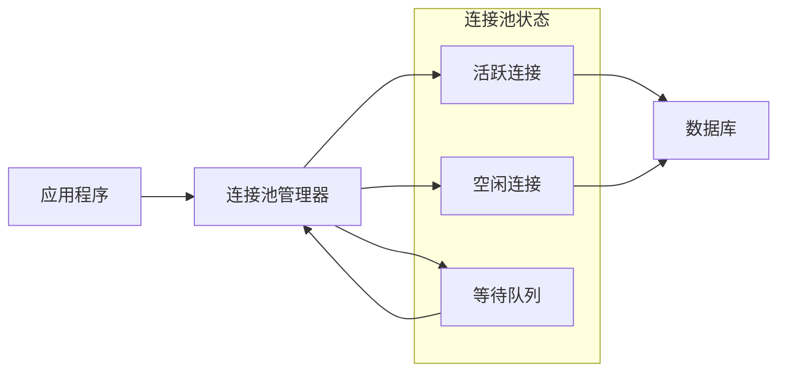

# 数据库连接池优化完整指南

## 🎯 概述

数据库连接池是现代应用架构中的关键组件，通过复用数据库连接来减少连接建立开销，提升系统性能和稳定性。本指南提供从基础原理到高级优化的完整连接池优化方案。

## 📋 目录

1. [连接池基础理论](#1-连接池基础理论)
2. [主流连接池对比](#2-主流连接池对比)
3. [MySQL连接池优化](#3-mysql连接池优化)
4. [PostgreSQL连接池配置](#4-postgresql连接池配置)
5. [连接池监控诊断](#5-连接池监控诊断)
6. [性能调优实践](#6-性能调优实践)

---

## 1. 连接池基础理论

### 1.1 连接池核心概念

#### 连接池工作原理


#### 连接池关键参数
```yaml
connection_pool_parameters:
  initial_size:
    description: "初始连接数"
    typical_value: "10-20"
    impact: "启动时预创建连接数"
  
  min_idle:
    description: "最小空闲连接数"
    typical_value: "5-10"
    impact: "保证基本服务能力"
  
  max_active:
    description: "最大活跃连接数"
    typical_value: "50-200"
    impact: "并发处理能力上限"
  
  max_wait:
    description: "获取连接最大等待时间"
    typical_value: "3000-10000ms"
    impact: "请求排队等待超时"
  
  validation_query:
    description: "连接有效性检测SQL"
    typical_value: "SELECT 1"
    impact: "确保连接可用性"
  
  test_while_idle:
    description: "空闲时检测连接"
    typical_value: "true"
    impact: "及时发现失效连接"
```

### 1.2 连接池优化原理

#### 性能影响因素分析
```python
# 连接池性能分析模型
class ConnectionPoolAnalyzer:
    def __init__(self):
        self.metrics = {}
    
    def analyze_connection_overhead(self, connection_time_ms):
        """分析连接开销"""
        overhead_analysis = {
            'tcp_handshake': connection_time_ms * 0.3,      # TCP握手占30%
            'ssl_negotiation': connection_time_ms * 0.2,    # SSL协商占20%
            'authentication': connection_time_ms * 0.25,    # 认证占25%
            'session_setup': connection_time_ms * 0.15,     # 会话建立占15%
            'other_overhead': connection_time_ms * 0.1      # 其他开销占10%
        }
        return overhead_analysis
    
    def calculate_pool_efficiency(self, pool_config, workload_profile):
        """计算连接池效率"""
        efficiency_metrics = {
            'connection_reuse_rate': self.calculate_reuse_rate(pool_config, workload_profile),
            'average_wait_time': self.calculate_average_wait(pool_config),
            'pool_utilization': self.calculate_utilization(pool_config, workload_profile),
            'resource_waste': self.calculate_waste(pool_config, workload_profile)
        }
        return efficiency_metrics
    
    def calculate_reuse_rate(self, config, workload):
        """计算连接复用率"""
        total_requests = workload['total_requests']
        connection_creations = min(
            total_requests, 
            config['max_active'] * workload['request_duration'] / config['connection_lifetime']
        )
        return (total_requests - connection_creations) / total_requests * 100
    
    def sizing_recommendation(self, current_metrics):
        """连接池大小建议"""
        recommendations = {}
        
        # 基于并发请求数计算
        concurrent_requests = current_metrics['peak_concurrent_requests']
        recommendations['min_pool_size'] = max(5, int(concurrent_requests * 0.7))
        recommendations['max_pool_size'] = max(20, int(concurrent_requests * 1.3))
        
        # 基于响应时间优化
        current_response_time = current_metrics['avg_response_time']
        if current_response_time > 100:  # 响应时间超过100ms
            recommendations['increase_pool'] = True
            recommendations['recommended_increase'] = "20-30%"
        
        return recommendations
```

## 2. 主流连接池对比

### 2.1 连接池选型指南

#### 各类型连接池特性对比
```yaml
connection_pool_comparison:
  hikari_cp:
    language: "Java"
    performance: "⭐⭐⭐⭐⭐"
    features: ["零侵入", "最小延迟", "生产就绪"]
    configuration_complexity: "低"
    monitoring: "内置丰富指标"
    use_case: "高性能Java应用"
  
  druid:
    language: "Java"
    performance: "⭐⭐⭐⭐"
    features: ["监控统计", "SQL防火墙", "配置加密"]
    configuration_complexity: "中"
    monitoring: "全方位监控"
    use_case: "企业级Java应用"
  
  c3p0:
    language: "Java"
    performance: "⭐⭐⭐"
    features: ["成熟稳定", "配置灵活"]
    configuration_complexity: "高"
    monitoring: "基础监控"
    use_case: "传统Java应用"
  
  pg_bouncer:
    language: "PostgreSQL专用"
    performance: "⭐⭐⭐⭐⭐"
    features: ["轻量级", "连接复用", "负载均衡"]
    configuration_complexity: "中"
    monitoring: "基础监控"
    use_case: "PostgreSQL高并发场景"
  
  proxool:
    language: "Java"
    performance: "⭐⭐⭐"
    features: ["透明代理", "连接监控"]
    configuration_complexity: "中"
    monitoring: "连接级监控"
    use_case: "需要连接代理的场景"
```

### 2.2 连接池配置模板

#### HikariCP配置示例
```java
// HikariCP最优配置
@Configuration
public class DatabaseConfig {
    
    @Bean
    public DataSource dataSource() {
        HikariConfig config = new HikariConfig();
        
        // 基础配置
        config.setJdbcUrl("jdbc:mysql://localhost:3306/mydb");
        config.setUsername("username");
        config.setPassword("password");
        config.setDriverClassName("com.mysql.cj.jdbc.Driver");
        
        // 连接池大小配置
        config.setMaximumPoolSize(50);           // 最大连接数
        config.setMinimumIdle(10);               // 最小空闲连接
        config.setConnectionTimeout(30000);      // 连接超时30秒
        config.setIdleTimeout(600000);           // 空闲超时10分钟
        config.setMaxLifetime(1800000);          // 连接最大生存时间30分钟
        
        // 性能优化配置
        config.setLeakDetectionThreshold(60000); // 连接泄露检测60秒
        config.setValidationTimeout(5000);       // 验证超时5秒
        config.setInitializationFailTimeout(1);  // 初始化失败立即重试
        
        // 连接测试配置
        config.setConnectionTestQuery("SELECT 1");
        config.setTestWhileIdle(true);
        config.setTestOnBorrow(false);
        config.setTestOnReturn(false);
        
        return new HikariDataSource(config);
    }
}
```

#### Druid配置示例
```java
// Druid连接池配置
@Configuration
public class DruidConfig {
    
    @Bean
    @ConfigurationProperties(prefix = "spring.datasource.druid")
    public DataSource dataSource() {
        DruidDataSource datasource = new DruidDataSource();
        
        // 基础配置
        datasource.setUrl("jdbc:mysql://localhost:3306/mydb");
        datasource.setUsername("username");
        datasource.setPassword("password");
        datasource.setDriverClassName("com.mysql.cj.jdbc.Driver");
        
        // 连接池配置
        datasource.setInitialSize(10);           // 初始连接数
        datasource.setMinIdle(10);               // 最小空闲连接
        datasource.setMaxActive(100);            // 最大活跃连接
        datasource.setMaxWait(60000);            // 最大等待时间
        
        // 连接有效性检测
        datasource.setTimeBetweenEvictionRunsMillis(60000);
        datasource.setMinEvictableIdleTimeMillis(300000);
        datasource.setValidationQuery("SELECT 1");
        datasource.setTestWhileIdle(true);
        datasource.setTestOnBorrow(false);
        datasource.setTestOnReturn(false);
        
        // 监控配置
        datasource.setFilters("stat,wall,log4j2");
        datasource.setUseGlobalDataSourceStat(true);
        
        return datasource;
    }
}
```

## 3. MySQL连接池优化

### 3.1 MySQL特定优化配置

#### MySQL连接参数优化
```ini
# MySQL服务器端连接优化
[mysqld]
# 连接相关参数
max_connections = 1000                    # 最大连接数
max_connect_errors = 100000               # 最大连接错误数
connect_timeout = 10                      # 连接超时时间
interactive_timeout = 28800               # 交互式连接超时
wait_timeout = 28800                      # 非交互式连接超时

# 缓冲区优化
net_buffer_length = 16384                 # 网络缓冲区大小
max_allowed_packet = 1073741824           # 最大允许包大小1GB

# 线程缓存
thread_cache_size = 100                   # 线程缓存大小
thread_handling = pool-of-threads         # 线程处理模式
```

#### 应用端MySQL连接池配置
```python
# Python MySQL连接池优化
import pymysql
from dbutils.pooled_db import PooledDB

class MySQLConnectionPool:
    def __init__(self, **kwargs):
        self.pool = PooledDB(
            creator=pymysql,
            maxconnections=50,           # 最大连接数
            mincached=10,                # 最小缓存连接数
            maxcached=20,                # 最大缓存连接数
            maxshared=20,                # 最大共享连接数
            blocking=True,               # 连接池满时是否阻塞
            maxusage=None,               # 连接最大使用次数
            setsession=[],               # 开始会话前执行的命令
            ping=0,                      # ping MySQL服务端检查连接
            host=kwargs.get('host', 'localhost'),
            port=kwargs.get('port', 3306),
            user=kwargs.get('user'),
            password=kwargs.get('password'),
            database=kwargs.get('database'),
            charset='utf8mb4',
            autocommit=True
        )
    
    def get_connection(self):
        """获取数据库连接"""
        return self.pool.connection()
    
    def execute_query(self, sql, params=None):
        """执行查询"""
        conn = self.get_connection()
        try:
            with conn.cursor() as cursor:
                cursor.execute(sql, params)
                return cursor.fetchall()
        finally:
            conn.close()
```

### 3.2 连接池监控脚本

#### MySQL连接池状态监控
```bash
#!/bin/bash
# MySQL连接池监控脚本

monitor_mysql_connections() {
    echo "=== MySQL连接池状态监控 ==="
    
    # 获取MySQL连接统计
    mysql -e "
        SHOW STATUS LIKE 'Threads%';
        SHOW STATUS LIKE 'Connections';
        SHOW STATUS LIKE 'Max_used_connections';
        SHOW VARIABLES LIKE 'max_connections';
    "
    
    # 分析连接使用率
    current_connections=$(mysql -e "SHOW STATUS LIKE 'Threads_connected';" | tail -1 | awk '{print $2}')
    max_connections=$(mysql -e "SHOW VARIABLES LIKE 'max_connections';" | tail -1 | awk '{print $2}')
    utilization=$(echo "scale=2; $current_connections * 100 / $max_connections" | bc)
    
    echo "连接使用率: ${utilization}%"
    
    # 检查连接等待情况
    aborted_connects=$(mysql -e "SHOW STATUS LIKE 'Aborted_connects';" | tail -1 | awk '{print $2}')
    connection_errors=$(mysql -e "SHOW STATUS LIKE 'Connection_errors%';" | grep -v "Connection_errors_internal" | awk '{sum+=$2} END {print sum}')
    
    echo "异常连接数: $aborted_connects"
    echo "连接错误数: $connection_errors"
    
    # 生成优化建议
    if (( $(echo "$utilization > 80" | bc -l) )); then
        echo "⚠️  连接使用率过高，建议增加max_connections"
    fi
    
    if [ "$aborted_connects" -gt 100 ]; then
        echo "⚠️  异常连接较多，检查网络和认证配置"
    fi
}

# 持续监控
while true; do
    monitor_mysql_connections
    echo "----------------------------------------"
    sleep 300  # 5分钟监控一次
done
```

## 4. PostgreSQL连接池配置

### 4.1 PostgreSQL连接优化

#### PgBouncer配置优化
```ini
# pgbouncer.ini 配置文件
[databases]
mydb = host=localhost port=5432 dbname=mydb

[pgbouncer]
# 连接池配置
pool_mode = transaction              # 连接池模式：session/transaction/statement
default_pool_size = 50               # 每个数据库默认连接池大小
min_pool_size = 10                   # 最小连接池大小
reserve_pool_size = 10               # 保留连接池大小
reserve_pool_timeout = 5             # 保留池超时时间

# 连接限制
max_client_conn = 500                # 最大客户端连接数
default_max_db_connections = 100     # 每个数据库最大连接数

# 超时配置
server_reset_query = DISCARD ALL     # 服务端连接重置查询
server_check_delay = 30              # 服务端检查延迟
server_lifetime = 3600               # 服务端连接生命周期
server_idle_timeout = 600            # 服务端空闲超时

# 客户端配置
client_login_timeout = 60            # 客户端登录超时
client_connection_check_interval = 30 # 客户端连接检查间隔

# 日志配置
log_connections = 1                  # 记录连接日志
log_disconnections = 1               # 记录断开连接日志
log_pooler_errors = 1                # 记录池错误日志
```

#### 应用端PostgreSQL连接池
```python
# Python PostgreSQL连接池
import psycopg2
from psycopg2 import pool

class PostgreSQLConnectionPool:
    def __init__(self, **kwargs):
        self.connection_pool = psycopg2.pool.ThreadedConnectionPool(
            minconn=10,                  # 最小连接数
            maxconn=100,                 # 最大连接数
            host=kwargs.get('host', 'localhost'),
            port=kwargs.get('port', 5432),
            database=kwargs.get('database'),
            user=kwargs.get('user'),
            password=kwargs.get('password'),
            connect_timeout=10,          # 连接超时
            keepalives=1,                # 启用keepalive
            keepalives_idle=30,          # keepalive空闲时间
            keepalives_interval=10,      # keepalive间隔
            keepalives_count=3           # keepalive重试次数
        )
    
    def get_connection(self):
        """获取连接"""
        return self.connection_pool.getconn()
    
    def put_connection(self, conn):
        """归还连接"""
        self.connection_pool.putconn(conn)
    
    def close_all_connections(self):
        """关闭所有连接"""
        self.connection_pool.closeall()
```

### 4.2 PostgreSQL特定优化

#### 连接池性能调优
```sql
-- PostgreSQL连接池相关配置
-- 在postgresql.conf中调整
ALTER SYSTEM SET max_connections = 200;              -- 最大连接数
ALTER SYSTEM SET shared_buffers = '2GB';             -- 共享缓冲区
ALTER SYSTEM SET work_mem = '64MB';                  -- 工作内存
ALTER SYSTEM SET maintenance_work_mem = '512MB';     -- 维护工作内存

-- 重载配置
SELECT pg_reload_conf();

-- 监控连接池性能
SELECT 
    datname,
    numbackends as current_connections,
    xact_commit,
    xact_rollback,
    blks_read,
    blks_hit,
    round(blks_hit::float/(blks_hit+blks_read)*100, 2) as buffer_hit_ratio
FROM pg_stat_database 
WHERE datname = current_database();
```

## 5. 连接池监控诊断

### 5.1 监控指标体系

#### 核心监控指标
```python
# 连接池监控指标收集
class ConnectionPoolMonitor:
    def __init__(self, pool_manager):
        self.pool = pool_manager
        self.metrics_history = []
    
    def collect_pool_metrics(self):
        """收集连接池指标"""
        metrics = {
            'active_connections': self.pool.get_active_connections(),
            'idle_connections': self.pool.get_idle_connections(),
            'waiting_requests': self.pool.get_waiting_requests(),
            'total_connections': self.pool.get_total_connections(),
            'connection_creation_rate': self.pool.get_creation_rate(),
            'connection_reuse_count': self.pool.get_reuse_count(),
            'average_wait_time': self.pool.get_average_wait_time(),
            'max_wait_time': self.pool.get_max_wait_time()
        }
        
        # 计算派生指标
        metrics['pool_utilization'] = (
            metrics['active_connections'] / metrics['total_connections'] * 100
        ) if metrics['total_connections'] > 0 else 0
        
        metrics['wait_ratio'] = (
            metrics['waiting_requests'] / (metrics['active_connections'] + 1) * 100
        )
        
        self.metrics_history.append(metrics)
        return metrics
    
    def detect_anomalies(self, current_metrics):
        """检测异常情况"""
        anomalies = []
        
        # 连接池耗尽检测
        if current_metrics['pool_utilization'] > 90:
            anomalies.append({
                'type': 'pool_exhaustion',
                'severity': 'critical',
                'message': '连接池使用率过高',
                'recommendation': '增加最大连接数或优化查询'
            })
        
        # 等待队列积压检测
        if current_metrics['waiting_requests'] > current_metrics['total_connections']:
            anomalies.append({
                'type': 'queue_backlog',
                'severity': 'warning',
                'message': '等待请求堆积',
                'recommendation': '检查慢查询或增加连接数'
            })
        
        # 连接泄露检测
        if self.detect_connection_leaks():
            anomalies.append({
                'type': 'connection_leak',
                'severity': 'critical',
                'message': '检测到连接泄露',
                'recommendation': '检查连接关闭逻辑'
            })
        
        return anomalies
    
    def generate_health_report(self):
        """生成健康报告"""
        recent_metrics = self.metrics_history[-10:]  # 最近10次数据
        current = recent_metrics[-1]
        
        report = {
            'timestamp': time.time(),
            'overall_health': self.calculate_overall_health(current),
            'metrics_trend': self.analyze_trends(recent_metrics),
            'anomalies': self.detect_anomalies(current),
            'recommendations': self.generate_recommendations(current)
        }
        
        return report
```

### 5.2 故障诊断工具

#### 连接池诊断脚本
```bash
#!/bin/bash
# 连接池诊断工具

diagnose_connection_pool() {
    echo "=== 连接池诊断报告 ==="
    echo "诊断时间: $(date)"
    echo ""
    
    # 1. 基础连接状态检查
    echo "1. 基础连接状态:"
    netstat -an | grep :3306 | grep ESTABLISHED | wc -l
    netstat -an | grep :5432 | grep ESTABLISHED | wc -l
    
    # 2. 数据库连接统计
    echo "2. 数据库连接统计:"
    mysql -e "SHOW PROCESSLIST;" | wc -l
    psql -c "SELECT count(*) FROM pg_stat_activity;" 2>/dev/null
    
    # 3. 连接池配置检查
    echo "3. 连接池配置检查:"
    jstack_pid=$(pgrep -f "your-application")
    if [ ! -z "$jstack_pid" ]; then
        jstack $jstack_pid | grep -i "pool\|connection" | head -20
    fi
    
    # 4. 性能指标收集
    echo "4. 性能指标:"
    echo "CPU使用率: $(top -bn1 | grep "Cpu(s)" | awk '{print $2}' | cut -d'%' -f1)%"
    echo "内存使用: $(free -h | grep Mem | awk '{print $3 "/" $2}')"
    
    # 5. 慢查询检查
    echo "5. 慢查询检查:"
    mysql -e "SHOW VARIABLES LIKE 'slow_query_log';"
    mysql -e "SELECT COUNT(*) as slow_queries FROM mysql.slow_log WHERE start_time > DATE_SUB(NOW(), INTERVAL 1 HOUR);" 2>/dev/null
    
    # 6. 生成诊断建议
    generate_diagnosis_recommendations
}

generate_diagnosis_recommendations() {
    echo ""
    echo "=== 诊断建议 ==="
    
    # 检查连接数是否接近上限
    current_connections=$(mysql -e "SHOW STATUS LIKE 'Threads_connected';" | tail -1 | awk '{print $2}')
    max_connections=$(mysql -e "SHOW VARIABLES LIKE 'max_connections';" | tail -1 | awk '{print $2}')
    utilization=$(echo "scale=2; $current_connections * 100 / $max_connections" | bc)
    
    if (( $(echo "$utilization > 85" | bc -l) )); then
        echo "⚠️  连接使用率过高 (${utilization}%)，建议:"
        echo "   - 增加数据库max_connections参数"
        echo "   - 优化应用连接池配置"
        echo "   - 检查是否有连接泄露"
    fi
    
    # 检查慢查询
    slow_query_count=$(mysql -e "SELECT COUNT(*) FROM mysql.slow_log WHERE start_time > DATE_SUB(NOW(), INTERVAL 1 HOUR);" 2>/dev/null || echo "0")
    if [ "$slow_query_count" -gt 10 ]; then
        echo "⚠️  发现较多慢查询 ($slow_query_count次/小时)，建议:"
        echo "   - 优化慢查询SQL"
        echo "   - 检查索引使用情况"
        echo "   - 考虑读写分离"
    fi
}

# 执行诊断
diagnose_connection_pool
```

## 6. 性能调优实践

### 6.1 调优方法论

#### 系统性调优流程
```python
# 连接池系统性调优框架
class SystematicTuning:
    def __init__(self, application_config):
        self.config = application_config
        self.baseline_metrics = {}
        self.tuning_history = []
    
    def performance_tuning_cycle(self):
        """完整的性能调优周期"""
        # 1. 建立基准
        self.establish_baseline()
        
        # 2. 识别瓶颈
        bottlenecks = self.identify_bottlenecks()
        
        # 3. 制定调优方案
        tuning_plan = self.create_tuning_plan(bottlenecks)
        
        # 4. 实施调优
        results = self.implement_tuning(tuning_plan)
        
        # 5. 验证效果
        improvement = self.validate_improvement(results)
        
        return {
            'baseline': self.baseline_metrics,
            'bottlenecks': bottlenecks,
            'tuning_plan': tuning_plan,
            'results': results,
            'improvement': improvement
        }
    
    def establish_baseline(self):
        """建立性能基准"""
        # 收集当前性能指标
        self.baseline_metrics = {
            'response_time': self.measure_response_time(),
            'throughput': self.measure_throughput(),
            'connection_utilization': self.measure_connection_utilization(),
            'error_rate': self.measure_error_rate()
        }
    
    def identify_bottlenecks(self):
        """识别性能瓶颈"""
        bottlenecks = []
        
        # 连接池瓶颈分析
        if self.baseline_metrics['connection_utilization'] > 0.8:
            bottlenecks.append({
                'type': 'connection_pool',
                'impact': 'high',
                'current_value': self.baseline_metrics['connection_utilization'],
                'recommended_action': 'increase_pool_size'
            })
        
        # 响应时间瓶颈分析
        if self.baseline_metrics['response_time'] > 100:  # 超过100ms
            bottlenecks.append({
                'type': 'response_time',
                'impact': 'medium',
                'current_value': self.baseline_metrics['response_time'],
                'recommended_action': 'optimize_queries_and_indexes'
            })
        
        return bottlenecks
    
    def create_tuning_plan(self, bottlenecks):
        """创建调优计划"""
        plan = []
        
        for bottleneck in bottlenecks:
            if bottleneck['type'] == 'connection_pool':
                plan.append({
                    'action': 'adjust_pool_parameters',
                    'parameters': {
                        'max_pool_size': self.config['max_pool_size'] * 1.3,
                        'min_idle_connections': self.config['min_idle'] * 1.2
                    },
                    'expected_improvement': '20-30% connection wait reduction'
                })
            
            elif bottleneck['type'] == 'response_time':
                plan.append({
                    'action': 'query_optimization',
                    'focus_areas': ['index_optimization', 'query_rewrite', 'connection_pool_tuning'],
                    'expected_improvement': '15-25% response_time reduction'
                })
        
        return plan
```

### 6.2 自动化调优工具

#### 智能调优系统
```python
# 智能连接池调优器
class IntelligentPoolTuner:
    def __init__(self, ml_model=None):
        self.ml_model = ml_model or self.load_tuning_model()
        self.performance_data = []
    
    def auto_tune_pool(self, current_config, workload_metrics):
        """自动调优连接池"""
        # 1. 收集当前状态
        current_state = {
            'config': current_config,
            'metrics': workload_metrics,
            'performance_history': self.performance_data[-100:]  # 最近100个数据点
        }
        
        # 2. 预测最优配置
        optimal_config = self.predict_optimal_configuration(current_state)
        
        # 3. 生成调优建议
        tuning_recommendations = self.generate_tuning_recommendations(
            current_config, 
            optimal_config
        )
        
        # 4. 安全实施调优
        implementation_plan = self.create_safe_implementation_plan(
            tuning_recommendations
        )
        
        return {
            'optimal_config': optimal_config,
            'recommendations': tuning_recommendations,
            'implementation_plan': implementation_plan
        }
    
    def predict_optimal_configuration(self, state):
        """预测最优配置"""
        # 使用机器学习模型预测
        features = self.extract_features(state)
        prediction = self.ml_model.predict([features])[0]
        
        return {
            'max_pool_size': int(prediction[0]),
            'min_idle': int(prediction[1]),
            'connection_timeout': int(prediction[2]),
            'validation_interval': int(prediction[3])
        }
    
    def online_learning(self, tuning_results):
        """在线学习调优效果"""
        # 将调优结果加入训练数据
        self.performance_data.append(tuning_results)
        
        # 定期重新训练模型
        if len(self.performance_data) % 50 == 0:
            self.retrain_model()
    
    def gradual_rollout(self, new_config):
        """渐进式配置更新"""
        current_config = self.get_current_config()
        
        # 分步骤调整配置
        adjustment_steps = [
            {'max_pool_size': int(new_config['max_pool_size'] * 0.3)},
            {'max_pool_size': int(new_config['max_pool_size'] * 0.6)},
            {'max_pool_size': new_config['max_pool_size']}
        ]
        
        for step in adjustment_steps:
            self.apply_config_change(step)
            time.sleep(300)  # 等待5分钟观察效果
            if not self.verify_stability():
                self.rollback_config()
                break
```

### 6.3 调优效果验证

#### A/B测试框架
```python
# 连接池调优A/B测试
class PoolTuningABTest:
    def __init__(self, test_duration_hours=24):
        self.test_duration = test_duration_hours * 3600
        self.control_group = []
        self.test_group = []
        self.metrics_collector = MetricsCollector()
    
    def setup_ab_test(self, baseline_config, test_config):
        """设置A/B测试"""
        test_setup = {
            'control_config': baseline_config,
            'test_config': test_config,
            'split_ratio': 0.5,  # 50/50分流
            'duration': self.test_duration,
            'metrics_to_track': [
                'response_time',
                'throughput', 
                'error_rate',
                'connection_wait_time',
                'pool_utilization'
            ]
        }
        return self.execute_test(test_setup)
    
    def execute_test(self, setup):
        """执行A/B测试"""
        start_time = time.time()
        results = {'control': [], 'test': []}
        
        while (time.time() - start_time) < setup['duration']:
            # 收集两组数据
            control_metrics = self.collect_metrics('control')
            test_metrics = self.collect_metrics('test')
            
            results['control'].append(control_metrics)
            results['test'].append(test_metrics)
            
            time.sleep(300)  # 5分钟收集一次
        
        # 分析测试结果
        analysis = self.analyze_test_results(results, setup)
        return analysis
    
    def analyze_test_results(self, results, setup):
        """分析测试结果"""
        analysis = {
            'statistical_significance': self.calculate_significance(results),
            'performance_comparison': self.compare_performance(results),
            'recommendation': self.generate_recommendation(results, setup)
        }
        
        # 计算改进幅度
        control_avg = np.mean([m['response_time'] for m in results['control']])
        test_avg = np.mean([m['response_time'] for m in results['test']])
        improvement = (control_avg - test_avg) / control_avg * 100
        
        analysis['improvement_percentage'] = improvement
        
        return analysis
```

---

## 🔍 关键要点总结

### ✅ 调优成功要素
- **合理的池大小配置**：基于实际并发需求设置连接池大小
- **完善的监控体系**：实时监控连接池状态和性能指标
- **渐进式调优策略**：小步快跑，避免激进的配置变更
- **故障应急机制**：建立连接泄露检测和自动恢复机制

### ⚠️ 常见问题提醒
- **连接池过小**：导致请求排队等待，响应时间增加
- **连接池过大**：消耗过多数据库资源，影响整体性能
- **连接泄露**：未正确关闭连接导致连接池枯竭
- **配置不当**：超时时间、验证查询等参数设置不合理

### 🎯 最佳实践建议
1. **监控先行**：先建立完善的监控体系再进行调优
2. **基准测试**：调优前后都要进行充分的性能测试
3. **渐进实施**：重要的配置变更要分步骤实施
4. **文档记录**：详细记录所有配置变更和调优过程
5. **定期回顾**：定期评估连接池配置的有效性

通过科学的连接池优化，可以显著提升应用性能，降低数据库负载，为用户提供更好的服务体验。