# 容器化数据库部署完整指南

## 🎯 概述

数据库容器化部署是现代云原生应用的重要组成部分，通过容器技术实现数据库的标准化部署、弹性伸缩和高效运维。本指南提供从Docker到Kubernetes的完整容器化数据库部署解决方案。

## 📋 目录

1. [容器化基础理论](#1-容器化基础理论)
2. [Docker数据库容器化](#2-docker数据库容器化)
3. [Kubernetes StatefulSet部署](#3-kubernetes-statefulset部署)
4. [持久化存储管理](#4-持久化存储管理)
5. [Helm Chart开发](#5-helm-chart开发)
6. [监控和运维](#6-监控和运维)

---

## 1. 容器化基础理论

### 1.1 容器化架构模式

#### 数据库容器化架构

```mermaid
graph TD
    A[应用层] --> B[服务发现]
    B --> C[负载均衡器]
    C --> D[数据库Pod1]
    C --> E[数据库Pod2]
    C --> F[数据库Pod3]
    
    D --> G[PersistentVolume1]
    E --> H[PersistentVolume2]
    F --> I[PersistentVolume3]
    
    subgraph "容器编排层"
        J[Kubernetes Master]
        K[etcd存储]
        L[调度器]
    end
    
    subgraph "存储层"
        G --> M[本地存储]
        H --> N[网络存储]
        I --> O[云存储]
    end
    
    subgraph "监控层"
        P[Prometheus]
        Q[Grafana]
        R[日志收集]
    end
    
    P --> D
    P --> E
    P --> F
    Q --> P
    R --> D
    R --> E
    R --> F
```


#### 容器化优势分析
```yaml
containerization_advantages:
  standardization:
    description: "标准化部署"
    benefits:
      - "环境一致性保证"
      - "部署流程标准化"
      - "配置管理统一"
    metrics: "部署时间减少70%"
  
  portability:
    description: "可移植性"
    benefits:
      - "跨平台运行"
      - "开发测试环境一致"
      - "CI/CD流程简化"
    metrics: "环境适配成本降低80%"
  
  resource_efficiency:
    description: "资源效率"
    benefits:
      - "资源共享优化"
      - "快速启动停止"
      - "弹性伸缩支持"
    metrics: "资源利用率提升40%"
  
  isolation_security:
    description: "隔离安全性"
    benefits:
      - "进程隔离"
      - "网络安全隔离"
      - "资源限制控制"
    metrics: "安全事件减少90%"
```

### 1.2 容器化挑战与解决方案

#### 主要挑战分析
```python
# 容器化挑战评估系统
class ContainerizationChallenges:
    def __init__(self):
        self.challenges = {
            'state_management': {
                'description': '状态管理挑战',
                'issues': [
                    '数据持久化复杂性',
                    '状态同步困难',
                    '备份恢复复杂'
                ],
                'solutions': [
                    'PersistentVolume和PersistentVolumeClaim',
                    'StatefulSet确保有序部署',
                    '定期快照和备份策略'
                ]
            },
            
            'performance_overhead': {
                'description': '性能开销',
                'issues': [
                    'I/O性能损耗',
                    '网络延迟增加',
                    'CPU内存开销'
                ],
                'solutions': [
                    '使用高性能存储类',
                    '优化容器资源配置',
                    '启用本地存储访问'
                ]
            },
            
            'operational_complexity': {
                'description': '运维复杂性',
                'issues': [
                    '监控诊断困难',
                    '故障排查复杂',
                    '版本升级风险'
                ],
                'solutions': [
                    '完善的监控告警体系',
                    '标准化运维流程',
                    '蓝绿部署策略'
                ]
            },
            
            'networking_issues': {
                'description': '网络问题',
                'issues': [
                    '服务发现复杂',
                    '网络策略配置',
                    '跨节点通信延迟'
                ],
                'solutions': [
                    'Service和Headless Service',
                    'NetworkPolicy配置',
                    '优化网络插件选择'
                ]
            }
        }
    
    def assess_containerization_feasibility(self, database_type, requirements):
        """评估容器化可行性"""
        feasibility_score = 100
        recommendations = []
        
        # 根据数据库类型调整评估
        if database_type in ['mysql', 'postgresql']:
            # 关系型数据库相对容易容器化
            feasibility_score -= 10
            recommendations.append("适合容器化部署")
        elif database_type in ['mongodb', 'redis']:
            # NoSQL数据库天然适合容器化
            feasibility_score -= 5
            recommendations.append("非常适合容器化部署")
        else:
            feasibility_score -= 20
            recommendations.append("需要特殊考虑容器化方案")
        
        # 根据要求调整评分
        if requirements.get('high_performance', False):
            feasibility_score -= 15
            recommendations.append("需要重点关注性能优化")
        
        if requirements.get('strong_consistency', False):
            feasibility_score -= 10
            recommendations.append("需要确保数据一致性")
        
        return {
            'feasibility_score': max(0, feasibility_score),
            'recommendations': recommendations,
            'risk_level': self._determine_risk_level(feasibility_score)
        }
    
    def _determine_risk_level(self, score):
        """确定风险等级"""
        if score >= 80:
            return 'low'
        elif score >= 60:
            return 'medium'
        else:
            return 'high'

# 使用示例
challenges = ContainerizationChallenges()
assessment = challenges.assess_containerization_feasibility(
    'postgresql', 
    {'high_performance': True, 'strong_consistency': True}
)
print(f"可行性评分: {assessment['feasibility_score']}")
print(f"风险等级: {assessment['risk_level']}")
print(f"建议: {assessment['recommendations']}")
```

## 2. Docker数据库容器化

### 2.1 数据库Dockerfile最佳实践

#### MySQL容器化配置
```dockerfile
# Dockerfile - MySQL生产级容器
FROM mysql:8.0.35

# 设置环境变量
ENV MYSQL_ROOT_PASSWORD=${MYSQL_ROOT_PASSWORD} \
    MYSQL_DATABASE=${MYSQL_DATABASE} \
    MYSQL_USER=${MYSQL_USER} \
    MYSQL_PASSWORD=${MYSQL_PASSWORD} \
    TZ=Asia/Shanghai

# 复制配置文件
COPY my.cnf /etc/mysql/conf.d/custom.cnf
COPY init-scripts/ /docker-entrypoint-initdb.d/

# 创建数据目录
RUN mkdir -p /var/lib/mysql \
    && chown -R mysql:mysql /var/lib/mysql \
    && chmod 755 /var/lib/mysql

# 健康检查
HEALTHCHECK --interval=30s --timeout=10s --start-period=60s --retries=3 \
    CMD mysqladmin ping -h localhost -u root -p${MYSQL_ROOT_PASSWORD} || exit 1

# 暴露端口
EXPOSE 3306

# 启动命令
CMD ["mysqld"]
```

#### PostgreSQL容器化配置
```dockerfile
# Dockerfile - PostgreSQL生产级容器
FROM postgres:15.4

# 设置环境变量
ENV POSTGRES_DB=${POSTGRES_DB} \
    POSTGRES_USER=${POSTGRES_USER} \
    POSTGRES_PASSWORD=${POSTGRES_PASSWORD} \
    PGDATA=/var/lib/postgresql/data/pgdata \
    TZ=Asia/Shanghai

# 复制配置文件
COPY postgresql.conf /etc/postgresql/postgresql.conf
COPY pg_hba.conf /etc/postgresql/pg_hba.conf

# 复制初始化脚本
COPY init-scripts/ /docker-entrypoint-initdb.d/

# 创建数据目录
RUN mkdir -p /var/lib/postgresql/data/pgdata \
    && chown -R postgres:postgres /var/lib/postgresql/data \
    && chmod 700 /var/lib/postgresql/data

# 健康检查
HEALTHCHECK --interval=30s --timeout=10s --start-period=60s --retries=3 \
    CMD pg_isready -U ${POSTGRES_USER} -d ${POSTGRES_DB} || exit 1

# 暴露端口
EXPOSE 5432

# 启动命令
CMD ["postgres", "-c", "config_file=/etc/postgresql/postgresql.conf"]
```

### 2.2 容器编排配置

#### Docker Compose配置
```yaml
# docker-compose.yml - 数据库容器编排
version: '3.8'

services:
  mysql-primary:
    image: mysql:8.0.35
    container_name: mysql-primary
    restart: unless-stopped
    environment:
      MYSQL_ROOT_PASSWORD: ${MYSQL_ROOT_PASSWORD}
      MYSQL_DATABASE: ${MYSQL_DATABASE}
      MYSQL_USER: ${MYSQL_USER}
      MYSQL_PASSWORD: ${MYSQL_PASSWORD}
    volumes:
      - mysql-data:/var/lib/mysql
      - ./config/my.cnf:/etc/mysql/conf.d/custom.cnf:ro
      - ./init-scripts:/docker-entrypoint-initdb.d:ro
    ports:
      - "3306:3306"
    networks:
      - database-network
    healthcheck:
      test: ["CMD", "mysqladmin", "ping", "-h", "localhost"]
      interval: 30s
      timeout: 10s
      retries: 3
      start_period: 60s

  mysql-replica:
    image: mysql:8.0.35
    container_name: mysql-replica
    restart: unless-stopped
    environment:
      MYSQL_ROOT_PASSWORD: ${MYSQL_ROOT_PASSWORD}
      MYSQL_DATABASE: ${MYSQL_DATABASE}
      MYSQL_USER: ${MYSQL_USER}
      MYSQL_PASSWORD: ${MYSQL_PASSWORD}
    volumes:
      - mysql-replica-data:/var/lib/mysql
    ports:
      - "3307:3306"
    networks:
      - database-network
    depends_on:
      mysql-primary:
        condition: service_healthy
    healthcheck:
      test: ["CMD", "mysqladmin", "ping", "-h", "localhost"]
      interval: 30s
      timeout: 10s
      retries: 3
      start_period: 60s

  postgres:
    image: postgres:15.4
    container_name: postgres-primary
    restart: unless-stopped
    environment:
      POSTGRES_DB: ${POSTGRES_DB}
      POSTGRES_USER: ${POSTGRES_USER}
      POSTGRES_PASSWORD: ${POSTGRES_PASSWORD}
    volumes:
      - postgres-data:/var/lib/postgresql/data
      - ./config/postgresql.conf:/etc/postgresql/postgresql.conf:ro
      - ./init-scripts:/docker-entrypoint-initdb.d:ro
    ports:
      - "5432:5432"
    networks:
      - database-network
    healthcheck:
      test: ["CMD-SHELL", "pg_isready -U ${POSTGRES_USER}"]
      interval: 30s
      timeout: 10s
      retries: 3
      start_period: 60s

  redis:
    image: redis:7.0.12
    container_name: redis-primary
    restart: unless-stopped
    command: redis-server /usr/local/etc/redis/redis.conf
    volumes:
      - redis-data:/data
      - ./config/redis.conf:/usr/local/etc/redis/redis.conf:ro
    ports:
      - "6379:6379"
    networks:
      - database-network
    healthcheck:
      test: ["CMD", "redis-cli", "ping"]
      interval: 30s
      timeout: 10s
      retries: 3
      start_period: 30s

  mongo:
    image: mongo:7.0.2
    container_name: mongo-primary
    restart: unless-stopped
    environment:
      MONGO_INITDB_ROOT_USERNAME: ${MONGO_ROOT_USER}
      MONGO_INITDB_ROOT_PASSWORD: ${MONGO_ROOT_PASSWORD}
    volumes:
      - mongo-data:/data/db
      - ./init-scripts/mongo-init.js:/docker-entrypoint-initdb.d/mongo-init.js:ro
    ports:
      - "27017:27017"
    networks:
      - database-network
    healthcheck:
      test: echo 'db.runCommand("ping").ok' | mongosh localhost:27017/test --quiet
      interval: 30s
      timeout: 10s
      retries: 3
      start_period: 60s

volumes:
  mysql-data:
    driver: local
  mysql-replica-data:
    driver: local
  postgres-data:
    driver: local
  redis-data:
    driver: local
  mongo-data:
    driver: local

networks:
  database-network:
    driver: bridge
    ipam:
      config:
        - subnet: 172.20.0.0/16
```

## 3. Kubernetes StatefulSet部署

### 3.1 StatefulSet基础配置

#### MySQL StatefulSet配置
```yaml
# mysql-statefulset.yaml
apiVersion: apps/v1
kind: StatefulSet
metadata:
  name: mysql
  namespace: database
spec:
  serviceName: mysql
  replicas: 3
  selector:
    matchLabels:
      app: mysql
  template:
    metadata:
      labels:
        app: mysql
    spec:
      containers:
      - name: mysql
        image: mysql:8.0.35
        env:
        - name: MYSQL_ROOT_PASSWORD
          valueFrom:
            secretKeyRef:
              name: mysql-secret
              key: root-password
        - name: MYSQL_DATABASE
          value: "myapp"
        - name: MYSQL_USER
          value: "appuser"
        - name: MYSQL_PASSWORD
          valueFrom:
            secretKeyRef:
              name: mysql-secret
              key: user-password
        ports:
        - containerPort: 3306
          name: mysql
        volumeMounts:
        - name: mysql-data
          mountPath: /var/lib/mysql
        - name: mysql-config
          mountPath: /etc/mysql/conf.d
        livenessProbe:
          exec:
            command:
            - mysqladmin
            - ping
            - -h
            - localhost
            - -u
            - root
            - -p$(MYSQL_ROOT_PASSWORD)
          initialDelaySeconds: 120
          periodSeconds: 10
          timeoutSeconds: 5
        readinessProbe:
          exec:
            command:
            - mysql
            - -h
            - localhost
            - -u
            - root
            - -p$(MYSQL_ROOT_PASSWORD)
            - -e
            - SELECT 1
          initialDelaySeconds: 30
          periodSeconds: 5
          timeoutSeconds: 3
      volumes:
      - name: mysql-config
        configMap:
          name: mysql-config
  volumeClaimTemplates:
  - metadata:
      name: mysql-data
    spec:
      accessModes: ["ReadWriteOnce"]
      storageClassName: fast-ssd
      resources:
        requests:
          storage: 100Gi
---
# mysql-service.yaml
apiVersion: v1
kind: Service
metadata:
  name: mysql
  namespace: database
  labels:
    app: mysql
spec:
  ports:
  - port: 3306
    name: mysql
  clusterIP: None
  selector:
    app: mysql
---
# mysql-headless-service.yaml
apiVersion: v1
kind: Service
metadata:
  name: mysql-read
  namespace: database
  labels:
    app: mysql
spec:
  ports:
  - port: 3306
    name: mysql
  selector:
    app: mysql
```

### 3.2 高级StatefulSet配置

#### 带有初始化容器的配置
```yaml
# advanced-mysql-statefulset.yaml
apiVersion: apps/v1
kind: StatefulSet
metadata:
  name: mysql-advanced
  namespace: database
spec:
  serviceName: mysql-advanced
  replicas: 3
  selector:
    matchLabels:
      app: mysql-advanced
  template:
    metadata:
      labels:
        app: mysql-advanced
    spec:
      initContainers:
      # 初始化容器 - 权限设置
      - name: init-permissions
        image: busybox:1.35
        command:
        - sh
        - -c
        - |
          chown -R 999:999 /var/lib/mysql
          chmod 755 /var/lib/mysql
        volumeMounts:
        - name: mysql-data
          mountPath: /var/lib/mysql
        securityContext:
          runAsUser: 0
      
      # 初始化容器 - 配置检查
      - name: config-validator
        image: mysql:8.0.35
        command:
        - sh
        - -c
        - |
          echo "验证MySQL配置..."
          mysql_config_editor set --login-path=local --host=localhost --user=root --password=$MYSQL_ROOT_PASSWORD
        env:
        - name: MYSQL_ROOT_PASSWORD
          valueFrom:
            secretKeyRef:
              name: mysql-secret
              key: root-password
        volumeMounts:
        - name: mysql-config
          mountPath: /etc/mysql/conf.d
      
      containers:
      - name: mysql
        image: mysql:8.0.35
        env:
        - name: MYSQL_ROOT_PASSWORD
          valueFrom:
            secretKeyRef:
              name: mysql-secret
              key: root-password
        - name: MYSQL_DATABASE
          value: "production_db"
        - name: MYSQL_USER
          value: "appuser"
        - name: MYSQL_PASSWORD
          valueFrom:
            secretKeyRef:
              name: mysql-secret
              key: user-password
        ports:
        - containerPort: 3306
          name: mysql
        volumeMounts:
        - name: mysql-data
          mountPath: /var/lib/mysql
        - name: mysql-config
          mountPath: /etc/mysql/conf.d
        - name: mysql-logs
          mountPath: /var/log/mysql
        resources:
          requests:
            memory: "2Gi"
            cpu: "1"
          limits:
            memory: "4Gi"
            cpu: "2"
        livenessProbe:
          exec:
            command:
            - mysqladmin
            - ping
            - -h
            - localhost
            - -u
            - root
            - -p$(MYSQL_ROOT_PASSWORD)
          initialDelaySeconds: 180
          periodSeconds: 10
          timeoutSeconds: 5
          failureThreshold: 3
        readinessProbe:
          exec:
            command:
            - mysql
            - -h
            - localhost
            - -u
            - root
            - -p$(MYSQL_ROOT_PASSWORD)
            - -e
            - SELECT 1
          initialDelaySeconds: 60
          periodSeconds: 5
          timeoutSeconds: 3
          failureThreshold: 3
        startupProbe:
          exec:
            command:
            - mysql
            - -h
            - localhost
            - -u
            - root
            - -p$(MYSQL_ROOT_PASSWORD)
            - -e
            - SELECT 1
          initialDelaySeconds: 30
          periodSeconds: 10
          timeoutSeconds: 5
          failureThreshold: 30
        securityContext:
          runAsUser: 999
          runAsGroup: 999
          fsGroup: 999
      
      volumes:
      - name: mysql-config
        configMap:
          name: mysql-advanced-config
      - name: mysql-logs
        emptyDir: {}
      
      # 节点亲和性
      affinity:
        nodeAffinity:
          requiredDuringSchedulingIgnoredDuringExecution:
            nodeSelectorTerms:
            - matchExpressions:
              - key: database-role
                operator: In
                values:
                - mysql
        podAntiAffinity:
          requiredDuringSchedulingIgnoredDuringExecution:
          - labelSelector:
              matchExpressions:
              - key: app
                operator: In
                values:
                - mysql-advanced
            topologyKey: kubernetes.io/hostname
      
      # 容忍度设置
      tolerations:
      - key: "dedicated"
        operator: "Equal"
        value: "database"
        effect: "NoSchedule"
  
  volumeClaimTemplates:
  - metadata:
      name: mysql-data
    spec:
      accessModes: ["ReadWriteOnce"]
      storageClassName: fast-ssd
      resources:
        requests:
          storage: 200Gi
```

## 4. 持久化存储管理

### 4.1 存储类配置

#### 动态存储类配置
```yaml
# storageclass-fast-ssd.yaml
apiVersion: storage.k8s.io/v1
kind: StorageClass
metadata:
  name: fast-ssd
  annotations:
    storageclass.kubernetes.io/is-default-class: "true"
provisioner: kubernetes.io/aws-ebs
parameters:
  type: gp3
  fsType: ext4
  iops: "3000"
  throughput: "125"
reclaimPolicy: Retain
allowVolumeExpansion: true
volumeBindingMode: WaitForFirstConsumer
mountOptions:
  - discard
---
# storageclass-archive.yaml
apiVersion: storage.k8s.io/v1
kind: StorageClass
metadata:
  name: archive-storage
provisioner: kubernetes.io/aws-ebs
parameters:
  type: st1
  fsType: ext4
reclaimPolicy: Delete
allowVolumeExpansion: true
volumeBindingMode: Immediate
```

### 4.2 持久化卷Claim配置

#### PVC模板和管理
```yaml
# pvc-template.yaml
apiVersion: v1
kind: PersistentVolumeClaim
metadata:
  name: mysql-data-${POD_NAME}
  namespace: database
spec:
  accessModes:
    - ReadWriteOnce
  storageClassName: fast-ssd
  resources:
    requests:
      storage: 100Gi
  dataSource:
    name: mysql-backup-snapshot
    kind: VolumeSnapshot
    apiGroup: snapshot.storage.k8s.io
---
# pvc-management-script.sh
#!/bin/bash
# PVC管理脚本

# 扩展PVC容量
expand_pvc() {
    local pvc_name=$1
    local new_size=$2
    local namespace=${3:-default}
    
    echo "扩展PVC $pvc_name 到 $new_size"
    
    # 检查StorageClass是否支持扩展
    sc_name=$(kubectl get pvc $pvc_name -n $namespace -o jsonpath='{.spec.storageClassName}')
    allow_expansion=$(kubectl get sc $sc_name -o jsonpath='{.allowVolumeExpansion}')
    
    if [ "$allow_expansion" != "true" ]; then
        echo "错误: StorageClass $sc_name 不支持卷扩展"
        return 1
    fi
    
    # 执行扩展
    kubectl patch pvc $pvc_name -n $namespace -p '{"spec":{"resources":{"requests":{"storage":"'$new_size'"}}}}'
    
    # 等待扩展完成
    echo "等待扩展完成..."
    kubectl wait --for=jsonpath='{.status.capacity.storage}'="$new_size" pvc/$pvc_name -n $namespace --timeout=300s
    
    echo "PVC扩展完成"
}

# 创建快照
create_snapshot() {
    local pvc_name=$1
    local snapshot_name=$2
    local namespace=${3:-default}
    
    cat <<EOF | kubectl apply -f -
apiVersion: snapshot.storage.k8s.io/v1
kind: VolumeSnapshot
metadata:
  name: $snapshot_name
  namespace: $namespace
spec:
  volumeSnapshotClassName: fast-ssd-snapshot
  source:
    persistentVolumeClaimName: $pvc_name
EOF
    
    echo "创建快照 $snapshot_name"
    kubectl wait --for=condition=Ready volumesnapshot/$snapshot_name -n $namespace --timeout=300s
}

# 从快照恢复
restore_from_snapshot() {
    local snapshot_name=$1
    local new_pvc_name=$2
    local namespace=${3:-default}
    local size=${4:-100Gi}
    
    cat <<EOF | kubectl apply -f -
apiVersion: v1
kind: PersistentVolumeClaim
metadata:
  name: $new_pvc_name
  namespace: $namespace
spec:
  accessModes:
    - ReadWriteOnce
  storageClassName: fast-ssd
  resources:
    requests:
      storage: $size
  dataSource:
    name: $snapshot_name
    kind: VolumeSnapshot
    apiGroup: snapshot.storage.k8s.io
EOF
    
    echo "从快照 $snapshot_name 恢复到 $new_pvc_name"
    kubectl wait --for=condition=Bound pvc/$new_pvc_name -n $namespace --timeout=300s
}

# 使用示例
# expand_pvc "mysql-data-mysql-0" "200Gi" "database"
# create_snapshot "mysql-data-mysql-0" "mysql-backup-20240101" "database"
# restore_from_snapshot "mysql-backup-20240101" "mysql-data-restore" "database" "200Gi"
```

## 5. Helm Chart开发

### 5.1 Helm Chart结构

#### 标准Chart目录结构
```
mysql-chart/
├── Chart.yaml
├── values.yaml
├── templates/
│   ├── _helpers.tpl
│   ├── deployment.yaml
│   ├── service.yaml
│   ├── configmap.yaml
│   ├── secret.yaml
│   ├── pvc.yaml
│   ├── servicemonitor.yaml
│   └── NOTES.txt
├── charts/
│   └── common/
└── README.md
```

#### Chart.yaml配置
```yaml
# Chart.yaml
apiVersion: v2
name: mysql-database
version: 1.2.3
appVersion: "8.0.35"
description: Production-ready MySQL database Helm chart
home: https://github.com/opendemo/mysql-chart
sources:
  - https://github.com/opendemo/mysql-chart
maintainers:
  - name: OpenDemo Team
    email: team@opendemo.dev
icon: https://upload.wikimedia.org/wikipedia/en/d/dd/MySQL_logo.png
keywords:
  - mysql
  - database
  - relational
  - production
dependencies:
  - name: common
    version: 1.2.1
    repository: https://charts.bitnami.com/bitnami
annotations:
  category: Database
```

### 5.2 Values配置文件

#### values.yaml模板
```yaml
# values.yaml
# 全局配置
global:
  imageRegistry: ""
  imagePullSecrets: []
  storageClass: ""

# MySQL配置
mysql:
  enabled: true
  image:
    registry: docker.io
    repository: mysql
    tag: 8.0.35
    pullPolicy: IfNotPresent
  
  # 基础配置
  auth:
    rootpassword: "${DB_PASSWORD}"
    database: "myapp"
    username: "appuser"
    password: "${DB_PASSWORD}"
    replicationUser: "replicator"
    replicationpassword: "${DB_PASSWORD}"
  
  # 资源配置
  resources:
    limits:
      cpu: 2
      memory: 4Gi
    requests:
      cpu: 1
      memory: 2Gi
  
  # 副本配置
  replicaCount: 3
  
  # 存储配置
  persistence:
    enabled: true
    storageClass: "fast-ssd"
    accessModes:
      - ReadWriteOnce
    size: 100Gi
    annotations: {}
  
  # 配置参数
  configuration: |
    [mysqld]
    default_authentication_plugin=mysql_native_password
    max_connections=200
    innodb_buffer_pool_size=2G
    innodb_log_file_size=256M
    slow_query_log=1
    long_query_time=2
    log_queries_not_using_indexes=1
  
  # 网络配置
  service:
    type: ClusterIP
    port: 3306
    annotations: {}
  
  # 监控配置
  metrics:
    enabled: true
    image:
      registry: quay.io
      repository: prometheus/mysqld-exporter
      tag: v0.15.0
    serviceMonitor:
      enabled: true
      namespace: monitoring

# 网络策略
networkPolicy:
  enabled: true
  ingress:
    - from:
        - namespaceSelector:
            matchLabels:
              name: application
        - podSelector:
            matchLabels:
              app: backend
      ports:
        - port: 3306

# 备份配置
backup:
  enabled: true
  schedule: "0 2 * * *"  # 每天凌晨2点
  retention: "7d"
  storage:
    type: s3
    bucket: mysql-backups
    region: us-west-2

# 安全配置
security:
  podSecurityPolicy:
    enabled: true
  networkPolicy:
    enabled: true
  rbac:
    create: true
    rules:
      - apiGroups: [""]
        resources: ["pods"]
        verbs: ["get", "list", "watch"]
```

### 5.3 模板文件示例

#### deployment模板
```yaml
{{/* templates/deployment.yaml */}}
apiVersion: apps/v1
kind: Deployment
metadata:
  name: {{ include "mysql.fullname" . }}
  namespace: {{ .Release.Namespace }}
  labels:
    {{- include "mysql.labels" . | nindent 4 }}
spec:
  replicas: {{ .Values.mysql.replicaCount }}
  selector:
    matchLabels:
      {{- include "mysql.selectorLabels" . | nindent 6 }}
  template:
    metadata:
      labels:
        {{- include "mysql.selectorLabels" . | nindent 8 }}
    spec:
      {{- with .Values.global.imagePullSecrets }}
      imagePullSecrets:
        {{- toYaml . | nindent 8 }}
      {{- end }}
      containers:
      - name: mysql
        image: "{{ .Values.mysql.image.registry }}/{{ .Values.mysql.image.repository }}:{{ .Values.mysql.image.tag }}"
        imagePullPolicy: {{ .Values.mysql.image.pullPolicy }}
        env:
        - name: MYSQL_ROOT_PASSWORD
          valueFrom:
            secretKeyRef:
              name: {{ include "mysql.secretName" . }}
              key: root-password
        - name: MYSQL_DATABASE
          value: {{ .Values.mysql.auth.database | quote }}
        - name: MYSQL_USER
          value: {{ .Values.mysql.auth.username | quote }}
        - name: MYSQL_PASSWORD
          valueFrom:
            secretKeyRef:
              name: {{ include "mysql.secretName" . }}
              key: password
        ports:
        - containerPort: 3306
          name: mysql
        volumeMounts:
        - name: mysql-data
          mountPath: /var/lib/mysql
        - name: mysql-config
          mountPath: /etc/mysql/conf.d
        resources:
          {{- toYaml .Values.mysql.resources | nindent 10 }}
        livenessProbe:
          exec:
            command:
            - mysqladmin
            - ping
            - -h
            - localhost
            - -u
            - root
            - -p$(MYSQL_ROOT_PASSWORD)
          initialDelaySeconds: 120
          periodSeconds: 10
          timeoutSeconds: 5
        readinessProbe:
          exec:
            command:
            - mysql
            - -h
            - localhost
            - -u
            - root
            - -p$(MYSQL_ROOT_PASSWORD)
            - -e
            - SELECT 1
          initialDelaySeconds: 30
          periodSeconds: 5
          timeoutSeconds: 3
      volumes:
      - name: mysql-config
        configMap:
          name: {{ include "mysql.fullname" . }}-config
  {{- if .Values.mysql.persistence.enabled }}
  volumeClaimTemplates:
  - metadata:
      name: mysql-data
    spec:
      accessModes:
        {{- range .Values.mysql.persistence.accessModes }}
        - {{ . | quote }}
        {{- end }}
      storageClassName: {{ .Values.mysql.persistence.storageClass | quote }}
      resources:
        requests:
          storage: {{ .Values.mysql.persistence.size | quote }}
  {{- end }}
```

## 6. 监控和运维

### 6.1 监控体系搭建

#### Prometheus监控配置
```yaml
# servicemonitor.yaml
apiVersion: monitoring.coreos.com/v1
kind: ServiceMonitor
metadata:
  name: mysql-monitor
  namespace: monitoring
  labels:
    app: mysql
spec:
  selector:
    matchLabels:
      app: mysql
  endpoints:
  - port: metrics
    interval: 30s
    path: /metrics
  namespaceSelector:
    matchNames:
    - database
---
# mysql-exporter-deployment.yaml
apiVersion: apps/v1
kind: Deployment
metadata:
  name: mysql-exporter
  namespace: database
spec:
  replicas: 1
  selector:
    matchLabels:
      app: mysql-exporter
  template:
    metadata:
      labels:
        app: mysql-exporter
    spec:
      containers:
      - name: mysql-exporter
        image: prom/mysqld-exporter:v0.15.0
        env:
        - name: DATA_SOURCE_NAME
          value: "root:$(MYSQL_ROOT_PASSWORD)@(mysql:3306)/"
        ports:
        - containerPort: 9104
          name: metrics
        resources:
          requests:
            memory: "128Mi"
            cpu: "100m"
          limits:
            memory: "256Mi"
            cpu: "200m"
---
# mysql-exporter-service.yaml
apiVersion: v1
kind: Service
metadata:
  name: mysql-exporter
  namespace: database
  labels:
    app: mysql-exporter
spec:
  ports:
  - port: 9104
    name: metrics
  selector:
    app: mysql-exporter
```

### 6.2 运维管理脚本

#### 数据库运维工具集
```bash
#!/bin/bash
# database-ops.sh - 数据库运维管理工具

# 颜色定义
RED='\033[0;31m'
GREEN='\033[0;32m'
YELLOW='\033[1;33m'
BLUE='\033[0;34m'
NC='\033[0m' # No Color

# 日志函数
log_info() {
    echo -e "${BLUE}[INFO]$(date '+%Y-%m-%d %H:%M:%S') $1${NC}"
}

log_warn() {
    echo -e "${YELLOW}[WARN]$(date '+%Y-%m-%d %H:%M:%S') $1${NC}"
}

log_error() {
    echo -e "${RED}[ERROR]$(date '+%Y-%m-%d %H:%M:%S') $1${NC}"
}

log_success() {
    echo -e "${GREEN}[SUCCESS]$(date '+%Y-%m-%d %H:%M:%S') $1${NC}"
}

# 数据库连接检查
check_database_connection() {
    local db_type=$1
    local host=$2
    local port=$3
    local user=$4
    local password=$5
    
    case $db_type in
        "mysql")
            if mysql -h $host -P $port -u $user -p$password -e "SELECT 1;" >/dev/null 2>&1; then
                log_success "MySQL连接正常: $host:$port"
                return 0
            else
                log_error "MySQL连接失败: $host:$port"
                return 1
            fi
            ;;
        "postgresql")
            if PGPASSWORD=$password psql -h $host -p $port -U $user -c "SELECT 1;" >/dev/null 2>&1; then
                log_success "PostgreSQL连接正常: $host:$port"
                return 0
            else
                log_error "PostgreSQL连接失败: $host:$port"
                return 1
            fi
            ;;
        *)
            log_error "不支持的数据库类型: $db_type"
            return 1
            ;;
    esac
}

# 性能监控
monitor_performance() {
    local db_type=$1
    local host=$2
    local port=$3
    local user=$4
    local password=$5
    
    log_info "开始性能监控: $db_type $host:$port"
    
    case $db_type in
        "mysql")
            # MySQL性能指标收集
            mysql -h $host -P $port -u $user -p$password -e "
                SHOW STATUS LIKE 'Threads_connected';
                SHOW STATUS LIKE 'Threads_running';
                SHOW STATUS LIKE 'Questions';
                SHOW STATUS LIKE 'Slow_queries';
                SHOW ENGINE INNODB STATUS\G
            " | tee -a mysql_performance_$(date +%Y%m%d_%H%M%S).log
            ;;
        "postgresql")
            # PostgreSQL性能指标收集
            PGPASSWORD=$password psql -h $host -p $port -U $user -c "
                SELECT now() as timestamp,
                       numbackends as connections,
                       xact_commit as commits,
                       xact_rollback as rollbacks,
                       blks_read as blocks_read,
                       blks_hit as blocks_hit;
            " | tee -a postgres_performance_$(date +%Y%m%d_%H%M%S).log
            ;;
    esac
    
    log_success "性能监控完成"
}

# 备份管理
manage_backup() {
    local action=$1  # create/restore/list
    local db_type=$2
    local backup_name=$3
    local db_name=$4
    
    case $action in
        "create")
            log_info "创建备份: $backup_name"
            case $db_type in
                "mysql")
                    mysqldump -h $MYSQL_HOST -P $MYSQL_PORT -u $MYSQL_USER -p$MYSQL_PASSWORD \
                        --single-transaction --routines --triggers $db_name \
                        > backups/${backup_name}_$(date +%Y%m%d_%H%M%S).sql
                    ;;
                "postgresql")
                    pg_dump -h $PG_HOST -p $PG_PORT -U $PG_USER -d $db_name \
                        > backups/${backup_name}_$(date +%Y%m%d_%H%M%S).sql
                    ;;
            esac
            log_success "备份创建完成"
            ;;
            
        "restore")
            log_info "恢复备份: $backup_name"
            backup_file=$(ls backups/${backup_name}*.sql | sort -r | head -1)
            if [ -z "$backup_file" ]; then
                log_error "备份文件不存在: $backup_name"
                return 1
            fi
            
            case $db_type in
                "mysql")
                    mysql -h $MYSQL_HOST -P $MYSQL_PORT -u $MYSQL_USER -p$MYSQL_PASSWORD $db_name \
                        < $backup_file
                    ;;
                "postgresql")
                    PGPASSWORD=$PG_PASSWORD psql -h $PG_HOST -p $PG_PORT -U $PG_USER -d $db_name \
                        < $backup_file
                    ;;
            esac
            log_success "备份恢复完成"
            ;;
            
        "list")
            log_info "列出备份文件"
            ls -la backups/ | grep $backup_name
            ;;
    esac
}

# 容器化运维
containerized_operations() {
    local action=$1  # scale/logs/exec
    local component=$2
    local namespace=${3:-default}
    
    case $action in
        "scale")
            local replicas=$4
            log_info "扩容 $component 到 $replicas 个副本"
            kubectl scale statefulset $component -n $namespace --replicas=$replicas
            ;;
            
        "logs")
            local pod_name=$4
            local container_name=${5:-$component}
            log_info "获取 $pod_name 日志"
            kubectl logs $pod_name -c $container_name -n $namespace --tail=100
            ;;
            
        "exec")
            local pod_name=$4
            local command=${5:-"/bin/bash"}
            log_info "进入 $pod_name 容器"
            kubectl exec -it $pod_name -c $component -n $namespace -- $command
            ;;
            
        "status")
            log_info "检查 $component 状态"
            kubectl get pods -l app=$component -n $namespace -o wide
            kubectl get pvc -l app=$component -n $namespace
            ;;
    esac
}

# 使用示例
# check_database_connection mysql localhost 3306 root password
# monitor_performance mysql localhost 3306 root password
# manage_backup create mysql daily_backup myapp_db
# containerized_operations status mysql database
```

### 6.3 故障诊断工具

#### 数据库健康检查脚本
```python
#!/usr/bin/env python3
# database_health_check.py - 数据库健康检查工具

import argparse
import time
import json
from datetime import datetime
import subprocess
import sys

class DatabaseHealthChecker:
    def __init__(self):
        self.results = {
            'timestamp': datetime.now().isoformat(),
            'checks': {},
            'overall_status': 'unknown'
        }
    
    def check_mysql_health(self, host, port, user, password):
        """检查MySQL健康状态"""
        check_results = {
            'connection': False,
            'performance': 'unknown',
            'replication': 'unknown',
            'disk_space': 'unknown'
        }
        
        # 连接检查
        try:
            cmd = [
                'mysql', '-h', host, '-P', str(port), '-u', user,
                f'-p{password}', '-e', 'SELECT 1;'
            ]
            result = subprocess.run(cmd, capture_output=True, text=True, timeout=10)
            if result.returncode == 0:
                check_results['connection'] = True
        except Exception as e:
            check_results['connection_error'] = str(e)
        
        # 性能检查
        if check_results['connection']:
            try:
                cmd = [
                    'mysql', '-h', host, '-P', str(port), '-u', user,
                    f'-p{password}', '-e',
                    "SHOW STATUS LIKE 'Threads_connected'; SHOW STATUS LIKE 'Threads_running';"
                ]
                result = subprocess.run(cmd, capture_output=True, text=True, timeout=10)
                if result.returncode == 0:
                    lines = result.stdout.strip().split('\n')
                    if len(lines) >= 4:
                        connected = int(lines[1].split('\t')[1])
                        running = int(lines[3].split('\t')[1])
                        
                        if connected > 1000:
                            check_results['performance'] = 'warning'
                        elif connected > 2000:
                            check_results['performance'] = 'critical'
                        else:
                            check_results['performance'] = 'healthy'
                            
            except Exception as e:
                check_results['performance_error'] = str(e)
        
        # 复制状态检查
        if check_results['connection']:
            try:
                cmd = [
                    'mysql', '-h', host, '-P', str(port), '-u', user,
                    f'-p{password}', '-e', 'SHOW SLAVE STATUS\\G'
                ]
                result = subprocess.run(cmd, capture_output=True, text=True, timeout=10)
                if result.returncode == 0 and result.stdout:
                    if 'Slave_IO_Running: Yes' in result.stdout and 'Slave_SQL_Running: Yes' in result.stdout:
                        check_results['replication'] = 'healthy'
                    else:
                        check_results['replication'] = 'unhealthy'
            except Exception as e:
                check_results['replication_error'] = str(e)
        
        return check_results
    
    def check_postgresql_health(self, host, port, user, password, database):
        """检查PostgreSQL健康状态"""
        check_results = {
            'connection': False,
            'performance': 'unknown',
            'replication': 'unknown',
            'disk_space': 'unknown'
        }
        
        # 连接检查
        try:
            env = {'PGPASSWORD': password}
            cmd = [
                'psql', '-h', host, '-p', str(port), '-U', user,
                '-d', database, '-c', 'SELECT 1;'
            ]
            result = subprocess.run(cmd, capture_output=True, text=True, timeout=10, env=env)
            if result.returncode == 0:
                check_results['connection'] = True
        except Exception as e:
            check_results['connection_error'] = str(e)
        
        # 性能检查
        if check_results['connection']:
            try:
                env = {'PGPASSWORD': password}
                cmd = [
                    'psql', '-h', host, '-p', str(port), '-U', user,
                    '-d', database, '-c',
                    "SELECT count(*) as connections FROM pg_stat_activity;"
                ]
                result = subprocess.run(cmd, capture_output=True, text=True, timeout=10, env=env)
                if result.returncode == 0:
                    lines = result.stdout.strip().split('\n')
                    if len(lines) >= 3:
                        try:
                            connections = int(lines[2].strip())
                            if connections > 100:
                                check_results['performance'] = 'warning'
                            elif connections > 200:
                                check_results['performance'] = 'critical'
                            else:
                                check_results['performance'] = 'healthy'
                        except ValueError:
                            pass
            except Exception as e:
                check_results['performance_error'] = str(e)
        
        return check_results
    
    def run_health_checks(self, config):
        """运行健康检查"""
        for db_config in config['databases']:
            db_type = db_config['type']
            if db_type == 'mysql':
                result = self.check_mysql_health(
                    db_config['host'],
                    db_config['port'],
                    db_config['user'],
                    db_config['password']
                )
            elif db_type == 'postgresql':
                result = self.check_postgresql_health(
                    db_config['host'],
                    db_config['port'],
                    db_config['user'],
                    db_config['password'],
                    db_config['database']
                )
            else:
                result = {'error': f'Unsupported database type: {db_type}'}
            
            self.results['checks'][db_config['name']] = result
        
        # 计算总体状态
        self.calculate_overall_status()
        
        return self.results
    
    def calculate_overall_status(self):
        """计算总体健康状态"""
        critical_count = 0
        warning_count = 0
        healthy_count = 0
        
        for db_name, check_result in self.results['checks'].items():
            if 'connection' in check_result and not check_result['connection']:
                critical_count += 1
            elif check_result.get('performance') == 'critical':
                critical_count += 1
            elif check_result.get('performance') == 'warning':
                warning_count += 1
            elif check_result.get('performance') == 'healthy':
                healthy_count += 1
        
        if critical_count > 0:
            self.results['overall_status'] = 'critical'
        elif warning_count > 0:
            self.results['overall_status'] = 'warning'
        elif healthy_count > 0:
            self.results['overall_status'] = 'healthy'
        else:
            self.results['overall_status'] = 'unknown'

def main():
    parser = argparse.ArgumentParser(description='Database Health Checker')
    parser.add_argument('--config', required=True, help='Configuration file path')
    parser.add_argument('--output', help='Output file path (JSON format)')
    
    args = parser.parse_args()
    
    # 读取配置文件
    try:
        with open(args.config, 'r') as f:
            config = json.load(f)
    except Exception as e:
        print(f"Error reading config file: {e}")
        sys.exit(1)
    
    # 执行健康检查
    checker = DatabaseHealthChecker()
    results = checker.run_health_checks(config)
    
    # 输出结果
    print(json.dumps(results, indent=2, ensure_ascii=False))
    
    # 保存到文件
    if args.output:
        try:
            with open(args.output, 'w') as f:
                json.dump(results, f, indent=2, ensure_ascii=False)
            print(f"Results saved to {args.output}")
        except Exception as e:
            print(f"Error saving results: {e}")

if __name__ == '__main__':
    main()
```

---

## 🔍 关键要点总结

### ✅ 容器化成功要素
- **合理的架构设计**：选择适合的容器化方案和部署模式
- **完善的存储管理**：确保数据持久化和备份恢复机制
- **健壮的监控体系**：建立全面的监控和告警机制
- **标准化的运维流程**：制定规范的容器化运维操作手册

### ⚠️ 常见风险提醒
- **数据安全风险**：容器化环境下的数据保护和访问控制
- **性能损耗风险**：容器化带来的I/O和网络性能开销
- **运维复杂度**：相比传统部署增加了容器编排复杂性
- **版本兼容性**：不同版本的容器运行时和编排工具兼容性问题

### 🎯 最佳实践建议
1. **渐进式容器化**：从非核心业务开始，逐步扩展到核心系统
2. **充分的性能测试**：在生产环境部署前进行充分的性能基准测试
3. **完善的监控告警**：建立完整的容器和应用层面监控体系
4. **标准化的CI/CD**：建立自动化的容器构建和部署流水线
5. **定期的安全扫描**：对容器镜像进行定期安全漏洞扫描

通过科学的容器化数据库部署和管理，可以显著提升数据库系统的部署效率、资源利用率和运维便利性，为企业数字化转型提供强有力的技术支撑。