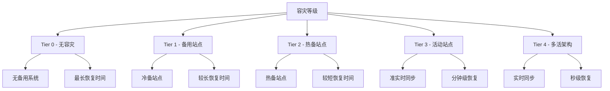

# 数据库容灾解决方案完整指南

## 🎯 概述

数据库容灾解决方案是保障业务连续性的终极防线，通过在不同地理位置部署冗余系统，确保在发生重大灾难时能够快速恢复业务运营。本指南提供从战略规划到技术实施的完整容灾解决方案。

## 📋 目录

1. [容灾基础理论](#1-容灾基础理论)
2. [容灾策略制定](#2-容灾策略制定)
3. [多地域部署架构](#3-多地域部署架构)
4. [数据同步与复制](#4-数据同步与复制)
5. [容灾演练与测试](#5-容灾演练与测试)
6. [故障恢复流程](#6-故障恢复流程)

---

## 1. 容灾基础理论

### 1.1 容灾核心概念

#### 容灾等级定义


#### 关键容灾指标
```yaml
disaster_recovery_metrics:
  rto:
    description: "恢复时间目标 (Recovery Time Objective)"
    definition: "系统从故障到恢复正常运行的最大可接受时间"
    examples:
      - "Tier 1: 24-72小时"
      - "Tier 2: 4-24小时"
      - "Tier 3: 1-4小时"
      - "Tier 4: 0-60分钟"
  
  rpo:
    description: "恢复点目标 (Recovery Point Objective)"
    definition: "可接受的最大数据丢失量"
    examples:
      - "Tier 1: 数小时到数天"
      - "Tier 2: 数十分钟到数小时"
      - "Tier 3: 数分钟"
      - "Tier 4: 接近零数据丢失"
  
  slr:
    description: "服务水平恢复 (Service Level Recovery)"
    definition: "恢复后的服务水平要求"
    examples:
      - "Tier 1: 基础功能"
      - "Tier 2: 核心功能"
      - "Tier 3: 完整功能"
      - "Tier 4: 全部功能"
```

### 1.2 容灾架构模式

#### 容灾架构分类
```python
# 容灾架构模式分析
class DisasterRecoveryArchitectures:
    def __init__(self):
        self.architectures = {
            'cold_standby': {
                'description': '冷备架构',
                'characteristics': {
                    'infrastructure': '基础设备就绪，软件未部署',
                    'activation_time': '数天到数周',
                    'cost': '低',
                    'complexity': '简单'
                },
                'use_cases': ['非关键业务', '预算有限场景', '合规要求最低场景']
            },
            
            'warm_standby': {
                'description': '温备架构',
                'characteristics': {
                    'infrastructure': '基础设施和软件就绪',
                    'activation_time': '数小时到一天',
                    'cost': '中等',
                    'complexity': '中等'
                },
                'use_cases': ['重要业务系统', '中等RTO要求', '成本敏感场景']
            },
            
            'hot_standby': {
                'description': '热备架构',
                'characteristics': {
                    'infrastructure': '完全就绪的备用系统',
                    'activation_time': '数分钟到数小时',
                    'cost': '较高',
                    'complexity': '复杂'
                },
                'use_cases': ['关键业务系统', '严格RTO要求', '金融服务场景']
            },
            
            'active_active': {
                'description': '双活架构',
                'characteristics': {
                    'infrastructure': '两个活动站点同时服务',
                    'activation_time': '几乎即时',
                    'cost': '最高',
                    'complexity': '非常复杂'
                },
                'use_cases': ['核心业务系统', '零容忍停机', '大型互联网公司']
            }
        }
    
    def evaluate_architecture_fit(self, business_requirements):
        """评估适合的架构"""
        scores = {}
        
        for arch_name, arch_info in self.architectures.items():
            score = 0
            
            # RTO匹配度评分
            rto_requirement = business_requirements.get('rto_hours', 24)
            arch_activation_time = self._parse_activation_time(arch_info['characteristics']['activation_time'])
            
            if rto_requirement >= arch_activation_time:
                score += 40
            
            # 成本预算评分
            budget_constraint = business_requirements.get('budget_constraint', 'medium')
            arch_cost = arch_info['characteristics']['cost']
            
            cost_mapping = {'low': 1, 'medium': 2, 'high': 3, 'highest': 4}
            if cost_mapping[budget_constraint] >= cost_mapping[arch_cost]:
                score += 30
            
            # 业务重要性评分
            business_criticality = business_requirements.get('criticality', 'medium')
            criticality_mapping = {'low': 1, 'medium': 2, 'high': 3, 'critical': 4}
            
            if criticality_mapping[business_criticality] <= cost_mapping[arch_cost]:
                score += 30
            
            scores[arch_name] = score
        
        best_architecture = max(scores, key=scores.get)
        return {
            'recommended': best_architecture,
            'score': scores[best_architecture],
            'details': self.architectures[best_architecture],
            'alternatives': sorted(scores.items(), key=lambda x: x[1], reverse=True)[:3]
        }
    
    def _parse_activation_time(self, time_string):
        """解析激活时间字符串"""
        import re
        numbers = re.findall(r'\d+', time_string)
        if '分钟' in time_string:
            return int(numbers[0]) / 60 if numbers else 1
        elif '小时' in time_string:
            return int(numbers[0]) if numbers else 24
        elif '天' in time_string:
            return int(numbers[0]) * 24 if numbers else 72
        else:
            return 24  # 默认24小时

# 使用示例
dr_architectures = DisasterRecoveryArchitectures()

requirements = {
    'rto_hours': 2,
    'budget_constraint': 'high',
    'criticality': 'critical'
}

recommendation = dr_architectures.evaluate_architecture_fit(requirements)
print(f"推荐架构: {recommendation['recommended']}")
print(f"详细信息: {recommendation['details']}")
```

## 2. 容灾策略制定

### 2.1 业务影响分析

#### BIA (Business Impact Analysis) 模板
```python
# 业务影响分析工具
class BusinessImpactAnalyzer:
    def __init__(self):
        self.business_functions = []
        self.dependencies = {}
        self.recovery_requirements = {}
    
    def add_business_function(self, function_name, criticality, dependencies=None):
        """添加业务功能"""
        self.business_functions.append({
            'name': function_name,
            'criticality': criticality,  # critical, high, medium, low
            'dependencies': dependencies or []
        })
        
        if dependencies:
            self.dependencies[function_name] = dependencies
    
    def analyze_impact(self, disruption_scenario):
        """分析中断影响"""
        impact_analysis = {
            'immediate_impact': [],
            'cascading_impact': [],
            'financial_impact': {},
            'recovery_priorities': []
        }
        
        # 直接影响分析
        for function in self.business_functions:
            if function['name'] in disruption_scenario['affected_systems']:
                impact_analysis['immediate_impact'].append({
                    'function': function['name'],
                    'criticality': function['criticality'],
                    'impact_severity': self._assess_impact_severity(function['criticality'])
                })
        
        # 级联影响分析
        cascading_functions = self._find_cascading_impacts(disruption_scenario['affected_systems'])
        for func in cascading_functions:
            impact_analysis['cascading_impact'].append({
                'function': func,
                'reason': f"依赖于{self.dependencies[func]}",
                'impact_severity': self._assess_impact_severity(
                    self._get_function_criticality(func)
                )
            })
        
        # 财务影响计算
        impact_analysis['financial_impact'] = self._calculate_financial_impact(
            impact_analysis['immediate_impact'],
            disruption_scenario['duration_hours']
        )
        
        # 恢复优先级排序
        impact_analysis['recovery_priorities'] = self._prioritize_recovery(
            impact_analysis['immediate_impact'] + impact_analysis['cascading_impact']
        )
        
        return impact_analysis
    
    def _assess_impact_severity(self, criticality):
        """评估影响严重程度"""
        severity_mapping = {
            'critical': 'severe',
            'high': 'high',
            'medium': 'moderate',
            'low': 'low'
        }
        return severity_mapping[criticality]
    
    def _find_cascading_impacts(self, affected_systems):
        """查找级联影响"""
        cascading = set()
        for function, deps in self.dependencies.items():
            if any(dep in affected_systems for dep in deps):
                cascading.add(function)
        return list(cascading)
    
    def _get_function_criticality(self, function_name):
        """获取功能重要性"""
        for func in self.business_functions:
            if func['name'] == function_name:
                return func['criticality']
        return 'low'
    
    def _calculate_financial_impact(self, impacts, duration_hours):
        """计算财务影响"""
        hourly_costs = {
            'severe': 100000,  # 每小时损失
            'high': 50000,
            'moderate': 10000,
            'low': 1000
        }
        
        total_cost = 0
        cost_breakdown = {}
        
        for impact in impacts:
            severity = impact['impact_severity']
            cost = hourly_costs[severity] * duration_hours
            total_cost += cost
            cost_breakdown[impact['function']] = cost
        
        return {
            'total_cost': total_cost,
            'cost_breakdown': cost_breakdown,
            'cost_per_hour': total_cost / duration_hours if duration_hours > 0 else 0
        }
    
    def _prioritize_recovery(self, impacts):
        """确定恢复优先级"""
        priority_mapping = {
            'severe': 1,
            'high': 2,
            'moderate': 3,
            'low': 4
        }
        
        return sorted(impacts, key=lambda x: priority_mapping[x['impact_severity']])

# 使用示例
bia = BusinessImpactAnalyzer()

# 定义业务功能及其依赖关系
bia.add_business_function('订单处理', 'critical', ['支付系统', '库存管理'])
bia.add_business_function('支付系统', 'critical', ['银行接口'])
bia.add_business_function('库存管理', 'high', ['供应商系统'])
bia.add_business_function('客户服务', 'medium', ['CRM系统'])
bia.add_business_function('报表系统', 'low', ['数据仓库'])

# 分析数据中心火灾场景
fire_scenario = {
    'affected_systems': ['订单处理', '支付系统'],
    'duration_hours': 4
}

impact_result = bia.analyze_impact(fire_scenario)
print("影响分析结果:")
print(f"直接冲击: {[i['function'] for i in impact_result['immediate_impact']]}")
print(f"级联冲击: {[i['function'] for i in impact_result['cascading_impact']]}")
print(f"总财务损失: ${impact_result['financial_impact']['total_cost']:,}")
```

### 2.2 容灾策略矩阵

#### DR策略决策矩阵
```python
# 容灾策略决策矩阵
class DRStrategyMatrix:
    def __init__(self):
        self.strategies = {
            'backup_restore': {
                'rto_range': '24-72小时',
                'rpo_range': '1小时-1天',
                'cost_level': '低',
                'complexity': '简单',
                'suitable_for': ['归档数据', '非关键系统', '合规要求']
            },
            
            'pilot_light': {
                'rto_range': '4-24小时',
                'rpo_range': '几分钟-1小时',
                'cost_level': '中等',
                'complexity': '中等',
                'suitable_for': ['重要业务系统', '中等RTO要求']
            },
            
            'warm_standby': {
                'rto_range': '1-4小时',
                'rpo_range': '几分钟',
                'cost_level': '较高',
                'complexity': '复杂',
                'suitable_for': ['关键业务系统', '金融服务']
            },
            
            'multi_site_active': {
                'rto_range': '0-30分钟',
                'rpo_range': '接近零',
                'cost_level': '最高',
                'complexity': '非常复杂',
                'suitable_for': ['核心业务', '零容忍停机']
            }
        }
    
    def recommend_strategy(self, requirements):
        """推荐容灾策略"""
        scores = {}
        
        for strategy_name, strategy_info in self.strategies.items():
            score = self._calculate_strategy_score(strategy_name, requirements)
            scores[strategy_name] = score
        
        best_strategy = max(scores, key=scores.get)
        
        return {
            'recommended': best_strategy,
            'score': scores[best_strategy],
            'details': self.strategies[best_strategy],
            'ranking': sorted(scores.items(), key=lambda x: x[1], reverse=True)
        }
    
    def _calculate_strategy_score(self, strategy_name, requirements):
        """计算策略得分"""
        strategy = self.strategies[strategy_name]
        score = 0
        
        # RTO匹配度 (40分)
        required_rto = requirements.get('max_rto_hours', 24)
        strategy_rto_max = self._parse_time_range_max(strategy['rto_range'])
        if required_rto >= strategy_rto_max:
            score += 40
        
        # RPO匹配度 (30分)
        required_rpo = requirements.get('max_rpo_minutes', 60)
        strategy_rpo_max = self._parse_time_range_max(strategy['rpo_range'], unit='minutes')
        if required_rpo >= strategy_rpo_max:
            score += 30
        
        # 成本考虑 (20分)
        budget_level = requirements.get('budget_level', 'medium')
        cost_levels = {'low': 1, 'medium': 2, 'high': 3, 'highest': 4}
        if cost_levels[budget_level] >= cost_levels[strategy['cost_level']]:
            score += 20
        
        # 复杂度容忍度 (10分)
        complexity_tolerance = requirements.get('complexity_tolerance', 'medium')
        complexity_levels = {'simple': 1, 'medium': 2, 'complex': 3, 'very_complex': 4}
        if complexity_levels[complexity_tolerance] >= complexity_levels[strategy['complexity']]:
            score += 10
        
        return score
    
    def _parse_time_range_max(self, time_range, unit='hours'):
        """解析时间范围最大值"""
        import re
        numbers = re.findall(r'\d+', time_range)
        if not numbers:
            return 24  # 默认值
        
        max_value = max(int(n) for n in numbers)
        
        if unit == 'minutes' and '小时' in time_range:
            max_value *= 60
        elif unit == 'hours' and '分钟' in time_range:
            max_value /= 60
        
        return max_value

# 使用示例
dr_matrix = DRStrategyMatrix()

requirements = {
    'max_rto_hours': 2,
    'max_rpo_minutes': 15,
    'budget_level': 'high',
    'complexity_tolerance': 'complex'
}

recommendation = dr_matrix.recommend_strategy(requirements)
print(f"推荐策略: {recommendation['recommended']}")
print(f"策略详情: {recommendation['details']}")
print(f"得分排名: {recommendation['ranking']}")
```

## 3. 多地域部署架构

### 3.1 地域选择策略

#### 地域距离计算器
```python
# 地域距离和风险评估
import math
from datetime import datetime

class GeographicRiskAssessor:
    def __init__(self):
        self.disaster_zones = {
            '地震带': [(35.6762, 139.6503), (34.0522, -118.2437)],  # 东京、洛杉矶
            '飓风区': [(25.7617, -80.1918), (29.7604, -95.3698)],   # 迈阿密、休斯顿
            '洪水区': [(40.7128, -74.0060), (32.7157, -117.1611)],  # 纽约、圣地亚哥
            '火山带': [(19.4326, -99.1332), (-6.2088, 106.8456)]    # 墨西哥城、雅加达
        }
    
    def calculate_distance(self, lat1, lon1, lat2, lon2):
        """计算两点间距离（公里）"""
        R = 6371  # 地球半径（公里）
        
        lat1_rad = math.radians(lat1)
        lat2_rad = math.radians(lat2)
        delta_lat = math.radians(lat2 - lat1)
        delta_lon = math.radians(lon2 - lon1)
        
        a = (math.sin(delta_lat/2) ** 2 + 
             math.cos(lat1_rad) * math.cos(lat2_rad) * math.sin(delta_lon/2) ** 2)
        c = 2 * math.atan2(math.sqrt(a), math.sqrt(1-a))
        
        return R * c
    
    def assess_geographic_risk(self, primary_location, backup_location):
        """评估地理风险"""
        lat1, lon1 = primary_location
        lat2, lon2 = backup_location
        
        distance = self.calculate_distance(lat1, lon1, lat2, lon2)
        
        risk_assessment = {
            'distance_km': round(distance, 2),
            'disaster_zone_risks': {},
            'risk_level': 'low',
            'recommendation': ''
        }
        
        # 检查各种灾害风险
        for disaster_type, zones in self.disaster_zones.items():
            min_distance_to_zone = float('inf')
            
            for zone_lat, zone_lon in zones:
                zone_distance = self.calculate_distance(lat1, lon1, zone_lat, zone_lon)
                min_distance_to_zone = min(min_distance_to_zone, zone_distance)
            
            risk_assessment['disaster_zone_risks'][disaster_type] = {
                'distance_to_nearest_zone': round(min_distance_to_zone, 2),
                'risk_category': self._categorize_risk(min_distance_to_zone)
            }
        
        # 综合风险评估
        risk_assessment['risk_level'] = self._calculate_overall_risk(risk_assessment)
        risk_assessment['recommendation'] = self._generate_recommendation(risk_assessment)
        
        return risk_assessment
    
    def _categorize_risk(self, distance_km):
        """风险分类"""
        if distance_km < 100:
            return 'high'
        elif distance_km < 500:
            return 'medium'
        else:
            return 'low'
    
    def _calculate_overall_risk(self, assessment):
        """计算综合风险等级"""
        high_risks = sum(1 for risk in assessment['disaster_zone_risks'].values() 
                        if risk['risk_category'] == 'high')
        
        if high_risks >= 2:
            return 'high'
        elif high_risks >= 1:
            return 'medium'
        else:
            return 'low'
    
    def _generate_recommendation(self, assessment):
        """生成建议"""
        if assessment['risk_level'] == 'high':
            return f"距离太近({assessment['distance_km']}km)，建议选择更远的地理位置"
        elif assessment['distance_km'] < 300:
            return f"距离适中({assessment['distance_km']}km)，但需考虑具体灾害风险"
        else:
            return f"距离良好({assessment['distance_km']}km)，地理隔离效果佳"

# 使用示例
assessor = GeographicRiskAssessor()

# 北京数据中心选址评估
beijing_coords = (39.9042, 116.4074)
shanghai_coords = (31.2304, 121.4737)
guangzhou_coords = (23.1291, 113.2644)

# 评估北京-上海的容灾距离
risk_assessment = assessor.assess_geographic_risk(beijing_coords, shanghai_coords)
print(f"北京-上海风险评估: {risk_assessment}")

# 评估北京-广州的容灾距离
risk_assessment2 = assessor.assess_geographic_risk(beijing_coords, guangzhou_coords)
print(f"北京-广州风险评估: {risk_assessment2}")
```

### 3.2 网络架构设计

#### 多地域网络拓扑
```python
# 多地域网络架构设计
class MultiRegionNetworkDesigner:
    def __init__(self):
        self.regions = {}
        self.network_links = []
    
    def add_region(self, region_name, coordinates, network_specs):
        """添加地域"""
        self.regions[region_name] = {
            'coordinates': coordinates,
            'specs': network_specs,
            'connected_regions': []
        }
    
    def design_network_topology(self, primary_region, backup_regions, requirements):
        """设计网络拓扑"""
        topology = {
            'primary_region': primary_region,
            'backup_regions': backup_regions,
            'links': [],
            'bandwidth_allocation': {},
            'latency_matrix': {}
        }
        
        # 设计主备连接
        for backup_region in backup_regions:
            link_spec = self._design_link(primary_region, backup_region, requirements)
            topology['links'].append(link_spec)
            self.regions[primary_region]['connected_regions'].append(backup_region)
        
        # 设计备备连接（可选）
        if requirements.get('inter_backup_connectivity', False):
            for i, region1 in enumerate(backup_regions):
                for region2 in backup_regions[i+1:]:
                    link_spec = self._design_link(region1, region2, requirements)
                    topology['links'].append(link_spec)
                    self.regions[region1]['connected_regions'].append(region2)
                    self.regions[region2]['connected_regions'].append(region1)
        
        # 计算带宽分配
        topology['bandwidth_allocation'] = self._calculate_bandwidth_allocation(topology)
        
        # 计算延迟矩阵
        topology['latency_matrix'] = self._calculate_latency_matrix()
        
        return topology
    
    def _design_link(self, region1, region2, requirements):
        """设计地域间连接"""
        coords1 = self.regions[region1]['coordinates']
        coords2 = self.regions[region2]['coordinates']
        
        distance = self._calculate_distance(coords1, coords2)
        latency = self._estimate_latency(distance)
        
        # 根据要求确定链路规格
        bandwidth = requirements.get('minimum_bandwidth_gbps', 1)
        redundancy = requirements.get('link_redundancy', 2)  # 默认双链路
        
        return {
            'source': region1,
            'destination': region2,
            'distance_km': round(distance, 2),
            'latency_ms': round(latency, 2),
            'bandwidth_gbps': bandwidth,
            'redundancy': redundancy,
            'technology': self._select_technology(distance),
            'cost_estimate': self._estimate_cost(distance, bandwidth, redundancy)
        }
    
    def _calculate_distance(self, coords1, coords2):
        """计算地理距离"""
        lat1, lon1 = coords1
        lat2, lon2 = coords2
        
        R = 6371  # 地球半径公里
        lat1_rad = math.radians(lat1)
        lat2_rad = math.radians(lat2)
        delta_lat = math.radians(lat2 - lat1)
        delta_lon = math.radians(lon2 - lon1)
        
        a = (math.sin(delta_lat/2) ** 2 + 
             math.cos(lat1_rad) * math.cos(lat2_rad) * math.sin(delta_lon/2) ** 2)
        c = 2 * math.atan2(math.sqrt(a), math.sqrt(1-a))
        
        return R * c
    
    def _estimate_latency(self, distance_km):
        """估算网络延迟"""
        # 光纤速度约200,000 km/s，考虑路由开销乘以1.5
        speed_of_light_factor = 1.5
        return (distance_km / 200000) * 1000 * speed_of_light_factor
    
    def _select_technology(self, distance):
        """选择传输技术"""
        if distance < 500:
            return '专线直连'
        elif distance < 2000:
            return 'MPLS VPN'
        else:
            return 'SD-WAN + 公网加密'
    
    def _estimate_cost(self, distance, bandwidth, redundancy):
        """估算成本"""
        base_cost_per_km = 100  # 每公里基础费用
        bandwidth_cost_per_gbps = 5000  # 每Gbps月费
        
        distance_cost = distance * base_cost_per_km * redundancy
        bandwidth_cost = bandwidth * bandwidth_cost_per_gbps * redundancy
        
        return {
            'setup_cost': distance_cost,
            'monthly_cost': bandwidth_cost,
            'annual_cost': bandwidth_cost * 12
        }
    
    def _calculate_bandwidth_allocation(self, topology):
        """计算带宽分配"""
        allocation = {}
        
        # 主备链路带宽分配
        for link in topology['links']:
            source = link['source']
            dest = link['destination']
            
            if source not in allocation:
                allocation[source] = {}
            allocation[source][dest] = {
                'allocated_bandwidth': link['bandwidth_gbps'],
                'utilization_target': 0.7,  # 目标利用率70%
                'peak_utilization': 0.9    # 峰值利用率90%
            }
        
        return allocation
    
    def _calculate_latency_matrix(self):
        """计算延迟矩阵"""
        matrix = {}
        
        for region1 in self.regions:
            matrix[region1] = {}
            coords1 = self.regions[region1]['coordinates']
            
            for region2 in self.regions:
                if region1 == region2:
                    matrix[region1][region2] = 0
                else:
                    coords2 = self.regions[region2]['coordinates']
                    distance = self._calculate_distance(coords1, coords2)
                    latency = self._estimate_latency(distance)
                    matrix[region1][region2] = round(latency, 2)
        
        return matrix

# 使用示例
network_designer = MultiRegionNetworkDesigner()

# 添加地域信息
network_designer.add_region('北京', (39.9042, 116.4074), {'capacity': 'large'})
network_designer.add_region('上海', (31.2304, 121.4737), {'capacity': 'medium'})
network_designer.add_region('广州', (23.1291, 113.2644), {'capacity': 'medium'})
network_designer.add_region('西安', (34.3416, 108.9398), {'capacity': 'small'})

# 设计网络拓扑
requirements = {
    'minimum_bandwidth_gbps': 10,
    'link_redundancy': 2,
    'inter_backup_connectivity': True
}

topology = network_designer.design_network_topology('北京', ['上海', '广州', '西安'], requirements)

print("网络拓扑设计:")
for link in topology['links']:
    print(f"{link['source']} -> {link['destination']}: "
          f"{link['bandwidth_gbps']}Gbps, {link['latency_ms']}ms延迟")
```

## 4. 数据同步与复制

### 4.1 异地数据同步策略

#### 数据同步方案对比
```python
# 数据同步方案评估
class DataSyncStrategies:
    def __init__(self):
        self.strategies = {
            'log_shipping': {
                'description': '日志传送',
                'sync_method': '异步',
                'rpo': '分钟到小时级',
                'network_bandwidth': '低',
                'implementation_complexity': '中等',
                'recovery_time': '较长'
            },
            
            'real_time_replication': {
                'description': '实时复制',
                'sync_method': '同步/半同步',
                'rpo': '秒级',
                'network_bandwidth': '高',
                'implementation_complexity': '复杂',
                'recovery_time': '较短'
            },
            
            'block_level_sync': {
                'description': '块级别同步',
                'sync_method': '同步',
                'rpo': '接近零',
                'network_bandwidth': '很高',
                'implementation_complexity': '很复杂',
                'recovery_time': '最短'
            },
            
            'file_level_sync': {
                'description': '文件级别同步',
                'sync_method': '异步',
                'rpo': '分钟级',
                'network_bandwidth': '中等',
                'implementation_complexity': '简单',
                'recovery_time': '中等'
            }
        }
    
    def evaluate_sync_strategy(self, requirements):
        """评估同步策略"""
        scores = {}
        
        for strategy_name, strategy_info in self.strategies.items():
            score = self._calculate_strategy_score(strategy_name, requirements)
            scores[strategy_name] = score
        
        best_strategy = max(scores, key=scores.get)
        
        return {
            'recommended': best_strategy,
            'score': scores[best_strategy],
            'details': self.strategies[best_strategy],
            'comparison': self._generate_comparison_matrix(scores)
        }
    
    def _calculate_strategy_score(self, strategy_name, requirements):
        """计算策略得分"""
        strategy = self.strategies[strategy_name]
        score = 0
        
        # RPO要求匹配 (30分)
        required_rpo = requirements.get('max_rpo_seconds', 300)
        strategy_rpo = self._parse_rpo(strategy['rpo'])
        if required_rpo >= strategy_rpo:
            score += 30
        
        # 网络带宽考虑 (25分)
        available_bandwidth = requirements.get('available_bandwidth_gbps', 1)
        bandwidth_requirement = self._get_bandwidth_requirement(strategy['network_bandwidth'])
        if available_bandwidth >= bandwidth_requirement:
            score += 25
        
        # 实施复杂度容忍度 (20分)
        complexity_tolerance = requirements.get('complexity_tolerance', 'medium')
        complexity_levels = {'simple': 1, 'medium': 2, 'complex': 3, 'very_complex': 4}
        strategy_complexity = complexity_levels[strategy['implementation_complexity']]
        if complexity_levels[complexity_tolerance] >= strategy_complexity:
            score += 20
        
        # 恢复时间要求 (15分)
        max_recovery_hours = requirements.get('max_recovery_hours', 4)
        recovery_time_rating = self._rate_recovery_time(strategy['recovery_time'])
        if max_recovery_hours >= recovery_time_rating:
            score += 15
        
        # 成本考虑 (10分)
        budget_level = requirements.get('budget_level', 'medium')
        cost_levels = {'low': 1, 'medium': 2, 'high': 3, 'highest': 4}
        # 假设带宽要求高的方案成本也高
        if cost_levels[budget_level] >= bandwidth_requirement:
            score += 10
        
        return score
    
    def _parse_rpo(self, rpo_string):
        """解析RPO时间"""
        import re
        numbers = re.findall(r'\d+', rpo_string)
        if not numbers:
            return 3600  # 默认1小时
        
        value = int(numbers[0])
        if '秒' in rpo_string:
            return value
        elif '分钟' in rpo_string:
            return value * 60
        else:
            return value * 3600  # 小时
    
    def _get_bandwidth_requirement(self, bandwidth_level):
        """获取带宽要求"""
        bandwidth_mapping = {
            '很低': 0.1,
            '低': 0.5,
            '中等': 2,
            '高': 5,
            '很高': 10
        }
        return bandwidth_mapping.get(bandwidth_level, 2)
    
    def _rate_recovery_time(self, time_description):
        """评级恢复时间"""
        time_mapping = {
            '最短': 0.5,
            '较短': 2,
            '中等': 4,
            '较长': 12
        }
        return time_mapping.get(time_description, 4)
    
    def _generate_comparison_matrix(self, scores):
        """生成对比矩阵"""
        matrix = []
        for strategy, score in sorted(scores.items(), key=lambda x: x[1], reverse=True):
            matrix.append({
                'strategy': strategy,
                'score': score,
                'details': self.strategies[strategy]
            })
        return matrix

# 使用示例
sync_strategies = DataSyncStrategies()

requirements = {
    'max_rpo_seconds': 60,
    'available_bandwidth_gbps': 5,
    'complexity_tolerance': 'complex',
    'max_recovery_hours': 2,
    'budget_level': 'high'
}

evaluation = sync_strategies.evaluate_sync_strategy(requirements)
print(f"推荐同步策略: {evaluation['recommended']}")
print("策略对比:")
for item in evaluation['comparison']:
    print(f"- {item['strategy']}: {item['score']}分")
```

### 4.2 数据一致性保障

#### 分布式一致性协议
```python
# 分布式一致性保障机制
import time
import hashlib
from typing import Dict, List, Any

class DataConsistencyManager:
    def __init__(self, regions: List[str]):
        self.regions = regions
        self.consistency_tokens = {}  # region -> {token: timestamp}
        self.data_checksums = {}      # region -> {table: checksum}
        self.sync_sequences = {}      # region -> sequence_number
    
    def generate_consistency_token(self, region: str, data_snapshot: Dict) -> str:
        """生成一致性令牌"""
        timestamp = int(time.time() * 1000)  # 毫秒级时间戳
        data_hash = self._calculate_data_hash(data_snapshot)
        
        token = f"{region}_{timestamp}_{data_hash}"
        
        if region not in self.consistency_tokens:
            self.consistency_tokens[region] = {}
        
        self.consistency_tokens[region][token] = timestamp
        return token
    
    def verify_consistency(self, tokens: Dict[str, str]) -> Dict[str, Any]:
        """验证跨地域一致性"""
        results = {
            'consistent': True,
            'inconsistent_regions': [],
            'timestamp_drift': {},
            'verification_time': time.time()
        }
        
        if len(tokens) < 2:
            results['consistent'] = False
            results['error'] = '至少需要两个地域进行一致性验证'
            return results
        
        # 提取时间戳并检查漂移
        timestamps = {}
        for region, token in tokens.items():
            if '_' in token:
                parts = token.split('_')
                if len(parts) >= 2:
                    try:
                        timestamp = int(parts[1])
                        timestamps[region] = timestamp
                    except ValueError:
                        results['inconsistent_regions'].append(region)
        
        # 检查时间戳漂移
        if len(timestamps) > 1:
            max_ts = max(timestamps.values())
            min_ts = min(timestamps.values())
            drift_ms = max_ts - min_ts
            
            results['timestamp_drift'] = {
                'max_drift_ms': drift_ms,
                'within_tolerance': drift_ms <= 1000  # 1秒容忍度
            }
            
            if drift_ms > 1000:
                results['consistent'] = False
        
        # 验证数据哈希一致性
        data_hashes = {}
        for region, token in tokens.items():
            if '_' in token:
                parts = token.split('_')
                if len(parts) >= 3:
                    data_hashes[region] = parts[2]
        
        if len(set(data_hashes.values())) > 1:
            results['consistent'] = False
            results['inconsistent_regions'] = list(data_hashes.keys())
            results['hash_mismatch'] = data_hashes
        
        return results
    
    def calculate_data_checksum(self, region: str, table_name: str, data: List[Dict]) -> str:
        """计算数据校验和"""
        if region not in self.data_checksums:
            self.data_checksums[region] = {}
        
        # 对数据进行排序以确保一致性
        sorted_data = sorted(data, key=lambda x: str(x))
        
        # 计算MD5校验和
        data_str = str(sorted_data)
        checksum = hashlib.md5(data_str.encode()).hexdigest()
        
        self.data_checksums[region][table_name] = checksum
        return checksum
    
    def verify_data_integrity(self, region_data_map: Dict[str, Dict[str, List[Dict]]]) -> Dict[str, Any]:
        """验证数据完整性"""
        results = {
            'integrity_verified': True,
            'checksum_mismatches': {},
            'verified_tables': []
        }
        
        # 计算所有地域的校验和
        checksums = {}
        for region, tables_data in region_data_map.items():
            checksums[region] = {}
            for table_name, table_data in tables_data.items():
                checksum = self.calculate_data_checksum(region, table_name, table_data)
                checksums[region][table_name] = checksum
        
        # 比较不同地域间的校验和
        if len(checksums) < 2:
            results['integrity_verified'] = False
            results['error'] = '至少需要两个地域进行完整性验证'
            return results
        
        # 选择一个参考地域
        reference_region = list(checksums.keys())[0]
        reference_checksums = checksums[reference_region]
        
        for table_name in reference_checksums:
            reference_checksum = reference_checksums[table_name]
            results['verified_tables'].append(table_name)
            
            # 检查其他地域
            for region in checksums:
                if region != reference_region:
                    region_checksum = checksums[region].get(table_name)
                    if region_checksum and region_checksum != reference_checksum:
                        if table_name not in results['checksum_mismatches']:
                            results['checksum_mismatches'][table_name] = {}
                        results['checksum_mismatches'][table_name][region] = region_checksum
                        results['integrity_verified'] = False
        
        return results
    
    def assign_sequence_number(self, region: str) -> int:
        """分配序列号用于顺序保证"""
        if region not in self.sync_sequences:
            self.sync_sequences[region] = 0
        
        self.sync_sequences[region] += 1
        return self.sync_sequences[region]
    
    def validate_sequence_order(self, region_sequences: Dict[str, int]) -> Dict[str, Any]:
        """验证序列号顺序"""
        results = {
            'sequences_valid': True,
            'sequence_gaps': {},
            'latest_sequences': region_sequences
        }
        
        if len(region_sequences) < 2:
            return results
        
        # 检查序列号差距
        sequences = list(region_sequences.values())
        max_seq = max(sequences)
        min_seq = min(sequences)
        
        if max_seq - min_seq > 10:  # 允许最大10个序列号差距
            results['sequences_valid'] = False
            results['sequence_gaps'] = {
                'max_difference': max_seq - min_seq,
                'regions': region_sequences
            }
        
        return results
    
    def _calculate_data_hash(self, data: Dict) -> str:
        """计算数据哈希"""
        # 对字典按键排序以确保一致性
        sorted_items = sorted(data.items())
        data_string = str(sorted_items)
        return hashlib.md5(data_string.encode()).hexdigest()

# 使用示例
consistency_manager = DataConsistencyManager(['北京', '上海', '广州'])

# 模拟数据同步场景
data_snapshot = {
    'users': [{'id': 1, 'name': '张三'}, {'id': 2, 'name': '李四'}],
    'orders': [{'id': 101, 'user_id': 1, 'amount': 100}]
}

# 生成各地域的一致性令牌
tokens = {}
for region in ['北京', '上海', '广州']:
    token = consistency_manager.generate_consistency_token(region, data_snapshot)
    tokens[region] = token
    print(f"{region} 令牌: {token}")

# 验证一致性
consistency_result = consistency_manager.verify_consistency(tokens)
print(f"一致性验证结果: {consistency_result}")

# 验证数据完整性
region_data = {
    '北京': data_snapshot,
    '上海': data_snapshot,
    '广州': data_snapshot  # 假设广州的数据略有不同
}

# 修改广州的数据来模拟不一致
guangzhou_data = {
    'users': [{'id': 1, 'name': '张三'}, {'id': 2, 'name': '王五'}],  # 李四改为王五
    'orders': data_snapshot['orders']
}

region_data['广州'] = guangzhou_data

integrity_result = consistency_manager.verify_data_integrity(region_data)
print(f"数据完整性验证: {integrity_result}")
```

## 5. 容灾演练与测试

### 5.1 演练计划制定

#### 容灾演练规划工具
```python
# 容灾演练规划系统
from datetime import datetime, timedelta
from enum import Enum
import random

class DrillType(Enum):
    TABLETOP = "桌面演练"
    FUNCTIONAL = "功能性演练"
    FULL_INTERUPTION = "完全中断演练"
    APPLICATION_LEVEL = "应用级演练"

class DrillPlanner:
    def __init__(self):
        self.drills_history = []
        self.upcoming_drills = []
        self.risk_assessments = []
    
    def plan_annual_drill_schedule(self, business_calendar, system_inventory):
        """制定年度演练计划"""
        schedule = {
            'year': datetime.now().year,
            'drills': [],
            'quarterly_goals': {},
            'resource_allocation': {}
        }
        
        # 确定演练频率
        drill_frequency = {
            'critical_systems': 4,  # 每季度一次
            'important_systems': 2,  # 每半年一次
            'standard_systems': 1   # 每年一次
        }
        
        # 为每个系统安排演练
        for system in system_inventory:
            system_type = system['criticality']
            frequency = drill_frequency.get(system_type, 1)
            
            system_drills = self._schedule_system_drills(
                system, frequency, business_calendar
            )
            schedule['drills'].extend(system_drills)
        
        # 按季度组织目标
        schedule['quarterly_goals'] = self._organize_quarterly_goals(schedule['drills'])
        
        # 资源分配规划
        schedule['resource_allocation'] = self._plan_resource_allocation(schedule['drills'])
        
        return schedule
    
    def _schedule_system_drills(self, system, frequency, business_calendar):
        """为系统安排演练"""
        drills = []
        system_name = system['name']
        
        # 确定合适的演练月份（避开业务高峰期）
        available_months = self._get_non_peak_months(business_calendar, system['business_cycle'])
        
        for i in range(frequency):
            # 随机选择月份
            month = random.choice(available_months)
            drill_date = self._calculate_drill_date(month, business_calendar)
            
            # 确定演练类型
            drill_type = self._determine_drill_type(system, i, frequency)
            
            drill = {
                'system': system_name,
                'type': drill_type,
                'scheduled_date': drill_date,
                'duration_hours': self._estimate_drill_duration(drill_type),
                'participants': self._identify_participants(system, drill_type),
                'success_criteria': self._define_success_criteria(system, drill_type),
                'rollback_plan': self._create_rollback_plan(system),
                'communication_plan': self._create_communication_plan(system, drill_date)
            }
            
            drills.append(drill)
        
        return drills
    
    def _get_non_peak_months(self, business_calendar, business_cycle):
        """获取非高峰期月份"""
        peak_seasons = business_calendar.get('peak_seasons', [])
        all_months = list(range(1, 13))
        
        non_peak_months = [month for month in all_months if month not in peak_seasons]
        return non_peak_months if non_peak_months else [3, 6, 9, 12]  # 默认季度末
    
    def _calculate_drill_date(self, month, business_calendar):
        """计算演练日期"""
        year = datetime.now().year
        # 选择月中的一天，避开周末
        target_date = datetime(year, month, 15)
        
        # 如果是周末，调整到工作日
        while target_date.weekday() >= 5:  # 5=Saturday, 6=Sunday
            target_date += timedelta(days=1)
        
        return target_date.strftime('%Y-%m-%d')
    
    def _determine_drill_type(self, system, drill_number, total_drills):
        """确定演练类型"""
        criticality = system['criticality']
        
        if criticality == 'critical':
            # 关键系统：从桌面演练开始，逐渐升级
            if drill_number == 0:
                return DrillType.TABLETOP
            elif drill_number == 1:
                return DrillType.FUNCTIONAL
            elif drill_number == 2:
                return DrillType.APPLICATION_LEVEL
            else:
                return DrillType.FULL_INTERUPTION
        elif criticality == 'high':
            # 重要系统：功能性演练和应用级演练
            return DrillType.FUNCTIONAL if drill_number == 0 else DrillType.APPLICATION_LEVEL
        else:
            # 标准系统：主要是桌面演练
            return DrillType.TABLETOP
    
    def _estimate_drill_duration(self, drill_type):
        """估算演练时长"""
        duration_map = {
            DrillType.TABLETOP: 4,
            DrillType.FUNCTIONAL: 8,
            DrillType.APPLICATION_LEVEL: 16,
            DrillType.FULL_INTERUPTION: 24
        }
        return duration_map.get(drill_type, 8)
    
    def _identify_participants(self, system, drill_type):
        """识别参与者"""
        base_participants = [
            f"{system['owner']}_team_lead",
            f"{system['dba_team']}_lead",
            "dr_operations_manager"
        ]
        
        if drill_type in [DrillType.FUNCTIONAL, DrillType.FULL_INTERUPTION]:
            base_participants.extend([
                "network_engineering_team",
                "security_team",
                "business_stakeholders"
            ])
        
        if drill_type == DrillType.FULL_INTERUPTION:
            base_participants.extend([
                "senior_management",
                "customer_support_team"
            ])
        
        return base_participants
    
    def _define_success_criteria(self, system, drill_type):
        """定义成功标准"""
        base_criteria = [
            f"系统{name}在{system['rto_hours']}小时内恢复正常",
            f"数据完整性验证通过",
            f"业务功能验证完成"
        ]
        
        if drill_type == DrillType.FULL_INTERUPTION:
            additional_criteria = [
                f"用户影响时间不超过{system['rto_hours']*2}小时",
                f"客户投诉率低于1%",
                f"媒体曝光为零"
            ]
            base_criteria.extend(additional_criteria)
        
        return base_criteria
    
    def _create_rollback_plan(self, system):
        """创建回滚计划"""
        return {
            'trigger_conditions': [
                '数据不一致超过阈值',
                '业务影响超出预期',
                '安全事件发生'
            ],
            'rollback_steps': [
                '立即停止演练',
                '启动紧急恢复流程',
                '通知所有相关方',
                '执行数据回滚',
                '恢复生产环境'
            ],
            'emergency_contacts': system.get('emergency_contacts', [])
        }
    
    def _create_communication_plan(self, system, drill_date):
        """创建沟通计划"""
        return {
            'pre_drill_notification': f"演练前48小时通知所有相关人员",
            'during_drill_updates': f"每2小时更新演练状态",
            'post_drill_report': f"演练结束后24小时内提交报告",
            'stakeholders': [
                'internal_teams',
                'business_users',
                'customers_(if_applicable)',
                'regulatory_bodies_(if_required)'
            ]
        }
    
    def _organize_quarterly_goals(self, drills):
        """组织季度目标"""
        quarterly_goals = {}
        
        for drill in drills:
            drill_date = datetime.strptime(drill['scheduled_date'], '%Y-%m-%d')
            quarter = (drill_date.month - 1) // 3 + 1
            
            if quarter not in quarterly_goals:
                quarterly_goals[quarter] = {
                    'systems_covered': set(),
                    'drill_types': set(),
                    'total_duration_hours': 0
                }
            
            quarterly_goals[quarter]['systems_covered'].add(drill['system'])
            quarterly_goals[quarter]['drill_types'].add(drill['type'].value)
            quarterly_goals[quarter]['total_duration_hours'] += drill['duration_hours']
        
        # 转换为列表格式
        for quarter in quarterly_goals:
            quarterly_goals[quarter]['systems_covered'] = list(quarterly_goals[quarter]['systems_covered'])
            quarterly_goals[quarter]['drill_types'] = list(quarterly_goals[quarter]['drill_types'])
        
        return quarterly_goals
    
    def _plan_resource_allocation(self, drills):
        """规划资源分配"""
        resource_plan = {
            'personnel': {},
            'infrastructure': {},
            'budget': {}
        }
        
        # 人员资源统计
        for drill in drills:
            for participant in drill['participants']:
                if participant not in resource_plan['personnel']:
                    resource_plan['personnel'][participant] = 0
                resource_plan['personnel'][participant] += drill['duration_hours']
        
        # 基础设施需求
        resource_plan['infrastructure'] = {
            'test_environments': len(set(drill['system'] for drill in drills)),
            'backup_systems': sum(1 for drill in drills if drill['type'] != DrillType.TABLETOP),
            'monitoring_tools': 'full_suite_required'
        }
        
        # 预算估算
        hourly_rate = 100  # 假设每人每小时成本
        total_person_hours = sum(resource_plan['personnel'].values())
        resource_plan['budget'] = {
            'personnel_cost': total_person_hours * hourly_rate,
            'infrastructure_cost': len(drills) * 5000,  # 每次演练基础设施成本
            'total_estimated_cost': total_person_hours * hourly_rate + len(drills) * 5000
        }
        
        return resource_plan

# 使用示例
planner = DrillPlanner()

# 业务日历和系统清单
business_calendar = {
    'peak_seasons': [11, 12],  # 双十一、双十二
    'holidays': ['2024-01-01', '2024-10-01']
}

system_inventory = [
    {
        'name': '核心交易系统',
        'criticality': 'critical',
        'owner': 'trading',
        'dba_team': 'database_admins',
        'rto_hours': 2,
        'business_cycle': 'daily'
    },
    {
        'name': '用户管理系统',
        'criticality': 'high',
        'owner': 'user_services',
        'dba_team': 'database_admins',
        'rto_hours': 4,
        'business_cycle': 'weekly'
    },
    {
        'name': '报表分析系统',
        'criticality': 'medium',
        'owner': 'analytics',
        'dba_team': 'database_admins',
        'rto_hours': 24,
        'business_cycle': 'monthly'
    }
]

# 制定年度演练计划
annual_schedule = planner.plan_annual_drill_schedule(business_calendar, system_inventory)

print("年度容灾演练计划:")
print(f"总计演练次数: {len(annual_schedule['drills'])}")
print("\n季度目标:")
for quarter, goals in annual_schedule['quarterly_goals'].items():
    print(f"Q{quarter}: 覆盖{len(goals['systems_covered'])}个系统, "
          f"{goals['total_duration_hours']}小时演练时间")

print(f"\n预计总成本: ${annual_schedule['resource_allocation']['budget']['total_estimated_cost']:,}")
```

### 5.2 演练执行监控

#### 演练执行跟踪系统
```python
# 演练执行监控系统
import time
from datetime import datetime
from typing import Dict, List, Any
import threading

class DrillExecutionMonitor:
    def __init__(self):
        self.active_drills = {}
        self.drill_metrics = {}
        self.alerts = []
        self.monitoring_thread = None
        self.is_monitoring = False
    
    def start_drill_monitoring(self, drill_config: Dict[str, Any]):
        """开始演练监控"""
        drill_id = f"drill_{int(time.time())}"
        
        self.active_drills[drill_id] = {
            'config': drill_config,
            'start_time': datetime.now(),
            'status': 'running',
            'milestones': [],
            'incidents': []
        }
        
        self.drill_metrics[drill_id] = {
            'timeline_metrics': {},
            'performance_metrics': {},
            'resource_utilization': {}
        }
        
        # 启动监控线程
        self.is_monitoring = True
        self.monitoring_thread = threading.Thread(target=self._monitor_drill, args=(drill_id,))
        self.monitoring_thread.daemon = True
        self.monitoring_thread.start()
        
        return drill_id
    
    def _monitor_drill(self, drill_id: str):
        """监控演练执行"""
        while self.is_monitoring and drill_id in self.active_drills:
            try:
                self._collect_metrics(drill_id)
                self._check_milestones(drill_id)
                self._evaluate_performance(drill_id)
                time.sleep(60)  # 每分钟检查一次
            except Exception as e:
                self._log_alert(drill_id, 'MONITOR_ERROR', f"监控异常: {str(e)}")
    
    def _collect_metrics(self, drill_id: str):
        """收集演练指标"""
        drill = self.active_drills[drill_id]
        metrics = self.drill_metrics[drill_id]
        
        # 时间线指标
        elapsed_time = (datetime.now() - drill['start_time']).total_seconds() / 3600
        metrics['timeline_metrics']['elapsed_hours'] = round(elapsed_time, 2)
        
        # 性能指标（模拟数据）
        metrics['performance_metrics'] = {
            'rto_achieved': self._simulate_rto_progress(elapsed_time, drill['config']),
            'data_consistency': self._simulate_consistency_check(),
            'user_impact': self._simulate_user_impact(elapsed_time)
        }
        
        # 资源利用率
        metrics['resource_utilization'] = {
            'personnel_engaged': len(drill['config']['participants']),
            'systems_affected': 1,
            'communication_sent': self._count_communications(drill_id)
        }
    
    def _check_milestones(self, drill_id: str):
        """检查里程碑"""
        drill = self.active_drills[drill_id]
        elapsed_hours = self.drill_metrics[drill_id]['timeline_metrics']['elapsed_hours']
        
        expected_milestones = self._get_expected_milestones(drill['config'])
        
        for milestone in expected_milestones:
            if elapsed_hours >= milestone['expected_time_hours']:
                if not self._milestone_completed(drill_id, milestone['name']):
                    self._record_milestone_completion(drill_id, milestone)
    
    def _evaluate_performance(self, drill_id: str):
        """评估演练性能"""
        metrics = self.drill_metrics[drill_id]
        config = self.active_drills[drill_id]['config']
        
        # RTO评估
        rto_achieved = metrics['performance_metrics']['rto_achieved']
        target_rto = config['success_criteria'][0].split(' ')[1]  # 提取目标RTO
        
        try:
            target_hours = float(target_rto.replace('小时', ''))
            if rto_achieved > target_hours * 1.2:  # 超过目标20%
                self._log_alert(drill_id, 'RTO_WARNING', f"RTO超出预期: {rto_achieved}小时")
        except:
            pass
    
    def _simulate_rto_progress(self, elapsed_hours: float, config: Dict) -> float:
        """模拟RTO进度"""
        # 简化的模拟逻辑
        drill_type = config['type']
        if drill_type == 'TABLETOP':
            return min(elapsed_hours * 0.5, 2.0)
        elif drill_type == 'FUNCTIONAL':
            return min(elapsed_hours * 0.3, 4.0)
        else:
            return min(elapsed_hours * 0.2, 8.0)
    
    def _simulate_consistency_check(self) -> float:
        """模拟一致性检查结果"""
        # 返回一致性百分比
        return random.uniform(95.0, 99.9)
    
    def _simulate_user_impact(self, elapsed_hours: float) -> float:
        """模拟用户影响"""
        # 返回受影响用户百分比
        return min(elapsed_hours * 2.0, 15.0)
    
    def _count_communications(self, drill_id: str) -> int:
        """统计通信次数"""
        drill = self.active_drills[drill_id]
        elapsed_hours = self.drill_metrics[drill_id]['timeline_metrics']['elapsed_hours']
        
        # 根据沟通计划计算预期通信次数
        communications_per_hour = 0.5  # 每2小时一次更新
        return int(elapsed_hours * communications_per_hour)
    
    def _get_expected_milestones(self, config: Dict) -> List[Dict]:
        """获取预期里程碑"""
        drill_type = config['type']
        
        milestones = {
            'TABLETOP': [
                {'name': '演练启动', 'expected_time_hours': 0.5},
                {'name': '场景讨论完成', 'expected_time_hours': 2.0},
                {'name': '总结会议', 'expected_time_hours': 3.5}
            ],
            'FUNCTIONAL': [
                {'name': '环境准备完成', 'expected_time_hours': 1.0},
                {'name': '故障注入', 'expected_time_hours': 2.0},
                {'name': '恢复操作开始', 'expected_time_hours': 4.0},
                {'name': '系统验证完成', 'expected_time_hours': 7.0}
            ],
            'FULL_INTERUPTION': [
                {'name': '正式中断开始', 'expected_time_hours': 0.5},
                {'name': '初步评估完成', 'expected_time_hours': 2.0},
                {'name': '恢复团队到位', 'expected_time_hours': 4.0},
                {'name': '核心功能恢复', 'expected_time_hours': 12.0},
                {'name': '完整验证完成', 'expected_time_hours': 20.0}
            ]
        }
        
        return milestones.get(drill_type, milestones['FUNCTIONAL'])
    
    def _milestone_completed(self, drill_id: str, milestone_name: str) -> bool:
        """检查里程碑是否已完成"""
        drill = self.active_drills[drill_id]
        return any(m['name'] == milestone_name for m in drill['milestones'])
    
    def _record_milestone_completion(self, drill_id: str, milestone: Dict):
        """记录里程碑完成"""
        completion_record = {
            'name': milestone['name'],
            'completed_at': datetime.now(),
            'elapsed_time_hours': self.drill_metrics[drill_id]['timeline_metrics']['elapsed_hours']
        }
        
        self.active_drills[drill_id]['milestones'].append(completion_record)
        
        # 记录里程碑告警
        self._log_alert(drill_id, 'MILESTONE_COMPLETED', 
                       f"里程碑完成: {milestone['name']}")
    
    def _log_alert(self, drill_id: str, alert_type: str, message: str):
        """记录告警"""
        alert = {
            'timestamp': datetime.now(),
            'drill_id': drill_id,
            'type': alert_type,
            'message': message
        }
        self.alerts.append(alert)
        print(f"[{alert_type}] {message}")
    
    def record_incident(self, drill_id: str, incident_description: str, severity: str):
        """记录演练期间的事件"""
        incident = {
            'timestamp': datetime.now(),
            'description': incident_description,
            'severity': severity,
            'resolved': False
        }
        
        self.active_drills[drill_id]['incidents'].append(incident)
        self._log_alert(drill_id, f'INCIDENT_{severity.upper()}', incident_description)
    
    def get_drill_status(self, drill_id: str) -> Dict[str, Any]:
        """获取演练状态"""
        if drill_id not in self.active_drills:
            return {'error': '演练不存在'}
        
        drill = self.active_drills[drill_id]
        metrics = self.drill_metrics[drill_id]
        
        return {
            'drill_info': drill['config'],
            'current_status': drill['status'],
            'elapsed_time_hours': metrics['timeline_metrics'].get('elapsed_hours', 0),
            'performance': metrics['performance_metrics'],
            'milestones_completed': len(drill['milestones']),
            'total_milestones': len(self._get_expected_milestones(drill['config'])),
            'incidents': len(drill['incidents']),
            'alerts': [a for a in self.alerts if a['drill_id'] == drill_id][-10:]  # 最近10条告警
        }
    
    def stop_drill_monitoring(self, drill_id: str):
        """停止演练监控"""
        if drill_id in self.active_drills:
            self.active_drills[drill_id]['status'] = 'completed'
            self.active_drills[drill_id]['end_time'] = datetime.now()
        
        self.is_monitoring = False
        if self.monitoring_thread:
            self.monitoring_thread.join(timeout=5)

# 使用示例
monitor = DrillExecutionMonitor()

# 启动演练监控
drill_config = {
    'type': 'FUNCTIONAL',
    'system': '核心交易系统',
    'participants': ['dba_team', 'operations', 'business_analysts'],
    'success_criteria': ['系统在2小时内恢复正常', '数据完整性验证通过'],
    'duration_hours': 8
}

drill_id = monitor.start_drill_monitoring(drill_config)
print(f"开始监控演练: {drill_id}")

# 模拟演练过程中的操作
time.sleep(2)  # 等待监控启动

# 记录一些事件
monitor.record_incident(drill_id, '发现数据同步延迟问题', 'HIGH')
monitor.record_incident(drill_id, '网络连接不稳定', 'MEDIUM')

# 获取当前状态
status = monitor.get_drill_status(drill_id)
print(f"演练状态: {status}")

# 停止监控
monitor.stop_drill_monitoring(drill_id)
```

## 6. 故障恢复流程

### 6.1 恢复决策流程

#### 智能恢复决策系统
```python
# 智能故障恢复决策系统
from datetime import datetime
from typing import Dict, List, Any
import json

class IntelligentRecoveryDecision:
    def __init__(self):
        self.recovery_playbooks = {}
        self.decision_history = []
        self.system_health_cache = {}
    
    def register_recovery_playbook(self, scenario_type: str, playbook: Dict[str, Any]):
        """注册恢复预案"""
        self.recovery_playbooks[scenario_type] = playbook
    
    def make_recovery_decision(self, failure_context: Dict[str, Any]) -> Dict[str, Any]:
        """做出恢复决策"""
        decision_start_time = datetime.now()
        
        # 分析故障上下文
        analysis = self._analyze_failure_context(failure_context)
        
        # 选择适当的恢复策略
        recovery_strategy = self._select_recovery_strategy(analysis)
        
        # 生成详细恢复计划
        recovery_plan = self._generate_recovery_plan(recovery_strategy, failure_context)
        
        # 评估风险和影响
        risk_assessment = self._assess_recovery_risks(recovery_plan)
        
        decision = {
            'timestamp': decision_start_time,
            'failure_analysis': analysis,
            'selected_strategy': recovery_strategy,
            'recovery_plan': recovery_plan,
            'risk_assessment': risk_assessment,
            'decision_confidence': self._calculate_confidence(analysis, recovery_strategy),
            'approval_required': risk_assessment['requires_approval']
        }
        
        self.decision_history.append(decision)
        return decision
    
    def _analyze_failure_context(self, context: Dict[str, Any]) -> Dict[str, Any]:
        """分析故障上下文"""
        analysis = {
            'failure_type': self._classify_failure(context),
            'impact_scope': self._assess_impact_scope(context),
            'root_cause_probability': self._estimate_root_cause(context),
            'business_impact': self._calculate_business_impact(context),
            'system_dependencies': self._map_dependencies(context)
        }
        return analysis
    
    def _classify_failure(self, context: Dict[str, Any]) -> str:
        """故障分类"""
        error_patterns = context.get('error_patterns', [])
        system_metrics = context.get('system_metrics', {})
        
        # 基于错误模式分类
        if any('network' in pattern.lower() for pattern in error_patterns):
            return 'NETWORK_FAILURE'
        elif any('storage' in pattern.lower() for pattern in error_patterns):
            return 'STORAGE_FAILURE'
        elif any('memory' in pattern.lower() for pattern in error_patterns):
            return 'MEMORY_FAILURE'
        elif system_metrics.get('cpu_usage', 0) > 90:
            return 'RESOURCE_EXHAUSTION'
        else:
            return 'APPLICATION_FAILURE'
    
    def _assess_impact_scope(self, context: Dict[str, Any]) -> Dict[str, Any]:
        """评估影响范围"""
        affected_components = context.get('affected_components', [])
        user_impact = context.get('user_impact', {})
        
        return {
            'affected_systems': len(affected_components),
            'affected_users': user_impact.get('affected_users', 0),
            'business_functions_impacted': user_impact.get('functions_impacted', []),
            'geographic_scope': context.get('geographic_impact', 'local'),
            'severity_level': self._determine_severity(user_impact)
        }
    
    def _determine_severity(self, user_impact: Dict) -> str:
        """确定严重程度"""
        affected_users = user_impact.get('affected_users', 0)
        critical_functions = len(user_impact.get('functions_impacted', []))
        
        if affected_users > 10000 or critical_functions > 3:
            return 'CRITICAL'
        elif affected_users > 1000 or critical_functions > 1:
            return 'HIGH'
        elif affected_users > 100:
            return 'MEDIUM'
        else:
            return 'LOW'
    
    def _estimate_root_cause(self, context: Dict[str, Any]) -> Dict[str, float]:
        """估计根本原因概率"""
        # 简化的贝叶斯推理
        evidence = context.get('diagnostic_evidence', {})
        
        causes = {
            'hardware_failure': 0.3,
            'software_bug': 0.4,
            'configuration_error': 0.2,
            'external_dependency': 0.1
        }
        
        # 根据证据调整概率
        if evidence.get('hardware_errors'):
            causes['hardware_failure'] += 0.3
            causes['software_bug'] -= 0.1
        
        if evidence.get('recent_changes'):
            causes['configuration_error'] += 0.2
            causes['software_bug'] += 0.1
        
        # 归一化概率
        total = sum(causes.values())
        for cause in causes:
            causes[cause] /= total
        
        return causes
    
    def _calculate_business_impact(self, context: Dict[str, Any]) -> Dict[str, Any]:
        """计算业务影响"""
        user_impact = context.get('user_impact', {})
        financial_data = context.get('financial_impact', {})
        
        hourly_loss = financial_data.get('hourly_revenue_loss', 0)
        duration_hours = context.get('failure_duration_hours', 1)
        
        return {
            'estimated_revenue_loss': hourly_loss * duration_hours,
            'customer_satisfaction_impact': user_impact.get('satisfaction_drop', 0),
            'brand_reputation_risk': self._assess_reputation_risk(user_impact),
            'regulatory_implications': self._check_regulatory_impact(context)
        }
    
    def _assess_reputation_risk(self, user_impact: Dict) -> str:
        """评估声誉风险"""
        satisfaction_drop = user_impact.get('satisfaction_drop', 0)
        public_exposure = user_impact.get('public_exposure', False)
        
        if satisfaction_drop > 20 and public_exposure:
            return 'HIGH'
        elif satisfaction_drop > 10:
            return 'MEDIUM'
        else:
            return 'LOW'
    
    def _check_regulatory_impact(self, context: Dict[str, Any]) -> bool:
        """检查监管影响"""
        system_type = context.get('system_type', '')
        geographic_scope = context.get('geographic_impact', '')
        
        regulated_systems = ['financial', 'healthcare', 'government']
        regulated_regions = ['EU', 'US', 'China']
        
        return (any(regulated in system_type.lower() for regulated in regulated_systems) and
                any(region in geographic_scope for region in regulated_regions))
    
    def _map_dependencies(self, context: Dict[str, Any]) -> List[str]:
        """映射依赖关系"""
        dependencies = context.get('known_dependencies', [])
        # 可以扩展为更复杂的依赖分析
        return dependencies
    
    def _select_recovery_strategy(self, analysis: Dict[str, Any]) -> str:
        """选择恢复策略"""
        failure_type = analysis['failure_type']
        severity = analysis['impact_scope']['severity_level']
        
        strategy_mapping = {
            ('NETWORK_FAILURE', 'CRITICAL'): 'IMMEDIATE_FAILOVER',
            ('NETWORK_FAILURE', 'HIGH'): 'ROUTED_RECOVERY',
            ('STORAGE_FAILURE', 'CRITICAL'): 'DATA_RESTORE_PRIORITY',
            ('STORAGE_FAILURE', 'HIGH'): 'REDUNDANT_PATH_ACTIVATION',
            ('MEMORY_FAILURE', 'CRITICAL'): 'IMMEDIATE_RESTART',
            ('MEMORY_FAILURE', 'HIGH'): 'RESOURCE_REALLOCATION',
            ('RESOURCE_EXHAUSTION', 'CRITICAL'): 'SCALE_OUT_EMERGENCY',
            ('RESOURCE_EXHAUSTION', 'HIGH'): 'TRAFFIC_SHAPING',
            ('APPLICATION_FAILURE', 'CRITICAL'): 'ROLLBACK_DEPLOYMENT',
            ('APPLICATION_FAILURE', 'HIGH'): 'FEATURE_TOGGLE_DISABLE'
        }
        
        return strategy_mapping.get((failure_type, severity), 'STANDARD_RECOVERY')
    
    def _generate_recovery_plan(self, strategy: str, context: Dict[str, Any]) -> Dict[str, Any]:
        """生成恢复计划"""
        playbook = self.recovery_playbooks.get(strategy, {})
        
        plan = {
            'strategy': strategy,
            'steps': playbook.get('recovery_steps', []),
            'timeline': playbook.get('expected_timeline', {}),
            'required_resources': playbook.get('resources_required', []),
            'success_criteria': playbook.get('success_indicators', []),
            'rollback_procedures': playbook.get('rollback_procedures', [])
        }
        
        # 根据具体上下文定制计划
        plan = self._customize_plan(plan, context)
        return plan
    
    def _customize_plan(self, plan: Dict[str, Any], context: Dict[str, Any]) -> Dict[str, Any]:
        """定制恢复计划"""
        # 根据影响范围调整时间线
        impact_scope = context.get('user_impact', {})
        affected_users = impact_scope.get('affected_users', 0)
        
        if affected_users > 10000:
            # 大规模影响，压缩时间线
            for step in plan['timeline']:
                plan['timeline'][step] = plan['timeline'][step] * 0.7
        
        return plan
    
    def _assess_recovery_risks(self, plan: Dict[str, Any]) -> Dict[str, Any]:
        """评估恢复风险"""
        risks = {
            'data_loss_risk': self._assess_data_loss_risk(plan),
            'downtime_extension_risk': self._assess_downtime_risk(plan),
            'rollback_complexity': self._assess_rollback_complexity(plan),
            'requires_approval': self._requires_management_approval(plan)
        }
        return risks
    
    def _assess_data_loss_risk(self, plan: Dict[str, Any]) -> str:
        """评估数据丢失风险"""
        strategy = plan['strategy']
        if 'RESTORE' in strategy or 'ROLLBACK' in strategy:
            return 'HIGH'
        elif 'FAILOVER' in strategy:
            return 'MEDIUM'
        else:
            return 'LOW'
    
    def _assess_downtime_risk(self, plan: Dict[str, Any]) -> str:
        """评估停机时间延长风险"""
        expected_duration = sum(plan['timeline'].values())
        if expected_duration > 4:
            return 'HIGH'
        elif expected_duration > 2:
            return 'MEDIUM'
        else:
            return 'LOW'
    
    def _assess_rollback_complexity(self, plan: Dict[str, Any]) -> str:
        """评估回滚复杂度"""
        rollback_steps = plan.get('rollback_procedures', [])
        if len(rollback_steps) > 5:
            return 'HIGH'
        elif len(rollback_steps) > 2:
            return 'MEDIUM'
        else:
            return 'LOW'
    
    def _requires_management_approval(self, plan: Dict[str, Any]) -> bool:
        """判断是否需要管理层批准"""
        high_risks = [
            plan['risks']['data_loss_risk'] == 'HIGH',
            plan['risks']['downtime_extension_risk'] == 'HIGH'
        ]
        return any(high_risks)
    
    def _calculate_confidence(self, analysis: Dict, strategy: str) -> float:
        """计算决策置信度"""
        # 基于历史数据和分析完整性计算置信度
        base_confidence = 0.8
        confidence_factors = [
            len(analysis['root_cause_probability']) > 0,
            analysis['impact_scope']['affected_systems'] > 0,
            strategy in self.recovery_playbooks
        ]
        
        confidence_bonus = sum(confidence_factors) * 0.05
        return min(0.95, base_confidence + confidence_bonus)

# 使用示例
decision_system = IntelligentRecoveryDecision()

# 注册恢复预案
decision_system.register_recovery_playbook('IMMEDIATE_FAILOVER', {
    'recovery_steps': [
        '激活备用系统',
        '切换DNS记录',
        '验证服务可用性',
        '监控性能指标'
    ],
    'expected_timeline': {
        'activation': 5,
        'dns_switch': 2,
        'verification': 10,
        'monitoring': 15
    },
    'resources_required': ['network_team', 'dns_administrator', 'monitoring_tools'],
    'success_indicators': ['99%服务可用性', '响应时间<100ms', '错误率<0.1%']
})

# 模拟故障场景
failure_context = {
    'error_patterns': ['network timeout', 'connection refused'],
    'system_metrics': {'cpu_usage': 85, 'memory_usage': 70},
    'affected_components': ['web_server_1', 'web_server_2'],
    'user_impact': {
        'affected_users': 5000,
        'functions_impacted': ['login', 'payment'],
        'satisfaction_drop': 15
    },
    'financial_impact': {'hourly_revenue_loss': 50000},
    'failure_duration_hours': 2,
    'system_type': 'ecommerce_platform',
    'geographic_impact': 'US_EU'
}

# 做出恢复决策
decision = decision_system.make_recovery_decision(failure_context)
print("恢复决策:")
print(json.dumps(decision, indent=2, ensure_ascii=False, default=str))
```

### 6.2 自动化恢复执行

#### 恢复执行自动化框架
```python
# 自动化恢复执行框架
import time
import threading
from datetime import datetime
from typing import Dict, List, Any, Callable

class AutomatedRecoveryExecutor:
    def __init__(self):
        self.execution_queue = []
        self.running_executions = {}
        self.execution_history = []
        self.notification_callbacks = []
    
    def register_notification_callback(self, callback: Callable):
        """注册通知回调函数"""
        self.notification_callbacks.append(callback)
    
    def execute_recovery_plan(self, recovery_plan: Dict[str, Any], context: Dict[str, Any]) -> str:
        """执行恢复计划"""
        execution_id = f"exec_{int(time.time())}"
        
        execution = {
            'id': execution_id,
            'plan': recovery_plan,
            'context': context,
            'status': 'pending',
            'start_time': None,
            'end_time': None,
            'current_step': 0,
            'completed_steps': [],
            'failed_steps': [],
            'progress': 0.0
        }
        
        self.execution_queue.append(execution)
        self.running_executions[execution_id] = execution
        
        # 启动执行线程
        execution_thread = threading.Thread(
            target=self._execute_recovery_process, 
            args=(execution_id,)
        )
        execution_thread.daemon = True
        execution_thread.start()
        
        self._notify_status_change(execution, 'QUEUED')
        return execution_id
    
    def _execute_recovery_process(self, execution_id: str):
        """执行恢复过程"""
        execution = self.running_executions[execution_id]
        execution['status'] = 'running'
        execution['start_time'] = datetime.now()
        self._notify_status_change(execution, 'STARTED')
        
        try:
            steps = execution['plan']['steps']
            total_steps = len(steps)
            
            for i, step in enumerate(steps):
                execution['current_step'] = i
                self._notify_status_change(execution, 'STEP_STARTED', {'step': step})
                
                # 执行步骤
                step_result = self._execute_step(step, execution['context'])
                
                if step_result['success']:
                    execution['completed_steps'].append({
                        'step': step,
                        'result': step_result,
                        'completed_at': datetime.now()
                    })
                    self._notify_status_change(execution, 'STEP_COMPLETED', {'step': step})
                else:
                    execution['failed_steps'].append({
                        'step': step,
                        'error': step_result['error'],
                        'failed_at': datetime.now()
                    })
                    self._notify_status_change(execution, 'STEP_FAILED', {
                        'step': step,
                        'error': step_result['error']
                    })
                    
                    # 检查是否需要回滚
                    if self._should_rollback(execution):
                        self._execute_rollback(execution)
                        break
                
                # 更新进度
                execution['progress'] = (i + 1) / total_steps
                self._notify_status_change(execution, 'PROGRESS_UPDATE')
            
            # 完成执行
            execution['status'] = 'completed' if not execution['failed_steps'] else 'failed'
            execution['end_time'] = datetime.now()
            
            final_status = 'SUCCESS' if execution['status'] == 'completed' else 'FAILED'
            self._notify_status_change(execution, final_status)
            
        except Exception as e:
            execution['status'] = 'error'
            execution['error'] = str(e)
            execution['end_time'] = datetime.now()
            self._notify_status_change(execution, 'EXECUTION_ERROR', {'error': str(e)})
        
        # 清理
        self.execution_history.append(execution)
        if execution_id in self.running_executions:
            del self.running_executions[execution_id]
    
    def _execute_step(self, step: str, context: Dict[str, Any]) -> Dict[str, Any]:
        """执行单个步骤"""
        try:
            # 模拟步骤执行
            time.sleep(2)  # 模拟执行时间
            
            # 根据步骤类型执行不同操作
            if 'activate' in step.lower():
                result = self._activate_backup_system(context)
            elif 'switch' in step.lower():
                result = self._switch_dns_records(context)
            elif 'verify' in step.lower():
                result = self._verify_service_availability(context)
            elif 'monitor' in step.lower():
                result = self._start_monitoring(context)
            else:
                result = {'success': True, 'message': f'Step "{step}" executed'}
            
            return result
            
        except Exception as e:
            return {'success': False, 'error': str(e)}
    
    def _activate_backup_system(self, context: Dict[str, Any]) -> Dict[str, Any]:
        """激活备用系统"""
        # 模拟备用系统激活
        time.sleep(3)
        return {'success': True, 'message': '备用系统激活成功'}
    
    def _switch_dns_records(self, context: Dict[str, Any]) -> Dict[str, Any]:
        """切换DNS记录"""
        # 模拟DNS切换
        time.sleep(1)
        return {'success': True, 'message': 'DNS记录切换完成'}
    
    def _verify_service_availability(self, context: Dict[str, Any]) -> Dict[str, Any]:
        """验证服务可用性"""
        # 模拟服务验证
        time.sleep(2)
        # 模拟95%的成功率
        import random
        success = random.random() > 0.05
        return {
            'success': success,
            'message': '服务验证通过' if success else '服务验证失败',
            'availability': 99.2 if success else 85.0
        }
    
    def _start_monitoring(self, context: Dict[str, Any]) -> Dict[str, Any]:
        """启动监控"""
        # 模拟监控启动
        return {'success': True, 'message': '监控系统已启动'}
    
    def _should_rollback(self, execution: Dict[str, Any]) -> bool:
        """判断是否需要回滚"""
        failed_steps = execution['failed_steps']
        if not failed_steps:
            return False
        
        # 如果关键步骤失败，则回滚
        critical_steps = ['activate backup system', 'switch dns records']
        latest_failed_step = failed_steps[-1]['step'].lower()
        
        return any(critical_step in latest_failed_step for critical_step in critical_steps)
    
    def _execute_rollback(self, execution: Dict[str, Any]):
        """执行回滚"""
        rollback_procedures = execution['plan'].get('rollback_procedures', [])
        
        execution['status'] = 'rolling_back'
        self._notify_status_change(execution, 'ROLLBACK_STARTED')
        
        for procedure in rollback_procedures:
            try:
                # 执行回滚步骤
                time.sleep(1)
                self._notify_status_change(execution, 'ROLLBACK_STEP', {'procedure': procedure})
            except Exception as e:
                self._notify_status_change(execution, 'ROLLBACK_ERROR', {'error': str(e)})
        
        execution['status'] = 'rolled_back'
        self._notify_status_change(execution, 'ROLLBACK_COMPLETED')
    
    def _notify_status_change(self, execution: Dict[str, Any], status: str, details: Dict = None):
        """通知状态变化"""
        notification = {
            'timestamp': datetime.now(),
            'execution_id': execution['id'],
            'status': status,
            'details': details or {},
            'progress': execution['progress']
        }
        
        for callback in self.notification_callbacks:
            try:
                callback(notification)
            except Exception as e:
                print(f"通知回调执行失败: {e}")
    
    def get_execution_status(self, execution_id: str) -> Dict[str, Any]:
        """获取执行状态"""
        if execution_id in self.running_executions:
            return self.running_executions[execution_id]
        elif execution_id in [exec_data['id'] for exec_data in self.execution_history]:
            return next(exec_data for exec_data in self.execution_history 
                       if exec_data['id'] == execution_id)
        else:
            return {'error': '执行不存在'}
    
    def cancel_execution(self, execution_id: str) -> bool:
        """取消执行"""
        if execution_id in self.running_executions:
            execution = self.running_executions[execution_id]
            execution['status'] = 'cancelled'
            execution['end_time'] = datetime.now()
            self._notify_status_change(execution, 'CANCELLED')
            return True
        return False
    
    def get_queue_status(self) -> Dict[str, Any]:
        """获取队列状态"""
        return {
            'queue_length': len(self.execution_queue),
            'running_executions': len(self.running_executions),
            'completed_today': len([e for e in self.execution_history 
                                  if e['end_time'] and e['end_time'].date() == datetime.now().date()]),
            'success_rate': self._calculate_success_rate()
        }
    
    def _calculate_success_rate(self) -> float:
        """计算成功率"""
        if not self.execution_history:
            return 0.0
        
        successful = sum(1 for exec_data in self.execution_history 
                        if exec_data['status'] == 'completed')
        total = len(self.execution_history)
        
        return (successful / total) * 100 if total > 0 else 0.0

# 使用示例
executor = AutomatedRecoveryExecutor()

# 注册通知回调
def notification_handler(notification):
    print(f"[{notification['timestamp']}] 执行{notification['execution_id']}: "
          f"{notification['status']} - {notification['progress']:.1%}")

executor.register_notification_callback(notification_handler)

# 执行恢复计划
recovery_plan = {
    'strategy': 'IMMEDIATE_FAILOVER',
    'steps': [
        'Activate backup system',
        'Switch DNS records', 
        'Verify service availability',
        'Start monitoring'
    ],
    'rollback_procedures': [
        'Revert DNS changes',
        'Deactivate backup system',
        'Restart primary system'
    ]
}

context = {
    'affected_system': 'web_cluster_1',
    'backup_system': 'web_cluster_2',
    'dns_zone': 'example.com'
}

execution_id = executor.execute_recovery_plan(recovery_plan, context)
print(f"开始执行恢复计划: {execution_id}")

# 监控执行状态
for i in range(10):
    time.sleep(3)
    status = executor.get_execution_status(execution_id)
    if 'error' not in status:
        print(f"执行进度: {status['progress']:.1%}, "
              f"状态: {status['status']}, "
              f"当前步骤: {status['current_step']}")

queue_status = executor.get_queue_status()
print(f"队列状态: {queue_status}")
```

---

## 🔍 关键要点总结

### ✅ 容灾成功要素
- **全面的风险评估**：深入分析业务影响和恢复需求
- **合适的架构选择**：根据RTO/RPO要求选择恰当的容灾架构
- **完善的数据保护**：建立可靠的数据同步和备份机制
- **定期的演练验证**：通过演练确保预案的有效性

### ⚠️ 常见风险提醒
- **成本超支风险**：容灾系统建设和维护成本可能很高
- **复杂性管理**：复杂的容灾架构可能引入新的故障点
- **人员技能要求**：需要专门的容灾管理和操作技能
- **测试不充分**：缺乏充分测试可能导致实际故障时恢复失败

### 🎯 最佳实践建议
1. **循序渐进实施**：从简单方案开始，逐步提升容灾能力
2. **业务驱动设计**：以业务需求为核心制定容灾策略
3. **自动化优先**：尽可能实现恢复过程的自动化
4. **持续改进**：基于演练和实际事件经验不断优化
5. **文档化管理**：完整记录所有容灾相关的配置和流程

通过科学的容灾规划和实施，可以为企业构建起坚固的业务连续性保障体系，在面对各种灾难时都能确保核心业务的持续运营。