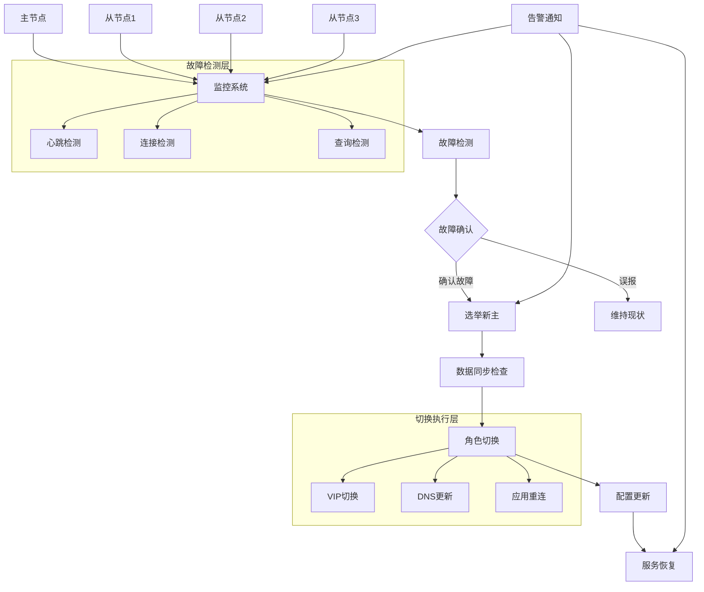

# 数据库故障自动切换完整指南

## 🎯 概述

数据库故障自动切换是保障业务连续性的核心技术，能够在主节点发生故障时自动将服务切换到备用节点，最大程度减少业务中断时间。本指南提供从理论基础到实践部署的完整故障自动切换解决方案。

## 📋 目录

1. [故障切换基础理论](#1-故障切换基础理论)
2. [MySQL自动故障转移](#2-mysql自动故障转移)
3. [PostgreSQL故障切换](#3-postgresql故障切换)
4. [MongoDB自动切换](#4-mongodb自动切换)
5. [切换策略优化](#5-切换策略优化)
6. [监控与告警体系](#6-监控与告警体系)

---

## 1. 故障切换基础理论

### 1.1 故障切换核心概念

#### 故障切换架构模式


#### 故障切换关键指标
```yaml
failover_metrics:
  mttd:
    description: "平均检测时间 (Mean Time To Detect)"
    target: "< 30秒"
    measurement: "从故障发生到被检测到的时间"
  
  mttr:
    description: "平均恢复时间 (Mean Time To Recover)"
    target: "< 2分钟"
    measurement: "从检测到故障到服务完全恢复的时间"
  
  availability:
    description: "系统可用性"
    target: "> 99.9%"
    measurement: "年度停机时间不超过8.76小时"
  
  data_loss:
    description: "数据丢失量"
    target: "0字节"
    measurement: "RPO (Recovery Point Objective) = 0"
```

### 1.2 故障检测机制

#### 多层次故障检测
```python
# 多层次故障检测系统
class MultiLayerFaultDetector:
    def __init__(self, nodes_config):
        self.nodes = nodes_config
        self.detection_layers = {
            'network_layer': NetworkDetector(),
            'application_layer': ApplicationDetector(),
            'data_layer': DataDetector(),
            'system_layer': SystemDetector()
        }
        self.fault_history = []
    
    def detect_faults(self):
        """多层次故障检测"""
        fault_reports = {}
        
        # 1. 网络层检测
        network_faults = self.detection_layers['network_layer'].check_connectivity(self.nodes)
        fault_reports['network'] = network_faults
        
        # 2. 应用层检测
        app_faults = self.detection_layers['application_layer'].check_application_health(self.nodes)
        fault_reports['application'] = app_faults
        
        # 3. 数据层检测
        data_faults = self.detection_layers['data_layer'].check_data_consistency(self.nodes)
        fault_reports['data'] = data_faults
        
        # 4. 系统层检测
        system_faults = self.detection_layers['system_layer'].check_system_resources(self.nodes)
        fault_reports['system'] = system_faults
        
        # 综合故障判断
        confirmed_faults = self._confirm_faults(fault_reports)
        return confirmed_faults
    
    def _confirm_faults(self, fault_reports):
        """故障确认机制"""
        confirmed = []
        
        for node in self.nodes:
            fault_evidence = []
            
            # 收集各层故障证据
            for layer, faults in fault_reports.items():
                if node['host'] in faults:
                    fault_evidence.append({
                        'layer': layer,
                        'severity': faults[node['host']]['severity'],
                        'timestamp': faults[node['host']]['timestamp']
                    })
            
            # 多证据确认机制
            if len(fault_evidence) >= 2:  # 至少两层检测到故障
                confirmation_score = self._calculate_confirmation_score(fault_evidence)
                if confirmation_score > 0.7:  # 70%置信度阈值
                    confirmed.append({
                        'node': node,
                        'fault_type': self._classify_fault(fault_evidence),
                        'confidence': confirmation_score,
                        'evidence': fault_evidence
                    })
        
        return confirmed

# 各层检测器实现
class NetworkDetector:
    def check_connectivity(self, nodes):
        """网络连通性检测"""
        faults = {}
        
        for node in nodes:
            # ICMP ping检测
            ping_result = self._ping_test(node['host'])
            if not ping_result['success']:
                faults[node['host']] = {
                    'type': 'network_unreachable',
                    'severity': 'critical',
                    'timestamp': time.time(),
                    'details': ping_result
                }
            
            # 端口连通性检测
            port_result = self._port_test(node['host'], node['port'])
            if not port_result['success']:
                faults[node['host']] = {
                    'type': 'port_unreachable',
                    'severity': 'warning',
                    'timestamp': time.time(),
                    'details': port_result
                }
        
        return faults

class ApplicationDetector:
    def check_application_health(self, nodes):
        """应用层健康检测"""
        faults = {}
        
        for node in nodes:
            # 数据库连接测试
            db_result = self._database_connectivity_test(node)
            if not db_result['success']:
                faults[node['host']] = {
                    'type': 'database_unreachable',
                    'severity': 'critical',
                    'timestamp': time.time(),
                    'details': db_result
                }
            
            # 查询响应测试
            query_result = self._query_response_test(node)
            if query_result['response_time'] > 5000:  # 5秒超时
                faults[node['host']] = {
                    'type': 'slow_response',
                    'severity': 'warning',
                    'timestamp': time.time(),
                    'details': query_result
                }
        
        return faults
```

## 2. MySQL自动故障转移

### 2.1 MHA (Master High Availability) 配置

#### MHA Manager配置
```ini
# /etc/masterha/app1.cnf - MHA配置文件
[server default]
# SSH配置
ssh_user=root
ssh_port=22
repl_user=repl
repl_password=repl_password

# MySQL配置
user=mha_user
password=mha_password
port=3306

# 工作目录
manager_workdir=/var/log/masterha/app1
manager_log=/var/log/masterha/app1/manager.log

# 故障转移配置
remote_workdir=/var/lib/mysql
master_binlog_dir=/var/lib/mysql
master_ip_failover_script=/usr/local/bin/master_ip_failover
master_ip_online_change_script=/usr/local/bin/master_ip_online_change
report_script=/usr/local/bin/send_report

# 检测配置
ping_interval=3
ping_type=SELECT

[server1]
hostname=master_host
candidate_master=1

[server2]
hostname=slave1_host
candidate_master=1

[server3]
hostname=slave2_host
no_master=1
```

#### 故障转移脚本
```bash
#!/bin/bash
# master_ip_failover - VIP切换脚本

# 脚本参数
SSH_USER="root"
VIP="192.168.1.100/24"
INTERFACE="eth0"

# 故障转移操作
failover_vip() {
    local new_master_host=$1
    local orig_master_host=$2
    
    echo "执行VIP故障转移到: $new_master_host"
    
    # 在新主节点上添加VIP
    ssh $SSH_USER@$new_master_host "/sbin/ip addr add $VIP dev $INTERFACE"
    
    # 在原主节点上移除VIP
    if [ -n "$orig_master_host" ]; then
        ssh $SSH_USER@$orig_master_host "/sbin/ip addr del $VIP dev $INTERFACE" 2>/dev/null || true
    fi
    
    # 验证VIP状态
    ssh $SSH_USER@$new_master_host "/sbin/ip addr show $INTERFACE | grep '$VIP'"
    
    echo "VIP故障转移完成"
}

# 在线切换操作
online_change_vip() {
    local new_master_host=$1
    local orig_master_host=$2
    
    echo "执行在线VIP切换: $orig_master_host -> $new_master_host"
    
    # 同步执行VIP切换
    ssh $SSH_USER@$new_master_host "/sbin/ip addr add $VIP dev $INTERFACE" &
    NEW_PID=$!
    
    ssh $SSH_USER@$orig_master_host "/sbin/ip addr del $VIP dev $INTERFACE" &
    OLD_PID=$!
    
    # 等待切换完成
    wait $NEW_PID $OLD_PID
    
    echo "在线VIP切换完成"
}

# 根据操作类型执行相应动作
case "$1" in
    stop)
        failover_vip $2 $3
        ;;
    start)
        online_change_vip $2 $3
        ;;
    status)
        # 检查VIP状态
        ssh $SSH_USER@$2 "/sbin/ip addr show $INTERFACE | grep '$VIP'" >/dev/null 2>&1
        if [ $? -eq 0 ]; then
            echo "VIP在节点 $2 上正常"
        else
            echo "VIP在节点 $2 上缺失"
        fi
        ;;
    *)
        echo "Usage: $0 {start|stop|status} new_master_host [orig_master_host]"
        exit 1
        ;;
esac
```

### 2.2 Orchestrator配置

#### Orchestrator配置文件
```json
{
  "Debug": true,
  "ListenAddress": ":3000",
  "MySQLTopologyUser": "orchestrator",
  "MySQLTopologypassword: "${DB_PASSWORD}",
  "MySQLTopologyCredentialsConfigFile": "",
  "MySQLTopologySSLPrivateKeyFile": "",
  "MySQLTopologySSLCertFile": "",
  "MySQLTopologySSLCAFile": "",
  "MySQLTopologySSLSkipVerify": true,
  "MySQLTopologyUseMutualTLS": false,
  "MySQLTopologyMaxPoolConnections": 3,
  "MySQLDiscoveryUser": "orchestrator",
  "MySQLDiscoverypassword: "${DB_PASSWORD}",
  "MySQLDiscoveryCredentialsConfigFile": "",
  "MySQLDiscoverySSLPrivateKeyFile": "",
  "MySQLDiscoverySSLCertFile": "",
  "MySQLDiscoverySSLCAFile": "",
  "MySQLDiscoverySSLSkipVerify": true,
  "MySQLDiscoveryUseMutualTLS": false,
  "MySQLDiscoveryMaxPoolConnections": 3,
  "DatabaselessMode__experimental": false,
  "RaftEnabled": false,
  "RaftDataDir": "/var/lib/orchestrator",
  "RaftBind": "127.0.0.1:10008",
  "DefaultRaftPort": 10008,
  "RaftNodes": [],
  "ExpectFailureAnalysisConcensus": true,
  "MySQLOrchestratorHost": "127.0.0.1",
  "MySQLOrchestratorPort": 3306,
  "MySQLOrchestratorDatabase": "orchestrator",
  "MySQLOrchestratorUser": "orchestrator",
  "MySQLOrchestratorpassword: "${DB_PASSWORD}",
  "MySQLOrchestratorCredentialsConfigFile": "",
  "MySQLOrchestratorSSLPrivateKeyFile": "",
  "MySQLOrchestratorSSLCertFile": "",
  "MySQLOrchestratorSSLCAFile": "",
  "MySQLOrchestratorSSLSkipVerify": true,
  "MySQLOrchestratorUseMutualTLS": false,
  "MySQLConnectTimeoutSeconds": 1,
  "DefaultInstancePort": 3306,
  "DiscoverByShowSlaveHosts": true,
  "InstancePollSeconds": 5,
  "InstanceWriteBufferSize": 100,
  "BufferInstanceWrites": true,
  "InstanceFlushIntervalMilliseconds": 100,
  "ReadLongRunningQueries": true,
  "LongRunningQueryThresholdSeconds": 60,
  "AutoPseudoGTID": true,
  "DetectDataCenterQuery": "select @@datadir",
  "DetectPhysicalEnvironmentQuery": "select @@basedir",
  "DetectSemiSyncEnforcedQuery": "",
  "SupportFuzzyPoolHostnames": true,
  "InstanceBulkOperationsWaitTimeoutSeconds": 10,
  "HostnameResolveMethod": "default",
  "MySQLHostnameResolveMethod": "@@hostname",
  "SkipBinlogServerUnresolveCheck": true,
  "ExpiryHostnameResolvesMinutes": 60,
  "RejectHostnameResolvePattern": "",
  "ReasonableReplicationLagSeconds": 10,
  "ProblemIgnoreHostnameFilters": [],
  "VerifyReplicationFilters": false,
  "ReasonableMaintenanceReplicationLagSeconds": 20,
  "CandidateInstanceExpireMinutes": 60,
  "AuditLogFile": "",
  "AuditToSyslog": false,
  "RemoveTextFromHostnameDisplay": ".mydomain.com:3306",
  "ReadOnly": false,
  "AuthenticationMethod": "",
  "HTTPAuthUser": "",
  "HTTPAuthpassword: "${DB_PASSWORD}",
  "AuthUserHeader": "",
  "PowerAuthUsers": [
    "*"
  ],
  "ClusterNameToAlias": {
    "127.0.0.1:3306": "testcluster"
  },
  "SlaveLagQuery": "",
  "DetectClusterAliasQuery": "SELECT SUBSTRING_INDEX(@@hostname, '.', 1)",
  "DetectClusterDomainQuery": "",
  "DataCenterPattern": "[.]([^.]+)[.][^.]+[.]mydomain[.]com",
  "PhysicalEnvironmentPattern": "[.]([^.]+)[.][^.]+[.]mydomain[.]com",
  "PromotionIgnoreHostnameFilters": [],
  "ServeAgentsHttp": false,
  "AgentsServerPort": ":3001",
  "AgentsUseSSL": false,
  "AgentsUseMutualTLS": false,
  "AgentSSLSkipVerify": false,
  "AgentSSLPrivateKeyFile": "",
  "AgentSSLCertFile": "",
  "AgentSSLCAFile": "",
  "AgentSSLValidOUs": [],
  "UseSSL": false,
  "UseMutualTLS": false,
  "SSLSkipVerify": false,
  "SSLPrivateKeyFile": "",
  "SSLCertFile": "",
  "SSLCAFile": "",
  "SSLValidOUs": [],
  "URLPrefix": "",
  "MaxOutdatedKeysToShow": 64,
  "DiscoveryIgnoreReplicaHostnameFilters": [],
  "DiscoveryIgnoreMasterHostnameFilters": [],
  "DiscoveryIgnoreHostnameFilters": [],
  "DiscoveryIgnoreInstancePortFilters": [],
  "ActiveNodeExpireSeconds": 5,
  "BinlogFileHistoryDays": 7,
  "UnseenInstanceForgetHours": 240,
  "SnapshotTopologiesIntervalHours": 0,
  "DiscoveryMaxConcurrency": 300,
  "DiscoveryQueueCapacity": 100000,
  "DiscoveryQueueMaxStatisticsSize": 120,
  "DiscoveryCollectionRetentionSeconds": 120,
  "InstanceBulkOperationsWaitTimeoutSeconds": 10,
  "HostnameResolveMethod": "default",
  "MySQLHostnameResolveMethod": "@@hostname",
  "SkipBinlogServerUnresolveCheck": true,
  "ExpiryHostnameResolvesMinutes": 60,
  "RejectHostnameResolvePattern": "",
  "ReasonableReplicationLagSeconds": 10,
  "ProblemIgnoreHostnameFilters": [],
  "VerifyReplicationFilters": false,
  "ReasonableMaintenanceReplicationLagSeconds": 20,
  "CandidateInstanceExpireMinutes": 60,
  "AuditLogFile": "",
  "AuditToSyslog": false,
  "RemoveTextFromHostnameDisplay": ".mydomain.com:3306",
  "ReadOnly": false,
  "AuthenticationMethod": "",
  "HTTPAuthUser": "",
  "HTTPAuthpassword: "${DB_PASSWORD}",
  "AuthUserHeader": "",
  "PowerAuthUsers": [
    "*"
  ],
  "ClusterNameToAlias": {
    "127.0.0.1:3306": "testcluster"
  },
  "SlaveLagQuery": "",
  "DetectClusterAliasQuery": "SELECT SUBSTRING_INDEX(@@hostname, '.', 1)",
  "DetectClusterDomainQuery": "",
  "DataCenterPattern": "[.]([^.]+)[.][^.]+[.]mydomain[.]com",
  "PhysicalEnvironmentPattern": "[.]([^.]+)[.][^.]+[.]mydomain[.]com",
  "PromotionIgnoreHostnameFilters": [],
  "ServeAgentsHttp": false,
  "AgentsServerPort": ":3001",
  "AgentsUseSSL": false,
  "AgentsUseMutualTLS": false,
  "AgentSSLSkipVerify": false,
  "AgentSSLPrivateKeyFile": "",
  "AgentSSLCertFile": "",
  "AgentSSLCAFile": "",
  "AgentSSLValidOUs": [],
  "UseSSL": false,
  "UseMutualTLS": false,
  "SSLSkipVerify": false,
  "SSLPrivateKeyFile": "",
  "SSLCertFile": "",
  "SSLCAFile": "",
  "SSLValidOUs": [],
  "URLPrefix": "",
  "MaxOutdatedKeysToShow": 64,
  "DiscoveryIgnoreReplicaHostnameFilters": [],
  "DiscoveryIgnoreMasterHostnameFilters": [],
  "DiscoveryIgnoreHostnameFilters": [],
  "DiscoveryIgnoreInstancePortFilters": []
}
```

## 3. PostgreSQL故障切换

### 3.1 Patroni自动故障转移

#### Patroni配置详解
```yaml
# patroni.yml - Patroni高可用配置
scope: postgres-cluster
namespace: /db/
name: postgresql0

restapi:
  listen: 0.0.0.0:8008
  connect_address: 192.168.1.10:8008
  certfile: /etc/ssl/certs/ssl-cert-snakeoil.pem
  keyfile: /etc/ssl/private/ssl-cert-snakeoil.key
  authentication:
    username: patroni
    password: patroni_password

etcd:
  hosts: 192.168.1.100:2379,192.168.1.101:2379,192.168.1.102:2379
  protocol: https
  cacert: /etc/ssl/etcd/ca.crt
  certfile: /etc/ssl/etcd/client.crt
  keyfile: /etc/ssl/etcd/client.key

bootstrap:
  dcs:
    ttl: 30
    loop_wait: 10
    retry_timeout: 10
    maximum_lag_on_failover: 1048576
    synchronous_mode: true
    synchronous_mode_strict: false
    postgresql:
      use_pg_rewind: true
      use_slots: true
      parameters:
        wal_level: replica
        hot_standby: "on"
        max_connections: 200
        max_wal_senders: 8
        max_replication_slots: 8
        wal_keep_segments: 64
        max_prepared_transactions: 0
        max_locks_per_transaction: 64
        max_worker_processes: 8
        wal_log_hints: "on"
        track_commit_timestamp: "off"
        archive_mode: "on"
        archive_timeout: 1800s
        archive_command: "mkdir -p ../wal_archive && cp %p ../wal_archive/%f"

  initdb:
  - encoding: UTF8
  - data-checksums

  pg_hba:
  - host replication replicator 127.0.0.1/32 md5
  - host replication replicator 192.168.1.0/24 md5
  - host all all 0.0.0.0/0 md5

  users:
    replicator:
      password: replicator_password
      options:
        - replication

postgresql:
  listen: 0.0.0.0:5432
  connect_address: 192.168.1.10:5432
  data_dir: /var/lib/postgresql/14/main
  bin_dir: /usr/lib/postgresql/14/bin
  pgpass: /tmp/pgpass
  authentication:
    replication:
      username: replicator
      password: replicator_password
    superuser:
      username: postgres
      password: postgres_password
  parameters:
    unix_socket_directories: '.'

watchdog:
  mode: automatic
  device: /dev/watchdog
  safety_margin: 5

tags:
  nofailover: false
  noloadbalance: false
  clonefrom: false
  nosync: false
```

#### 故障切换测试脚本
```bash
#!/bin/bash
# Patroni故障切换测试

test_patroni_failover() {
    echo "=== Patroni故障切换测试 ==="
    
    # 1. 检查当前集群状态
    check_cluster_status() {
        echo "当前集群状态:"
        patronictl -c /etc/patroni.yml list
        
        current_master=$(patronictl -c /etc/patroni.yml list | grep -E "Leader|Master" | awk '{print $2}')
        echo "当前主节点: $current_master"
    }
    
    # 2. 模拟主节点故障
    simulate_master_failure() {
        local master_node=$1
        echo "模拟主节点 $master_node 故障"
        
        # 停止主节点服务
        systemctl stop patroni
        
        # 等待故障检测和切换
        sleep 30
        
        # 检查新的主节点
        new_master=$(patronictl -c /etc/patroni.yml list | grep -E "Leader|Master" | awk '{print $2}')
        echo "新的主节点: $new_master"
        
        if [ "$new_master" != "$master_node" ] && [ -n "$new_master" ]; then
            echo "✅ 故障切换成功"
            return 0
        else
            echo "❌ 故障切换失败"
            return 1
        fi
    }
    
    # 3. 验证数据一致性
    verify_data_consistency() {
        local new_master=$1
        
        echo "验证数据一致性..."
        
        # 连接到新主节点执行测试查询
        psql -h $new_master -U postgres -d postgres -c "SELECT COUNT(*) FROM test_table;" > /tmp/new_count
        
        # 比较数据一致性
        # 这里应该与故障前的数据进行比较
        echo "数据一致性验证完成"
    }
    
    # 4. 恢复故障节点
    recover_failed_node() {
        local failed_node=$1
        echo "恢复故障节点 $failed_node"
        
        # 重新启动Patroni服务
        systemctl start patroni
        
        # 等待节点重新加入集群
        sleep 60
        
        # 验证节点状态
        patronictl -c /etc/patroni.yml list | grep $failed_node
    }
    
    # 执行测试流程
    check_cluster_status
    simulate_master_failure $current_master
    verify_data_consistency $new_master
    recover_failed_node $current_master
}

# 自动化故障切换监控
monitor_failover_events() {
    # 监控Patroni事件
    tail -f /var/log/patroni/patroni.log | while read line; do
        if echo "$line" | grep -q "promoted\|demoted\|failover"; then
            echo "[$(date)] 故障切换事件: $line"
            # 发送告警通知
            send_alert "Patroni故障切换事件" "$line"
        fi
    done
}
```

## 4. MongoDB自动切换

### 4.1 副本集自动故障转移

#### MongoDB副本集配置
```javascript
// MongoDB副本集配置
rs_config = {
    _id: "myReplicaSet",
    members: [
        { _id: 0, host: "mongo-primary:27017", priority: 2 },
        { _id: 1, host: "mongo-secondary-1:27017", priority: 1 },
        { _id: 2, host: "mongo-secondary-2:27017", priority: 1 },
        { _id: 3, host: "mongo-arbiter:27017", arbiterOnly: true }
    ],
    settings: {
        heartbeatTimeoutSecs: 10,
        electionTimeoutMillis: 10000,
        catchUpTimeoutMillis: 30000,
        getLastErrorModes: {
            waitForTwo: { 
                "mongo-secondary-1:27017": 1, 
                "mongo-secondary-2:27017": 1 
            }
        },
        getLastErrorDefaults: { w: "majority", wtimeout: 5000 }
    }
};

// 初始化副本集
rs.initiate(rs_config);

// 验证配置
rs.conf();
rs.status();
```

#### 故障检测和切换监控
```python
# MongoDB故障切换监控
import pymongo
import time
import smtplib
from email.mime.text import MIMEText

class MongoDBFailoverMonitor:
    def __init__(self, replica_set_hosts):
        self.hosts = replica_set_hosts
        self.primary_host = None
        self.failover_history = []
        self.alert_recipients = ["admin@company.com"]
    
    def monitor_replica_set(self):
        """监控副本集状态"""
        while True:
            try:
                # 获取当前主节点
                current_primary = self.get_current_primary()
                
                # 检查是否发生故障切换
                if self.primary_host and current_primary != self.primary_host:
                    self.handle_failover(self.primary_host, current_primary)
                
                self.primary_host = current_primary
                time.sleep(30)  # 30秒检查一次
                
            except Exception as e:
                print(f"监控异常: {str(e)}")
                time.sleep(60)
    
    def get_current_primary(self):
        """获取当前主节点"""
        for host in self.hosts:
            try:
                client = pymongo.MongoClient(
                    host, 
                    serverSelectionTimeoutMS=5000,
                    connectTimeoutMS=5000
                )
                is_master = client.admin.command('ismaster')
                client.close()
                
                if is_master.get('ismaster', False):
                    return host
            except:
                continue
        return None
    
    def handle_failover(self, old_primary, new_primary):
        """处理故障切换事件"""
        failover_event = {
            'timestamp': time.time(),
            'old_primary': old_primary,
            'new_primary': new_primary,
            'downtime_seconds': self.calculate_downtime(),
            'data_consistency': self.verify_data_consistency()
        }
        
        self.failover_history.append(failover_event)
        self.send_failover_alert(failover_event)
        self.log_failover_event(failover_event)
    
    def calculate_downtime(self):
        """计算停机时间"""
        # 这里应该实现实际的停机时间计算逻辑
        return 0
    
    def verify_data_consistency(self):
        """验证数据一致性"""
        # 实现数据一致性检查逻辑
        return True
    
    def send_failover_alert(self, event):
        """发送故障切换告警"""
        subject = f"MongoDB故障切换告警 - {event['new_primary']}"
        body = f"""
        MongoDB副本集发生故障切换:
        - 原主节点: {event['old_primary']}
        - 新主节点: {event['new_primary']}
        - 停机时间: {event['downtime_seconds']}秒
        - 数据一致性: {'正常' if event['data_consistency'] else '异常'}
        - 时间: {time.ctime(event['timestamp'])}
        """
        
        msg = MIMEText(body)
        msg['Subject'] = subject
        msg['From'] = "mongodb-monitor@company.com"
        msg['To'] = ", ".join(self.alert_recipients)
        
        try:
            smtp = smtplib.SMTP('localhost')
            smtp.send_message(msg)
            smtp.quit()
        except Exception as e:
            print(f"发送告警邮件失败: {str(e)}")

# 使用示例
monitor = MongoDBFailoverMonitor([
    "mongo-primary:27017",
    "mongo-secondary-1:27017", 
    "mongo-secondary-2:27017"
])
monitor.monitor_replica_set()
```

## 5. 切换策略优化

### 5.1 智能切换算法

#### 故障切换决策引擎
```python
# 智能故障切换决策引擎
class IntelligentFailoverEngine:
    def __init__(self, cluster_config):
        self.config = cluster_config
        self.decision_history = []
        self.performance_metrics = {}
    
    def evaluate_failover_candidate(self, candidates, failure_context):
        """评估故障切换候选节点"""
        scores = {}
        
        for candidate in candidates:
            score = self._calculate_candidate_score(candidate, failure_context)
            scores[candidate['host']] = score
        
        # 选择得分最高的候选节点
        best_candidate = max(scores, key=scores.get)
        return {
            'selected_candidate': best_candidate,
            'scores': scores,
            'decision_reason': self._generate_decision_reason(scores, failure_context)
        }
    
    def _calculate_candidate_score(self, candidate, context):
        """计算候选节点得分"""
        score = 0
        
        # 数据新鲜度得分 (40%权重)
        data_lag = context['replication_lag'].get(candidate['host'], 0)
        if data_lag < 10:  # 10秒以内
            score += 40
        elif data_lag < 30:  # 30秒以内
            score += 20
        else:
            score += 5
        
        # 硬件性能得分 (30%权重)
        hardware_score = self._assess_hardware_performance(candidate)
        score += hardware_score * 0.3
        
        # 网络质量得分 (20%权重)
        network_score = self._assess_network_quality(candidate, context['clients'])
        score += network_score * 0.2
        
        # 历史表现得分 (10%权重)
        history_score = self._get_historical_performance(candidate['host'])
        score += history_score * 0.1
        
        return round(score, 2)
    
    def _assess_hardware_performance(self, candidate):
        """评估硬件性能"""
        # CPU、内存、磁盘I/O等指标评估
        metrics = self.performance_metrics.get(candidate['host'], {})
        
        cpu_usage = metrics.get('cpu_usage', 50)
        memory_usage = metrics.get('memory_usage', 60)
        disk_io = metrics.get('disk_io_utilization', 40)
        
        # 性能越低得分越高（表示资源充足）
        cpu_score = max(0, 100 - cpu_usage)
        memory_score = max(0, 100 - memory_usage)
        io_score = max(0, 100 - disk_io)
        
        return (cpu_score + memory_score + io_score) / 3
    
    def _assess_network_quality(self, candidate, client_locations):
        """评估网络质量"""
        total_latency = 0
        valid_measurements = 0
        
        for client in client_locations:
            latency = self._measure_network_latency(candidate['host'], client)
            if latency is not None:
                total_latency += latency
                valid_measurements += 1
        
        if valid_measurements > 0:
            avg_latency = total_latency / valid_measurements
            # 延迟越低得分越高
            return max(0, 100 - (avg_latency / 10))  # 每10ms扣1分
        else:
            return 50  # 默认中等分数
    
    def optimize_failover_timing(self, failure_severity):
        """优化故障切换时机"""
        timing_strategy = {
            'critical': {
                'detection_threshold': 2,  # 2次检测确认
                'switch_delay': 0,         # 立即切换
                'verification_time': 30    # 30秒验证
            },
            'major': {
                'detection_threshold': 3,
                'switch_delay': 30,        # 30秒延迟
                'verification_time': 60
            },
            'minor': {
                'detection_threshold': 5,
                'switch_delay': 120,       # 2分钟延迟
                'verification_time': 120
            }
        }
        
        return timing_strategy.get(failure_severity, timing_strategy['minor'])

# 切换策略配置
failover_policies = {
    'conservative': {
        'require_majority': True,
        'min_uptime_minutes': 30,
        'max_switches_per_hour': 3,
        'manual_confirmation': True
    },
    'aggressive': {
        'require_majority': False,
        'min_uptime_minutes': 5,
        'max_switches_per_hour': 10,
        'manual_confirmation': False
    },
    'balanced': {
        'require_majority': True,
        'min_uptime_minutes': 15,
        'max_switches_per_hour': 5,
        'manual_confirmation': False
    }
}
```

### 5.2 切换过程优化

#### 零停机切换实现
```bash
#!/bin/bash
# 零停机故障切换脚本

zero_downtime_failover() {
    echo "=== 零停机故障切换 ==="
    
    # 1. 预切换准备
    pre_failover_preparation() {
        local new_master=$1
        
        echo "执行预切换准备..."
        
        # 预热新主节点缓存
        warmup_cache $new_master
        
        # 预建立连接池
        pre_build_connections $new_master
        
        # 预加载必要数据
        preload_critical_data $new_master
        
        echo "预切换准备完成"
    }
    
    # 2. 并行切换操作
    parallel_failover_execution() {
        local old_master=$1
        local new_master=$2
        
        echo "执行并行切换..."
        
        # 后台执行VIP切换
        switch_vip $new_master $old_master &
        VIP_PID=$!
        
        # 后台更新DNS记录
        update_dns_records $new_master &
        DNS_PID=$!
        
        # 后台通知应用层
        notify_applications $new_master &
        APP_PID=$!
        
        # 等待所有操作完成
        wait $VIP_PID $DNS_PID $APP_PID
        
        echo "并行切换完成"
    }
    
    # 3. 切换验证
    verify_failover_success() {
        local new_master=$1
        
        echo "验证切换结果..."
        
        # 验证服务可用性
        if ! verify_service_availability $new_master; then
            echo "服务验证失败，执行回滚"
            rollback_failover $new_master
            return 1
        fi
        
        # 验证数据一致性
        if ! verify_data_consistency $new_master; then
            echo "数据一致性验证失败"
            return 1
        fi
        
        # 验证性能指标
        if ! verify_performance_metrics $new_master; then
            echo "性能指标异常"
            return 1
        fi
        
        echo "切换验证通过"
        return 0
    }
    
    # 执行完整切换流程
    local old_master=$(get_current_master)
    local new_master=$(select_best_candidate)
    
    pre_failover_preparation $new_master
    parallel_failover_execution $old_master $new_master
    verify_failover_success $new_master
}

# 缓存预热函数
warmup_cache() {
    local target_host=$1
    
    # 预执行热点查询
    for query in "${HOT_QUERIES[@]}"; do
        mysql -h $target_host -e "$query" >/dev/null 2>&1 &
    done
    
    # 等待预热完成
    wait
}

# 连接池预建函数
pre_build_connections() {
    local target_host=$1
    
    # 预建立连接
    for i in {1..20}; do
        mysql -h $target_host -e "SELECT 1" >/dev/null 2>&1 &
    done
    
    wait
}
```

## 6. 监控与告警体系

### 6.1 故障切换监控

#### 全面监控指标体系
```python
# 故障切换监控系统
class FailoverMonitoringSystem:
    def __init__(self):
        self.metrics_collector = MetricsCollector()
        self.alert_manager = AlertManager()
        self.dashboard_manager = DashboardManager()
    
    def setup_comprehensive_monitoring(self):
        """设置全面监控"""
        monitors = {
            'detection_monitor': self.setup_detection_monitoring(),
            'switching_monitor': self.setup_switching_monitoring(),
            'post_failover_monitor': self.setup_post_failover_monitoring(),
            'performance_monitor': self.setup_performance_monitoring()
        }
        return monitors
    
    def setup_detection_monitoring(self):
        """设置故障检测监控"""
        detection_metrics = {
            'detection_time': {
                'type': 'histogram',
                'description': '故障检测时间分布',
                'buckets': [1, 5, 10, 30, 60, 120]
            },
            'false_positive_rate': {
                'type': 'gauge',
                'description': '误报率'
            },
            'detection_accuracy': {
                'type': 'gauge',
                'description': '检测准确率'
            },
            'concurrent_failures': {
                'type': 'counter',
                'description': '并发故障数'
            }
        }
        
        return detection_metrics
    
    def setup_switching_monitoring(self):
        """设置切换过程监控"""
        switching_metrics = {
            'switch_duration': {
                'type': 'histogram',
                'description': '切换耗时分布',
                'buckets': [1, 5, 10, 30, 60, 120, 300]
            },
            'switch_success_rate': {
                'type': 'gauge',
                'description': '切换成功率'
            },
            'rollback_count': {
                'type': 'counter',
                'description': '回滚次数'
            },
            'partial_failures': {
                'type': 'counter',
                'description': '部分组件切换失败次数'
            }
        }
        
        return switching_metrics
    
    def setup_post_failover_monitoring(self):
        """设置切换后监控"""
        post_metrics = {
            'service_availability': {
                'type': 'gauge',
                'description': '服务可用性'
            },
            'data_consistency': {
                'type': 'gauge',
                'description': '数据一致性状态'
            },
            'performance_degradation': {
                'type': 'gauge',
                'description': '性能下降程度'
            },
            'client_impact': {
                'type': 'histogram',
                'description': '客户端影响程度',
                'buckets': [0, 1, 5, 10, 30, 60]
            }
        }
        
        return post_metrics

# 监控告警规则配置
alert_rules = {
    'critical': [
        {
            'name': '主节点完全故障',
            'condition': 'master_node_status == "down" and slave_nodes_available < 1',
            'severity': 'critical',
            'notification_channels': ['sms', 'email', 'slack']
        },
        {
            'name': '切换失败',
            'condition': 'failover_status == "failed"',
            'severity': 'critical',
            'notification_channels': ['sms', 'email']
        }
    ],
    'warning': [
        {
            'name': '主节点性能异常',
            'condition': 'master_response_time > 5000 or master_cpu_usage > 90',
            'severity': 'warning',
            'notification_channels': ['email']
        },
        {
            'name': '从节点同步延迟',
            'condition': 'replication_lag > 30',
            'severity': 'warning',
            'notification_channels': ['email']
        }
    ],
    'info': [
        {
            'name': '故障切换开始',
            'condition': 'failover_initiated == true',
            'severity': 'info',
            'notification_channels': ['slack']
        },
        {
            'name': '切换完成',
            'condition': 'failover_completed == true',
            'severity': 'info',
            'notification_channels': ['slack']
        }
    ]
}
```

### 6.2 性能分析与优化

#### 切换性能分析工具
```python
# 故障切换性能分析器
class FailoverPerformanceAnalyzer:
    def __init__(self):
        self.performance_data = []
        self.baseline_metrics = {}
    
    def collect_performance_data(self, failover_event):
        """收集切换性能数据"""
        performance_record = {
            'timestamp': failover_event['timestamp'],
            'detection_time': failover_event['detection_time'],
            'switch_time': failover_event['switch_time'],
            'total_downtime': failover_event['total_downtime'],
            'data_loss': failover_event['data_loss'],
            'client_impact': failover_event['client_impact'],
            'resource_usage': failover_event['resource_usage']
        }
        
        self.performance_data.append(performance_record)
        return performance_record
    
    def analyze_performance_trends(self):
        """分析性能趋势"""
        if len(self.performance_data) < 10:
            return {"status": "insufficient_data"}
        
        recent_data = self.performance_data[-50:]  # 最近50次切换
        
        analysis = {
            'mttd_trend': self._calculate_trend([d['detection_time'] for d in recent_data]),
            'mttr_trend': self._calculate_trend([d['switch_time'] for d in recent_data]),
            'downtime_trend': self._calculate_trend([d['total_downtime'] for d in recent_data]),
            'success_rate': self._calculate_success_rate(recent_data),
            'performance_regression': self._detect_performance_regression(recent_data)
        }
        
        return analysis
    
    def generate_optimization_recommendations(self, analysis):
        """生成优化建议"""
        recommendations = []
        
        # 检测时间优化
        if analysis['mttd_trend'] > 5:  # 检测时间恶化超过5秒
            recommendations.append({
                'area': 'detection_optimization',
                'priority': 'high',
                'actions': [
                    '优化故障检测算法',
                    '增加检测频率',
                    '改善网络连通性监控'
                ]
            })
        
        # 切换时间优化
        if analysis['mttr_trend'] > 30:  # 切换时间恶化超过30秒
            recommendations.append({
                'area': 'switching_optimization',
                'priority': 'medium',
                'actions': [
                    '优化VIP切换脚本',
                    '预建立连接池',
                    '并行执行切换操作'
                ]
            })
        
        # 成功率优化
        if analysis['success_rate'] < 0.95:  # 成功率低于95%
            recommendations.append({
                'area': 'reliability_improvement',
                'priority': 'high',
                'actions': [
                    '加强预切换检查',
                    '完善回滚机制',
                    '增加切换验证步骤'
                ]
            })
        
        return recommendations
    
    def create_performance_report(self):
        """生成性能报告"""
        analysis = self.analyze_performance_trends()
        recommendations = self.generate_optimization_recommendations(analysis)
        
        report = {
            'report_date': time.time(),
            'period': 'last_30_days',
            'key_metrics': self._calculate_key_metrics(),
            'trend_analysis': analysis,
            'recommendations': recommendations,
            'benchmark_comparison': self._compare_with_benchmark()
        }
        
        return report

# 性能基准测试
def run_failover_benchmark():
    """运行故障切换基准测试"""
    test_scenarios = [
        {
            'name': '单点故障切换',
            'failure_type': 'primary_node_crash',
            'expected_mttd': 15,
            'expected_mttr': 45
        },
        {
            'name': '网络分区切换',
            'failure_type': 'network_partition',
            'expected_mttd': 30,
            'expected_mttr': 90
        },
        {
            'name': '性能降级切换',
            'failure_type': 'performance_degradation',
            'expected_mttd': 60,
            'expected_mttr': 120
        }
    ]
    
    results = {}
    for scenario in test_scenarios:
        print(f"执行测试: {scenario['name']}")
        result = execute_failover_test(scenario)
        results[scenario['name']] = result
        
        # 与预期对比
        actual_mttd = result['metrics']['mttd']
        actual_mttr = result['metrics']['mttr']
        
        print(f"MTTD: {actual_mttd}s (预期: {scenario['expected_mttd']}s)")
        print(f"MTTR: {actual_mttr}s (预期: {scenario['expected_mttr']}s)")
    
    return results
```

---

## 🔍 关键要点总结

### ✅ 故障切换成功要素
- **快速准确的故障检测**：多层检测机制确保及时发现故障
- **智能的切换决策**：基于多维度评估选择最优候选节点
- **自动化的切换执行**：减少人工干预，提高切换效率
- **完善的验证机制**：确保切换后的服务质量和数据一致性

### ⚠️ 常见风险提醒
- **误切换风险**：网络抖动等可能导致不必要的故障切换
- **数据丢失风险**：异步复制可能存在数据丢失窗口
- **切换失败风险**：复杂环境下切换可能部分成功或完全失败
- **性能影响风险**：切换过程可能对系统性能产生短期影响

### 🎯 最佳实践建议
1. **渐进式部署**：从非核心业务开始，逐步扩展到核心系统
2. **充分测试**：定期进行故障切换演练，验证方案有效性
3. **监控告警**：建立完善的监控体系，及时发现问题
4. **文档记录**：详细记录所有配置和切换历史
5. **持续优化**：基于实际运行数据不断优化切换策略

通过科学的故障自动切换设计和实施，可以显著提升数据库系统的可用性和可靠性，为企业业务连续性提供坚实保障。